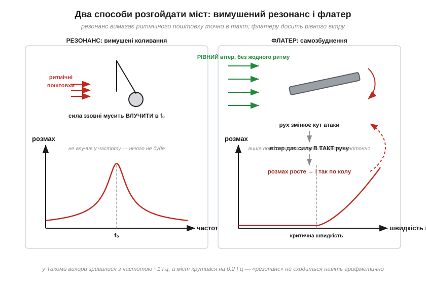

# 📜 Міст Такома-Нерроуз (1940): чому «класичний приклад резонансу» — не резонанс

> Це історична вставка до теми [2.3.6 «Добротність Q і смуга»](ch09-reactance-resonance.md). Кадри моста, що скручується гігантськими хвилями й падає в протоку, бачив кожен, хто хоч раз чув слово «резонанс»: десятиліттями підручники подавали Такому як його хрестоматійну ілюстрацію. Історія справді чудова — але вона про **інше** явище. Розібратися, чому міст упав насправді, варто двічі: по-перше, це красива фізика, що споріднена з генераторами й самозбудженням підсилювачів; по-друге, це чесний урок про те, як зручне пояснення перемагає правильне — і скільки коштує таке спрощення.

*Рис. 2.3.6i.1. Вимушений резонанс (ліворуч) потребує зовнішньої сили, що б'є точно в такт власній частоті, — як рука, що штовхає гойдалку. Флатер (праворуч) не потребує жодного ритму ззовні: сам рух конструкції змінює аеродинамічну силу так, що вона підживлює рух, — петля зворотного зв'язку, що краде енергію в рівного вітру. У Такоми навіть арифметика проти резонансу: вихорі зривалися на ~1 Гц, а міст крутився на 0.2 Гц.*

## Міст, що галопував від народження

Влітку 1940 року через протоку Такома-Нерроуз у штаті Вашингтон відкрили третій за довжиною підвісний міст світу. Проєктував його Леон Моїссеїфф (*Leon Moisseiff*) — один із найавторитетніших мостобудівників Америки, співавтор розрахунків Мангеттенського й Золотоворітського мостів. Його школа сповідувала елегантність: що стрункіше, то краще. Такомський міст вийшов рекордно вузьким і гнучким — двосмугова стрічка завширшки лише 12 метрів на прогоні 853 метри, — а замість ажурних ферм під полотном поставили суцільні сталеві балки-стінки. Це було красиво, дешево — і, як з'ясується, фатально: суцільна стінка ловила вітер, як вітрило, а гнучка конструкція мала вкрай мало згасання. Мовою нашого розділу — це була механічна система з **високою добротністю**: розгойдай — і гойдатиметься довго.

Гойдатися міст почав ще до відкриття. Робітники прозвали його «Галопуюча Герті» (*Galloping Gertie*): за помірного вітру полотном бігли плавні вертикальні хвилі, часом до метра заввишки. Дивовижно, але це нікого по-справжньому не налякало: хвилі були пологі, авто проїжджали, а інженери вже випробовували заспокійливі заходи — відтяжки, гідравлічні буфери. Професор Вашингтонського університету Фредерік Фаркухарсон (*Frederick Burt Farquharson*) будував модель моста в аеродинамічній трубі й шукав ліки. Міст став місцевою атракцією: дехто спеціально приїздив покататися на «хвилях».

## 7 листопада 1940 року

Того ранку вітер у протоці розігнався до ~68 км/год — не буря, звичайний сильний вітер. Спершу міст гойдався знайомими вертикальними хвилями. А близько десятої сталося те, чого ніхто раніше не бачив: рух раптово перемкнувся в **крутильну** моду. Полотно почало скручуватися навколо власної осі з частотою близько 0.2 Гц — один повний оберт гойдання за п'ять секунд, — і кут перекосу сягав 45°: один край смуги злітав на кілька метрів угору, поки протилежний падав униз.

На мосту в цей час застряг журналіст Леонард Котсворт: його авто кидало від перил до перил, і він вибрався до берега навкарачки, покинувши в салоні спанієля Таббі. Пес, єдина жертва катастрофи, так і лишився в машині — врятувати його не вдалося. Фаркухарсон, що прибув із кіноапаратом, холоднокровно знімав і вимірював: саме його плівка стала тими самими «кадрами з підручника» — і безцінним науковим документом. Близько одинадцятої не витримав один із підвісних елементів, навантаження розбалансувалося, і центральний прогін шматками посипався у воду. Через чотири місяці помер і Моїссеїфф — колеги казали, що катастрофа його зламала.

## Версія підручників: «вітер потрапив у резонанс»

Пояснення, що розійшлося по книжках, звучало гладко. Вітер, обтікаючи перешкоду, зриває з неї **вихори** — почергово згори й знизу, з певною частотою. Виходить періодична сила; якщо її частота збіглася з власною частотою моста — вимушений резонанс, амплітуда наростає, міст руйнується. Усе як у нашого контуру: зовнішній сигнал влучив у f₀ ([§2.3.5](ch09-reactance-resonance.md)) — і відгук злетів у Q разів.

Пояснення спокусливе: воно коротке, спирається на справжнє явище (вихорова доріжка існує і справді трясе димарі та дроти) і чудово пасує до драматичних кадрів. Одна біда — у випадку Такоми воно не витримує перевірки числами.

## Чому резонанс не складається

Перший удар — арифметика. Частоту зриву вихорів легко оцінити з розмірів полотна і швидкості вітру: для Такоми того ранку виходить близько **1 Гц**. А міст крутився на **0.2 Гц** — уп'ятеро повільніше. Періодична сила на 1 Гц не може резонансно розгойдати моду на 0.2 Гц — це все одно що штовхати гойдалку вп'ятеро частіше за її ритм: поштовхи лише заважатимуть одне одному ([§2.3.5](ch09-reactance-resonance.md): гойдалка слухає тільки свій такт).

Другий удар — поведінка. Вимушений резонанс — це **вузький пік за частотою**: трохи змінився вітер — змінилася частота вихорів — розгойдування мало б зникнути. Натомість спостереження показували інше: вище певної швидкості вітру крутильний рух наростав **монотонно зі швидкістю**, не питаючи жодного «такту». І третє: звідки взагалі взялася крутильна мода, якої місяцями не було? Класичний резонанс не пояснює ні появи нової форми руху, ні її жорстокості.

Крапку в публічній дискусії поставила стаття інженерів К. Білла і Р. Сканлана (*K. Billah, R. Scanlan*, 1991) з промовистою назвою — про Такому, резонанс і університетські підручники. Сканлан, один із батьків мостової аеродинаміки, показав: механізм катастрофи — **не вимушений резонанс**, а аеропружний **флатер** (*flutter*).

## Флатер: коливання, що годують самі себе

Ось серце історії. У флатері немає зовнішньої періодичної сили — є **петля зворотного зв'язку** між рухом конструкції й потоком. Полотно трохи крутнулося — змінився кут, під яким його обтікає вітер, — змінилася аеродинамічна сила — і, за нещасливої геометрії (та сама суцільна балка-стінка!), ця сила виявляється спрямованою **в такт рухові**: підкручує полотно саме туди, куди воно й так рухається. Кожне коливання саме собі підкачує енергію з рівного, зовсім не ритмічного вітру.

Мовою нашого розділу це означає дещо разюче. Згасання системи — те, що тримає Q скінченною, — стає **від'ємним**: замість втрачати частку енергії за цикл ([§2.3.6m](ch09-s6-m-q-factor.md)) система щоциклу її **набирає**. А коливальна система з від'ємними втратами — це вже не фільтр і не маятник, це **генератор**: будь-яке мікроскопічне тремтіння наростає експоненційно, поки щось не зламається. Саме тому в флатера є **критична швидкість** вітру: нижче неї аеродинамічна «підкачка» слабша за природні втрати — коливання гаснуть; вище — петля стає самопідтримною. Той ранковий вітер просто вперше перетнув цей поріг для крутильної моди.

Самозбудження від рівного потоку — явище звичне: так співає скрипкова струна під рівним рухом смичка, свистить свисток, деренчить погано закріплений щиток на трасі. А в електроніці це рідний брат **самозбудження підсилювача**: варто частці вихідного сигналу потрапити назад на вхід у фазі — і схема з підсилювача перетворюється на генератор, що верещить без жодного вхідного сигналу (зворотний зв'язок ми зустрінемо впритул у розділі про операційні підсилювачі). Флатер — це «свист» моста.

Чесності заради: інженерні дискусії про тонкощі механізму — яку роль у **запуску** крутильної моди зіграли вихори, як саме зв'язалися вертикальний і крутильний рухи — тривають у спеціальній літературі донині. Але головний вирок усталений: це було самозбудження, а не вимушений резонанс, і амплітуда росла зі швидкістю вітру, а не з влучанням у частоту.

## Спадок: труба для кожного моста

Катастрофа Такоми зробила для мостобудування те, що «конденсаторна чума» — для електроніки: змінила правила гри. Відтоді жоден великий міст не будують без продувки моделі в **аеродинамічній трубі** — лабораторія Фаркухарсона працювала над заміною Такомського моста десять років. Новий міст 1950 року отримав широке полотно на ажурних фермах, крізь які вітер проходить, не створюючи небезпечних сил, — він стоїть досі. Суцільних балок-стінок на підвісних мостах більше не роблять; а сама наука про аеропружність, народжена з уламків Герті, сьогодні рятує й хмарочоси, й лінії електропередач, і лопаті вітряків.

А стаття Білла і Сканлана стала класикою іншого жанру — боротьби з міфами в освіті. Бо «резонансна» версія прожила в підручниках пів століття не тому, що хтось її довів, а тому, що вона була **зручною**: один абзац, знайома формула, ефектні кадри.

## Що з цього розробникові

Три висновки на виніс. **Перший**: розрізняйте вимушений резонанс і самозбудження — лікуються вони по-різному. Вимушений резонанс гасять, зсуваючи f₀ подалі від частоти збурення або додаючи втрат; самозбудження — **розриваючи петлю зворотного зв'язку**, і жодне «відстроювання частоти» не допоможе, поки петля жива. Дзвінке живлення з [вставки про π-фільтр](ch09-s3-c-lc-supply-filter.md) — перший випадок; підсилювач, що засвистів, — другий. **Другий**: демпфування — універсальна страховка. Трохи втрат (помірна Q) рятує і від чужого ритму, і від власної підкачки — саме тому «надто добротний» вузол у техніці частіше проблема, ніж досягнення. **Третій**, найзагальніший: красиве пояснення — ще не правильне. Якщо механізм не сходиться в числах (1 Гц ≠ 0.2 Гц!), він не сходиться взагалі, хоч би яким зручним був для лекції. Перевіряти арифметику пояснень — найдешевша з інженерних звичок.
