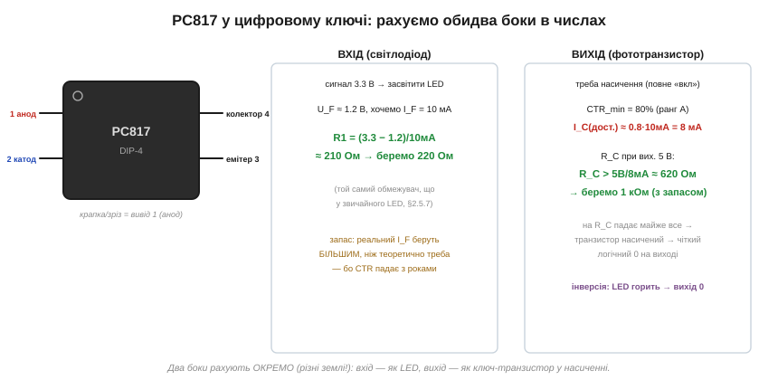
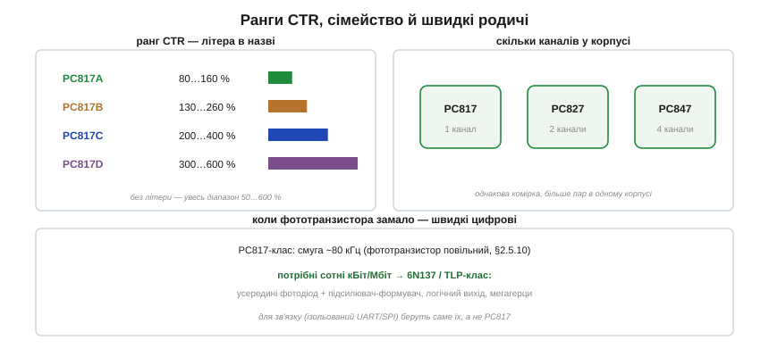

# 🔌 Оптопара PC817-класу: ранги CTR і розрахунок обох боків

> Це компонентна вставка до теми [2.5.10 «Оптопара й гальванічна розв'язка»](ch10-diode-pn-junction.md). Тема пояснила принцип і ввела CTR. Тут візьмемо **конкретний** найпоширеніший оптрон — PC817 — і пройдемо повний практичний шлях: як прочитати ранг CTR із назви, як порахувати резистори обох боків у числах, чому проєктують під *найгірший* CTR і коли PC817 уже не годиться.

### PC817: розрахунок обох боків

PC817 — це той самий світлодіод плюс фототранзистор у чотирививідному корпусі DIP-4: два виводи входу (анод/катод світлодіода) і два виходу (колектор/емітер транзистора). Найчастіше ним перемикають цифровий сигнал «увімк/вимк» через ізоляцію — і тоді розрахунок розпадається на дві незалежні половини, як і обіцяла тема:


*Рис. 2.5.10c.1. Вхід рахують як звичайний світлодіод (§2.5.7): резистор задає струм через нього. Вихід рахують як ключ-транзистор: резистор колектора підбирають так, щоб транзистор увійшов у насичення. Дві землі — два окремі розрахунки.*

**Вхідний бік.** Світлодіод PC817 має падіння U_F ≈ 1.2 В. Щоб засвітити його струмом 10 мА від сигналу 3.3 В, ставимо обмежувальний резистор ([§2.5.7](ch10-diode-pn-junction.md)):

```
R1 = (U_сигналу − U_F)/I_F = (3.3 − 1.2)/10 мА ≈ 210 Ом  →  220 Ом
```

**Вихідний бік.** Тут потрібне **насичення** — щоб транзистор повністю «замкнувся» й дав чіткий логічний рівень. Беремо найгірший гарантований CTR (для рангу A — 80%); тоді при 10 мА входу транзистор певно пропустить хоча б 8 мА. Резистор колектора підбираємо так, щоб цей струм його повністю «просадив»:

```
I_C(гарант.) = CTR_min · I_F = 0.8 · 10 мА = 8 мА
R_C > U_вих / I_C = 5 В / 8 мА ≈ 620 Ом  →  беремо 1 кОм із запасом
```

При насиченні майже вся вихідна напруга падає на R_C, і вихід дає чистий логічний нуль. Зверніть увагу на **інверсію**: світлодіод горить → транзистор відкритий → вихід «0»; погас → вихід підтягнутий до «1». Це нормальна риса оптрона, яку враховують у логіці.

### Чому під найгірший CTR

Головне правило проєктування з оптроном випливає прямо з примхливості CTR ([§2.5.10](ch10-diode-pn-junction.md)): він різниться в рази між екземплярами, падає на спеці й **старіє** (світлодіод тьмяніє за роки). Тому беруть не «типовий», а **мінімальний гарантований** CTR — і ще додають запас по вхідному струму. Інакше схема, що працювала на свіжому оптроні, через рік перестане давати насичення, і логіка «попливе».

### Ранги й сімейство

PC817 продають із **відсортованим** CTR, і ранг кодується **літерою** в назві:


*Рис. 2.5.10c.2. Літера задає діапазон CTR (A — 80…160%, B — 130…260%, C — 200…400%, D — 300…600%); без літери — увесь розкид 50…600%. PC827 і PC847 — та сама комірка, лише 2 і 4 канали в корпусі. Для швидких ліній беруть зовсім інші оптрони.*

Літера після номера — це ранг CTR: **A** (80…160%), **B** (130…260%), **C** (200…400%), **D** (300…600%); без літери оптрон може мати будь-який CTR з повного діапазону 50…600%. Якщо потрібен надійний запас на насичення, беруть вищий ранг (C чи D) — тоді того самого вхідного струму вистачає певніше. А коли каналів треба кілька, є родичі з тією самою коміркою: **PC827** (два канали) і **PC847** (чотири) в одному корпусі.

### Коли PC817 уже не годиться

Фототранзистор повільний — смуга PC817 близько кількох десятків кілогерц ([§2.5.10](ch10-diode-pn-junction.md)). Цього досить для реле, кнопок, повільних команд, зворотного зв'язку живлення. Але для **зв'язку** — ізольованого UART, SPI на сотні кілобіт — потрібні швидкі оптрони з **логічним виходом**: 6N137, TLP-серія та подібні, де всередині фотодіод плюс підсилювач-формувач дають чіткі цифрові фронти на мегагерцах. Сплутати легко: поставив PC817 на швидку лінію — і фронти «попливли», зв'язок не працює.

> 🔧 **Навіщо це.** PC817 — оптрон-«робоча конячка» для повільних розв'язаних сигналів: вхід рахуйте як світлодіод (резистор під I_F ≈ 5–10 мА), вихід — як ключ у насиченні (R_C під мінімальний CTR). Беріть **мінімальний** гарантований CTR і запас по струму — бо CTR старіє; вищий ранг (літера C/D) дає певніше насичення. Пам'ятайте про інверсію виходу й про межу швидкості: для зв'язку на сотні кБіт ставлять не PC817, а швидкий цифровий оптрон (6N137-клас).
