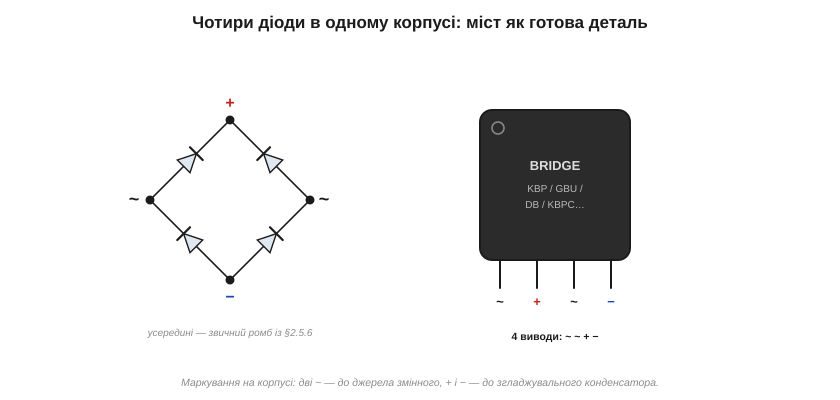
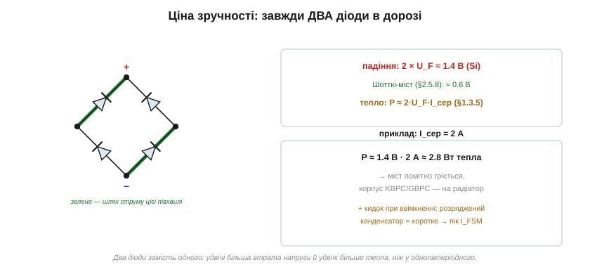

# 🔌 Діодний міст як компонент: чотири діоди в одному корпусі

> Це компонентна вставка до теми [2.5.6 «Випрямлення»](ch10-diode-pn-junction.md). Тема намалювала міст із чотирьох діодів-ромбом. На практиці ці чотири діоди майже завжди беруть не окремо, а **готовою деталлю** — одним корпусом із чотирма виводами. Тут — як її впізнати й підключити, чому вона завжди «з'їдає» два падіння замість одного, скільки тепла на ній і як її обрати.

### Готова деталь замість чотирьох діодів

Збирати міст із дискретних діодів можна, але незручно: чотири корпуси, вісім паяних з'єднань, місце на платі. Тому випускають **мостові збірки** (*bridge rectifier*) — той самий ромб, запечатаний в один корпус із чотирма виводами:


*Рис. 2.5.6c.1. Усередині — знайомий ромб із §2.5.6, зовні — корпус із чотирма виводами, підписаними **~ ~ + −**. Дві «хвильки» йдуть до джерела змінного струму, плюс і мінус — до згладжувального конденсатора й навантаження.*

Маркування виводів стандартне й нанесене прямо на корпус: дві позначки **~** (AC-входи, до них байдуже, як підключати джерело змінного струму) і **+**/**−** (виходи постійного). Сплутати важко — і це головна зручність: підключив трансформатор до «хвильок», конденсатор до «плюс-мінус» — міст готовий. Корпуси різняться за струмом: мініатюрні KBP чи DB для часток ампера, GBU й KBPC на кілька-десяток ампер, потужні металеві GBPC з отвором під гвинт для радіатора.

### Чому завжди два падіння

Головна особливість моста, яку треба тримати в голові, випливає прямо зі схеми: за **кожної** півхвилі струм проходить крізь **два** діоди послідовно (одну діагональ ромба):


*Рис. 2.5.6c.2. Зеленим — шлях струму цієї півхвилі: він заходить крізь один діод і виходить крізь інший. Тому міст «з'їдає» два прямі падіння — близько 1.4 В на кремнії замість 0.7 В в однопівперіодного.*

Звідси два практичні наслідки. Перший — **втрата напруги**: на низькій напрузі ті 1.4 В стають відчутними (з 5 В лишиться 3.6). Саме тому для низьковольтних виходів беруть **мости на Шотткі** ([§2.5.8](ch10-diode-pn-junction.md)) — їхні два падіння дають разом ~0.6 В замість 1.4. Другий наслідок — **тепло**: на двох діодах розсіюється потужність ([§1.3.5](../../block-1-circuits-physics/ch03-resistance-power-heat/ch03-resistance-power-heat.md))

```
P ≈ 2 · U_F · I_сер
```

За середнього струму 2 А це вже близько 1.4 В · 2 А ≈ 2.8 Вт — міст відчутно гріється. Тому потужні збірки роблять у металевому корпусі й садять на радіатор: те саме правило, що й для потужних діодів із [§2.5.5](ch10-diode-pn-junction.md), лише вдвічі більше тепла.

### Кидок струму при ввімкненні

Є ще одна напасть, про яку згадувала [математична вставка про пульсації](ch10-s6-m-ripple-calc.md): у мить увімкнення згладжувальний конденсатор ще **розряджений**, тобто для моста він виглядає майже як коротке замикання. Крізь діоди тоді проскакує потужний кидок заряду. Тому в паспорті моста дивляться не лише на робочий струм, а й на **ударний** (*surge current*, I_FSM) — пік, який збірка витримує одноразово при старті. У великих блоках цей кидок навмисне гасять терморезистором чи резистором, що вмикається на час пуску.

### Як обрати

Вибір моста — це три паспортні числа:

- **Прямий струм** — середній струм навантаження з запасом (з огляду на тепло й кидок).
- **Зворотна напруга** (V_RRM) — кожен діод моста має витримувати пік вхідної напруги; для мережі з її ~325 В піка беруть мости на 400–1000 В.
- **Корпус і тепло** — чи влізе розсіювана потужність у даний корпус без радіатора, чи треба металевий на гвинт.

Готові мости перекривають увесь діапазон — від крихітних на 0.5 А в адаптерах до цеглин на десятки ампер у зварювальних апаратах. У схемі їх упізнають за тими ж **~ ~ + −** і характерним «горбатим» або квадратним корпусом одразу після трансформатора.

### Дрібний шрифт: ім'я схеми

Цю мостову схему часто звуть **«мостом Греца»** — на честь німецького фізика Лео Греца, що опублікував її 1897 року. Та першість, по правді, належить не йому: польський інженер Карол (Шарль) Поллак запатентував той самий міст ще раніше — у Великій Британії наприкінці 1895-го й у Німеччині на початку 1896-го. Грец дійшов до схеми незалежно й трохи згодом, але саме його ім'я закріпилося в назві — звичайна історія, коли популяризатор затьмарює першовинахідника. Тож «міст Греца» — данина традиції, а не точна атрибуція; чесніше сказати «міст Поллака–Греца».

> 🔧 **Навіщо це.** У дев'яти випадках із десяти випрямляч на платі — це не чотири окремі діоди, а одна мостова збірка з підписами ~ ~ + −; підключайте «хвильки» до змінного, «плюс-мінус» — до конденсатора. Пам'ятайте про два падіння (1.4 В і подвійне тепло — на низькій напрузі рятує Шотткі-міст) і про пусковий кидок струму. А вибір зводиться до трьох чисел: струм із запасом, зворотна напруга під ваш пік, корпус під ваше тепло.
