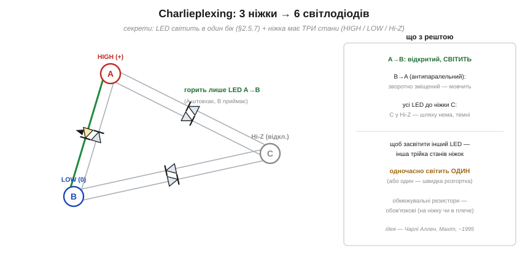
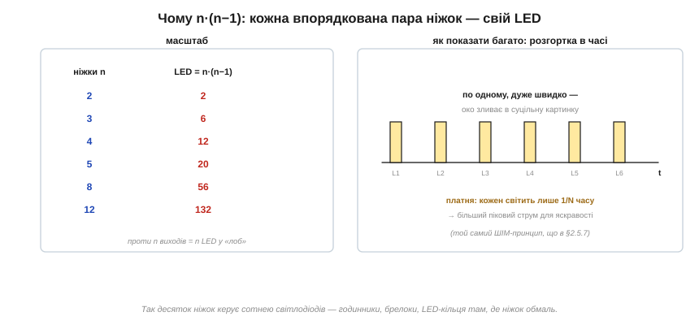

# ⚙️ Charlieplexing: керувати багатьма світлодіодами кількома виводами

> Це алгоритмічна вставка до теми [2.5.7 «Світлодіод і фотодіод»](ch10-diode-pn-junction.md). Тема показала, що світлодіод проводить лише в один бік. Тут — спритний трюк, що перетворює цю однобічність на економію виводів: **n** ніжок мікроконтролера керують аж **n·(n−1)** світлодіодами. Це Charlieplexing — і працює він на двох простих фактах, обидва вже нам знайомі.

### Постановка: світлодіодів багато, ніжок мало

Мікроконтролер має обмаль виводів, а світлодіодів хочеться багато — у годиннику, брелоку, світловому кільці. У «лоб» n виводів засвітять n світлодіодів. Розумніший трюк спирається на дві властивості:

1. **Світлодіод проводить лише в один бік** ([§2.5.7](ch10-diode-pn-junction.md)) — у зворотному він темний.
2. **Вивід мікроконтролера має три стани**, а не два: HIGH (штовхає струм), LOW (приймає струм) і **Hi-Z** — третій, «відключений» стан, у якому вивід ні до чого не під'єднаний (висить у повітрі, ніби його й нема).

### Як це працює

Між кожною парою виводів вмикають **два** світлодіоди назустріч один одному (антипаралельно). Щоб засвітити **один** конкретний, один його вивід ставлять у HIGH, другий — у LOW, а **всі решта** — у Hi-Z:


*Рис. 2.5.7a.1. A = HIGH, B = LOW, C = Hi-Z. Струм тече лише крізь світлодіод A→B. Його антипаралельний сусід B→A зворотно зміщений — мовчить; усі світлодіоди, прив'язані до C, лишилися без шляху, бо C відключений. Горить рівно один.*

Розберемо, чому світиться саме один. Світлодіод **A→B** ввімкнено правильно (A штовхає, B приймає) — він горить. Його близнюк **B→A** між тими ж ніжками стоїть назустріч — для нього напруга зворотна, тож він темний (та сама однобічність із [§2.5.4](ch10-diode-pn-junction.md)). А всі світлодіоди, що йдуть до ніжки **C**, не світяться взагалі: C у Hi-Z, відключений, і струмові нема куди текти. Виходить, кожна **впорядкована** пара ніжок «джерело→приймач» вмикає свій унікальний світлодіод.

### Чому n·(n−1)

Звідси й формула. Світлодіод задається парою ніжок **із напрямком**: «A штовхає, B приймає» — це не те саме, що «B штовхає, A приймає» (світяться різні світлодіоди-близнюки). Кількість таких упорядкованих пар з n ніжок — рівно **n·(n−1)**:


*Рис. 2.5.7a.2. 3 ніжки → 6 світлодіодів, 4 → 12, 5 → 20, 8 → 56. Показати всі одразу не можна (горить лише один) — їх засвічують по черзі дуже швидко, і око зливає мерехтіння в суцільну картинку.*

```
n = 3  →  6 світлодіодів
n = 4  →  12
n = 5  →  20
n = 8  →  56
n = 12 →  132
```

Вісім ніжок замість восьми світлодіодів дають аж п'ятдесят шість — ось чому трюк такий цінний там, де виводів обмаль.

### Розгортка: показати багато, світячи по одному

Заковика очевидна: одночасно горить лише **один** світлодіод. Як же показати ціле число чи візерунок? Тим самим прийомом, що й підсвітку в темі, — **швидкою розгорткою**: світлодіоди засвічують по черзі, кожен на коротку мить, і пробігають увесь набір багато разів за секунду. Око інерційне й зливає мерехтіння в суцільну картинку (той самий механізм, що в [широтно-імпульсному керуванні яскравістю](ch10-diode-pn-junction.md)). Платня — кожен світлодіод світить лише 1/N часу, тож для тієї самої яскравості крізь нього в активну мить треба пускати **більший піковий струм**.

### Пастки

- **Обмежувальні резистори обов'язкові** ([§2.5.7](ch10-diode-pn-junction.md)) — без них світлодіоди згорять; їх ставлять на кожну ніжку або в кожне плече.
- **Паразитне світіння** (sneak paths): інколи струм може знайти обхідний шлях крізь **два** послідовні світлодіоди й ледь підсвітити не той, що треба. Рятує природа порога: два послідовні світлодіоди вимагають подвоєного падіння (≈2×U_F), і якщо живлення нижче за нього, обхідний шлях просто не відкривається. Тому номінали добирають із оглядкою на цей поріг.
- **Складніший код** і обмежена сумарна яскравість — ціна за економію ніжок.

> ⚙️ **Підсумок методу.** Charlieplexing міняє ніжки мікроконтролера на світлодіоди за курсом n → n·(n−1), користуючись двома фактами: світлодіод однобічний, а вивід має три стани (HIGH/LOW/Hi-Z). Засвічуєш один — інші два виводи цієї пари дають йому струм, решта в Hi-Z; багато світлодіодів показуєш швидкою розгорткою. Це улюблений прийом дешевих годинників, брелоків і LED-кілець — скрізь, де світлодіодів хочеться більше, ніж є вільних ніжок.
