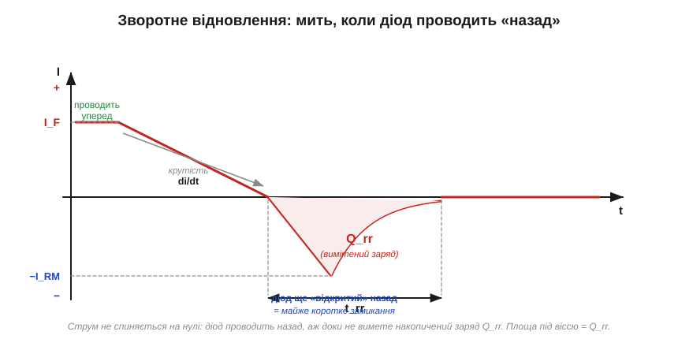
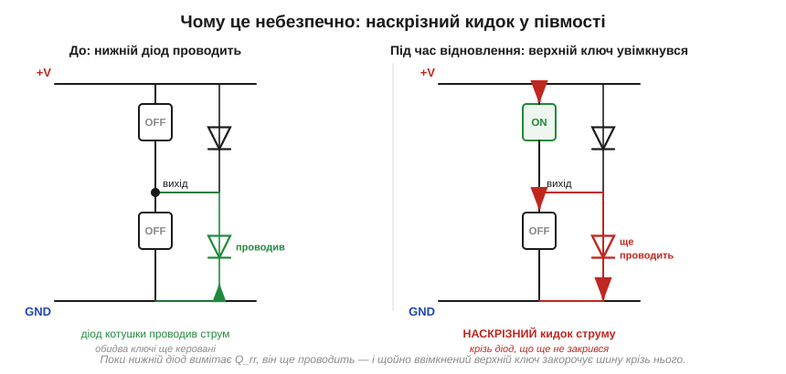

# 🧮 Зворотне відновлення (Qrr): мить, коли діод — коротке замикання

> Це математична вставка до теми [2.5.8 «Особливі діоди»](ch10-diode-pn-junction.md). Тема пояснила якісно, чому Шотткі швидкий: звичайний кремнієвий діод при різкому замиканні ще мить пропускає струм назад, доки «вимітається» накопичений заряд ([Рис. 2.5.8.5](ch10-diode-pn-junction.md)). Тут перетворимо цю «мить» на два числа з даташита — час відновлення **t_rr** і заряд відновлення **Q_rr** — і побачимо, чому саме цей заряд палить транзистори в півмостах та імпульсних блоках живлення (*SMPS*).

### Означення: що таке заряд відновлення

Коли крізь діод у прямому напрямку тече струм, у його базі накопичено **неосновні носії** — той самий запас, що дає Шотткі його швидкість, бо в нього такого запасу немає ([§2.5.3](ch10-diode-pn-junction.md), [§2.5.8](ch10-diode-pn-junction.md)). Поки цей заряд є, діод **не вміє замкнутися**: щоб напруга на ньому стала зворотною, носії спершу треба прибрати. Прибрати їх можна лише струмом — тож при спробі замкнути діод струм не спиняється на нулі, а **обертається назад** і деякий час тече у зворотний бік, вимітаючи заряд.

- **Заряд відновлення** (*reverse recovery charge*, **Q_rr**) — повний заряд, який треба винести зворотним струмом, щоб діод нарешті замкнувся. Одиниця — нанокулон (нКл).
- **Час відновлення** (*reverse recovery time*, **t_rr**) — скільки триває цей зворотний струм, від переходу через нуль до майже повного спаду. Одиниця — наносекунди (нс).
- **Піковий зворотний струм** (*peak reverse current*, **I_RM**) — найбільше значення того зворотного кидка.


*Рис. 2.5.8m.1. Струм діода при різкому замиканні. Спершу тече прямий I_F; потім струм лінійно падає (зі швидкістю di/dt зовнішнього кола), проходить нуль і йде в мінус — діод проводить НАЗАД. Пік сягає −I_RM, далі «хвіст» згасає до нуля. Уся площа під віссю — це і є винесений заряд Q_rr.*

### Інтуїція: чому це коротке замикання

Головне тут — не сам факт зворотного струму, а те, що **поки він тече, діод відкритий в обидва боки**. Падіння на ньому майже нульове: він поводиться не як клапан, а як шматок дроту. Якщо в цю мить до діода прикладено напругу джерела, ніщо її не стримує — і струм визначається лише зовнішнім колом. Це і є «мить, коли діод — коротке замикання».

Звідси видно й важелі. Заряд Q_rr тим більший, чим більший був прямий струм (більше носіїв накопичено) і чим **гарячіший** діод (з температурою Q_rr різко зростає). А піковий кидок I_RM і втрати залежать ще й від того, **як швидко** зовнішнє коло заганяє струм у мінус — від крутості di/dt. Парадокс той самий, що й з кидком заряду конденсатора ([§2.5.6m](ch10-s6-m-ripple-calc.md)): чим різкіше ми комутуємо, тим гостріший і шкідливіший викид.

### Апарат: від di/dt до втрат

Щоб із цих важелів вийшли числа, спростимо форму сплеску до трикутника. За такого наближення (підйом до −I_RM зі швидкістю di/dt, потім спад) заряд — це просто площа трикутника. Звідси зв'язок трьох величин:

```
Q_rr ≈ ½ · I_RM · t_rr        (площа сплеску зворотного струму)
I_RM ≈ √( 2 · Q_rr · di/dt )   (що крутіший фронт, то вищий пік)
```

Друга формула — головна практична: **піковий зворотний струм росте з крутістю фронту**. Подвоїли di/dt — кидок I_RM зріс у √2. У швидкому півмості di/dt сягає сотень ампер за мікросекунду, тож навіть Q_rr у десятки нКл дає кидок у кілька ампер — додатково до робочого струму.

Кожне таке замикання спалює енергію. Поки крізь діод тече зворотний струм, на транзисторі, що його заганяє, стоїть майже повна напруга шини U — тобто на ключі одночасно є і струм, і напруга:

```
E_rr ≈ Q_rr · U          (втрати на подію відновлення)
P_rr ≈ Q_rr · U · f_комут (середня потужність при частоті f)
```

**Приклад.** Діод з Q_rr = 80 нКл у мості на U = 320 В, що комутує з f = 100 кГц:

```
E_rr ≈ 80·10⁻⁹ · 320      = 25.6 мкДж за одне замикання
P_rr ≈ 25.6·10⁻⁶ · 100·10³ = 2.56 Вт   (лише через відновлення!)
```

Два з половиною вати з повітря — і це ще без урахування кидка I_RM, що додає просадку напруги, дзвін на паразитних індуктивностях і завади. Замінили діод на Шотткі (Q_rr ≈ 0) або на «ультрашвидкий» з малим Q_rr — і ці вати зникають.

### Найгірший випадок: наскрізний струм у півмості

Та зайве тепло — ще не найгірше. Є схема, де ті самі наносекунди незакритого діода обертаються не плавним нагрівом, а різким кидком, здатним пробити ключ. Це півміст. Тут два ключі стоять стовпчиком між +V і землею, а паралельно кожному — діод (часто це вбудований *body diode* самого транзистора). Поки один ключ працює, діод другого плеча проводить струм навантаження. Коли керування вмикає перший ключ, діод другого мусить замкнутися — але через Q_rr він **ще мить проводить назад**:


*Рис. 2.5.8m.2. Ліворуч: нижній діод проводив струм котушки. Праворуч: верхній ключ увімкнувся, та нижній діод ще не вимів Q_rr — і верхній ключ б'є струмом просто крізь нього на землю. На цю мить обидва плеча відкриті: шину закорочено.*

Це **наскрізний струм** (*shoot-through*): на час t_rr верхній ключ з'єднує шину живлення із землею майже накоротко через відкритий діод нижнього плеча. Кидок обмежений лише паразитними опорами й може сягати десятків ампер — звідси перегрів і пробій ключів у погано прорахованих мостах. Тому захисні правила однозначні: ставити в мости **швидкі діоди** з малим Q_rr (ультрашвидкі або Шотткі/SiC, де напруга дозволяє), не робити фронти зайво крутими й завжди закладати «мертвий час» між ключами — але навіть він не рятує, якщо діод вимітається повільніше за цю паузу.

### Де це працює в курсі

Q_rr — це третє число вибору діода поряд з I_F та V_R ([§2.5.5](ch10-diode-pn-junction.md), [§2.5.8c](ch10-s8-c-diode-families.md)): для мережевого випрямляча на 50 Гц воно байдуже, а для будь-якої швидкої комутації стає вирішальним. Саме воно — кількісна причина, чому Шотткі незамінний у SMPS і чому сигнальний 1N4148 (t_rr ≈ 4 нс) беруть туди, де 1N400x уже «гальмує». Та сама фізика накопиченого заряду повернеться, коли мова піде про швидкі ключі й драйвери силових транзисторів: керувати перемиканням — це завжди керувати зарядом, який треба встигнути занести й винести.
