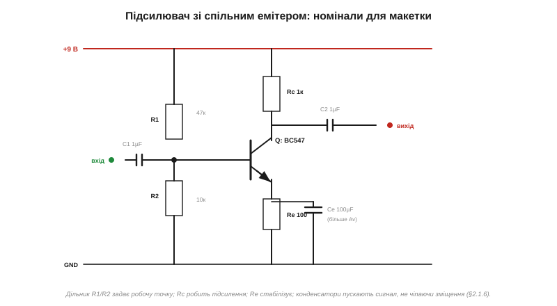
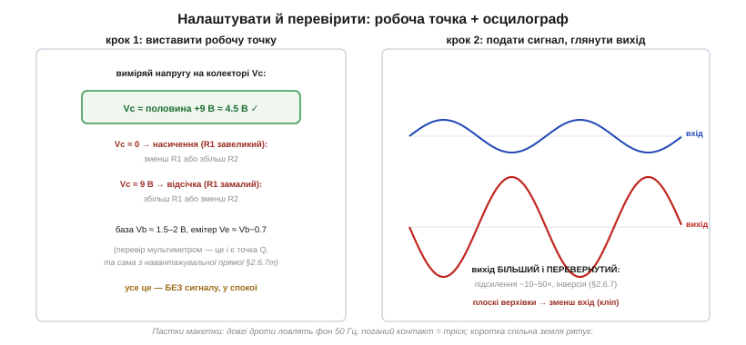

# 🔌 Найпростіший підсилювач на макетці: спільний емітер

> Це компонентна вставка до теми [2.6.7 «BJT як підсилювач»](ch11-bjt.md). Тема пояснила каскад зі спільним емітером — дільник, Rc, Re, конденсатори. Тут зберемо його **руками на макетній платі**: конкретні номінали, як виставити робочу точку мультиметром і що ви побачите на осцилографі (і почуєте в навушниках). Один транзистор, кілька резисторів — і кволий сигнал стає в десятки разів більшим.

### Що паяти — схема з номіналами

Класичний навчальний підсилювач живиться від «кронки» 9 В і стоїть на одному NPN-транзисторі:

*Рис. 2.6.7c.1. BC547, дільник бази R1=47к/R2=10к, колекторний Rc=1к, емітерний Re=100 Ом, конденсатори зв'язку C1/C2 по 1 мкФ і емітерний шунт Ce=100 мкФ. Усе вміщається на половині макетки.*

Кожна деталь робить своє ([§2.6.7](ch11-bjt.md)): **дільник R1/R2** задає постійну напругу на базі, а отже й робочу точку; **Rc** перетворює струм колектора на напругу (з нього знімають вихід); **Re** стабілізує робочу точку зворотним зв'язком; **C1 і C2** — конденсатори зв'язку, що пускають змінний сигнал, але не дають постійному зміщенню витекти ([§2.1.6](../ch07-capacitor/ch07-capacitor.md)); **Ce** — емітерний шунт, що «закорочує» Re для змінного сигналу й тим піднімає підсилення (без нього воно скромніше, зате стабільніше).

### Крок 1: виставити робочу точку — без сигналу

Найважливіше зробити **до** будь-якого сигналу: перевірити, що транзистор сидить посередині. Увімкніть живлення й виміряйте мультиметром напругу на **колекторі**:

*Рис. 2.6.7c.2. Vc ≈ половина живлення (≈4.5 В) — транзистор посередині, є місце гойдатися в обидва боки. Vc ≈ 0 — насичення (база перекачана); Vc ≈ 9 В — відсічка (бази замало). Праворуч — вихід осцилографом: більший і перевернутий.*

Цільове значення — **Vc приблизно половина живлення**, тут ~4.5 В: саме та робоча точка Q посеред навантажувальної прямої ([§2.6.7m](ch11-s7-m-load-line.md)), де є простір хитатися. Якщо намiряли інше:

- **Vc ≈ 0 В** — транзистор у насиченні, база перекачана: збільшіть R1 (або зменшіть R2), щоб опустити напругу бази.
- **Vc ≈ 9 В** — відсічка, бази замало: зменшіть R1 (або збільшіть R2).

Заодно перевірте логіку переходів: на базі має бути ~1.5–2 В, на емітері — на 0.7 В менше. Сходиться — транзистор живий і зміщений правильно.

### Крок 2: подати сигнал і подивитися

Тепер заведіть на вхід слабкий сигнал — вихід плеєра, телефона чи генератора (через C1). На осцилографі на виході (через C2) ви побачите **ту саму хвилю, але більшу й перевернуту**: підсилення за напругою виходить десь у 10–50 разів, а інверсія — фірмова риса спільного емітера ([§2.6.7](ch11-bjt.md)). Якщо ввімкнути замість осцилографа навушники (через конденсатор!), музика звучатиме помітно гучніше за вхідну. А якщо верхівки синусоїди на виході **сплющилися** — сигнал завеликий і впирається в межі (кліп): зменшіть вхід або перевірте робочу точку.

### Пастки макетної плати

Макетка зручна, але підступна саме для підсилювачів, бо вони підсилюють і **завади**:

- **Фон 50 Гц.** Довгі дроти на вході — це антена, що ловить мережеву наводку; в навушниках буде гудіння. Тримайте вхідні дроти короткими, а краще екранованими.
- **Поганий контакт.** Макетка славиться ненадійними гніздами — тріск і пропадання сигналу часто йдуть саме звідти, а не зі схеми.
- **Спільна земля.** Усі «землі» (живлення, вхід, вихід, осцилограф) мають сходитися в одну точку коротким шляхом — інакше з'являться фон і навіть самозбудження (підсилювач завиє).
- **Полярність електролітів.** Конденсатори зв'язку часто електролітичні ([§2.1.5](../ch07-capacitor/ch07-capacitor.md)) — ставте плюсом до вищого постійного потенціалу.

> 🔧 **Навіщо це.** Зібрати цей каскад руками — найкращий спосіб відчути все з теми: робочу точку (виміряв Vc мультиметром — побачив Q наживо), підсилення й інверсію (глянув осцилографом), кліп (перекрутив гучність), роль конденсаторів (прибери C1 — зникне сигнал). Один транзистор справді підсилює — і це варто побачити власноруч хоч раз. А коли захочеться зробити це легко, передбачувано й без танців із робочою точкою — на сцену вийде операційний підсилювач (наступні розділи), де всю цю морочу вже сховано всередину.
