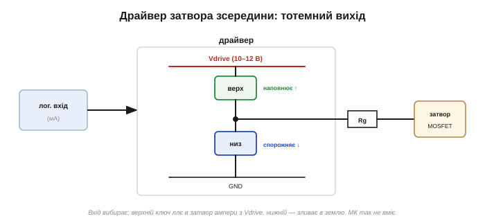

# 🔌 Драйвер затвора: навіщо окрема мікросхема між логікою і силовим ключем

> Це компонентна вставка до теми [2.7.7 «Затвор як ємність»](ch12-mosfet.md). Тема пояснила суть драйвера — підсилювач струму для затвора, що дає ампери, яких не подужає МК. Тут зазирнемо всередину (що там за «тотемний» вихід), розберемо головний клопіт, заради якого драйвер і незамінний, — **верхній N-ключ**, — і подивимось, як таку мікросхему підключають.

### Навіщо він узагалі

Із математики заряду затвора ([вставка про Qg](ch12-s7-m-gate-charge.md)) пам'ятаємо: щоб перемкнути ключ швидко, у затвор треба загнати струм I = Qg / t — часто **ампери**. Ніжка мікроконтролера дає міліампери. Драйвер — це міст через цю прірву: спеціальний підсилювач струму, приставлений до затвора.

### Що всередині: тотемний вихід

*Рис. 2.7.7c.1. Серце драйвера — два потужні ключі «стовпчиком» між живленням затвора Vdrive і землею, а їхня середина — вихід. Вхідна логіка вмикає або **верхній** ключ (ллє ампери з Vdrive у затвор — наповнює Qg), або **нижній** (зливає заряд у землю — спорожняє). Те саме, що робить вихід КМОН-інвертора, лише в силовому масштабі.*

Окрім самого виходу, у драйвері є й корисна обв'язка: окреме живлення затвора Vdrive (часто 10–12 В — рівно стільки, щоб **повністю** відкрити силовий ключ), захист від просідання живлення (UVLO — не жене напіввідкритий затвор, що грівся б), вхід дозволу.

### Велика проблема: верхній N-ключ

Справжня причина, чому без драйвера часто не обійтися, — **верхнє плече на N-каналі**. Ми бачили ([§2.7.4](ch12-mosfet.md)): щоб відкрити верхній N-MOSFET, на затвор треба напругу **вищу за +V** — а якщо +V це і є висока силова шина, такої напруги в схемі просто нема. Класичний вихід — **бутстреп**:

*Рис. 2.7.7c.2. Конденсатор Cbs і діод Dbs. Поки відкритий **нижній** ключ, вузол SW ≈ 0, і Cbs заряджається від Vdrive крізь Dbs. Коли треба відкрити **верхній** ключ, SW підстрибує до +Vbus, а заряджений Cbs «їде» зверху, піднімаючи живлення верхнього боку VB над шиною — і драйверу є чим підтягнути верхній затвор. Вихід HO «плаває», слідуючи за SW.*

Це елегантний трюк: одне дешеве живлення Vdrive обслуговує і нижній ключ напряму, і верхній — через бутстрепний конденсатор, що сам підлаштовується під рівень шини.

### Як підключити

Логіка (ШІМ) на вхід, живлення Vdrive, а вихід — у затвор через **малий резистор затвора Rg** (він задає компроміс швидкість↔дзвін і завади). Для півмоста: бутстрепний конденсатор із діодом на верхній бік, спільне Vdrive і **мертвий час** між HO та LO.

### Типові граблі

**Бутстреп треба підживлювати.** Cbs заряджається лише поки відкритий нижній ключ. Тож тримати верхній ключ відкритим **вічно** (100 % шпаруватості) не можна — заряд стече. Потрібні періодичні «ковтки» нижнім ключем, окреме ізольоване живлення чи зарядова помпа.

**Хибне відмикання за Міллером.** Різкий стрибок напруги на стоку може крізь ємність затвір-стік підбити «закритий» ключ і відкрити його — а це наскрізний струм. Драйвери б'ються з цим **сильним стяганням** затвора донизу (низький опір) або навіть від'ємною напругою.

**Мертвий час.** Драйвер (чи ваш ШІМ) мусить вставляти паузу, щоб обидва плечі ніколи не були відкриті разом ([§2.7.10](ch12-mosfet.md)).

**Розводка.** Петлю затвора тримають **короткою**: довгі доріжки дзвенять і гальмують перемикання.

### Варіації

Низькобічний драйвер — найпростіший, без бутстрепа. Півмостовий (верх+низ із бутстрепом) — для плечей мотора й перетворювачів. **Ізольовані** драйвери дають гальванічну розв'язку для високої напруги (привід, мережа, електромобіль). А бувають і повністю інтегровані «силові каскади» (драйвер разом із ключами в одному корпусі) та «розумні» драйвери із захистом для потужних IGBT/SiC.

> 🔧 **Навіщо це.** Драйвер затвора — не примха, а необхідність, щойно перемикаєте **швидко** (десятки кГц і вище) або керуєте **верхнім N-ключем**. Запам'ятайте дві його ролі: доставити Qg за ампери (швидко = холодно) і дати верхньому затвору живлення над шиною через бутстреп. А зі собою тягне дисципліну: мертвий час, коротка петля затвора й оглядка на 100 % шпаруватості, де бутстреп уже не встигає зарядитися.
