# Розділ 2.8 — Операційний підсилювач і компаратор

[Розділ 2.7](../ch12-mosfet/ch12-mosfet.md) завершив наше знайомство з **окремими** транзисторами. Тепер — крок угору: прилад, усередині якого транзистори вже зібрані в готовий, майже ідеальний підсилювач, а інженерові лишається тільки **задати йому роботу** кількома зовнішніми деталями. Це **операційний підсилювач** *(operational amplifier, ОП)* — найуніверсальніша цеглинка аналогової електроніки. Як він народився (рахувати траєкторії зеніток!) і чому пережив свою епоху — у [📜 історії до розділу](ch13-history-opamp.md). А тут почнемо з того, яким його **уявляють в ідеалі**: саме спрощена, «ідеальна» картина робить роботу з ОП напрочуд легкою.

## 2.8.1 Ідеальний операційний підсилювач

Операційний підсилювач здається складним — усередині нього десятки транзисторів ([§2.8 історія](ch13-history-opamp.md)). Та користуватися ним просто, бо для розрахунків його замінюють **ідеальною моделлю** — кількома сміливими припущеннями, які майже не брешуть. Опанувавши цю модель, ви зможете аналізувати схеми на ОП кількома рядками арифметики. Тож почнімо саме з неї.

Зверніть увагу й на сам **рівень** цього приладу. Раніше, щоб зробити підсилювач, ми морочилися з робочою точкою транзистора, резисторами зміщення, з β, що «плаває» від екземпляра до екземпляра ([§2.6.7](../ch11-bjt/ch11-bjt.md)). Операційний підсилювач ховає всю цю кухню всередину: інженерові він дається як **готовий блок** із простими правилами, і будувати з нього схеми — однаково що складати з деталей конструктора, не думаючи про окремі транзистори. Це і є сила хорошої абстракції — і саме її подарували нам Філбрик, Відлар і Фуллагар ([📜 історія](ch13-history-opamp.md)).

### Що це: підсилювач різниці

В операційного підсилювача **два входи** й **один вихід**. Входи нерівноцінні:

- **неінвертуючий вхід** *(non-inverting, позначають «+»)*;
- **інвертуючий вхід** *(inverting, позначають «−»)*.

А робить ОП одну-єдину річ: підсилює **різницю** напруг між своїми входами. Якщо назвати напруги на входах V₊ і V₋, то на виході:

```
Vout = A · (V₊ − V₋)
```

де **A** — власне підсилення приладу, **підсилення без зворотного зв'язку** *(open-loop gain)*. І воно **велетенське** — у реальних ОП сягає сотень тисяч чи мільйона. Запам'ятаймо цю формулу: усе подальше — її наслідки.

Самі назви входів кажуть про їхній вплив на вихід: підняти напругу на **неінвертуючому** «+» — і вихід піде **вгору**, у тому ж напрямі; підняти на **інвертуючому** «−» — вихід піде **вниз**, у протилежному (звідси й «інвертуючий»). Знак у формулі — V₊ **мінус** V₋ — це й відбиває.

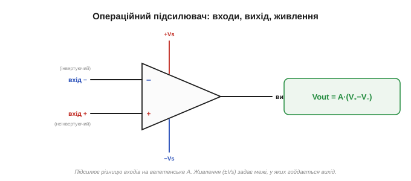
*Рис. 2.8.1.1. Операційний підсилювач. Трикутник із двома входами (інвертуючим «−» згори й неінвертуючим «+» знизу) та виходом на вістрі. Окремо підводять живлення (+Vs і −Vs). Вихід дорівнює різниці входів, помноженій на величезне підсилення A.*

### Йому байдужа абсолютна напруга — лише різниця

Найважливіше в цій формулі — слово **різниця**. ОП не цікавить, скільки вольтів на входах **самих по собі**: 0.001 В і 0.002 В чи 5.001 В і 5.002 В — для нього однаково, бо різниця в обох випадках та сама, 0.001 В. Підсилюється лише те, чим входи **відрізняються** (це звуть **диференційним** сигналом), а те, що на них **спільне** (**синфазний** сигнал, *common-mode*), — ігнорується.

Ця диференційність — велика чеснота. Скажімо, якщо на обидва входи наводиться однакова завада (від мережі, від сусідніх дротів), вона на них **спільна** — і ОП її просто **викине**, підсиливши лише корисну різницю. Тому ОП чудово витягує слабкий сигнал давача з-під шуму.


*Рис. 2.8.1.2. Підсилювач різниці. ОП множить на A лише **різницю** V₊−V₋; те, що на входах спільне (синфазна завада), він відкидає. Тому однакова на обох входах завада не проходить на вихід — корисний сигнал лишається чистим.*

Приклад із життя. Тензодавач чи термопара дають крихітні мілівольти, а до них по двох довгих дротах наводиться 50-герцова завада від мережі — однакова на обох дротах (бо дроти поруч). Під'єднай давач до **двох** входів ОП — і завада, спільна для входів, відсіється, а корисна різниця підсилиться. Цю здатність відкидати спільне звуть **придушенням синфазного сигналу** — і вона одна з головних причин, чому ОП незамінний у вимірюваннях.

Ще яскравіше це у **вимірюванні струму**: щоб дізнатися струм, міряють крихітне падіння на маленькому резисторі, що «висить» на повних 12 чи 48 вольтах живлення. Абсолютні напруги на його кінцях величезні й майже однакові, а різниця — лічені мілівольти. ОП відкине спільні десятки вольтів і підсилить саму різницю. Без диференційного входу таке годі й виміряти.

### Ідеальна модель: три головні припущення

Щоб рахувати схеми на ОП легко, його заміняють **ідеальним**. Три припущення роблять усю магію.

1. **Нескінченне підсилення** (A → ∞). Найменша різниця між входами дає величезний вихід. У реальності A — сотні тисяч, але для розрахунків зручно вважати його нескінченним.
2. **Нескінченний вхідний опір** *(input impedance)*. Входи ОП **не споживають струму** взагалі — вони лише «дивляться» на напругу, нічого з джерела не відбираючи. (Пряма рідня високого вхідного опору польового транзистора, [§2.7.1](../ch12-mosfet/ch12-mosfet.md); ОП із польовими входами підходять до цього ідеалу дуже близько.)
3. **Нульовий вихідний опір** *(output impedance)*. Вихід ОП — ідеальне джерело напруги: він видає задану напругу й тримає її **під будь-яким навантаженням**, не просідаючи.

(Є й дрібніші ідеалізації — нескінченна смуга частот і нульовий зсув; про їхні реальні межі — у [§2.8.9](ch13-opamp-comparator.md). Поки що — три головні.)


*Рис. 2.8.1.3. Три припущення ідеального ОП. Підсилення нескінченне; вхідний опір нескінченний (у входи струм не тече); вихідний опір нульовий (вихід — ідеальне джерело напруги). Ці три «брехні» майже не брешуть — і роблять розрахунки тривіальними.*

> 🔧 **Навіщо це.** Навіщо ідеалізувати? Бо це **гігантськи спрощує** аналіз. «У входи струм не тече» — і ми відразу знаємо струми в усіх резисторах довкола. «Вихід тримає напругу під будь-яким навантаженням» — і нам байдуже, що до нього під'єднано. «Підсилення нескінченне» — і з нього випливе золоте правило розрахунку ([§2.8.3](ch13-opamp-comparator.md)). Реальний ОП лише трохи відступає від цих ідеалів ([§2.8.9](ch13-opamp-comparator.md)), і ці відступи — маленькі поправки, якими спершу можна знехтувати. Ідеальна модель дає 99% відповіді кількома рядками.

Наскільки ж близька ця ідеалізація до правди? Напрочуд близька. Вхідний струм у славетного µA741 — близько 80 наноампер (мізер проти робочих струмів), а в ОП із польовими входами — пікоампери, фактично нуль. Власне підсилення — сотні тисяч. Вихідний опір — одиниці ом. Тож, рахуючи схему за ідеальною моделлю, ви схибите хіба на частку відсотка, а виграєте в простоті незмірно.

А одне з припущень одразу дає робоче **правило**, яким ми користуватимемося скрізь: **у входи ОП струм не тече**. Щойно побачивши в схемі операційний підсилювач, сміливо вважайте, що крізь його входи струму нема, — а отже, увесь струм у під'єднаних до входів резисторах легко простежити. Це перше «золоте правило»; друге з'явиться, коли ми додамо зворотний зв'язок ([§2.8.3](ch13-opamp-comparator.md)).

### Підсилення таке велике, що майже все його «зашкалює»

Спинімося на першому припущенні — велетенському A — бо воно має дивовижний наслідок. Хай A = 100 000 (скромно як на ОП). Тоді щоб вихід дав, скажімо, 10 В, на входах має бути різниця всього:

```
V₊ − V₋ = Vout / A = 10 В / 100 000 = 0.0001 В = 0.1 мВ
```

Лише **десята частка мілівольта**! А якщо різниця буде хоч трохи більша — 1 мВ, — то формула обіцяє 100 В на виході. Стільки ОП дати не може (немає такого живлення), тож вихід просто **впирається в межу**. Виходить, що за велетенського A навіть **крихітна** різниця на входах кидає вихід в одну з крайніх позицій. ОП — украй «нервовий» прилад: майже будь-який вхід його зашкалює.


*Рис. 2.8.1.4. Передатна крива ОП без зворотного зв'язку — майже вертикальна сходинка. Через величезне A досить десятків мікровольтів різниці, щоб вихід стрибнув від однієї межі до іншої. Лінійна ділянка посередині — мікроскопічно вузька.*

Одне застереження наперед: це велетенське A — лише на **постійному струмі** й низьких частотах. Зі зростанням частоти власне підсилення ОП **спадає** (через ту саму внутрішню корекцію, що робить його стійким, [📜 історія](ch13-history-opamp.md)). Тому «нескінченне підсилення» — добре наближення для повільних сигналів, а на високих частотах його доводиться уточнювати ([§2.8.9](ch13-opamp-comparator.md)). Поки що тримаймося постійного струму, де ідеал найточніший.

### Вихід не вискочить за межі живлення

Звідки беруться ті «межі»? Операційний підсилювач, як і будь-який підсилювач ([§2.6.7](../ch11-bjt/ch11-bjt.md)), живиться від джерела — найчастіше **двополярного** (+Vs і −Vs, класично ±15 В, але буває й однополярне). І, хоч би що казала формула Vout = A·(V₊−V₋), вихід фізично **не може вийти за рейки живлення**: він гойдається лише десь між −Vs і +Vs, а далі впирається й **насичується** *(saturation)*. Поставити на вихід 100 В від живлення ±15 В неможливо — буде ~+14 В, і все.

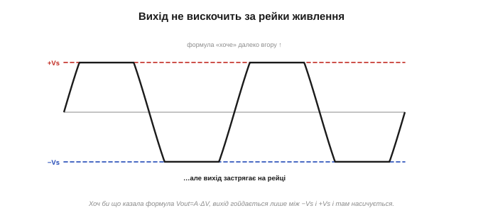
*Рис. 2.8.1.5. Вихід ОП живиться від рейок ±Vs і не може за них вискочити. Хоч скільки обіцяла б формула, вихід насичується трохи не доходячи до рейки. «Стеля» й «підлога» виходу — це напруги живлення.*

Класичне живлення ОП — **двополярне**, ±Vs (наприклад ±15 В): тоді вихід може гойдатися і вгору, і вниз навколо нуля, що зручно для змінних сигналів. Та багато сучасних ОП працюють і від **однополярного** живлення (скажімо, 0…5 В від того самого мікроконтролера) — тоді «нулем» для сигналу роблять середину живлення. Є й ОП «rail-to-rail», чий вихід дотягується майже до самих рейок. Вибір живлення — перше, що погоджують, ставлячи ОП у схему.

### Сам по собі він — ще не підсилювач

Складімо два спостереження докупи: підсилення велетенське, а вихід обмежений рейками. Виходить, що **сам по собі**, без жодної обв'язки, операційний підсилювач — кепський підсилювач. Найменша різниця на входах одразу кидає його вихід на одну з рейок: трішки V₊ більший за V₋ — вихід угорі (+Vs); трішки менший — вихід унизу (−Vs). Лінійна ділянка посередині така вузенька, що сигнал крізь неї не «протягнеш».

Натомість таке поводження — це готовий **компаратор**: прилад, що каже, котрий із двох входів більший ([§2.8.7](ch13-opamp-comparator.md)). А от як **підсилювач** ОП у цьому стані некерований.

То як приборкати цей шалений мільйон підсилення, щоб дістати з нього **точний, передбачуваний** підсилювач? Відповідь — **від'ємний зворотний зв'язок**: повернути частину виходу назад на вхід так, щоб ОП сам себе вгамовував. Це і є головна ідея всього розділу, і їй присвячена наступна тема.

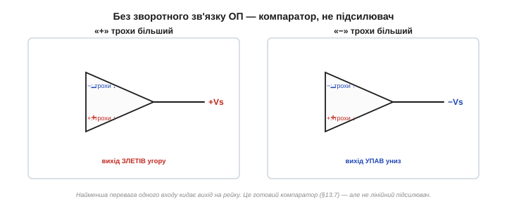
*Рис. 2.8.1.6. ОП без обв'язки. Трохи більший «+» — вихід злітає до +Vs; трохи більший «−» — падає до −Vs. Як компаратор це чудово, а як підсилювач — некеровано. Щоб зробити з нього лінійний підсилювач, потрібен від'ємний зворотний зв'язок (§2.8.2).*

> 🔧 **Навіщо це.** Тут — ключова думка, без якої ОП не зрозуміти: **велике підсилення саме по собі марне; цінним воно стає лише в парі зі зворотним зв'язком**. Запас підсилення — це «сировина», яку зворотний зв'язок обмінює на **точність і стабільність** (так само, як у транзисторному підсилювачі [§2.6.7](../ch11-bjt/ch11-bjt.md) ми жертвували підсиленням заради передбачуваності). Велетенський A потрібен не щоб сильно підсилювати, а щоб було **чим** платити за точність. Як саме відбувається цей обмін — у [§2.8.2](ch13-opamp-comparator.md).

Корисний образ: уявіть кермо з шаленою чутливістю — ледь торкнувся, і машину кидає в кювет. Кермувати ним «наосліп», без жодного зворотного зв'язку, неможливо: будь-яка дрібниця — і ти в канаві (вихід на рейці). Але дай водієві **бачити** дорогу й безперервно підправляти кермо — і та сама шалена чутливість обертається на чесноту: машина точно тримає смугу, миттєво реагуючи на найменше відхилення. Так само велетенське підсилення ОП, охоплене зворотним зв'язком, дає не хаос, а **точність** і блискавичну реакцію. Як під'єднати цей «зворотний зв'язок» — наступна тема.

### Що далі

Ми познайомилися з ідеальним ОП: підсилювач різниці з нескінченним підсиленням, нескінченним вхідним і нульовим вихідним опором, чий вихід живе між рейками живлення. Сам по собі він лише перекидається до рейки — корисний як компаратор, та некерований як підсилювач. Уся сила ОП розкривається, коли його охопити **від'ємним зворотним зв'язком** — і саме цю «магію стабільності» ми розберемо далі.

> ▶️ Далі: [§2.8.2 Від'ємний зворотний зв'язок: магія стабільності](ch13-opamp-comparator.md)

## 2.8.2 Від'ємний зворотний зв'язок: магія стабільності

У [§2.8.1](ch13-opamp-comparator.md) ми лишили операційний підсилювач у незручному стані: підсилення велетенське, та некероване — найменша різниця на входах кидає вихід на рейку. Цей шалений мільйон підсилення треба **приборкати**. Робить це один прийом — **від'ємний зворотний зв'язок** *(negative feedback)*. Це найважливіша ідея всього розділу (і одна з найважливіших в усій електроніці), тож розберімо її повільно й до кінця.

### Ідея: повернути частину виходу на вхід

Зворотний зв'язок — це коли частину **виходу** повертають назад на **вхід**. У випадку ОП — повертають на **інвертуючий** вхід («−»). І ось чому це творить диво.

Згадаймо: ОП підсилює різницю, Vout = A·(V₊ − V₋), і A — величезне. Тепер з'єднаймо вихід (через якісь резистори) назад із входом «−». Що буде? Якщо вихід чомусь **підскочить** зависоко, частина цього підвищення повернеться на «−», збільшить V₋ — а більший V₋ (бо вхід **інвертуючий**!) **штовхне вихід назад униз**. І навпаки: просів вихід — поверталося менше, V₋ упав, і вихід підняло вгору. Прилад **сам себе виправляє**, безперервно гасячи будь-яке відхилення. Звідси й «від'ємний»: зворотний сигнал **протидіє** змінам.


*Рис. 2.8.2.1. Замкнений контур. Частину виходу повертають на інвертуючий вхід «−». Якщо вихід підскочить — зворотний зв'язок підніме V₋ і штовхне вихід назад. Контур сам гасить відхилення; вихід приходить у рівновагу.*

Простежмо це покроково. Хай через якусь заваду вихід на мить **підскочив** на 0.1 В вище, ніж слід. Частина цього стрибка повертається на «−», тож V₋ трохи зросла. Але ОП множить (V₊ − V₋) на велетенське A — і навіть мікроскопічне зростання V₋ дає **велике** зниження виходу. Вихід падає назад — рівно настільки, щоб погасити початковий стрибок. Усе це стається за частки мікросекунди, само собою, без жодного втручання. Контур безперервно «ловить» вихід і повертає на місце.

### Що це означає: ОП тримає входи рівними

До чого ж приходить ця рівновага? До дивовижно простого стану. Підсилення A таке велике, що навіть мікроскопічна різниця V₊ − V₋ дала б величезний вихід. Отже, щоб вихід НЕ зашкалив, а застиг на якомусь розумному значенні, різниця V₊ − V₋ мусить бути **майже нульовою**. Виходить, у рівновазі:

```
V₋  ≈  V₊
```

Операційний підсилювач, охоплений від'ємним зворотним зв'язком, **робить усе можливе** зі своїм виходом, аби втримати свої входи **на однаковій напрузі**. Він не «знає» наперед, яку напругу видати, — він просто крутить вихід туди-сюди, поки V₋ не зрівняється з V₊, і на тому заспокоюється. Це і є серце роботи ОП: він — слухняний виконавець, чия єдина мета — **зрівняти власні входи**.

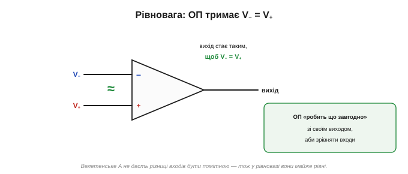
*Рис. 2.8.2.2. Самобалансування. Через велетенське A навіть крихітна різниця входів дала б зашкалений вихід. Тож у рівновазі різниці майже нема: ОП доганяє вихід до значення, за якого V₋ = V₊, і тримає його там.*

Зверніть увагу: V₋ = V₊ лише **майже** — мікроскопічна різниця все ж лишається, бо саме її, помножену на A, ОП і перетворює на свій вихід. Цю крихітну різницю звуть **сигналом похибки** *(error signal)*: вона — те «неузгодження», яке ОП безперервно намагається звести до нуля. Що більше A, то меншою може бути похибка за того самого виходу, то точніше тримається рівність. Тож «V₋ = V₊» — не буквальна правда, а напрочуд добре наближення; саме на ньому будуватимуться всі розрахунки ([§2.8.3](ch13-opamp-comparator.md)). Наскільки добре? За A = 100 000 і виході 10 В різниця входів — лише 0.1 мВ; вважати її нулем — похибка в тисячні частки відсотка, якою сміливо нехтують.

> 🔧 **Навіщо це.** Образ термостата. Ви ставите бажану температуру (це «+»), а термостат **робить що завгодно** з обігрівачем, аби фактична температура (це «−») зрівнялася з бажаною. Йому байдуже, наскільки сильний обігрівач, — він просто доводить кімнату до заданого. Так само ОП із від'ємним зворотним зв'язком — це «термостат для напруги»: ти задаєш бажане співвідношення (зовнішніми резисторами), а він жене свій вихід туди, де його входи зрівняються. Не «підсилювач, що множить», а **слуга, що вирівнює**.

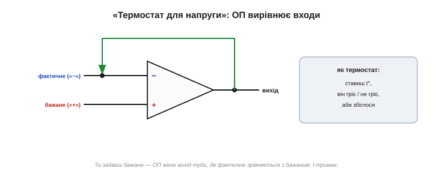
*Рис. 2.8.2.6. ОП із зворотним зв'язком — «термостат для напруги». Ти задаєш бажане («+»), він безперервно підправляє свій вихід, аж поки фактичне («−») не зрівняється з бажаним, — і тримає. Йому байдуже власне підсилення; його мета — звести різницю входів до нуля.*

Та сама ідея — у круїз-контролі авто: ти задаєш бажану швидкість, а система сама то піддає газу, то відпускає, аби втримати її, хай дорога йде вгору чи вниз. Їй байдуже, який мотор, — її робота звести різницю між заданою й фактичною швидкістю до нуля. ОП — такий самий **слідкувальний** пристрій (сервопривід), тільки для напруги, і діє він не секундами, а мільйонними частками секунди.

### Чому саме «від'ємний» — і що було б інакше

Чому зв'язок треба вести саме на **інвертуючий** вхід? Бо тоді він **протидіє** змінам — і це дає **стабільність**. А якби ми повернули вихід на **неінвертуючий** «+», вийшов би **додатний** зворотний зв'язок: підскочив вихід → підняв V₊ → ще дужче підняв вихід → і так лавиною, поки той не вгатиться в рейку й там не залипне. Додатний зв'язок не вгамовує, а **розгойдує**.

Тому правило: **від'ємний** зворотний зв'язок (на «−») — для стабільних підсилювачів; **додатний** (на «+») — для приладів, що мають «перекидатися» й залипати, як-от тригер Шмітта ([§2.8.8](ch13-opamp-comparator.md)). Сплутати їх — класична й болюча помилка: замість рівного підсилювача дістанеш генератор або «залипайло».

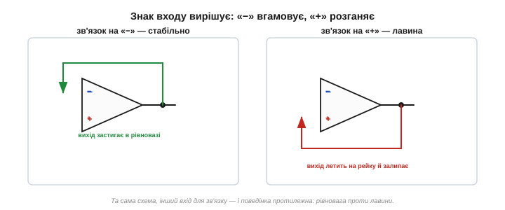
*Рис. 2.8.2.3. Дві долі зворотного зв'язку. На «−» — протидіє змінам, контур приходить у рівновагу (стабільний підсилювач). На «+» — підсилює зміни, вихід лавиною летить на рейку й залипає (тригер, генератор). Знак входу вирішує все.*

Практично це дає просте правило читання схем: перш ніж щось рахувати, **знайди, куди йде зворотний зв'язок**. Веде на «−» — перед тобою лінійний підсилювач, до нього застосовне правило V₋ = V₊. Веде на «+» (або зв'язку нема зовсім) — це компаратор чи тригер, і поводиться він зовсім інакше. Один погляд на петлю — і вже ясно, як читати всю схему.

### Головний обмін: підсилення на точність

А тепер — найважливіший наслідок, заради якого все й робиться. Що ми **отримуємо** натомість, віддавши велетенське підсилення в петлю зворотного зв'язку?

**Точність і стабільність.** Підсилення розімкненого ОП (A) — велетенське, але **примхливе**: воно різне в різних екземплярах, повзе з температурою, спадає з частотою ([§2.8.1](ch13-opamp-comparator.md)). Будувати на ньому точну схему годі. Та щойно ми замикаємо від'ємний зворотний зв'язок, **підсилення всієї схеми задають уже зовнішні резистори**, а не примхливе A. А резистори — дешеві, точні й стабільні. Отже, ми **виміняли** хитке велетенське підсилення на скромніше, зате **передбачуване** й тверде, як скеля.

Це той самісінький обмін, що ми вже бачили в транзисторному підсилювачі ([§2.6.7](../ch11-bjt/ch11-bjt.md)): там підсилення задавали не примхливим β, а відношенням резисторів Rc/Re — теж завдяки зворотному зв'язку. ОП доводить цю ідею до досконалості.


*Рис. 2.8.2.4. Чесний обмін. Розімкнене A — величезне, але «плаває» (екземпляр, температура, частота). Зворотний зв'язок виміняє його на менше, зате **точне й стабільне** підсилення, задане зовнішніми резисторами. Втрачаємо величину — здобуваємо передбачуваність.*

Цю ідею — навмисне «викинути» підсилення заради якості — подав **Гарольд Блек** ще 1927 року ([📜 історія](ch13-history-opamp.md)). Кажуть, осяяння прийшло до нього на поромі дорогою на роботу, і він нашвидку накидав схему просто на сторінці газети. Тоді думка віддавати дорогоцінне підсилення здавалася мало не безглуздям — а виявилася підмурком усієї точної електроніки на сто років уперед.

### Чому резистори, а не A: інтуїція

Як це можливо — щоб підсилення схеми не залежало від A самого приладу? Інтуїція така: завдяки величезному A зворотний зв'язок працює **майже бездоганно**, і фактичне співвідношення «вихід/вхід» визначається лише тим, **яку частину виходу** ми повертаємо назад, — а це задають резистори. Хай A буде 100 000 чи 2 000 000, хай повзе вдвічі з нагрівом — поки воно лишається «достатньо велетенським», зворотний зв'язок **проковтує** всю цю різницю, і вихід тримається там, де велять резистори.

Покажемо на числах. Хай A = 100 000, а резистори задають підсилення 10. Щоб дістати на виході, скажімо, 5 В, різниця входів має бути лише Vout/A = 5/100 000 = 0.05 мВ — мізер. Якщо A раптом подвоїться до 200 000, ця різниця стане 0.025 мВ — теж мізер; на виході практично ті самі 5 В. Зміна A удвічі майже не зачепила результат — бо весь «надлишок» підсилення йде на те, щоб міцніше тримати V₋ = V₊. Ось чому ОП роблять із таким абсурдно великим A: **не щоб сильно підсилювати, а щоб було чим платити за точність**.

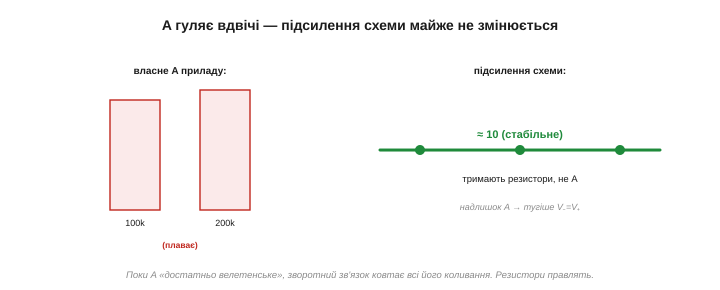
*Рис. 2.8.2.5. Чому стабільно. Хай власне A приладу гуляє вдвічі — підсилення схеми майже не змінюється, бо його тримає відношення зовнішніх резисторів. Надлишок A витрачається на те, щоб тугіше дотримувати V₋ = V₊. Резистори правлять, A лише «служить».*

І це ще не все, що дарує від'ємний зворотний зв'язок. Окрім стабільного підсилення, він **зменшує спотворення** (нелінійності самого ОП теж потрапляють у петлю й гасяться), **розширює смугу** рівної роботи й дає змогу **задавати наперед** вхідний та вихідний опір схеми. Одним прийомом — ціла жменя чеснот. Тому від'ємний зворотний зв'язок — не вузька хитрість для ОП, а наріжний принцип усієї якісної аналогової техніки: підсилювачі звуку, стабілізатори напруги, точні джерела струму тримаються на ньому.

Маленький приклад на відчуття. Підсилювач звуку без зворотного зв'язку, на самих транзисторах, неминуче трохи **спотворює** сигнал — його підсилення не зовсім однакове на гучних і тихих місцях. Охопи його від'ємним зв'язком — і петля сама вирівняє ці нерівності, бо будь-яке відхилення виходу від ідеалу вона тлумачить як похибку й гасить. Тому чистий, «прозорий» звук сучасної техніки — теж заслуга цього скромного принципу. Або стабілізатор напруги в кожному блоці живлення: усередині він порівнює свій вихід із внутрішнім еталоном і від'ємним зв'язком тримає напругу незмінною — хай струм навантаження стрибає, хай просідає вхід, — той самий «термостат», лише для вольтів. Куди не глянь у точній аналоговій техніці — скрізь працює ця сама петля.

Силу цього вгамовування інженери міряють **підсиленням у контурі** *(loop gain)* — тим, скільки власного A лишається «в запасі» після того, як частину віддали на потрібне підсилення схеми. Що більший запас, то тугіше зворотний зв'язок тримає бажане й то меншою стає похибка. Велетенське A приладу — це й є та комора, з якої черпають запас. А коли на високих частотах A спадає, тане й запас, і зворотний зв'язок слабшає — звідси й межі реального ОП ([§2.8.9](ch13-opamp-comparator.md)).

У цьому й «магія» з назви теми: ми навмисне **викинули** майже все підсилення приладу — і саме завдяки цьому дістали точність, якої з самого підсилення годі було б домогтися. Звучить як парадокс: щоб зробити надійний підсилювач, треба мати підсилення **з надлишком** і більшість його **роздати**. Та саме на цьому парадоксі тримається вся точна електроніка — від студійного мікрофона до прецизійного давача в супутнику.

### Що далі

Отже, від'ємний зворотний зв'язок перетворює некерований ОП на точний, передбачуваний прилад: повертаючи частину виходу на «−», ми змушуємо ОП тримати свої входи рівними, а підсилення схеми відтепер задають зовнішні резистори, а не примхливе A. Ми вже знаємо **принцип** — лишилося перетворити його на зручне **правило для розрахунку**. Воно зветься «віртуальне коротке» й уміщається в один рядок: у схемі з від'ємним зв'язком вважай, що V₋ = V₊, а у входи струм не тече. З цих двох рядків випливуть усі схеми наступних тем.

> ▶️ Далі: [§2.8.3 «Віртуальне коротке»: правило для розрахунку](ch13-opamp-comparator.md)

## 2.8.3 «Віртуальне коротке»: правило для розрахунку

У [§2.8.2](ch13-opamp-comparator.md) ми зрозуміли **принцип**: під від'ємним зворотним зв'язком ОП жене свій вихід туди, де його входи зрівнюються, V₋ = V₊. Тепер перетворимо цей принцип на **інструмент** — коротке правило, яким лічені рядки арифметики розв'яжуть будь-яку схему на ОП. Це правило — серце всієї практичної роботи з операційними підсилювачами.

### Два золоті правила

Уся премудрість аналізу схем на ОП уміщається у **два золоті правила**.

**Правило 1. У входи ОП струм не тече.** Вхідний опір ідеального ОП нескінченний ([§2.8.1](ch13-opamp-comparator.md)), тож входи лише «дивляться» на напругу, нічого з кіл не відбираючи. Жодного струму всередину «+» чи «−».

**Правило 2. Під від'ємним зворотним зв'язком входи мають однакову напругу: V₋ = V₊.** Це прямий наслідок [§2.8.2](ch13-opamp-comparator.md): ОП підправляє вихід доти, доки різниця входів не стане майже нульовою.

Усе. Озброївшись цими двома твердженнями, ви розрахуєте практично будь-яку схему на ОП, навіть не згадуючи про його велетенське A.

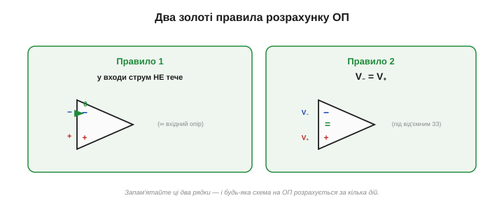
*Рис. 2.8.3.1. Два золоті правила. Перше — у входи ОП струм не тече (нескінченний вхідний опір). Друге — під від'ємним зв'язком входи рівні, V₋ = V₊. З цих двох рядків випливають усі схеми на ОП.*

### Чому «віртуальне коротке»

Зведімо правила в один яскравий образ. Правило 2 каже, що входи **на однаковій напрузі** — наче їх **закоротили** дротом. Але Правило 1 каже, що між ними **струму нема** — наче дроту й немає. Виходить дивна, але точна картина: входи поводяться так, ніби з'єднані накоротко **за напругою**, проте **без жодного струму** й без фізичного дроту. Цей стан і звуть **віртуальним коротким** *(virtual short)*: однакова напруга — як у коротко замкнених, та водночас повна електрична роз'єднаність.

Підкреслимо: коротке тут **не справжнє**. Входи не з'єднані; їхню рівність **силоміць тримає** зворотний зв'язок, безперервно підправляючи вихід. Заберіть зв'язок — і рівність миттю зникне. «Віртуальне» — бо існує не завдяки дроту, а завдяки старанням ОП.

Звідси типова пастка новачка: побачивши «V₋ = V₊», він іноді думає, ніби між входами **тече струм** або їх можна «з'єднати». Ні! Рівні **напруги** — так; струм між ними — **нуль** (правило 1). Віртуальне коротке діє лише на напругу, а за струмом входи глухо роз'єднані. Тримайте ці дві властивості нарізно — і жодних помилок не буде.

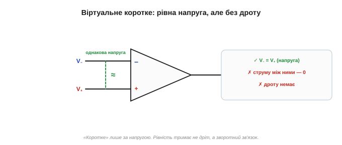
*Рис. 2.8.3.2. Віртуальне коротке. За напругою входи — мов закорочені (V₋ = V₊), та за струмом — повністю роз'єднані (струму між ними нема). Дроту немає; рівність тримає зворотний зв'язок. «Коротке» — лише на вигляд напруги.*

Як ОП фізично цього досягає? Безперервно. Хай «−» на крихту відхилився від «+» — ОП помножить цю різницю на велетенське A й так підправить вихід (а через зворотний зв'язок — і сам «−»), що різниця знову майже зникне. Він не «знає» формули V₋ = V₊ — він просто щомиті гасить найменше неузгодження, і входи тримаються рівними самі собою. Тож віртуальне коротке — не припущення «з повітря», а **результат** старанної роботи петлі, на який ми спокійно спираємося в розрахунках.

### Віртуальна земля — окремо корисний випадок

Дуже часто неінвертуючий вхід «+» просто **заземлюють** (під'єднують до 0 В). Тоді за віртуальним коротким і інвертуючий вхід «−» опиняється на **0 В** — хоч він нікуди не під'єднаний! Цей вузол звуть **віртуальною землею** *(virtual ground)*: він тримається на нулі не дротом до землі, а **зусиллям** ОП, що ганяє вихід так, аби «−» лишався на нулі.

Віртуальна земля — надзвичайно зручна для розрахунку: знаючи, що вузол на 0 В, миттєво обчислюєш струми крізь приєднані до нього резистори. Саме на ній тримається інвертуючий підсилювач, який ми зараз і розберемо як приклад.

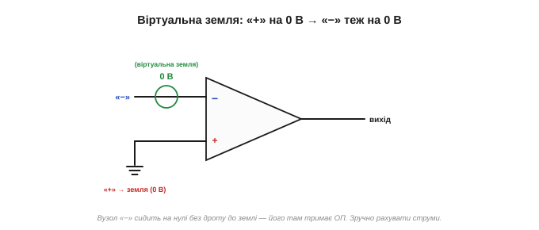
*Рис. 2.8.3.3. Віртуальна земля. Заземлили «+» (0 В) — і «−» теж стає на 0 В за віртуальним коротким, хоч до землі не приєднаний. ОП тримає його на нулі сам. Це різко спрощує підрахунок струмів довкола.*

### Рецепт аналізу

Маючи два правила, аналізують будь-яку схему на ОП за тим самим рецептом:

```
1) Переконайся, що зв'язок ВІД'ЄМНИЙ (іде на «−»)  — інакше правила не діють.
2) Постав V₋ = V₊  (віртуальне коротке).
3) Вважай, що у входи струм НЕ тече  (правило 1).
4) Запиши струми крізь зовнішні резистори (закон Ома) і прирівняй їх
   у вузлі біля входу (закон Кірхгофа для струмів).
5) Розв'яжи — зазвичай це два-три рядки.
```


*Рис. 2.8.3.5. Рецепт розрахунку схеми на ОП. Спершу — перевірка від'ємного зв'язку; далі віртуальне коротке й «нема вхідного струму»; решта — звичайні закони Ома й Кірхгофа. Усе зводиться до кількох рядків.*

Той самий рецепт працює й тоді, коли сигнал подають на «+», а не на «−»: змінюється лише, на яку напругу налаштоване віртуальне коротке. Звідси й вийде **неінвертуючий** підсилювач — його ми виведемо тими ж двома правилами в [§2.8.4](ch13-opamp-comparator.md). Інструмент один — а схем із нього багато.

### Приклад: інвертуючий підсилювач за три рядки

Покажемо силу правил на класичній схемі — **інвертуючому підсилювачі**. Вхідний сигнал Vin подають крізь резистор Rin на вхід «−»; від виходу на той самий вузол «−» іде резистор зворотного зв'язку Rf; а вхід «+» заземлено.

Розрахуймо:

```
«+» на землі  →  за віртуальним коротким  V₋ = V₊ = 0   (віртуальна земля)

струм крізь Rin:   Iin = (Vin − V₋) / Rin = Vin / Rin

у вхід «−» струм не тече (правило 1)  →  весь Iin іде крізь Rf:
   Iin = (V₋ − Vout) / Rf = (0 − Vout) / Rf = −Vout / Rf

прирівнюємо:   Vin / Rin = −Vout / Rf
звідси:        Vout / Vin = − Rf / Rin
```

Три рядки — і готово: **підсилення дорівнює −Rf/Rin**. Воно задане **лише відношенням двох резисторів** (рівно як обіцяв [§2.8.2](ch13-opamp-comparator.md)!), а знак «мінус» означає **інверсію** — вихід перевернутий відносно входу (звідси й назва). Наприклад, Rin = 1 кОм, Rf = 10 кОм → підсилення −10: подав +0.5 В — дістав −5 В.

Простежмо ще раз наскрізь, із іншими числами. Хай Rin = 2 кОм, Rf = 20 кОм, Vin = 0.3 В. На віртуальній землі струм Iin = 0.3 / 2000 = 0.15 мА; весь він іде крізь Rf, тож на Rf падає 0.15 мА × 20 кОм = 3 В; а оскільки один кінець Rf на віртуальному нулі, вихід сидить на **−3 В**. Перевірмо за формулою: Vout = −(Rf/Rin)·Vin = −10 × 0.3 = −3 В. Збіглося — і ми ні разу не згадали A.

Кілька перевірок на здоровий глузд. Якщо Rf = Rin — підсилення −1: схема просто **перевертає** сигнал, не змінюючи величини (інвертор знаку). Якщо Rf менший за Rin — підсилення менше за одиницю (схема **послаблює**). А вхідний опір цієї схеми дорівнює просто Rin: джерело «бачить» резистор Rin, що другим кінцем сидить на віртуальній землі. Усі ці висновки — з тих самих двох правил, без жодної нової формули. І практичне: оскільки підсилення тримає **відношення** резисторів, точність схеми — це точність резисторів (бери 1% чи краще), а ОП хай буде хоч який, аби A лишалося «достатньо велетенським». (До речі, той скромний вхідний опір, рівний Rin, — особливість саме **інвертуючої** схеми, бо джерело живить струм у віртуальну землю. У неінвертуючій же, де сигнал іде прямо на «+», вхідний опір велетенський — у той вхід струм не тече зовсім. Котру схему обрати, нерідко вирішує саме це; докладно — у [§2.8.4](ch13-opamp-comparator.md).)

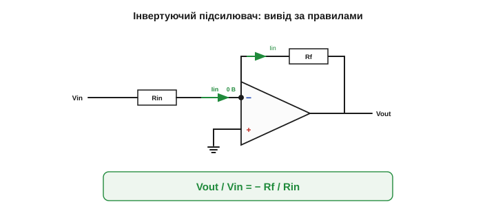
*Рис. 2.8.3.4. Виведення за правилами. Вузол «−» — віртуальна земля (0 В). Струм Vin/Rin втікає крізь Rin і, не маючи куди подітися (у вхід не йде), весь тече крізь Rf на вихід. Звідси Vout/Vin = −Rf/Rin за три рядки.*

Вузол «−» в цій схемі недарма звуть **підсумовувальним** *(summing junction)*: до нього збігаються струми, і за правилом 1 їм нікуди подітися, окрім як крізь Rf. Тому весь вхідний струм Vin/Rin **повністю** перетікає у Rf — і обертається на вихідну напругу. А якщо до того самого вузла підвести **кілька** входів, їхні струми складуться — і вийде суматор ([§2.8.6](ch13-opamp-comparator.md)). Саме так і рахували аналогові обчислювачі ([📜 історія](ch13-history-opamp.md)): на віртуальній землі напруги буквально **додавалися** як струми.

А що ж вихід? Вихід ОП постачає рівно той струм, якого потребує Rf (і навантаження), і тримає на собі ту напругу, яку велить розрахунок, — бо вихідний опір ідеального ОП нульовий ([§2.8.1](ch13-opamp-comparator.md)). Тому, до речі, **навантаження не впливає на підсилення**: хоч що повісь на вихід, ОП однаково втримає потрібну напругу. Підсилення задають лише Rin і Rf.

> 🔧 **Навіщо це.** Зверніть увагу на головний **зсув мислення**. Ми жодного разу не згадали ні про підсилення A, ні про те, що коїться всередині ОП. Ми просто прийняли, що ОП **виконує свою обіцянку** (тримає V₋ = V₊ й не бере струму) — і порахували наслідки. ОП перетворюється з «підсилювача, що множить» на просту **умову** (V₋ = V₊), яку накладено на схему. Саме ця абстракція й робить розрахунок тривіальним: думай не про прилад, а про умову, яку він підтримує.

І ще чим прекрасні ці правила — вони звільняють від **зубріння формул**. Не треба пам'ятати окремо «формулу інвертуючого», «формулу неінвертуючого», «формулу суматора»: досить щоразу прикласти два правила до конкретної схеми й вивести відповідь за лічені рядки. Один інструмент відмикає **всі** схеми на ОП. Саме тому ми й присвятили йому цілу тему, перш ніж братися за самі схеми.

### Коли правила НЕ діють

Одне застереження, щоб не нарватися. Правило 2 (V₋ = V₊) тримається **лише** за **від'ємного** зворотного зв'язку — коли петля йде на «−» й вгамовує схему ([§2.8.2](ch13-opamp-comparator.md)). Якщо ж зв'язку немає зовсім, або він **додатний** (на «+»), то ОП не вирівнює входи, а перекидається до рейки — і ніяке «V₋ = V₊» не діє. Тоді перед нами компаратор чи тригер ([§2.8.7](ch13-opamp-comparator.md), [§2.8.8](ch13-opamp-comparator.md)), і рахувати його треба зовсім інакше.

Тому **завжди** перший крок — поглянути, куди йде зворотний зв'язок. Іде на «−» — сміливо застосовуй віртуальне коротке. Іде на «+» (або нема) — відклади ці правила, тут інша історія.

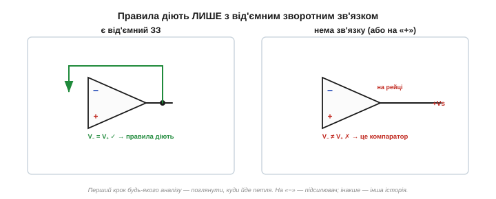
*Рис. 2.8.3.6. Межа застосування. Віртуальне коротке (V₋ = V₊) справедливе тільки під від'ємним зворотним зв'язком. Нема зв'язку чи він додатний — рівність не тримається, ОП на рейці, і правила не діють. Спершу перевір петлю.*

Підсумуймо силу методу. Два рядки правил — і будь-яка лінійна схема на ОП розкривається за кілька дій, без диференціальних рівнянь і без оглядки на нутрощі приладу. У реальному ОП ця відповідь точна не до останньої цифри (через скінченне A, [§2.8.9](ch13-opamp-comparator.md)), але похибка — тисячні частки відсотка, і для проєктування її сміливо ігнорують. Простота тут не ціною точності — вона майже безкоштовна.

### Що далі

Отже, у нас є робочий інструмент: два золоті правила (струму у входи нема; V₋ = V₊) і поняття віртуального короткого та віртуальної землі. Ми вже випробували їх на інвертуючому підсилювачі — і дістали відповідь за три рядки. Тепер настав час пройтися **каталогом** базових схем на ОП: інвертуючий і неінвертуючий підсилювачі, повторювач, суматор — і щоразу ці самі правила даватимуть відповідь майже миттєво. Відчуйте головне: один раз зрозумівши віртуальне коротке, ви фактично вже знаєте всі схеми наступних тем — лишилося прикласти його до кожної.

> ▶️ Далі: [§2.8.4 Неінвертуючий та інвертуючий підсилювач](ch13-opamp-comparator.md)

## 2.8.4 Неінвертуючий та інвертуючий підсилювач

Маючи в руках два золоті правила ([§2.8.3](ch13-opamp-comparator.md)), розберімо дві найважливіші схеми на ОП — два «робочі коники», з яких починається будь-яка аналогова збірка: **інвертуючий** і **неінвертуючий** підсилювачі. Обидва дають точне підсилення, задане резисторами; різняться вони знаком, формулою й вхідним опором. Виведемо кожен тими самими правилами.

### Інвертуючий підсилювач

Цю схему ми вже вивели в [§2.8.3](ch13-opamp-comparator.md), тож пригадаймо коротко. Сигнал Vin подають крізь резистор Rin на вхід «−»; від виходу на той самий вузол іде резистор зворотного зв'язку Rf; вхід «+» заземлено. Вузол «−» стає **віртуальною землею** (0 В), і за три рядки виходить:

```
Підсилення =  Vout / Vin  =  − Rf / Rin
```

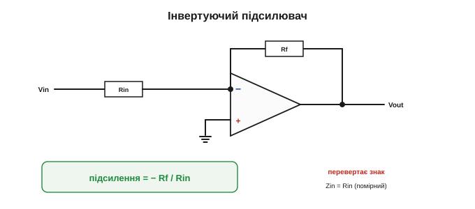
*Рис. 2.8.4.1. Інвертуючий підсилювач. Сигнал заходить крізь Rin на віртуальну землю «−»; Rf замикає зворотний зв'язок. Підсилення −Rf/Rin; знак «мінус» означає перевертання сигналу.*

Дві риси цієї схеми варто тримати в голові. По-перше, вона **перевертає** сигнал (знак «мінус»): додатний вхід дає від'ємний вихід. По-друге, її **вхідний опір дорівнює Rin** — джерело живить струм у віртуальну землю крізь Rin, тож «бачить» саме цей резистор. Опір цей помірний (кілоомні величини), і це інколи вада: слабке джерело такий вхід може «просадити».

Є й особливо корисний родич інвертуючої схеми — **перетворювач струму на напругу** *(transimpedance)*. Прибери вхідний резистор Rin і подай у віртуальну землю прямо **струм** — наприклад, від фотодіода ([§2.5.7](../ch10-diode-pn-junction/ch10-diode-pn-junction.md)). Цьому струмові нікуди дітися, окрім як крізь Rf, тож на виході постає напруга Vout = −I·Rf. Так крихітний фотострум обертають на зручну напругу — це серце кожного люксметра й оптичного приймача. Класична робота саме для віртуальної землі. Числом: фотодіод дає 1 мкА, Rf = 1 МОм → Vout = −I·Rf = −(1·10⁻⁶)·(1·10⁶) = −1 В. Мікроампер світлового струму став цілим вольтом, який легко виміряти; що яскравіше світло — то більший струм — то більша напруга.

### Неінвертуючий підсилювач

А тепер — інша схема, у якій сигнал заходить **прямо на «+»**. Зворотний зв'язок беруть з виходу через дільник напруги: резистор Rf з виходу на вузол «−» і резистор Rg з того ж вузла на землю. Виведемо підсилення.

```
сигнал на «+»:        V₊ = Vin
віртуальне коротке:    V₋ = V₊ = Vin

вузол «−» — це вихід дільника Rf–Rg (струму у вхід нема, правило 1):
   V₋ = Vout · Rg / (Rg + Rf)

прирівнюємо:   Vin = Vout · Rg / (Rg + Rf)
звідси:        Vout / Vin = (Rg + Rf) / Rg  =  1 + Rf / Rg
```

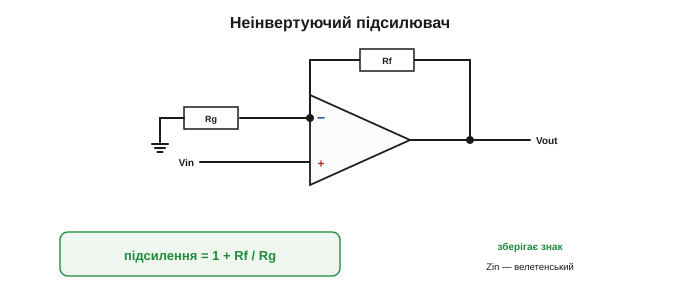
*Рис. 2.8.4.2. Неінвертуючий підсилювач. Сигнал заходить прямо на «+»; дільник Rf–Rg повертає частину виходу на «−». Підсилення 1+Rf/Rg — завжди додатне (без перевертання) і не менше за одиницю.*

Маленьке уточнення: дільник Rf–Rg «тягне» струм не з джерела сигналу (той сидить на «+», звідки струму не беруть), а з **виходу** ОП. Тому опір цього дільника обирають помірним — не надто малим, щоб не вантажити вихід зайвим струмом, і не надто великим, щоб струми зміщення входу ([§2.8.9](ch13-opamp-comparator.md)) не псували точність. Типово це кілоомні номінали.

Знову три рядки — і відповідь: **підсилення 1 + Rf/Rg**. Воно теж задане лише резисторами, але має дві відмінності від інвертуючого. По-перше, воно **додатне** — сигнал **не перевертається**. По-друге — і це головна перевага — сигнал заходить прямо на вхід «+», у який **струм не тече зовсім** (правило 1), тож **вхідний опір цієї схеми велетенський**. Вона майже не вантажить джерело — ідеально для слабких давачів.

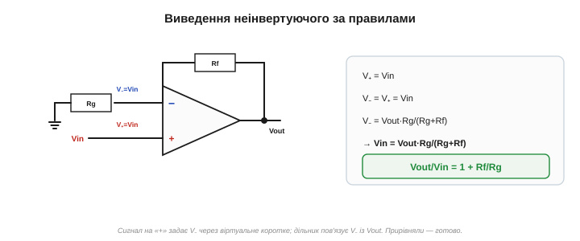
*Рис. 2.8.4.3. Виведення за правилами. V₊ = Vin (сигнал прямо на «+»); віртуальне коротке робить V₋ = Vin; а V₋ — це вихід дільника Rf–Rg. Прирівнявши, дістаємо 1 + Rf/Rg.*

Звідки в неінвертуючому той «+1»? Інтуїтивно: сигнал на «+» **і так** з'являється на виході в повному розмірі (бо вихід женеться за ним), а резистори лише **додають** зверху ще Rf/Rg підсилення. Тому мінімум — одиниця: навіть без жодного додаткового підсилення вихід точно повторює вхід. Інакше це бачать через **частку зворотного зв'язку**: дільник Rf–Rg повертає на «−» лише частку Rg/(Rg+Rf) виходу, і ОП підганяє вихід так, щоб ця частка зрівнялася з усім Vin, — а отже, вихід має бути в (Rg+Rf)/Rg = 1+Rf/Rg разів більший за вхід. Менша повернута частка — більше підсилення; це загальна логіка будь-якого підсилювача зі зворотним зв'язком.

> 🔧 **Навіщо це.** Дві формули, які варто закарбувати (а ще краще — уміти **вивести** за правилами [§2.8.3](ch13-opamp-comparator.md)): **інвертуючий — `−Rf/Rin`**, **неінвертуючий — `1 + Rf/Rg`**. Зверніть увагу на «+1» у неінвертуючому: він означає, що така схема **не вміє послаблювати** — її підсилення завжди ≥1 (навіть із Rf = 0 вийде рівно ×1, повторювач, [§2.8.5](ch13-opamp-comparator.md)). Інвертуюча ж може давати й менше за одиницю — тобто **послаблювати**. Це одна з відмінностей, що диктують вибір.

А що, як треба і **високий вхідний опір**, і підсилення **менше за одиницю** (послабити, не вантажачи джерело)? Неінвертуючий цього не вміє (його мінімум — одиниця), інвертуючий вантажить джерело своїм Rin. Розв'язок — **поєднати** блоки: спершу буфер-повторювач ([§2.8.5](ch13-opamp-comparator.md)) з велетенським входом, а вже після нього звичайний дільник. Гнучкість ОП саме в тому, що готові блоки складають у ланцюги, як деталі конструктора.

### Дві схеми поряд

Зведімо різницю в таблицю.

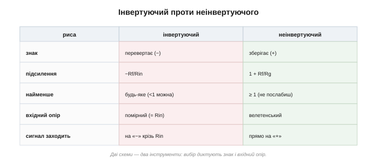
*Рис. 2.8.4.4. Інвертуючий проти неінвертуючого. Різний знак, різні формули підсилення, різний вхідний опір і різне місце входу сигналу. Дві схеми — два інструменти під різні потреби.*

Словами:

- **Знак:** інвертуючий **перевертає** (−), неінвертуючий **зберігає** (+).
- **Підсилення:** −Rf/Rin проти 1+Rf/Rg.
- **Найменше підсилення:** інвертуючий — будь-яке (можна <1, тобто послаблювати); неінвертуючий — **не менше за 1**.
- **Вхідний опір:** інвертуючий — помірний (= Rin); неінвертуючий — **велетенський** (вхід на «+»).
- **Куди заходить сигнал:** інвертуючий — на «−» крізь Rin; неінвертуючий — прямо на «+».

### Коли яку брати

Вибір диктують саме ці відмінності:

- **Неінвертуючий** беруть, коли головне — **не навантажити джерело**: слабкі давачі, високоомні джерела, входи, з яких не можна «висмоктувати» струм. Платять за це тим, що підсилення не опускається нижче 1 і знак не перевертається.
- **Інвертуючий** беруть, коли потрібна **віртуальна земля** (для суматорів [§2.8.6](ch13-opamp-comparator.md), перетворювачів «струм→напруга»), коли треба **послабити** сигнал, або коли перевертання знаку не заважає (а часто й бажане). Ціна — помірний вхідний опір Rin.


*Рис. 2.8.4.5. Вибір схеми. Неінвертуючий — коли не можна вантажити джерело (давачі). Інвертуючий — коли потрібні віртуальна земля, послаблення чи перевертання. Часто рішення диктує саме вхідний опір.*

Кілька прикладів із життя. Неінвертуючий — це класичний **підсилювач давача**: мікрофон, термопара, тензодавач дають слабкий сигнал із високим внутрішнім опором, і неінвертуюча схема підсилює його, не «висмоктуючи» струму. Інвертуючий — серце аналогового **мікшера** (на основі суматора, [§2.8.6](ch13-opamp-comparator.md)) і схем обробки сигналу, де перевертання знаку байдуже або корисне. Майже в кожному приладі знайдеться по кілька і тих, і тих.

### Числа на двох прикладах

Покажемо обидві з тими самими резисторами, щоб різниця впала в око.

```
ІНВЕРТУЮЧИЙ:    Rin = 1 кОм, Rf = 10 кОм
   підсилення = −Rf/Rin = −10
   Vin = +0.5 В  →  Vout = −5.0 В      (перевернуто; Zin = 1 кОм)

НЕІНВЕРТУЮЧИЙ: Rg = 1 кОм, Rf = 9 кОм
   підсилення = 1 + Rf/Rg = 1 + 9 = 10
   Vin = +0.5 В  →  Vout = +5.0 В      (той самий знак; Zin — велетенський)
```

Обидві дають однакову **величину** підсилення (×10), але інвертуючий перевертає знак і має скромний вхідний опір, а неінвертуючий зберігає знак і майже не вантажить джерело. Зверніть увагу на дрібну, але важливу деталь: щоб дістати підсилення 10, інвертуючому треба відношення Rf/Rin = 10, а неінвертуючому — Rf/Rg = 9 (бо там додається одиниця). Дрібна арифметична пастка, на якій легко спіткнутися, — тож перш ніж паяти, варто ще раз перевірити формулу під свою схему.

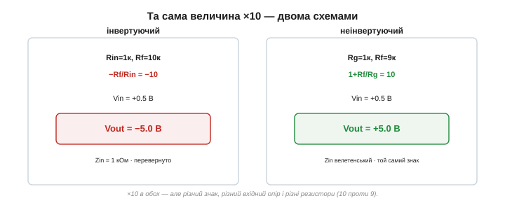
*Рис. 2.8.4.6. Та сама величина підсилення (×10) двома схемами. Інвертуючий: −5 В, Zin = 1 кОм. Неінвертуючий: +5 В, Zin велетенський. І відношення резисторів різні: 10 проти 9 (через «+1»).*

А коли потрібне дуже велике підсилення — скажімо, ×1000? Робити його одним каскадом незручно, тому великий коефіцієнт набирають **кількома каскадами** поспіль: два по ×30 дають ×900, три по ×10 — ×1000. Підсилення каскадів **перемножуються**, рівно як ми бачили в транзисторному підсилювачі ([§2.6.7](../ch11-bjt/ch11-bjt.md)). Блоки на ОП легко зчіплювати, бо в кожного нульовий вихідний і (для неінвертуючого) велетенський вхідний опір — вони не заважають один одному.

Чому ж незручно тиснути все підсилення в один каскад? Бо в реального ОП величина підсилення й **смуга** частот пов'язані: що більше підсилення накрутиш, то вужчою стає смуга, у якій воно тримається ([§2.8.9](ch13-opamp-comparator.md)). Кілька помірних каскадів дають і велике сумарне підсилення, і пристойну смугу — ще одна причина не вичавлювати все з одного ОП.

Уявіть типовий аналоговий тракт сучасного приладу: давач → неінвертуючий підсилювач (велетенський вхід, не вантажить давач) → ще один каскад підсилення → фільтр на ОП → і нарешті сигнал заходить в АЦП мікроконтролера, щоб стати цифрою. Кожна ланка тут — окремий блок на операційному підсилювачі, і кожен виводиться тими самими двома правилами ([§2.8.3](ch13-opamp-comparator.md)). Опанувавши інвертуючий і неінвертуючий, ви вже тримаєте в руках дві третини всього потрібного для аналогової обробки сигналу. Решта тем розділу лише додають до цього набору спеціальні блоки — буфер, суматор, компаратор, тригер, — і всі вони, як побачимо, виводяться тим самим способом. Операційний підсилювач тому й цінний, що з кількох однакових на вигляд трикутників і жменьки резисторів складається безліч різних схем.

> 🔧 **Навіщо це.** Практичні застороги до обох схем. (1) Не проси більшого виходу, ніж дозволяють рейки живлення ([§2.8.1](ch13-opamp-comparator.md)): підсилення 100 від сигналу 0.2 В хотіло б 20 В на виході — а ОП дасть лише до рейки й насититься. (2) Точність підсилення — це точність резисторів ([§2.8.3](ch13-opamp-comparator.md)): хочеш рівно ×10 — бери резистори 1%. (3) Не сплутай формули: зайва (чи забута) одиниця в неінвертуючому — найчастіша помилка новачка.

Ще дві практичні тонкощі наостанок. **Живлення й нуль:** якщо ОП живиться двополярно (±Vs), «нулем» для сигналу є справжня земля. А коли живлення однополярне (0…5 В від мікроконтролера), вихід не може піти нижче нуля — тож змінний сигнал «піднімають» на **середину живлення**, навколо якої він і гойдається; забути про це — типова причина, чому «підсилювач не працює» на одній батарейці. І **струм виходу:** ОП віддає лише обмежений струм (типово десятки міліампер), тож динамік чи моторчик він напряму не розгойдає — для потужного навантаження після ОП ставлять буфер чи MOSFET-каскад ([§2.7.6](../ch12-mosfet/ch12-mosfet.md)). ОП — для **сигналу**, не для сили.

І ще: щоб підсилювати **змінний** сигнал (звук, биття пульсу), не чіпаючи його постійної складової, на вході ставлять **розділовий конденсатор** ([Розділ 2.1](../ch07-capacitor/ch07-capacitor.md)) — він пропускає змінну частину, а постійне зміщення схеми лишає на місці. Ідея та сама, що в транзисторному підсилювачі ([§2.6.7](../ch11-bjt/ch11-bjt.md)), лише прилад зручніший.

### Що далі

Отже, два золоті правила дали нам два робочі підсилювачі: інвертуючий (−Rf/Rin, помірний вхід, перевертає) і неінвертуючий (1+Rf/Rg, велетенський вхід, зберігає знак). Є й гранична, найпростіша форма неінвертуючого — коли підсилення дорівнює рівно одиниці. Здавалося б, навіщо підсилювач, що нічого не підсилює? А виявляється, він — один із найкорисніших: **повторювач-буфер**. Його єдина робота — **розв'язати** опори: узяти напругу з кволого високоомного джерела й віддати її потужно, не змінивши ні на вольт. Саме з нього й почнемо далі.

> ▶️ Далі: [§2.8.5 Повторювач (буфер): розв'язка опорів](ch13-opamp-comparator.md)

## 2.8.5 Повторювач (буфер): розв'язка опорів

У [§2.8.4](ch13-opamp-comparator.md) ми побачили граничний випадок неінвертуючого підсилювача — коли підсилення дорівнює рівно **одиниці**. Здавалося б, навіщо підсилювач, що нічого не підсилює? А виявляється, ця схема — **повторювач**, або **буфер** — одна з найкорисніших у всій аналоговій техніці. Її цінність не в підсиленні напруги, а в дечому іншому — у **розв'язці опорів**.

### Найпростіша схема на ОП

Зробити повторювач простіше нікуди: з'єднай вихід **прямо** з інвертуючим входом «−», а сигнал подай на «+». Жодних резисторів. Порахуймо за правилами ([§2.8.3](ch13-opamp-comparator.md)):

```
сигнал на «+»:        V₊ = Vin
віртуальне коротке:    V₋ = V₊ = Vin
вихід прямо на «−»:    Vout = V₋ = Vin

          Vout = Vin     (підсилення рівно ×1)
```

Вихід **точно повторює** вхід — звідси й назва. До того ж це найчистіше підсилення в електроніці: рівно одиниця, без жодних резисторів, тож і без їхніх допусків — єдина схема на ОП, чия точність не залежить геть ні від чого зовнішнього, лише від самої ідеї зворотного зв'язку. Інакше це той самий неінвертуючий підсилювач із Rf = 0 (тоді 1 + Rf/Rg = 1).

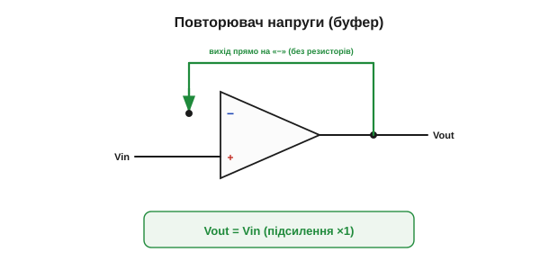
*Рис. 2.8.5.1. Повторювач напруги. Вихід замкнено прямо на вхід «−», сигнал — на «+». Жодних резисторів; підсилення точно ×1. Вихід повторює вхід вольт у вольт.*

### Навіщо підсилювач, що не підсилює

Якщо напруга на виході та сама, що й на вході, у чому ж користь? У **перетворенні опорів**. Згадаймо два ідеальні припущення ([§2.8.1](ch13-opamp-comparator.md)): вхідний опір ОП велетенський, вихідний — нульовий. Тож повторювач:

- **на вході** майже нічого не споживає (велетенський вхідний опір) — він майже не вантажить джерело сигналу;
- **на виході** видає ту саму напругу, але вже з **силою** — здатен живити чимале навантаження, не просідаючи (нульовий вихідний опір).

Інакше кажучи, буфер бере **кволу** напругу зі слабкого джерела й віддає **ту саму** напругу, але «накачану м'язами»: тепер за нею стоїть струм. Напруга не змінилася — змінилося те, **скільки струму вона може дати**. Це наче перекласти крихкий напис на міцну табличку: текст той самий, та триматиметься він тепер під будь-яким вантажем.

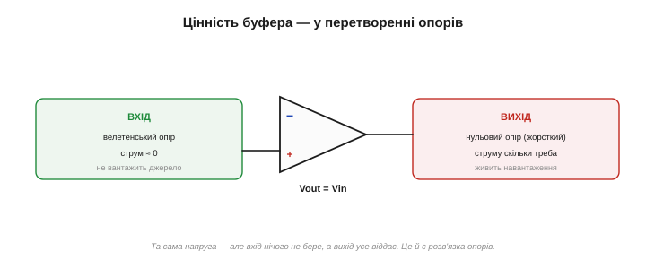
*Рис. 2.8.5.2. Цінність буфера — не в напрузі, а в опорах. Вхід велетенський (не вантажить джерело), вихід «жорсткий» (живить навантаження). Напруга та сама — але тепер за нею стоїть сила.*

Що ж означає «жорсткий вихід» по суті? Те, що ОП **постачає рівно той струм**, якого потребує навантаження, аби втримати задану напругу. Вимагає навантаження більше струму — ОП дає більше, не опускаючи напруги; менше — дає менше. Усе завдяки зворотному зв'язку: вихід підправляється доти, доки на навантаженні не встановиться потрібна напруга, хоч скільки б воно тягнуло (у межах того, що ОП узагалі здатен віддати).

Звідси й парадокс назви: «повторювач напруги» насправді **підсилює потужність**. Напругу він лишає тією самою (×1), зате струм за нею може зрости в тисячі разів: на вхід заходить майже нуль струму, з виходу витікає скільки треба. Буфер — це, по суті, **підсилювач струму** в масці підсилювача напруги. Тому його й ставлять там, де напруга вже правильна, а от **сили** за нею бракує.

### Проблема, яку він розв'язує: просідання

Щоб оцінити буфер, треба згадати **проблему навантаження** ([§2.6.7](../ch11-bjt/ch11-bjt.md)). Кволе джерело з великим власним опором, під'єднане **напряму** до важкого навантаження з малим опором, **просідає**: навантаження висмоктує струм, і напруга падає, бо джерело не може його втримати.

Класичний винуватець — **дільник напруги**. Скажімо, два резистори по 10 кОм від +5 В дають посередині рівно 2.5 В — гарне опорне джерело. Та щойно ви під'єднаєте до цієї точки навантаження, що споживає струм, воно «зашунтує» нижній резистор, і 2.5 В **обваляться**. Дільник кволий — у нього великий власний опір (кілооми), тож будь-яке помітне навантаження його псує.

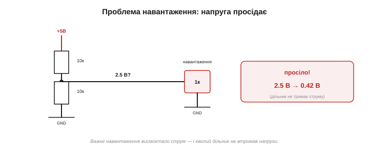
*Рис. 2.8.5.3. Просідання. Кволе джерело (дільник із кілоомним опором) під'єднали напряму до важкого навантаження — і напруга обвалилася, бо джерело не тримає струму. Без розв'язки точне опорне джерело псується від найменшого навантаження.*

Може здатися, що проблему розв'язав би просто **товстіший дріт** чи менші резистори в дільнику. Дрібніші резистори справді менше просідають — але тоді дільник сам безперервно жере чималий струм від живлення (марнотратство, надто в батарейному пристрої), а слабке джерело на кшталт давача такого взагалі не дозволяє. Буфер дає краще з обох світів: дільник лишається економним і високоомним, а навантаження дістає жорстку напругу. Розв'язати опори дротом не можна — потрібен **активний** прилад, що сам додасть струму.

### Як буфер це лікує

Поставте між кволим джерелом і важким навантаженням **повторювач** — і проблема зникає. Дивіться, що відбувається:

- буфер своїм велетенським входом майже **не вантажить** джерело — дільник «бачить» порожнечу й тримає рівно свої 2.5 В;
- буфер своїм жорстким виходом **живить** навантаження потрібним струмом — і тримає на ньому ті самі 2.5 В, не просідаючи.

Джерело й навантаження тепер **розв'язані**: одне одному не заважає. Слабке джерело задає **напругу**, а струм для навантаження дає вже буфер зі свого виходу. Саме тому буфер ще звуть **розв'язувальним** *(isolation)* каскадом.

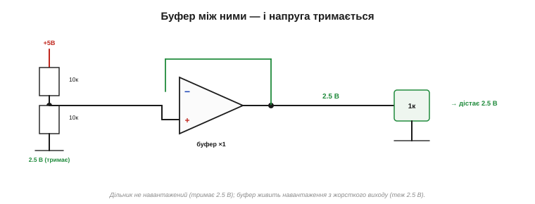
*Рис. 2.8.5.4. Розв'язка буфером. Повторювач між джерелом і навантаженням: дільник не вантажиться (тримає 2.5 В), навантаження живиться з жорсткого виходу (теж 2.5 В). Напругу задає джерело, силу дає буфер.*

Корисний образ: буфер — це **однобічний клапан для впливу**. Сигнал-напруга проходить крізь нього зліва направо без змін; а от **вплив навантаження** назад на джерело не проходить зовсім. Праворуч можна чіпляти що завгодно, хоч коротке замикання — джерело ліворуч цього навіть «не відчує». Саме ця однобічність і робить буфер цінним: він пропускає сигнал, але не пропускає **проблеми** назад.

### Числа: дільник із буфером і без

Покажемо різницю на числах. Дільник 10 кОм / 10 кОм від +5 В дає на середині 2.5 В. Під'єднаймо навантаження 1 кОм.

```
БЕЗ буфера (напряму):
   нижнє плече = 10 кОм ∥ 1 кОм ≈ 0.91 кОм
   Vсеред = 5 · 0.91 / (10 + 0.91) ≈ 0.42 В     ← обвалилося з 2.5 до 0.42 В!

ІЗ буфером:
   дільник не навантажений → тримає 2.5 В
   буфер повторює → навантаження дістає 2.5 В (струм 2.5 мА бере буфер, не дільник)
```

Без буфера опорна напруга впала майже вшестеро — джерело зіпсоване. Із буфером — рівні **2.5 В**, як і задумано. Один копійчаний повторювач урятував усю схему.

Звідки ж береться той струм 2.5 мА, що тепер живить навантаження? Не з дільника (той майже не навантажений) і не із самого сигналу — а з **живлення** операційного підсилювача, через його вихід. Буфер ніби каже джерелу: «лише скажи мені напругу, а струм я знайду сам». Тому й слабке джерело здатне «командувати» сильним виходом: командує воно напругою, а силу постачає живлення буфера. У цьому й суть розв'язки — розділити того, хто **задає** напругу, і того, хто **дає** до неї струм.


*Рис. 2.8.5.5. Числа. Опорні 2.5 В із дільника: напряму навантаження 1 кОм валить їх до 0.42 В; буфер між ними тримає рівно 2.5 В. Те саме джерело, та сама напруга — різниця лише в розв'язці.*

Дільник — лише найнаочніший приклад; та сама біда чигає й на **давачі** з високим власним опором. pH-електрод, п'єзодавач, фотоелемент у режимі напруги дають правильний сигнал, але майже не можуть дати струму — під'єднай їх напряму до входу, що бодай трохи споживає, і покази «попливуть». Буфер одразу за давачем розв'язує проблему: давач віддає лише напругу буферові (який нічого не бере), а далі вже працює жорсткий вихід буфера. Без цього кроку точні вимірювання з високоомних давачів просто неможливі. Для зовсім високоомних джерел (мегаоми й вище) важливо взяти ОП із **польовими входами**: у нього вхідний струм — пікоампери ([§2.8.1](ch13-opamp-comparator.md)), і навіть на велетенському опорі давача він не створить помітної похибки. Звичайний ОП із біполярними входами (як 741) тут міг би трохи «підтруювати» вимір своїм вхідним струмом — тож правильний вибір приладу теж частина мистецтва буферизації.

> 🔧 **Навіщо це.** Запам'ятайте призначення буфера однією фразою: він **розв'язує** кволе джерело й важке навантаження. Ставте повторювач щоразу, коли точну напругу з високоомного джерела (дільник, опорне джерело, давач) треба віддати кудись, що споживає струм (наступний каскад, АЦП, довгий кабель, навантаження). Підсилення тут ×1 — і це навмисне: ми не хочемо міняти напругу, лише «підкріпити» її струмом. Один із найчастіших і найкорисніших трюків в аналоговій схемотехніці.

Де його ставлять на ділі? Перед **АЦП** мікроконтролера, щоб давач не просів від вхідної ємності перетворювача. Між **каскадами фільтра**, щоб один не вантажив наступний і не псував його налаштувань. На вихід **довгого кабелю** чи на **важке навантаження**, якого делікатний сигнал сам не розгойдав би. І в зв'язці «буфер + дільник» — щоб дістати підсилення **менше за одиницю** з велетенським входом, чого не вміла жодна окрема схема ([§2.8.4](ch13-opamp-comparator.md)).

У ширшому сенсі буфер — це інструмент **складання систем із незалежних блоків**. Поставивши його між двома каскадами, ви гарантуєте, що другий не «потягне» перший і не зіб'є його налаштувань. Саме так будують складні аналогові тракти: кожен блок проєктують окремо, а буфери тримають їх **розв'язаними**, щоб вони не псували один одного. Без такої розв'язки складна схема обернулася б на клубок взаємних впливів, де кожна зміна тягне за собою десять інших.

Знадобиться буфер і в наших майбутніх проєктах: вихід ЦАП мікроконтролера (чи згладжений ШІМ, [§2.7.7](../ch12-mosfet/ch12-mosfet.md)) дає правильну напругу, але кволу — а буфер перетворить її на «жорстку», здатну щось живити. Тож повторювач — не академічна цікавинка, а щоденний робочий інструмент.

### Стара знайома: емітерний повторювач

Якщо вам здалося, що ви це вже бачили, — так і є. Рівно ту саму роботу робив **емітерний повторювач** на транзисторі ([§2.6.7](../ch11-bjt/ch11-bjt.md)): великий вхідний опір, малий вихідний, підсилення ≈1 — буфер. Операційний підсилювач робить це **краще**: підсилення не «приблизно 1», а точно 1; вхідний опір не «великий», а велетенський; вихідний — практично нульовий. Та сама ідея, доведена до ідеалу.

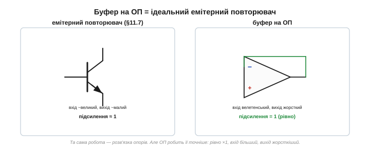
*Рис. 2.8.5.6. Знайома ідея. Емітерний повторювач на транзисторі (§2.6.7) і буфер на ОП роблять те саме — розв'язують опори. Та ОП робить це точніше: ×1 рівно, вхід велетенський, вихід жорсткий. Абстракція знову виграє.*

Чи буфер безкоштовний? Майже. Він коштує одного ОП і трохи місця, а ще успадковує межі реального приладу: віддати може лише обмежений струм (динаміка напряму не розгойдає, [§2.8.4](ch13-opamp-comparator.md)) і працює до певної частоти. Та для своєї роботи — «віддати точну напругу під навантаження» — він майже ідеальний, і ця ціна мізерна проти користі.

Одна технічна тонкість наостанок: повторювач — це **найжорсткіший** зворотний зв'язок (на вхід вертається весь вихід), і саме в цьому режимі деякі ОП схильні до самозбудження. Тому в даташиті дивляться, чи ОП «стійкий за одиничного підсилення» *(unity-gain stable)*; більшість сучасних — стійкі, та знати про це варто. Докладніше про межі стійкості — у [§2.8.9](ch13-opamp-comparator.md).

### Що далі

Отже, повторювач — підсилювач із одиничним підсиленням, чия сила в **перетворенні опорів**: він бере напругу зі слабкого джерела й віддає її, не змінивши, але з силою, щоб живити навантаження. Це наш перший «службовий» блок, що не рахує й не підсилює, а **узгоджує**. Далі повернімося до підсилення, але вже хитрішого: змусимо ОП **складати** й **віднімати** напруги — і це вже не «службова» робота, а справжнє повернення операційного підсилювача до його коренів, бо саме для математики він і народився.

> ▶️ Далі: [§2.8.6 Суматор і різницевий підсилювач](ch13-opamp-comparator.md)

## 2.8.6 Суматор і різницевий підсилювач

Повторювач ([§2.8.5](ch13-opamp-comparator.md)) узагалі нічого не рахував. Тепер змусимо ОП робити справжню **математику** — **складати** й **віднімати** напруги. Це не екзотика, а пряме повернення до коренів: саме для таких операцій операційний підсилювач і створили в аналогових обчислювачах ([📜 історія](ch13-history-opamp.md)). І, що приємно, обидві схеми виводяться тими самими двома правилами ([§2.8.3](ch13-opamp-comparator.md)).

### Суматор: складаємо напруги

Суматор — це просто інвертуючий підсилювач ([§2.8.4](ch13-opamp-comparator.md)) з **кількома входами**. Замість одного резистора Rin до віртуальної землі ведуть **кілька** — R1, R2, R3 — кожен зі своїм сигналом V1, V2, V3; зворотний зв'язок, як завжди, через Rf; вхід «+» заземлено.

Розрахунок — за тим самим рецептом. Вузол «−» — віртуальна земля (0 В), тож кожен вхід жене в неї свій струм:

```
I1 = V1/R1,   I2 = V2/R2,   I3 = V3/R3
```

У вхід ОП струм не тече (правило 1), тож усі ці струми **складаються** й цілком ідуть крізь Rf. А струм крізь Rf — це −Vout/Rf. Прирівнявши:

```
V1/R1 + V2/R2 + V3/R3 = −Vout/Rf

Vout = − Rf·( V1/R1 + V2/R2 + V3/R3 )
```

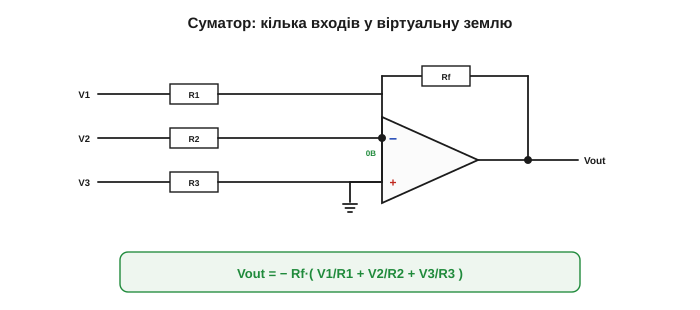
*Рис. 2.8.6.1. Суматор. Кілька входів крізь свої резистори ведуть у спільну віртуальну землю; струми там складаються й ідуть крізь Rf. Вихід — зважена сума входів зі знаком «мінус».*

Якщо всі вхідні резистори **однакові** (R1 = R2 = R3 = R), формула спрощується до `Vout = −(Rf/R)·(V1+V2+V3)` — **сума** входів, помножена на спільний коефіцієнт. А якщо ще й Rf = R, то `Vout = −(V1+V2+V3)` — **чиста сума** (з інверсією). Операційний підсилювач буквально склав напруги.

Порахуймо на числах. Три входи 1.0 В, 2.0 В і 0.5 В, усі вхідні резистори по 10 кОм, Rf = 10 кОм: Vout = −(1 + 2 + 0.5) = **−3.5 В**. Чиста сума зі знаком «мінус». А ще зручний родич суматора — **усереднювач**: візьми Rf у N разів меншим за вхідні резистори (де N — кількість входів), і сума поділиться на N — вихід дасть **середнє** входів. Складати, усереднювати, масштабувати — усе тим самим вузлом, лише міняючи резистори.

### Чому це працює: струми додаються

Найгарніше тут — **механізм**. Складання відбувається не «в підсилювачі», а на **віртуальній землі**: кожен вхід незалежно ллє туди свій струм (бо вузол на 0 В, і входи «не бачать» один одного), а закон Кірхгофа просто **підсумовує** ці струми в одному вузлі. ОП же лише забирає сумарний струм крізь Rf й обертає його на напругу. Саме так додавали числа аналогові обчислювачі: **напруги → струми → сума струмів → напруга** ([📜 історія](ch13-history-opamp.md)).

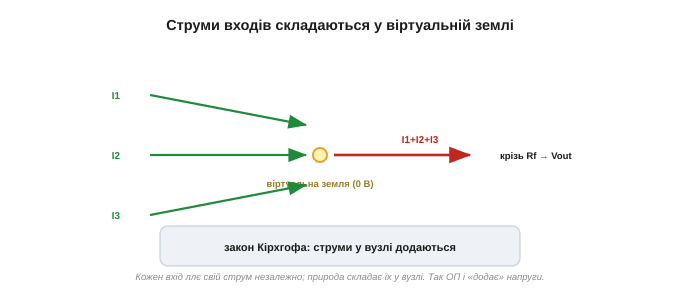
*Рис. 2.8.6.2. Магія суматора — у вузлі. Кожен вхід ллє свій струм у віртуальну землю незалежно від інших; закон Кірхгофа складає їх, а Rf обертає суму на напругу. Додавання «руками природи».*

> 🔧 **Навіщо це.** Класичне застосування суматора — **аудіомікшер**. Кілька джерел звуку (мікрофон, гітара, синтезатор) заводять на входи через окремі резистори, і вихід — їхня суміш. Більше: підбираючи окремі вхідні резистори, кожному каналу задають **свою гучність** (свій коефіцієнт у зваженій сумі). Той самий принцип — у цифро-аналогових перетворювачах на зважених резисторах: біти подають на суматор через резистори R, R/2, R/4…, і сума дає аналогову напругу, пропорційну двійковому числу.


*Рис. 2.8.6.3. Мікшер на суматорі. Кілька джерел звуку заходять на спільну віртуальну землю через свої резистори; вихід — їхня суміш. Менший вхідний резистор → більший внесок каналу, тобто його «гучність».*

Розгорнімо приклад **цифро-аналогового перетворювача**. Два біти двійкового числа подають як 0 або 5 В: молодший біт — крізь резистор 2R, старший — крізь удвічі менший R (тобто удвічі більший струм). Суматор складе їхні струми у відношенні 1 : 2 — і вихід дасть рівно чотири рівні (00, 01, 10, 11) однаковими сходинками. Більше бітів — більше градацій; так із суматора й кількох резисторів виходить простий ЦАП.

### Різницевий підсилювач: віднімаємо

Тепер протилежна операція — **віднімання**. Згадаймо, що сам ОП за природою підсилює **різницю** входів ([§2.8.1](ch13-opamp-comparator.md)); різницевий підсилювач лише вгамовує цю шалену здатність резисторами до **точного, заданого** підсилення різниці.

Схема: один сигнал V1 заходить на інвертуючий бік (через R1, з Rf у зворотному зв'язку), а другий, V2, — на неінвертуючий «+» через дільник (R1 і R2, такі самі, як в інвертуючому боці). За умови **узгоджених** резисторів (однакові пари) виходить:

```
Vout = (Rf/R1)·(V2 − V1)
```

Тобто схема бере **різницю** двох входів і підсилює її в Rf/R1 разів. Якщо різниці нема (V1 = V2) — на виході нуль, хоч би якими великими були самі напруги.


*Рис. 2.8.6.4. Різницевий підсилювач. V1 — на інвертуючий бік, V2 — на неінвертуючий через однаковий дільник. За узгоджених резисторів вихід = (Rf/R)(V2−V1): чиста різниця, помножена на коефіцієнт.*

Звідки ця формула? Найлегше — через **накладання** *(superposition)*. Заземли V2 — і лишиться чистий інвертуючий підсилювач для V1: внесок −(Rf/R1)·V1. Тепер заземли V1 — V2 заходить на «+» через дільник, а далі працює неінвертуюча схема; за узгоджених резисторів її внесок виходить рівно +(Rf/R1)·V2. Склавши обидва, дістаємо Vout = (Rf/R1)(V2 − V1). По суті, це два знайомі підсилювачі в одному корпусі — інвертуючий для одного входу й неінвертуючий для другого.

### Придушення синфазного — головна чеснота

Навіщо віднімати? Бо це дає **придушення синфазного сигналу** ([§2.8.1](ch13-opamp-comparator.md)) — найцінніше для вимірювань. Уявіть давач, увімкнений двома довгими дротами; на обидва дроти наводиться однакова **завада** від мережі. Корисний сигнал — це **різниця** напруг на дротах, а завада — **спільна** (синфазна) частина. Різницевий підсилювач підсилює різницю й **викидає** спільне — тож завада зникає, а сигнал лишається.

Покажемо на числах. Хай на входах 3.0 В і 3.1 В, підсилення Rf/R = 10:

```
спільна (синфазна) частина: ~3 В — ВІДКИДАЄТЬСЯ
різниця: 3.1 − 3.0 = 0.1 В
Vout = 10 · 0.1 = 1.0 В
```

Великі однакові 3 В зникли без сліду, а підсилилася лише корисна різниця 0.1 В. Так само вимірюють струм (крихітне падіння на шунті, що «висить» на десятках вольтів, [§2.8.1](ch13-opamp-comparator.md)) чи сигнал тензомоста.

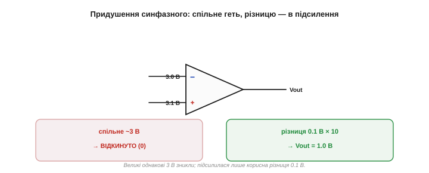
*Рис. 2.8.6.5. Придушення синфазного. На входах 3.0 і 3.1 В: спільні ~3 В схема відкидає, а різницю 0.1 В підсилює в 10 разів до 1 В. Так корисний сигнал витягують з-під однакової на обох входах завади.*

Де це рятує на практиці? У вимірюванні струму двигуна (крихітне падіння на шунті, що «висить» на силовій шині), у зчитуванні сигналу ЕКГ (мікровольти корисного на тлі наведених від мережі вольтів на тілі), у мостових давачах тиску й ваги. Скрізь, де корисна різниця тоне у великій спільній напрузі чи заваді, різницевий підсилювач незамінний — він єдиний уміє «не бачити» спільне.

Наскільки критична узгодженість резисторів? Грубо: розбіжність пар на 1% псує придушення синфазного приблизно до 1:100 — соту частку спільного сигналу схема пропустить на вихід. Для точних вимірів це багато, тому й беруть пари з допуском 0.1% або готові мікросхеми, де пари підігнані лазером до тисячних часток відсотка. Точність вимірювання різниці — це насамперед точність **рівності** резисторів.

> 🔧 **Навіщо це.** Уся сила різницевого підсилювача тримається на **узгодженості резисторів**. Якщо пари не точно однакові, частина синфазного сигналу «протече» на вихід — і завада повернеться. Тому тут беруть прецизійні резистори (0.1% і краще) або готові мікросхеми, де пари підігнано лазером. Міру того, наскільки добре схема давить спільне, звуть **коефіцієнтом придушення синфазного** *(CMRR)* — що він вищий, то чистіший вимір.

Віднімання потрібне не лише для боротьби із завадами. Воно — серце будь-якої **системи керування**: щоб щось регулювати, спершу обчислюють **похибку** — різницю між бажаним і фактичним (згадаймо термостат із [§2.8.2](ch13-opamp-comparator.md)). Різницевий підсилювач дає цю похибку напряму, а далі її «відпрацьовують». Тож суматор і відніматель — це не лише «калькулятор», а й цеглинки автоматики: додай бажане, відніми фактичне, підсили похибку — і маєш регулятор.

Часто віднімають навіть не два сигнали, а сигнал і **сталу опорну напругу**: відняв 2.5 В — і змістив сигнал так, щоб він гойдався навколо нуля (це знадобиться, скажімо, щоб «відцентрувати» сигнал перед АЦП). Те саме віднімання, лише один із входів — сталий. Гнучкість тут безмежна: на входи різницевого можна подати будь-що.

### Золотий стандарт: вимірювальний підсилювач

У простого різницевого підсилювача є вада: його вхідний опір **помірний** (сигнал заходить крізь резистори), тож слабкий давач він підвантажує. Розв'язок напрошується з [§2.8.5](ch13-opamp-comparator.md): спершу **буфери** на кожен вхід (велетенський опір, не вантажать давач), а вже за ними — різницевий підсилювач. Така зв'язка з трьох ОП зветься **вимірювальним підсилювачем** *(instrumentation amplifier)* — золотий стандарт точного вимірювання слабких диференційних сигналів. Її не треба запам'ятовувати схемою: важливо бачити, що вона **складена** з уже знайомих блоків — буфера й різницевого підсилювача.


*Рис. 2.8.6.6. Вимірювальний підсилювач. Два повторювачі (велетенський вхід, не вантажать давач) плюс різницевий підсилювач — золотий стандарт для слабких диференційних сигналів. Складено з блоків, які ми вже знаємо.*

Зручність такого підсилювача ще й у тому, що все його підсилення задають **одним** резистором (між вхідними каскадами), не чіпаючи решти точно узгоджених пар. Тому готові мікросхеми-вимірювальні підсилювачі мають вивід саме для цього одного резистора: поставив його — і вибрав підсилення, а високий CMRR виробник забезпечив, підігнавши пари лазером усередині. Знову той самий урок: складна функція — з простих, добре розв'язаних блоків.

Озирнімося на пройдене. З одного трикутника-ОП і жменьки резисторів ми вже вміємо чимало: **підсилити** сигнал (інвертуючий і неінвертуючий, [§2.8.4](ch13-opamp-comparator.md)), **розв'язати** опори (буфер, [§2.8.5](ch13-opamp-comparator.md)), **скласти** напруги (суматор) і **відняти** їх (різницевий), а з парою конденсаторів — ще й інтегрувати та диференціювати. Це фактично повний набір для аналогової обробки сигналу. Будь-який реальний тракт — давач, підсилення, віднімання фону, фільтр, буфер перед АЦП — складають саме з цих небагатьох цеглинок, з'єднуючи їх у ланцюг. Опанувавши їх, ви по суті опанували аналогову схемотехніку на операційних підсилювачах. Скажімо, цифрові ваги всередині — це міст-давач, вимірювальний підсилювач, фільтр і АЦП; кардіограф — вимірювальний підсилювач із могутнім придушенням мережевої завади, фільтр і підсилення; і те, і те зібрано з тих самих кількох блоків, що ми щойно пройшли.

### І ще дві операції — натяк

А якщо замість резистора Rf поставити **конденсатор**? Тоді сумарний струм у віртуальній землі заряджатиме його, і вихід відбиватиме вже не миттєву суму, а **накопичену з часом** величину — ОП почне **інтегрувати** сигнал. А конденсатор на **вході** дасть протилежне — **диференціювання**. Це решта операцій аналогового обчислювача ([📜 історія](ch13-history-opamp.md)), і виходять вони з тих самих двох правил, варто лише згадати, що струм конденсатора залежить від **швидкості зміни** напруги ([Розділ 2.1](../ch07-capacitor/ch07-capacitor.md)). Ми не заглиблюватимемося в них, та приємно знати: додавання, віднімання, інтегрування й диференціювання — це все той самий ОП, лише з різною обв'язкою. Аналоговий «калькулятор» зібрано.

### Що далі

Отже, ОП повернувся до математики: суматор **складає** напруги (струми зливаються у віртуальній землі), різницевий **віднімає** їх і викидає синфазну заваду, а з буферів і різницевого складається точний вимірювальний підсилювач. Разом із підсиленням ([§2.8.4](ch13-opamp-comparator.md)) це вже повний «аналоговий калькулятор». Та досі ми тримали ОП під від'ємним зворотним зв'язком — слухняним і лінійним. А якщо зв'язок **прибрати**? Тоді ОП знову стане шаленим, але по-корисному: він уміє блискавично **порівнювати** дві напруги. На цьому й тримається компаратор — прилад, що каже «котра напруга більша», і з нього починається інша, нелінійна половина світу ОП. Це наступна тема.

> ▶️ Далі: [§2.8.7 Компаратор: порівняти дві напруги](ch13-opamp-comparator.md)

## 2.8.7 Компаратор: порівняти дві напруги

Усі попередні теми ми тримали ОП під **від'ємним зворотним зв'язком** — слухняним і лінійним. Тепер зробімо протилежне: **приберемо зв'язок зовсім**. Здавалося б, ми вже бачили в [§2.8.1](ch13-opamp-comparator.md), що так ОП стає некерованим і будь-що кидає його вихід на рейку. Так, але саме це «некероване» поводження виявляється напрочуд корисним: воно перетворює ОП на **компаратор** — прилад, що **порівнює** дві напруги й каже, котра більша.

### Що робить компаратор

Компаратор бере дві напруги на входах і дивиться, котра з них вища:

```
V₊ > V₋   →   вихід ВИСОКИЙ  (на верхній рейці)
V₊ < V₋   →   вихід НИЗЬКИЙ  (на нижній рейці)
```

Тобто вихід не «трохи більший» чи «трохи менший», а **повністю** на одній із рейок — залежно лише від того, **котрий вхід переважив**. Компаратор відповідає на питання «так чи ні»: чи перша напруга більша за другу? Його вихід, по суті, **двійковий** — високий або низький, — хоч на входах напруги цілком аналогові.

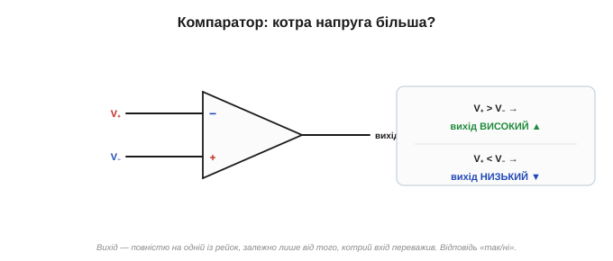
*Рис. 2.8.7.1. Компаратор. Дивиться, котрий вхід більший, і кидає вихід на відповідну рейку: «+» переважив — вихід високий; «−» переважив — низький. Відповідь «так/ні» на питання «котра напруга більша».*

### Чому ОП без зв'язку — це компаратор

Звідки таке поводження? Із велетенського підсилення ([§2.8.1](ch13-opamp-comparator.md)). Без зворотного зв'язку ОП множить різницю входів на свої сотні тисяч: Vout = A·(V₊ − V₋). Тож навіть **мікроскопічна** перевага одного входу дає на виході величезне число — а оскільки вихід обмежений рейками, він просто **впирається** в ту, у бік якої штовхнула різниця. Лінійної зони посередині майже немає (вона мікровольти завширшки), тож вихід практично завжди — на одній із двох рейок. Те, що робило ОП кепським **підсилювачем**, робить його чудовим **компаратором**.

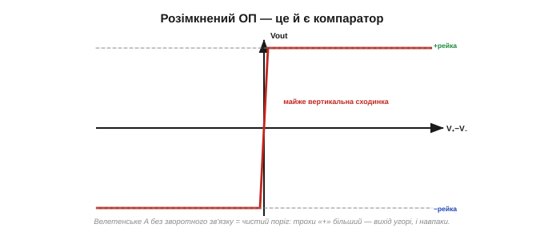
*Рис. 2.8.7.2. Розімкнений ОП. Через велетенське A передатна крива — майже вертикальна сходинка: трохи «+» переважив — вихід угорі, трохи «−» — унизу. Це і є компаратор; ніякого зворотного зв'язку, лише чисте порівняння.*

Наскільки гостро? Якщо A = 100 000, то щоб вихід пройшов увесь розмах від рейки до рейки (скажімо, 30 В у двополярному живленні ±15), різниці входів досить змінитися лише на 30/100000 = 0.3 мВ. Тобто вся «нерішучість» компаратора вкладається в частку мілівольта — а за межами цієї крихітної зони він твердо сидить на одній із рейок. На практиці поріг виходить миттєвий і чіткий, мов клацання вимикача.

### Поріг: порівняння з опорною напругою

Найчастіше один вхід роблять **сталим** — це **поріг** *(reference)*, — а на другий подають сигнал. Тоді компаратор каже, **по який бік порога** зараз сигнал. Скажімо, поставмо на «−» опорні 2.5 В, а на «+» — сигнал:

- сигнал вищий за 2.5 В → вихід високий;
- сигнал нижчий за 2.5 В → вихід низький.

Поріг настільки гострий, що різниця в соту частку вольта вже перекидає вихід: 2.49 В — вихід унизу, 2.51 В — угорі. Компаратор — це немовби надчутливий «вимикач за рівнем»: перетнув сигнал поріг — вихід перекинувся.

Один момент про сам **поріг**: компаратор такий точний, як точна його опорна напруга. Якщо поріг «пливе» — від температури, від просідання живлення, — «пливе» й момент спрацювання. Тому для відповідальних задач поріг беруть не з простого дільника, а зі **стабільного опорного джерела** (його, до речі, найчастіше будують на біполярних транзисторах через їхню передбачувану фізику, [§2.7.8](../ch12-mosfet/ch12-mosfet.md)).

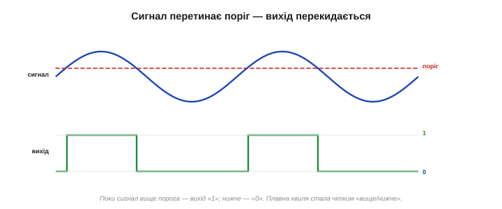
*Рис. 2.8.7.3. Порівняння з порогом. На «−» — опорні 2.5 В; коли сигнал на «+» перетинає цей рівень, вихід стрибком перекидається з рейки на рейку. Аналоговий сигнал перетворився на чітке «вище/нижче порога».*

Дрібниця, що міняє все, — на **який** вхід подати сигнал. Якщо сигнал на «+», а поріг на «−» (як вище), вихід **високий, коли сигнал вищий** за поріг. Поміняйте їх місцями (сигнал на «−», поріг на «+») — і логіка перевернеться: вихід **високий, коли сигнал нижчий** за поріг. Перший варіант звуть неінвертуючим компаратором, другий — інвертуючим. Так одним переставленням входів обирають, у який бік спрацьовує поріг — «увімкнути, коли ясно» чи «увімкнути, коли темно».

### Міст між аналоговим і цифровим

Ось у чому глибша роль компаратора: він **перетворює аналогову величину на двійкове рішення**. На вхід — плавна напруга, на виході — «високо» або «низько», тобто «1» або «0». Це **найпростіший крок від аналогового світу до цифрового**: компаратор — то місточок, яким неперервна напруга стає чітким «так/ні», зрозумілим логіці й мікроконтролеру.

Власне, із багатьох компараторів складають **аналого-цифрові перетворювачі**: щоб виміряти напругу числом, її порівнюють із низкою порогів, і набір відповідей «вище/нижче» і є цифровим кодом. Кожне «так/ні» — це один компаратор.

У цьому сенсі компаратор — перша «крихта розуму» в схемі: він не просто передає чи підсилює сигнал, а **ухвалює рішення** — так чи ні, спрацювати чи ні. Уся порогова автоматика, від нічника до промислового контролера, кінець кінцем зводиться до низки таких рішень: «коли стало більше (чи менше) за межу — зроби щось».

> 🔧 **Навіщо це.** Запам'ятайте суть: **компаратор = ОП без зворотного зв'язку**, чий вихід каже, котра з двох напруг більша, перекидаючись на рейку. Це **аналого-цифровий міст**: плавний сигнал на вході — двійкове рішення на виході. Щойно у схемі ОП **без** петлі зворотного зв'язку (або з петлею на «+», [§2.8.8](ch13-opamp-comparator.md)) — перед вами не підсилювач, а компаратор, і поводиться він зовсім інакше, ніж лінійні схеми попередніх тем.

Корисна деталь про **рівні** виходу. У двополярному живленні вихід гойдається між −Vs і +Vs, а в однополярному (0…5 В, [§2.8.1](ch13-opamp-comparator.md)) — між нулем і живленням. Останнє особливо зручне: вихід виходить **прямо логічним** — 0 В це «0», 5 В це «1», — і його можна заводити просто на вивід мікроконтролера. Компаратор сам перетворює аналоговий поріг на готовий цифровий сигнал, без жодних додаткових перетворювачів.

### Де його застосовують

Порівнювати рівні треба всюди, тож компаратор — усюдисущий:

- **Детектор світла/темряви:** фоторезистор у дільнику проти порога → ввімкнути ліхтар, коли стемніло.
- **Поріг температури:** термістор → увімкнути вентилятор, коли стало гаряче.
- **Розряд батареї:** дільник від батареї проти опорного → засвітити «батарея сідає».
- **Детектор переходу через нуль:** порівняти сигнал із 0 → відмітити, коли синусоїда міняє знак.
- **Сигналізації й порогова автоматика:** спрацювати, коли щось перевищило межу.

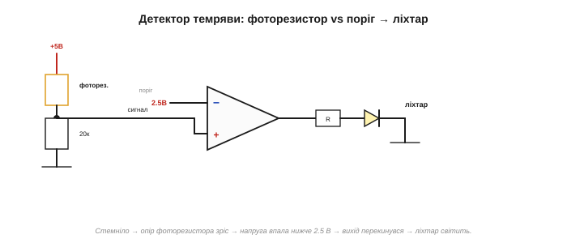
*Рис. 2.8.7.4. Детектор темряви. Фоторезистор у дільнику: стемніло — його опір зріс — напруга в дільнику впала нижче порога — компаратор перекинув вихід — ліхтар засвітився. Класична схема «увімкнути за рівнем».*

Порахуймо його. Хай фоторезистор удень має 2 кОм, а вночі — 200 кОм, і стоїть у дільнику з резистором 20 кОм до землі (фоторезистор — до +5 В). Удень напруга в дільнику ≈ 5·20/(20+2) ≈ **4.5 В**; уночі ≈ 5·20/(20+200) ≈ **0.45 В**. Поставимо поріг 2.5 В — і вихід чітко перекинеться десь у сутінках, коли опір фоторезистора зросте настільки, що напруга впаде нижче 2.5 В. Підбираючи поріг, налаштовують, **наскільки темно** має стати, щоб засвітилося.


*Рис. 2.8.7.5. Компаратор усюди, де треба порівняти рівні: світло/темрява, температурний поріг, розряд батареї, перехід через нуль, вхід АЦП. Скрізь — те саме «вище/нижче».*

Окремо спинімося на **детекторі переходу через нуль**: подавши на компаратор синусоїду проти нуля, на виході дістанемо **прямокутник** — високо, поки синус додатний, низько, поки від'ємний. Так плавну хвилю перетворюють на чіткі імпульси: виміряти частоту, синхронізуватися з мережею, зробити з аналогового сигналу тактовий. А двома компараторами роблять **віконний** *(window)*: один стежить за нижньою межею, другий — за верхньою, і разом вони кажуть, чи сигнал **усередині** заданого «вікна» напруг (не надто мало й не надто багато). З простого «вище/нижче» складаються й хитріші рішення.

### ОП проти спеціальної мікросхеми-компаратора

Тонкий, але важливий момент. Операційний підсилювач **можна** використати як компаратор — і для повільних, невибагливих задач це нормально. Та він для цього не **створений**: вийшовши на рейку (в насичення), ОП **повільно** з неї виходить, тож на швидких сигналах гальмує, а ще його вихід не завжди чисто дотягується до рейок.

Для серйозної роботи беруть **спеціальну мікросхему-компаратор** (як-от LM393, LM339): вона швидка — з насичення вискакує вмить — і часто має **вихід із відкритим колектором** — зручний для прямого з'єднання з цифровою логікою чи мікроконтролером. Правило: для точного чи швидкого порівняння — окремий компаратор; ОП у ролі компаратора — для випадків «коли й так зійде».

> 🔧 **Навіщо це.** Не плутайте дві мікросхеми, схожі на вигляд (обидві — трикутник із двома входами). **Операційний підсилювач** призначений працювати **з** від'ємним зворотним зв'язком (лінійні схеми §2.8.2–2.8.6). **Компаратор** призначений працювати **без** зворотного зв'язку, на рейках. Поставите ОП туди, де треба компаратор, — працюватиме, але мляво; поставите компаратор у лінійну схему зі зворотним зв'язком — він може й не запрацювати як слід. Інструмент під задачу.

Що то за «відкритий колектор», яким хваляться компаратори? Це коли вихідний транзистор лише **притягує вихід до землі** (коли треба «0»), а «1» задає зовнішній **підтяжний резистор** до потрібної напруги ([§2.7.6](../ch12-mosfet/ch12-mosfet.md)). Зручність подвійна: по-перше, ту «1» можна зробити будь-якою — 3.3 В для одного чипа, 5 В для іншого — просто обравши, куди тягне підтяжка; по-друге, кілька таких виходів можна з'єднати на один провід (спрацює, якщо хоч один тягне до нуля). Тому компаратори так легко дружать із будь-якою логікою.

Чому ж ОП повільний у цій ролі? Бо в насиченні (на рейці) його внутрішні транзистори заходять глибоко, і щоб «висмикнути» їх назад, потрібен час — звідси затримка, помітна на швидких сигналах. Спеціальний компаратор спроєктований **не** заходити так глибоко, тож вискакує з одного стану в інший за наносекунди. Для повільних порогів (світло, температура) ця різниця байдужа; для швидких (зчитування даних, синхронізація) — вирішальна.

### Проблема, що чигає: дребезг

Та в простого компаратора є прикра вада, яку треба знати наперед. Коли сигнал **завис** рівно біля порога, найменший **шум** (а він є завжди) то піднімає його трохи над порогом, то опускає трохи під — і вихід починає скажено **тремтіти**, перекидаючись туди-сюди десятки разів. Цей «брязкіт» виходу звуть **дребезгом** *(chatter)*, і він украй небажаний: уявіть лампу, що мерехтить на межі сутінків, чи реле, що тріщить контактами. Дребезг — не косметична дрібниця: реле, що тріщить, швидко зношує контакти; а в цифровій схемі один «брудний» перехід замість чистого зчитається як **багато** спрацювань — лічильник нарахує зайве, логіка зіб'ється. Тому компаратор «голим» у реальних схемах майже не лишають.

Корінь біди — у тому, що поріг **один** і нескінченно гострий: сигнал гуляє довкола нього, і вихід гуляє слідом. А лікують це красиво — додаючи компараторові **два** пороги замість одного, через **додатний** зворотний зв'язок. Так народжується тригер Шмітта — і це наступна тема.

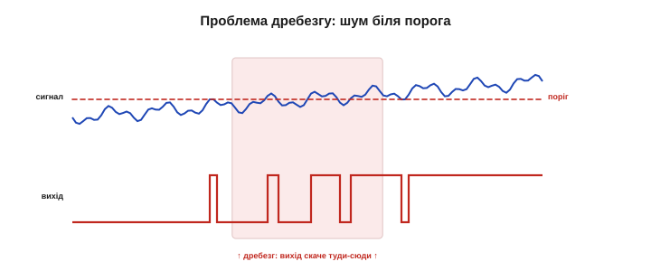
*Рис. 2.8.7.6. Проблема дребезгу. Сигнал завис біля єдиного порога; шум совгає його туди-сюди — і вихід скажено перекидається. Лампа мерехтить, реле тріщить. Лікує це гістерезис — два пороги замість одного (§2.8.8).*

### Що далі

Отже, компаратор — це ОП (чи спеціальна мікросхема) без від'ємного зв'язку: він порівнює дві напруги й перекидає вихід на рейку, перетворюючи плавний сигнал на двійкове «вище/нижче». Це міст від аналогового до цифрового, основа порогової автоматики. Та один гострий поріг лихий на дребезг біля межі. Розв'язок — **гістерезис**, два пороги й «пам'ять» стану, який дає **додатний** зворотний зв'язок. Це тригер Шмітта — той самий додатний зв'язок, що в [§2.8.2](ch13-opamp-comparator.md) ми вважали ворогом, тут стає в пригоді. До нього ми зараз і перейдемо.

> ▶️ Далі: [§2.8.8 Гістерезис і тригер Шмітта](ch13-opamp-comparator.md)

## 2.8.8 Гістерезис і тригер Шмітта

[§2.8.7](ch13-opamp-comparator.md) лишив нас із прикрою проблемою: простий компаратор потерпає від **дребезгу**, коли сигнал зависає біля свого єдиного гострого порога — найменший шум совгає вихід туди-сюди. Тепер полагодимо це красивим прийомом — **гістерезисом**. А реалізує його той самий **додатний** зворотний зв'язок, що в [§2.8.2](ch13-opamp-comparator.md) ми вважали ворогом. Тут він стає рятівником.

### Ідея: два пороги замість одного

Корінь дребезгу — у тому, що поріг **один**. Сигнал гуляє довкола нього — і вихід гуляє слідом. А що, як зробити **два** пороги?

- щоб **увімкнути** (перекинути вихід угору), сигнал має піднятися до **верхнього** порога VH;
- щоб **вимкнути** назад, він має опуститися аж до **нижнього** порога VL;
- а **між** ними вихід **тримає** свій стан, не звертаючи уваги на дрібні коливання.

Ось ця «нечутлива» смуга між двома порогами — і є **гістерезис** *(hysteresis)*. У ній вихід немовби **пам'ятає**, куди він уже перекинувся, і не передумує, поки сигнал не зайде рішуче з іншого боку. Дребезг зникає: щоб вихід перекинувся назад, сигналові тепер замало крихітного шуму — треба пройти **всю** відстань між порогами.

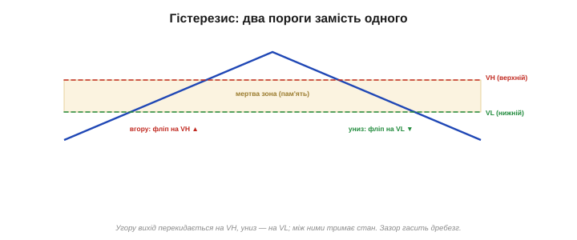
*Рис. 2.8.8.1. Два пороги замість одного. Угору вихід перекидається на верхньому порозі, униз — на нижньому; між ними тримає стан. Ця «нечутлива смуга» — гістерезис; вона й гасить дребезг.*

### Як це робить додатний зворотний зв'язок

Звідки беруться два пороги? Із **додатного** зворотного зв'язку — коли частину виходу повертають не на «−» (як у лінійних схемах), а на **неінвертуючий «+»**. І ось що тоді стається.

Поріг компаратора — це напруга на «+». Якщо туди підмішати частину **виходу**, то поріг почне **залежати від стану виходу**:

- вихід **угорі** → він підмішує **плюс** до «+» → поріг **піднявся** (став VH);
- вихід **унизу** → підмішує **мінус** → поріг **опустився** (став VL).

Тобто щойно вихід перекинувся, поріг **відсувається геть** від сигналу — у бік, куди пішов вихід. Сигналові, щоб повернути вихід назад, доводиться долати вже **дальший** поріг. Це і є додатний зв'язок у дії: він **підштовхує** зміну, через що перемикання стає різким («клац»), а стан — **липким**.

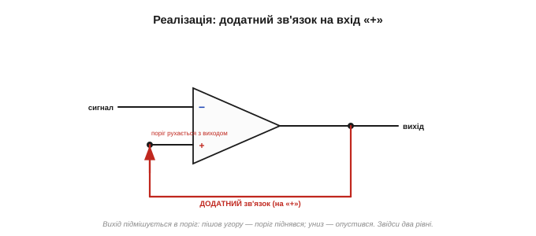
*Рис. 2.8.8.2. Реалізація. Частину виходу повертають на «+». Вихід угорі — поріг піднявся; вихід унизу — опустився. Поріг тікає від сигналу в бік виходу — звідси й два рівні спрацювання.*

Ширину гістерезису задає, яку **частку** виходу повертають на «+»: більша частка — дальші один від одного пороги, ширший зазор. А ще додатний зв'язок дає схемі **лавинність**: щойно вихід рушив, він підмішує собі ще, що штовхає його далі, що підмішує ще більше — і вихід **зривається** до рейки за мить, без жодного зависання посередині. Тому перехід виходить блискавично різким — справжній «клац», а не повільне сповзання.

### Петля на передатній кривій

Якщо намалювати «вихід від входу», гістерезис проступає як **петля**. Ведемо сигнал угору — вихід тримається низько аж до VH, там стрибає вгору. Ведемо назад униз — вихід тримається високо аж до VL, там падає. Шлях «туди» й «назад» **не збігається** — між ними зяє та сама нечутлива смуга. Саме ця незбіжність (петля) і означає, що прилад **пам'ятає** свою історію: його стан залежить не лише від того, де сигнал **зараз**, а й від того, **звідки** він прийшов.

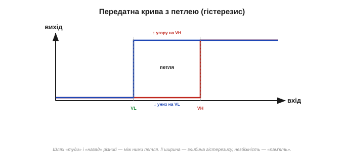
*Рис. 2.8.8.3. Гістерезисна петля. Угору перемикання на VH, униз — на VL; шляхи не збігаються. Ширина петлі — глибина гістерезису. Незбіжність означає «пам'ять»: стан залежить і від того, звідки прийшов сигнал.*

Простежмо на числах. Хай нижній поріг VL = 2.0 В, верхній VH = 3.0 В. Сигнал повзе знизу вгору: вихід тримається низько — 1 В, 2 В, 2.9 В усе ще низько — і лише на 3.0 В перекидається вгору. Тепер сигнал повзе назад: вихід тримається високо — 2.5 В, 2.1 В усе ще високо — і падає аж на 2.0 В. Зазор 1 В між порогами — і є гістерезис: у цій смузі вихід «глухий» до сигналу, хоч би як той колихався.

Скільки ж брати? Правило просте: зазор роблять помітно **більшим за розмах шуму**. Тремтить сигнал на ±20 мВ — постав зазор хоча б 100–200 мВ, і шум зникне безслідно. Завеликий зазор теж недобрий: поріг розмивається, а реакція стає млявою (треба чекати, поки сигнал пройде всю широку смугу). Тож обирають найвужчий зазор, який ще певно перекриває шум.

### Чому дребезг зникає

Тепер видно, чому шум більше не страшний. Хай вихід щойно перекинувся вгору на VH. Щоб перекинути його назад, сигнал має впасти аж до VL — на всю ширину гістерезису. Якщо шум **менший** за цю ширину (а її задають навмисне більшою за очікуваний шум), він просто **не дотягне** до нижнього порога — і вихід стоятиме твердо. Один чистий перехід замість сотні брудних.

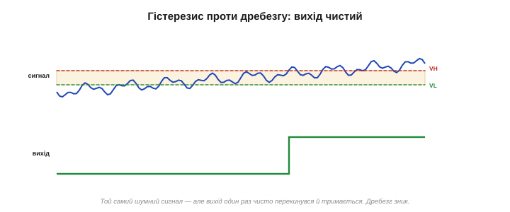
*Рис. 2.8.8.4. Гістерезис проти дребезгу. Той самий зашумлений сигнал, що тремтів у [§2.8.7](ch13-opamp-comparator.md): тепер, перекинувшись, вихід тримається, бо шум менший за зазор між порогами. Один чистий перехід замість тремтіння.*

> 🔧 **Навіщо це.** Запам'ятайте суть гістерезису: **два пороги й пам'ять стану**, реалізовані **додатним** зворотним зв'язком (на «+»). Ширину зазору ставлять трохи **більшою за очікуваний шум** — тоді дрібні коливання вихід ігнорує, а на справжню зміну реагує чітко. Плата за це — поріг уже не одне точне число, а смуга; тож для дуже точного порога гістерезис роблять вузьким, для брудного сигналу — широким. Баланс між завадостійкістю й точністю.

### Знайома річ: термостат

Ви користуєтеся гістерезисом щодня, навіть не думаючи. **Термостат** опалення вмикає котел, скажімо, на 19 °C, а вимикає аж на 21 °C — і навмисне **не** перемикається рівно на 20°. Якби поріг був один (20°), котел брязкав би ввімк-вимк щохвилини, ледь температура колихнеться. Два пороги (19° і 21°) дають спокійні, рідкі цикли. Ця «мертва зона» *(deadband)* між увімкненням і вимкненням — і є гістерезис у чистому вигляді, тільки для температури.

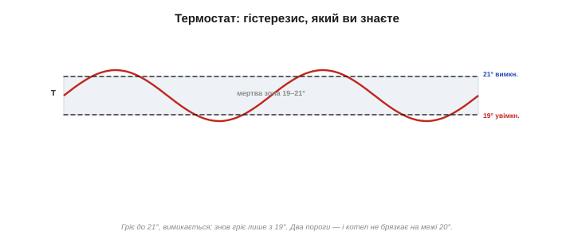
*Рис. 2.8.8.5. Гістерезис, який ви знаєте. Термостат гріє до 21 °C, тоді вимикається; знову вмикається лише як охолоне до 19 °C. «Мертва зона» 19–21° не дає котлу брязкати на межі. Те саме, що в електронному тригері.*

### Тригер Шмітта — і трохи біології

Компаратор із гістерезисом має власну назву — **тригер Шмітта** *(Schmitt trigger)*. За нею стоїть гарна історія. 1934 року американський біофізик **Отто Шмітт** *(Otto H. Schmitt)*, тоді ще аспірант, вивчав, як нервовий імпульс біжить уздовж нервів — зокрема велетенських нервів кальмара. Він захотів **відтворити електронікою** ту саму «все-або-нічого» поведінку нейрона: нерв або «спрацьовує» цілком, або мовчить, і не тремтить на півдорозі. Так народився тригер Шмітта — схема, що бере приклад із живої клітини. Шмітт же згодом і ввів слово **«біоміметика»** *(biomimetics)* — запозичення інженерних ідей у природи.


*Рис. 2.8.8.6. Тригер Шмітта — компаратор із гістерезисом. Його позначають трикутником зі значком петлі всередині. Народився 1934-го з вивчення «все-або-нічого» нервового імпульсу кальмара; Отто Шмітт відтворив поведінку нейрона електронікою й заклав біоміметику.*

Аналогія з нервом глибша, ніж здається. Нейрон теж має **поріг** збудження й «все-або-нічого» відповідь, а після спрацювання — короткий період нечутливості, коли його годі змусити спрацювати знову. Це жива гістерезис-петля: рішуча реакція плюс «пам'ять», що не дає тремтіти. Шмітт побачив у цьому інженерний прийом. До речі, йому належать — одноосібно чи в співавторстві — і **диференційний підсилювач** — основа входу кожного ОП ([§2.8.1](ch13-opamp-comparator.md)), — і чопер-стабілізований підсилювач: один біофізик, що порався з нервами кальмара, подарував електроніці кілька наріжних схем заразом.

### Де він стає в пригоді

Тригер Шмітта — усюди, де треба зробити з брудного або повільного сигналу **чисте** перемикання:

- **очистити** зашумлений сигнал давача чи кнопки (усунути дребезг);
- зробити **різкі цифрові фронти** з повільно наростаючої напруги (входи логічних мікросхем часто мають вбудований тригер Шмітта саме для цього);
- **усунути брязкіт кнопки** *(debounce)*: механічний контакт, замикаючись, кілька мілісекунд **відскакує** й дає не один чистий перехід, а пачку — без гістерезису мікроконтролер нарахував би десяток натискань замість одного;
- збудувати **генератор**: тригер Шмітта плюс RC-ланка ([§2.1.4](../ch07-capacitor/ch07-capacitor.md)) самозбуджуються й видають прямокутні імпульси — простий релаксаційний генератор, де гістерезис і RC задають частоту.

Як саме тригер Шмітта генерує? Вихід заряджає конденсатор крізь резистор; коли напруга на ньому доходить до верхнього порога — вихід перекидається й починає конденсатор **розряджати**; той падає до нижнього порога — вихід знову перекидається, і так без кінця. Конденсатор гойдається між двома порогами, а вихід видає прямокутні імпульси. Жодного зовнішнього сигналу не треба — схема «дзвонить» сама. Так роблять найпростіші генератори тактів, блимавки й пищалки. Частоту такого генератора задають стала часу RC ([§2.1.4](../ch07-capacitor/ch07-capacitor.md)) і ширина гістерезису: більший R чи C — повільніше блимання. Жодного кварцу чи зовнішнього такту — кілька копійчаних деталей, і маєш джерело імпульсів.

Готові тригери Шмітта продають і окремими мікросхемами (класична 74HC14 — шість штук в одному корпусі): ними зручно «причесати» будь-який брудний чи повільний цифровий сигнал, перш ніж віддати його логіці, без жодної зовнішньої обв'язки. Тож тригер Шмітта — не лише схема на ОП, а й щоденна готова цеглинка, що тихо стоїть на входах безлічі чипів і береже їх від брудних фронтів.

> 🔧 **Навіщо це.** Практичне правило: **бачиш дребезг — додай гістерезис**. Майже щоразу, коли компаратор чи поріг «брязкає», лікують це двома порогами (тригером Шмітта) — у залізі парою резисторів додатного зв'язку, а в коді мікроконтролера — програмним гістерезисом (вмикай на одному значенні, вимикай на іншому). Це той самий принцип, що й у термостата, і він уберігає від мерехтіння, тріску реле та хибних спрацювань.

У коді мікроконтролера це виглядає буквально як дві умови: «якщо T > 21 — вимкни», «якщо T < 19 — увімкни», а між 19 і 21 — нічого не міняй. Жодного заліза, та сама ідея. Тому, читаючи давач у проєкті, варто одразу закладати гістерезис у логіку — інакше «розумний» вимикач мерехтітиме на межі так само, як голий компаратор.

### Найпростіша пам'ять — і два обличчя зв'язку

Цікаво й те, що тригер Шмітта — по суті **найпростіша пам'ять** в електроніці: він тримає свій стан (один біт — «увімкнено» чи «вимкнено»), доки сигнал не зайде рішуче з іншого боку. Звідси один крок до тригерів і клітинок пам'яті цифрової техніки, де «залипання» стану роблять навмисне й надовго.

А ще тепер ми бачимо **обидва обличчя** зворотного зв'язку. **Від'ємний** (на «−») — вгамовує, дає точні лінійні схеми, де ОП тримає входи рівними ([§2.8.2](ch13-opamp-comparator.md)–[§2.8.6](ch13-opamp-comparator.md)). **Додатний** (на «+») — навпаки, розганяє й «защіпає» стан, дає різке перемикання та пам'ять (тригер Шмітта). Та сама петля, протилежний знак — і два цілі світи застосувань ОП. Сплутати їх — болюча помилка ([§2.8.2](ch13-opamp-comparator.md)); розуміти різницю — половина майстерності роботи з операційним підсилювачем.

### Що далі

Отже, гістерезис — це два пороги й пам'ять, що їх дає додатний зворотний зв'язок; компаратор із гістерезисом — тригер Шмітта, родом із нервів кальмара. Він гасить дребезг і робить чисті переходи з брудних сигналів. На цьому ми пройшли всі основні схеми на ОП — і лінійні, і порогові. Лишилося одне: досі ми всюди вважали ОП **ідеальним**. Час чесно глянути, чим **реальний** ОП відрізняється від ідеалу — коли ці відмінності варто враховувати, а коли ними можна сміливо знехтувати. Це остання тема розділу, якою ми й завершимо знайомство з операційним підсилювачем.

> ▶️ Далі: [§2.8.9 Реальний ОП: межі (зсув, смуга, швидкість наростання)](ch13-opamp-comparator.md)

## 2.8.9 Реальний ОП: межі (зсув, смуга, швидкість наростання)

Усі попередні теми ми спиралися на **ідеальний** операційний підсилювач ([§2.8.1](ch13-opamp-comparator.md)): нескінченне підсилення, нескінченний вхідний опір, нульовий вихідний, миттєва реакція, жодного зсуву. Ця модель напрочуд зручна й майже завжди правдива. Та реальний ОП усе ж трохи відступає від ідеалу — і завершити знайомство з ним чесно означає знати, **де** саме й **коли** ці відступи варто враховувати. Гарна новина: здебільшого вони мізерні, і ідеальна модель дає 99% правильної відповіді. Лиха новина: в окремих задачах саме ці «дрібниці» все вирішують.


*Рис. 2.8.9.1. Ідеал проти реальності. Нескінченне підсилення — насправді сотні тисяч; нульовий зсув — насправді мілівольти; миттєва реакція — насправді обмежена. Усе це маленькі поправки до ідеальної моделі, але знати про них варто.*

### Зсув нуля

Перша вада — **напруга зсуву** *(input offset voltage, Vos)*. У реальному ОП входи трішки **несиметричні** від народження: навіть коли на обох входах однакова напруга, всередині лишається крихітна різниця, наче на вхід уже подали кілька мілівольтів. А підсилювач же множить цю «уявну різницю» на своє підсилення — і на виході виходить **постійна похибка**.

Порахуймо. Хай Vos = 2 мВ (типово для µA741), а схема має підсилення 100. Тоді на виході осяде стала похибка 2 мВ × 100 = **0.2 В**, навіть якщо корисного сигналу немає зовсім. Для звуку (змінного сигналу) це байдуже — постійну складову забере розділовий конденсатор ([§2.8.4](ch13-opamp-comparator.md)). А от для **точного вимірювання постійної напруги** 0.2 В похибки можуть усе зіпсувати. Тому для прецизійних задач беруть ОП із малим зсувом (мікровольти замість мілівольтів).

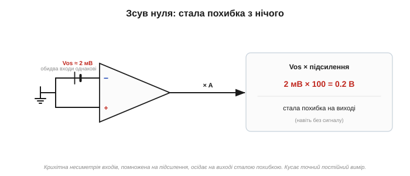
*Рис. 2.8.9.2. Напруга зсуву. Входи трохи несиметричні — наче на вхід завжди подано кілька мілівольтів. Помножені на підсилення, вони дають сталу похибку виходу. Шкодить точному постійному виміру; для звуку — байдуже.*

Зсув ще й **повзе** з температурою — тож для точних схем важлива не лише його величина, а й стабільність (температурний дрейф). Частину похибки можна **скомпенсувати**: симетрично підібрати резистори на обох входах (щоб вхідні струми давали однакові падіння й скоротилися), скористатися виводами підлаштування нуля, або взяти ОП з автоматичним обнуленням. Але найпростіше — одразу обрати прецизійний ОП, у якого зсув мікровольтовий від народження.

### Вхідні струми

Друга вада споріднена з [§2.8.5](ch13-opamp-comparator.md): входи реального ОП беруть **малесенький струм** *(input bias current)* — наноампери у звичайних, пікоампери в ОП із польовими входами. Сам по собі цей струм крихітний, але протікаючи крізь **великі** резистори обв'язки, він створює на них помітне падіння напруги — ще одне джерело похибки.

Порахуймо й це. Хай вхідний струм 80 нА (типово для µA741) тече крізь резистор 1 МОм. Падіння на ньому: 80·10⁻⁹ А × 10⁶ Ом = **0.08 В** хибної напруги просто з повітря — а помножена на підсилення, вона ще й зросте. Тепер та сама схема з ОП на польових входах: там вхідний струм — пікоампери (у мільйон разів менший), і на тому ж резисторі він дасть мікровольти, яких ніхто не помітить. Ось чому в схемах із дуже високоомними резисторами (мегаоми) чи з високоомними давачами беруть ОП саме з польовими входами.

### Скінченне підсилення й смуга

Третя межа — підсилення не **нескінченне** (сотні тисяч, не ∞), тож «віртуальне коротке» V₋ = V₊ тримається не ідеально, а з мікроскопічною похибкою ([§2.8.3](ch13-opamp-comparator.md)). Зазвичай це геть непомітно.

А от **обмежена смуга** частот помітна частіше. Велетенське підсилення ОП має лише на постійному струмі; із ростом частоти воно **спадає**. Причому так, що добуток підсилення на смугу лишається сталим — цю сталу звуть **добутком підсилення на смугу** *(gain-bandwidth product, GBW)*. Звідси проста й важлива формула:

```
максимальна частота ≈ GBW / (потрібне підсилення)
```

Наприклад, GBW = 1 МГц. Хочеш підсилення 10 — воно тримається до 1 МГц/10 = 100 кГц; хочеш 100 — лише до 10 кГц. Більше підсилення — вужча смуга. Це й була причина набирати велике підсилення **кількома** каскадами ([§2.8.4](ch13-opamp-comparator.md)): два по ×30 мають ширшу смугу, ніж один ×900.

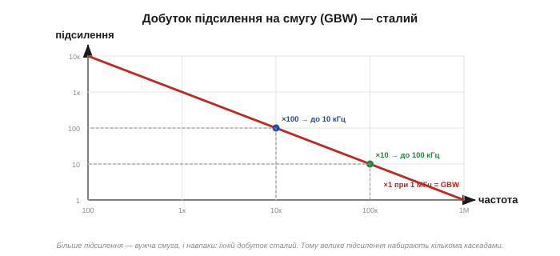
*Рис. 2.8.9.3. Підсилення спадає з частотою так, що добуток «підсилення × смуга» сталий (GBW). Хочеш велике підсилення — дістаєш вузьку смугу, і навпаки. Тому великий коефіцієнт набирають кількома помірними каскадами.*

З обмеженою смугою пов'язана й **стійкість**. На високих частотах зворотний зв'язок ОП починає **запізнюватися**, і за певних умов від'ємний зв'язок здатний «обернутися» на додатний — тоді підсилювач **самозбуджується** (дзвенить на власній частоті), замість чесно підсилювати. Щоб цього не сталося, всередину ОП закладають **корекцію** — той самий конденсатор, що його ввів Фуллагар у µA741 ([📜 історія](ch13-history-opamp.md)), — а в схемі дбають про «запас стійкості». Саме тому повторювач, де зв'язок найжорсткіший, вимагає ОП, «стійкого за одиничного підсилення» ([§2.8.5](ch13-opamp-comparator.md)).

### Швидкість наростання

Окрема, підступна межа — **швидкість наростання** *(slew rate, SR)*: вихід ОП не може змінювати напругу **швидше** за певний максимум, що міряється у вольтах за мікросекунду. Це не те саме, що смуга: смуга стосується **малих** сигналів, а швидкість наростання — **великих**. Якщо сигнал великий і швидкий, вихід просто **не встигає** за ним і повзе з максимальною швидкістю — гарна синусоїда на виході перетворюється на скособочений **трикутник**.

Порахуймо. Хай SR = 0.5 В/мкс (типово для µA741). Щоб видати стрибок на 10 В, виходові треба щонайменше 10/0.5 = 20 мкс. Синусоїда 10 В на 1 кГц вимагає максимум ~0.06 В/мкс — легко; та сама амплітуда на 100 кГц вимагає вже ~6 В/мкс — **більше** за 0.5, тож вихід «попливе» й спотвориться. Для швидких потужних сигналів беруть ОП із високою швидкістю наростання.

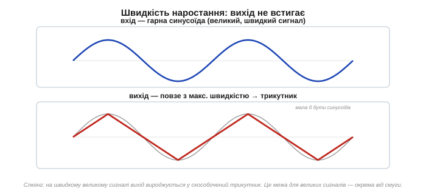
*Рис. 2.8.9.4. Швидкість наростання. Вихід може мінятися лише до певної межі (В/мкс). На швидкому великому сигналі він не встигає — і плавна синусоїда вироджується у скособочений трикутник. Це межа для **великих** сигналів, окрема від смуги.*

Важливо не плутати ці дві межі. **Смуга** обмежує **малі** сигнали (на якій частоті ще тримається підсилення), **швидкість наростання** — **великі** (як швидко вихід може гойднутися на повний розмах). Буває, що кволий сигнал на високій частоті проходить чудово, а той самий сигнал, підсилений до кількох вольтів, на тій самій частоті вже «пливе», упершись у швидкість наростання. Тому в даташиті дивляться **обидва** числа — GBW і SR — залежно від того, який саме у вас сигнал: дрібний чи могутній.

### І ще дрібниці: вихід, шум

Кілька менших обмежень для повноти. Вихід звичайного ОП **не дотягується** до самих рейок живлення — лишається запас у вольт чи два (хіба що це ОП «rail-to-rail», що вміє гойдатися майже до самих полюсів — порятунок для схем від батарейки на 3 В, де важить кожен вольт); а ще він віддає лише обмежений струм ([§2.8.4](ch13-opamp-comparator.md)). І, нарешті, реальний ОП **додає трохи власного шуму** — ледь чутне «шипіння», що народжується в транзисторах усередині. Для гучних сигналів воно тоне без сліду, а от коли підсилюєш мікровольти з давача, власний шум ОП може заглушити сам сигнал — тому для таких задач беруть спеціальні малошумні ОП.

Ще дві «не-нескінченності» з тієї самої родини. Реальний ОП не **ідеально** давить синфазний сигнал — здатність ігнорувати те спільне, що є на обох входах, скінченна (її звуть *CMRR*, ми зустрічали її в [§2.8.6](ch13-opamp-comparator.md)). І він не **повністю** нехтує коливаннями напруги живлення — частинка брижів від блока живлення просочується на вихід (це міряє *PSRR*, придушення завад джерела). Для грубих схем обидва — дрібниці, на які можна не зважати; для прецизійного вимірювання слабкого сигналу на тлі великого синфазного — ще пара рядків даташита, у які варто зазирнути.

### Коли це все враховувати

Головне вміння — знати, **яка межа кусає саме твою задачу**, а на решту не зважати:

- **точний постійний вимір** → дивись на зсув Vos і вхідний струм;
- **високі частоти, малий сигнал** → дивись на смугу (GBW);
- **швидкий великий сигнал** → дивись на швидкість наростання (SR);
- **дуже слабкий сигнал** → дивись на шум;
- **високоомне джерело** → бери польові входи (малий вхідний струм).

А для звичайної неквапливої саморобки з помірним підсиленням — **ідеальної моделі цілком досить**, і про всі ці параметри можна навіть не згадувати.


*Рис. 2.8.9.5. Яка вада коли важить. Кожна межа реального ОП кусає лише певний клас задач. Знаєш свою задачу — знаєш, на який параметр даташита дивитися; решту сміливо ігноруєш.*

### Як обирають операційний підсилювач

Звідси й головна порада: **«найкращого ОП взагалі» не існує** — є ОП, заточені під різне. Один — прецизійний (мікровольтовий зсув), інший — малошумний, третій — швидкий (висока SR і смуга), четвертий — економний (для батарей), п'ятий — rail-to-rail, шостий — із польовими входами. Обираючи прилад, інженер дивиться в даташит саме на **той** параметр, що важливий для його задачі, а на «гучні» цифри в рекламі — ні.


*Рис. 2.8.9.6. Сімейство операційних підсилювачів. Немає одного «найкращого» — є прецизійні, малошумні, швидкі, економні, rail-to-rail, із польовими входами. Обирай за параметром, що важить для **твоєї** задачі.*

Кілька знайомих імен для орієнтиру (запам'ятовувати не треба — просто щоб назви не лякали): **LM358** — копійчаний, працює від однополярного живлення, для невибагливих задач; **TL072** — польові входи, малий вхідний струм, улюбленець звукарів; **OP07** — прецизійний, із мікровольтовим зсувом, для точних вимірів; швидкісні ОП — там, де важить висока SR і смуга. Побачивши задачу, досить знати, який **параметр** у ній головний, — і дібрати прилад за ним.

Зауважте насамкінець гарну деталь: усі «реальні» числа, що ми наводили (зсув ~2 мВ, швидкість ~0.5 В/мкс, смуга ~1 МГц), — це параметри того самого **µA741** з [історії розділу](ch13-history-opamp.md). За нинішніми мірками скромні; та саме вони півстоліття тому зробили аналогове проєктування дешевим і доступним. Сучасні ОП кращі за кожним із цих чисел на порядки — а сама ідея, ідеальна модель і правила розрахунку лишилися ті самі, що ви вже знаєте.

> 🔧 **Навіщо це.** Підсумок усієї теми двома думками. **Перша:** ідеальна модель ([§2.8.1](ch13-opamp-comparator.md)–[§2.8.3](ch13-opamp-comparator.md)) — чудове наближення, і для більшості саморобних схем її досить; реальні межі — це маленькі поправки, а не спростування. **Друга:** коли задача все ж вимоглива (точність, висока частота, слабкий сигнал), не міняй підхід — просто **обери правильний ОП** за тим параметром, що кусає, прочитавши його в даташиті. Уміти впізнати, котра межа важлива, — і є справжня майстерність роботи з операційним підсилювачем.

### Підсумок розділу — і Модуля

На цьому ми завершуємо знайомство з операційним підсилювачем — а з ним і весь **Модуль 2**. Озирнімося. Ми почали з пасивних компонентів (конденсатор, котушка, резонанс), перейшли до напівпровідникових приладів (діод, біполярний і польовий транзистори), а вершиною стала готова «цеглинка» — ОП, усередині якого ті самі транзистори вже зібрані в майже ідеальний підсилювач. Ми навчилися приборкувати його зворотним зв'язком — підсилювати, буферизувати, складати, віднімати, порівнювати — і чесно глянули на його реальні межі.

Тепер у вас є повний **аналоговий інструментарій**: ви розумієте, як підсилити слабкий сигнал давача, як розв'язати кволе джерело від важкого навантаження, як викинути синфазну заваду, як перетворити плавну напругу на чітке цифрове рішення. Це той фундамент, на якому стоїть будь-який реальний пристрій — між аналоговим світом фізики й цифровим світом мікроконтролера. Далі ви зможете будувати з цих цеглинок власні схеми — і розуміти, що відбувається всередині чужих.

> 🏁 **Модуль 2 завершено.** Від пасивних компонентів через транзистори до операційного підсилювача — аналогову основу електроніки пройдено.
