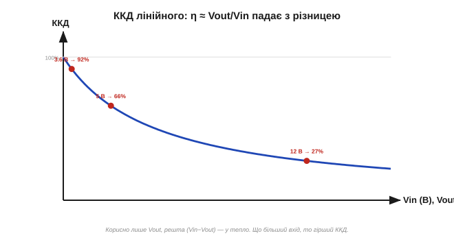
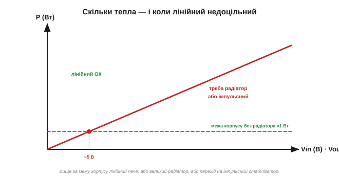

# 🧮 Розсіювання LDO: (Vin−Vout)·I і коли лінійний стабілізатор недоцільний

> Це математична вставка до теми [2.8.11 «LDO зсередини»](ch13-opamp-comparator.md). Тема показала, що прохідний транзистор гасить різницю Vin − Vout у тепло. Тут — як порахувати це тепло й **ККД** у числах, і де проходить межа, за якою лінійний стабілізатор стає поганою ідеєю й час брати інший.

### Куди дівається потужність

Лінійний стабілізатор не «знищує» зайву напругу — він **спалює** її. Прохідний транзистор тримає на собі різницю (Vin − Vout), а крізь нього тече весь струм навантаження I. Добуток і є тепло:

```
P(тепло) = (Vin − Vout)·I  +  Vin·Iq
```

Перший доданок — головний; другий (власне споживання Iq, помножене на вхід) зазвичай малий, але для сонного батарейного пристрою саме він вирішує. Далі дивимось переважно на (Vin − Vout)·I.

### ККД — це просто відношення напруг

Корисна потужність — лише та, що дійшла до навантаження: Pout = Vout·I. На вході взяли Pin = Vin·I (той самий струм). Тож коефіцієнт корисної дії:

```
η = Pout / Pin = (Vout·I) / (Vin·I) = Vout / Vin
```

Струм скоротився — і лишилося чисте **відношення напруг**. Лінійний стабілізатор не може мати ККД, кращий за Vout/Vin, хоч би що ви робили; усе понад те — тепло.


*Рис. 2.8.11m.1. ККД залежить тільки від відношення Vin/Vout. Тримати 3.3 В від 3.6 В — 92 % (різниця мала); від 5 В — 66 %; а від 12 В — лише 27 %, бо більш ніж дві третини потужності йде теплом. Що далі Vin від Vout, то марнотратніше.*

### Числа

Візьмімо вихід 3.3 В і струм 0.5 А й порахуймо три входи:

```
від 3.6 В:  P = (3.6−3.3)·0.5 = 0.15 Вт,  η ≈ 92 %   — ідеально
від 5.0 В:  P = (5.0−3.3)·0.5 = 0.85 Вт,  η ≈ 66 %   — стерпно, з міддю
від 12 В:   P = (12−3.3)·0.5  = 4.35 Вт,  η ≈ 27 %   — біда
```

Той самий вихід, той самий струм — а нагрів різниться у **тридцять** разів, бо все вирішує різниця Vin − Vout.

### Коли лінійний недоцільний — теплова межа

Чому 4.35 Вт — «біда»? Бо корпус здатен скинути лише обмежене тепло, перш ніж кристал перегріється. Цю межу ми вже вміємо рахувати: Tj = Tamb + P·θ ([тепловий розрахунок](../ch12-mosfet/ch12-s6-a-thermal-calc.md)). Дрібний корпус без радіатора тягне десь до 1 Вт; отже, P = (Vin − Vout)·I мусить лишатися під цією межею.


*Рис. 2.8.11m.2. Тепло (Vin−Vout)·I росте прямо з різницею напруг. Поки воно під межею корпусу (тут ≈1 Вт без радіатора) — лінійний у грі; вище — або великий радіатор, або зовсім інший підхід. При 0.5 А ця межа настає вже коло ~5 В входу.*

Звідси проста межа доцільності: **лінійний добрий, коли різниця Vin − Vout мала або струм невеликий**. Хочеш зробити 3.3 В із 3.6-вольтового акумулятора при кількох міліамперах — лінійний LDO ідеальний. Хочеш 3.3 В із 12 В при пів-ампера — це 4.35 Вт у крихітному корпусі, тобто або масивний радіатор, або краще взяти **імпульсний** стабілізатор, чий ККД тримається 85–95 % незалежно від відношення напруг (ціна — складність і завади; це окрема історія).

### Граблі й де в курсі

Три речі легко проґавити. Перша — **власне споживання** Iq: для пристрою, що довго спить, навіть кілька міліампер «на себе» висаджують батарею (саме тому дешевий AMS1117 із його ~5 мА — поганий вибір для автономки). Друга — **кидки**: пусковий струм навантаження на мить піднімає P вище за середнє, і це треба врахувати в запасі. Третя — пам'ятайте, що тепло рахують на **гарячий** прилад і звіряють із тепловим опором корпуса ([§2.7.5](../ch12-mosfet/ch12-mosfet.md), [тепловий розрахунок](../ch12-mosfet/ch12-s6-a-thermal-calc.md)).

> 🔧 **Навіщо це.** Перш ніж ставити лінійний стабілізатор, проженіть два числа: **P = (Vin − Vout)·I** (скільки тепла) і **η ≈ Vout/Vin** (який ККД). Якщо P більше, ніж потягне корпус (≈1 Вт без радіатора), або ККД ганебно низький — лінійний недоцільний: тут або великий радіатор, або імпульсний перетворювач. Золоте правило: лінійний — для **малої** різниці напруг і **помірного** струму; для великих перепадів він просто грубка.
