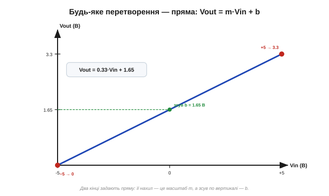
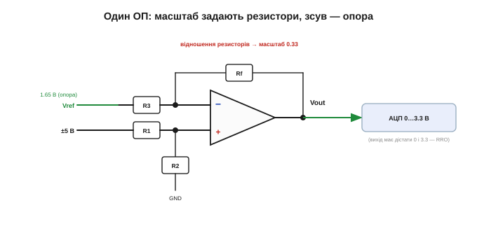

# ⚙️ Зміщення й масштабування: перетворити ±5 В у 0–3.3 В

> Це алгоритмічна вставка до теми [2.8.6 «Суматор і різницевий підсилювач»](ch13-opamp-comparator.md). Тема дала цеглинки — суматор і різницевий підсилювач. Тут — **методика**, як із них синтезувати дуже потрібну схему: втиснути сигнал з одного діапазону в інший на **одному** ОП. Класична задача — подати двополярний сигнал ±5 В на однополярний АЦП, що приймає лише 0…3.3 В.

### Задача

Маємо сигнал, що гуляє в межах −5…+5 В, а мікроконтролерний АЦП приймає тільки 0…3.3 В. Двополярний сигнал у такий вхід напряму не подаси: усе, що нижче нуля, АЦП не побачить, а +5 В перевищать його стелю й можуть спалити вхід. Треба **перерахувати** діапазон: −5 В → 0, +5 В → 3.3 В, а все між ними — пропорційно.

### Ідея: будь-яке таке перетворення — пряма

Перетворення «розтягнути/стиснути й посунути» — це завжди **лінійна** функція, тобто пряма:

```
Vout = m · Vin + b
```

де **m** — масштаб (нахил, наскільки стискаємо), а **b** — зсув (на скільки піднімаємо). Уся задача зводиться до того, щоб знайти ці два числа з двох відомих кінців.


*Рис. 2.8.6a.1. Два кінці («−5 → 0» і «+5 → 3.3») однозначно задають пряму. Її нахил — масштаб m, а перетин із віссю — зсув b. Знайшовши пряму, ми знаємо всю схему.*

### Псевдокод: знайти m і b

Методика — два рядки арифметики:

```
m = (Vout_hi − Vout_lo) / (Vin_hi − Vin_lo)     # масштаб (нахил прямої)
b = Vout_lo − m · Vin_lo                          # зсув (підняти/опустити)
```

Підставмо наші кінці (Vin: −5…+5, Vout: 0…3.3):

```
m = (3.3 − 0) / (5 − (−5)) = 3.3 / 10 = 0.33
b = 0 − 0.33 · (−5)        = +1.65 В
```

Отже, Vout = 0.33·Vin + 1.65. Перевіряємо на кінцях: при Vin = −5 → 0.33·(−5)+1.65 = 0 ✓; при Vin = +5 → 0.33·5+1.65 = 3.3 ✓. Збіглося.

### Реалізація: один ОП

Тепер — як це зробити схемою. **Масштаб** m дають відношення резисторів (як підсилення в [§2.8.4](ch13-opamp-comparator.md)), а **зсув** b — опорна напруга, домішана в той самий вузол (як у суматорі/різницевому з [§2.8.6](ch13-opamp-comparator.md)). Усе вміщається в один різницевий підсилювач:


*Рис. 2.8.6a.2. Сигнал ±5 В і опорна напруга Vref сходяться на одному ОП. Відношення резисторів задає масштаб 0.33 (а заразом дільник тримає напругу на ніжках ОП у безпечних межах, хоч вхід і ±5 В), а опора 1.65 В піднімає вихід на потрібний зсув. На виході — рівно 0…3.3 В для АЦП.*

Кістяк такий: сигнал заходить крізь резистори, що його **ділять** до безпечного рівня й задають масштаб 0.33; опорна напруга (тут 1.65 В) додає зсув 1.65 В; один ОП зводить це докупи. Точні чотири номінали дістають, розв'язавши рівняння різницевого підсилювача під знайдені m і b (або калькулятором із даташита).

### Складність і пастки

**Вихід має дістати краї.** Вихід мусить сягати і 0, і 3.3 В — а звичайний ОП до рейок не дотягує. Потрібен **rail-to-rail** вихід ([вставка про вибір ОП](ch13-s9-c-rail-to-rail.md)), інакше кінці діапазону зріжуться.

**Зсув тримається на опорі.** b прямо залежить від Vref: попливе опорна напруга — попливе й нуль шкали. Тому Vref беруть **стабільний** (опорне джерело, [§2.8.11](ch13-opamp-comparator.md)), а не абияк із дільника живлення.

**Допуски резисторів.** І масштаб, і зсув задають резистори, тож їхня похибка зсуває шкалу. Для точності — резистори 1 % (чи краще) або підстроювання.

**Захист входу.** Сигнал може вискочити за ±5 В (наводка, аварія) — додають послідовний резистор і обмежувальні діоди, щоб не пробити вхід.

**Вхідний діапазон ОП.** Саме вхідний дільник утримує напругу на ніжках ОП у його робочих межах, хоча сам сигнал і двополярний, — без нього ±5 В вийшли б за живлення.

> 🔧 **Навіщо це.** Запам'ятайте методику, а не готову схему: будь-яке «вкласти один діапазон в інший» — це пряма Vout = m·Vin + b. Порахуйте m і b з двох кінців (масштаб і зсув), а тоді реалізуйте їх одним ОП: відношення резисторів дає масштаб, опорна напруга — зсув. І дві перевірки наостанок: вихід має бути rail-to-rail (щоб дістати краї), а опора — стабільна (щоб не плив нуль шкали).
