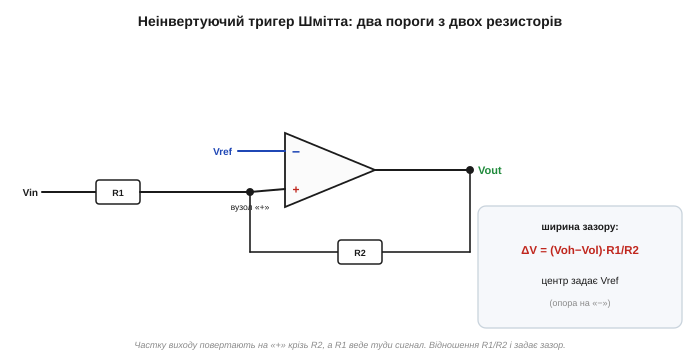
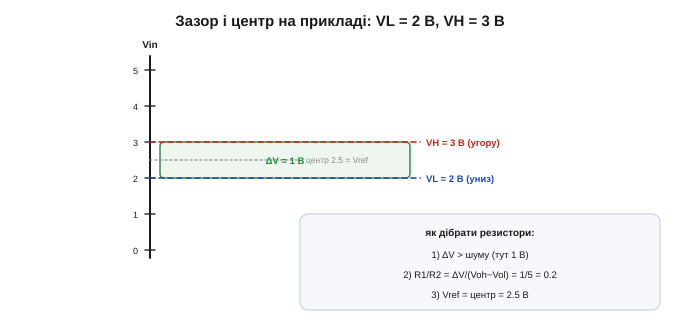

# 🧮 Розрахунок порогів гістерезису: два пороги з двох резисторів

> Це математична вставка до теми [2.8.8 «Гістерезис і тригер Шмітта»](ch13-opamp-comparator.md). Тема пояснила гістерезис словами: два пороги, пам'ять стану, додатний зворотний зв'язок. Тут — **числа**: як два пороги VH і VL та зазор між ними виходять із двох резисторів і розмаху виходу, і як їх дібрати під свій шум.

### Схема й величини

Беремо неінвертуючий тригер Шмітта: сигнал Vin заходить крізь **R1** на неінвертуючий вхід «+», частку виходу повертає туди ж **R2** від виходу, а на «−» сидить опорна напруга **Vref**. Вихід має два рівні — **Voh** (високий) і **Vol** (низький).


*Рис. 2.8.8m.1. R1 веде сигнал на «+», R2 домішує туди ж частку виходу, опора Vref — на «−». Вихід перекидається, коли напруга на «+» переходить Vref. Оскільки у виразі для «+» сидить сам вихід (Voh або Vol), порогів виходить **два**.*

### Звідки пороги: суперпозиція на «+»

Напруга на вузлі «+» — це зважена суміш входу й виходу (двоє резисторів змішують два джерела, [§1.4](../../block-1-circuits-physics/ch04-kirchhoff-circuit-analysis/ch04-kirchhoff-circuit-analysis.md)):

```
V+ = (Vin·R2 + Vout·R1) / (R1 + R2)
```

Вихід перекидається тієї миті, коли «+» зрівнюється з опорою на «−», тобто V+ = Vref. Розв'яжімо це відносно входу:

```
Vin = Vref·(1 + R1/R2) − Vout·(R1/R2)
```

Уся хитрість у тому, що **Vout тут — не стала**: вона дорівнює або Voh, або Vol, залежно від поточного стану. Підставивши обидва значення, дістаємо **два** пороги:

```
VH = Vref·(1 + R1/R2) − Vol·(R1/R2)     (вихід унизу → поріг спрацювання «вгору»)
VL = Vref·(1 + R1/R2) − Voh·(R1/R2)     (вихід угорі → поріг спрацювання «вниз»)
```

А віднявши одне від одного, дістаємо найкорисніше — **ширину** гістерезису:

```
ΔV = VH − VL = (Voh − Vol)·(R1/R2)
```

Зазор — це просто **розмах виходу, помножений на відношення резисторів**. Просто й незабутньо.

### Інтуїція: дві незалежні ручки

Формули кажуть про дві майже незалежні «ручки» налаштування. **Ширину** зазору ΔV крутить відношення R1/R2 (скільки виходу домішуємо назад): більше R1/R2 — ширший зазор. А **центр** смуги совгає опора Vref на «−». Тобто Vref пересуває всю гістерезисну смугу вгору-вниз, а R1/R2 — розсуває чи звужує її. Це й робить проєктування зручним: спершу обираєш центр, потім — ширину.

### Приклад (ті самі числа, що в темі)

Візьмімо пороги з теми — VH = 3 В, VL = 2 В — за однополярного живлення з виходом, що сягає рейок (Voh ≈ 5 В, Vol ≈ 0):

```
ΔV = VH − VL = 1 В = (5 − 0)·(R1/R2)   →   R1/R2 = 0.2
центр = (VH + VL)/2 = 2.5 В = Vref·… →   Vref = 2.5 В
```


*Рис. 2.8.8m.2. Гістерезисна смуга 2…3 В. Ширину 1 В дало відношення R1/R2 = 0.2 (бо вихід гойдається на 5 В), а центр 2.5 В — опора Vref. Беремо, скажімо, R2 = 10 кОм, R1 = 2 кОм і Vref = 2.5 В (з дільника живлення) — пороги на місці.*

### Рецепт

Звідси проста методика на три кроки:

1. Обери **ΔV** трохи більший за розмах шуму (тремтить на ±20 мВ — став ΔV ≥ 100 мВ).
2. Порахуй **R1/R2 = ΔV / (Voh − Vol)**.
3. Постав **Vref** на бажаний центр смуги (зазвичай дільником від живлення).

### Граблі й де в курсі

Головна тонкість — у формулі стоять **Voh і Vol**, тож вони мають бути **відомі**. А звичайний ОП виходом до рейок не дотягує ([§2.8.9](ch13-opamp-comparator.md)), і тоді Voh, Vol «плавають» — а з ними плавають і пороги. Тому для чітких порогів беруть прилад із передбачуваним виходом (rail-to-rail чи спеціальний компаратор, [§2.8.7](ch13-opamp-comparator.md)), де рейки відомі. Друге: резистори R1, R2 не варто робити надто малими (інакше «+» вантажить джерело сигналу) чи надто великими (інакше вхідний струм ОП сам зміщує поріг) — десяток-сотня кілоом зазвичай у самий раз. І пам'ятайте: тут зворотний зв'язок **додатний** (на «+») — дзеркальний бік тієї самої петлі, що в [§2.8.2](ch13-opamp-comparator.md) ми робили від'ємною.

> 🔧 **Навіщо це.** Щоб поставити гістерезис свідомо, а не навмання, тримайте в голові одну формулу: **ΔV = (Voh − Vol)·R1/R2**. Ширину зазору задає відношення резисторів і розмах виходу, центр — опора Vref. Алгоритм: ширину взяти більшою за шум, відношення порахувати, центр поставити дільником. І перевірте, що вихідні рейки відомі, — інакше пороги попливуть разом із ними.
