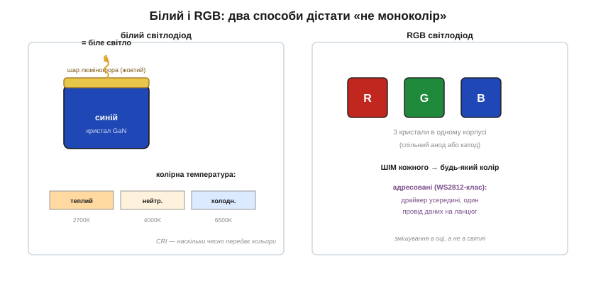
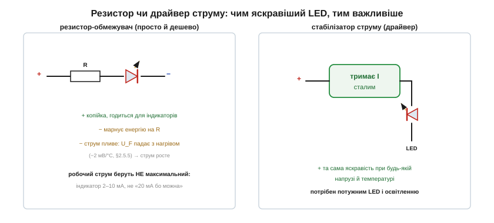

# 🔌 Світлодіоди на практиці: струм, колір, RGB і драйвери

> Це компонентна вставка до теми [2.5.7 «Світлодіод і фотодіод»](diode-pn-junction.md). Тема пояснила фізику світіння й базову схему «світлодіод + резистор». Тут — практичні питання, що постають, щойно береш світлодіод у руки: який струм обрати (і чому не максимальний), звідки беруться білий і RGB, і коли скромного резистора вже замало, а потрібен **драйвер струму**.

### Робочий струм: менший, ніж «можна»

Тема показала, як резистор задає струм. Але **який** струм задавати? Спокуса взяти «20 мА, бо в даташиті межа» — і даремно. По-перше, око бачить яскравість **логарифмічно**: світлодіод на 5 мА здається лише трохи тьмянішим за той самий на 20 мА, а їсть учетверо менше й гріється менше. По-друге, сучасні світлодіоди дуже ефективні — для індикатора часто досить **1–2 мА**. Тож робочий струм беруть із запасом **під яскравість**, а не під межу: яскравий індикатор — 5–10 мА, ледь помітний нічний — частки міліампера. А максимум із даташита лишають як абсолютну стелю, до якої не наближаються.

Чому взагалі потрібен обмежувач, тема пояснила через вертикальну гілку ВАХ. Додамо причину з [§2.5.5](diode-pn-junction.md): пряме падіння світлодіода трохи **плаває** — від екземпляра до екземпляра й від температури (−2 мВ/°C). Якби ви живили світлодіод просто напругою «впритул», крихітна різниця падіння давала б величезну різницю струму (експонента!). Резистор це гасить: він «з'їдає» різницю, тримаючи струм майже сталим. Тому правило «ніколи без обмежувача» — не перестороження, а наслідок крутизни ВАХ.

### Білий і RGB: два шляхи до кольору

Окремий світлодіод дає **один** колір — той, що задає щілина матеріалу. Як же дістати білий чи будь-який інший?

*Рис. 2.5.7c.1. Зліва: білий світлодіод — синій кристал під шаром жовтого люмінофора, що домішує бракуючі кольори (тема §2.5.7). Справа: RGB — три окремі кристали (червоний, зелений, синій) в одному корпусі; керуючи яскравістю кожного, дістають будь-який колір.*

**Білий** роблять, як уже знаємо, синім кристалом під люмінофором. На практиці важать два числа. **Колірна температура** — який саме білий: теплий жовтуватий (2700 K, як лампа розжарення), нейтральний (4000 K) чи холодний синюватий (6500 K, як денне світло). І **CRI** (*color rendering index*) — наскільки чесно цей білий передає кольори предметів: дешеві світлодіоди з низьким CRI роблять їжу й обличчя «несправжніми», тому для освітлення дому беруть CRI вище 80, а краще 90. З роками люмінофор тьмяніє, і світло білих світлодіодів повільно холоднішає — нормальна частина старіння.

**RGB** іде іншим шляхом: три кристали (R/G/B) в одному корпусі зі спільним анодом або катодом. Керуючи яскравістю кожного (зазвичай швидким мерехтінням — ШІМ, як у темі), дістають будь-який колір — змішування відбувається вже в оці. У найзручнішому різновиді — **адресованих** світлодіодах (WS2812-клас, «розумні піксели») — у кожен корпус умонтовано крихітний драйвер, тож довгий ланцюг керується одним проводом даних: саме з них роблять кольорові стрічки й матриці. Сам протокол керування ними — справа контролерів із пізніших розділів; тут важливо знати, що кольоровий світлодіод — це або три кристали, або «розумний» корпус із власною логікою.

### Резистор чи драйвер струму

Резистор-обмежувач простий і дешевий, але має дві вади: марнує енергію (різниця напруг гріє резистор) і не тримає струм при зміні умов. Для індикаторів це дрібниця, а для **яскравих і потужних** світлодіодів — ні:

*Рис. 2.5.7c.2. Резистор задає струм лише приблизно: нагрівся світлодіод — упало падіння — зріс струм — ще більше нагрівся. Драйвер (стабілізатор струму) тримає струм сталим за будь-якої напруги й температури, тому потужні світлодіоди й освітлення живлять саме ним.*

Біда резистора з потужним світлодіодом — у тепловому «розгоні»: світлодіод нагрівся → його падіння впало (−2 мВ/°C) → на резисторі лишилося більше напруги → струм зріс → світлодіод нагрівся ще дужче. Для одноватного світлодіода це шлях до вигоряння. Тому освітлювальні й потужні світлодіоди живлять **драйвером** — стабілізатором **струму** (а не напруги), що тримає заданий струм незалежно від напруги живлення й температури. Саме драйвер, а не резистор, стоїть усередині будь-якої LED-лампи й ліхтарика: він і яскравість тримає рівною, і від теплового розгону боронить. (Як влаштувати стабілізатор струму — побачимо в розділах про активні компоненти.)

> 🔧 **Навіщо це.** Беручи світлодіод: обирайте робочий струм **під потрібну яскравість**, а не «по максимуму» (часто досить 2–10 мА); для індикатора вистачить резистора, для потужного освітлення — потрібен драйвер струму. Білий характеризують колірною температурою (теплий/холодний) і CRI; кольоровий — це або RGB із трьох кристалів, або адресований «розумний» світлодіод. І завжди пам'ятайте полярність: катод — коротша ніжка або зріз на корпусі; у зворотному світлодіод не світить, а від великої зворотної напруги гине.
