# Розділ 2.5 — Діод і PN-перехід

Дотепер усі наші компоненти були **пасивні** й по-своєму «чесні»: резистор, конденсатор і котушка реагують на сигнал, запасають чи розсіюють енергію, але не керують струмом і не розрізняють його напряму. Цей розділ відкриває нову, **активну** електроніку — і починає з найпростішого напівпровідникового приладу, **діода** (*diode*). Діод — це однобічний клапан: пропускає струм в один бік і блокує у зворотний. З цієї простої властивості виростає випрямлення (змінний струм → постійний), захист схем від неправильної полярності, світлодіоди, опорні джерела напруги й багато іншого.

Та щоб зрозуміти, *чому* кристал так поводиться, ми спустимося до самої основи: розберемо, що таке **напівпровідник**, як його «налаштовують» домішками і що діється на межі двох таких налаштованих ділянок. Усе потрібне для старту вже є: уявлення про провідники та ізолятори, вільні електрони й природу струму з [Розділу 1.2](../../block-1-circuits-physics/voltage-current-conduction/voltage-current-conduction.md), поняття опору й того, як він залежить від матеріалу ([Розділ 1.3](../../block-1-circuits-physics/resistance-power-heat/resistance-power-heat.md)). Лишається додати одну нову річ — речовину, що посідає місце *між* провідником та ізолятором, і навчитися нею керувати.

> 📜 **Перед матеріалом — історія:** [від «котячого вуса» до PN-переходу](hist-diode.md). Вона показує, *звідки* взялася ідея кристалічного клапана — від спостереження Брауна (1874), що камінь проводить струм лише в один бік, до випадкового відкриття PN-переходу Расселом Олом (1939).

---

## 2.5.1 Напівпровідник: між провідником та ізолятором

У [Розділі 1.2](../../block-1-circuits-physics/voltage-current-conduction/voltage-current-conduction.md) ми поділили всі речовини на дві шухляди. **Провідники** (метали — мідь, алюміній) повні **вільних електронів**: вони відриваються від атомів і гуляють металом, тож найменша напруга жене крізь них струм. **Ізолятори** (скло, гума, пластик) тримають усі електрони міцно прив'язаними до атомів — вільних носіїв немає, і струм не тече. Дві шухляди, чітка межа.

Але природа не любить різких меж. Між цими двома крайнощами лежить ціла родина речовин, що **не належать до жодної шухляди**, — їх так і називають **напівпровідниками** (*semiconductors*). Найважливіші з них — **кремній** (*silicon*, Si) і **германій** (*germanium*, Ge). І саме в тому, що вони «ні те, ні се», ховається вся їхня сила.

### Погляньмо на числа

Найпростіше відчути напівпровідник — через **питомий опір** (ρ, [§1.3.3](../../block-1-circuits-physics/resistance-power-heat/resistance-power-heat.md)), тобто наскільки сильно сам матеріал протидіє струму. Розмах тут велетенський:

```
мідь (провідник)        ρ ≈ 0.000 000 02  Ом·м   (≈ 10⁻⁸)
кремній (чистий)        ρ ≈ 1 000          Ом·м   (≈ 10³)
скло (ізолятор)         ρ ≈ 1 000 000 000 000  Ом·м (≈ 10¹²)
```

Зверніть увагу на масштаб: від міді до скла — це не «у кілька разів», а у **двадцять порядків** (у сто мільярдів мільярдів разів!). І чистий кремній сидить десь посередині цієї прірви. Він проводить струм мільйонами разів гірше за метал, але мільярди разів краще за скло. Не провідник і не ізолятор — щось третє.

Щоб відчути цю прірву інакше: якби «товщину» опору міді взяти за аркуш паперу, то опір скла був би стовпом заввишки в сотні мільйонів кілометрів. Кремній на такій шкалі — не «трохи гірший провідник», а зовсім окрема порода матеріалу, чию поведінку не вгадаєш ні за металом, ні за ізолятором. І найважливіше попереду: його опір — не фіксована цифра з таблиці, як у міді чи скла, а величина, що **повзає** цією шкалою залежно від умов.

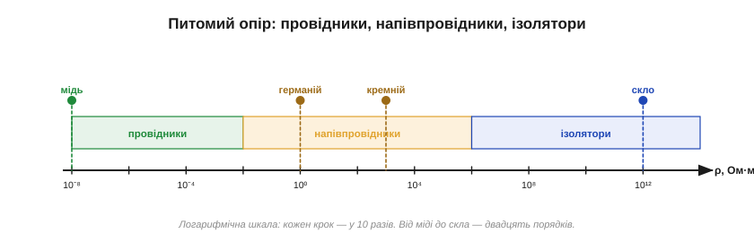
*Рис. 2.5.1.1. Шкала питомого опору (логарифмічна — кожен крок у 10 разів). Метали тиснуться ліворуч (крихітний опір), ізолятори — праворуч (величезний). Напівпровідники (кремній, германій) займають широку середину. Саме ця «проміжність» робить їх керованими.*

Тут варто застерегти від хибного образу: слово «напівпровідник» трохи оманливе. Річ не в тім, що кремній проводить «наполовину», а в тім, що він проводить **по-різному** — залежно від температури, освітлення, домішок і прикладеної напруги. Точніше було б назвати його «керованим провідником». І саме ця керованість, а не якесь середнє значення опору, — те, що ми експлуатуватимемо весь розділ.

### Чому кремній не зовсім провідник і не зовсім ізолятор

Щоб зрозуміти, звідки ця проміжність, зазирнімо в сам кристал. Атом кремнію має **чотири** зовнішні (валентні) електрони. У твердому кремнії кожен атом стоїть серед чотирьох сусідів і **ділиться** з кожним по одному електрону, утворюючи спільні електронні пари — **ковалентні зв'язки** (*covalent bonds*). Виходить акуратна, міцно зшита тривимірна ґратка, де кожен валентний електрон **зайнятий** у зв'язку між двома атомами.

Чому саме чотири зв'язки? Атомам «комфортно», коли їхня зовнішня оболонка укомплектована вісьмома електронами. Маючи свої чотири й позичивши по одному в кожного з чотирьох сусідів, атом кремнію якраз набирає бажану вісімку — тому ґратка така стабільна й симетрична (до речі, та сама структура, що в алмаза). Германій улаштований так само — теж чотири валентні електрони, — тому й поводиться подібно до кремнію. Уся ця конструкція тримається міцно; але, як ми зараз побачимо, не намертво.

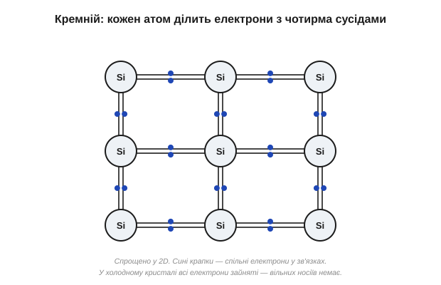
*Рис. 2.5.1.2. Кожен атом кремнію (4 валентні електрони) ділить по парі електронів із чотирма сусідами — ковалентні зв'язки. У бездоганному холодному кристалі **всі** електрони замкнені у зв'язках; вільних носіїв немає, тож кремній поводиться як ізолятор.*

І ось ключ: у **бездоганному й холодному** кристалі кремнію немає жодного вільного електрона — усі вони сидять у зв'язках. А раз нема вільних носіїв, то й струму нема: чистий холодний кремній поводиться як **ізолятор**. Поки що нічого «напів-». То звідки ж береться провідність?

### Розірвати зв'язок: звідки беруться носії

Зв'язки в кремнії міцні, але не безкінечно. Якщо дати електронові досить **енергії**, він може вирватися зі свого зв'язку, стати **вільним** — і відтоді блукати кристалом, переносячи струм, як у металі. А енергію цю дає звичайнісіньке **тепло**: за кімнатної температури атоми кристала весь час тремтять, і подеколи цього тремтіння вистачає, щоб виштовхнути електрон зі зв'язку.

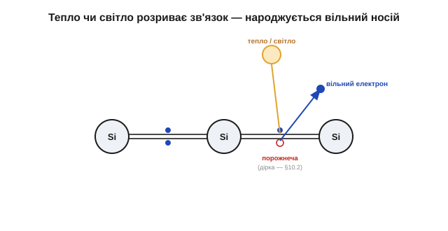
*Рис. 2.5.1.3. Порція енергії (тепло або світло) розриває один зв'язок: електрон стає вільним і може дрейфувати під дією поля, переносячи струм. На місці зв'язку лишається порожнеча — про неї докладно в §2.5.2.*

Звідси випливає річ, що відрізняє напівпровідник від металу найяскравіше. **Що тепліший кремній, то більше зв'язків розірвано, то більше вільних носіїв — і то краще він проводить.** Нагрійте його — опір **падає**. А метал поводиться рівно навпаки: у ньому вільні електрони є завжди, а нагрівання лише розгойдує ґратку, що дедалі сильніше заважає електронам рухатися, тож опір металу з нагріванням **зростає** ([§1.3.4](../../block-1-circuits-physics/resistance-power-heat/resistance-power-heat.md)). Один цей факт — провідність росте з температурою — видає напівпровідник миттєво.

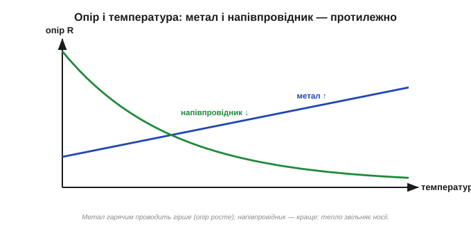
*Рис. 2.5.1.5. Опір залежно від температури. У металі він поволі **зростає** (нагріта ґратка дужче розсіює електрони). У напівпровіднику — навпаки, круто **падає**: тепло звільняє дедалі більше носіїв. Протилежний хід кривих — надійна ознака напівпровідника.*

Зауважмо одну деталь і відразу відкладімо її: коли електрон вискакує зі зв'язку, на його місці лишається **порожнеча**. Виявиться, що ця порожнеча теж поводиться як рухливий носій заряду (її назвуть **діркою**), і саме гра електронів та дірок зробить можливим усе подальше. Але повну історію носіїв і того, як їх додають навмисне, ми розгорнемо в [§2.5.2](diode-pn-junction.md) — тут досить запам'ятати: розірваний зв'язок дає носія, а тепло й світло такі зв'язки рвуть.

Наскільки рідкісні ці звільнені носії? У чистому кремнії за кімнатної температури вільним стає лише приблизно один атом із десятків трильйонів — мізерна крихта проти металу, де вільний електрон є мало не в кожного атома. Саме тому чистий кремній проводить так кепсько. Зате варто його нагріти — і кількість носіїв росте стрімко, по експоненті: піднявши температуру на кілька десятків градусів, провідність можна збільшити в рази. Звідси й практичний висновок, на який ми ще не раз натрапимо: розігрітий напівпровідниковий прилад поводиться інакше, ніж холодний.

Як саме вільний електрон переносить струм? Точнісінько так, як у металі: прикладене поле тягне його крізь ґратку, виходить дрейф зарядів — це і є струм ([Розділ 1.2](../../block-1-circuits-physics/voltage-current-conduction/voltage-current-conduction.md)). Різниця лише в кількості мандрівників: у металі їх безліч завжди, а в чистому кремнії — жменя, і цю жменю можна збільшувати чи зменшувати. Тому закон Ома справджується і тут, але «опір» виявляється не сталою величиною, а наслідком того, скільки носіїв ми зуміли «розбудити».

### Поріг звільнення: енергетична щілина

Чому ж одні речовини — провідники, інші — ізолятори, а кремній — посередині? Усе впирається в **поріг**: скільки енергії треба, щоб звільнити електрон. Фізики називають цей поріг **шириною забороненої зони**, або **енергетичною щілиною** (*energy gap*, *band gap*). Уявімо її як сходинку, що її електрон мусить «перестрибнути», щоб із зв'язаного стати вільним.

- У **металі** щілини фактично немає (рівні перекриваються): електрони вільні завжди, навіть на холоді. Звідси — чудова провідність.
- У **ізоляторі** щілина величезна (в алмазі — близько 5.5 еВ): нагрівання чи світло майже ніколи не наберуть стільки енергії, щоб звільнити електрон. Носіїв нема — струму нема.
- У **напівпровіднику** щілина мала, але не нульова (у кремнію ≈ 1.1 еВ, у германію ≈ 0.7 еВ): на холоді носіїв обмаль, але тепло чи світло легко звільняють їх потроху. Звідси — проміжна, **керована** провідність.

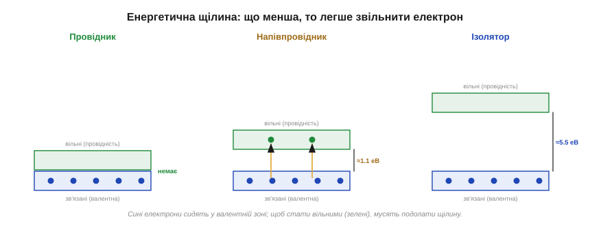
*Рис. 2.5.1.4. Поріг звільнення електрона. У металі щілини немає — електрони вільні завжди. В ізоляторі щілина величезна — звільнити електрон майже неможливо. У напівпровіднику вона мала: тепло чи світло переводять частину електронів через неї у вільний стан. Розмір щілини й визначає, ким буде речовина.*

(Тут зручна крихітна одиниця енергії — **електрон-вольт**, еВ: стільки енергії набирає один електрон, пройшовши різницю потенціалів в 1 вольт. Це мізерна порція, саме під масштаб одного електрона.)

Різниця в розмірі щілини пояснює й давню конкуренцію двох матеріалів. У германію щілина менша (≈ 0.7 еВ проти ≈ 1.1 еВ у кремнію), тож за тієї самої температури в ньому більше «теплових» носіїв — він чутливіший, і колись був зручнішим. Але та сама легкість обертається вадою: германій помітніше «підтікає» на спеці й гірше тримається за високих температур. Кремній із його ширшою щілиною спокійніший, дешевший у виробництві й витриваліший — тому зрештою він і переміг, ставши матеріалом усієї сучасної електроніки.

> 📜 **Історія до теми:** [кремній проти германію — чому виграв «пісок»](hist-silicon-germanium.md). На старті вся електроніка була германієва; як кремній наздогнав за один 1954 рік (Танненбаум у Bell зробив перший, Тіл у Texas Instruments перший продав), фокус Тіла з гарячою олією — і чому остаточно закріпив перемогу кремнію його власний оксид SiO₂.

### Тепло й світло вже керують провідністю

Те, що провідність кремнію залежить від зовнішніх умов, — не абстракція, а готові прилади. **[Термістор](book:components/ntc-thermistor)** (*thermistor*) — це напівпровідниковий резистор, опір якого помітно **падає** при нагріванні (більше тепла → більше розірваних зв'язків → більше носіїв). Його ставлять як давач температури: міряючи опір, дізнаються температуру. **[Фоторезистор](book:components/light-sensors)** (*photoresistor*, LDR) працює так само, але на **світло**: фотони розривають зв'язки, опір падає на світлі й росте в темряві — звідси давачі освітленості, нічники, що самі вмикаються присмерком.

Уявімо це конкретно. Термістор у термостаті: вода гріється — опір термістора падає — схема «бачить» зростання температури й вимикає нагрів. Фоторезистор у вуличному ліхтарі: смеркає — світла менше — опір росте — схема вмикає лампу. В обох випадках жодної механіки, лише напівпровідник, що міняє опір у відповідь на зовнішню умову. Та є й зворотний, непроханий бік цієї чутливості: теплові носії з'являються **завжди**, навіть коли їх не просять, і дають невеликий паразитний струм — «витік». Тому точні чи потужні прилади часом доводиться охолоджувати, а розробники напівпровідників усе життя борються з цим тепловим «шумом».

> 🔧 **Навіщо це.** Саме це й відрізняє напівпровідник від мертвого шматка міді чи скла: його провідністю можна **керувати**. Поки що ми бачили два важелі — тепло (термістор) і світло (фоторезистор, а ще той самий ефект, що дав Олу сонячний елемент в історії розділу). Та головні два важелі ще попереду: **домішки**, якими провідність задають наперед і назавжди ([§2.5.2](diode-pn-junction.md)), і **прикладена напруга**, якою керують струмом миттєво (це приведе нас аж до транзистора). Керована провідність — фундамент, на якому стоїть уся цифрова техніка.

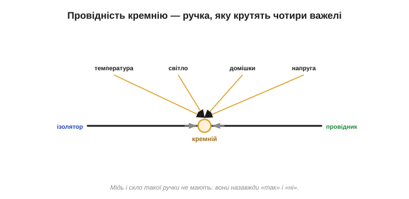
*Рис. 2.5.1.6. Головна ідея напівпровідника: його провідність — не стала, а «ручка» між ізолятором і провідником. Її крутять чотири важелі: температура, світло, домішки (легування) і прикладена напруга. Мідь і скло такої ручки не мають.*

### Чому це фундамент усієї електроніки

Підсумуймо головну думку. Провідник проводить **завжди**, ізолятор — **ніколи**; обидва незмінні, ними не покеруєш. А напівпровідник сидить між ними не просто так: його провідність — не стала властивість, а **ручка, яку можна крутити**. Нагрів, світло, додані домішки, прикладена напруга — усе це зсуває кремній ближче до провідника або до ізолятора. Саме тому світ збудовано на кремнії, а не на міді чи склі: з матеріалу, що слухняно міняє провідність на команду, можна зробити клапан (діод), підсилювач і ключ (транзистор), а з мільярдів таких ключів — процесор.

Ось чому варто витратити цілий розділ на «камінь»: мідь і скло — це назавжди задані «так» і «ні», а кремній — це «залежить», і цим «залежить» інженер керує. Резистор, конденсатор і котушка з Модуля 1 лише **реагували** на сигнал — кожен по-своєму, але пасивно. Напівпровідниковий прилад уперше дозволяє одному електричному впливові **керувати** іншим. Саме звідси й починається активна електроніка — і саме тому далі ми так пильно розбиратимемо, що діється всередині кремнію.

Отже, ми маємо матеріал-«хамелеон». Наступний крок — навчитися задавати його провідність **навмисно**, додаючи в чистий кремній дрібку чужих атомів. Цей прийом зветься **легуванням**, і з нього починається все цікаве: дірки, n- і p-тип, а далі й сам PN-перехід. Дивовижно, але лише дрібка чужих атомів — буквально один на мільйон — здатна змінити провідність кремнію в тисячі разів і наперед задати, які саме носії в ньому переважатимуть. До цього й переходимо.

> ▶️ Далі: [§2.5.2 Легування: n- і p-тип (донори/акцептори)](diode-pn-junction.md)

---

## 2.5.2 Легування: n- і p-тип (донори/акцептори)

У [§2.5.1](diode-pn-junction.md) ми лишили два борги. По-перше, обіцяли пояснити, що таке **дірка** — та сама порожнеча, що лишається від розірваного зв'язку. По-друге, сказали, що провідністю кремнію керують не лише теплом і світлом, а й **домішками** — і що дрібка чужих атомів міняє все. Час повернути обидва борги: вони зливаються в одну ідею — **легування** (*doping*), і саме з неї кремній перетворюється з «цікавого каменю» на матеріал, придатний для діодів і транзисторів.

### Дірка: носій, якого «немає»

Повернімося до розірваного зв'язку з §2.5.1. Електрон вискочив і полетів — а що лишилося на його місці? Порожнє місце у зв'язку. Спокуса сказати «нічого» — і помилитися. Бо сусідній зв'язаний електрон може **перестрибнути** в цю порожнечу й заповнити її — але тоді порожнеча з'явиться вже там, звідки він прийшов. Перестрибне наступний — і порожнеча знову переїде. Виходить, що **порожнеча мандрує кристалом**, хоча жоден окремий електрон далеко не йде.

А оскільки порожнеча — це брак однієї негативної частинки, поводиться вона як рухливий **позитивний** заряд. Їй дали власне ім'я — **дірка** (*hole*). Це другий повноправний носій струму поряд із вільним електроном.

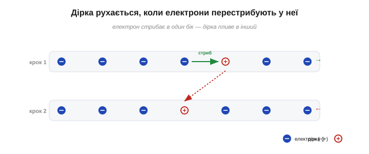
*Рис. 2.5.2.1. «Парковка» з електронів. Усі місця зайняті, крім одного (дірка). Коли електрон перестрибує праворуч у вільне місце, сама порожнеча зсувається ліворуч. Електрони рухаються в один бік — дірка ніби пливе в протилежний, як рухливий позитивний заряд.*

Класична аналогія — заповнена парковка з одним порожнім місцем. Машини (електрони) по черзі зсуваються в порожнечу — і та «їде» в протилежний бік, хоч жодна машина не проїхала через увесь паркінг. Дірка — це і є та порожнеча: зручний спосіб говорити про рух багатьох електронів як про рух однієї «частинки» з плюсом.

Як саме дірка переносить струм? Прикладімо поле. Зв'язані електрони перестрибують у бік «плюса», заповнюючи дірки, — а отже, самі дірки дрейфують у бік «мінуса», поводячись як справжні позитивні заряди. Тому в напівпровіднику струм складається з **двох** потоків: вільні електрони пливуть в один бік, дірки — у протилежний. І, що цікаво, обидва потоки **додають** струм в одному й тому самому напрямку — бо протилежні заряди, рухаючись у протилежні боки, дають однаково спрямований струм. Звичка тримати в голові обидва носії — те, без чого далі не зрозуміти ні діод, ні транзистор.

Отже, у напівпровіднику **два** типи носіїв: вільні **електрони** (заряд −) і **дірки** (заряд +). У чистому кремнії вони народжуються строго **парами**: один розірваний зв'язок дає рівно один вільний електрон і рівно одну дірку.


*Рис. 2.5.2.2. У чистому кремнії носії з'являються парами: тепло розриває зв'язок — і водночас народжуються вільний електрон (−) і дірка (+). Тому в чистому матеріалі електронів і дірок порівну.*

### Замало носіїв — додаймо домішки навмисне

У чистому кремнії пар обмаль (один вільний носій на десятки трильйонів атомів, §2.5.1) — і електронів та дірок порівну, тож матеріал кепський і «безхарактерний». Щоб зробити з нього прилад, треба керувати **двома** речами: **скільки** носіїв і **якого знаку** вони переважно. Саме це й робить легування — заміна крихітної частки атомів кремнію на атоми з **іншим** числом валентних електронів. Дивовижно, як мало їх треба; та спершу подивімося, що саме вони роблять.

Сама ідея гідна подиву: щоб змінити електричний характер речовини, у неї не вливають струм і не прикладають напругу — у неї лише **підселяють** кілька чужих атомів, і кристал назавжди стає «електронним» або «дірковим». Саме цей здогад — що домішки не ворог, а інструмент — Рассел Ол і перетворив на ключ до всієї подальшої електроніки (історія розділу). Подивімося, як працюють два сорти таких «підселенців».

### n-тип: зайвий електрон (донор)

Підмішаймо в кремній атом із **п'ятьма** валентними електронами — наприклад, **фосфор** (*phosphorus*, P) чи **миш'як** (*arsenic*, As) (V група). Чотири його електрони акуратно вбудуються в зв'язки з чотирма сусідами-кремнієм, як і годиться в ґратці. А **п'ятий** — зайвий: йому немає пари, немає зв'язку, де сісти. Він тримається кволо й за кімнатної температури легко відривається, стаючи **вільним електроном** — причому **без** парної дірки.

Атом, що «подарував» кристалові вільний електрон, називають **донором** (*donor*), а кремній із такими домішками — **n-тип** (n — від *negative*, бо переважають негативні носії, електрони).


*Рис. 2.5.2.3. Атом фосфору (5 валентних електронів) серед кремнію: чотири електрони йдуть у зв'язки, п'ятий лишається зайвим і легко стає вільним носієм (−). Дірки при цьому не виникає. Так роблять n-тип — кремній із надлишком вільних електронів.*

Важлива тонкість: чи не з'являється тут зайвий заряд? Ні. Віддавши електрон, атом донора сам стає **нерухомим позитивним іоном**, замкненим у ґратці. Його «плюс» точно врівноважує «мінус» відірваного електрона, тож кристал **загалом лишається нейтральним** — просто тепер у ньому є вільні електрони, готові переносити струм. Запам'ятаймо це: легування додає рухливі носії, але **не** додає сумарного заряду.

Чому ж n-тип проводить набагато краще за чистий кремній? Бо звільнити «зайвий» п'ятий електрон донора куди легше, ніж розірвати міцний зв'язок Si–Si: йому й так немає де сісти. Тому вже за кімнатної температури майже **кожен** донор віддає свій електрон — і вільних носіїв стає рівно стільки, скільки ми поклали донорів. Це вже не теплова випадковість, як у чистому кремнії, а кероване, передбачуване число: скільки домішки додав — стільки приблизно й носіїв дістав. Ось чому концентрацією домішки задають провідність наперед.

### p-тип: бракує електрона (акцептор)

Тепер навпаки — підмішаймо атом із **трьома** валентними електронами, наприклад **бор** (*boron*, B) (III група). Він може утворити лише три зв'язки з сусідами; на четвертий зв'язок електрона **не вистачає** — там одразу сидить **дірка**. Сусідній зв'язаний електрон легко перестрибує туди, добудовуючи зв'язок (атом ніби «приймає» електрон), — а дірка переїздить далі й мандрує кристалом.

Атом, що «приймає» електрон, називають **акцептором** (*acceptor*), а такий кремній — **p-тип** (p — від *positive*, бо переважають позитивні носії, дірки).


*Рис. 2.5.2.4. Атом бору (3 валентні електрони) серед кремнію: на четвертий зв'язок електрона бракує — лишається дірка (+), яка може мандрувати. Вільного електрона при цьому не додається. Так роблять p-тип — кремній із надлишком дірок.*

І знову нейтральність: прийнявши електрон, акцептор стає **нерухомим негативним іоном**; його «мінус» урівноважує «плюс» дірки. Матеріал нейтральний — просто з рухливими дірками напоготові.

Дзеркально до донора: «недобудований» четвертий зв'язок бору так і проситься, щоб сусідній електрон його заповнив, тож майже кожен атом бору вже за кімнатної температури породжує одну рухливу дірку. Скільки акцепторів поклали — стільки приблизно дірок і дістали, і струм у p-типі несуть переважно вони. Зверніть увагу на симетрію двох випадків: донор дає електрон без дірки, акцептор дає дірку без електрона — кожен додає носій лише **одного** знаку, на відміну від теплової пари в чистому кремнії.

### Більшість, меншість — і обидва нейтральні

Звівши все докупи, отримуємо чіткий поділ:

```
n-тип:  основні носії — електрони (−),  неосновні — дірки (+)
p-тип:  основні носії — дірки (+),       неосновні — електрони (−)
```

Слово **основні** (*majority*) — про тих, кого легування дало вдосталь; **неосновні** (*minority*) — про нечисленних носіїв протилежного знаку, що все одно з'являються від теплових пар (§2.5.1). У n-типі дірок мало, у p-типі мало електронів — але вони є, і далі виявляться важливими.

Наскільки нерівний цей поділ? Дуже. У типово легованому кремнії основних носіїв буває в **мільярди** разів більше за неосновних. Саме ця кричуща перевага одного знаку й надає матеріалові «електронного» (n) чи «діркового» (p) характеру. Та крихітна меншість нікуди не зникає — і, хоч як це дивно, саме неосновні носії згодом визначать, як поводиться діод під зворотною напругою ([§2.5.5](diode-pn-junction.md)). Тож не списуймо їх з рахунку завчасно: у напівпровідниках навіть «меншість» уміє зіграти ключову роль.

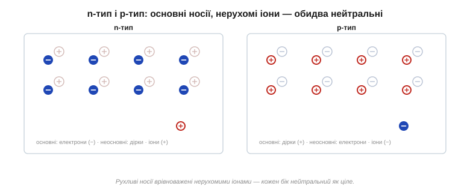
*Рис. 2.5.2.5. Ліворуч n-тип: багато вільних електронів (−), нерухомі іони-донори (+) у ґратці, дірок — одиниці. Праворуч p-тип: багато дірок (+), нерухомі іони-акцептори (−), електронів — одиниці. Рухливі носії врівноважені нерухомими іонами, тож кожен шматок **нейтральний** як ціле.*

Зверніть увагу на головне непорозуміння, якого варто уникати: «n» і «p» кажуть про знак **основних носіїв**, а не про заряд матеріалу. І n-, і p-кремній **електрично нейтральні** — у руках ви тримаєте звичайний нейтральний кристал. Просто в одному напоготові негативні носії, у другому — позитивні. Ця нейтральність кожного боку окремо — те, без чого не зрозуміти PN-перехід.

Образно: n-кремній — це нейтральний натовп, у якому багато людей готові побігти ліворуч (електрони), а p-кремній — натовп, де багато готових побігти праворуч (дірки). Але загалом обидва натовпи стоять на місці й нікуди не зміщені — рівно доти, доки ми не зведемо їх докупи.

> 🔧 **Навіщо це.** Легування дає інженерові подвійний важіль: задати **скільки** носіїв (концентрацією домішки — від цього залежить провідність) і **якого знаку** вони переважно (вибором донора чи акцептора). Це і є та «настройка» матеріалу, якої не має ні мідь, ні скло. Створивши на одному кристалі сусідні n- і p-ділянки потрібної форми, ми дістаємо діоди, транзистори, а зрештою — цілі мікросхеми. Уся напівпровідникова техніка — це, по суті, мистецтво вчасно покласти потрібну домішку в потрібне місце.

І ще одна важлива різниця проти [§2.5.1](diode-pn-junction.md). Тепло й світло крутили провідність **тимчасово**: прибрав вплив — і кремній повернувся до вихідного стану. Легування ж — **назавжди**: домішкові атоми вбудовані в ґратку, тож n- чи p-характер задано раз і назавжди, ще на заводі. Саме ця сталість і дозволяє будувати надійні, повторювані прилади — а не примхливі «котячі вуса» з історії розділу, де чутливу точку щоразу шукали навпомацки.

### Як мало домішки треба

Наскільки дрібна та «дрібка»? Часто досить **одного атома домішки на мільйон** (а то й на сто мільйонів) атомів кремнію, щоб провідність зросла в тисячі разів. Звідси й одержимість **чистотою** з історії розділу (урок Рассела Ола): якщо хочеш керувати домішкою на рівні «один на мільйон», то фоновий бруд має бути ще менший — інакше випадкові домішки заглушать навмисні. Спершу кремній очищають майже до ідеалу, а вже потім додають рівно стільки потрібного, скільки треба.

Щоб відчути цю дрібку: один атом на мільйон — це наче одна-єдина особлива піщинка на повне відро піску або один підмінений гравець серед повного стадіону глядачів. І попри таку мізерність, ця «піщинка» змінює провідність кристала в тисячі разів. Ось чому напівпровідникове виробництво — це передусім боротьба за чистоту вихідного матеріалу й за точність дозування домішки.


*Рис. 2.5.2.6. Лише один чужий атом на мільйон атомів кремнію — і провідність підскакує в тисячі разів. Тому спершу домагаються майже ідеальної чистоти, а тоді дозовано вводять домішку (нагріванням — дифузією, або «встрілюванням» іонів).*

Технічно домішки вводять або **дифузією** (розігрітий кремній «всотує» їх із пари), або **іонною імплантацією** («встрілюванням» іонів). А головне — це можна робити **візерунком**: тут n, поряд p, у точно заданих місцях однієї пластини. Саме так на одному кристалі вибудовують мільярди приладів.

### Що далі

Отже, маємо два різновиди кремнію: **n-тип** із надлишком вільних електронів і **p-тип** із надлишком дірок — кожен сам по собі нейтральний і доволі нудний. Уся магія починається, коли їх **з'єднати** в одному кристалі: n з одного боку, p — з іншого. Саме тому далі вся увага буде прикута не до самого матеріалу, а до **межі** між двома його сортами — бо саме там, а не в товщі кремнію, і живе клапан. На межі між ними станеться дещо несподіване — і саме воно є серцем діода. До цієї межі — **PN-переходу** — ми й переходимо.

> ▶️ Далі: [§2.5.3 PN-перехід: бар'єр і збіднена область](diode-pn-junction.md)

---

## 2.5.3 PN-перехід: бар'єр і збіднена область

[§2.5.2](diode-pn-junction.md) дав нам два різновиди кремнію: **n-тип** із надлишком вільних електронів і **p-тип** із надлишком дірок — кожен сам по собі нейтральний. Тепер — вирішальний крок. З'єднаймо їх в **одному** кристалі: n з одного боку, p — з іншого. Ця межа й зветься **PN-переходом** (*PN junction*). І найдивовижніше: щойно n і p опиняються поряд, на межі — **без жодної батареї** — само собою постає бар'єр, який і робить кристал клапаном. Розберімо, як він виникає; зрозуміти це — означає зрозуміти діод.

Одразу домовмося про одне: «з'єднати» тут не значить притиснути два шматки один до одного (такий стик дав би лише поганий контакт). PN-перехід **вирощують** в одному суцільному кристалі, легуючи його так, щоб одна частина стала n, а сусідня — p. Межа виходить безшовна, на рівні самої ґратки.

### Зустріч: величезний перепад концентрацій

Погляньмо на саму межу в перший уявний момент. Ліворуч, у n-області, аж кишить вільними електронами. Праворуч, у p-області, повно дірок. А посеред — тонюсінька межа, по різні боки якої концентрації носіїв відрізняються в мільярди разів. Природа таких перепадів не терпить.

Чому не терпить? Бо носії невпинно й хаотично рухаються через теплове тремтіння — снують на всі боки без жодної мети. А там, де чогось багато, випадкові блукання частіше виносять його назовні, ніж заносять назад. Тож сам **безлад** поступово вирівнює концентрації — без жодної сили, що «штовхала б» носії, лише гола статистика.

Та сама причина, чому запах із відкритого флакона за хвилину заповнює всю кімнату, а не лишається в кутку: молекули нікуди «не прагнуть», вони просто хаотично блукають — а блукаючи, неминуче розходяться рівномірно. Носії в кристалі поводяться так само, лише замість повітря довкола них ґратка кремнію.

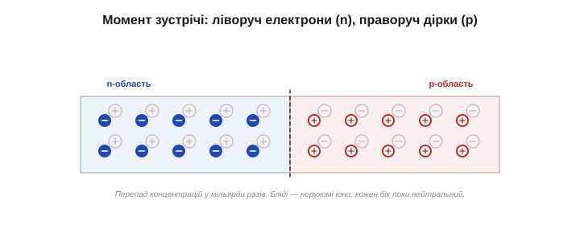
*Рис. 2.5.3.1. Уявний перший момент: ліворуч n-область, повна вільних електронів (−), праворуч p-область, повна дірок (+). На межі — величезний перепад концентрацій носіїв. Нерухомі іони домішок (бліді) поки що рівномірно «прикриті» своїми носіями, тож обидва боки нейтральні.*

### Дифузія й рекомбінація

Що роблять частинки, коли їх десь густо, а поряд порожньо? **Дифундують** — розпливаються з тісноти в простір. Так крапля чорнила розходиться у воді, а запах — кімнатою. Носії в кристалі поводяться так само: вільні електрони з n-боку линуть туди, де їх мало (у p), а дірки з p-боку — туди, де їх мало (у n). Це **дифузія** (*diffusion*) носіїв через межу. Підкреслимо: дифузію не «вмикає» якась сила — це чистий наслідок хаотичного руху й теорії ймовірностей. Біля межі з густого n-боку приходить більше електронів, ніж повертається з рідкого p-боку, — і виходить чистий потік у p. З дірками — дзеркально. Ніхто нікого не штовхає; просто з тісноти статистично легше вийти, ніж зайти.

Але щойно електрон із n-боку забреде в p-область, повну дірок, його чекає швидкий кінець: він «провалюється» в дірку, добудовуючи розірваний зв'язок. Електрон і дірка **зникають як носії** — це **рекомбінація** (*recombination*), точна протилежність народженню пари з §2.5.1. Так само й дірка, що зайшла в n-область, ловить там вільний електрон. Виходить, що поблизу межі носії, які перейшли кордон, дружно винищують одне одного.

Триватиме це не вічно: рекомбінація йде лише у вузькій смужці біля самої межі й гасне, щойно носії звідти зникнуть. Енергія, що вивільняється при рекомбінації, у кремнії здебільшого йде в тепло (а от у деяких інших матеріалах — у світло; саме на цьому стоїть світлодіод, але про це — у [§2.5.7](diode-pn-junction.md)). Поки що нам важливий лише результат: смужка обабіч межі лишається без рухливих носіїв.

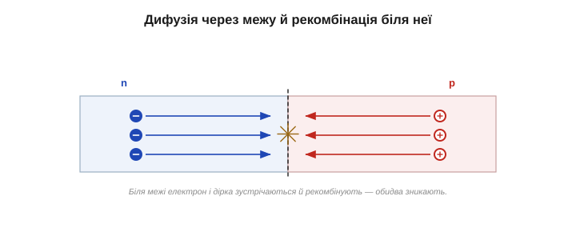
*Рис. 2.5.3.2. Електрони дифундують з n у p, дірки — з p у n (стрілки). Зустрічаючись біля межі, електрон і дірка рекомбінують — обидва зникають як носії. Тонкий шар обабіч межі поступово порожніє.*

### Збіднена область і відкриті іони

Носії пішли й порекомбінували — і обабіч межі утворюється тонкий шар, **позбавлений рухливих носіїв**. Його так і звуть — **збіднена область** (*depletion region*). Здавалося б, дрібниця. Та згадаймо: коли електрон покидає n-бік, там лишається його донор — **нерухомий позитивний іон**; коли дірку в p-боці заповнено, там лишається акцептор — **нерухомий негативний іон** ([§2.5.2](diode-pn-junction.md)). Доти ці іони були акуратно «прикриті» своїми рухливими носіями, і кожен бік був нейтральний. А тепер носії пішли — і іони **оголилися**.

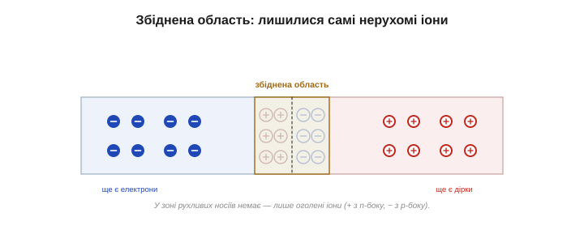
*Рис. 2.5.3.3. У збідненій області рухливих носіїв немає — лишилися самі нерухомі іони: позитивні (донори) з n-боку, негативні (акцептори) з p-боку. Поза збідненою областю носії ще є, і там нейтрально.*

Отже, у збідненій області з'являється подвійний шар **зв'язаного** заряду: смужка позитивних іонів з n-боку межі й смужка негативних — з p-боку. Кристал як ціле досі нейтральний, але **локально**, на самій межі, заряди розійшлися.

Наскільки широка ця область? Дуже тонка — зазвичай частки мікрона, тонша за тисячну людської волосини; і що сильніше легований кремній (більше домішок), то вужча вона, бо потрібну кількість іонів «набирають» на коротшій відстані. Та хоч яка тонка, саме вона визначає поведінку діода. Без вільних носіїв збіднена область проводить кепсько — поводиться майже як **ізолятор**: тонкий прошарок «порожнечі» посеред провідного кристала.

Зверніть увагу й на красу балансу: сумарний відкритий «+» заряд з n-боку точно дорівнює сумарному «−» з p-боку — адже кожен електрон, що пішов, лишив по собі один іон, і кожна заповнена дірка теж. Тому перехід і назовні лишається нейтральним, попри розділені всередині заряди.

### Вбудоване поле: гальмо для дифузії

А розділені заряди — це завжди електричне поле ([Розділ 1.1](../../block-1-circuits-physics/charge-field-potential/charge-field-potential.md)). Смужка «+» з n-боку й смужка «−» з p-боку створюють у збідненій області **вбудоване електричне поле** (*built-in field*), напрямлене від плюса до мінуса — тобто з n у p. І ось ключ: це поле **протидіє** дальшій дифузії. Електрон (заряд −), що намагається перейти з n у p, поле штовхає назад у n; дірку (+), що рветься з p у n, — назад у p. Поле працює як гальмо для тих самих носіїв, що його породили.

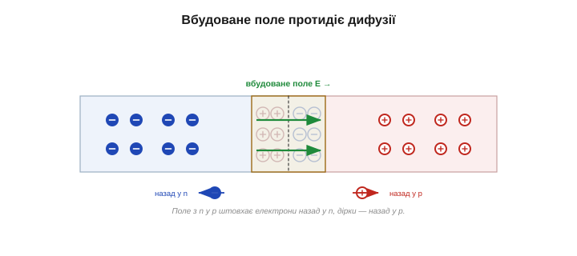
*Рис. 2.5.3.4. Оголені іони створюють вбудоване поле (з n у p). Воно відштовхує електрони назад у n, а дірки — назад у p, тобто **протидіє** дифузії, що його ж і породила. Що більше носіїв перейшло — то ширша збіднена зона й сильніше поле.*

Тут криється саморегуляція. Що більше носіїв продифундувало, то більше іонів оголилося, то ширша збіднена область і сильніше гальмівне поле. Дифузія сама себе пригальмовує — аж поки поле не стане досить сильним, щоб **зупинити** дальший перехід.

І хоч уся різниця потенціалів тут невелика (менш як вольт), вона зосереджена в надтонкій збідненій смужці — а отже, поле в ній виходить навдивовижу **сильне** (десятки й сотні тисяч вольтів на сантиметр). Саме тому таке скромне на вигляд гальмо здатне спинити потужний дифузійний потік.

### Рівновага й потенціальний бар'єр

Так настає **рівновага**: прагнення носіїв розпливтися (дифузія) точно врівноважене вбудованим полем, що жене їх назад. Рівновага ця **динамічна**, а не мертва: найенергійніші окремі носії все одно зрідка перестрибують бар'єр в обидва боки, але зустрічні потоки точно рівні, тож сумарного струму немає. Це радше жвавий базар, де скільки людей заходить, стільки й виходить, аніж замкнені двері. Через збіднену область установлюється стала різниця потенціалів — **потенціальний бар'єр** (*built-in potential*). Його зручно уявляти як **пагорб**, на який носій мусить вибратися, щоб перейти межу: більшості «снаги» не вистачає, і перехід майже припиняється.

Можна уявити це й інакше — як двоє зустрічних натовпів, що ринули в спільні двері. Перші проходять легко, але дуже швидко в дверях утворюється тиснява зі «застряглих» (це наші оголені іони), і вона дедалі дужче відпихає тих, хто напирає ззаду. Урешті тиснява стає така, що нікого більше не пропускає, — і рух завмирає сам собою, без жодного вахтера. Бар'єр виник не тому, що хтось його поставив, а тому, що носії самі собі заступили шлях.

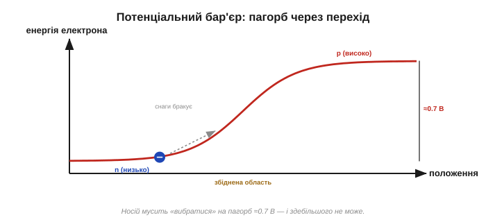
*Рис. 2.5.3.5. Через збіднену область установлюється потенціальний бар'єр — «пагорб» висотою ≈0.7 В для кремнію (≈0.3 В для германію). У рівновазі він якраз такий, щоб зрівноважити дифузію: носії з обох боків здебільшого не можуть його подолати.*

Наскільки високий цей пагорб? Для кремнію — приблизно **0.6–0.7 вольта**, для германію — близько **0.3 В**. Звідки саме така висота? Її задає матеріал — передусім та сама енергетична щілина з [§2.5.1](diode-pn-junction.md): ширша щілина в кремнію дає вищий бар'єр (≈0.7 В), вужча в германію — нижчий (≈0.3 В). Тому й «поріг відкривання» в кремнієвого та германієвого діодів різний — ми ще побачимо це на вольт-амперній характеристиці (§2.5.5). Запам'ятаймо це число: воно ще повернеться як «падіння на діоді» в §2.5.5. І найважливіше — усе це сталося **само собою**, без жодного зовнішнього джерела: сам факт сусідства n і p породжує і збіднену область, і поле, і бар'єр.

І тут варто застерегти від спокуси: чи не можна під'єднати дротики до переходу й живитися з цих ≈0.7 В, як від крихітної батарейки? Ні. Щойно ви чіпляєте контакти, на з'єднаннях метал–напівпровідник виникають **свої** контактні бар'єри, що в сумі точно компенсують вбудований, — і повним колом напруга не йде. Це **рівноважний** бар'єр, а не запас енергії: він існує всередині, але сам по собі струму не жене. Щоб щось сталося, потрібне зовнішнє джерело — про що й буде §2.5.4. (Виняток — коли енергію в перехід вкидає світло: так працює сонячний елемент Ола з історії розділу.)

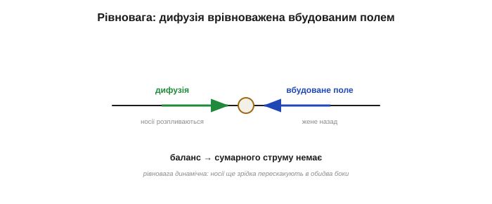
*Рис. 2.5.3.6. Перетягування каната в рівновазі: дифузія штовхає носії через межу, вбудоване поле жене їх назад — рівно настільки, щоб сумарний перехід припинився. Збіднена область стабілізується, бар'єр застигає на ≈0.7 В.*

> 🔧 **Навіщо це.** Збіднена область і потенціальний бар'єр — це і є «механіка» діода. Збіднена зона без рухливих носіїв поводиться майже як ізолятор — ось чому перехід у спокої струму не пропускає. А висота бар'єра (≈0.7 В) задасть, скільки напруги треба «докласти», щоб діод відкрився ([§2.5.5](diode-pn-junction.md)). Усе подальше — пряме й зворотне зміщення, випрямлення, навіть світлодіод — це різні способи **керувати** цим бар'єром.

Зберімо картину докупи. На межі n і p — **самі собою**, без жодної батареї — виникли: (1) **збіднена область** без рухливих носіїв; (2) подвійний шар нерухомих іонів (+ з n-боку, − з p-боку); (3) **вбудоване поле** через цю область; (4) **потенціальний бар'єр** ≈0.7 В, що зрівноважує дифузію. Усе це — рівноважний стан спокою: жодного струму, жодної зовнішньої напруги. Перехід просто «сидить» зі своїм бар'єром і чекає, що ми з ним зробимо.

### Що далі

Маємо PN-перехід **у спокої**: тонка збіднена область, подвійний шар нерухомих іонів, вбудоване поле й бар'єр ≈0.7 В — і все це без жодної батареї. Але діод цікавий не спокоєм. Уся суть — у тому, що буде, коли ми **прикладемо зовнішню напругу**: одним її напрямком бар'єр можна **знизити** (і відкрити дорогу струму), іншим — **підняти** (і замкнути її ще міцніше). І ось де ховається вся суть діода: цей бар'єр **по-різному** відповідає на зовнішню напругу залежно від її напрямку. Прикладемо її «в один бік» — вона зіштовхне носії на бар'єр, зіб'є його, і збіднена область звузиться, відкривши дорогу струму. Прикладемо «в інший» — навпаки, відтягне носії геть, бар'єр зросте, а збіднена область поширшає, замкнувши перехід ще міцніше. Звідси й та сама однобічність, яку Браун уперше побачив у камені (історія розділу). Це пряме й зворотне зміщення — серце роботи клапана, і саме до нього ми переходимо.

> ▶️ Далі: [§2.5.4 Пряме й зворотне зміщення: клапан для струму](diode-pn-junction.md)

---

## 2.5.4 Пряме й зворотне зміщення: клапан для струму

[§2.5.3](diode-pn-junction.md) лишив нас із PN-переходом **у спокої**: тонка збіднена область, що майже не проводить, і вбудований бар'єр ≈0.7 В, який зрівноважує дифузію. У спокої струму немає. Тепер — найцікавіше: під'єднаймо до переходу **зовнішнє джерело** й подивімося, як воно керує тим бар'єром. Виявиться, що **напрямок** під'єднання вирішує все: одним боком ми бар'єр зіб'ємо й відкриємо дорогу струму, іншим — піднімемо й замкнемо її ще міцніше. Дві протилежні відповіді на дві полярності — і є та сама однобічність, яку Браун побачив у камені (історія розділу).

### Згадаймо вихідну позицію

Перед нами — кристал із двома виводами: один до p-області, другий до n. Усередині, на межі, сидить збіднена область без рухливих носіїв і бар'єр ≈0.7 В. Поза нею в n повно вільних електронів, у p — дірок ([§2.5.2](diode-pn-junction.md)). Усе, що ми робитимемо далі, — це або **допомагати** носіям долати бар'єр, або **заважати** їм. Перше зветься прямим зміщенням, друге — зворотним.

Ключ до обох випадків — порівняти зовнішнє поле з **вбудованим** ([§2.5.3](diode-pn-junction.md)). Якщо вони протилежні, зовнішнє послаблює бар'єр; якщо співнапрямлені — підсилюють його. Уся різниця між «тече» і «не тече» зводиться до цього простого зіставлення напрямків.

### Пряме зміщення: відкриваємо клапан

Під'єднаймо **плюс** джерела до p-області, а **мінус** — до n. Що відбувається?

По-перше, зовнішнє поле напрямлене **проти** вбудованого — отже, воно **знижує** бар'єр. По-друге, плюс джерела відштовхує дірки p-області до межі, а мінус підштовхує електрони n-області теж до межі. Носії з обох боків насуваються на збіднену зону — і вона **звужується**.

Поки зовнішня напруга мала, бар'єр іще зависокий, і струм мізерний. Та щойно напруга наближається до висоти бар'єра (≈0.7 В для кремнію), він фактично зникає — і носії **ринуть** через перехід. Електрони заходять у p, дірки — в n, вони рекомбінують, а джерело безперервно постачає нові: тече **великий, сталий струм**. Клапан відкрито.

Звідки береться **сталий** струм, якщо носії, перейшовши межу, одразу рекомбінують і зникають? Бо джерело їх безупинно поповнює. З мінусового затискача в n-область весь час входять нові електрони, а з p-області плюсовий затискач весь час «висмоктує» електрони, лишаючи нові дірки. Скільки носіїв зникло в рекомбінації на переході — стільки джерело й підкачало ззовні. Виходить безперервний конвеєр: електрони й дірки сходяться до межі, гинуть у рекомбінації, а замість них у коло надходять нові. Це і є прямий струм діода — і він може бути великим, бо в легованих областях носіїв багато ([§2.5.2](diode-pn-junction.md)).

Заразом зникає й сама перешкода: збіднена область, що в спокої була майже ізолятором, під прямою напругою стискається до ніщо — ізолювальний прошарок тане, і кристал від краю до краю стає провідним. Тому відкритий діод має дуже малий опір, і струм у колі обмежує вже не він, а решта кола (резистор, внутрішній опір джерела). Власне, **без** зовнішнього обмежувача прямий струм може стати небезпечно великим — тому діод майже завжди ставлять разом із чимось, що цей струм лімітує.

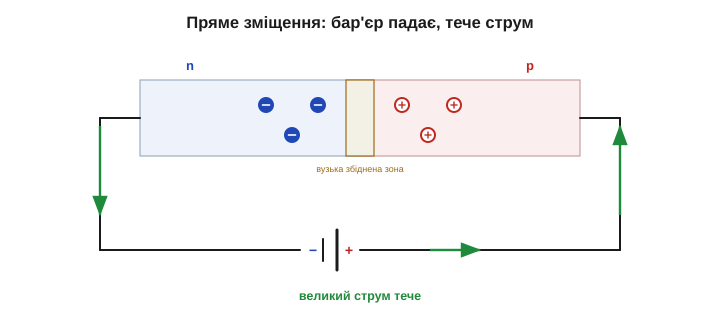
*Рис. 2.5.4.1. Плюс джерела — до p, мінус — до n. Зовнішнє поле знижує бар'єр, носії насуваються на межу, збіднена область звужується. За напруги вище ≈0.7 В носії вільно переходять — тече великий струм.*

Ось звідки відоме правило «діод відкривається приблизно з 0.7 вольта»: саме стільки треба, щоб «збити» вбудований бар'єр кремнію. Нижче цього порогу діод майже не проводить, вище — проводить дедалі легше.

Уточнімо одразу: 0.7 В — це не «вмикач», що різко спрацьовує. Перехід відкривається **поступово**: трохи нижче порогу струм дуже малий, а далі наростає надзвичайно круто — щойно напруга підбирається до 0.7 В, він злітає вгору. Тому на позір і здається, ніби діод «вмикається» рівно там, хоча насправді це плавна, але дуже стрімка крива. Її точну форму намалюємо в [§2.5.5](diode-pn-junction.md).

> 🔧 **Навіщо це.** Цей поріг ≈0.7 В (для кремнію) — не дрібниця, а число, з яким інженер живе щодня: на відкритому кремнієвому діоді завжди «губиться» близько 0.7 В, і це треба враховувати в розрахунках (а в германієвого — близько 0.3 В). Кількісно ми розберемо це падіння в [§2.5.5](diode-pn-junction.md); поки досить запам'ятати: щоб діод відкрився, прямій напрузі треба здолати його бар'єр.

### Зворотне зміщення: замикаємо клапан

Тепер поміняймо полярність: **плюс** — до n, **мінус** — до p. Усе перевертається.

Зовнішнє поле тепер напрямлене **в той самий бік**, що й вбудоване, — отже, воно бар'єр **підвищує**. До того ж плюс на n-боці відтягує електрони **від** межі, а мінус на p-боці відтягує дірки теж від межі. Носії розбігаються від переходу — і збіднена область **розширюється**, стаючи ще «товстішою» ізолювальною прокладкою.

Дороги для основних носіїв через перехід немає — струм практично **не тече**. Лишається хіба що крихітний «витік»: нечисленні неосновні носії (теплові пари з §2.5.1) все ж дрейфують через перехід, даючи мікроскопічний зворотний струм — мікроампери або менше. Практично — клапан замкнено.

Що більша зворотна напруга, то ширша збіднена область: майже вся прикладена напруга падає на цій ізолювальній прокладці, тож вона мусить ширшати (приблизно як √U). Це пасивний електростатичний наслідок, а не активна саморегуляція — товщий «мур» сам по собі пробою не відвертає. До певної межі, звісно: задерти зворотну напругу надто високо — і бар'єр кінець кінцем «прорве», але це вже історія [§2.5.5](diode-pn-junction.md). Поки що тримаймо в голові: у зворотному напрямку діод тримає, пропускаючи лише мізерний витік.


*Рис. 2.5.4.2. Плюс — до n, мінус — до p. Зовнішнє поле додається до вбудованого, бар'єр росте, носії відступають від межі, збіднена область ширшає. Шляху для струму немає — тече лише мізерний витік неосновних носіїв.*

Зауважмо цікаве: той самий витік **росте з нагріванням** — бо тепло народжує більше неосновних носіїв (§2.5.1). Тому розігрітий діод «тримає» зворотну напругу трохи гірше, ніж холодний; на практиці це дрібниця, але саме звідси й тягнеться чутливість напівпровідників до температури. Та для звичайної роботи цей витік такий малий, що його сміливо вважають нулем: у зворотному напрямку діод — практично розрив у колі.

### Бар'єр угору-вниз: одна картина

Найкоротше всю суть видно на «пагорбі» бар'єра. У спокої він має певну висоту (≈0.7 В). Пряме зміщення **знижує** пагорб — носіям легко перевалити, тече струм. Зворотне — **підвищує** пагорб ще дужче, і перейти його не може майже ніхто.

Уявімо носії кульками, що котяться до пагорба. У спокої перевалити його вдається одиницям. Пряме зміщення ніби «зрізає» пагорб — і кульки масово перекочуються на той бік. Зворотне навпаки — насипає його ще вище, і не долітає вже ніхто. Помітьте й красу симетрії: те саме джерело, лише перевернуте, дає протилежні наслідки — бо воно або **проти** вбудованого поля, або **вздовж** нього. Один компонент, дві поведінки, а перемикає між ними сам знак напруги — у цьому й уся магія діода.

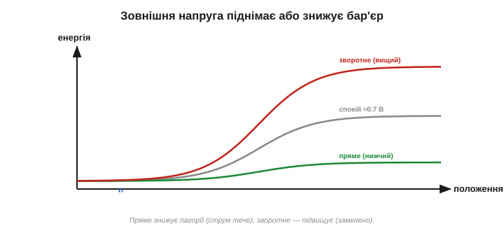
*Рис. 2.5.4.3. Той самий перехід у трьох станах. У спокої — бар'єр ≈0.7 В. Пряме зміщення знижує його (носії переходять — струм тече). Зворотне підвищує (перехід замкнено). Уся робота діода — це керування висотою цього пагорба.*

### Клапан: однобічність нарешті пояснена

Зведімо докупи. **Пряме** зміщення (плюс до p) відкриває діод — струм тече. **Зворотне** (плюс до n) замикає — струму немає. Це і є той **однобічний клапан**, що його Браун уперше помітив у галеніті, а Ол пояснив через PN-перехід: тепер ми знаємо, *чому* камінь пропускає струм лише в один бік.

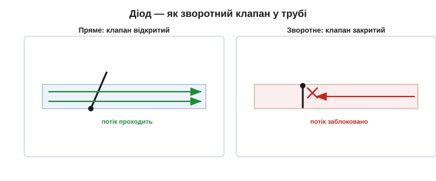
*Рис. 2.5.4.4. Водопровідна аналогія: зворотний клапан. Потік «у дозволений» бік відкриває стулку й проходить вільно; потік у зворотний бік притискає стулку до сідла й не проходить. Діод робить те саме зі струмом.*

Класична аналогія — **зворотний клапан** (як у водопроводі чи в насосі): тисни в дозволений бік — стулка відхиляється, рідина тече; тисни у зворотний — стулка притискається до сідла й перекриває потік. Діод поводиться точнісінько так само, тільки з електричним струмом замість води. Згодяться й інші образи: турнікет у метро (у дозволений бік провертається й пропускає, штовхни назад — заклинить) або двері, що відчиняються лише в один бік. Спільне в усіх одне — **несиметрія**: легко туди, неможливо назад.

### Анод, катод і символ

У діода два виводи мають власні назви. Вивід від **p**-області — **анод** (*anode*), від **n**-області — **катод** (*cathode*). Пряме зміщення — це коли на анод подано **плюс** (а на катод мінус); тоді струм тече від анода до катода крізь діод. Зворотне — навпаки.

Куди саме тече струм усередині відкритого діода? Умовний (додатний) струм — від анода (p) до катода (n), у напрямку трикутника символу. Усередині його несуть **обидва** типи носіїв: дірки рухаються від анода до межі, електрони — від катода до межі, і обидва потоки складаються в один струм ([§2.5.2](diode-pn-junction.md)). А в зовнішньому колі струм, як завжди, замикається через джерело. Тому, читаючи схему, досить глянути на трикутник: він показує, куди діод пускає струм.

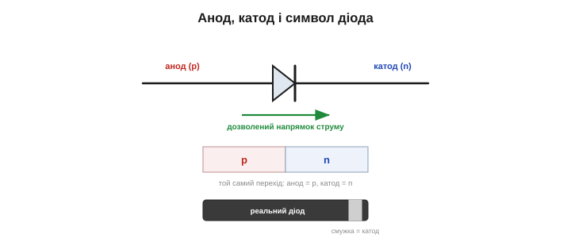
*Рис. 2.5.4.5. Символ діода — трикутник, що впирається в риску. Трикутник (анод, p-бік) указує **дозволений** напрямок струму — до риски (катод, n-бік). На реальному діоді катод позначено смужкою на корпусі. Струм тече лише в напрямку трикутника.*

Символ діода легко запам'ятати: трикутник — це наче стрілка, що показує **дозволений** напрямок струму (від анода до катода), а риска на вістрі — це катод, «стінка», далі якої у зворотний бік струм не йде. На реальному діоді катод майже завжди помічено **смужкою** на корпусі — щоб не переплутати, яким боком ставити. До речі, саме тому в схемах діод малюють із виразним «вістрям»: навіть не підписуючи виводів, видно, куди він пускає струм. Звикніть «читати» цей трикутник як стрілку-дороговказ — і півсхеми ставатимуть зрозумілими з першого погляду.

> 🔧 **Навіщо це.** Переплутати анод і катод — найчастіша помилка початківця: діод, поставлений «навпаки», просто не пропустить струм (а в схемі захисту — навпаки, пропустить те, від чого мав боронити). Тому смужку на корпусі шукають завжди: вона позначає катод, бік, куди вказує вістря символу. Запрацює діод лише тоді, коли плюс кола «дивиться» в анод.

Чому ця однобічність така цінна? Бо нею можна **впорядкувати** струм. Пропускаючи лише одну півхвилю змінного сигналу, діод перетворює змінний струм на пульсуючий постійний — це **випрямлення**, головне застосування діода ([§2.5.6](diode-pn-junction.md)). А поставлений на сторожі, він пропускає живлення лише «правильною» полярністю й боронить схему від переплутаних батарейок чи від викидів котушки ([§2.5.9](diode-pn-junction.md)). Усе це — пряме використання того, що ми щойно розібрали: відкрито в один бік, замкнено в інший.

### Підсумок і що далі

Отже, діод — це керований бар'єром клапан:

```
пряме зміщення  (+ на анод/p):  бар'єр падає,  збіднена зона вужчає  → струм ТЕЧЕ
зворотне        (+ на катод/n): бар'єр росте,  збіднена зона ширшає  → струму НЕМА
```

За цими двома рядками — уся суть напівпровідникового клапана. Зверніть увагу: діод **не** має окремої «команди ввімкнути/вимкнути» — ним керує сам напрямок прикладеної напруги. Це пасивний, але по-своєму розумний елемент: він автоматично пропускає «своє» й відсікає «чуже». Саме за це його й цінують — жодного керувального сигналу, а поведінка точно передбачувана.

Ми описали клапан **якісно** — як він відкривається й замикається. Лишилося зробити це **кількісно**: накреслити вольт-амперну характеристику (ВАХ) діода, точно побачити те падіння ≈0.7 В і з'ясувати, що буде, якщо зворотну напругу нарощувати дедалі більше (чи витримає бар'єр?). Адже досі ми мовчки припускали, що в зворотному напрямку діод тримає **завжди**, — а це, як побачимо, правда лише до певної межі. Цим і займеться наступна тема.

> ▶️ Далі: [§2.5.5 ВАХ діода: пряме падіння й пробій (~0.7 В)](diode-pn-junction.md)

---

## 2.5.5 ВАХ діода: пряме падіння й пробій

[§2.5.4](diode-pn-junction.md) описав клапан **якісно**: пряма напруга відкриває, зворотна замикає. Тепер зробімо це **точно**. Усю поведінку діода вміщує одна-єдина крива — **вольт-амперна характеристика** (ВАХ, *I–V characteristic*): графік струму крізь діод залежно від напруги на ньому. Навчившись її читати, ви знатимете про діод усе потрібне на практиці.

### Що таке ВАХ

Намалюймо осі: по горизонталі — напруга **U** на діоді, по вертикалі — струм **I** крізь нього. У звичайного резистора така крива — пряма лінія через нуль (закон Ома, [§1.3.2](../../block-1-circuits-physics/resistance-power-heat/resistance-power-heat.md)): удвічі більша напруга — удвічі більший струм. А от у діода вона **геть не пряма** — і саме ця кривина й робить його корисним.

Як таку криву отримують? Беруть діод, подають різну напругу й щоразу міряють струм — точка за точкою. По суті, ВАХ — це «паспорт» компонента: глянувши на неї, видно і поріг відкривання, і наскільки круто росте струм, і де настає пробій. У резистора цей паспорт нудний (пряма лінія), а в діода — промовистий, з колінами й зламами.

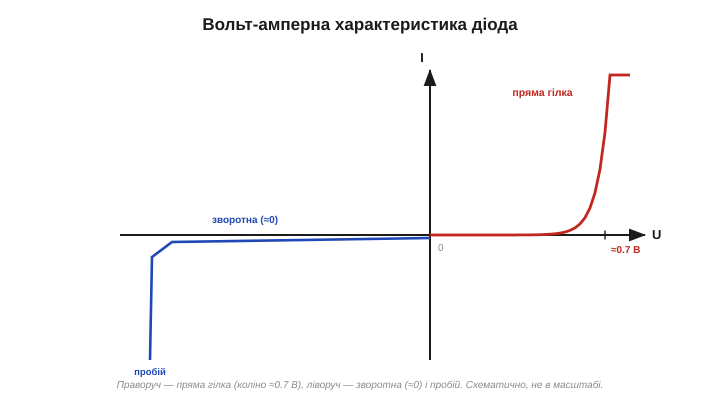
*Рис. 2.5.5.1. Вольт-амперна характеристика діода. Праворуч (пряма напруга) струм майже нульовий до «коліна» ≈0.7 В, а далі стрімко злітає. Ліворуч (зворотна) — лише крихітний витік, аж до напруги пробою, де струм раптово зростає. Зовсім не схоже на пряму лінію резистора.*

### Пряма гілка: коліно ≈0.7 В

Рухаймося вправо, нарощуючи пряму напругу. Спершу — майже нічого: до ~0.5 В струм мізерний (бар'єр §2.5.3 ще не здолано). Потім настає **коліно** (*knee*) — десь біля 0.6–0.7 В для кремнію — і струм починає рости **дуже круто**: ще трохи напруги, і він злітає вгору майже вертикально.

Наслідок цієї крутизни напрочуд зручний: щойно діод відкрито, він «тримає» на собі приблизно **0.7 В** майже незалежно від того, який струм крізь нього тече. Цю напругу звуть **прямим падінням** (*forward voltage*, U_F): на будь-якому відкритому кремнієвому діоді ви виміряєте близько 0.7 В.

Чому крива саме така? Її описує формула Шоклі — струм росте **експоненційно** з напругою:

```
I = Is · (e^(U / (n·UT)) − 1)
```

де Is — крихітний зворотний струм, UT ≈ 26 мВ (тепловий потенціал за кімнатної температури), n — коефіцієнт біля одиниці. Не варто це заучувати — важлива сама **форма**: експонента. Зручне правило: кожні додаткові ~60 мВ прямої напруги збільшують струм приблизно **вдесятеро**. Ось чому коліно таке різке: трохи додав напруги — струм стрибнув на порядок.

> 🧮 **Математична вставка:** [рівняння Шоклі — звідки експонента й чому «0.7 В» не константа](math-shockley-equation.md). Виводимо ВАХ із больцманівського хвоста над бар'єром, з'ясовуємо, звідки тепловий потенціал 26 мВ і правило «60 мВ на декаду», і розплутуємо парадокс температури: чому падіння тане −2 мВ/°C, хоча головна стала формули з нагрівом якраз росте.

Звідси й головний практичний наслідок: на крутій ділянці напруга на діоді майже не залежить від струму. Збільшите струм удесятеро — напруга підросте лише на ті самі ~60 мВ. Тому й кажуть просто «0.7 В», хоча точне значення трохи плаває (≈0.6 В у маленьких сигнальних діодів, до ~1 В у потужних на великому струмі). Часом коліно малюють як гострий злам, та насправді воно **плавне** — просто дуже круте. Ця майже-сталість напруги, до речі, робить діод грубеньким джерелом опорної напруги. Для відчуття: від 1 мА до 100 мА пряме падіння типового діода зросте лише з ~0.6 до ~0.75 В — мізер проти стократної зміни струму. А оскільки кожен діод «з'їдає» своє падіння, **послідовні** діоди їх додають: два кремнієві дадуть ≈1.4 В, три ≈2.1 В — цим інколи й користуються, коли треба груба опорна напруга, кратна 0.7 В.

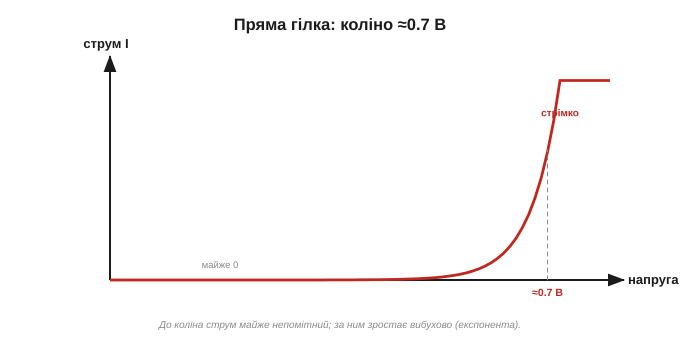
*Рис. 2.5.5.2. Збільшений вигляд прямої гілки. До ≈0.7 В струм майже непомітний, біля коліна різко зростає. Тому відкритий кремнієвий діод «сидить» на ≈0.7 В у широкому діапазоні струмів — це і є пряме падіння U_F.*

### Різні матеріали — різне коліно

Висота коліна залежить від матеріалу — а саме від його енергетичної щілини ([§2.5.1](diode-pn-junction.md)), що задає бар'єр ([§2.5.3](diode-pn-junction.md)). У германію коліно нижче (≈0.3 В), у кремнію — ≈0.7 В, а у світлодіодів — узагалі високе (≈1.8–3.3 В, залежно від кольору; докладно в [§2.5.7](diode-pn-junction.md)).


*Рис. 2.5.5.3. Пряма гілка для різних діодів. Германій відкривається вже з ≈0.3 В, кремній — з ≈0.7 В, світлодіод — аж із ≈2 В і вище. Що ширша енергетична щілина матеріалу, то правіше коліно.*

Чому світлодіод вимагає аж 2 В і більше? Бо кожному носієві, що долає його ширшу щілину, треба більше енергії — і ця енергія потім вилітає квантом світла (звідси й колір: синій світлодіод має вищу щілину й вище коліно, ніж червоний). Докладно — у [§2.5.7](diode-pn-junction.md). А германій із його низьким коліном начебто вигідніший — та через більший витік і гіршу теплостійкість ([§2.5.1](diode-pn-junction.md)) у більшості схем переміг саме кремній зі своїми зручними 0.7 В.

### Зворотна гілка й пробій

Тепер уліво — зворотна напруга. Тут, як ми знаємо, струму майже немає: лише крихітний витік неосновних носіїв ([§2.5.4](diode-pn-junction.md)), що тримається майже сталим (мікро- чи наноампери). Крива йде ледь нижче нуля, майже впритул до осі.

Та якщо зворотну напругу нарощувати далі й далі, настає драматичний момент — **пробій** (*breakdown*): на певній напрузі струм раптово **підскакує**, ніби бар'єр нарешті «прорвало». Це відбувається двома способами. **Лавинний** пробій: сильне поле так розганяє нечисленні носії, що ті, врізаючись в атоми, вибивають нові, ті — ще нові, і струм наростає лавиною. (Назва дуже точна: один носій вибиває кількох, ті — ще більше, і за мить через перехід суне ціла «снігова куля» носіїв.) **Зенерівський**: у дуже тонких (сильнолегованих) переходах поле буквально «вириває» електрони із зв'язків. Обидва дають той самий результат — різке зростання зворотного струму.

Чим лавина небезпечна? Великий струм на високій напрузі — це велика потужність, що миттю перегріває крихітний перехід; якщо її нічим не обмежити, діод просто згоряє. Тому виробник указує гранично допустиму **зворотну напругу** (часто десятки чи сотні вольтів), і нижче неї діод тримає надійно. Це, до речі, найчастіша «таємнича» причина смерті діода в недбалій схемі — коротка зворотна перенапруга (скажімо, викид котушки, [§2.5.9](diode-pn-junction.md)) пробиває його. Парадокс у тому, що той самий пробій, приборканий і обмежений струмом, стає **корисним**: на ньому працює діод Зенера ([§2.5.8](diode-pn-junction.md)).

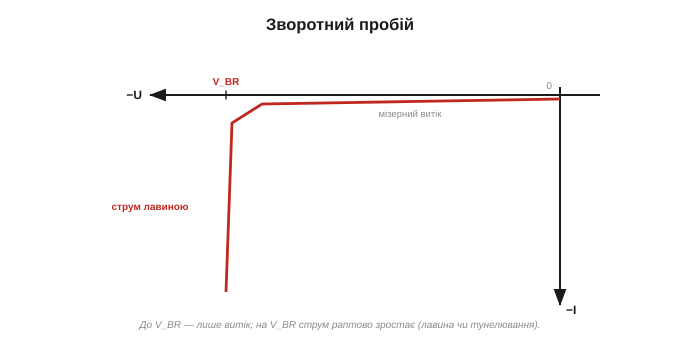
*Рис. 2.5.5.4. Зворотна гілка зблизька. До напруги пробою V_BR — лише мізерний витік. На V_BR струм раптово зростає (лавинний або зенерівський механізм). Для звичайного діода це небезпечно; для діода Зенера — робочий режим (§2.5.8).*

Для **звичайного** діода пробій зазвичай **згубний**: різкий струм перегріває кристал, і діод гине — якщо тільки струм не обмежити. Тому в кожного діода є паспортна **максимальна зворотна напруга**, нижче якої треба лишатися. А от спеціальні діоди — **Зенера** — навмисно роблять так, щоб працювати в пробої стабільно; це наша тема [§2.5.8](diode-pn-junction.md).

### Діод у розрахунках: модель «0.7 В»

На практиці експоненту рідко рахують точно. Найзручніша модель: відкритий кремнієвий діод — це просто **падіння 0.7 В**, наче маленька батарейка назустріч, яку струм мусить «переступити». Решту напруги бере на себе інша частина кола.

**Приклад. Через кремнієвий діод треба пропустити 10 мА від джерела 5 В. Який потрібен послідовний резистор?**
```
U_R = U_жив − U_діода = 5 − 0.7 = 4.3 В
R   = U_R / I = 4.3 / 0.010 = 430 Ом
```
Діод «з'їдає» 0.7 В, решта 4.3 В лягає на резистор, і той задає струм. (Від джерела 12 В той самий струм 10 мА вимагав би вже R = (12 − 0.7)/0.01 ≈ 1.1 кОм.) Зверніть увагу: **струм мусить обмежувати щось зовнішнє** — сам діод його не лімітує (його гілка майже вертикальна), тож без резистора струм злетів би до згубного.

Тут криється важлива зміна способу мислення проти резистора. У резисторі струм і напруга жорстко зв'язані (I = U/R), і елемент сам «вирішує» свій струм. Діод інакший: він нав'язує **напругу** (≈0.7 В), а **струм** йому диктує решта кола. Тому питання «який струм при 0.7 В?» саме по собі безглузде — відповідь дає лише повна схема. Звикнути до цього — півсправи в розумінні нелінійних елементів узагалі.

Помітьте, що ми скористалися найгрубішою моделлю — «діод = 0.7 В». Узагалі ж діод описують трьома рівнями точності. **Ідеальний**: досконалий клапан, 0 В на відкритому — годиться для швидких міркувань про напрям струму. **Зі сталим падінням**: відкритий діод = 0.7 В — наша робоча модель для розрахунків. **Реальна експонента**: коли треба максимальна точність (скажімо, у слабкосигнальних колах). Мудрість тут проста: бери найгрубішу модель, якої вистачає для задачі, і не ускладнюй дарма — ВАХ нікуди не дінеться, але рахувати по ній щоразу не доведеться.

На практиці пряме падіння легко перевірити мультиметром у режимі «прозвонки діода»: торкніться щупами — у прямому ввімкненні прилад покаже ~0.5–0.7 В (для кремнію), у зворотному — «обрив». Це найшвидший спосіб і знайти діод у схемі, і визначити його полярність, і переконатися, що він живий.

І ще одне, про що легко забути: на відкритому діоді не лише **падає** 0.7 В — на ньому ще й **розсіюється потужність** P = U_F · I (як на будь-якому елементі, [§1.3.5](../../block-1-circuits-physics/resistance-power-heat/resistance-power-heat.md)). За 0.7 В і 1 А це вже 0.7 Вт тепла — чималий діод відчутно гріється. Тому потужні випрямні діоди роблять великими й нерідко садять на радіатор.

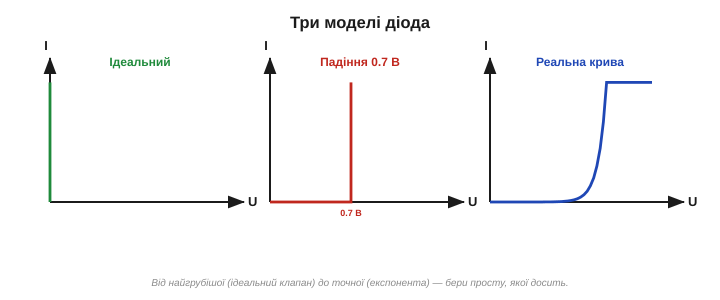
*Рис. 2.5.5.5. Три рівні точності. Ідеальний діод — досконалий клапан (0 В на відкритому). Модель «0.7 В» — відкритий діод дає стале падіння. Реальна ВАХ — плавна експонента. Інженер бере найпростішу модель, якої вистачає для задачі.*


*Рис. 2.5.5.6. Коло з прикладу: джерело 5 В, діод (падіння 0.7 В) і резистор 430 Ом. На діоді — 0.7 В, на резисторі — 4.3 В; резистор задає струм 10 мА. Без обмежувача струм був би небезпечним.*

> 🔧 **Навіщо це.** Два правила, що рятують діоди (і нерви). Перше: послідовно з діодом майже завжди ставлять щось, що **обмежує струм** (резистор, опір джерела чи навантаження) — інакше відкритий діод спалить себе. Друге: ніколи не перевищуйте паспортну **зворотну** напругу — інакше пробій. А модель «0.7 В» дозволяє швидко прикинути струми й напруги в голові, не чіпаючи експоненти.

### Трохи про температуру

Те «0.7 В» — не константа на віки: з нагріванням пряме падіння **зменшується** приблизно на 2 мВ на кожен градус, а зворотний витік — росте (більше теплових носіїв, [§2.5.1](diode-pn-junction.md)). На звичайних схемах це дрібниця, але в точних вимірюваннях чи на потужних діодах це враховують. А ще цей дрейф настільки стабільний і передбачуваний (−2 мВ/°C), що його обертають на користь: вимірявши пряме падіння каліброваного переходу, визначають температуру — простий і дешевий термометр, який ховається в багатьох мікросхемах і процесорах.

> ⚙️ **Практична вставка:** [діод як термометр](proj-diode-thermometer.md). Як виміряти температуру падінням: навіщо сталий струм, як калібрувати двома точками (лід і окріп), що псує точність — і трюк ΔV_BE, яким міряють абсолютну температуру **без** калібрування (Is скорочується при відніманні), той самий, що сидить у термодавачі кожного процесора.

Зведімо ВАХ до трьох ділянок, які варто впізнавати з першого погляду:

```
зворотна (U < 0):           ≈0 струму         → діод ЗАМКНЕНО
пряма до коліна (0…0.7 В):  ще майже 0         → ще НЕ відкрився
пряма за коліном (>0.7 В):  струм злітає       → діод ВІДКРИТО, на ньому ≈0.7 В
(дуже велика зворотна):     пробій             → струм лавиною (небезпечно)
```

Уся практична робота з діодом — це, по суті, визначити, у якій із цих ділянок він зараз перебуває.

### Що далі

Тепер ми знаємо діод повністю: однобічний клапан з падінням ≈0.7 В уперед, майже розрив назад і пробоєм на великій зворотній напрузі. Лишилося побачити його в роботі — і почнемо з найголовнішого застосування, заради якого діоди й виробляють мільярдами: перетворення змінного струму на постійний, тобто **випрямлення**. Саме випрямлячі — у кожному блоці живлення — поглинають більшість діодів, що їх випускає світ; із них і почнемо наступну тему.

> ▶️ Далі: [§2.5.6 Випрямлення: змінний → постійний](diode-pn-junction.md)

---

## 2.5.6 Випрямлення: змінний → постійний

Ось і головне застосування, заради якого діоди виробляють мільярдами. З розетки приходить **змінний струм** (*AC*) — він 50 разів на секунду здійснює повне коливання, тобто струм міняє напрямок 100 разів за секунду ([Розділ 2.3](../reactance-resonance/reactance-resonance.md)). А майже вся електроніка — мікросхеми, світлодіоди, заряджання акумулятора — живиться **постійним струмом** (*DC*), що тече стало в один бік. Хтось має «випрямити» одне в інше. І однобічний клапан, який ми щойно розібрали, — саме той, хто це робить. Перетворення змінного струму на постійний зветься **випрямленням** (*rectification*), а схема — **випрямлячем**.

Чому ж із розетки йде саме змінний? Бо його легко **трансформувати** — підвищувати для передачі на відстань і знижувати для споживача ([§2.2.6](../inductor/inductor.md)); на цьому свого часу й виграла «війна струмів». Та електроніці змінний незручний, і слово «випрямити» тут майже буквальне: зробити гойдливий струм **прямим**, однонапрямленим.

### Проблема: змінний проти постійного

Нагадаймо різницю наочно. Постійний струм — як рівна течія річки в один бік: напруга стала, полярність незмінна. Змінний — як хвилі припливу-відпливу: напруга гойдається вгору-вниз, періодично змінюючи знак. Подати таку «гойданку» просто на мікросхему — все одно що напувати когось із крана, де вода то ллється, то тече назад: ні нап'єшся, ні наллєш. Випрямляч — це той, хто робить із двобічного потоку однобічний, придатний до вжитку. У наших мережах змінна напруга має форму синусоїди й міняє напрямок 100 разів за секунду (50 повних коливань).

Чому електроніці потрібен саме постійний? Бо логіка, пам'ять, підсилювачі працюють від **сталих** опорних рівнів: транзистор має знати, де «високо», а де «низько», світлодіод — світити рівно, а не блимати. Напруга, що сто разів на секунду провалюється до нуля й міняє знак, для такого не годиться. Тож майже кожен пристрій починається з перетворення «розеткового» змінного на свій рівний постійний.

Цікаво, що випрямляли струм і до кремнію: перші випрямлячі робили на оксиді міді та селені — громіздкі пластини, що теж пропускали струм переважно в один бік (далекі родичі «котячого вуса» з історії розділу). Кремнієвий діод витіснив їх, бо менший, дешевший і витриваліший. Та задача лишалася незмінною, відколи з'явився змінний струм: перетворити його на постійний.

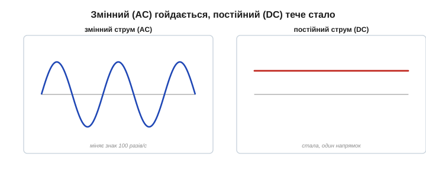
*Рис. 2.5.6.1. Змінний струм (AC) періодично змінює знак — синусоїда вгору-вниз. Постійний (DC) тече стало в один бік — рівна лінія. Завдання випрямляча: зробити з першого щось схоже на друге.*

### Однопівперіодний випрямляч

Найпростіше, що можна зробити, — поставити **один діод** послідовно з навантаженням. Поки напруга «правильної» полярності, діод відкритий і пропускає струм; коли вона змінює знак — діод замикається й не пропускає нічого. На виході лишаються тільки **додатні горби** синусоїди, а від'ємні півхвилі зрізано.

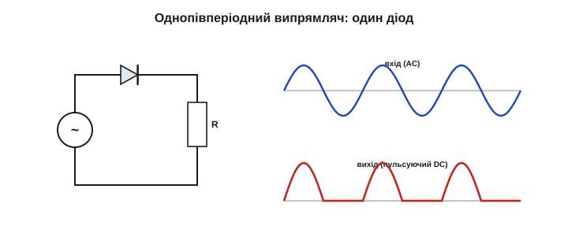
*Рис. 2.5.6.2. Один діод пропускає лише додатні півхвилі, від'ємні відсікає. На виході — пульсуючий струм одного напрямку (вже «постійний» за знаком, але дуже нерівний, з провалами).*

Це вже **постійний** струм у тому сенсі, що тече лише в один бік. Але кепський: половину часу на виході **нічого немає** (поки триває зрізана півхвиля), та й самі горби пульсують від нуля до максимуму. До того ж кожен горб на ~0.7 В нижчий за вхідний — діод бере своє падіння ([§2.5.5](diode-pn-junction.md)). Для багатьох задач цього замало.

Подивімося на саме коло: діод послідовно з навантаженням (скажімо, резистором). На додатній півхвилі діод відкритий — майже вся напруга (мінус його 0.7 В) лягає на навантаження; на від'ємній діод замкнено — на навантаженні нуль. Тож пік на виході — це пік входу мінус ~0.7 В, а частота пульсацій дорівнює частоті мережі (50 разів на секунду). Попри грубість, однопівперіодну схему таки застосовують там, де треба дешево й невибагливо, а навантаження мале. Та коли потрібна серйозна потужність чи рівна напруга, такий випрямляч надто марнотратний — половина енергії гине намарне. А ще пульсації від нуля до піка означають, що живлення «мигтить»: світлодіод на такому випрямлячі без згладжування помітно блимав би 50 разів на секунду. Тому однопівперіодну схему майже завжди доповнюють конденсатором — або одразу беруть повний міст.

### Повний міст: використати обидві півхвилі

Шкода марнувати половину енергії. Розумніший спосіб — **мостовий випрямляч** (*bridge rectifier*): чотири діоди, з'єднані ромбом. Хитрість у тому, що за кожної півхвилі струм знаходить **свою** пару діодів і проходить крізь навантаження **в тому самому напрямку** — байдуже, який знак на вході. Від'ємну півхвилю вже не викидають, а «перевертають» і теж пускають у діло.

Простежмо шлях струму. За додатної півхвилі відкривається одна пара діодів (по діагоналі ромба) і веде струм від джерела крізь навантаження та назад. За від'ємної джерело «перевернулося» — відкривається **інша** пара (друга діагональ); але влаштовано міст так хитро, що крізь навантаження струм і цього разу тече **в той самий бік**. Хоч джерело й міняє полярність, навантаження щоразу дістає струм однакового напрямку — у цьому вся ідея моста.

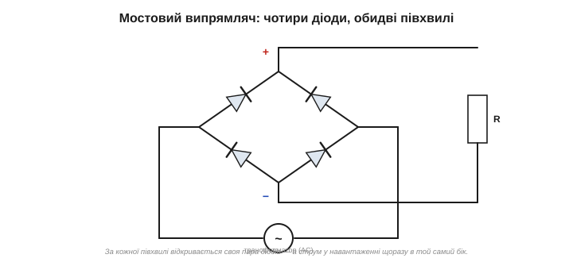
*Рис. 2.5.6.3. Міст із чотирьох діодів. За додатної півхвилі струм іде однією парою діодів, за від'ємної — іншою, але крізь навантаження — щоразу в той самий бік. Жодна півхвиля не пропадає.*

На виході моста — суцільна низка додатних горбів **без провалів**: тепер працюють обидві півхвилі, тож горбів удвічі більше, ніж у однопівперіодного. (Існує й простіший варіант на двох діодах — з трансформатором, що має середній відвід; але міст не вимагає особливого трансформатора, тому й поширеніший.) У тому варіанті трансформатор із середнім відводом дає дві протифазні половинки, і кожну випрямляє свій діод — повне випрямлення лише на двох діодах і з одним падінням 0.7 В замість 1.4. Платня — складніший трансформатор. Тож інженер обирає між «простіший трансформатор, чотири діоди» (міст) і «простіші діоди, хитріший трансформатор» (середній відвід). Платня за це — у мості струм щоразу проходить крізь **два** діоди, тож губиться ~1.4 В замість 0.7. Зате пульсації тепер удвічі частіші — 100 разів на секунду замість 50: горбів більше й вони щільніші. А чим частіші пульсації, тим легше їх згладити — про це зараз.

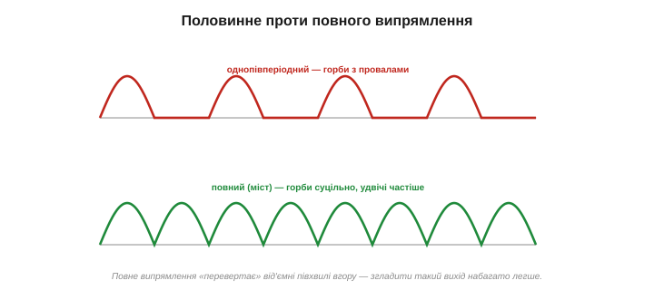
*Рис. 2.5.6.4. Порівняння. Однопівперіодний випрямляч лишає горби з провалами (половина часу — нуль). Повний (мостовий) «перевертає» від'ємні півхвилі вгору — горби йдуть суцільно, удвічі частіше. Згладити таке набагато легше.*

> 🔌 **Компонентна вставка:** [діодний міст як компонент](comp-bridge-rectifier.md). Чотири діоди мосту майже завжди беруть однією готовою збіркою з виводами **~ ~ + −**: як її підключити, чому вона завжди «з'їдає» два падіння (1.4 В і подвійне тепло, рятує Шотткі-міст), що таке пусковий кидок струму — і як обрати за трьома числами.

### Згладжування конденсатором

Навіть повне випрямлення дає не рівну лінію, а пульсації — низку горбів. Як зробити з них рівну напругу? Згадаймо [§2.1.6](../capacitor/capacitor.md): поставмо паралельно навантаженню **конденсатор**. На вершині кожного горба він заряджається до піку, а в проміжку, коли напруга просідає, **віддає** запас у навантаження, підтримуючи його. Конденсатор працює як невеликий резервуар, що наповнюється на піках і потроху витрачається в западинах — і провали між горбами **заповнюються**.

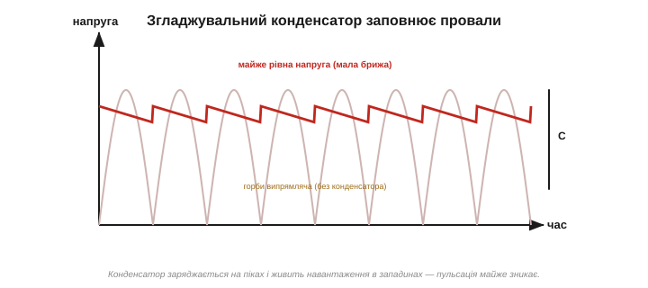
*Рис. 2.5.6.5. Конденсатор паралельно навантаженню заряджається на піках і розряджається в западинах, заповнюючи провали. Замість горбів виходить майже рівна постійна напруга з невеликою «брижею» (пульсацією).*

Що залишається — невелика **пульсація** (*ripple*), брижа поверх постійної напруги. Її тим менше, чим більший конденсатор і чим легше навантаження (повільніше розряджається). За суттю це той самий **фільтр низьких частот** ([§2.3.7](../reactance-resonance/reactance-resonance.md)): він пропускає постійну складову й приглушує змінну «брижу». Ось чому повне випрямлення зручніше — його пульсації частіші (удвічі), і той самий конденсатор згладжує їх краще.

Розгляньмо це в часі. Коли горб напруги наростає, діоди заряджають конденсатор до самого піку. Щойно горб пішов на спад, діоди замикаються (на вході вже нижче, ніж на зарядженому конденсаторі), і навантаження живиться **з конденсатора**, що повільно розряджається, — напруга трохи просідає. Наступний горб знову підзаряджає його до піку — і так по колу. Чим більша ємність і чим менший струм навантаження, тим повільніше просідання й тим менша брижа (грубо, пульсація тим менша, чим більший добуток «частота × ємність»). Є й зворотний бік: на кожному піку конденсатор хапає короткий, але потужний **кидок струму**, заряджаючись, — і потужні випрямлячі мусять цей кидок витримувати. Грубо відчути можна так: що більший струм тягне навантаження, то швидше конденсатор просідає між горбами — і то більший потрібен конденсатор, щоб брижа лишалася малою. Тому в потужних блоках живлення згладжувальні конденсатори такі великі — тисячі мікрофарад.

> 🧮 **Математична вставка:** [пульсації після випрямляча — як вибрати конденсатор](math-ripple-calc.md). Виводимо формулу U_пульс ≈ I/(f·C) з «заряд = струм × час», рахуємо ємність під задану брижу на прикладі, бачимо в числах перевагу моста — і розбираємо дві пастки: кидок струму заряду й внесок ESR.

> 🔧 **Навіщо це.** Саме цей «резервуарний» конденсатор ви бачите великим циліндром одразу після випрямляча в кожному блоці живлення. Він — між пульсуючим виходом діодів і вашою схемою, і саме він перетворює низку горбів на придатну до вжитку постійну напругу. Замалий конденсатор — і пристрій «гуде» на 50/100 Гц (недозгладжена брижа), завеликий — марна трата місця й грошей.

### Уся ланка живлення

Складімо все докупи — і дістанемо серце майже будь-якого блока живлення («зарядки»):

```
розетка (AC) → [трансформатор: знизити напругу] → [міст: випрямити] → [конденсатор: згладити] → майже DC
```

Трансформатор ([§2.2.6](../inductor/inductor.md)) знижує небезпечні 230 В до потрібних кільканадцяти; міст із діодів випрямляє; конденсатор згладжує. Саме цю послідовність ви тримали в руках безліч разів: усередині майже кожної «зарядки» чи адаптера живлення сидить така сама ланка (у сучасних — ще хитріша, імпульсна, але з тими самими діодами-випрямлячами всередині). На виході — постійна напруга з невеликою пульсацією, придатна живити електроніку. (Далі її зазвичай ще «вирівнює» стабілізатор — але це вже інша тема; найпростіший стабілізатор, на діоді Зенера, чекає в [§2.5.8](diode-pn-junction.md).)

Прикинімо числа. Хай трансформатор дає 12 В (це **діюче** значення синусоїди); її **пік** вищий — близько 17 В (пік синусоїди приблизно в 1.4 раза більший за діюче). Міст відніме два діодні падіння (~1.4 В), а конденсатор утримає напругу близько піка — і на виході дістанемо приблизно 15–16 В постійних. Ось чому з «12-вольтового» трансформатора виходить помітно більше за 12 В сталих: згладжений конденсатор тримається саме **піка**, а не діючого значення.

Один нюанс: коли випрямляють **низьку** напругу (кілька вольтів), те падіння 0.7 В (а в мості — 1.4 В) стає відчутною часткою — губиться помітний шматок. Тут у пригоді діоди **Шотткі** з меншим падінням (~0.3 В); про них — у [§2.5.8](diode-pn-junction.md).

> 🔧 **Навіщо це.** Добираючи діод для випрямляча, дивляться на два паспортні числа ([§2.5.5](diode-pn-junction.md)): максимальний **прямий струм** (скільки витримає, не перегрівшись) і максимальну **зворотну напругу** (щоб не пробило на від'ємній півхвилі). Для мережі беруть із запасом за обома — звідси й популярні «1N400x» на 1 А й до 1000 В. Випрямні діоди зазвичай більші за сигнальні: мусять проводити чималий струм і розсіювати тепло.

### Не лише живлення

Випрямлення — головне, але не єдине застосування однобічності. Тим самим «зрізанням» половини сигналу радіоприймач **виділяє звук** із модульованої хвилі — це той самий кристалічний детектор з історії розділу, тепер зрозумілий до кінця: діод відсікає одну полярність, а конденсатор згладжує решту в звукову обвідну. Поставлений послідовно з живленням, діод **боронить** схему від переплутаної полярності батарейки — пропустить струм лише «правильним» боком ([§2.5.9](diode-pn-junction.md)). А «піковий детектор» (діод плюс конденсатор) запам'ятовує найвищий рівень сигналу. Скрізь — та сама ідея: пропустити в один бік, відсікти в інший; випрямляч лише найгучніший представник цього сімейства, що живе з простого факту: діод пускає струм лише в один бік.

Підсумуймо. Діод-клапан або відсікає «неправильну» півхвилю (однопівперіодний), або «перевертає» її (мостовий), а конденсатор згладжує горби в рівну напругу. Ця трійця — **трансформатор, міст, конденсатор** — і є серце майже кожного блока живлення; усе інше лише вдосконалює результат. І хоч сучасні імпульсні блоки влаштовані хитріше, діод-випрямляч лишається в самому їхньому осерді.

### Що далі

Ми використали однобічність діода, щоб приборкати енергію — випрямити струм. Та PN-перехід уміє ще дещо несподіване: випромінювати й відчувати **світло**. Наступна тема — про діоди, що світяться (світлодіод) і бачать (фотодіод). І саме там на сцену вийде призабутий першовідкривач, який помітив світло кристала майже за пів століття до масового світлодіода.

> ▶️ Далі: [§2.5.7 Світлодіод і фотодіод](diode-pn-junction.md)

---

## 2.5.7 Світлодіод і фотодіод

Досі діод мав справу зі струмом. Та PN-перехід приховує ще два таланти: він уміє перетворювати струм на **світло** (світлодіод) і світло на струм (фотодіод). Обидва — це той самий перехід, лише вжитий у протилежних напрямках. Саме тут «вистрелює» відкладена обіцянка з [§2.5.3](diode-pn-junction.md) — що при рекомбінації виділяється енергія, — і саме тут випадкове відкриття Ола (світло на кремнії дає струм) стає корисним приладом. Парадокс у тому, що ці два прилади — найвидиміша й найбуденніша електроніка довкола (кожен індикатор, екран, пульт, сонячна панель), а живуть вони рівно з тієї фізики переходу, яку ми вже знаємо.

### Світлодіод: струм → світло

Увімкнімо перехід у прямому напрямку ([§2.5.4](diode-pn-junction.md)). Електрони й дірки сходяться до межі й **рекомбінують** ([§2.5.3](diode-pn-junction.md)) — і щоразу виділяється порція енергії. У кремнію вона майже вся йде в тепло. А от у деяких інших напівпровідниках (сполуках на кшталт арсеніду галію GaAs чи нітриду галію GaN) ця енергія вилітає **квантом світла** — фотоном. Перехід світиться. Це і є **світлодіод** (*LED, light-emitting diode*).

Наскільки ощадно? У доброму світлодіоді чи не кожна рекомбінація дає фотон, тож він обертає струм на світло куди ефективніше за лампу розжарення, яка спершу все розігріває. Саме тому світлодіодне освітлення витіснило і лампи розжарення, і люмінесцентні: те саме світло — за частку енергії. Увесь фокус — у виборі матеріалу, де рекомбінація «віддає перевагу» світлу, а не теплу.

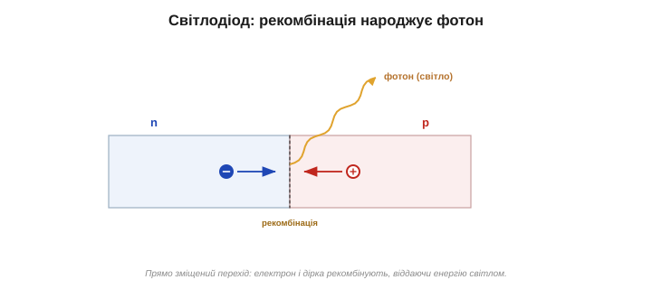
*Рис. 2.5.7.1. У прямо зміщеному переході електрон зустрічає дірку й рекомбінує. У світлодіодних матеріалах вивільнена енергія виходить не теплом, а фотоном — переход випромінює світло. Що більший струм, то більше рекомбінацій — то яскравіше світіння.*

Якого кольору буде світло? Енергія фотона дорівнює енергетичній щілині матеріалу ([§2.5.1](diode-pn-junction.md)): ширша щілина — енергійніший фотон — синіше світло. Червоний світлодіод має вужчу щілину, синій — ширшу. Звідси й та різниця в коліні ВАХ, яку ми бачили в [§2.5.5](diode-pn-junction.md): пряме падіння світлодіода тим вище, чим синіший колір — від ~1.8 В у червоного до ~3.3 В у синього й білого.

Найдовше не давався **синій**. Червоні та зелені світлодіоди навчилися робити ще в 1960–70-х, а яскравий синій — лише в 1990-х, коли троє японських учених — Акасакі, Амано й Накамура — приборкали нітрид галію (GaN). Це був прорив: маючи синій, додаванням люмінофора дістали **білий** світлодіод — і почалася революція в освітленні (Нобелівська премія з фізики 2014 року за синій світлодіод). Білий світлодіод вашої настільної лампи всередині — це синій кристал GaN під шаром жовтого люмінофора, що домішує бракуючі кольори в біле світло. А поза видимим діапазоном ті самі переходи дають **інфрачервоні** світлодіоди (саме вони блимають у пультах і давачах руху) і навіть ультрафіолетові — колір цілковито визначає щілина матеріалу, хоч би де вона лежала.

> 📜 **Історія до теми:** [блакитний світлодіод — двадцять років проти «це неможливо»](hist-blue-led.md). Чому синій — найенергійніша фарба — давався тридцять років, як дві стіни GaN (кристал і p-тип) пробили Акасакі й Амано в Нагої, а Накамура зробив світло яскравим і промисловим, гучний суд винахідника з компанією — і за що саме дали Нобель 2014 року всім трьом.

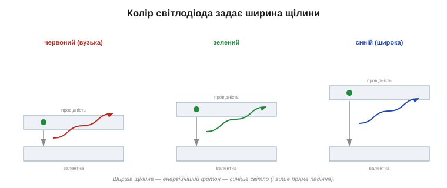
*Рис. 2.5.7.2. Колір світлодіода визначає ширина щілини матеріалу: вузька щілина — низькоенергійний фотон (червоний), широка — високоенергійний (синій). Тому й пряме падіння в синього світлодіода більше, ніж у червоного.*

> 🧮 **Математична вставка:** [фотон і заборонена зона — E = hf](math-photon-energy.md). Звідки в кольорі береться стала Планка, як одним діленням перевести колір у довжину хвилі (λ[нм] = 1240/E[еВ]) і назад, і чому пряме падіння світлодіода числом майже дорівнює енергії його фотона в електронвольтах (q·U_F ≈ Eg).

А чому ж кремній не світиться? Через особливість його щілини («непряма» зона) енергія рекомбінації в ньому майже завжди йде в коливання ґратки, тобто в тепло, а не у фотон. Щоб дістати світло, потрібні особливі **прямозонні** сполуки. Тому світлодіоди роблять не з кремнію, а з арсеніду/нітриду галію та споріднених матеріалів. Грубо кажучи, у «прямозонному» матеріалі електронові легко віддати енергію одним фотоном, а в «непрямозонному» (як кремній) для цього мусять збігтися додаткові умови — тож енергія майже завжди розсіюється тремтінням ґратки. Звідси й розподіл ролей: кремній — для струму й логіки, сполуки галію — для світла.

### Світлодіод у схемі

Попри світіння, світлодіод — це звичайний діод: проводить лише в прямому напрямку, має своє падіння й вимагає **обмежувача струму** ([§2.5.5](diode-pn-junction.md)). Без послідовного резистора він спалахне й згорить — його гілка ВАХ така сама вертикальна, тож струм нічим не стримано.

**Приклад. Живимо червоний світлодіод (U_F = 2 В) струмом 10 мА від 5 В. Який резистор?**
```
U_R = U_жив − U_LED = 5 − 2 = 3 В
R   = U_R / I = 3 / 0.010 = 300 Ом
```
Решта напруги (3 В) лягає на резистор, і він задає струм 10 мА — безпечну яскравість.

А якби джерело мало 12 В? Тоді на резистор лягло б 10 В, і для тих самих 10 мА R = 10/0.01 = 1 кОм. Можна з'єднати кілька світлодіодів **послідовно** — їхні падіння додаються: три червоні (по 2 В) дадуть 6 В, і резистор рахують уже на решту. А от єднати їх **паралельно** під один резистор не варто: через розкид падінь струм поділиться нерівно, і один світитиме яскравіше, перетягуючи струм на себе.

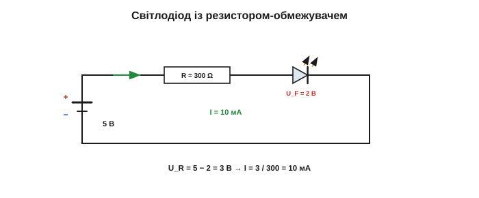
*Рис. 2.5.7.3. Світлодіод завжди вмикають послідовно з резистором, що обмежує струм. Символ — діод зі стрілками, що «вилітають» (випромінювання). Коротша ніжка (або зріз на корпусі) — катод; підключати треба в прямому напрямку.*

> 📜 **Історія до теми:** [Олег Лосєв і забутий світлодіод](hist-led.md) — як ще в 1920-х побачили світіння кристала, а світлодіод «винайшли» вдруге через десятиліття.

> 🔧 **Навіщо це.** Світлодіоди — усюди: індикатори на приладах, екрани й табло, підсвітка, освітлення, інфрачервоні випромінювачі в пультах. Три правила початківця: завжди ставити резистор-обмежувач; не плутати полярність (у зворотному світлодіод не світить, а від великої зворотної напруги гине); пам'ятати, що падіння залежить від кольору (червоний ~1.8 В, синій/білий ~3 В), тож резистор рахують саме під свій колір.

Яскравість світлодіода задає **струм** крізь нього: більше струму — яскравіше. Регулюють її або зміною струму, або, частіше, швидким **мерехтінням** — вмикаючи й вимикаючи світлодіод і міняючи частку «увімкненого» часу (широтно-імпульсне керування). Око усереднює миготіння в рівну яскравість — так працює регулювання підсвітки екранів і ліхтариків. До того ж світлодіод не має нитки, яка перегоряє, тож служить десятки тисяч годин — ще одна причина, чому він витіснив лампу розжарення.

> 🔌 **Компонентна вставка:** [світлодіоди на практиці — струм, колір, RGB і драйвери](comp-leds-practice.md). Який струм обрати (і чому не максимальний), звідки беруться білий (синій + люмінофор, колірна температура й CRI) та RGB (три кристали чи адресований «розумний» світлодіод), і коли резистора замало — потрібен драйвер струму.

> ⚙️ **Практична вставка:** [Charlieplexing](proj-charlieplexing.md). Спритний трюк, що обертає однобічність світлодіода на економію виводів: n ніжок мікроконтролера керують аж n·(n−1) світлодіодами завдяки трьом станам виводу (HIGH/LOW/Hi-Z) і швидкій розгортці. Улюблений прийом дешевих годинників і LED-кілець.

### Фотодіод: світло → струм

Тепер запустімо процес **назад**. Якщо на PN-перехід падає світло, фотон може розірвати зв'язок і народити пару електрон–дірка ([§2.5.1](diode-pn-junction.md)) — просто в збідненій області. А там панує вбудоване поле ([§2.5.3](diode-pn-junction.md)), яке миттю розтягує цю пару: електрон в один бік, дірку в інший. Виходить **струм**, породжений світлом. Це **фотодіод** (*photodiode*).

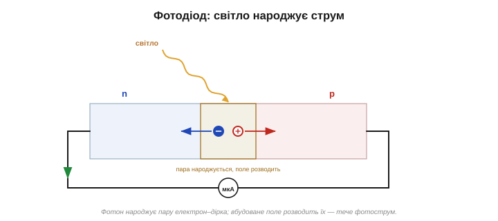
*Рис. 2.5.7.4. Дзеркало світлодіода. Фотон, поглинутий у збідненій області, народжує пару електрон–дірка; вбудоване поле розводить їх — виникає струм, пропорційний яскравості світла. Так перехід стає давачем світла.*

Фотодіод зазвичай вмикають у зворотному напрямку (або взагалі без зовнішньої напруги): струм крізь нього тоді **пропорційний освітленості** — що більше світла, то більший струм. Це готовий давач світла: від простих сенсорів освітлення до приймачів в інфрачервоних пультах і оптоволоконних лініях. І це рівно те, що випадково побачив Рассел Ол (історія розділу): світло на переході дає струм.

Працювати фотодіод може двояко. У **фотогальванічному** режимі — без зовнішньої напруги — він сам дає напругу під світлом, як крихітна сонячна батарея. У **фотопровідному** — зі зворотним зміщенням — він швидший і лінійніший, бо ширша збіднена зона ловить більше фотонів. Для швидких ліній зв'язку беруть саме другий: фотодіод устигає реагувати на спалахи світла мільярди разів за секунду — тому ним і приймають сигнал в оптоволокні.

Коли треба більше чутливості, замість фотодіода ставлять **фототранзистор** — той самий принцип, але з умонтованим підсиленням (про транзистори — Розділ 2.6). А найпростіші давачі світла — це **фоторезистори** з [§2.5.1](diode-pn-junction.md): без жодного переходу, лише зміна опору від освітлення. Тож «бачити» світло вміють і перехід, і простий напівпровідник — питання лише в чутливості та швидкості.

### Сонячний елемент

А якщо зробити фотодіод **великим** і оптимізувати його, щоб ловив якнайбільше світла й віддавав потужність, — вийде **сонячний елемент** (*solar cell*). Фізика та сама: світло народжує пари, поле їх розділяє, на виводах з'являється напруга й струм — тільки тепер мета не виміряти світло, а зібрати з нього енергію. Той самий випадковий ефект Ола 1940 року, доведений до промислового масштабу: дах, укритий великими PN-переходами, що перетворюють сонце на електрику.

Одна кремнієва комірка дає лише близько 0.5 В (трохи більше за пів вольта — і це майже незалежно від розміру: розмір задає струм, а не напругу). Тому в панелі десятки комірок з'єднують **послідовно**, щоб набрати робочі вольти. А скільки сонячної енергії комірка обертає на електричну — її «ефективність» — у звичайного кремнію близько 15–22%, і боротьба за кожен відсоток триває досі. Та хоч би яка ефективність, фізика лишається тією самою, що в крихітного давача світла: PN-перехід, на який упало світло, сам стає джерелом струму.

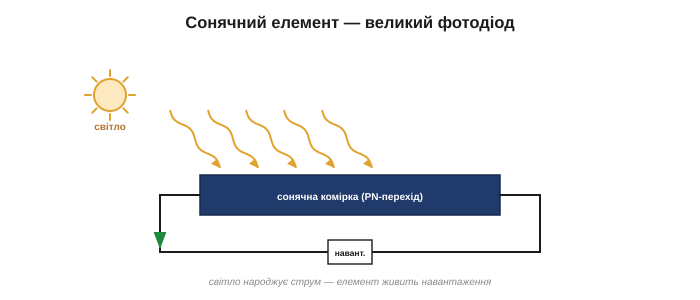
*Рис. 2.5.7.5. Сонячний елемент — це фотодіод великої площі. Світло народжує в ньому пари носіїв, вбудоване поле розділяє їх — і елемент сам стає джерелом струму. Та сама фізика, що в давачі світла, лише заради енергії.*

### Дві сторони однієї медалі

Звернімо увагу на красиву симетрію. **Світлодіод**: пускаємо струм — на переході рекомбінують носії — народжується світло. **Фотодіод** (і сонячний елемент): світло народжує носії — виникає струм. Один і той самий PN-перехід, лише енергія тече в протилежні боки: то струм у світло, то світло у струм.

За цим стоїть проста думка про збереження енергії. При рекомбінації носій «падає» через щілину й віддає її енергію — світлодіод випускає її фотоном. При поглинанні фотон, навпаки, «піднімає» носій через щілину, породжуючи пару й струм. Енергетична щілина ([§2.5.1](diode-pn-junction.md)) — той самий «поріг» в обидва боки: скільки енергії віддав фотон при народженні носія, стільки забере при його рекомбінації.

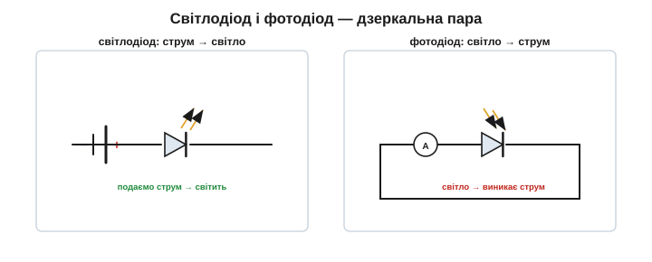
*Рис. 2.5.7.6. Дзеркальна пара. Світлодіод: струм → світло (рекомбінація випромінює фотони). Фотодіод/сонячний елемент: світло → струм (фотони народжують носії). Той самий перехід, протилежний напрям перетворення.*

А якщо поставити світлодіод і фотодіод поряд — один світить, інший «бачить», — дістанемо **оптичний зв'язок**: передачу сигналу світлом без електричного контакту (оптрон для гальванічної розв'язки, інфрачервоний пульт, оптоволокно). Дві дзеркальні половинки одного явища працюють у парі.

Найпоширеніший такий прилад — **оптрон** (оптопара): світлодіод і фотоприймач у спільному корпусі передають сигнал світлом, але **електрично роз'єднані**. Це дає гальванічну розв'язку — керувати високовольтною частиною з низьковольтної, не з'єднуючи їх дротом: безпечно й завадостійко. Той самий принцип — в інфрачервоному пульті (світлодіод блимає кодом, фотодіод у телевізорі його читає) і в оптоволокні, де світлом женуть терабіти на тисячі кілометрів. Без цієї дзеркальної пари не було б ні швидкого інтернету, ні безпечної розв'язки в промислових контролерах.

Цікавий наслідок симетрії: світлодіод і сам може працювати слабким фотодіодом — освітлений, він дає крихітну напругу. На цьому навіть будують двоспрямований зв'язок одним світлодіодом: то світить, то «слухає». Природа переходу одна — напрямок використання обираємо ми.

> 🔧 **Навіщо це.** Світлодіоди й фотодіоди оточують нас щомиті: екран, на якому ви це читаєте, пульт від телевізора, давач світла, що гасить підсвітку в темряві, сонячні панелі на дахах, оптоволокно, яким біжить інтернет. І все це — два прості застосування того самого PN-переходу: випромінити світло при рекомбінації або породити струм при поглинанні. Жодної нової фізики проти §2.5.1–2.5.3 — лише новий погляд.

### Що далі

Ми побачили, як діод світить і бачить. У світлодіода — дивовижна історія: світіння кристала помітили ще майже сто років тому, а оцінили значно пізніше; цьому й присвячено окрему вставку. А потім повернемося до «електричних» діодів зі спеціальними вміннями — Зенера й Шотткі: тих, що приборкують пробій собі на користь і працюють там, де звичайному діодові бракує вмінь.

> ▶️ Далі: [§2.5.8 Особливі діоди: Зенера, Шотткі](diode-pn-junction.md)

---

## 2.5.8 Особливі діоди: Зенера, Шотткі

Звичайний PN-діод — лише один із сімейства. Двоє його особливих родичів спритно вивертають уже знайому нам фізику собі на користь. **Діод Зенера** перетворює «згубний» пробій ([§2.5.5](diode-pn-junction.md)) на стабільне джерело напруги. **Діод Шотткі** має менше падіння й працює швидше — заради ощадності та швидкодії. Обидва ростуть прямо з того, що ми вже знаємо. Це гарний приклад інженерної ощадності: замість винаходити щось геть нове, беруть знайомий перехід і трохи міняють — то **режим** (Зенер працює в пробої), то саму **межу** (Шотткі ставить метал замість p-області).

### Діод Зенера: приборканий пробій

Згадаймо §2.5.5: у зворотному напрямку діод тримає, аж поки на напрузі пробою струм раптово не злітає — і звичайний діод від цього гине. А що, як зробити діод, який **витримує** пробій (за умови, що струм обмежено)? Це і є **діод Зенера** (*Zener diode*), або **стабілітрон**.

Найцінніше — те, що в пробої напруга на ньому лишається майже **сталою**, хоч би як мінявся струм. Це наче дзеркало прямого падіння 0.7 В, але в зворотному напрямку й на **наперед заданій** напрузі: бувають Зенери на 3.3, 5.1, 12 В і будь-які інші. Підключають його **в зворотному** напрямку (катодом до плюса) — і він «тримає» свою напругу пробою U_Z.

Як саме тримає? Щойно зворотна напруга сягає U_Z, пробій «відмикає» струм — і далі хоч скільки того струму додавай, напруга на діоді майже не росте: зайве «з'їдається» лавиною чи тунелюванням. Крута, майже вертикальна зворотна гілка й означає сталу напругу. Умова та сама, що завжди: струм мусить **обмежувати** щось зовнішнє (резистор), інакше Зенер перегріється й згорить, як і будь-який діод у пробої. А в межах дозволеного струму U_Z тримається напрочуд стало — звідси й назва «стабілітрон». Зручно думати про відкритий-у-пробої Зенер як про «батарейку напруги U_Z», увімкнену назустріч: хоч би що робилося в колі, на ньому стоїть U_Z (поки тече дозволений струм). Саме тому він служить **опорою** — еталоном, з яким порівнюють інші напруги.

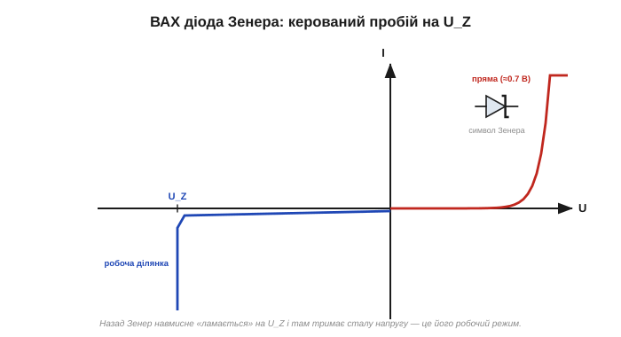
*Рис. 2.5.8.1. Уперед діод Зенера поводиться як звичайний (коліно ≈0.7 В). А назад він навмисне «ламається» на чітко заданій напрузі U_Z — і там його гілка майже вертикальна: напруга стала, струм може мінятися. Символ — діод із загнутими кінцями риски-катода.*

### Стабілізатор на Зенері

Ось навіщо це. Поставмо Зенер у зворотному напрямку паралельно навантаженню, а перед ним — резистор. Резистор бере на себе «зайву» напругу, а Зенер **фіксує** на навантаженні свою U_Z. Якщо вхідна напруга чи навантаження трохи коливаються — Зенер усмоктує різницю струмом, тримаючи вихід сталим. Це найпростіший **стабілізатор** напруги.

**Приклад. Дістати ≈5.1 В від джерела 12 В Зенером на 5.1 В.**
```
U_R = U_жив − U_Z = 12 − 5.1 = 6.9 В
R   = U_R / I     (I — сумарний струм крізь R; беремо, скажімо, 20 мА)
R   = 6.9 / 0.020 ≈ 345 Ом
```
На навантаженні стабільні 5.1 В; решту (6.9 В) гасить резистор. Частина струму йде в навантаження, надлишок — крізь Зенер, і саме він тримає напругу.

У цієї простої схеми є межі, які варто знати. По-перше, вона **марнотратна**: і резистор, і Зенер постійно гріються, бо весь надлишок напруги розсіюється на них. По-друге, вона погано тримає **сильно змінне** навантаження: якщо те раптом забере майже весь струм, Зенерові не лишиться, щоб бути в пробої, — і стабілізація зникне. Тому Зенер-стабілізатор добрий для невеликих, відносно сталих струмів (опорна напруга, живлення дрібної логіки); а для потужного чи мінливого навантаження беруть стабілізатори на транзисторах і мікросхемах (наступні розділи).

Тонкість розрахунку: резистор добирають так, щоб навіть за найбільшого навантаження крізь Зенер усе ще йшов якийсь **мінімальний** струм (інакше він «випаде» з пробою й перестане стабілізувати), і водночас щоб за найменшого навантаження струм крізь Зенер не перевищив **допустимого** (інакше згорить). Між цими двома межами й живе робочий діапазон простого стабілізатора.

Покажімо стабілізацію в дії: хай вхідна напруга стрибне з 12 до 15 В. Зайві 3 В майже повністю ляжуть на резистор (струм крізь нього й Зенер трохи зросте), а на виході збережуться ті самі ~5.1 В. Так Зенер «гасить» коливання входу — у цьому й суть стабілізації. Звісно, у самого Зенера є межа потужності (U_Z × струм): перевищиш — згорить, тож потужні стабілітрони, як і випрямні діоди, роблять більшими й тепловідвідними.

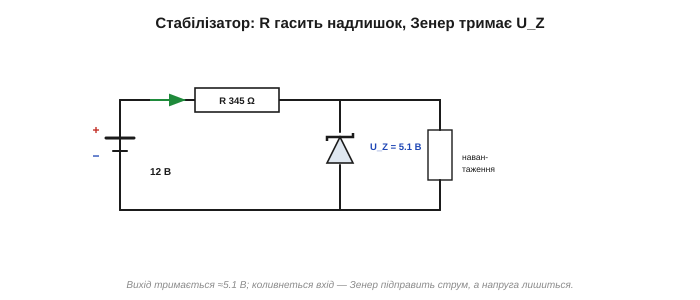
*Рис. 2.5.8.2. Зенер (зворотно) паралельно навантаженню, резистор — послідовно. Резистор бере надлишок напруги, Зенер тримає вихід на U_Z. Коливнулася вхідна напруга — Зенер сам підправить струм, а вихід лишиться сталим.*

> 🔧 **Навіщо це.** Діод Зенера — найдешевший спосіб дістати опорну чи стабілізовану напругу: одна деталь плюс резистор. Його ставлять як джерело опорної напруги, як «обмежувач» (щоб напруга не перевищила безпечну), у простих стабілізаторах. Для серйозного живлення є точніші стабілізатори на транзисторах і мікросхемах (до них дійдемо в наступних розділах), але ідея «зафіксувати напругу пробоєм» лишається тією самою. Окрема корисна роль Зенера — **обмежувач**: під'єднаний паралельно, він не дає напрузі піднятися вище за U_Z, відводячи надлишок на себе. Так захищають входи від перенапруги — близький родич захисту, яким ми завершимо розділ ([§2.5.9](diode-pn-junction.md)).

### Два механізми — і маленька іронія

Цікаво, що «тримають» напругу Зенери двома різними способами. На **низьких** напругах (приблизно до 5 В) працює власне **зенерівський** механізм — тунелювання крізь тонкий перехід. На **вищих** — **лавинний** пробій ([§2.5.5](diode-pn-junction.md)). Тобто більшість «діодів Зенера» вище ~5.5 В насправді працюють на лавині, а не на ефекті Зенера — хоч називають їх усіх Зенерами. Цікаво, що десь біля 5–6 В обидва механізми врівноважуються, і саме там напруга найменше «пливе» від температури — тому такі номінали особливо люблять як опорні. У цьому є маленька історична іронія, про яку — окрема вставка.

> 📜 **Історія до теми:** [Кларенс Зенер і пробій, що став корисним](hist-zener.md) — як небезпечний пробій перетворили на корисний прилад, і чому ім'я на ньому стоїть не зовсім «те».

### Діод Шотткі: метал замість переходу

Другий особливий діод влаштований інакше. Замість того щоб з'єднувати p- і n-напівпровідники, у **діоді Шотткі** (*Schottky diode*) контактують **метал і напівпровідник**. Така межа теж випрямляє (пропускає струм переважно в один бік), але її бар'єр **нижчий**.

Звідси два вагомі наслідки. По-перше, **менше пряме падіння**: ~0.2–0.3 В замість 0.7 В у кремнієвого PN-діода. Менше падіння — менше втраченої напруги й тепла, тож Шотткі чудовий для випрямлення **низьких** напруг і великих струмів ([§2.5.6](diode-pn-junction.md)). По-друге — про це нижче — він дуже **швидкий**.

У чому фізична різниця? У PN-діоді струм несуть і електрони, і дірки, причому, переходячи межу, вони стають неосновними носіями й живуть деякий час, перш ніж рекомбінувати ([§2.5.3](diode-pn-junction.md)). У контакті метал–напівпровідник такого впорскування неосновних носіїв майже немає — струм несуть лише **основні** носії. Це й дає Шотткі обидві переваги: нижчий бар'єр (менше падіння) і відсутність накопиченого заряду (швидкість).

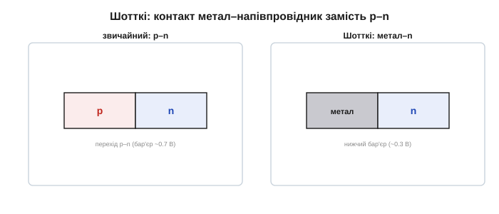
*Рис. 2.5.8.3. У звичайного діода — перехід між p- і n-напівпровідниками; у Шотткі — контакт металу з напівпровідником. Бар'єр на такому контакті нижчий, тому й пряме падіння менше (~0.3 В проти ~0.7 В).*

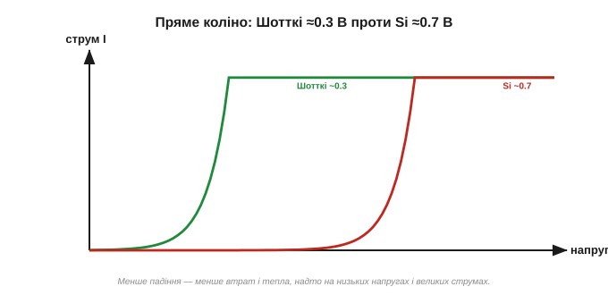
*Рис. 2.5.8.4. Пряма гілка діода Шотткі стартує раніше — коліно біля ~0.3 В замість ~0.7 В. На великому струмі ця різниця в пів вольта обертається помітною економією тепла.*

Прикиньмо економію: у випрямлячі на 10 А заміна кремнієвого діода (0.7 В) на Шотткі (0.3 В) зменшує втрати на діоді з ~7 Вт до ~3 Вт — менше тепла, вищий ККД. А на низьких напругах (5 В і нижче) ті пів вольта — ще й помітна частка самої напруги, тож там Шотткі майже обов'язковий.

Задарма це не дається. У Шотткі більший зворотний **витік** (тече трохи помітніше, ніж у PN) і він зазвичай витримує меншу зворотну напругу. Тому його беруть там, де важливі його сильні сторони, а високої зворотної напруги не треба: випрямлячі імпульсних блоків, захист сонячних панелей від зворотного струму, «об'єднання» кількох джерел, швидкі обмежувачі. Для високовольтного мережевого випрямляча беруть звичайний кремнієвий. Назва — від фізика Вальтера Шотткі, що пояснив бар'єр на контакті метал–напівпровідник. А впізнати Шотткі в схемі легко за роллю: якщо діод стоїть у швидкому перетворювачі або там, де борються за кожну десяту вольта, — це майже напевно він. Класичний приклад — діод послідовно із сонячною панеллю: уночі він не дає акумулятору розряджатися назад крізь панель, і тут кожна десята вольта падіння на рахунку — тому ставлять саме Шотткі.

### Чому Шотткі швидкий

Звичайний PN-діод, проводячи, **накопичує** в собі носії (неосновні, що зайшли через перехід). Коли його різко замикають, ці носії треба спершу «вимести» — на що йде час (так зване зворотне відновлення). Діод Шотткі носіїв не накопичує (працює лише на основних носіях), тож замикається майже **миттєво**. Тому він незамінний там, де треба перемикатися мільйони разів за секунду: в імпульсних блоках живлення, високочастотних колах, швидкій логіці.

Уявімо імпульсний блок живлення, що перемикається 100 тисяч разів за секунду. Звичайний діод щоразу при замиканні на коротку мить пропускав би зворотний струм, доки вимететься накопичений заряд, — і на такій частоті ці втрати накопичуються й гріють. Шотткі обриває струм чисто, без цього «хвоста», тож і ефективність вища. Саме тому в зарядках, комп'ютерних блоках живлення й перетворювачах стоять Шотткі. Узагалі, що вища робоча частота схеми, то ймовірніше побачити в ній Шотткі: на низьких частотах виграш від швидкості невеликий, а на високих — вирішальний. Платня — той самий більший витік: на спеці Шотткі «підтікає» помітніше, тож у дуже гарячих чи високовольтних місцях усе ж повертаються до звичайних кремнієвих діодів.

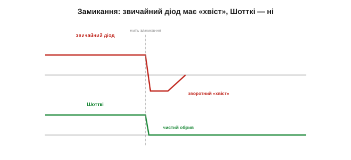
*Рис. 2.5.8.5. Звичайний діод при різкому замиканні ще мить пропускає зворотний струм, доки «вимітається» накопичений заряд. Шотткі такого заряду не має — обриває струм майже миттєво. Тому він кращий для швидких перемикань.*

### Коли що

Зведімо сімейство докупи:

```
звичайний PN  : загальне випрямлення й сигнали; падіння ~0.7 В
Зенера         : опорна/стабілізована напруга, обмеження; працює В ПРОБОЇ
Шотткі         : мале падіння (~0.3 В) і велика швидкість; випрямлення, ВЧ, ефективність
```


*Рис. 2.5.8.6. Три діоди — три ролі. Звичайний випрямляє й комутує. Зенер працює в пробої й тримає напругу (стабілізатор, обмежувач). Шотткі з його малим падінням і швидкістю — для ефективних та високочастотних кіл. Усі троє — той самий принцип однобічності, налаштований під задачу.*

На практиці вибір простий: потрібне загальне випрямлення чи комутація сигналу — звичайний діод; стала опорна напруга чи обмеження — Зенер; мале падіння й швидкість — Шотткі. А сімейство ще ширше: є, скажімо, **варикапи** — діоди, чию ємність переходу міняють зворотною напругою (керована ємність для настройки контурів, [Розділ 2.3](../reactance-resonance/reactance-resonance.md)), і чимало інших спеціальних діодів. Усі вони — варіації того самого PN-переходу, заточені під конкретну роль.

> 🔌 **Компонентна вставка:** [сімейства діодів — 1N4148, 1N400x, Шотткі](comp-diode-families.md). Які конкретні типономінали лежать у кожній шухляді (1N4148 — сигнал, 1N4007 — мережа, 1N5819 — Шотткі, BAT54/SS14 — для SMD), як прочитати маркування (смужка = катод) і за двома числами — I_F і V_R — обрати діод під задачу.

Часто діоди й комбінують: Шотткі-випрямляч плюс Зенер-обмежувач, або кілька Зенерів на різні рівні. А для захисту від коротких потужних викидів є окремий родич — **супресор** (TVS-діод), що миттєво «з'їдає» сплеск, наче швидкий потужний Зенер; із ним і з рештою захисних прийомів познайомимося в наступній темі.

> 🔌 **Компонентна вставка:** [TVS-діоди — захист входів від ESD і викидів](comp-tvs-esd.md). Чим супресор відрізняється від Зенера за роллю (коротко гасить потужний удар, а не тримає напругу), як він зливає удар у землю за пікосекунди, які три напруги дивляться в даташиті (V_WM/V_CL/P_PPM) — і чому TVS треба ставити в парі із запобіжником.

### Що далі

Ми пройшли все сімейство діодів — від звичайного до Зенера й Шотткі. Лишилося одне, дуже практичне застосування однобічності: **захист** схем. Діод уміє гасити небезпечний викид котушки ([§2.2.5](../inductor/inductor.md)) і боронити коло від переплутаної полярності живлення. Цим і завершимо розділ — і заразом побачимо, як усе вивчене про діод працює там, де помилка коштує згорілої мікросхеми.

> ▶️ Далі: [§2.5.9 Захист: flyback для котушки і від зворотної полярності](diode-pn-junction.md)

---

## 2.5.9 Захист: flyback для котушки і від зворотної полярності

Остання роль діода в цьому розділі — **вартовий**. Його однобічність ідеально надається для захисту: діод пропускає те, що має текти, і блокує (чи відводить) те, що загрожує. Розгляньмо дві класичні вартові служби: приборкання небезпечного викиду котушки й захист схеми від переплутаної полярності живлення. Обидві спираються на просту річ, яку ми вже вміємо, — діод пускає струм лише в один бік. Жодної нової фізики тут не буде — лише три розумні способи поставити вже знайомий клапан так, щоб він беріг сусідів.

### Проблема: «брикання» котушки

Згадаймо [§2.2.5](../inductor/inductor.md): котушка ненавидить **раптову зміну** струму. Поки крізь неї тече струм, у магнітному полі запасено енергію ([§2.2.3](../inductor/inductor.md)). Різко розімкніть коло — і поле, спадаючи, спробує **втримати** струм, наводячи на котушці величезний сплеск напруги (V = L·di/dt, а di/dt при різкому розмиканні гігантське). Цей сплеск може сягати сотень вольтів — і він б'є по тому, хто розмикав: пропалює іскрою контакти реле, пробиває транзисторний ключ.

Куди ж подітися енергії, що була в полі котушки? Закон збереження невблаганний — вона мусить кудись піти. Якщо шляху немає, котушка «продавлює» його сама, піднімаючи напругу доти, доки десь не проскочить іскра або не проб'ється транзистор. Саме тому в старих дзвінках і реле тріщала іскра на контактах. І що **швидше** розмикання (а транзистор робить це за мікросекунди), то вищий сплеск — бо di/dt тим більше, чим різкіший обрив.

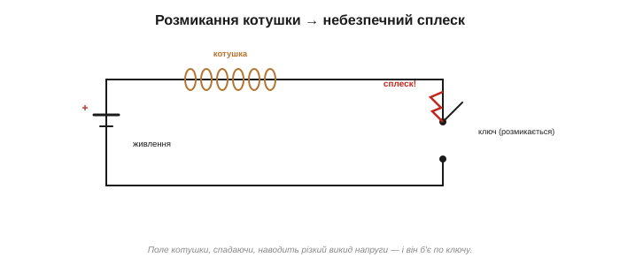
*Рис. 2.5.9.1. Поки ключ замкнений, крізь котушку тече струм. Розімкнули — поле спадає й наводить різкий викид напруги (V = L·di/dt), що б'є іскрою по контактах чи пробиває транзистор. Що швидше розмикання, то вищий сплеск.*

### Гасний (flyback) діод

Розв'язок елегантний: під'єднаймо діод **паралельно котушці**, у зворотному напрямку щодо живлення. Поки все нормально й струм тече від джерела, діод замкнений — він просто стоїть і нічого не робить. (Чому замкнений? Бо плюс живлення стоїть на його катоді — він зворотно зміщений, [§2.5.4](diode-pn-junction.md), і не відбирає струму в навантаження.) Та щойно ключ розмикається й напруга на котушці **перевертається**, цей діод опиняється у прямому напрямку — відкривається й **замикає струм котушки на себе**. Тепер струм не обривається різко, а плавно дотікає по колу «котушка → діод», згасаючи на тепло. Замість сотень вольтів сплеску — лише ~0.7 В на відкритому діоді.

Куди тепер дітися струмові? У петлю крізь діод. Котушка на мить стає джерелом і жене свій струм по колу «котушка → діод → котушка», а той помалу згасає, віддаючи запасену енергію на нагрів (швидкість згасання задає відношення L/R, [§2.2.4](../inductor/inductor.md)). Напруга ж на ключі більше не злітає до небес: вона обмежена живленням плюс ті ~0.7 В діода. Для відчуття масштабу: реле на 12 В без гасного діода може видати кількасот вольтів сплеску — більш ніж досить, щоб пробити транзистор; із діодом напруга на ключі ледь перевищить ті 12 В. Різниця між «згорів» і «працює» — в одній копійчаній деталі. Зверніть увагу: це та сама однобічність, що й у випрямлячі ([§2.5.6](diode-pn-junction.md)) — діод дає струмові шлях лише в один бік, тут саме в той, яким котушка хоче «доштовхати» свій струм. Нова роль, стара фізика.

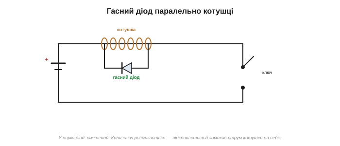
*Рис. 2.5.9.2. Діод паралельно котушці (зворотно щодо живлення). У нормі він замкнений. Коли ключ розмикається, напруга котушки перевертається й відкриває діод — струм котушки замикається в петлю «котушка → діод» і плавно згасає, а не б'є сплеском. Сплеск «зрізано» до ~0.7 В.*

Цей діод має багато імен — гасний, зворотний, freewheeling, «catch» — але роль одна: дати струму котушки безпечний шлях, коли основний шлях обірвано. Без нього транзистор, що керує реле чи мотором, живе недовго.

Зверніть увагу на елегантність: у нормальному режимі гасний діод **нічого не робить** — стоїть зворотно й не заважає, прокидаючись лише в ту єдину небезпечну мить розмикання. Ви чули його роботу безліч разів, не знаючи: тихе «клац» реле без тріску й іскри — це гасний діод акуратно прибирає сплеск, а реле без діода клацає різкіше й з часом випалює собі контакти. Найчастіше такий діод бачать поруч із реле й моторами в платах автоматики, іграшок, побутової техніки — скрізь, де транзистор керує чимось намотаним. Помітили на платі діод упритул до реле — це майже напевно він.


*Рис. 2.5.9.3. Напруга на ключі при розмиканні. Без діода — гострий високий сплеск (небезпека). З гасним діодом — напруга обмежена трохи вище живлення, а струм котушки плавно згасає крізь діод. Та сама котушка, та сама комутація — різниця лише в одному діоді.*

Зауважте, наскільки **низько** діод тримає сплеск — лише трохи вище напруги живлення (на своє падіння). Транзисторові-ключу більше й не треба: таку напругу він спокійно витримує, тоді як неприборканий сплеск пробив би його миттєво.

> 🔧 **Навіщо це.** Правило, яке рятує безліч схем: **будь-яку індуктивну котушку, якою керує транзистор** — реле, електромагніт, соленоїд, моторчик — обов'язково шунтують гасним діодом (катодом до плюса). Це копійчана деталь, що рятує дорогий ключ. У швидких схемах (ШІМ, [§2.5.7](diode-pn-junction.md)) сюди ставлять **швидкий** діод або Шотткі ([§2.5.8](diode-pn-junction.md)), щоб він устигав за перемиканнями.

Є й компроміс. Гасний діод робить згасання струму **повільним** — а для реле це означає, що воно трохи довше відпускає. Коли потрібне швидке відпускання (чи швидке перемикання), замість простого діода ставлять діод **із Зенером** або RC-снабер: вони гасять спалах енергії швидше, але ціною вищого (хоч і досі безпечного) сплеску. Класичний вибір: м'якість проти швидкості.

### Захист від зворотної полярності

Друга вартова служба — боронити схему від **переплутаного** живлення. Підключіть батарейку навпаки — і неправильна полярність може миттю спалити чутливу електроніку. Діод і тут стає в пригоді.

Найпростіше — поставити діод **послідовно** з живленням. Якщо полярність **правильна**, діод відкритий і пропускає струм (ціною свого падіння ~0.7 В; за 5-вольтового живлення Шотткі лишив би схемі ~4.7 В). Якщо **переплутана** — діод замкнений, струму немає, схема ціла. Один діод — і жодна неуважність із батарейкою не зашкодить.

Чому зворотна полярність така згубна? Бо багато компонентів її не терплять: електролітичні конденсатори при зворотній напрузі здуваються чи вибухають ([§2.1.5](../capacitor/capacitor.md)), мікросхеми пропускають струм «не туди» й перегріваються. Одна мить неправильно вставленої батарейки — і пристрій мертвий, причому шкода буває миттєвою й непоправною: поки помітиш запах диму, уже пізно. Послідовний діод робить таку помилку просто **неможливою**: немає правильної полярності — немає струму, а отже, і шкоди.

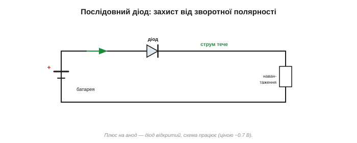
*Рис. 2.5.9.4. Діод послідовно з живленням. Плюс на анод — діод відкритий, схема працює (мінус ~0.7 В). Переплутали полярність — діод замкнений, струму немає, схема в безпеці. Найпростіший захист «від дурня».*

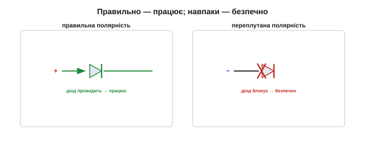
*Рис. 2.5.9.5. Ліворуч — батарейку під'єднано правильно: діод проводить, пристрій живиться. Праворуч — навпаки: діод блокує, струм не тече, ніщо не горить. Захист коштує одного діода й невеликого падіння напруги.*

Платня — те саме падіння ~0.7 В, що на малому живленні шкода втрачати. Тому замість звичайного діода часто беруть **Шотткі** (падіння ~0.3 В, [§2.5.8](diode-pn-junction.md)), а в економних пристроях — спеціальний «ідеальний діод» на польовому транзисторі (майже без втрат; до польових транзисторів дійдемо в Розділі 2.7). Існує й інший підхід — діод **паралельно** входу, зворотно: при правильній полярності він мовчить, а при переплутаній — замикає вхід і спалює запобіжник, рятуючи схему ціною запобіжника. Такий захист стоїть усюди, де живлення вставляє людина: в автомобільній електроніці (акумулятор переплутати легко), у приладах на батарейках, у роз'ємах живлення. Інженери звуть це «захистом від дурня» — і не з погорди, а тому, що помиляються всі, а згоріла плата нікому не потрібна.

> 🔧 **Навіщо це.** Дешевий послідовний діод (краще Шотткі, щоб не втрачати ~0.7 В) на вході живлення — звичка, що рятує пристрої від «вставив батарейку навпаки». Там, де втрата напруги критична (живлення від однієї-двох батарейок), ставлять «ідеальний діод» — польовий транзистор, що відкривається лише за правильної полярності з майже нульовим падінням (Розділ 2.7). А найгрубіший масовий варіант — діод-«лом» із запобіжником.

### Інші вартові ролі

Тим самим прийомом діоди стережуть і **сигнальні** входи. Пара діодів від лінії до плюсової й мінусової шин **обмежує** будь-який викид: якщо напруга на вході підскочила вище живлення, верхній діод відведе надлишок у плюсову шину; якщо впала нижче нуля — нижній підтягне до мінусової. Так входи мікросхем боронять від статики й перенапруг. Такі діоди й звуть **обмежувальними** (*clamp*) — бо вони «затискають» напругу в дозволених межах. Для сильніших ударів додають Зенер чи супресор ([§2.5.8](diode-pn-junction.md)).

До речі, у самих мікросхемах такі обмежувальні діоди вже **вбудовані** на кожному виводі — це перша лінія оборони від статичної електрики (того клацання, коли торкаєшся дверної ручки взимку). Та вони кволенькі, тож для серйозних ударів (довгі кабелі, промислові входи) ставлять зовнішні Зенери чи супресори. Принцип незмінний: дати небезпечному струмові безпечний шлях **повз** чутливе.

Як це працює в деталях? У нормі сигнал гуляє між нулем і живленням, обидва діоди замкнені — їх ніби й немає. Та щойно вхід вискочить за межі, відповідний діод відкриється й «притисне» його назад до шини, узявши удар на себе. Статичний розряд блискавично швидкий, тож тут потрібні **дуже швидкі** діоди — і вбудовані захисні структури мікросхем саме такі. Власне, кожен раз, коли ви безкарно встромляєте USB-флешку чи торкаєтесь роз'єму, вас рятують ці непомітні діоди-вартові всередині чипів.

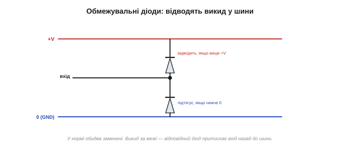
*Рис. 2.5.9.6. Два діоди від входу до шин «+» і «−». У нормі обидва замкнені. Викид вище живлення — відкривається верхній і відводить надлишок угору; нижче нуля — нижній підтягує до мінуса. Вхід завжди лишається в безпечних межах. Це той самий діод-вартовий, лише на сторожі сигналу.*

---

## 2.5.10 Оптопара й гальванічна розв'язка

Усі дев'ять попередніх тем діод щось **проводив**: струм, заряд, фотострум. А тепер — найпарадоксальніша його служба, де головна цінність саме в тому, що струм **не** проходить. Уявімо дві схеми, які конче треба з'єднати сигналом — але з'єднувати дротом не можна. Мікроконтролер на тихих п'яти вольтах мусить увімкнути нагрівач у мережі на 230 вольт. Або: давач сидить на корпусі верстата, де по «землі» гуляють кіловольтні викиди від двигуна, а його сигнал треба завести в ноутбук, до якого торкається жива людина. Пряма мідь у таких місцях — це або сотні вольт у логіці, або смертельна петля по «землях». Потрібен зв'язок, який передає **сигнал, але не струм**. І світлодіод із фотоприймачем із [§2.5.7](diode-pn-junction.md) дають його напрочуд просто.

### Дві землі, яким не можна торкатися

Згадаймо, на чому стоїть звичайна схема: усі її напруги відлічуються від спільної точки — «землі» ([§1.1](../../block-1-circuits-physics/charge-field-potential/charge-field-potential.md)). Поки система одна, спільна земля — благо. Та щойно сходяться **два світи** з різними землями, дріт між ними стає бідою:

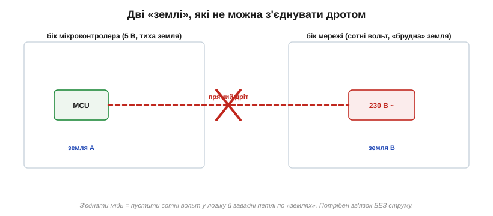
*Рис. 2.5.10.1. Ліворуч — тиха земля логіки; праворуч — «брудна» земля мережі під сотнями вольт. Прямий дріт зрівняв би їхні потенціали — тобто пустив би мережеву напругу в мікроконтролер, а заодно завадні петлі по «землях». Зв'язок потрібен, але без спільної міді.*

Бід насправді дві, і обидві серйозні. Перша — **безпека й живучість**: якщо земля одного боку стрибне на сотні вольт відносно іншого (пробій, витік на корпус, мережевий потенціал), цей стрибок піде прямо в чутливу логіку — і спалить її, а в гіршому разі дістанеться людини. Друга, тонша — **завади**: коли два кола ділять спільний провід землі, по ньому течуть струми обох, і падіння напруги від сильного «брудного» кола підмішується в слабке вимірювальне (ми бачили цей механізм у [§1.5](../../block-1-circuits-physics/equivalent-circuits/equivalent-circuits.md) — спільний опір породжує спільну заваду). Розірвати мідь — означає прибрати обидві біди одним ходом: немає спільного проводу — немає ні шляху для високої напруги, ні петлі для завад.

### Ідея: розірвати мідь, з'єднати світлом

Як передати сигнал крізь розрив, де навмисне немає дроту? Світлом. Поставмо на вхідному боці **світлодіод** ([§2.5.7](diode-pn-junction.md)): тече сигнальний струм — він світить, нема струму — темно. А навпроти, через крихітний прозорий проміжок, — **фотоприймач**, що ловить це світло й оживає від нього. Сигнал перестрибнув щілину, не торкнувшись її: на вході струм став світлом, на виході світло знову стало струмом. А між боками — лише прозорий ізолятор, крізь який летять фотони, але не може протекти жоден електрон. Цей зв'язок «через світло» і є серцем приладу, що зветься **оптопарою** (*optocoupler*, оптрон).

### Оптопара зсередини

Заводську оптопару збирають у єдиному непрозорому корпусі — щоб ніяке стороннє світло не заважало й ніяке власне не витікало:

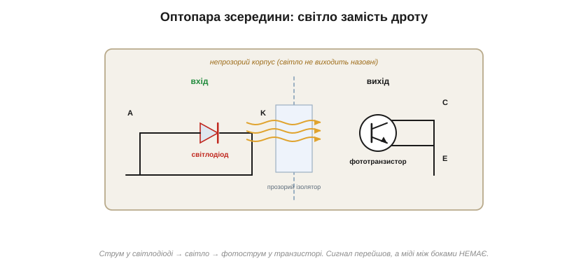
*Рис. 2.5.10.2. Світлодіод і фотоприймач дивляться одне на одного крізь прозорий ізолятор, замкнені в непрозорому корпусі. Струм у світлодіоді породжує світло, світло — фотострум у приймачі. Між входом і виходом немає жодного провідного шляху — лише потік фотонів.*

Фотоприймачем найчастіше служить не простий фотодіод, а **фототранзистор** — той самий фотоефект ([§2.5.7](diode-pn-junction.md)), але вбудований у транзистор, який заразом і **підсилює** свій кволий фотострум (про сам транзистор — наступний розділ; тут досить знати, що він робить слабкий фотосигнал помітно сильнішим). Тому найпоширеніша оптопара — світлодіод плюс фототранзистор: на вхід подаєш міліампери крізь світлодіод, на виході дістаєш керований світлом транзистор, який умикає чи вимикає вихідне коло. Вхід і вихід при цьому живуть у різних електричних світах, не маючи спільної точки взагалі.

### Що означає «гальванічна розв'язка»

Оце «немає спільного провідного шляху» має точну назву — **гальванічна розв'язка** (*galvanic isolation*): два кола обмінюються сигналом (через світло, магнітне поле чи ємність), але між ними немає жодного шляху для постійного струму. Скільки б вольтів не з'явилося між їхніми землями — пробою не буде, бо між боками стоїть суцільний ізолятор. Наскільки високих — каже паспортний параметр **напруга ізоляції**:

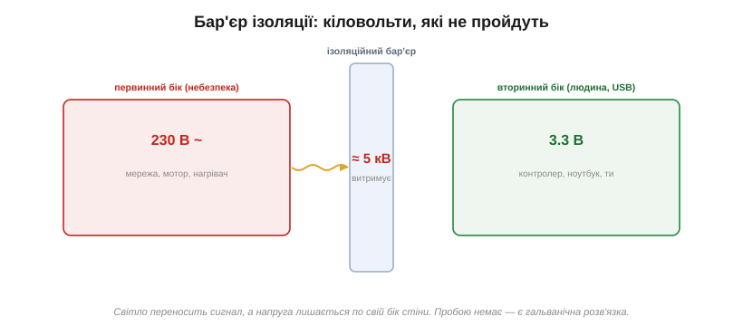
*Рис. 2.5.10.4. Типова оптопара витримує між боками близько 5 кіловольт — на порядки більше за будь-яку робочу напругу. Світло переносить сигнал, а напруга лишається кожна по свій бік стіни. Це і є гальванічна розв'язка: первинний бік може бути під мережею, вторинний — під пальцем людини.*

П'ять кіловольт — це не робоча напруга, а **запас міцності стіни**: навіть аварійний стрибок на тисячу-другу вольтів вона тримає, не пускаючи його на безпечний бік. Саме тому оптопари стоять усюди, де «небезпечне» сусідить із «людським»: між мережею і керуванням, між промисловим входом і контролером, в інтерфейсах медичних приладів, де від плати до пацієнта не сміє долетіти жоден зайвий мікроампер.

### CTR: коефіцієнт передачі струму

Раз сигнал двічі змінює природу — струм → світло → струм, — постає головне практичне питання: **скільки** виходу дає скільки входу? Це описує один параметр — **коефіцієнт передачі струму**, CTR (*current transfer ratio*): відношення вихідного струму колектора до вхідного струму світлодіода.

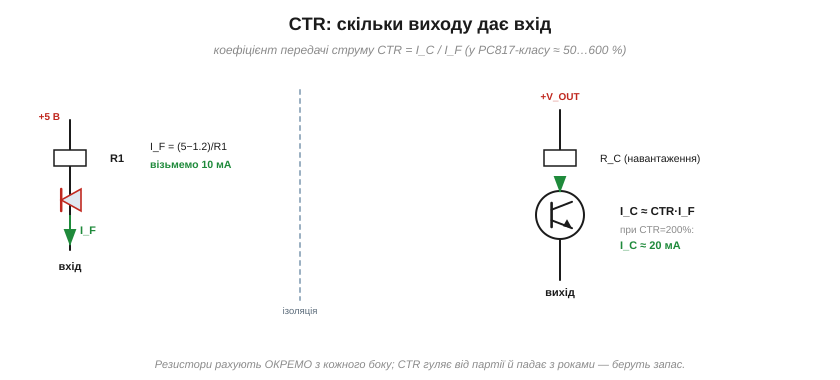
*Рис. 2.5.10.3. I_C ≈ CTR · I_F. У типової оптопари PC817-класу CTR гуляє в межах 50…600 % залежно від екземпляра. Резистори двох боків рахують ОКРЕМО: вхідний задає струм світлодіода, вихідний — навантаження транзистора.*

Розрахунок розпадається на дві незалежні половини — у цьому й зручність розв'язки. **На вході** все як зі звичайним світлодіодом ([§2.5.7](diode-pn-junction.md)): від напруги керування віднімаємо падіння світлодіода (~1.2 В) і резистором задаємо потрібний струм, скажімо 10 мА. **На виході** фототранзистор поводиться як ключ, що пропускає до CTR·I_F: при CTR 200 % наші 10 мА на вході дають близько 20 мА на виході — досить, щоб увімкнути наступний каскад. Дві половини рахуються нарізно, кожна у своєму світі напруг, бо спільної землі в них немає.

Одне «але» цей CTR має велике, і про нього треба знати з самого початку: він **дуже неточний**. Від екземпляра до екземпляра однієї партії він різниться в рази, падає на холоді й на спеці, а головне — **старіє**: світлодіод усередині поступово тьмяніє, і за роки роботи CTR помітно меншає. Тому жодна надійна схема не закладається на конкретне значення — лише на гарантований мінімум, та ще й із запасом. Практичне правило: подай у світлодіод помітно більший струм, ніж теоретично треба, щоб навіть постарілої, найгіршої з партії оптопари вистачало з лишком.

> 🔌 **Компонентна вставка:** [оптопара PC817-класу — ранги CTR і розрахунок обох боків](comp-optocoupler.md). Повний практичний шлях на найпоширенішому оптроні: як прочитати ранг CTR із літери в назві (A/B/C/D), порахувати резистори входу й виходу в числах під насичення, чому проєктують під найгірший CTR — і коли PC817 уже надто повільний (швидкий зв'язок → 6N137-клас).

### Платня за простоту: швидкість

За підкупливу простоту фототранзисторна оптопара бере плату — **повільністю**. Усередині транзистора світло має накопичити заряд, а потім цей заряд розсмоктати ([§2.1.4](../capacitor/capacitor.md) нагадує: будь-яке накопичення заряду — це затримка); тому різкі фронти на виході розпливаються:

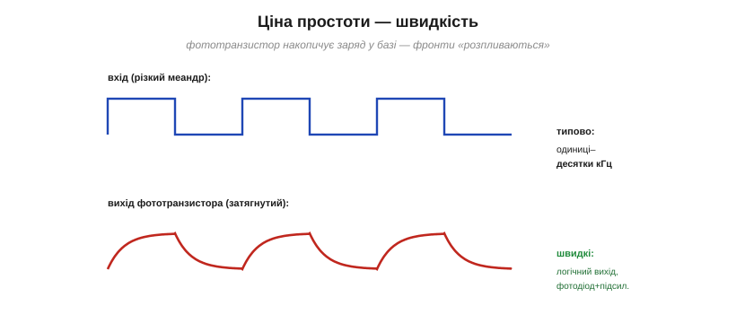
*Рис. 2.5.10.5. Різкий меандр на вході (струм світлодіода) виходить із фототранзистора затягнутим — заряд бази не встигає за швидкими перемиканнями. Звичайна оптопара чесно працює лише до одиниць–десятків кілогерц.*

Для повільних сигналів — увімкнути реле, передати команду «вкл/викл», завести в контролер стан кнопки — цих кілогерц із головою. Та коли треба швидко — ізолювати лінію зв'язку на сотні кілобіт чи зворотний зв'язок імпульсного перетворювача, — беруть **швидші** різновиди: оптопари з логічним виходом (усередині фотодіод плюс підсилювач-формувач, що видає чіткі цифрові фронти) або взагалі інші типи ізоляторів, про які — за мить. Класичний інженерний компроміс: найдешевша й найпростіша деталь — найповільніша.

### Оптопара в ділі: туди й назад

Майже всі практичні ввімкнення оптопари — це один із двох дзеркальних випадків, і правило для обох однакове: **світлодіод ставлять на боці, що видає сигнал, фототранзистор — на боці, що його приймає**.

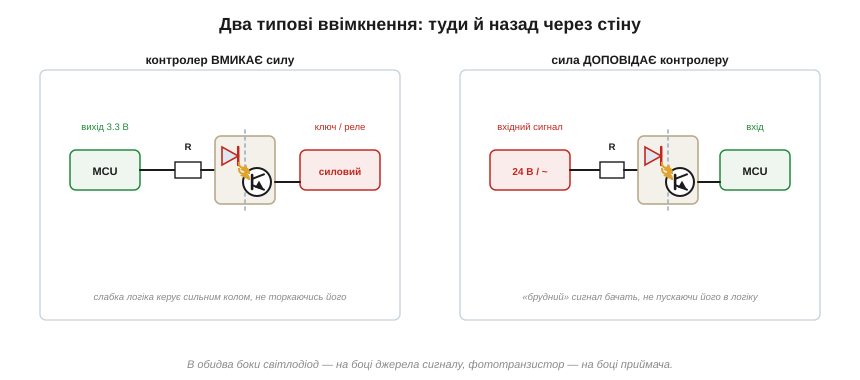
*Рис. 2.5.10.7. Ліворуч — контролер керує силою: слабкий вихід через резистор світить світлодіодом, фототранзистор умикає силовий ключ у небезпечному колі. Праворуч — сила доповідає контролеру: «брудний» вхідний сигнал світить світлодіодом, а чистий фототранзистор заводить його у вхід MCU.*

Перший випадок — **контролер вмикає силу**. Вихід мікроконтролера дає лише міліампери при трьох вольтах — ним не ввімкнути ні мережевого нагрівача, ні двигуна. Зате цих міліампер досить, щоб засвітити світлодіод оптопари; а фототранзистор на тому боці вже відмикає силовий ключ у мережевому колі. Логіка керує силою, не маючи з нею жодного спільного дроту — і мережа фізично не може дістатися до контролера. Другий випадок **дзеркальний** — сила доповідає контролеру. Промисловий давач чи кнопка живляться від «брудних» 24 вольт або просто від іншого кола; завести такий сигнал прямо у вхід мікроконтролера небезпечно. Тому сигнал спершу світить світлодіодом оптопари, а контролер читає вже чистий, розв'язаний вихід фототранзистора. В обох випадках між «брудним» і «чистим» світами — лише прозора щілина.

### Класична служба: зворотний зв'язок крізь стіну

Є застосування, у якому оптопара стоїть майже в кожному домі, — **зарядний пристрій** телефона чи ноутбука. Усередині такого імпульсного блока живлення вхід (мережа) і вихід (низьковольтна шина, до якої торкаєтесь ви) навмисне розв'язані трансформатором — інакше мережа дісталася б до рук. Та керувальній мікросхемі на **первинному** (мережевому) боці треба знати напругу на **вторинному** (безпечному) — щоб підтримувати її рівною: впала — піддати, підскочила — зменшити. Виходить замкнене коло, у якому сигнал мусить перетнути ту саму ізоляційну стіну, не пробивши її. Оптопара робить це ідеально: на вторинному боці схема стежить за напругою й керує струмом світлодіода, а фототранзистор на первинному передає цю звістку керувальній мікросхемі — крізь світло, без жодного дроту через бар'єр. Розкрутіть будь-яку зарядку — маленький чотирививідний місток між двома половинами плати майже напевно виявиться саме оптопарою, що несе зворотний зв'язок через стіну ізоляції.

### Родина: не лише світлом

Оптопара — найвідоміший, але не єдиний спосіб передати сигнал без струму. Варто бачити всю сім'ю, щоб розуміти, коли яку розв'язку взяти:

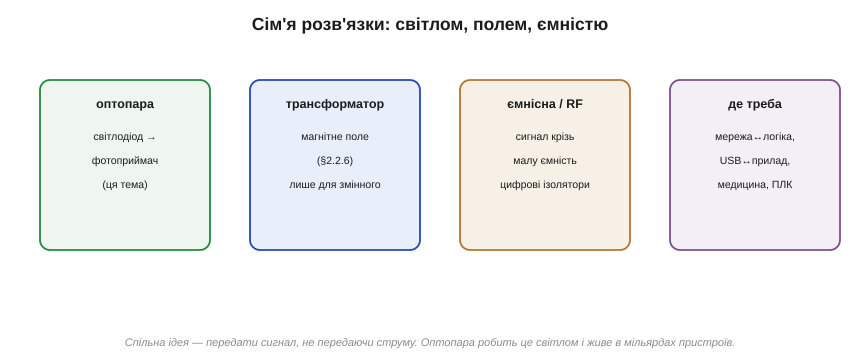
*Рис. 2.5.10.6. Світло (оптопара), магнітне поле (трансформатор, §2.2.6), електричне поле крізь малу ємність (сучасні цифрові ізолятори). Спосіб різний — ідея спільна: перенести сигнал, не перенісши струму.*

Сама оптопара теж буває різною: фототранзисторна (найпростіша, для «вкл/викл» і повільних сигналів), із логічним виходом (швидша, для цифри), лінійна (передає аналоговий рівень, а не лише «є/нема»). А поряд із нею живуть інші родичі тієї самої ідеї. **Трансформатор** ([§2.2.6](../inductor/inductor.md)) розв'язує магнітним полем — але лише змінний сигнал, бо постійний крізь нього не пройде. Найновіші **цифрові ізолятори** переносять сигнал крізь крихітну ємність або мініатюрний трансформатор, вбудовані в мікросхему: вони швидші за оптопару в сотні разів і не старіють, тому в сучасній техніці дедалі частіше витісняють її там, де потрібна швидкість. Але там, де треба дешево, просто й надійно розв'язати повільний сигнал — мережеве реле, вхід контролера, зворотний зв'язок зарядного, — скромна оптопара зі світлодіодом і фототранзистором досі поза конкуренцією й стоїть у мільярдах пристроїв.

> 🔧 **Навіщо це.** Побачили на платі деталь, що з'єднує «небезпечний» бік (мережа, силовий каскад) із «логічним» (мікроконтролер), — це майже напевно оптопара або цифровий ізолятор, і його завдання — щоб біда одного боку не перейшла на інший. Закладаючи оптопару в схему: рахуйте струм світлодіода **з запасом** (CTR падає з партією, температурою й роками), перевіряйте паспортну **напругу ізоляції** під свою задачу, а на швидкі сигнали беріть оптопару з логічним виходом чи цифровий ізолятор замість простої фототранзисторної. І пам'ятайте головне правило безпеки: розв'язка має сенс лише доти, доки жоден інший дріт, спільне живлення чи земля не з'єднують боки в обхід неї — одна випадкова мідна перемичка зводить нанівець усю стіну.

Так діод, що в [§2.5.7](diode-pn-junction.md) навчився світити й бачити світло, замкнув коло власних можливостей: тут світлодіод і фотоприймач, поставлені один навпроти одного, дають те, чого не вміє жоден провідник, — передати звістку через прірву, не наводячи через неї мосту. На цьому перелік облич діода вичерпано — час підбити риску під усім розділом.

### Підсумок розділу

Захисти й розв'язка останніх тем — одна ідея під різними масками: **діод пропускає бажане й перепиняє небажане**. Гасний діод дає струму котушки безпечний обхід; послідовний — блокує зворотну полярність; обмежувальні — відводять викиди в шини; а в оптопарі світлодіод і фотоприймач передають сигнал зовсім без міді, лишаючи струм по свій бік стіни. Скрізь працює та сама однобічність, із якої починався розділ. І скрізь діод — не головний герой схеми, а її тихий вартовий: у нормі його не помітно, а виявляється він лише тоді, коли рятує від біди. Цікаво, що це чи не найскромніший прилад: усього два виводи, жодного керування, проста однобічність. А проте без нього не працюють ні блок живлення, ні приймач, ні захист — тиха, але незамінна цеглинка електроніки.

На цьому ми **повністю** пройшли діод — від загадкового каменю Брауна до приладу з багатьма обличчями: клапан і випрямляч, джерело світла й давач, опора напруги й вартовий, а в парі з фотоприймачем — ще й місток крізь ізоляцію. Один і той самий PN-перехід — а стільки ролей лише тому, що ми по-різному ним користувалися: то прямо, то зворотно, то в пробої, то під світлом. Уся хитрість була не в нових деталях, а в новому **погляді** на ту саму межу між p і n. Та діод уміє лише **реагувати**: він не підсилює й не слухається третього виводу. А що, як додати ще одну леговану область і керувальний електрод — щоб слабкий сигнал **керував** сильним струмом? Уявіть діод із **третім** виводом, який прочиняє й причиняє внутрішній «клапан»: тоді кволий сигнал на цьому виводі правив би потужним струмом крізь прилад — це підсилення. Саме це й робить **транзистор**, перетворюючи пасивну електроніку на активну — здатну підсилювати, перемикати й обчислювати. З нього починається наступний розділ — і ціла нова епоха електроніки, де компоненти вже не просто реагують, а **керують**.

> ▶️ Далі: [Розділ 2.6 — Біполярний транзистор (BJT)](../bjt/bjt.md)
