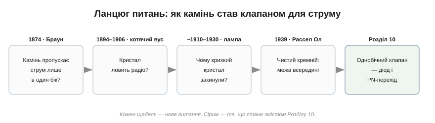
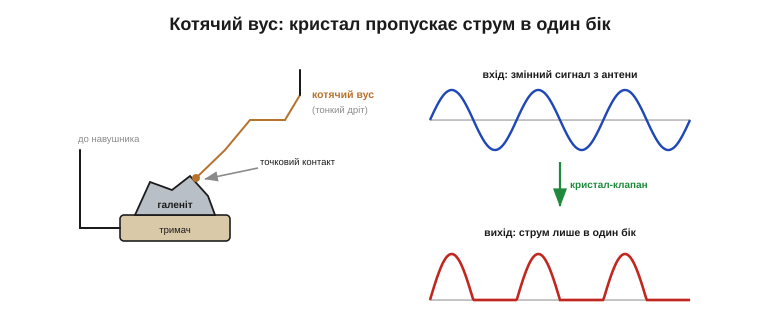
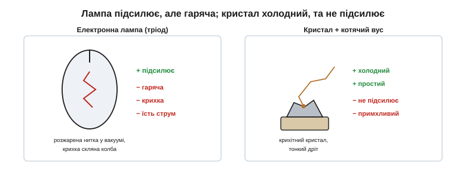
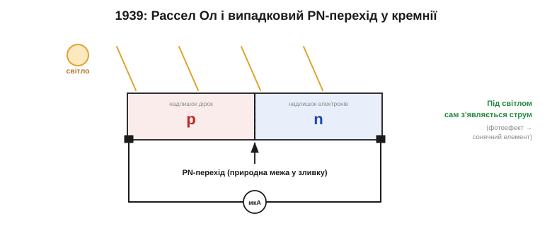
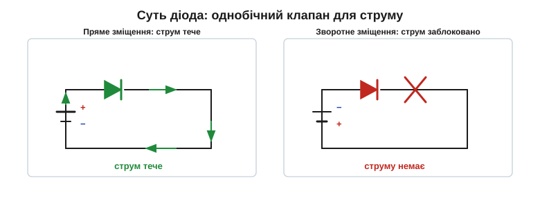

# 📜 Історія до Розділу 2.5 — діод і PN-перехід: від «котячого вуса» до кристалічного клапана

> Це історична вставка до [Розділу 2.5 «Діод і PN-перехід»](diode-pn-junction.md). Вона веде **ланцюгом питань** навколо одного дива: чому шматочок каменю здатен пропускати струм лише в **один** бік — і як від цієї примхи мінералу людство дійшло до кремнієвого PN-переходу, з якого виросла вся сучасна електроніка. Жодної математики тут не буде — лише фізична інтуїція й люди, що крок за кроком розгадували загадку.

Майже все, що буде в цьому розділі — випрямляч, який робить із розетки постійний струм; світлодіод, що сам світиться; захист, що рятує схему від зворотної полярності — тримається на одній простій, майже неймовірній властивості. Є речовини, крізь які струм тече **легко в один бік і майже не тече в інший**. Резистор так не вміє — йому байдуже до напряму. Конденсатор і котушка — теж. А от певні кристали — вміють. Як камінь навчився бути клапаном? Пройдімо шлях від першого спантеличеного спостереження до моменту, коли інженери нарешті зрозуміли, **чому** це працює.

*Рис. 2.5.0.1. Кожен щабель — нове питання. Камінь пропускає струм лише в один бік? → Кристал ловить радіо? → Чому крихкий кристал закинули? → Чистий кремній і межа всередині нього? Сірим — те, що стане кількісним змістом Розділу 2.5 (напівпровідник, легування, PN-перехід, діод).*

---

## Камінь, що пропускає струм лише в один бік

Почнімо з загадки, яку довго ніхто не міг пояснити. **1874 року** німецький фізик **Карл Фердинанд Браун** (*Karl Ferdinand Braun*) досліджував, як проводять струм кристали сульфідів металів — зокрема **галеніт** (свинцевий блиск, PbS). Притиснувши до кристала тонке металеве вістря, він помітив дивовижне: струм ішов крізь контакт **легко в один бік і кепсько у зворотний**. Опір залежав не лише від напруги, а й від її **напрямку**. Браун назвав це «однобічною провідністю».

Чому це було таке диво? Бо на ту пору світ електрики ділився надвоє: або **провідник** (метал, що проводить однаково в обидва боки), або **ізолятор** (що не проводить узагалі). Річ, яка проводить в один бік і не проводить у інший, не вкладалася в жодну з шухляд. Це порушувало симетрію, до якої всі звикли: якщо прикласти напругу так чи навпаки, метал-резистор поведеться однаково. А камінь Брауна — ні. Пояснити це тоді не міг ніхто: квантова фізика твердого тіла, з якої виросте поняття **напівпровідника**, з'явиться лише за пів століття.

Аби відчути, наскільки це дивно, уявіть водопровідну трубу, крізь яку вода тече вільно, якщо штовхати її в один бік, і майже не тече, якщо штовхати у зворотний, — хоча труба та сама. У світі металів такого не буває: мідний дріт однаково байдужий до напряму струму. А кристал Брауна поводився саме як труба з невидимим клапаном усередині. І найціннішою згодом виявиться не величина його опору, а сама ця **асиметрія** — те, що в одному напрямку «легко», а в іншому «важко».

> 🔧 **Навіщо це.** Однобічна провідність — не дрібна цікавинка, а вся суть діода. Пристрій, що пропускає струм в один бік і блокує у зворотний, дозволяє зробити те, чого не вміють резистор, конденсатор чи котушка: «випрямити» змінний струм у постійний, відсікти небажану полярність, скерувати енергію в потрібне русло. Усе це — пряме продовження спостереження Брауна. Він не знав, навіщо воно, — але першим побачив **клапан** там, де всі бачили лише камінь.

Цікаво, що сам Браун не вважав це головним своїм здобутком; згодом він прославиться роботами з бездротового зв'язку й **1909 року** розділить Нобелівську премію з фізики з Марконі. Та його забуте спостереження 1874 року виявиться зерном, з якого через десятиліття проросте напівпровідникова електроніка.

---

## Кристал чує радіо: «котячий вус»

Однобічна провідність довго лишалася лабораторним курйозом — поки не настала доба радіо. Щоб «почути» радіохвилю, потрібен **детектор**: пристрій, що перетворить швидкі коливання сигналу на струм, який ворухне мембрану навушника. І виявилося, що кристал Брауна — ідеальний детектор: він **випрямляє** змінний радіосигнал, пропускаючи лише його однобічні поштовхи.

Першим це використав індійський (бенгальський) фізик **Джаґадіш Чандра Бозе** (*Jagadish Chandra Bose*). Ще **1894–1895 років** у Калькутті він застосував кристали галеніту з тонким металевим контактом, щоб ловити **надвисокочастотні** хвилі, і прилюдно продемонстрував бездротову передачу — навіть підпалив на відстані порох. **1901 року** Бозе подав патент на кристалічний детектор (його видали **1904-го**). Внесок Бозе в історіях про радіо часто недооцінюють або взагалі оминають — а він був серед перших, хто змусив «камінь Брауна» працювати на зв'язок.

Практичним же масовим приладом детектор зробив американець **Ґрінліф Віттієр Пікард** (*Greenleaf Whittier Pickard*). Між **1902 і 1906 роками** він терпляче перепробував понад **тридцять тисяч** зразків мінералів, шукаючи найкращий, і **1906 року** запатентував детектор на **кремнії** (silicon) — той самий матеріал, що через століття стане основою всієї електроніки. Тонкий пружний дротик, яким намацували «чутливу» цятку на кристалі, прозвали **котячим вусом** (*cat's whisker*).

*Рис. 2.5.0.2. Гострий дротик («котячий вус») торкається кристала галеніту в одній точці. Цей точковий контакт пропускає струм переважно в один бік, тож зі змінного сигналу антени (синя хвиля) на виході лишаються поштовхи **однієї** полярності (червоні горбики) — їх уже «чує» навушник. Випрямлення зі шматочка каменю.*

Так народився **детекторний приймач** (crystal radio) — пристрій, який досі вражає: він ловить станцію й грає в навушник **без жодної батарейки**. Енергію дає сама радіохвиля, а кристал лише випрямляє її. Поєднайте такий детектор із налаштованим контуром із [Розділу 2.3](../reactance-resonance/reactance-resonance.md) — і отримаєте найпростіше радіо: контур вибирає станцію, кристал її «розпаковує». Мільйони людей у 1920-х слухали ефір саме так.

Як саме з кристала виходив звук? Радіостанція передає не голу хвилю, а хвилю, чию амплітуду «промодульовано» голосом чи музикою — гучніший звук дає більший розмах коливань. Кристал зрізає цю хвилю однобічно, лишаючи саму **обвідну** — повільні зміни гучності, які вже здатна відтворити мембрана навушника. Виходить злагоджений ланцюжок: контур вибирає станцію, кристал «розпаковує» з неї звук, навушник його озвучує — і все це без жодного джерела живлення.

Була, щоправда, морока: «чутливу» точку на кристалі доводилося шукати навпомацки, совгаючи вусом, і вона легко збивалася від поштовху. Ніхто до пуття не знав, **чому** одна цятка працює, а сусідня — ні. Детектор лишався мистецтвом, а не наукою.

---

## Лампа перемагає — на тридцять років

Саме тоді, коли кристал міг би розвинутися, його обійшов суперник. **1906–1907 років** **Лі де Форест** (*Lee de Forest*) удосконалив **електронну лампу** — тріод, що вмів не лише випрямляти, а й **підсилювати** сигнал. Це була інша ліга: кволий сигнал лампа робила гучним, а кристал так не вмів — він був суто пасивним клапаном.

*Рис. 2.5.0.3. Дві ранні технології. Електронна лампа підсилює сигнал, але вона гаряча, крихка й ненажерлива на струм (потрібне розжарення нитки у вакуумі). Кристалічний детектор — холодний, простий і дешевий, та не підсилює й примхливий у налаштуванні. На три десятиліття перемогла лампа.*

Тож від 1910-х до 1940-х в електроніці панувала лампа, а кристалічний детектор відсунули в дешеві та похідні приймачі. Але в лампи були вади, які нікуди не дівалися: вона гріла нитку розжарення (а отже, їла багато енергії), легко билася, перегоряла й погано працювала на **дуже високих** частотах. І ось остання вада зіграла ключову роль: коли під час Другої світової війни розвивали **радар**, на надвисоких частотах лампи-детектори не встигали — і інженери знову згадали про старий добрий кристал. Кристалічний детектор, тепер уже на чистому кремнії та германії, повернувся — і це повернення підштовхнуло серйозні дослідження напівпровідників. Зокрема — у Bell Labs.

Поряд із кремнієм у детекторах радара тоді пильно вивчали ще один напівпровідник — **германій** (*germanium*); саме на ньому згодом зроблять і перший транзистор. Війна, як це часто буває, різко прискорила науку: потреба в надійних високочастотних детекторах змусила вкласти в кристали кошти й найкращі голови, яких їм бракувало два десятиліття.

---

## Чистота вирішує все: Рассел Ол і PN-перехід

У Bell Labs наприкінці 1930-х інженер **Рассел Ол** (*Russell Ohl*) бився над тим, щоб зробити надійні кремнієві детектори для радара. Він був певен: примхливість кристала — від **домішок**, тож якщо кремній очистити, детектор стане стабільним. Ол навчився отримувати кремній небаченої доти чистоти — і саме тут на нього чекало відкриття, що перевернуло все.

**1939 року** він виявив у зразках дивну межу: коли кремнієвий зливок застигав, домішки розподілялися нерівномірно, і в кристалі сама собою утворювалася **границя** між двома ділянками з різними властивостями. На цій границі кремній випрямляв струм потужно й стабільно — куди краще за будь-який «котячий вус». А **23 лютого 1940 року** сталося ще дивовижніше: коли Ол посвітив на тріснутий зразок із такою межею, прилад показав **струм** — кристал сам виробляв напругу під світлом.

*Рис. 2.5.0.4. У зливку кремнію домішки створили дві сусідні ділянки: одну з надлишком «дірок» (p), другу — з надлишком вільних електронів (n). Границя між ними — **PN-перехід**. Вона пропускає струм лише в один бік, а під світлом сама породжує струм (так Ол відкрив і діод, і сонячний елемент водночас).*

Ол наштовхнувся одразу на дві речі: на **PN-перехід** (основу всіх діодів і транзисторів) і на **сонячний елемент** (його патент на «світлочутливий прилад» видали **1946 року**). Але головним був концептуальний стрибок. Виявилося, що випрямлення — це не магія точки контакту, як думали з часів котячого вуса. Це властивість **границі між двома по-різному «забрудненими» ділянками** напівпровідника: одна ділянка з надлишком вільних електронів (її назвуть **n-тип**), друга — з нестачею електронів, тобто з «дірками» (**p-тип**). Там, де вони сходяться, виникає природний клапан.

> 🔧 **Навіщо це.** Тут перевернулося саме ставлення до «бруду». Доти домішки в матеріалі вважали ворогом — джерелом непередбачуваності. Ол показав протилежне: якщо домішки додавати **навмисно й контрольовано** (це назвуть **легуванням**, *doping*), вони з ворога стають інструментом — саме вони створюють p- і n-ділянки, а отже, і клапан. Уся напівпровідникова промисловість стоїть на цій думці: беремо майже ідеально чистий кремній і додаємо в нього рівно стільки потрібних домішок, скільки треба. Розділ 2.5 розкриє цю механіку крок за кроком.

---

## Однобічний клапан — і насіння транзистора

Що ж по суті відкрив Ол? **Однобічний клапан для струму** — те саме, що бачив Браун у галеніті, але тепер зрозуміле й кероване. У прямому напрямку PN-перехід пропускає струм, у зворотному — блокує. Це і є **діод** (*diode*) — герой нашого розділу.

*Рис. 2.5.0.5. Підключи джерело «у правильний» бік (пряме зміщення) — і струм тече крізь діод вільно. Переверни полярність (зворотне зміщення) — і струм заблоковано. Чому саме так, пояснять §2.5.3–2.5.4 через бар'єр і збіднену область; поки важливий сам факт: діод — клапан, що пропускає струм лише в один бік.*

Чому саме границя поводиться як клапан — ми докладно розберемо далі в розділі (через **бар'єр** і **збіднену область**, §2.5.3–2.5.4). Тут важлива історична розв'язка: відкриття Ола стало насінням, з якого виріс **транзистор**. Уже **1947 року** в тих самих Bell Labs Джон Бардін, Волтер Браттейн і Вільям Шоклі (про них — історія до Розділу 2.6) створять перший транзистор, спираючись саме на розуміння PN-переходу. Діод був **першим** напівпровідниковим приладом; транзистор — другим, і він змінить світ.

Варто згадати ще одного піонера, чий внесок надовго забули: на початку 1920-х у Радянському Союзі **Олег Лосєв** (*Oleg Losev*) не лише будував підсилювачі на кристалах, а й помітив, що кристал під струмом **світиться** — фактично винайшов світлодіод задовго до його часу. Цю історію ми розкажемо окремо — у вставці до §2.5.7, де йтиметься про світлодіод.

---

## Що з цього лишилось

Озирнімося на пройдений ланцюг. Від спантеличеного «камінь проводить в один бік» до зрозумілого PN-переходу — і майже все, чим ми користуватимемося в Розділі 2.5, родом саме звідси:

- **однобічна провідність** (випрямлення) — те, що Браун побачив, а Бозе й Пікард застосували: суть діода;
- **кристалічний детектор** — перший крок напівпровідника в техніку, місток від [налаштованого контуру](../reactance-resonance/reactance-resonance.md) до радіо;
- урок Ола: потрібен **чистий** матеріал плюс **контрольовані домішки** (легування) — без цього клапан примхливий і випадковий;
- **PN-перехід** — границя між p- і n-ділянками, що й є клапаном;
- **діод** — перший напівпровідниковий прилад, з якого почалася вся активна електроніка й виріс транзистор.

А головне, що варто винести наперед: щоб зрозуміти, **чому** легований кристал пропускає струм лише в один бік, спершу треба збагнути, що таке взагалі **напівпровідник** — речовина, що сидить між провідником та ізолятором ([з Розділу 1.2](../../block-1-circuits-physics/voltage-current-conduction/voltage-current-conduction.md)). Саме звідти, від природи провідності, і почнемо розділ.

> ▶️ Далі: [§2.5.1 Напівпровідник: між провідником та ізолятором](diode-pn-junction.md)

---

### Пов'язані матеріали
- [Провідники, напівпровідники та ізолятори](../../block-1-circuits-physics/voltage-current-conduction/voltage-current-conduction.md) *(Розділ 1.2 — природа провідності)*
- [Налаштований контур і радіо](../reactance-resonance/reactance-resonance.md) *(Розділ 2.3 — кристалічний детектор у приймачі)*
