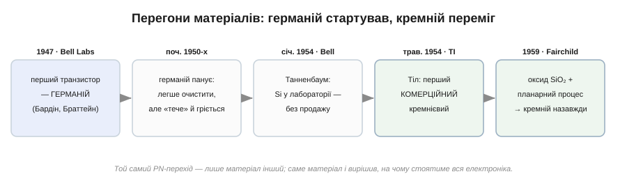
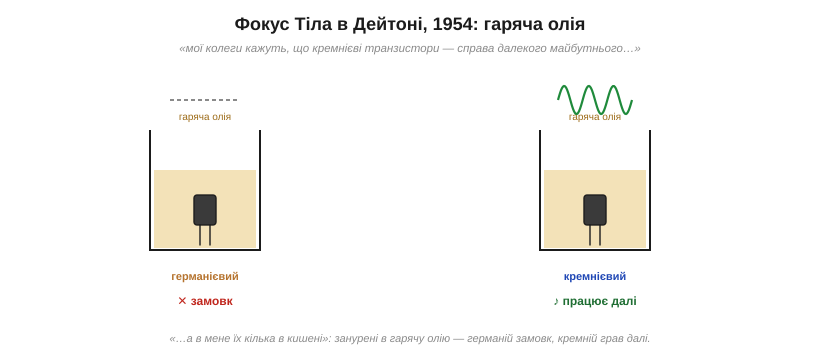
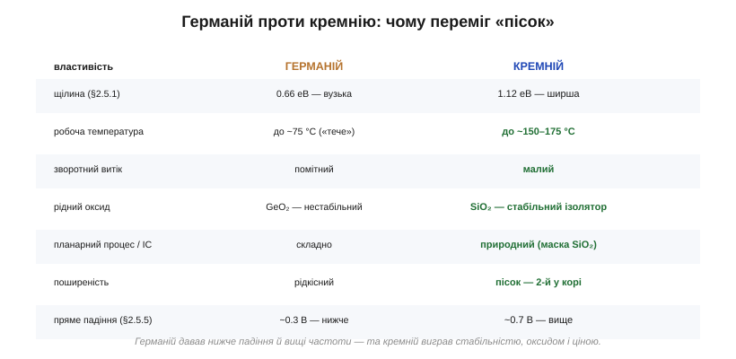

# 📜 Кремній проти германію: чому виграв «пісок»

> Це історична вставка до теми [2.5.1 «Напівпровідник»](diode-pn-junction.md). Тема пояснила, чому світ електроніки робиться з кремнію, і мимохідь згадала його суперника — германій. Та на старті все було навпаки: перший транзистор, перші діоди, перші підсилювачі — усі з германію, а кремній вважали матеріалом важким і примхливим. Як же «пісок» переміг? Це історія про два майже однакові кристали, про дві лабораторії, що бігли наввипередки в одному 1954 році, і про фокус із гарячою олією, який за хвилину переконав інженерів змінити матеріал цілої галузі.

*Рис. 2.5.1i.1. Германій дав перший транзистор (1947) і панував на початку 1950-х. Кремній наздогнав 1954-го — спершу в лабораторії Bell, потім на ринку від Texas Instruments, — а планарний процес із оксидом SiO₂ (1959) закріпив його перемогу назавжди.*

## Германієва доба

Коли в грудні 1947 року в Bell Labs Джон Бардін і Волтер Браттейн уперше побачили підсилення на крихітному пристрої з притиснутими до кристала дротиками ([докладніше — у Розділі 2.6](../bjt/bjt.md)), кристал той був із **германію**. І це не випадковість. Германій тоді вміли очищати краще, ніж будь-який інший напівпровідник: він плавиться за помірної температури, його легше було довести до потрібної чистоти й виростити з нього монокристал. Кремній натомість плавиться значно гарячіше (близько 1414 °C проти 938 °C у германію), агресивно реагує з тиглями й домішками в розплаві, і чистий монокристал з нього виходив погано. Тож усю першу п'ятирічку напівпровідникової ери — діоди, транзистори, перші підсилювачі — робили з германію. Він був практичний, передбачуваний, доступний у потрібній чистоті.

Германій мав і справжню технічну перевагу, яка нікуди не зникла досі: його носії рухливіші, тож германієві прилади працюють на вищих частотах, а пряме падіння германієвого діода нижче (~0.3 В проти ~0.7 В у кремнію, [§2.5.5](diode-pn-junction.md)) — менше втрат. Здавалося б, ось і матеріал майбутнього.

## Слабке місце: германій тече й гріється

Та в германію була вада, фатальна для практики. Згадаймо тему [2.5.1](diode-pn-junction.md): що **вужча** енергетична щілина матеріалу, то легше тепло вибиває носіїв через неї — і то більший «паразитний» струм. У германію щілина вузька (≈0.66 еВ), тож уже за помірного нагріву він починає рясно проводити сам собою: зворотний струм росте, перехід «тече», і прилад втрачає здатність керувати струмом. На практиці германієва техніка здавалася вже за 70–75 °C — а це гаряче літо в закритому корпусі, не кажучи про двигун літака чи бойову радіостанцію.

Кремній тут принципово кращий саме тому, що його щілина **ширша** (≈1.12 еВ): тому самому теплу важче перекинути носія через вищий бар'єр, витік менший, і кремнієвий прилад спокійно працює до 150–175 °C. Для військових і авіації середини 1950-х — у розпал холодної війни — це була не дрібниця, а вимога номер один: електроніка мусила витримувати спеку.

І саме військові гроші рухали цю гонитву. Армія, авіація й перші ракетні програми готові були платити за прилади, що не здаються в нагрітому корпусі літака чи в боєголовці, — а германій там просто здавався. Texas Instruments, ще недавно невелика нафтосервісна фірма, що робила прилади для геологорозвідки, зробила ставку саме на цей попит: кремнієвий транзистор, який витримує спеку, був точно тим, чого потребувала оборонка. Тіл привіз у Техас не лише вміння робити кристали, а й чуття на ринок, де теплостійкість коштує грошей. Усі знали, що кремній був би кращий. Тільки зробити з нього транзистор ніяк не вдавалося — і той, хто зробить першим, отримає замовлення, за якими стоятиме держава.

## Гордон Тіл: людина, що приручила кристали

Тут на сцену виходить головна постать цієї історії — **Гордон Тіл** (*Gordon Kidd Teal*), американець родом із Техасу. Працюючи в Bell Labs, він займався тим, що інші вважали другорядним: вирощуванням великих чистих **монокристалів**. Поки колеги гналися за схемами, Тіл уперто доводив, що майбутнє приладів — у досконалості самого кристала, і пристосував до напівпровідників метод витягування монокристала з розплаву (метод Чохральського). Його монокристалічний германій виявився куди кращим за тодішній «полікристалічний», і це згодом визнали ключем до надійних приладів.

Чому монокристал так важив? У звичайному «полікристалічному» зливку кристал зрощений із безлічі дрібних зерен, а межі між ними — це справжні пастки для носіїв: вони розсіюють і захоплюють електрони й дірки, додають витоку й псують роботу переходу. Монокристал — єдина бездоганна ґратка без таких меж — дає чистий, передбачуваний матеріал, у якому фізика PN-переходу з [теми 2.5.3](diode-pn-junction.md) працює як у підручнику. Тіл першим зрозумів, що без досконалого кристала надійних приладів не буде, хоч би якою хитрою була схема, — і це переконання виявилося ключем до всього.

А потім Тіл зробив крок, що змінив усе: 1953 року він покинув знаменитий Bell Labs і повернувся додому, у Техас, до тоді ще невеликої компанії **Texas Instruments**. Там він узявся за те, що в Bell вважали надто важким, — виростити досить чистий монокристал **кремнію** й зробити з нього транзистор.

## Перегони 1954 року

Тут варто бути точним, бо історія любить спрощувати до одного героя. Насправді кремнієвий транзистор «дозрів» майже одночасно у двох місцях, і честь треба ділити чесно.

У січні 1954 року в **Bell Labs** працюючий кремнієвий транзистор виготовив хімік **Морріс Танненбаум** (*Morris Tanenbaum*) — раніше за Texas Instruments. Тобто *першим* у світі кремнієвий транзистор зробили все-таки в Bell. Але Bell Labs тоді не побачила в ньому негайної комерційної цінності: технологія Танненбаума здавалася непридатною для масового виробництва, і компанія не стала її розгортати. Прилад лишився лабораторним зразком — без публічного оголошення, без продажу.

А в **Texas Instruments** команда Тіла того ж 1954-го довела свій кремнієвий транзистор (вирощений-перехідний, *grown-junction*) **до серії** — і саме TI першою вивела його на ринок. У травні 1954 року на технічній конференції IRE у Дейтоні Тіл зробив свій знаменитий виступ. Тож роздільмо ці два «перші» чітко: **перший у світі** кремнієвий транзистор — Танненбаума (Bell, січень 1954, лабораторно); **перший комерційний**, той, що пішов у виробництво й змінив галузь, — Тіла (TI, 1954). Перемога дісталася не тому, хто перший зробив, а тому, хто перший **продав**.

## Фокус у Дейтоні

Сам виступ Тіла став легендою інженерної історії — і, на щастя, добре задокументованою. На конференції доповідачі один за одним повторювали, що кремнієвий транзистор — справа далекого майбутнього, надто важка для сьогодення. Коли черга дійшла до Тіла, він, за відомим переказом, спокійно сказав щось на кшталт: «На відміну від того, що мої колеги розповіли вам про похмурі перспективи кремнієвих транзисторів, я маю кілька з них просто в кишені».

*Рис. 2.5.1i.3. Демонстрація, що переконала залу. Германієвий і кремнієвий прилади занурюють у гарячу олію: германієвий від нагріву «тече» й замовкає, а кремнієвий працює далі. Один наочний дослід вартував сотні слів про ширину щілини.*

А далі він показав наочно те, про що ми говорили вище. За переказом, програвач музики живився від транзистора, зануреного в посудину з гарячою олією: германієвий прилад від спеки замовкав, а коли його заміняли кремнієвим — музика грала далі, мовби нічого не сталося. Зала, повна інженерів, побачила на власні очі головну перевагу кремнію — теплостійкість — без жодної формули. Це був той рідкісний випадок, коли один дослід переконливіший за будь-яку теорію: після Дейтона сумніватися в кремнії стало важко.

## Чому кремній переміг остаточно

Теплостійкість відкрила кремнію двері, але закріпив його перемогу інший, тонший козир — **рідний оксид**.

*Рис. 2.5.1i.2. Германій вигравав окремими параметрами (нижче падіння, вищі частоти), але кремній узяв головним: ширша щілина (стабільність і спека), малий витік, дешевизна — і, найважливіше, стабільний оксид SiO₂, на якому виросла вся мікроелектроніка.*

Коли кремній окислюється, на його поверхні утворюється **діоксид кремнію** (SiO₂) — той самий кварц, скло, пісок: твердий, хімічно стійкий, чудовий ізолятор, що міцно тримається кристала. У германію свого пристойного оксиду немає — GeO₂ нестабільний і розчинний. Спершу здавалося, що це дрібниця. Та 1959 року в Fairchild Semiconductor швейцарський фізик Жан Орні (*Jean Hoerni*) винайшов **планарний процес**: шар SiO₂ на поверхні кремнію використали як захисну маску й ізоляцію, крізь «вікна» в якій вибірково вводять домішки й малюють прилади фотолітографією. Це й зробило можливою **інтегральну схему** — десятки, потім мільярди транзисторів на одному кристалі. На германії таке не виходило: без стабільного оксиду не було ні маски, ні захисту поверхні. (Перша інтегральна схема Джека Кілбі в TI, 1958, була ще германієва; але масовою ІС стала саме кремнієва, планарна, від Fairchild.) Окремий бонус кремнію — той самий оксид уможливив **польовий транзистор** із ізольованим затвором (MOSFET), на якому згодом постала вся цифрова техніка; до нього ми дійдемо в наступних розділах.

Додаймо до цього просту економіку. Кремній — **другий за поширеністю елемент** земної кори: звичайний пісок (той самий SiO₂) є всюди й коштує копійки, тоді як германій рідкісний і дорогий. Матеріал, який буквально лежить під ногами, ще й виявився технічно кращим для інтегральних схем. Проти такого поєднання германій вистояти не міг.

## Спадок: чому під ногами — кремній

Германій не зник зовсім — він і досі живе там, де важать його сильні сторони: у надшвидких СВЧ-приладах, у деяких оптичних давачах, у сплавах кремній-германій для високочастотної техніки. Але **основою** всієї масової електроніки став кремній. Кожен процесор, кожна пам'ять, кожен мікроконтролер у ваших пристроях — це кремнієвий кристал із намальованими на ньому планарним процесом мільярдами транзисторів. Навіть назва «Кремнієва долина» (*Silicon Valley*) — пам'ятник цьому вибору матеріалу; і символічно, що один із перших великих кроків до кремнію зробила людина, яка повернулася з Bell Labs додому, у Техас, робити те, що інші вважали неможливим.

А тепер — головне, заради чого цю історію варто було розповісти, і чесний підсумок без єдиного героя. Кремнієвий транзистор не «винайшла» одна людина: **першим** його зробив Танненбаум у Bell Labs (січень 1954), **першим продав** Тіл у Texas Instruments (1954), а **по-справжньому незамінним** кремній зробив оксид SiO₂ в руках Орні з планарним процесом (1959) — без жодного з цих кроків історія була б іншою. Уся ця історія — американська (Bell Labs, Texas Instruments, Fairchild) зі швейцарським внеском Орні; жодного перебільшеного «єдиного відкривача» тут немає, і правильніше говорити про естафету. І ще один урок, який не раз повториться в інженерії: перемагає не той матеріал чи винахід, що кращий за одним числом (германій вигравав і за падінням, і за частотою), а той, що кращий **за сукупністю** — стабільністю, технологічністю й ціною. Кремній виграв не блиском, а надійністю й дешевизною — тими чеснотами, що вирішують, на чому стоятиме ціла галузь.
