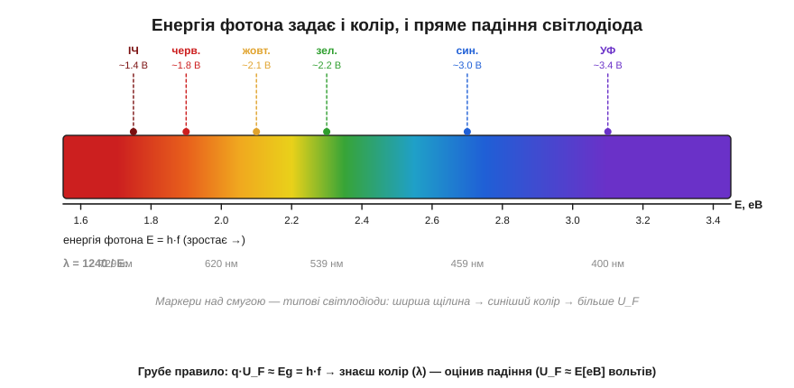
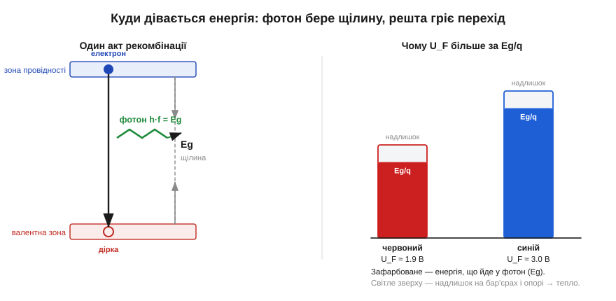

# 🧮 Фотон і заборонена зона: E = hf і чому колір LED задає матеріал

> Це математична вставка до теми [2.5.7 «Світлодіод і фотодіод»](diode-pn-junction.md). Тема дала готове правило: енергія фотона дорівнює щілині матеріалу, ширша щілина — синіше світло й більше пряме падіння. Тут ми **порахуємо** цей зв'язок: звідки в нього входить стала Планка, як одним діленням перевести колір у довжину хвилі й назад, і чому пряме падіння світлодіода (*forward voltage*, U_F) майже дорівнює його енергії в електронвольтах.

### Означення: що таке «енергія фотона»

Світло — це потік **фотонів** (*photon*), порцій електромагнітної енергії. Скільки енергії несе одна порція, задає її частота f за формулою Планка (Max Planck, 1900):

```
E = h·f          h ≈ 6.626×10⁻³⁴ Дж·с   (стала Планка, Planck constant)
```

Частота f і довжина хвилі λ зв'язані швидкістю світла c: f = c/λ. Підставимо — і дістанемо ту саму енергію через довжину хвилі, тобто через **колір**:

```
E = h·c / λ      c ≈ 3.0×10⁸ м/с
```

Ось і вся фізика кольору: висока частота (коротка хвиля) — енергійний фотон (синій бік), низька частота (довга хвиля) — слабкий фотон (червоний бік). Синій фотон несе більше енергії, ніж червоний, — це не метафора, а рівність E = hf.

### Інтуїція: чому енергія фотона = ширина щілини

Ми знаємо, скільки енергії несе фотон; лишається спитати, звідки він її бере у світлодіоді. Згадаймо механізм світлодіода з теми. Електрон у зоні провідності «падає» у валентну зону, рекомбінуючи з діркою, і долає при цьому заборонену зону (*band gap*, Eg) — енергетичну щілину з [§2.5.1](diode-pn-junction.md). У світлодіодному матеріалі ця вивільнена енергія виходить **одним фотоном**. За збереженням енергії фотон забирає рівно стільки, скільки електрон віддав, падаючи через щілину:

```
h·f = Eg          (енергія фотона = ширина забороненої зони)
```

Звідси все й випливає. Ширша щілина — енергійніший фотон — коротша хвиля — синіший колір. Вузька щілина — слабкий фотон — довга хвиля — червоний чи інфрачервоний. Матеріал задає Eg, а Eg через E = hf задає колір. Інженер світлодіода насправді добирає не «фарбу», а ширину забороненої зони сполуки.


*Рис. 2.5.7m.1. Лінійка кольорів за енергією фотона E = hf. Унизу — та сама вісь у довжинах хвиль (λ = 1240/E). Маркери над смугою — типові світлодіоди: що ширша щілина матеріалу, то синіший колір і то більше пряме падіння U_F. Числа орієнтовні (реальні сполуки трохи різняться), а от співвідношення E = hf = hc/λ точне.*

### Апарат: інженерна формула λ = 1240 / E

Зв'язок кольору зі щілиною ми вже бачимо; тепер зробімо з нього робочий інструмент. Джоулі й метри для практики незручні: енергію зручніше міряти в **електронвольтах** (*electronvolt*, еВ) — це енергія, яку набирає електрон, пройшовши 1 вольт: 1 еВ = q·1 В ≈ 1.602×10⁻¹⁹ Дж. А довжину хвилі видимого світла — у нанометрах. Згорнімо всі сталі (h, c, q) в одне число:

```
λ[нм] = h·c / (E·q) = 1240 / E[еВ]      (зручна форма для світла)
```

Це формула, яку інженери тримають у голові: **добуток довжини хвилі (нм) на енергію (еВ) дорівнює ≈ 1240**. Знаєш одне — поділи на нього 1240 і маєш друге.

**Приклад. Червоний світлодіод світить на λ ≈ 650 нм. Яка енергія фотона і яка щілина матеріалу?**
```
E = 1240 / λ = 1240 / 650 ≈ 1.91 еВ
h·f = Eg  →  Eg ≈ 1.9 еВ
```
Тобто щілина матеріалу червоного світлодіода — близько 1.9 еВ. Для синього (λ ≈ 465 нм) вийде E = 1240/465 ≈ 2.67 еВ — помітно більша щілина. Тому синій світлодіод і дався так важко: потрібен був напівпровідник з широкою забороненою зоною (нітрид галію, GaN), а його довго не вміли робити (історія до теми про блакитний світлодіод).

### Звідки «U_F ≈ колір у вольтах»

Енергію щілини ми вже вміємо читати в електронвольтах — а тепер найкорисніше для схемотехніки. Щоб електрон піднявся в зону провідності й мав звідки впасти, зовнішнє коло мусить дати йому енергію не меншу за Eg. Дає її напруга: пройшовши падіння U_F, електрон набирає енергію q·U_F. Прирівняймо до щілини:

```
q·U_F ≈ Eg = h·f      →      U_F[В] ≈ E[еВ]
```

Електронвольт обертається на вольт майже один до одного. Тому **пряме падіння світлодіода числом приблизно дорівнює енергії його фотона в електронвольтах**: червоний (~1.9 еВ) має U_F ≈ 1.8 В, синій (~2.7 еВ) — U_F ≈ 3.0 В. Звідси й та закономірність із [§2.5.5](diode-pn-junction.md): що синіше світить світлодіод, то більше його падіння, а отже, інакший резистор-обмежувач.

Чому «приблизно», а не точно? Реальне U_F трохи **більше** за Eg/q: частина напруги губиться на контактах метал–напівпровідник і на опорі тіла кристала, і ця надбавка йде не у фотон, а в тепло. Тому, скажімо, синій кристал зі щілиною 2.7 еВ просить не 2.7, а близько 3 В.


*Рис. 2.5.7m.2. Ліворуч — один акт рекомбінації: електрон падає через щілину Eg й віддає фотон h·f = Eg. Праворуч — чому U_F більше за Eg/q: зафарбована частина стовпчика йде у фотон (саме вона задає колір), світла надбавка зверху осідає на бар'єрах і опорі переходу й перетворюється на тепло. Синій світлодіод має і вищу щілину, і вищий стовпчик.*

### Зворотний бік: той самий поріг для поглинання

Симетрія з теми працює і в числах. Фотодіод поглинає фотон і народжує пару носіїв лише тоді, коли енергії фотона **вистачає** на щілину: h·f ≥ Eg. Звідси й «червона межа» чутливості — найдовша хвиля, яку матеріал ще бачить: λ_max = 1240/Eg[еВ]. Кремній зі щілиною ≈1.12 еВ ловить світло аж до λ ≈ 1100 нм — тобто й ближній інфрачервоний діапазон, невидимий оку; саме тому кремнієві фотодіоди добре приймають інфрачервоні пульти. А фотон, слабший за щілину, проходить крізь кристал, не народивши носія, — матеріал для нього прозорий.

### Де це працює в курсі

Формула E = hf = hc/λ — це місток між фізикою матеріалу й практикою світлодіода. Вона пояснює, чому колір нерозривно зв'язаний із прямим падінням U_F (а отже, з розрахунком резистора-обмежувача з [§2.5.5](diode-pn-junction.md)), чому інфрачервоний світлодіод має найменше падіння, а білий/синій — найбільше, і чому кремній бачить більше, ніж ми. Головний урок: «колір» світлодіода — це не властивість фарби, а пряме число — ширина забороненої зони, яку через сталу Планка видно і як довжину хвилі, і як вольти на виводах.
