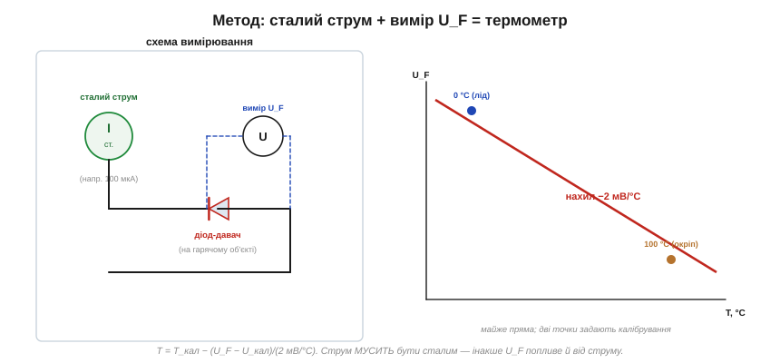
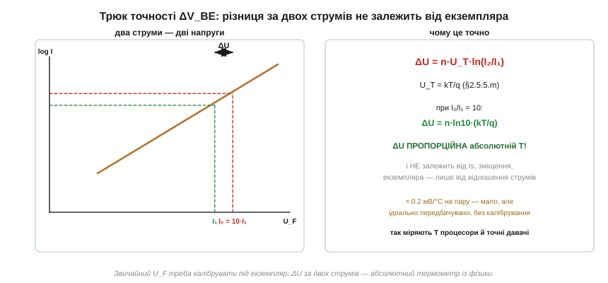

# ⚙️ Діод як термометр: міряємо температуру прямим падінням

> Це алгоритмічна вставка до теми [2.5.5 «ВАХ діода»](diode-pn-junction.md). Тема згадала, що пряме падіння тане на −2 мВ/°C і що з цього роблять термометр. Тут — як саме: який потрібен струм, навіщо калібрувати під екземпляр, і трюк ΔV_BE, яким міряють температуру **без** калібрування — той, що сидить усередині кожного процесора.

### Ідея і її пастка

Пряме падіння U_F залежить від температури передбачувано: ~−2 мВ на кожен градус ([§2.5.5](diode-pn-junction.md)). Тож, здавалося б, усе просто — виміряй U_F вольтметром і перерахуй у градуси. Пастка в тому, що U_F залежить **і від струму** — логарифмічно, як показала [вставка про рівняння Шоклі](math-shockley-equation.md): U = n·U_T·ln(I/Is). Якщо струм через діод «плаває», падіння міняється не лише від температури, і вимір бреше. Тому перша умова термометра — **сталий струм**:


*Рис. 2.5.5a.1. Джерело сталого струму (наприклад, 100 мкА) живить діод-давач у тепловому контакті з об'єктом; вольтметр читає U_F. На сталому струмі U_F залежить лише від температури — майже по прямій з нахилом −2 мВ/°C.*

### Алгоритм

```
1. Подати крізь діод СТАЛИЙ струм (типово 100 мкА … 1 мА).
   Малий — щоб діод не грів себе сам (самонагрів = похибка).
2. Виміряти пряме падіння U_F.
3. Перерахувати в температуру за калібруванням:
   T = T_кал − (U_F − U_кал) / (2 мВ/°C)
```

Чому потрібне **калібрування**? Нахил −2 мВ/°C доволі стабільний, а от **зсув** прямої (саме значення U_F за відомої температури) різниться від екземпляра до екземпляра. Тому беруть одну-дві опорні точки: посадити давач у тала́ну воду з льодом (рівно 0 °C) і в окріп (≈100 °C) — і ці дві точки задають пряму U_F(T) для конкретного діода. Далі будь-яке падіння читається як температура.

### Що псує точність

- **Самонагрів.** Струм гріє сам діод (P = U_F·I): за 0.7 В і 1 мА це 0.7 мВт — дрібниця, але для точних вимірів струм беруть малим, щоб давач показував температуру об'єкта, а не власну.
- **Тепловий контакт.** Давач має бути щільно притиснутий до того, що міряємо, інакше показує щось середнє між об'єктом і повітрям.
- **Який діод.** Згодиться дешевий 1N4148, але **краще** працює транзистор у «діодному» включенні (база з колектором разом) — у нього менше паразитних опорів, що спотворюють логарифмічну залежність; саме так роблять прецизійні давачі (про транзистори — наступний розділ).

### Трюк точності: ΔV_BE без калібрування

А можна взагалі позбутися калібрування зсуву — і зробити **абсолютний** термометр із чистої фізики. Хитрість у тому, щоб виміряти падіння двічі, за **двох різних струмів** I₁ та I₂, і взяти **різницю**:


*Рис. 2.5.5a.2. За двох струмів падіння різні; їхня різниця ΔU = n·U_T·ln(I₂/I₁). Тут зник невідомий Is (зсув!) — лишилася лише U_T = kT/q, прямо пропорційна абсолютній температурі.*

Магія в алгебрі логарифма. Запишемо обидва падіння й віднімемо:

```
U₁ = n·U_T·ln(I₁/Is)
U₂ = n·U_T·ln(I₂/Is)
ΔU = U₂ − U₁ = n·U_T·ln(I₂/I₁)        ← Is СКОРОТИВСЯ
```

Невідомий струм насичення Is — той самий, що мінявся від екземпляра й вимагав калібрування, — **зник** при відніманні. Лишилася лише U_T = kT/q, прямо пропорційна **абсолютній** температурі. Задавши точне відношення струмів (скажімо, I₂/I₁ = 10), маємо:

```
ΔU = n·ln(10)·(kT/q)  ≈ передбачуваний нахил без калібрування зсуву
```

Тобто ΔU прямо показує абсолютну температуру, не потребуючи знати ні Is, ні точне значення падіння. Платня — сигнал малий (зміна лише ~0.2 мВ/°C на одну пару), тож його доводиться підсилювати; зате він **точний за побудовою**. Саме так влаштовані вбудовані термодавачі процесорів і мікроконтролерів, точні мікросхеми-термометри й термокомпенсація в аналогових схемах: відношення двох струмів крізь перехід — це готовий датчик абсолютної температури, що випливає прямо з фізики PN-переходу.

> ⚙️ **Підсумок методу.** Простий діод-термометр: сталий струм → вимір U_F → перерахунок за калібруванням (дві точки: лід і окріп), нахил −2 мВ/°C; струм малий, щоб не грітися самому. Точний термометр: ΔV_BE за двох струмів — абсолютна температура без калібрування зсуву, бо Is скорочується. Перший спосіб годиться для «чи не перегрівся силовий ключ», другий — для прецизійного вимірювання й того термометра, що вже вбудований у ваш мікроконтролер.
