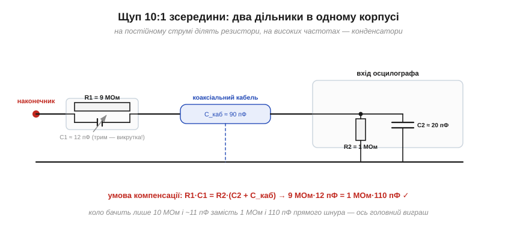
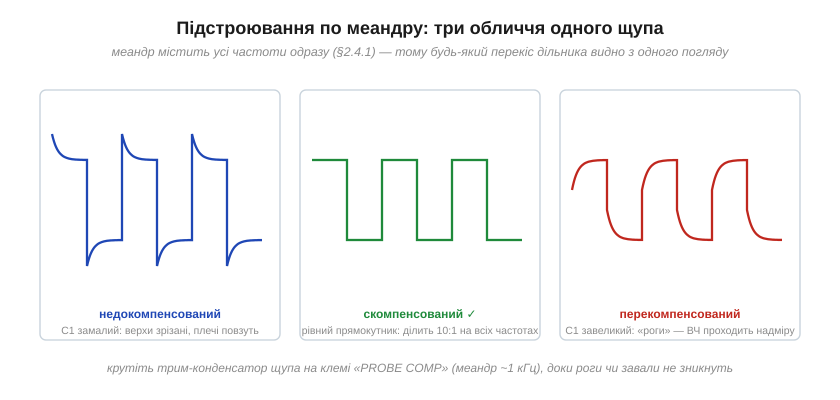

# 🔌 Щуп осцилографа 10:1: АЧХ просто в руках

> Це компонентна вставка до теми [2.4.1 «Коло як фільтр»](frequency-response.md). Тема закінчила думкою «фільтрує все — навіть вимірювальний тракт». Найкращий доказ висить на гачку біля кожного осцилографа: звичайний щуп ×10 — це частотно-компенсований дільник, чию характеристику ви власноруч вирівнюєте викруткою. Розберемо, що в ньому всередині, чому без конденсатора він був би фільтром на 160 герців — і що означають «роги» на меандрі.

### Навіщо взагалі ділити на десять

Здається, щуп ×10 потрібен «щоб дивитися великі сигнали». Насправді головний виграш інший. Підключити коло до осцилографа напряму шматком коаксіального кабелю означає повісити на вимірювану точку вхід приладу (типово 1 МОм і ~20 пФ) **плюс ємність самого кабелю** — ще ~90 пФ. Сумарні ~110 пФ — це готовий ФНЧ із [§2.4.2](frequency-response.md) на самій точці вимірювання: для джерела з опором у кілоом зріз сидить уже біля мегагерца, і прилад починає міняти те, що міряє, — класична пастка навантаження з [§2.4.1](frequency-response.md).

Щуп ×10 ставить у наконечник резистор 9 МОм. Разом із вхідним мегаомом виходить дільник 10:1 — звідси і назва, і плата: сигнал на екрані вдесятеро менший. Зате коло тепер бачить 10 МОм замість одного — а після компенсації, як зараз побачимо, ще й ~11 пФ замість 110.

### Біда: самий резистор — це фільтр на 160 Гц

От тільки чисто резистивний дільник тут не працює. Дев'ять мегаом дивляться на ті самі 110 пФ кабелю і входу — а це RC-ланка:

```
f_c = 1/(2π·R·C) = 1/(2π·9×10⁶·110×10⁻¹²) ≈ 160 Гц
```

Такий «щуп» чесно ділив би на 10 лише повільні сигнали, а все швидше за сотні герців — завалював. Осцилограф перетворився б на вольтметр.

### Рятунок: другий дільник, ємнісний

Рішення красиве: паралельно дев'яти мегаомам ставлять маленький конденсатор. Тепер у корпусі живуть **два дільники одразу** — резистивний (працює на низьких частотах) і ємнісний (на високих, де реактивності менші за резистори; ємнісний дільник ділить обернено до ємностей). Якщо підібрати C1 так, щоб постійні часу плеч зрівнялися, обидва дільники дають однакові 10:1 — і передача перестає залежати від частоти взагалі:


*Рис. 2.4.1c.1. R1·C1 = R2·(C2 + C_каб): за цієї умови дільник «прозорий за частотою» — рівні 10:1 від постійного струму до межі смуги щупа. Бонус: вхідні 110 пФ сховалися за послідовним C1, і коло бачить лише ~11 пФ.*

```
умова компенсації:  R1·C1 = R2·(C2 + C_каб)
C1 = 1 МОм·110 пФ / 9 МОм ≈ 12 пФ
```

### Викрутка і меандр: налаштування АЧХ руками

Ємність кабелю і входу різниться від приладу до приладу — тому C1 зроблено **підстроювальним**, а на передній панелі осцилографа виведено клему «PROBE COMP» з меандром ~1 кГц. Меандр — найзручніший тест-сигнал: він містить цілий хор гармонік ([§2.4.1](frequency-response.md)), тож будь-який перекіс характеристики видно одним поглядом:


*Рис. 2.4.1c.2. Недокомпенсований щуп глушить верхні частоти — кути зрізані, плечі повзуть; перекомпенсований пропускає їх надміру — «роги» на фронтах; правильний дає чесний прямокутник. Ви буквально крутите АЧХ викруткою, дивлячись на її роботу в часовій мові.*

Звичка професії: перечепили щуп на інший канал чи інший прилад — перевірте компенсацію. Десять секунд, а рятує від вимірювань «через кривий фільтр», які виглядають правдоподібно і брешуть.

### Дрібний шрифт

- **Режим ×1 на тому самому щупі** — це просто шматок кабелю: усі 110 пФ лягають на коло, а смуга такого підключення — одиниці мегагерців. Користуйтеся ним лише для повільних і слабких сигналів, де дільник 10:1 з'їв би сигнал у шум.
- **Смуга щупа** (типові 100–500 МГц у пасивних ×10) — повноцінний учасник правила 5× із [§2.4.6](frequency-response.md): тракт «щуп + осцилограф» звужується, як усякий каскад.
- **Земляний хвостик** із крокодилом — ще один прихований елемент: його індуктивність із вхідною ємністю дзвенить на десятках мегагерців. Для швидких фронтів хвостик міняють на коротку пружинку — але це вже історія для розмови про вимірювання швидких сигналів.

Підсумок: щуп ×10 — це найбуденніший у лабораторії приклад ідей розділу. У ньому є дільник, що став фільтром через паразитну ємність; компенсація, що вирівнює АЧХ; меандр як спектральний тест; і навантаження, яке прилад вносить у вимірюване коло. Уся тема 2.4.1 — в одній пластиковій ручці.
