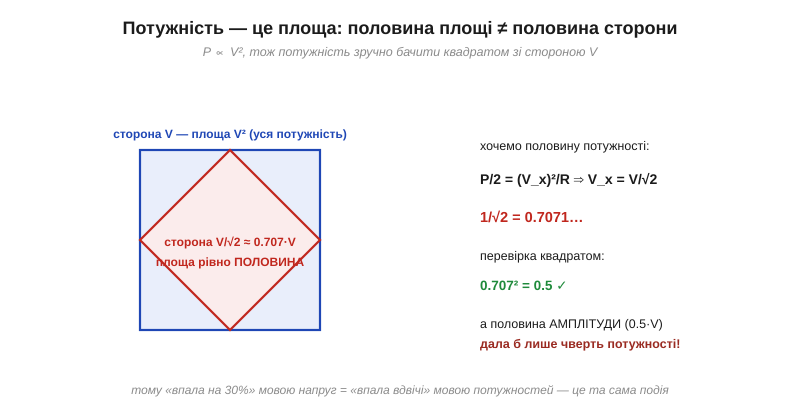
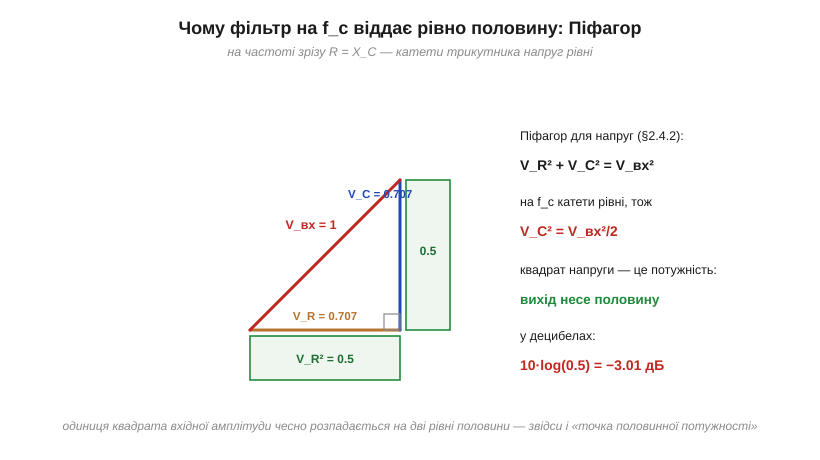

# 🧮 Чому −3 дБ — це половина потужності й 0.707 амплітуди

> Це математична вставка до теми [2.4.6 «Смуга пропускання й точка −3 дБ»](frequency-response.md). Чотири імені однієї точки — «частота зрізу», «−3 дБ», «0.707 амплітуди», «половина потужності» — тема склеїла декретом. Тут розклеїмо й перевіримо: звідки точно береться 1/√2, чому ці числа неминуче ходять парою, чому фільтр на f_c віддає рівно половину — і чим ця точка заслужила роль межі смуги.

### Звідки 0.707: корінь із половини

Потужність росте як **квадрат** напруги: P = V²/R ([§1.3.6](../../block-1-circuits-physics/resistance-power-heat/resistance-power-heat.md)). Тож «зменшити потужність удвічі» означає зменшити напругу зовсім не вдвічі:

```
P/2 = V_x²/R    ⇒    V_x = V/√2 ≈ 0.707·V
```

0.707 — це просто **1/√2**, корінь із одної другої: 0.707² = 0.4999… ≈ 0.5. Квадратичний зв'язок зручно побачити буквально — площею:


*Рис. 2.4.6m.1. Потужність — площа квадрата зі стороною V. Вписаний через середини сторін квадрат має рівно половину площі — а сторону лише в 1.41 раза меншу. «Мінус 30% напруги» і «мінус половина потужності» — одна подія, описана двома мовами.*

Звідси ж і головна пастка-плутанина: **половина амплітуди — це не половина потужності, а чверть** (0.5² = 0.25, тобто −6 дБ). Коли хтось каже «сигнал упав удвічі», завжди перепитуйте: вдвічі *чого*.

### Звідки −3: двічі та сама двійка

Тепер децибели — обома шляхами, потужнісним і напруговим ([§2.4.4](frequency-response.md)):

```
10·log₁₀(1/2)   = −10·log 2 ≈ −3.01 дБ      (мовою потужності)
20·log₁₀(1/√2)  = −20·(½·log 2) = −10·log 2  (мовою напруги — те саме!)
```

Збіг не випадковий: корінь під 20·log дає рівно той самий результат, що половинка під 10·log, — бо обидва записи описують одну фізичну подію, а конвенція «20 для напруг» якраз і придумана, щоб так виходило завжди. Число −3.01 збирається з опорного log 2 ≈ 0.301 ([вставка про логарифми](math-logarithms.md)); округлення до «−3» — єдина неточність у всій цій історії, і вона менша за один відсоток.

### Чому фільтр на f_c віддає рівно половину

Лишилося показати, що RC-фільтр у своєму зрізі справді сидить точно в цій точці. На f_c опори плечей рівні: R = X_C ([§2.4.2](frequency-response.md)). А напруги на R і C складаються під прямим кутом — за Піфагором:


*Рис. 2.4.6m.2. V_R² + V_C² = V_вх². Рівні катети — рівні квадрати: кожен дістає половину квадрата гіпотенузи. Вихід ФНЧ знято з конденсатора — отже, рівно V_вх²/2: половина потужності, 0.707 напруги, −3 дБ. Усе одночасно й без округлень.*

```
V_R² + V_C² = V_вх²        (трикутник напруг, §2.4.2)
на f_c:   V_R = V_C    ⇒    V_C² = V_вх²/2    ⇒    V_C = V_вх/√2
```

Одиниця квадрата вхідної амплітуди **чесно розпадається на дві рівні половини** — і та, що дісталася виходу, і є нашими −3 дБ. Те саме можна прочитати з передавальної функції ([вставка до §2.4.2](math-transfer-function.md)): |H| = 1/√(1+1²) = 1/√2 — катети знаменника зрівнялися.

До речі, цей корінь вам уже траплявся в іншому костюмі: **ефективне значення** синусоїди — теж амплітуда, поділена на √2, і рівно з тієї самої причини: потужність живе у квадраті напруги, а середнє квадрата синуса — половина. Де у формулі з'являється √2 — шукайте поруч квадрат і потужність.

### Чому межу поставили саме тут

«Половина потужності» — конвенція, але загартована трьома аргументами:

- **Енергетична однозначність.** «Половина» не залежить ні від опорів, ні від масштабу сигналу — точку половинної потужності можна виміряти в будь-якому тракті, від антени до динаміка, тим самим способом.
- **Геометрія діаграми.** Для кола першого порядку це рівно та частота, де перетинаються асимптоти ([§2.4.5](frequency-response.md)) — злам ескізу й «чесна» крива розходяться тут на ті самі 3 дБ.
- **Зручна арифметика.** −3 дБ — кругле число драбини: два однакові каскади в зрізі дають −6, чотири — −12; смуги й заглушення складаються в умі ([§2.4.4](frequency-response.md)).

А там, де ці аргументи важать менше за інші вимоги, межу чесно ставлять деінде — згадайте −6 дБ у відеотехніці чи «плоскі» −0.1 дБ у прецизійних трактах із теми.

### Кишеньковий словничок двійників

```
амплітуда 0.707  ↔  потужність 1/2   ↔  −3 дБ     (точка зрізу)
амплітуда 0.5    ↔  потужність 1/4   ↔  −6 дБ     (два каскади в зрізі)
амплітуда 0.1    ↔  потужність 1/100 ↔  −20 дБ    (декада за зрізом ФНЧ)
```

### Де це працює в курсі

Точки половинної потужності розмічають **усі** смуги курсу: межі f₁ і f₂ резонансного контуру, з яких складено Q = f₀/Δf ([§2.3.6](../reactance-resonance/reactance-resonance.md)), — це ті самі −3 дБ; смуга осцилографа і правило t_r ≈ 0.35/BW ([§2.4.6](frequency-response.md)) означені через неї ж; і коли в даташиті підсилювача чи давача написано просто «bandwidth», за замовчуванням ідеться про половину потужності. Тепер ви знаєте, чому це число всюди те саме: квадрат, половинка і логарифм двійки — три константи природи інженерної арифметики.
