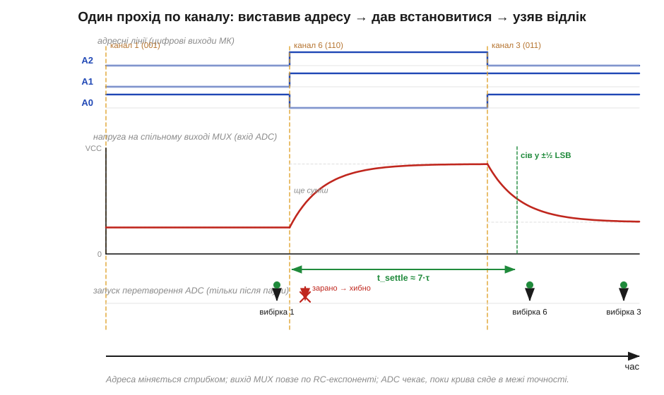

# ⚙️ Сканування входів через мультиплексор: адресні біти, час встановлення, порядок опитування

> Це алгоритмічна вставка до теми [2.12.6 «Аналогові ключі й мультиплексори»](legendary-analog-ics.md). Тема показала сам прилад: один аналоговий мультиплексор (*analog multiplexer*, MUX) класу 4051 під'єднує до спільного виходу один із кількох входів — той, чий номер задано адресними бітами. Тут — **як цим користуватися в циклі**: один аналого-цифровий перетворювач (*ADC*) мікроконтролера читає вісім давачів по черзі. Питання лише здаються дрібними — у якому порядку бігти по каналах, скільки чекати після зміни адреси, коли саме брати відлік. Помилитися в будь-якому — і отримаєш числа, у яких сусідні канали «протікають» один в одного.

### Задача

Каналів багато, а точний вимірювальний вхід — один. У мікроконтролера зазвичай обмаль ніжок з ADC, а тих самих фоторезисторів, термісторів чи потенціометрів — вісім, шістнадцять. Ставити вісім окремих перетворювачів дорого й безглуздо: давачі повільні, читати їх «одночасно» не потрібно. Розумніше поставити один мультиплексор-комутатор, завести всі вісім сигналів на його входи, спільний вихід — на єдиний вхід ADC, а три цифрові ніжки мікроконтролера — на адресні входи A0…A2. Тепер опитування — це програмний цикл: «вибери канал → заміряй → запиши → наступний».

Уся хитрість у тому, що між «вибрав» і «заміряв» **не можна міряти зразу**. Аналоговий ключ — не ідеальний дріт: у нього є опір у відкритому стані (*on-resistance*, Rₒₙ) у сотні ом ([§2.12.6](legendary-analog-ics.md)), а вхід ADC — це невеликий конденсатор вибірки, який ще треба перезарядити з рівня попереднього каналу до рівня нового. Поки він не перезарядиться — ADC побачить суміш старого й нового. Тож алгоритм по суті крутиться навколо однієї паузи: **час встановлення** (*settling time*).

### Ідея: вибрати, дати встановитися, аж тоді брати відлік

Один прохід по каналу розпадається на три кроки, і середній — головний:

1. **Вибрати канал** — виставити на A0…A2 двійковий номер. Для каналу 5 це `101`: A2=1, A1=0, A0=1.
2. **Зачекати** `t_settle` — поки вихід мультиплексора (і конденсатор вибірки ADC) дійде до напруги нового каналу.
3. **Узяти відлік** — лише тепер запустити перетворення ADC і прочитати результат.


*Рис. 2.12.6a.1. Часова діаграма опитування. Зверху — три адресні лінії, що міняються стрибком при переході на новий канал. Посередині — напруга на спільному виході мультиплексора: вона не стрибає, а підповзає по експоненті від рівня попереднього каналу до рівня нового (стала часу ≈ Rₒₙ·C). Запуск ADC (стрілка внизу) має чекати, поки крива «сяде» в межі точності — інакше відлік буде сумішшю двох каналів.*

Чому вихід повзе, а не стрибає? Бо спільний вузол має ємність (вхідна ємність ADC, ємність ключів, монтаж), а живиться через опір відкритого ключа Rₒₙ. Це знайома RC-ланка: напруга йде по експоненті зі сталою часу τ ≈ Rₒₙ·C. За один τ вона долає 63% шляху, за 5τ — 99.3%, за 7τ — 99.9%. Скільки τ закладати — залежить від того, скільки бітів ADC ви хочете отримати чесними.

### Псевдокод

```
# Опитати N каналів мультиплексора одним ADC
для ch у порядку_сканування:        # див. нижче про порядок
    A0 ← bit0(ch);  A1 ← bit1(ch);  A2 ← bit2(ch)   # виставити адресу
    чекати t_settle                  # головна пауза: вихід MUX має «сісти»
    raw ← ADC_зчитати()              # власне перетворення
    значення[ch] ← raw

# Скільки чекати: t_settle = k·τ,  τ ≈ (Rₒₙ + R_джерела)·C_вузла
# k обираємо за потрібною точністю в бітах:
#   k ≈ (n+1)·ln 2     →   8 біт ≈ 6.2·τ,   10 біт ≈ 7.6·τ,   12 біт ≈ 9.0·τ
```

Корінь формули для k — у тому, скільки сталих часу треба, щоб залишкова похибка стала меншою за половину молодшого розряду (½ LSB):

```
e^(−k) < 1 / 2^(n+1)   ⇒   k > (n+1)·ln 2
```

тобто на кожен зайвий біт точності — приблизно +0.69·τ паузи. Дешево, але нехтувати не можна.

### Який порядок опитування

Розмір паузи ми вже прив'язали до точності; та є ще один важіль, який на неї впливає, — у якому порядку обходити канали, бо від цього залежить, наскільки великий стрибок напруги доводиться «гасити» на кожному кроці. Найпростіший порядок — лінійний: 0,1,2,…,7 по колу. Він хороший, поки сусідні канали мають близькі напруги. Проблеми починаються, коли поряд опиняються канал біля живлення (≈ VCC) і канал біля нуля: на стрибку «майже 0 → майже VCC» конденсатору вибірки треба перезарядитися на весь діапазон, і тут брак паузи кусає найболючіше — лишок старого, високого рівня додається до нового, низького. Це й є **перехресне просочування** (*crosstalk*) між каналами по часу. Тож якщо є вибір, сусідами в черзі краще ставити канали зі схожими рівнями, а великі стрибки — розводити.

Окремий випадок — коли один канал треба читати **частіше** за інші (скажімо, основний давач опитуємо щоразу, а решту — по колу між ними): порядок стає `0, k, 0, k+1, 0, k+2, …`. Це нормальна практика; головне — пам'ятати, що після **кожного** перемикання знову потрібна повна пауза `t_settle`.

### Складність і пастки на МК

Обчислювально цикл копійчаний — O(N) на повний прохід, без множень: уся «вартість» сидить у сумі пауз `N·t_settle` плюс час самих перетворень. Тож і справжні пастки тут не в коді, а в аналоговому боці:

**Найчастіша помилка — міряти одразу після зміни адреси.** Перші проєкти майже завжди «економлять» паузу — і дивуються, чому показ каналу залежить від того, який канал читали перед ним. Це класична ознака браку `t_settle`: значення «тягне» до сусіда. Лікування — порахувати τ за реальними Rₒₙ і ємністю та витримати потрібну кількість τ.

**Високоомне джерело множить паузу.** У формулу τ входить не лише Rₒₙ мультиплексора, а й опір самого давача (`R_джерела`). Дільник на мегаомному фоторезисторі чи термісторі дає τ у мікросекунди й більше — пауза мусить вирости пропорційно. Якщо це болить, перед мультиплексором (або після нього) ставлять буфер-повторювач на ОП ([§2.8.5](../opamp-comparator/opamp-comparator.md)): він має низький вихідний опір і «заряджає» вузол швидко.

**Просочування й заборонені комбінації.** У реальному ключі є струми витоку й паразитні ємності між каналами — закритий канал із великим сигналом потроху «підмішується» у відкритий; ще одна причина не економити паузу. Окремо: у мультиплексора є вхід дозволу (*enable*); поки міняєте адресу, корисно його тримати в стані, що не даватиме «майнути» проміжний канал, перш ніж адреса встоялась.

**Адресні лінії теж не миттєві.** Якщо A0…A2 ідуть через довгі доріжки чи послідовно-паралельний розширювач, самій адресі теж треба час встояти, **перш ніж** почне рахуватися `t_settle` мультиплексора. Виставили адресу — спершу дайте їй дійти, аж потім відлічуйте паузу встановлення.

**Сигнал має лежати в межах живлення ключа.** Аналоговий мультиплексор пропускає лише напруги між своїми шинами живлення; вийти за них — отримати спотворення або пошкодження. Усі вхідні сигнали мусять бути в дозволеному діапазоні — це межа приладу, а не алгоритму, але про неї забувають саме під час «швидкого» сканування.

> 🔧 **Навіщо це.** Сканування мультиплексором — це майже завжди те, як один ADC мікроконтролера обслуговує цілу грядку давачів. Запам'ятайте ритм одного каналу: **виставив адресу → дав встановитися → аж тоді міряй**, а паузу бери з запасом — приблизно (n+1)·ln 2 сталих часу RC-вузла на n бітів точності. Найдорожча помилка тут безкоштовна на вигляд: пропущена пауза не ламає компіляцію й не вішає програму — вона тихо домішує сусідній канал у ваші покази, і ви довго шукатимете «плаваючий» давач там, де насправді бракує кількох мікросекунд очікування.
