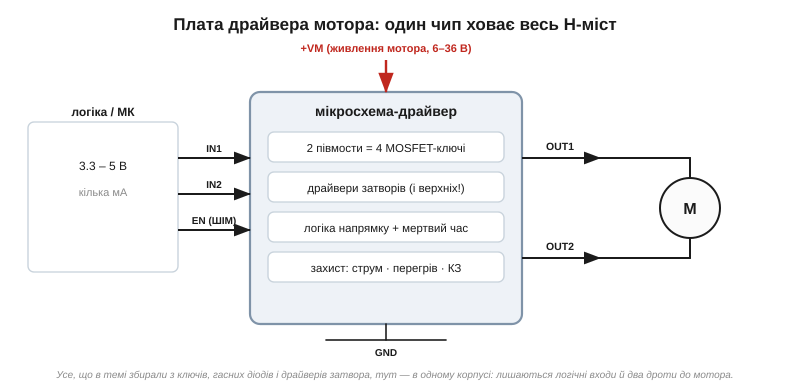
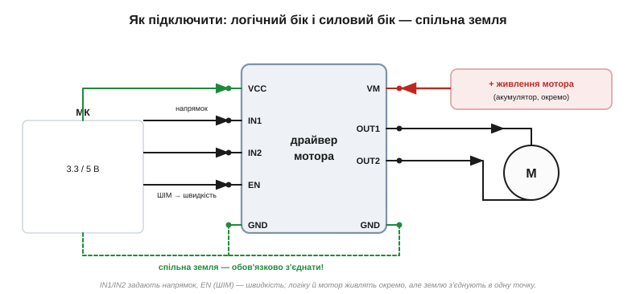

# 🔌 Плата драйвера мотора: L298-клас і сучасні MOSFET-драйвери

> Це компонентна вставка до теми [2.7.10 «H-міст»](mosfet.md). Тема показала чотири ключі, діагоналі напрямку й смертельну заборону наскрізного струму. На практиці H-міст майже ніколи не паяють із голих транзисторів — беруть готову **мікросхему-драйвер** на платі. Тут — що на тій платі насправді, чим класичний L298 відрізняється від сучасних MOSFET-драйверів і як до неї підключитися трьома дротами.

### Що це за клас пристроїв

[**Драйвер мотора**](book:components/dc-motor-driver) — це інтегрований H-міст (часто навіть два, щоб крутити одразу два мотори) разом з усією обв'язкою в одному корпусі. Він приймає від мікроконтролера слабкі **логічні** сигнали, а комутує силовий струм мотора — рівно те розділення «мозок окремо, м'язи окремо», заради якого транзистор-ключ і існує.

### Що ховається на платі

*Рис. 2.7.10c.1. Чип ховає весь H-міст: два півмости (чотири ключі), драйвери затворів (зокрема для верхніх ключів — найхитріша частина), логіку напрямку з мертвим часом і захист від надструму, перегріву та короткого. Назовні — логічні входи від МК, окреме живлення мотора +VM і два дроти OUT1/OUT2 до самого мотора.*

Усе, що тема збирала по цеглинці — чотири ключі, гасні діоди, драйвери затвора, дисципліну мертвого часу, — на платі вже зведено всередині однієї мікросхеми. Часто поряд ставлять і маленький стабілізатор на 5 В (живити логіку від того ж акумулятора), світлодіоди-індикатори та гвинтові клемники під товсті дроти мотора.

### L298-клас проти сучасних MOSFET-драйверів

Тут і ховається головний практичний вибір. Класика — **L298-клас**: дешевий, простий, усюдисущий, але всередині в нього **біполярні** дарлінгтони. А вони, як ми рахували в темі, тримають падіння близько 2 В на плече: на струмі 2 А це вже ватти тепла, тож такий модуль гарячий і вимагає радіатора, та ще й «з'їдає» зі живлення ті 2 В — мотор недоотримує напруги. **Сучасні** драйвери будують на **MOSFET** з малим Rds(on): падіння — копійки, чип лишається холодним (ті самі ≈0.18 Вт замість ватів із теми), частота ШІМ вища, а захист і вимірювання струму вбудовані. L298 досі живий через ціну й невибагливість, але де важать ефективність і нагрів — беруть MOSFET-клас.

### Розпіновка й підключення

*Рис. 2.7.10c.2. Два боки. Логічний: VCC (живлення логіки 3.3/5 В), IN1/IN2 (напрямок), EN (дозвіл і ШІМ-швидкість), GND. Силовий: VM (окреме живлення мотора), OUT1/OUT2 (до мотора), GND. Найважливіше — **землі обох боків з'єднують в одну точку**, інакше керування «висить у повітрі».*

Логіку й мотор живлять **окремо**: мотор хоче більшого вольтажу й амперів, логіка — тихих 3.3–5 В. А ось земля мусить бути **спільною** — це опорна точка, відносно якої чип читає логічні рівні.

### Перший «байт»: як заговорити

Керування простіше, ніж здається: два біти напрямку плюс один канал ШІМ на кожен мотор. `IN1=1, IN2=0` — вперед; `IN1=0, IN2=1` — назад; `IN1=IN2` — гальмо; `EN=0` — вільний вибіг. Швидкість задають **шпаруватістю ШІМ** на вході EN — рівно зведена таблиця керування з теми, лише виведена на роз'єм.

### Типові граблі

Найчастіша помилка новачка — **не з'єднати землі**: усе ніби підключено, а мотор смикається або мовчить. Друга — повісити L298 без радіатора й дивуватися, чому він пече пальці. Третя — живити логіку від високого VM через дешевий вбудований стабілізатор: той перегрівається. І не лишайте вхід EN «висіти» без підтяжки — мотор реагуватиме на наводки.

### Варіації класу

Один чип — два H-мости, тож або **два** щіткові мотори, або **один кроковий** (по мосту на обмотку — той самий, що в [ULN-вставці](../bjt/comp-darlington-uln.md)). **Три** півмости в корпусі — це вже драйвер безколекторного (BLDC) мотора. А далі — лише питання калібру: від копійчаного модуля на пів-ампера до тягових драйверів на десятки ампер. «Дорослі» драйвери ще й розмовляють із МК по SPI чи I²C, повертаючи діагностику — струм, температуру, аварії.

> 🔧 **Навіщо це.** Береш драйвер мотора — пам'ятай: це готовий H-міст із теми, паяти нічого не треба. Обери MOSFET-клас, якщо важать нагрів і ефективність, і L298-клас, якщо головне ціна. Підключи логіку (IN1/IN2 — напрямок, EN — ШІМ-швидкість) та окреме живлення мотора, **обов'язково з'єднавши землі**. І рахуй струм мотора під пусковий момент — він у рази більший за робочий, і дешевий модуль на ньому може здатися.
