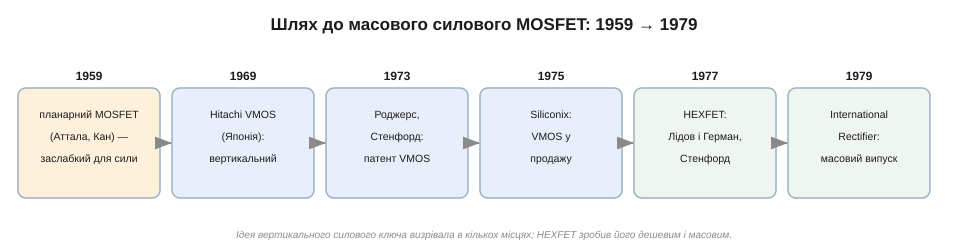
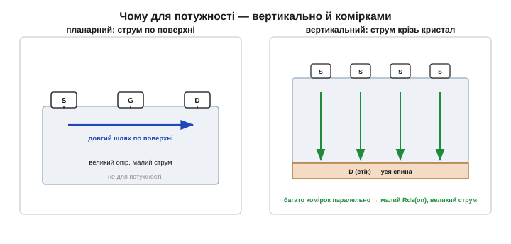
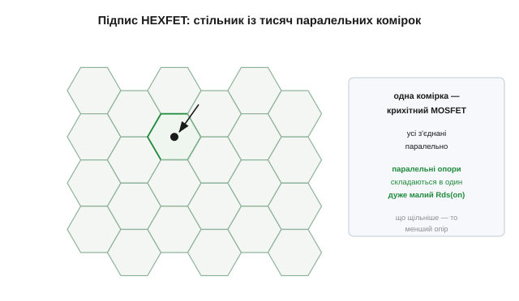
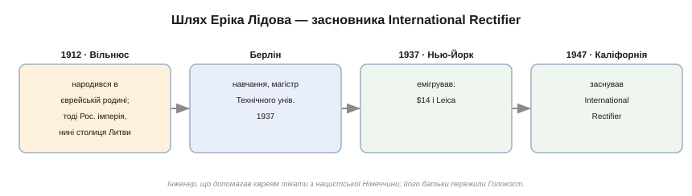

# 📜 Історія до §2.7.5 — HEXFET: як силовий MOSFET став масовим

> Це історична вставка до [§2.7.5 «Опір відкритого каналу Rds(on)»](mosfet.md). Уся та тема — про одне число: малий опір відкритого ключа, заради якого MOSFET і витіснив біполярний у силовій електроніці. Але цей малий Rds(on) не впав із неба. Звичайний, «плоский» MOSFET 1959 року силу тягнути **не вмів** зовсім. Знадобилося майже двадцять років і кілька різних команд по обидва боки океану, щоб перетворити лабораторну дрібничку на дешевий силовий ключ, який нині стоїть у кожному зарядному, моторі й перетворювачі. І, всупереч рекламним гаслам, зробила це не одна людина.

Це історія про те, як ідея «вертикального» транзистора визрівала одночасно в Японії та Каліфорнії, як хитра **шестикутна** комірка дала йому рекордно малий опір — і про інженера, що приїхав до Америки з чотирнадцятьма доларами й фотоапаратом, а заснував фірму, яка цей ключ випустила у світ.

*Рис. 2.7.5і.1. Дорога була не стрибком одного генія, а естафетою. Планарний MOSFET (1959) сили не тягнув; вертикальний VMOS народжувався в Hitachi (1969), у патенті стенфордського студента (1973) і в продукції Siliconix (1975); а коміркова HEXFET-структура Лідова й Германа (1977) зробила силовий ключ масовим у руках International Rectifier (1979).*

---

## Проблема: плоский транзистор не тягне силу

Згадаймо будову звичайного MOSFET ([§2.7.2](mosfet.md)): усе зроблено **плоско** на поверхні кристала — витік, затвор і стік лежать поряд, а струм біжить тонким каналом **уздовж** поверхні від витоку до стоку. Для логіки це чудово: транзистор крихітний, їх можна тіснити мільярдами. Але для **сили** така будова безнадійна.

По-перше, увесь струм продирається вузеньким приповерхневим каналом — а це великий опір, тобто на серйозному струмі ключ одразу розжарюється (рівно та грійка з [§2.7.5](mosfet.md)). По-друге, висока напруга стоку «пробила» б короткий проміжок між стоком і витоком на поверхні. Плоский MOSFET тримає малі напруги й малі струми — і для потужності не годиться.

*Рис. 2.7.5і.2. Ліворуч — планарний: струм повзе по поверхні довгим шляхом, опір великий. Праворуч — рятунок: пустити струм **вертикально**, крізь товщу кристала (стік — уся спина пластини), і поставити **багато** таких коротких каналів **паралельно**. Короткий шлях плюс тисячі паралельних доріжок — і сумарний опір падає, а допустимий струм зростає.*

Вихід підказувала сама фізика паралельних опорів. Якщо канал зробити **коротким** і **вертикальним** — пустити струм згори вниз крізь кристал, де стоком слугує вся зворотна сторона пластини, — шлях коротшає, а напругу тримає товща кремнію. А якщо таких вертикальних транзисторів-крихіток наробити на одному кристалі **тисячі** й з'єднати **паралельно**, їхні маленькі опори складуться в один зовсім малий. Це і є рецепт силового MOSFET: вертикально й багато.

А приз був великий — і саме тому за нього взялися одразу кілька команд. Доти силу комутували **біполярними** силовими транзисторами, але ті мали кляті вади ([§2.6](../bjt/bjt.md)): у базу доводилося весь час лити чималий струм, перемикалися вони повільно, а головне — потерпали від **вторинного пробою**, коли струм підступно збирався в одну гарячу цятку й пропалював кристал. Силовий MOSFET обіцяв усе протилежне: керування **напругою** майже без струму, швидке перемикання й жодного вторинного пробою. Хто навчиться робити такий ключ **дешево й надійно**, той забере силову електроніку собі. За цей приз наприкінці 1970-х і змагалися.

## Вертикальний поворот: VMOS

Першими вертикаль спробували в **Японії**. Ще 1969 року в **Hitachi** запропонували вертикальний польовий прилад; а в 1970-х оформилася структура **VMOS** — із характерною канавкою у формі літери «V», прорізаною в кремнії, по стінках якої й ішов короткий вертикальний канал. Помітний слід лишив і **Т. Дж. Роджерс** *(T. J. Rodgers)*: ще студентом Стенфорда він подав 1973 року патент на VMOS (згодом Роджерс заснував Cypress Semiconductor). А 1975 року фірма **Siliconix** вивела VMOS на ринок; приблизно тоді ж японські аудіокомпанії — JVC, Pioneer, Sony, Toshiba — почали ставити силові польові транзистори у високоякісні підсилювачі, бо ті звучали чистіше за біполярні.

Варто чесно розрізнити внески, бо легенда любить спрощувати. **Ідею** вертикального силового MOS висунули в Японії; **патент** на конкретну VMOS-структуру здобув стенфордський студент; **у продаж** її вивела Siliconix. Жоден із цих кроків не був «винайденням силового MOSFET» цілком — це була естафета. А сама VMOS виявилася не ідеальною: гостре дно V-канавки концентрувало електричне поле й створювало проблеми з надійністю та виробництвом. Потрібен був кращий спосіб нарізати ті тисячі вертикальних комірок.

Кращий спосіб полягав у тому, щоб **відмовитися від гострої канавки** взагалі. Замість прорізати V-подібний жолоб, навчилися робити комірку **плоско** на поверхні, але зі струмом, що однаково стікає вертикально вниз. Хитрий прийом **подвійної дифузії** (звідси й назва DMOS) сам, без надточного суміщення масок, формував коротенький канал на краю комірки, а струм збігав крізь товщу кремнію до стоку на споді пластини. Так народилася структура **VDMOS** — вертикальний MOSFET без ламкої канавки, набраний із безлічі однакових пласких комірок. HEXFET якраз і був такою комірковою VDMOS-структурою, тільки з комірками у формі шестикутника.

## HEXFET: стільник

Кращий спосіб знайшовся у Стенфорді 1977 року. Двоє — **Алекс Лідов** *(Alex Lidow)* і **Том Герман** *(Tom Herman)* — придумали розкласти силовий MOSFET на **шестикутні** комірки, щільно складені, мов бджолиний стільник. Кожна шестикутна комірка — це окремий крихітний вертикальний MOSFET; усі вони з'єднані паралельно, і тисячі їхніх дрібних опорів складаються в один **дуже малий** загальний Rds(on). Шестикутник тут не примха: він укладається в площину щільніше за квадрат, тож на тому самому кристалі вміщається більше комірок — а отже, ще менший опір.

*Рис. 2.7.5і.3. Фірмова прикмета HEXFET — шестикутні комірки. Кожна — окремий крихітний MOSFET; усі ввімкнені паралельно, тож їхні опори складаються в один зовсім малий Rds(on). Що щільніше вдається спакувати комірки, то меншим стає опір — у цьому й була інженерна перемога.*

Цю структуру комерціалізувала каліфорнійська фірма **International Rectifier (IR)**: серію назвали **HEXFET** (від «hexagonal»), і на ринок її вивели **1979 року**. HEXFET став флагманом IR на десятиліття — приклад того, як вдала **виробнича** ідея, а не лише фізична, вирішує долю приладу: тих самих транзисторів навчилися робити дешево, надійно й мільйонами. До слова, Алекса Лідова часом називають «винахідником силового MOSFET» — це красива, але надто спрощена етикетка: він із Германом винайшов саме **HEXFET**, шестикутну коміркову версію, що стала масовою, а сам клас силового MOSFET, як ми бачили, мав багатьох попередників.

## Людина за фірмою: Ерік Лідов

А чому HEXFET потрапив саме до International Rectifier? Бо фірму заснував **батько** Алекса — **Ерік Лідов** *(Eric Lidow)*, і його шлях вартий окремої згадки, надто ж тому, що його легко переказати неточно.

Ерік Лідов народився **1912 року у Вільнюсі**, у **єврейській** родині. Місто тоді входило до Російської імперії (Віленська губернія), а нині це столиця незалежної **Литви** — тож називати Лідова просто «росіянином» було б помилкою: точніше — єврейський інженер, народжений у Вільні. Освіту він здобув у **Берліні**, у тамтешньому Технічному університеті, отримавши 1937 року диплом магістра. У Берліні ж, уже за нацистів, він допомагав євреям утікати з Німеччини. Того ж 1937-го Лідов емігрував до США — приїхав до Нью-Йорка, як переказують, із **чотирнадцятьма доларами й фотоапаратом Leica** в кишені.

*Рис. 2.7.5і.4. Вільнюс (1912) → Берлін (магістр, 1937) → Нью-Йорк (емігрував, 1937) → Каліфорнія (заснував International Rectifier, 1947). Шлях інженера-біженця, який допомагав іншим тікати від нацизму й чиї батьки пережили Голокост.*

В Америці Лідов спершу заснував у Лос-Анджелесі компанію селенових випрямлячів, а 1946 року розшукав і перевіз до США батьків, що пережили Голокост. Наступного, **1947 року**, він разом із батьком **Леоном** заснував **International Rectifier** — фірму, що спершу робила **селенові випрямлячі** (ті самі прилади, що перетворюють змінний струм на постійний, [§2.5](../diode-pn-junction/diode-pn-junction.md)); звідси й назва. Саме ця родинна фірма за три десятиліття доросла до того, щоб випустити у світ HEXFET — який винайшов уже **син** засновника, американський інженер Алекс Лідов, що згодом і сам очолив International Rectifier, а пізніше заснував компанію EPC, яка робить транзистори на нітриді галію.

## Чому це важить

Уся [§2.7.5](mosfet.md) крутиться навколо малого Rds(on) — і саме HEXFET перетворив цей малий опір із лабораторної обіцянки на дешевий товар. Коли силовий MOSFET став **масовим**, він і витіснив біполярний ключ із більшості силових застосувань: холодний, керований напругою, швидкий — і тепер ще й дешевий. Його нащадки — у драйверах моторів, імпульсних блоках живлення, зарядних USB, інверторах сонячних панелей; шестикутні (та згодом смугові й траншейні) комірки живуть у кожному з них.

Цифри підтвердили ставку: уже до 1983 року HEXFET-чипи приносили International Rectifier близько **127 мільйонів доларів** на рік — і це був лише початок. Упродовж 1980-х силовий MOSFET крок за кроком забирав собі блоки живлення, приводи, автомобільну й побутову електроніку, а інженери далі вилизували ту саму комірку — робили її дрібнішою й переходили від пласких комірок до **траншейних** (із затвором у вузькій вертикальній канавці), щоб напхати ще більше каналу на той самий кристал і ще збити Rds(on). Гонитва за малим опором, з якої почалася ця історія, триває й донині.

І головний урок цієї історії — не про одну людину. Силовий MOSFET виріс із **колективної** праці кількох країн і команд: японської ідеї вертикалі, стенфордських патентів, продукції Siliconix, шестикутної комірки Лідова й Германа та виробничої впертості International Rectifier. Як і [сама ідея польового транзистора чекала тридцять років](hist-mosfet.md), а [КМОН — двадцять](hist-cmos.md), силовий MOSFET став собою не в мить осяяння, а крок за кроком, у багатьох руках. Найкращі прилади в електроніці майже завжди такі.
