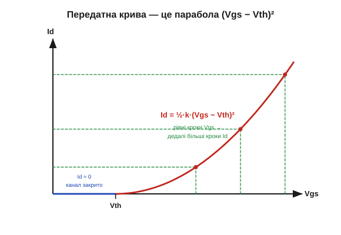
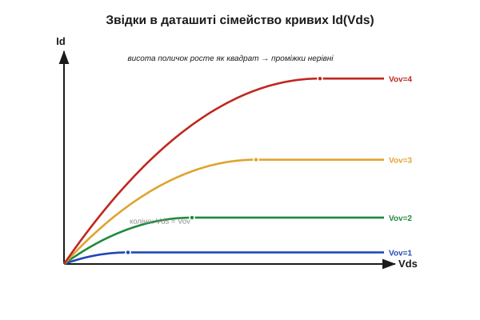

# 🧮 Квадратичний закон: звідки беруться криві в даташиті MOSFET

> Це математична вставка до теми [2.7.3 «Поріг і канал»](mosfet.md). Тема показала передатну криву **якісно**: до порога Vth струму майже нема, за порогом він швидко зростає. Тут — точна формула цієї кривої, чому вона саме **парабола**, а не пряма, і як із одного простого закону випливає все сімейство характеристик, що друкують у паспорті транзистора.

### Головна змінна — перевищення порогу

З теми ми вже знаємо: важить не сама Vgs, а на скільки вона перевищує поріг. Цю різницю — **перевищення порогу** (overdrive) — позначимо Vov:

```
Vov = Vgs − Vth
```

Поки Vov < 0 (тобто Vgs нижча за поріг) — каналу нема, струм майже нульовий. Щойно Vov > 0 — канал відкрився, і саме Vov керує тим, **наскільки** добре він проводить.

### Чому квадрат, а не пряма

Інтуїція проста, якщо помітити, що від перевищення порогу залежать **дві** речі одразу. По-перше, скільки рухомих електронів затвор стягнув у канал: цей заряд зростає прямо пропорційно Vov — більше перевищення, густіший шар. По-друге, напруга, що жене ці електрони вздовж каналу від витоку до стоку: на межі насичення вона теж сягає приблизно Vov. А струм — це заряд, помножений на те, **як швидко** його проштовхують. Два множники, кожен пропорційний Vov, дають у добутку **квадрат**. Звідси й парабола.

### Формула насичення

У робочому режимі (насичення) закон має вигляд:

```
Id = ½ · k · (Vgs − Vth)²        (Vgs > Vth)
Id ≈ 0                            (Vgs < Vth)
```

Тут **k = μ · Cox · (W/L)** — «крутість» приладу (одиниці А/В²): рухливість носіїв μ, ємність затвора на одиницю площі Cox і відношення ширини каналу до довжини W/L. Усе це вшито в геометрію й матеріал транзистора — тобто k є його паспортною рисою, як і Vth. Коефіцієнт ½ — просто стала з виведення.


*Рис. 2.7.3m.1. Передатна крива з формули: до Vth — нульова поличка, за порогом — парабола. Ключове видно одразу: **рівні** кроки Vgs дають **дедалі більші** кроки Id. Біля порога струм лінується, далі росте все стрімкіше — тому «трохи додати на затвор» поблизу Vth означає сильно змінити струм.*

### Дві області: то резистор, то джерело струму

Формула вище — для насичення, коли стік «відірваний» високою напругою. Але при **малій** Vds той самий MOSFET поводиться як **резистор** — це і є опір відкритого ключа Rds(on) із [§2.7.5](mosfet.md). Повний закон має дві гілки:

```
Id = k · [ (Vgs−Vth)·Vds − Vds²/2 ]   (Vds < Vov — тріодна, «резистор»)
Id = ½ · k · (Vgs−Vth)²               (Vds ≥ Vov — насичення, «джерело струму»)
```

Перехід («коліно») стається при Vds = Vov: до нього струм росте з напругою (резистивна гілка), після — вирівнюється в поличку, майже не залежну від Vds.

### Звідки сімейство кривих у даташиті

Тепер зрозуміло, **звідки** беруться ті криві в паспорті. «Вихідні характеристики» — це Id залежно від Vds, по одній кривій на кожне значення Vgs — є просто цей закон, накреслений для кількох напруг затвора:


*Рис. 2.7.3m.2. Кожна крива: підйом (тріодна гілка) → поличка (насичення) на висоті ½·k·Vov². Оскільки висота полички росте як **квадрат** перевищення, рівні кроки Vgs дають нерівні проміжки — криві тиснуться внизу й розходяться вгорі. А передатна крива (Рис. 2.7.3m.1) — це зріз цього ж сімейства по висотах поличок.*

### Крутість gm — наскільки сильно затвор керує струмом

Нахил передатної кривої має власну назву — **крутість** (transconductance) gm. Продиференціювавши квадратичний закон:

```
gm = dId/dVgs = k · (Vgs − Vth) = √(2 · k · Id)
```

Звідси два висновки. Крутість **зростає з перевищенням порогу** — що далі від Vth, то стрімкіша крива, то сильніше затвор керує струмом. І вона зростає як **корінь зі струму** — більший робочий струм дає більшу крутість. Це і є міра підсилювальної здатності MOSFET: наскільки мала зміна напруги на затворі ворушить струм стоку.

### Де це працює в курсі

Квадратичний закон — це **перша**, ідеалізована модель, але вона пояснює майже все, що ми бачимо. Тріодна гілка — це Rds(on) ([§2.7.5](mosfet.md)): малий опір відкритого ключа виходить при великому перевищенні й малій Vds. Вона ж показує, чому MOSFET логічного рівня ([§2.7.6](mosfet.md)) такий важливий — щоб дістати велике перевищення (а отже, малий опір) від низької напруги керування, поріг мусить бути низьким. Варто лише пам'ятати межу моделі: на великих струмах реальна крива пологішає — рухливість падає, додається опір виводів, — тож паспортні графіки трохи відхиляються від чистої параболи. Але як **картина в голові** квадратичний закон безвідмовний: затвор задає перевищення, перевищення в квадраті задає струм.
