# Розділ 2.7 — Польовий транзистор (MOSFET)

[Розділ 2.6](../bjt/bjt.md) дав нам біполярний транзистор — прилад, у якому **малий струм керує великим**. Він чудовий, але має вроджену рису: щоб тримати його відкритим, у базу доводиться **весь час лити струм**. Тепер — інший транзистор, із іншою філософією: **польовий** *(field-effect transistor, FET)*. Ним керують не струмом, а **електричним полем** — по суті, **напругою**, що майже не потребує струму. Ця одна відмінність робить його таким економним і таким масовим, що саме з нього зроблено кожен процесор і кожну комірку пам'яті у світі. Як ця ідея народилася й тридцять років чекала втілення — у [📜 історії до розділу](hist-mosfet.md); тут почнімо з самої суті.

## 2.7.1 Інша ідея: керувати струмом полем, а не струмом

### Дві філософії керування

Згадаймо, як працює біполярний транзистор ([§2.6.3](../bjt/bjt.md)): крізь базу тече невеликий струм Ib, і він «відмикає» у багато разів більший струм колектора, Ic = β·Ib. Керування — **струмом**: щоб транзистор пропускав струм, у його базу мусить **постійно** надходити свій, менший струм. Прибрав струм бази — закрився. Це **струмокерований** прилад.

Польовий транзистор питає інакше: а що, як керувати струмом **не другим струмом, а полем**? Уявімо брусок напівпровідника, крізь який може текти струм, і поруч — електрод, на який ми подаємо **напругу**. Заряд на електроді створює **електричне поле**; це поле проникає в напівпровідник і змінює, скільки в ньому вільних носіїв, а отже — наскільки добре він проводить. Більше поле — ширший провідний шлях, більший струм; прибрали поле — шлях зник. Керування — **напругою**, і головне: щоб **тримати** поле, струму майже не треба, бо поле тримає нерухомий заряд задарма. Це **напругокерований** прилад.

Ідея ця, до речі, не нова: саме її 1925 року запатентував Юліус Лілієнфельд ([📜 історія до розділу](hist-mosfet.md)). Але збудувати робочий прилад змогли аж за тридцять років — коли навчилися вгамовувати поверхню напівпровідника шаром скла. Принцип же лишився той самий, що ми щойно описали словами.

Сама назва каже про це: **польовий** — бо керує **поле**; ефект впливу поля на провідність так і звуть **польовим ефектом** *(field effect)*.


*Рис. 2.7.1.1. Зліва — біполярний: щоб текли Ic, у базу весь час іде Ib. Справа — польовий: канал відмикає поле від напруги на затворі, а струму в керування майже не треба. Та сама мета — керувати великим струмом, — але різні «педалі».*

> 🔧 **Навіщо це.** Чому це не дрібна різниця, а ціла революція? Бо «керувати майже задарма» означає, що **мільярд** таких ключів можна тримати ввімкненими, не платячи за це струмом. Саме тому з польових транзисторів зробили цифрову техніку: процесор має мільярди ключів, і якби кожен, як біполярний, безперервно тягнув струм керування, чип би просто розплавився. Поле замість струму — ось чому MOSFET зміг те, чого не зміг біполярний.

Польових транзисторів є **два роди**. У **JFET** *(junction FET)* затвор відділено від каналу зворотно зміщеним p-n переходом ([§2.5.4](../diode-pn-junction/diode-pn-junction.md)); у **MOSFET** *(metal-oxide-semiconductor FET)* — тонким шаром ізолятора, скла. Обидва керуються полем, але саме MOSFET, з його повністю **ізольованим** затвором, став основою всієї цифрової техніки — тож у цьому розділі ми зосередимось на ньому. Сама абревіатура MOSFET описує будову (метал–оксид–напівпровідник), і ми розберемо її пошарово в [§2.7.2](mosfet.md).

### Клапан, який тримає магніт

Пригадаймо водяну аналогію з [§2.6.1](../bjt/bjt.md). Біполярний транзистор там був як кран, що його треба **тримати рукою**: відпустив — зачинився; а тримати — означає весь час докладати зусилля (струм). Польовий транзистор — це кран, заслінку якого тримає **електромагніт**. Подав напругу — магнітне поле підняло заслінку, і вода (струм) тече. І ось ключове: **щоб тримати заслінку піднятою, магнітові не треба нічого «лити»** — він тримає її одним лише полем, скільки завгодно довго, майже не споживаючи енергії. Прибрав напругу — поле зникло, заслінка впала, потік спинився.

Ця аналогія схоплює суть: керування **присутністю поля**, а не **потоком** чогось. Поставити поле — коштує лиш мить, а тримати його — задарма. Саме ця властивість, «постав і забудь», і відрізняє польове керування від біполярного, де руку з крана не можна прибрати ні на секунду, поки потрібен потік.

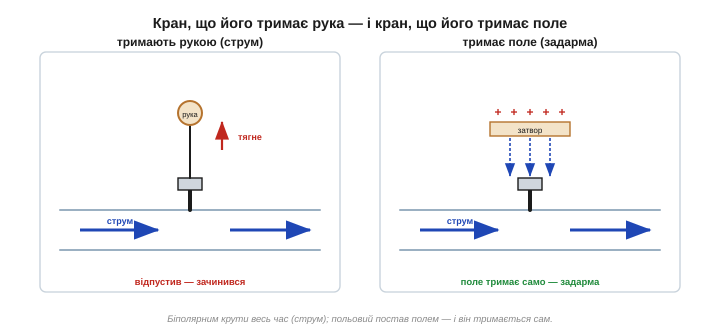
*Рис. 2.7.1.2. Біполярний — кран, що його тримають рукою: відпустив — зачинився, тримати = докладати струм. Польовий — кран із «магнітною» заслінкою: поле тримає її задарма. Поставити поле — мить; тримати — нічого не коштує.*

### Три виводи: затвор, стік, витік

У польового транзистора, як і в біполярного, **три виводи** — але звуться інакше й роблять інше:

- **Затвор** *(gate, G)* — керівний електрод, та сама «заряджена пластина». Це аналог бази, але керує **полем**.
- **Стік** *(drain, D)* — вивід, **куди** стікає робочий струм. Грубо — аналог колектора.
- **Витік** *(source, S)* — вивід, **звідки** робочий струм виходить (його ще звуть **джерелом**, бо звідти «беруться» носії). Грубо — аналог емітера.

Робочий струм тече шляхом **витік → стік** (його так і звуть — **канал**), а **затвор збоку керує** тим, відкритий цей шлях чи ні. Запам'ятати легко: струм тече між стоком і витоком, а затвор — це «брама» *(gate і є «брама»)*, що цей потік відмикає або замикає, сама лишаючись осторонь.


*Рис. 2.7.1.3. Канал «витік → стік» несе робочий струм; затвор збоку керує ним полем. Поряд — відповідність до біполярного: затвор ~ база, стік ~ колектор, витік ~ емітер, — але керування зовсім інше.*

Ще одна важлива деталь: керівна величина — це не просто «напруга на затворі», а напруга **затвор–витік**, яку позначають **Vgs**: наскільки затвор додатніший (чи від'ємніший) за витік. Витік тому й «джерело» — він точка відліку, від якої транзистор міряє керівне поле. Запам'ятаймо позначення Vgs: воно стане головним героєм наступних тем, де йтиметься про **поріг** відмикання ([§2.7.3](mosfet.md)).

### Затвор — це обкладка конденсатора

Звідки ж береться поле й чому затвор не споживає струму? Бо **затвор разом із каналом утворюють конденсатор** ([Розділ 2.1](../capacitor/capacitor.md)). Затвор — одна обкладка; напівпровідниковий канал — друга; а між ними тонкий **ізолятор** (в MOSFET — шар скла, докладно в [§2.7.2](mosfet.md)). Подаючи на затвор напругу, ми **заряджаємо** цей конденсатор: на обкладці накопичується заряд, його поле «дивиться» крізь ізолятор у канал і притягує туди носії, відмикаючи провідність.

Інтуїтивно це так: додатний заряд на затворі **притягує** до поверхні каналу негативні носії (електрони), і там, де їх збереться досить, простягається провідна доріжка від витоку до стоку. Більший заряд на затворі — густіша доріжка — менший опір, більший струм. Прибрав напругу — носії розійшлися, доріжка зникла. Як саме виникає ця доріжка й чому лише починаючи з певного **порогу** — розберемо в [§2.7.3](mosfet.md); поки що досить образу «поле згущує носії в канал».

А тепер згадаймо головну властивість конденсатора ([§2.1.4](../capacitor/capacitor.md)): **заряджений конденсатор у спокої струму не пропускає**. Струм тече лише ту коротку мить, поки конденсатор **заряджається**; коли зарядився — настав спокій, і струм припиняється, хоч напруга й поле лишаються. Так само й затвор: щоб **поставити** напругу, на мить тече зарядний струм, а далі, поки тримаємо ту саму напругу, у затвор **струму не тече зовсім** — поле «висить» само, як заряд на конденсаторі.

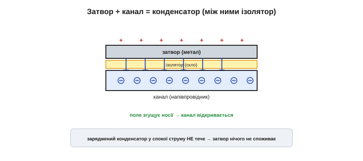
*Рис. 2.7.1.4. Затвор, ізолятор і канал — це конденсатор. Напруга заряджає його, поле відмикає канал. А заряджений конденсатор у спокої струму не тягне — тому затвор у статиці нічого не споживає.*

> 🔧 **Навіщо це.** Ця картинка — «затвор є конденсатор» — пояснює відразу **дві** речі. По-перше, чому в спокої струму нема (заряджений конденсатор не пропускає). По-друге, чому перемикання все ж потребує **миттєвого** струму — щоб **перезарядити** цю ємність, як і будь-який конденсатор. Тримати — задарма; а от **швидко перемикати** — це раз у раз заряджати-розряджати затвор, і саме ця ємність обмежує швидкість. До цього ми повернемося у [§2.7.7](mosfet.md).

### Головна різниця: у затвор струм не тече

Зведімо контраст у числа — і він вражає. Хай нам треба ключем пропускати **1 А**.

```
Біполярний (β = 100):  Ib = Ic / β = 1 А / 100 = 10 мА — і ці 10 мА
                       треба лити в базу ВЕСЬ ЧАС, поки ключ відкритий.

Польовий:              струм затвора ≈ 0  (одиниці наноампер витоку)
                       — подав напругу й тримай задарма.
```

Десять міліампер проти майже нуля. Помножте на час — біполярний весь цей час марнує струм на саме лиш керування, польовий — ні. А тепер уявіть **мільярд** ключів у процесорі: для біполярних це були б десятки тисяч ампер тільки на керування — абсурд; для польових — крапля.

Є ще один бік тієї самої медалі — **вхідний опір**. У біполярного база — це прямо зміщений перехід, її опір невеликий (сотні ом — кілоом), тож вона **навантажує** те, що нею керує. Затвор польового — це ізольована обкладка конденсатора, його опір по постійному струму **колосальний** (трильйони ом, практично розрив). Тому польовий транзистор майже **не вантажить** джерело сигналу — він «слухає» напругу, нічого з неї не відбираючи. Це безцінно, коли керувати треба від кволого давача чи попереднього каскаду.

Порахуймо марну витрату на саме лиш утримання стану. Біполярний ключ на 1 А тримає в базі 10 мА при ~0.7 В — це **7 мВт**, що течуть **увесь час**, поки ключ відкритий, і йдуть просто в тепло. Польовий у тому самому стані — майже 0 мВт. Один ключ — дрібниця; але в пристрої їх бувають сотні, а в чипі — мільярди, і ця «дрібниця», помножена, вирішує, працює прилад від батарейки тиждень чи годину.

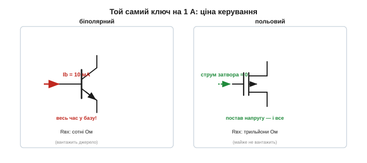
*Рис. 2.7.1.5. Той самий ключ на 1 А: біполярному в базу треба лити 10 мА весь час, польовому в затвор — майже нічого. Звідси й величезний вхідний опір польового: він керується напругою, не відбираючи струму.*

### Чому це змінює все

Складімо переваги докупи — і стане ясно, чому польовий транзистор захопив світ:

- **Майже нульова потужність керування.** Тримати стан — задарма. Для батарейних і цифрових пристроїв вирішально.
- **Величезний вхідний опір.** Не вантажить джерело сигналу; легко керується від чого завгодно слабкого.
- **Масштабованість.** Раз керування нічого не споживає в спокої, на одному кристалі можна стиснути **мільярди** ключів, і вони не розплавлять чип. Звідси вся цифрова мікроелектроніка.
- **Простота керування потужністю.** Силовим польовим ключем керує просто напруга — не треба рахувати струм бази й резистор до неї, як у біполярного ([§2.6.8](../bjt/bjt.md)).

Ось чому майже все цифрове навколо вас працює на польових транзисторах: процесор і пам'ять телефона, флешки, відеокарти, мікроконтролери, на яких ми згодом програмуватимемо. Біполярний лишився у своїх нішах — аналогові тонкощі, дрібні ключі, підсилювачі, — а весь цифровий світ дістався польовому. І все це виросло з однієї-єдиної риси: керувати струмом **полем**, майже не витрачаючи струму на саме керування.


*Рис. 2.7.1.6. Три наслідки «керування полем»: майже нульова потужність керування, величезний вхідний опір і змога стиснути мільярди ключів на чипі. Останнє й дало цифрову епоху (КМОН — [§2.7.9](mosfet.md)).*

Усе це — наслідок єдиної ідеї: **керувати струмом полем, а не струмом**. Та поки що ми говорили про принцип, не зазираючи всередину. Як саме поле відмикає канал? З чого зроблено затвор, ізолятор і канал? Чому є «поріг», нижче якого транзистор закритий? І чим N-канальний відрізняється від P-канального? Це — наступні теми. Зокрема, більшість силових MOSFET — «**нормально закриті**»: без напруги на затворі каналу немає, як і в біполярного ключа, і щоб його відкрити, потрібно перевищити певну напругу-поріг — але про поріг знову ж таки в [§2.7.3](mosfet.md).

> 🔧 **Навіщо це.** Не сплутайте дві речі: «у затвор не тече струм» стосується **постійного** режиму (тримати стан). Це не означає, що польовий транзистор «безкоштовний» геть в усьому — під час кожного **перемикання** доводиться перезаряджати ємність затвора, і на високих частотах це вже відчутна потужність ([§2.7.7](mosfet.md)). Але для логіки, що більшість часу стоїть у сталому стані, виграш величезний.

### Що далі

Ми побачили **ідею** польового транзистора: канал «витік → стік», що його полем відмикає затвор, майже не споживаючи струму. Далі заглянемо **всередину**: з яких шарів він зроблений ([§2.7.2](mosfet.md)), як поле створює канал і що таке поріг ([§2.7.3](mosfet.md)), чим різняться N- і P-канальні ([§2.7.4](mosfet.md)) — і поступово дійдемо до силового ключа, швидкості та КМОН-логіки.

> ▶️ Далі: [§2.7.2 Будова MOSFET: затвор–ізолятор–канал](mosfet.md)

## 2.7.2 Будова MOSFET: затвор–ізолятор–канал

У [§2.7.1](mosfet.md) ми зрозуміли **ідею**: поле з затвора відмикає канал, майже не споживаючи струму. Тепер заглянемо **всередину** — з яких шарів зроблено прилад і чому саме так. Розбиратимемо найпоширеніший тип — **n-канальний збагачений MOSFET** *(n-channel enhancement MOSFET)*; решта (p-канальний, збіднений) — це варіації на ту саму тему, до них дійдемо в [§2.7.4](mosfet.md).

### Анатомія в розрізі

Уявімо прилад **у розрізі**, шар за шаром, знизу вгору.

- **Підкладка** *(substrate / body, тіло)* — товстий шматок кремнію **p-типу** ([§2.5.2](../diode-pn-junction/diode-pn-junction.md)): у ньому основні носії — дірки, вільних електронів обмаль. Це фундамент, на якому будують усе інше.
- **Витік і стік** *(source, drain)* — у підкладку вплавлено дві ділянки **сильно легованого n⁺-кремнію** (багато вільних електронів). Це два «береги» майбутнього каналу; між ними — проміжок p-кремнію.
- **Підзатворний оксид** *(gate oxide)* — над цим проміжком вирощено **дуже тонкий** шар діоксиду кремнію (SiO₂, скло) — той самий ізолятор, що його приборкання відкрило дорогу до MOSFET ([📜 історія](hist-mosfet.md)).
- **Затвор** *(gate)* — поверх оксиду лежить провідний шар (історично метал — «M» в M-O-S; у сучасних приладах — легований полікремній). Він накриває канальний проміжок, але **електрично відділений** від нього оксидом.

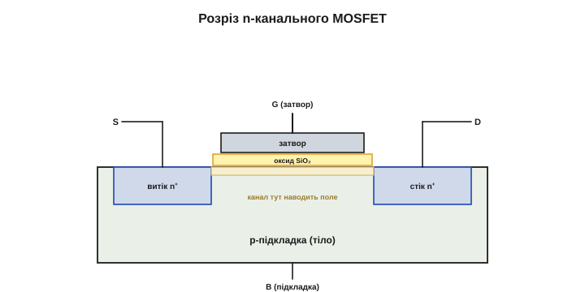
*Рис. 2.7.2.1. Анатомія MOSFET. На p-підкладці — дві n⁺-ділянки (витік і стік); між ними канальний проміжок, накритий тонким шаром оксиду; зверху — затвор. Затвор не торкається кремнію: між ними скло.*

Зверніть увагу на головне: **затвор ніде не торкається кремнію** — між ними скрізь шар скла. Саме тому в затвор і не тече струм, а сам затвор разом із кремнієм під ним утворює конденсатор, про який ми говорили в [§2.7.1](mosfet.md).

Значок «плюс» у n⁺ означає **сильне** легування: у цих ділянках вільних електронів дуже багато, тож вони добре проводять і щедро віддають носії в майбутній канал. Підкладка ж легована слабко й має протилежний, p-тип. Саме ця гра типів — n⁺-береги в p-морі — і створює ту пару зустрічних переходів, що замикають прилад, поки каналу немає. Усе легування роблять, вганяючи в кремній домішки: донори для n-ділянок, акцептори для p ([§2.5.2](../diode-pn-junction/diode-pn-junction.md)).

### M-O-S: три шари, що дали назву

Якщо подивитися на серцевину приладу — стовпчик прямо під затвором, — побачимо три шари, що й дали назву **МОН** (метал–оксид–напівпровідник):

```
   M  — метал (затвор):        провідник, на нього подаємо напругу
   O  — оксид (SiO₂):          тонкий ізолятор-скло
   S  — напівпровідник (Si):   канал, що ним керуємо
```

Це буквально **конденсатор**: дві провідні обкладки (затвор і кремній) розділені діелектриком (оксидом). Уся «магія» MOSFET відбувається в цьому крихітному бутерброді: напруга на металі створює поле, поле проходить крізь скло й керує провідністю кремнію під ним.

А якщо це конденсатор, то в нього є **ємність** — і не зовсім мала, бо обкладки близько (тонкий оксид!), а площа під затвором не нульова. У спокої тримати на ній заряд — задарма, як ми бачили. А от **перезаряджати** її щоразу при перемиканні — вже ні: саме ця ємність затвора визначить, наскільки **швидко** MOSFET уміє вмикатися й вимикатися. До цього важливого боку ми повернемося в [§2.7.7](mosfet.md).

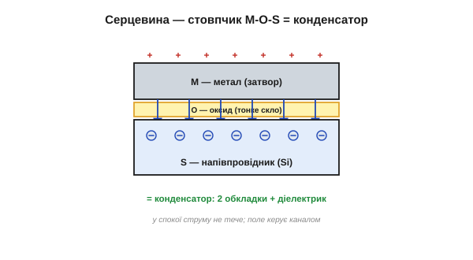
*Рис. 2.7.2.2. Серцевина MOSFET — стовпчик метал-оксид-напівпровідник. Це конденсатор: затвор і кремній — обкладки, оксид — діелектрик. Напруга на затворі → поле крізь скло → керування каналом.*

Слово «метал» у назві лишилося з історії: перші затвори справді робили з алюмінію. Сучасні ж найчастіше роблять із **легованого полікремнію** *(polysilicon)* — він теж добре проводить, але витримує гарячі етапи виробництва й дозволяє точніше «самосумістити» затвор із каналом. Назва MOS прижилася, хоч «метал» там тепер часто умовний; суть — провідний затвор над тонким оксидом — не змінилася ні на йоту.

### Чому без затвора струму немає

Тепер найважливіше для розуміння: що відбувається, коли на затворі **немає** напруги? Чи потече струм від витоку до стоку просто так?

**Ні.** Подивімося на шлях: n⁺-витік → p-підкладка → n⁺-стік. Це **n-p-n** — два p-n переходи **назустріч** один одному, як два діоди, увімкнені зустрічно ([§2.5.4](../diode-pn-junction/diode-pn-junction.md)). Хоч куди прикладай напругу між витоком і стоком — один із цих переходів завжди буде зміщений **зворотно** й струм перекриє. Тобто **без каналу прилад замкнений** в обидва боки. Це і є стан «вимкнено». Це навіть корисніше за один діод: закритий MOSFET тримає напругу **в обидва боки**. Щоправда, межа є — максимальна напруга стік–витік, вище якої зворотний перехід усе ж пробивається; її, як і Vceo в біполярного ([§2.6.8](../bjt/bjt.md)), беруть із даташита із запасом.

Завдання затвора — **створити відсутній місток**: перетворити тонкий шар p-кремнію під оксидом на провідний n-шар, що з'єднає два n⁺-береги. Як саме поле це робить — тема [§2.7.3](mosfet.md); тут важливо засвоїти структуру: **канал не існує сам собою, його наводить поле**. Тому цей тип і звуть «**збагаченим**» *(enhancement)* — канал доводиться щоразу «збагачувати», наводити; без напруги на затворі його немає, і прилад **нормально закритий**.

Існує й протилежний тип — **збіднений** *(depletion)* MOSFET, у якому канал «вбудований» від народження: такий прилад навпаки **нормально відкритий**, а полем його доводиться **закривати**, виштовхуючи носії з каналу. Він трапляється значно рідше; обидва типи поряд ми порівняємо в [§2.7.4](mosfet.md). Поки що тримаймося збагаченого, нормально закритого — саме він панує і як логічний ключ у процесорах, і як силовий ключ.

Корисний образ усієї будови: два n⁺-**острови** (витік і стік) посеред p-**моря**, а переправи між ними немає. Затвор — наглядач, що полем наводить **тимчасовий міст** (канал) між островами: дав напругу — міст постав, носії побігли з берега на берег; прибрав напругу — міст зник, рух спинився. Уся решта анатомії — підкладка, береги, тонкий оксид — існує лише задля того, щоб цей наведений міст з'являвся **чітко, швидко й керовано**. І, на відміну від звідного моста з дощок, він не зношується від мільярдів підйомів: щоразу він постає наново з самих електронів.

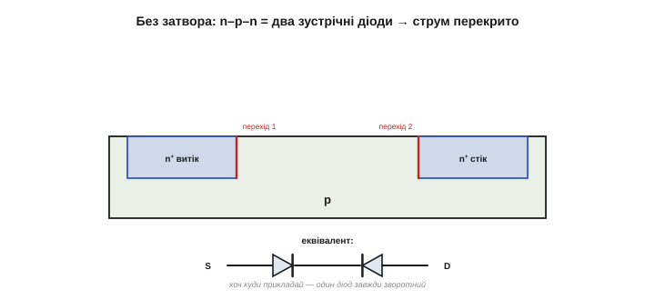
*Рис. 2.7.2.3. Стан «вимкнено». Без напруги на затворі шлях витік→стік — це n-p-n, два зустрічні діоди. Який бік не запитай — один перехід зворотний, струм перекритий. Каналу немає — прилад замкнений.*

> 🔧 **Навіщо це.** Ось чому MOSFET — чудовий ключ: у закритому стані він тримає напругу **обома** напрямками й майже не пропускає струму (тече лише крихітний струм витоку). А ще звідси видно, чому витік і стік часто **симетричні** на вигляд: фізично це дві однакові n⁺-ділянки. Який із них «витік», а який «стік», вирішує не сам транзистор, а **схема** — у n-канального витоком зветься той вивід, що приєднаний до нижчої напруги (звідки електрони «беруться»).

### Чому оксид мусить бути таким тонким

Один параметр у цій будові — критичний: **товщина підзатворного оксиду**. Він має бути **надзвичайно тонким** — лічені нанометри, тобто шар у кілька десятків атомів. Чому?

Бо сила поля, що проникає в кремній, залежить від **напруженості** *(field strength)*, а вона дорівнює напрузі, поділеній на товщину: `E = U / d`. Що тонший оксид (менше d), то сильніше поле при тій самій скромній напрузі на затворі. Якби оксид був товстий, довелося б подавати на затвор величезну напругу, щоб поле «достукалося» до каналу.

Прикиньмо числа. Хай оксид завтовшки 5 нм (нанометрів), а на затворі 3 В:

```
E = U / d = 3 В / 5 нм = 3 / (5·10⁻⁹) ≈ 6·10⁸ В/м = 600 МВ/м
```

Шістсот мільйонів вольтів на метр! Поле колосальне — і саме тому помірних 3 В на затворі досить, щоб керувати каналом. Скло витримує таку напруженість, бо шар надтонкий і бездоганний. Це інженерне диво: керувати потужним струмом мікроскопічним полем у шарі завтовшки в кілька атомів.


*Рис. 2.7.2.4. Чому оксид надтонкий. Напруженість поля E = U/d: при товщині 5 нм навіть 3 В дають ~600 МВ/м. Тонкий шар скла = сильне поле за малої напруги = керування «дешевою» напругою.*

> 🔧 **Навіщо це.** У цій тонкості — і сила, і вразливість MOSFET. Сила: керування слабкою напругою. Вразливість: тонке скло легко **пробити** статикою. Доторк зарядженою рукою може дати на затворі десятки-сотні вольтів, і поле прорве оксид **назавжди** — прилад загине. Тому MOSFET (особливо логічні) чутливі до статики, їх зберігають у провідній упаковці, а на затвори в схемах часто ставлять захисні діоди. Те саме тонке скло, що дає керування, не прощає перенапруги.

І ще одне про цей шар: важлива не лише його товщина, а й **чистота межі** зі кремнієм. Та сама пасивація поверхні, що тридцять років не давалася й зрештою відкрила MOSFET ([📜 історія](hist-mosfet.md)), працює тут щодня: добрий оксид «зашиває» обірвані зв'язки, і поверхневі стани не псують керування. Кепська межа — і поріг «попливе», транзистор поводитиметься непередбачувано. Тому вирощування підзатворного оксиду — чи не найвідповідальніший крок усього виробництва.

### Насправді чотири виводи

Ми звикли до трьох виводів — затвор, стік, витік, — але уважний погляд на розріз виявляє **четвертий**: саму **підкладку** *(body / bulk, тіло)*. Це окремий електричний вивід, і він впливає на роботу.

У дискретних силових MOSFET підкладку майже завжди **з'єднують усередині з витоком** — тому назовні й виходять три ноги. Але це з'єднання має наслідок: між підкладкою (p) і стоком (n⁺) лишається p-n перехід — **вбудований діод** *(body diode)*, що його не видно, поки не згадаєш про підкладку. Цей «тілесний діод» іще стане нам у пригоді (і часом завадить) у силовому ключі — про нього в [§2.7.6](mosfet.md). А в мікросхемах підкладку часто тримають окремо, щоб керувати порогом. Підкладка впливає й тонше: напруга на ній **зсуває поріг** відмикання — це звуть **ефектом підкладки** *(body effect)*. Тому в точних аналогових схемах тіло не лишають напризволяще. У простих же ключах достатньо пам'ятати правило: тіло з'єднане з витоком, а між тілом і стоком чаїться вбудований діод.

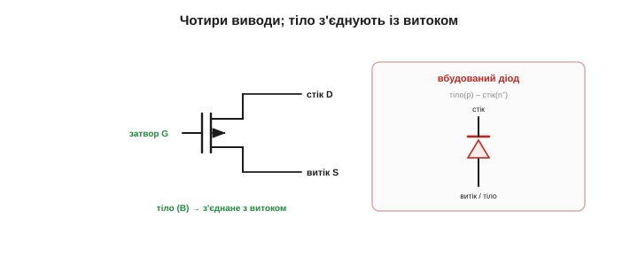
*Рис. 2.7.2.5. Четвертий вивід — підкладка. У дискретних MOSFET її з'єднують із витоком, тож ніг три. Але перехід підкладка–стік лишається вбудованим діодом — він проступить у силовому ключі (§2.7.6).*

> 🔌 **Цей діод усередині.** Куди він дивиться, коли рятує (гасить індуктивний викид у мостах), коли підставляє (один ключ не від'єднає зворотну напругу — треба пара «спина-до-спини») і що з його повільним відновленням роблять — у компонентній вставці [«Паразитний body-діод»](comp-body-diode.md).

### Надруковано, а не зібрано

І остання, але вирішальна риса будови: MOSFET роблять **плоскими шарами на поверхні** кремнієвої пластини *(planar process)*. Підкладка, n⁺-ділянки, оксид, затвор — усе це наносять і витравлюють пошарово, як друк, на величезній пластині відразу для **мільйонів** приладів. Нічого не треба збирати з окремих деталей — транзистори «проявляють» у кремнії, мов фотографію.

Саме тому їх і вдається тіснити мільярдами на нігтику: коли прилад — це кілька плоских шарів, його можна зробити мікроскопічним і повторити безліч разів одним і тим самим процесом. А наскільки малим? У сучасних чипах довжина каналу — одиниці нанометрів, лічені десятки атомів упоперек; те, що ми малюємо тут великими шарами заради наочності, насправді дрібніше за довжину хвилі видимого світла. На зрізі нігтя вміщаються десятки мільярдів таких транзисторів. Будова MOSFET — не лише про фізику одного транзистора, а й про те, **чому їх може бути так багато**.

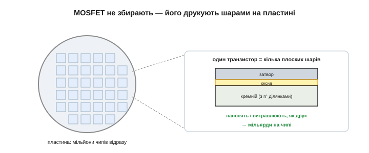
*Рис. 2.7.2.6. MOSFET не збирають — його «друкують» плоскими шарами на кремнієвій пластині, мільйони приладів за один процес. Звідси й мільярди транзисторів на одному чипі.*

### Що далі

Ми розклали MOSFET на шари: p-підкладка з двома n⁺-берегами, тонкий оксид-скло й затвор над каналом — конденсатор, що керує провідністю. Побачили, чому без поля прилад замкнений (n-p-n) і чому оксид мусить бути надтонким. Лишилося головне питання: **як саме поле відмикає канал** і що таке той «поріг», починаючи з якого транзистор оживає. Це — наступна тема.

> ▶️ Далі: [§2.7.3 Поріг і канал: як поле відкриває провідність](mosfet.md)

## 2.7.3 Поріг і канал: як поле відкриває провідність

У [§2.7.2](mosfet.md) ми побачили, що без напруги на затворі каналу немає — лише p-підкладка між двома n⁺-берегами, тобто два зустрічні діоди. Тепер найцікавіше: подаймо на затвор напругу й **простежимо крок за кроком**, як під ним народжується провідний канал. Це серцевина роботи MOSFET.

### Крок за кроком: від збіднення до інверсії

Згадаймо: канал — це поверхня p-кремнію прямо під оксидом. У p-кремнії основні носії — **дірки** (позитивні). Затвор лежить зверху крізь скло. Подаваймо на нього щораз більшу **додатну** напругу й дивімося, що робиться біля поверхні.

**Крок 0 — нуль на затворі.** Поверхня — звичайний p-кремній, повний дірок. Шляху для електронів від витоку до стоку немає. Прилад **закритий**.

**Крок 1 — невелика додатна напруга: збіднення.** Додатний заряд на затворі полем **відштовхує** однойменні позитивні дірки від поверхні вглиб ([§2.5.3](../diode-pn-junction/diode-pn-junction.md) — так само поле відштовхувало носії в збідненій області). Біля оксиду лишається шар, з якого дірки пішли, — **збіднена область** *(depletion region)*. Рухомих носіїв там тепер нема (дірки втекли, електронів ще не прийшло), тож струм **усе ще не тече**. Поле поки що «витрачається» на розчищення поверхні від дірок.

**Крок 2 — досить велика напруга: інверсія.** Піднімаймо напругу далі. Тепер поле таке сильне, що не лише відштовхує дірки, а й **притягує до поверхні електрони** — неосновні носії, яких удосталь у сусідніх n⁺-витоку та стоку. Під оксидом збирається тонкий шар **електронів**. Поверхня, що була p-типом, стала провідною для електронів — фактично **обернулася на n-тип**. Цей перевернутий шар і звуть **інверсійним** *(inversion layer)*, а інверсія — це і є **канал**: суцільний n-місток, що з'єднав n⁺-витік і n⁺-стік. Тепер електрони можуть бігти витік → канал → стік. Прилад **відкрився**.

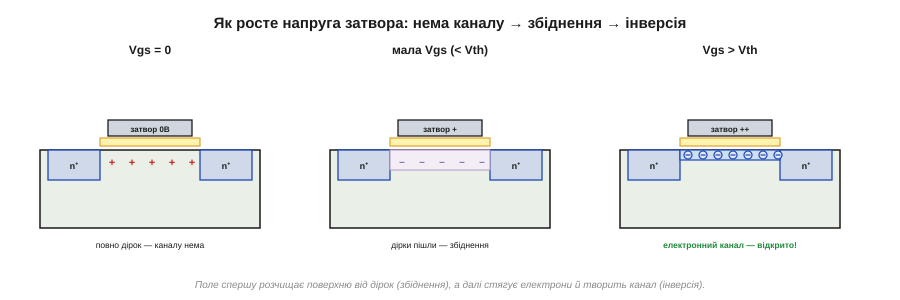
*Рис. 2.7.3.1. Як поле творить канал. Зліва — Vgs = 0: поверхня повна дірок, каналу нема. Посередині — мала Vgs: дірки відштовхнуто, збіднена область, але рухомих носіїв нема. Справа — велика Vgs: до поверхні притягнуто електрони, p-шар «інвертувався» в n-канал, що з'єднав витік і стік.*

### Інверсійний шар — це і є місток

Спинімося на головному моменті — **інверсії**. Дивовижно, що поле здатне не просто прибрати наявні носії, а **зібрати протилежні**: позитивний затвор стягує до поверхні негативні електрони, аж поки їх там не набереться стільки, що тонкий шар p-кремнію поводиться як n-кремній. Це наче поле **перефарбувало** поверхню з «діркової» на «електронну».

І саме цей наведений шар замикає коло. Згадаймо образ із [§2.7.2](mosfet.md): два n⁺-острови в p-морі без переправи. Інверсійний шар — і є той **наведений міст** між островами, зітканий із притягнутих електронів. Прибрав напругу — електрони розійшлися, міст розтанув, прилад знову закритий. Ось чому керування таке оборотне й дешеве: ми щоразу **наводимо** провідну доріжку полем, а не прокладаємо її назавжди.

Зверніть увагу: усе це — про **збагачений** (нормально закритий) тип, де канал доводиться наводити з нуля. Поріг тут — це момент, коли електронів під оксидом набирається стільки ж, скільки дірок у глибині, і поверхня впевнено «перевертається» в n-тип (фізики звуть цю мить **сильною інверсією**). До того — лише збіднення та кволі поодинокі носії; після — повноцінний канал, що проводить.

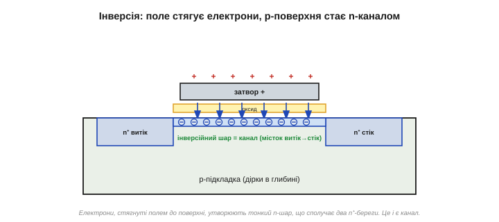
*Рис. 2.7.3.2. Інверсійний шар зблизька. Поле затвора стягує електрони з n⁺-берегів до поверхні; коли їх досить, p-поверхня «інвертується» в n-канал — суцільний місток витік→стік. Це шар лише в кілька атомів завтовшки, але саме він проводить струм.*

### Поріг: напруга, з якої прилад оживає

Очевидно, що інверсія настає не одразу, а коли напруга на затворі **перевалить за певну межу** — досить велику, щоб стягнути достатньо електронів. Цю межу звуть **пороговою напругою** *(threshold voltage)* й позначають **Vth** (або Vgs(th) — бо міряється між затвором і витоком, [§2.7.1](mosfet.md)).

Правило просте:

```
Vgs < Vth  →  каналу нема (або кволий)  →  ВИМКНЕНО
Vgs > Vth  →  канал є, проводить        →  УВІМКНЕНО
```

Порогова напруга — це паспортна риса транзистора. У логічних MOSFET для мікросхем Vth малий — частки вольта; у силових — звичайно 2…4 В. Знаючи Vth, ми знаємо, якою напругою його вмикати.

А від чого залежить сам поріг? Передусім від товщини оксиду й легування підкладки ([§2.7.2](mosfet.md)): тонший оксид і слабше леговане тіло — нижчий поріг. Це закладають на виробництві, добираючи Vth під призначення: для логіки роблять низький (щоб перемикалося від кількох десятих вольта), для силових — вищий (щоб випадкова наводка не відкрила ключ ненароком). Згадаймо й **ефект підкладки** з [§2.7.2](mosfet.md): напруга на тілі теж зсуває поріг. Тож Vth — величина не зовсім абсолютна, а трохи «жива», залежна від умов; саме тому для надійного ключа беруть запас над нею.

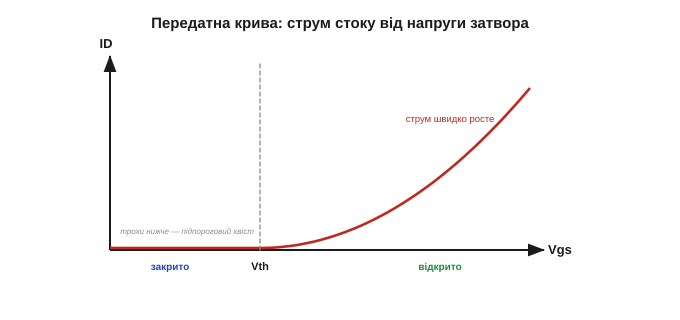
*Рис. 2.7.3.3. Передатна характеристика: струм стоку залежно від напруги затвора. До порога Vth струм майже нульовий (закрито); за порогом — швидко зростає (відкрито). Vth — це «вмикач», вбудований у фізику приладу.*

Насправді перехід не математично різкий: трохи **нижче** порога вже тече крихітний струм, що зростає по експоненті, — його звуть **підпороговим** *(subthreshold)*. Для одного ключа це дрібниця, якою нехтують («нижче порога = вимкнено»). Та коли таких транзисторів мільярди, ці крихітні струми складаються у відчутний **струм спокою** чипа — головний клопіт сучасних процесорів і одна з причин, чому смартфон у кишені все одно потроху розряджається. Тому поріг намагаються зробити й не надто низьким.

> 🔧 **Навіщо це.** Поріг — це те, що робить MOSFET чудовим **цифровим** ключем: є чітка межа між «вимкнено» й «увімкнено». Подав на затвор напругу нижче порога — нуль; вище — одиниця. На цьому, по суті, й тримається вся логіка процесора: мільярди порогових ключів, кожен каже «так» або «ні» залежно від того, чи перевалила напруга на його затворі за Vth.

### Скільки відкрити: перевищення порогу

Поріг каже, **коли** канал з'являється. А **наскільки добре** він проводить — залежить від того, **на скільки** ми перевищили поріг. Цю різницю, `Vgs − Vth`, звуть **перевищенням порогу** *(overdrive)*.

Логіка проста: що більше `Vgs − Vth`, то сильніше поле, то більше електронів стягнуто в канал, то **товщий** провідний шар і **менший** його опір. Це можна сказати й мовою конденсатора з [§2.7.1](mosfet.md): заряд інверсійного шару — це заряд на «обкладці-каналі», і він пропорційний саме перевищенню порогу, Q ≈ C·(Vgs − Vth). Нижче порога цей корисний заряд нульовий (усе пішло на збіднення); вище — кожен зайвий вольт на затворі докидає в канал ще електронів. Перевищення порогу — буквально міра того, скільки носіїв ми «налили» в місток. Біля самого порога канал кволий, ледь живий — опір великий; із добрим запасом над порогом канал «налитий» електронами — опір малий, струм тече вільно.

Звідси два режими, як і в біполярного ([§2.6.5](../bjt/bjt.md)): біля порога й трохи вище — плавне керування (підсилювач); далеко за порогом — канал повністю відкритий, опір мінімальний (ключ). Нам для ключа потрібен саме другий режим: гнати Vgs **значно** вище порога, щоб канал був налитий, а опір — найменший. Скільки саме й чому це визначає грійку — у [§2.7.5](mosfet.md), коли говоритимемо про Rds(on).

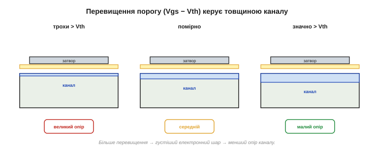
*Рис. 2.7.3.4. Перевищення порогу. Що більше Vgs над Vth, то густіший електронний шар і менший опір каналу. Біля порога канал кволий (великий опір); далеко за порогом — налитий (малий опір). Цим і керують яскравістю чи струмом.*

> 🧮 **Скільки саме струму.** Залежність струму від перевищення порогу не лінійна, а **квадратична**: Id ∝ (Vgs − Vth)². Звідки цей квадрат береться, чому передатна крива — парабола й як із одного закону випливає все сімейство кривих у даташиті — у математичній вставці [«Квадратичний закон»](math-square-law.md).

### «Логічного рівня»: чи вистачить вашої напруги

Тут чигає **найчастіша практична пастка** з MOSFET. Паспортний Vgs(th) — це напруга, за якої канал **лише починає** з'являтися (тече крихітний струм). Це **не** та напруга, за якої транзистор відкритий **повністю**! Щоб канал був по-справжньому налитий (малий Rds(on)), потрібне добре перевищення порогу.

Тому MOSFET ділять на звичайні й **«логічного рівня»** *(logic-level)*:

- **Звичайний силовий MOSFET:** Vgs(th) ≈ 2…4 В, але **повністю** відкривається лише при Vgs ≈ 10 В. Мікроконтролер на 3.3 чи 5 В його **не доведе** до кінця: канал ледь живий, опір великий, транзистор гріється.
- **MOSFET логічного рівня:** спеціально зроблений так, щоб бути повністю відкритим уже при Vgs ≈ 2.5…4.5 В. Його якраз і можна вмикати прямо з ніжки мікроконтролера.

Порахуймо на числах. Звичайний MOSFET із Vth ≈ 4 В вмикаємо від 5 В: перевищення лише 1 В — канал ледь прочинений, опір не обіцяні даташитом 0.02 Ом (то при 10 В!), а цілі оми. На струмі 3 А це P = I²·R = 9·1 ≈ **9 Вт** грійки — паяльник. А MOSFET логічного рівня з Vth ≈ 1.5 В при тих самих 5 В має перевищення 3.5 В, канал налитий, опір ті самі 0.02 Ом, грійка P = 9·0.02 ≈ **0.18 Вт**. Та сама схема, та сама напруга — лише різниця в Vth робить її робочою або згорілою.

Ще приємна риса MOSFET: опір відкритого каналу з нагрівом **зростає**. Тому паралельні MOSFET самі вирівнюють струм (гарячіший бере менше) — на відміну від біполярного з його тепловим розгоном ([§2.6.8](../bjt/bjt.md)). До цього повернемося в [§2.7.5](mosfet.md) і [§2.7.8](mosfet.md).

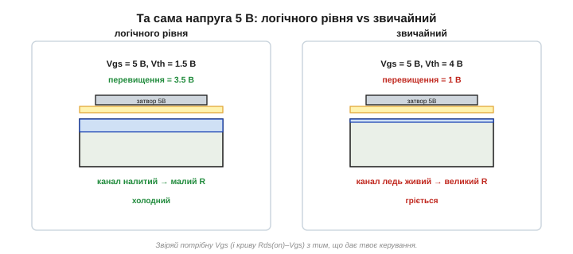
*Рис. 2.7.3.5. Та сама напруга 5 В на затворі: MOSFET логічного рівня вже повністю відкритий (малий опір), а звичайний — ледь прочинений (великий опір, грійка). Завжди звіряй потрібну Vgs із тим, що дає твоє керування.*

> 🔧 **Навіщо це.** Практичне правило: керуючи MOSFET від мікроконтролера (3.3 чи 5 В), **бери транзистор «логічного рівня»** — і дивись у даташиті не на сам Vgs(th), а на криву «Rds(on) від Vgs»: чи малий опір **при твоїй** напрузі затвора. Інакше класична халепа новачка: ключ начебто «вмикається», але гріється, бо насправді ледь прочинений. Це пряма аналогія до «недонасиченого» біполярного ключа ([§2.6.6](../bjt/bjt.md)) — тільки там бракувало струму бази, а тут бракує напруги на затворі.

### Образ: гребля з порогом

Зведімо все в одну картинку. Уявіть рівчак між двома ставками (витік і стік), перегороджений **греблею**. Напруга на затворі — це рівень води, що ми наливаємо перед греблею. Поки рівень нижчий за гребінь (Vgs < Vth), вода нікуди не йде — ставки роз'єднані (закрито). Щойно рівень перевалив за гребінь (Vgs > Vth) — потекло через верх, ставки сполучилися (відкрито). А далі: що **вище** рівень над гребенем (більше перевищення), то **ширший і глибший** потік — то менший «опір» переправи.

Ця картинка пояснює й ще одну чесноту порога — **завадостійкість**. Невеликі коливання рівня води, поки вони далеко від гребеня, нічого не змінюють: закрите лишається закритим, відкрите — відкритим. Так само цифровий ключ не зважає на дрібний шум на затворі, аж поки той не підбереться до самого порога. Тому логіка на MOSFET надійно відрізняє «нуль» від «одиниці» навіть у не зовсім чистому сигналі — гребля-поріг відсікає дрібні брижі. Саме ця властивість і дала змогу складати з мільярдів ключів обчислювачі, що не плутають сигнали між собою.

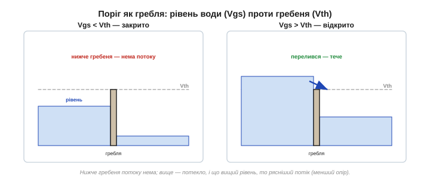
*Рис. 2.7.3.6. Поріг як гребля. Vgs — рівень води перед греблею; Vth — висота гребеня. Нижче гребеня потоку нема (закрито); вище — потекло (відкрито), і що вищий рівень над гребенем, то рясніший потік (менший опір).*

### Що далі

Отже, поле творить канал у три кроки — збіднення, потім інверсія, — а поріг Vth каже, з якої напруги канал оживає; перевищення ж порогу керує тим, наскільки добре він проводить. Ми весь час говорили про **n-канальний** прилад (електронний місток у p-підкладці). Але є й дзеркальний — **p-канальний**, де все навпаки. Чим вони різняться й навіщо потрібні обидва — наступна тема.

> ▶️ Далі: [§2.7.4 N-канальний і P-канальний (NMOS/PMOS)](mosfet.md)

## 2.7.4 N-канальний і P-канальний (NMOS/PMOS)

Досі ми вивчали **n-канальний** MOSFET: у p-підкладці поле наводить канал з **електронів**. Але є й дзеркальний близнюк — **p-канальний**, де все навпаки. Розберімо обидва поряд: це не подвоєння матеріалу, а ключ до розуміння, чому з MOSFET складають усю цифрову логіку.

### Дзеркальна будова

P-канальний MOSFET *(p-channel, PMOS)* — це n-канальний, у якому **всі типи перевернуто**:

- **Підкладка** тепер **n-типу** (основні носії — електрони).
- **Витік і стік** — дві ділянки **p⁺**-кремнію (багато дірок).
- **Канал**, коли він з'явиться, складається з **дірок** — це інверсійний шар p-типу на поверхні n-підкладки.

Усе як у дзеркалі: де в NMOS був n, тут p, і навпаки. Прилад той самий за ідеєю — затвор крізь оксид керує каналом, — але носії в каналі тепер позитивні дірки, а не негативні електрони.

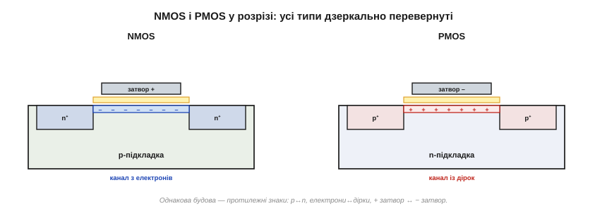
*Рис. 2.7.4.1. Дзеркальні близнюки. NMOS: p-підкладка, n⁺-береги, канал з електронів. PMOS: n-підкладка, p⁺-береги, канал із дірок. Однакова будова — протилежні знаки.*

Варто додати, що і n-, і p-канальні бувають двох підвидів: **збагачені** (нормально закриті, які ми й розбираємо) та **збіднені** (нормально відкриті, із каналом, вбудованим від народження — [§2.7.3](mosfet.md)). На практиці майже скрізь — збагачені, тож надалі під «NMOS» і «PMOS» матимемо на увазі саме їх. Збіднені трапляються лише у вузьких нішах, як-от деякі радіочастотні каскади.

### Протилежна полярність вмикання

Якщо типи перевернуто, то й **керувальна напруга — протилежного знаку**.

- **NMOS** відкривається, коли затвор стає **додатнішим** за витік: позитивне поле стягує **електрони** в канал. Vgs > Vth, де Vth **додатний** (скажімо, +2 В).
- **PMOS** відкривається, коли затвор стає **від'ємнішим** за витік: негативне поле стягує **дірки** в канал. Vgs < Vth, де Vth **від'ємний** (скажімо, −2 В).

Тобто NMOS вмикають, **піднімаючи** напругу затвора, а PMOS — **опускаючи** її. Це найважливіша практична відмінність, і зараз ми побачимо, чому вона так зручно лягає у схеми.

```
NMOS:  затвор ВИЩЕ за витік (Vgs > 0)  → відкрито
PMOS:  затвор НИЖЧЕ за витік (Vgs < 0)  → відкрито
```

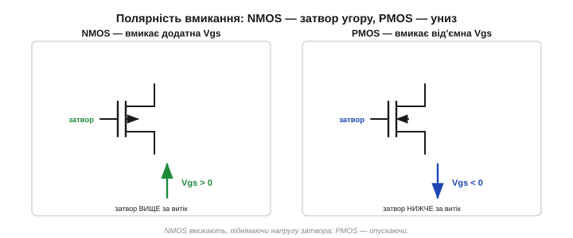
*Рис. 2.7.4.2. NMOS відкривають додатною Vgs (затвор вищий за витік), PMOS — від'ємною (затвор нижчий за витік). Протилежні знаки — бо протилежні носії.*

Числа роблять це наочним. **NMOS:** витік на землі (0 В), подаємо на затвор +5 В → Vgs = 5 − 0 = +5 В, більше за Vth ≈ +2 В → відкрито. **PMOS:** витік на +5 В, подаємо на затвор 0 В → Vgs = 0 − 5 = −5 В, менше за Vth ≈ −2 В → теж відкрито. І навпаки: щоб **закрити** PMOS, на затвор треба подати +5 В (тоді Vgs = 0). Тобто «висока» напруга на затворі вмикає NMOS, але вимикає PMOS — дзеркально.

### Де чий витік

Звідси випливає, **куди їх ставлять** у схемі. Витік — це звідки беруться носії каналу ([§2.7.1](mosfet.md)):

- У **NMOS** носії — електрони, вони «течуть» від низької напруги, тож **витік природно тягнеться до землі**, а керують, піднімаючи затвор над землею. NMOS — звичайний ключ **нижнього плеча** *(low-side)*.
- У **PMOS** носії — дірки, вони «течуть» від високої напруги, тож **витік природно тягнеться до +V**, а вмикають, опускаючи затвор нижче +V (наприклад, притягнувши до землі). PMOS — зручний ключ **верхнього плеча** *(high-side)*.

Це пряме продовження розмови про верхнє й нижнє плече з біполярними ([§2.6.8](../bjt/bjt.md)), тільки тут поділ ще природніший: сам тип транзистора підказує, з якого боку навантаження його ставити.


*Рис. 2.7.4.3. Умовні позначення. У NMOS стрілка (на підкладці/витоку) вказує всередину, у PMOS — назовні. NMOS зазвичай унизу (витік до землі), PMOS — угорі (витік до +V).*

Як розрізнити їх на схемі? Орієнтуйтеся на **стрілку** (вона на виводі підкладки або витоку): у n-канального вона дивиться **до** каналу, у p-канального — **від** нього. Стрілка показує напрям p-n переходу підкладки, точнісінько як у діода ([§2.5.4](../diode-pn-junction/diode-pn-junction.md)). А практично ще простіше дивитися на розташування: транзистор «ногами до землі» — майже напевно NMOS, «головою до +V» — PMOS.

> 🔧 **Навіщо це.** Практичний висновок: **PMOS легко керувати у верхньому плечі**, а NMOS — ні. Щоб увімкнути PMOS-ключ між +12 В і навантаженням, досить притягнути його затвор до землі — і Vgs = 0 − 12 = −12 В, прилад відкритий. А щоб так само ввімкнути NMOS у верхньому плечі, на затвор треба подати напругу **вищу за +12 В** (бо витік уже на ~12 В, а Vgs має бути ще додатнішим) — а такої в схемі може й не бути. Тому або беруть PMOS, або застосовують хитрощі (зарядову помпу) — про це в [§2.7.6](mosfet.md).

> 🔌 **Зробімо з цього вимикач.** Як зібрати з P-MOSFET практичний **ключ живлення** — щоб однією ніжкою логіки цілком знеструмити вузол (давач, радіо) заради економії батареї — і навіщо йому маленький n-ключ-помічник: у компонентній вставці [«P-канальний ключ живлення (load switch)»](comp-pmos-load-switch.md).

І все ж більшість силових ключів — драйвери моторів, перетворювачі живлення, контролери заряду — будують саме на **n-канальних**, навіть у верхньому плечі, доплачуючи за схему підняття затвора (зарядову помпу чи бутстреп). Дешевий, малий, низькоомний n-канал того вартий. P-канальний верхнього плеча обирають там, де простота важливіша за останній відсоток ефективності, — скажімо, у звичайному вимикачі живлення пристрою, де PMOS вмикається простим притягуванням затвора до землі.

### Електрони прудкіші за дірки

Є між ними й несиметрична, фізична відмінність. **Рухливість** *(mobility)* електронів у кремнії приблизно **втричі більша**, ніж дірок: електрони — спритніші носії. А це означає, що n-канал за тих самих розмірів і напруги проводить **краще** (менший опір), ніж p-канал.

Наслідок практичний: щоб PMOS мав такий самий опір відкритого каналу, як NMOS, його доводиться робити **в 2–3 рази більшим** (ширший канал компенсує повільніші дірки). Тому в силовій техніці майже завжди обирають **n-канальний** — він дешевший, менший і має нижчий опір на однакову площу. P-канальний беруть тоді, коли важливіша **зручність** керування у верхньому плечі, а не гранична ефективність.

Чому ж електрони прудкіші? Грубо кажучи, дірка — це «брак електрона» у зв'язках, і її рух насправді означає послідовне перескакування електронів із зв'язку в зв'язок, що дається важче й повільніше; вільному електронові бігти легше. Фізики кажуть про меншу «ефективну масу» електрона. Для нас висновок простий: n-канал ефективніший, і саме йому дістається силова й цифрова «важка робота».


*Рис. 2.7.4.4. Електрони в кремнії рухливіші за дірки приблизно втричі. Тому n-канал за тих самих розмірів проводить краще; щоб зрівняти PMOS із NMOS, його роблять у 2–3 рази більшим.*

### Кожен сильний у свій бік

Тепер — найцікавіше, заради чого й потрібні **обидва** типи. Виявляється, кожен з них добре передає лише **один** логічний рівень, а інший — погано.

- **NMOS** чудово «садить» вузол **до землі** — передає сильний «нуль». А от підтягнути вузол до самого +V він не може: коли вихід підіймається, його Vgs зменшується, і біля верху транзистор сам себе прикриває. Тож «одиницю» NMOS передає **кволу**.
- **PMOS** — навпаки: чудово підтягує вузол **до +V** (сильна «одиниця»), а «нуль» передає кволо.

Чому так? Бо в NMOS, тягнучи вихід **угору**, ми піднімаємо й сам витік (носії ж течуть від витоку). Коли вихід наближається до +V, напруга витоку росте, тож Vgs = Vg − Vs (затвор мінус витік) **зменшується** — і за крок до мети падає нижче порога, транзистор сам себе зачиняє. Вихід застрягає приблизно на «+V мінус Vth», не дотягуючи до повної одиниці. У PMOS дзеркально: не дотягує до повного нуля. Ось фізична причина, чому кожен сильний лише у свій бік.

Висновок напрошується: **використовуй кожен у його сильний бік**. Хочеш надійно з'єднати вузол із землею — став NMOS знизу. Хочеш надійно з'єднати з +V — став PMOS зверху. А якщо потрібні **обидва** напрямки — постав їх **у пару**.

На практиці це найчастіше виглядає так: хочеш увімкнути моторчик чи світлодіодну стрічку — ставиш **NMOS знизу**, між навантаженням і землею, бо саме «садити до землі» він уміє найкраще, та й керувати ним прямо з ніжки мікроконтролера найзручніше ([§2.7.6](mosfet.md)). Це найпоширеніша схема ключа, і вона ж — пряме продовження «нижнього плеча» з біполярним ([§2.6.6](../bjt/bjt.md)).

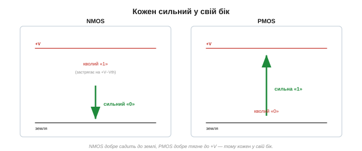
*Рис. 2.7.4.5. NMOS добре передає «нуль» (садить до землі), але кволу «одиницю»; PMOS — добре «одиницю» (тягне до +V), але кволий «нуль». Тому кожен працює у свій бік.*

### Комплементарна пара — натяк на CMOS

Якщо поставити **PMOS зверху** (тягне вихід до +V) і **NMOS знизу** (тягне вихід до землі) й керувати ними **разом**, дістанемо ідеальний двопозиційний вихід: одна напруга на спільному затворі — і вмикається рівно **один** із пари. Вихід або міцно притягнутий до +V (через PMOS), або міцно до землі (через NMOS), і **ніколи обидва водночас** — тож наскрізного струму від живлення до землі немає, а отже й споживання в спокої майже нульове.

Цю парочку — **комплементарну** *(complementary)*, тобто взаємодоповнювальну — і звуть **КМОН** *(CMOS)*. З неї зроблено геть усю сучасну цифрову логіку: кожен вентиль у процесорі — це пари PMOS+NMOS.

Найпростіший приклад — **інвертор**: PMOS зверху, NMOS знизу, затвори з'єднані (це вхід), стоки з'єднані (це вихід). Подали на вхід «одиницю» → NMOS відкрився, PMOS закрився → вихід притягнуто до землі, тобто «нуль». Подали «нуль» → навпаки: PMOS тягне вихід до +V, виходить «одиниця». Вхід перевернувся на виході — це й є інвертор, найдрібніша цеглинка логіки. Та сама пара робить і чудовий **аналоговий ключ** *(transmission gate)*: NMOS добре пропускає низькі напруги, PMOS — високі, тож паралельно вони чисто проводять **будь-яку** напругу в обидва боки — те, чого одиночний транзистор не вміє.

А ще цікавий історичний поворот: однотипна MOS-логіка (як-от NMOS) обходилася простим резистором-підтяжкою замість другого, комплементарного транзистора. Але такий резистор у половині станів безперервно тягне струм від живлення до землі — чип грівся й споживав енергію навіть у спокої. Заміна того резистора на PMOS (тобто перехід до КМОН) і прибрала наскрізний струм — ось чому саме CMOS, а не NMOS-логіка, дала змогу будувати велетенські й економні процесори.

Це й була тиха революція. Логіка на комплементарних парах споживає енергію майже лише в **мить** перемикання, а в спокої — хіба що крихітну краплю струму витоку. Помножте економію одного вентиля на мільярди — і дістанете різницю між чипом, що пашить, наче праска, і тим, що тижнями живиться від маленької батарейки. Саме тому КМОН витіснила всі попередні різновиди логіки й на десятиліття лишилася єдиною основою цифрової техніки. Чому вона така економна й як із неї будують логіку — окрема велика тема [§2.7.9](mosfet.md); тут досить запам'ятати, що **обидва типи існують саме заради цієї пари**.

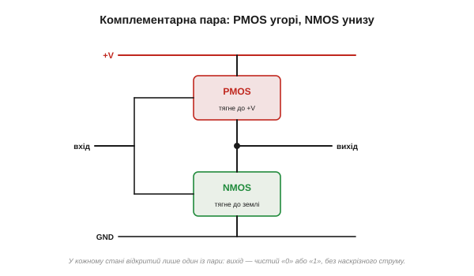
*Рис. 2.7.4.6. PMOS зверху тягне вихід до +V, NMOS знизу — до землі; керовані разом, вони дають чистий «0» або «1» без наскрізного струму. Це комплементарна пара — основа КМОН-логіки (§2.7.9).*

> 🔧 **Навіщо це.** Запам'ятайте розподіл ролей як просте правило: **NMOS тягне вниз, PMOS тягне вгору**. Звідси й уся їхня «географія» у схемах: n-канальний — знизу, до землі; p-канальний — згори, до живлення. Коли в [§2.7.9](mosfet.md) ми складатимемо логічні вентилі, це правило поясне всю їхню будову з першого погляду.

### Що далі

Отже, MOSFET буває двох дзеркальних типів: n-канальний (швидший, для нижнього плеча й силових ключів) і p-канальний (зручний для верхнього плеча), а разом вони складають комплементарну пару — серце цифрової логіки. Ми не раз згадували «опір відкритого каналу»: то він великий, то малий. Час придивитися до цього параметра уважно — бо саме він визначає, скільки силовий ключ гріється. Це Rds(on), і йому присвячена наступна тема.

> ▶️ Далі: [§2.7.5 Опір у відкритому стані Rds(on)](mosfet.md)

## 2.7.5 Опір у відкритому стані Rds(on)

Ми не раз казали: відкритий MOSFET «проводить». Та чи проводить він **ідеально**, як шматок дроту? Ні. Навіть повністю відкритий канал має невеликий **опір** — і саме він, а не що інше, визначає, скільки силовий ключ гріється. Цей параметр — **опір у відкритому стані**, **Rds(on)** *(on-resistance)* — головна цифра, на яку дивляться, обираючи MOSFET для потужності.

Адже ідеальний ключ мав би у відкритому стані не спадати на собі ані вольта (нульовий опір) і не грітися зовсім. Реальний MOSFET до цього ідеалу лише **наближається**, а міра наближення якраз і є Rds(on). За нього й точиться головна боротьба виробників силових транзисторів: щороку ті самі міліоми стають дешевшими, меншими й витривалішими.

### Відкритий MOSFET — це маленький резистор

Коли Vgs добре перевищує поріг ([§2.7.3](mosfet.md)), канал налитий носіями й поводиться як звичайний **резистор** між стоком і витоком: струм пропорційний прикладеній напрузі, Vds = Id · Rds(on). Цю ділянку роботи звуть **омічною** (або лінійною) *(ohmic / linear region)* — саме в ній працює ключ. Опір цей малий: у добрих силових MOSFET — **міліоми** (тисячні частки ома), у дрібних сигнальних — оми. Щоб відчути масштаб: типовий MOSFET логічного рівня на 30 В має Rds(on) близько 10 мОм; маленький транзистор у корпусі SOT-23 для дрібних струмів — десятки чи сотні міліом; а спеціальні низьковольтні силові — навіть одиниці міліом. Розкид — у тисячі разів, і він прямо відбиває розмір кристала та клас приладу. Тож перше, що робить інженер, розгорнувши даташит силового MOSFET, — шукає рядок Rds(on) і поряд із ним напругу затвора, за якої його виміряно.

Тобто «увімкнено» для MOSFET означає не «коротке замикання», а «увімкнено через маленький резистор Rds(on)». І весь струм навантаження тече крізь цей резистор.

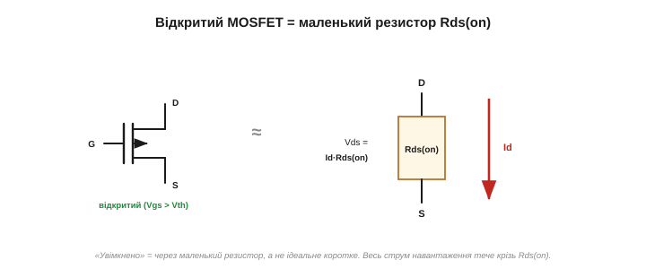
*Рис. 2.7.5.1. У відкритому стані канал — це резистор Rds(on). Струм навантаження тече крізь нього, спадаючи на ньому невеличку напругу Vds = Id·Rds(on). Що менший Rds(on), то ближче ключ до ідеального дроту.*

Варто знати, що насправді MOSFET має **дві** робочі області. За малої напруги стік–витік (відкритий ключ) він в **омічній** області — поводиться як резистор Rds(on). Та якщо напруга на стоці велика, а канал відкритий лише частково, транзистор переходить у **насичення** *(saturation)* й поводиться вже як **джерело струму** — це область підсилювача (як активний режим біполярного, [§2.6.7](../bjt/bjt.md)). Для ключа нам потрібна саме омічна область: гнати Vgs добре вище порога, щоб канал був повністю відкритий, а опір — мінімальний. Якщо ж напруги на затворі недодати, ключ застрягне «напіввідкритим» — а там на ньому водночас і чималий струм, і чимала напруга, тобто **велика грійка**. Напіввідкритий MOSFET — найгарячіший; саме так гинуть погано керовані ключі.

### Чому це головне: грійка

На цьому маленькому резисторі, коли крізь нього тече струм, виділяється тепло — як на будь-якому опорі (закон Джоуля, з Модуля 1). Потужність цієї **провідної втрати** *(conduction loss)*:

```
P = Id² · Rds(on)
```

Ось чому Rds(on) — цар параметрів силового ключа: він **прямо** задає грійку. Менший Rds(on) — холодніший ключ, менше втрат, не треба громіздкого радіатора.

Порахуймо. Хай ключ жене **10 А** крізь MOSFET із Rds(on) = **5 мОм**:

```
Vds = Id · Rds(on) = 10 · 0.005 = 0.05 В     (лише 50 мВ спаду!)
P   = Id² · Rds(on) = 100 · 0.005 = 0.5 Вт    (холодний)
```

Півватта на десяти амперах — копійки. Транзистор ледь теплий.

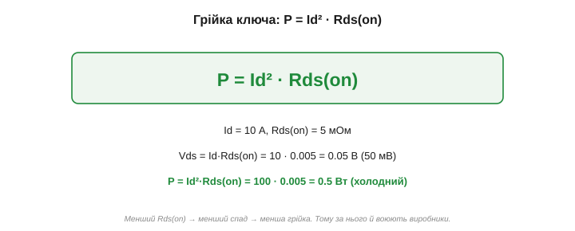
*Рис. 2.7.5.2. Грійка відкритого ключа = Id²·Rds(on). На 10 А крізь 5 мОм спадає лише 50 мВ і виділяється 0.5 Вт. Менший Rds(on) — менший спад і менша грійка.*

А якби Rds(on) був не 5, а 50 мОм (дешевший прилад або недостатньо відкритий)? Тоді P = 100·0.05 = **5 Вт** — це вже вимагає радіатора. Адже тепло від кристала йде крізь корпус до повітря, і кожен градус опору цьому потоку (**теплового опору**) піднімає температуру кристала; виробник задає її стелю — Tj зазвичай 150 °C. П'ять ват у крихітному корпусі без радіатора миттю переженуть цю межу й уб'ють прилад, а в TO-220 на радіаторі — норма. Звідси й уся гонитва за міліомами: кожне зменшення Rds(on) прямо знімає тепло й дозволяє менший корпус.

### MOSFET проти біполярного: різна природа втрат

Тут MOSFET принципово відрізняється від біполярного ключа — і часто виграє. Згадаймо: у насиченого біполярного на ключі лишається майже **стала** напруга Vce(sat) ≈ 0.2…0.3 В незалежно від струму ([§2.6.5](../bjt/bjt.md)). Тож його втрата `P = Vce(sat)·Id` росте **лінійно** зі струмом. А в MOSFET спад — це Id·Rds(on), він **пропорційний** струму, тож втрата `P = Id²·Rds(on)` росте **квадратично**.

Порівняймо на тих самих 10 А:

```
біполярний:  P = Vce(sat)·Id = 0.3 · 10 = 3 Вт
MOSFET:      P = Id²·Rds(on) = 100 · 0.005 = 0.5 Вт
```

MOSFET — у шість разів холодніший. За малих і середніх струмів він майже завжди виграє: його спад (десятки мілівольтів) набагато менший за «непорушні» 0.3 В біполярного. Лише за дуже великих струмів квадрат Id² може наздогнати — але із сучасними міліомними MOSFET ця межа дуже висока.

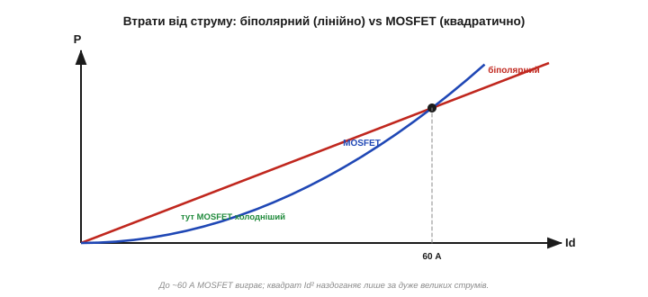
*Рис. 2.7.5.3. Біполярний має майже сталий спад 0.3 В, тож втрати ростуть лінійно. MOSFET — як резистор, спад малий за помірних струмів. За малих/середніх струмів MOSFET холодніший; квадрат Id² наздоганяє лише дуже високо.*

Де ж проходить межа, за якою біполярний наздоганяє? Прирівняймо втрати: Vce(sat)·Id = Id²·Rds(on), звідки Id = Vce(sat)/Rds(on). Для 0.3 В і 5 мОм це Id = 0.3 / 0.005 = **60 А**. Тобто аж до 60 А MOSFET холодніший за біполярний, і лише за ще більших струмів його квадрат бере гору. Для переважної більшості схем це означає просту річ: MOSFET виграє практично завжди — і тому витіснив біполярний із силового перемикання.

### Від чого залежить Rds(on)

Rds(on) — не константа приладу, а величина, що залежить від кількох речей. Інженерові варто знати трьох головних винуватців.

**1. Напруга на затворі (перевищення порогу).** Що більше Vgs над Vth, то товщий канал і менший Rds(on) ([§2.7.3](mosfet.md)). Тому даташит подає Rds(on) **за певної Vgs** — часто «при Vgs = 10 В». Якщо керувати меншою напругою, опір буде **більший**, ніж у заголовку. Це і є та сама пастка «логічного рівня»: бери MOSFET, у якого малий Rds(on) **при твоїй** напрузі затвора.

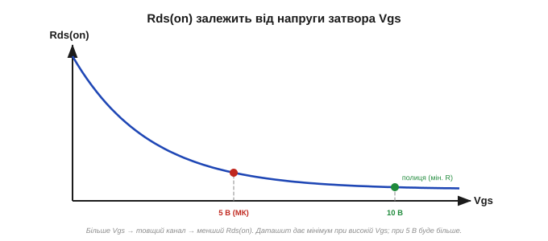
*Рис. 2.7.5.4. Rds(on) залежить від напруги затвора: росте Vgs — канал товщає — опір падає й виходить на «полицю». Даташитний Rds(on) дають при високій Vgs (часто 10 В); при 3.3–5 В від МК він може бути помітно більшим. Звіряй із кривою.*

Числовий приклад пастки. Даташит обіцяє Rds(on) = 5 мОм — але **при Vgs = 10 В**. А ви керуєте від 5-вольтового мікроконтролера. Дивимося в криву — і бачимо, що при Vgs = 5 В опір уже, скажімо, 12 мОм. На 10 А це не 0.5 Вт, а P = 100·0.012 = **1.2 Вт** — удвічі з гаком гарячіше, ніж за заголовною цифрою. А якби MOSFET був **не** логічного рівня й при 5 В ледь прочинявся (Rds(on) — сотні міліом), грійка стала б катастрофічною. Тому й правило: дивись не на гучне число, а на криву при **своїй** напрузі затвора.

**2. Розмір і напруга приладу.** Більший транзистор (більша площа кремнію) має менший Rds(on) — це наче багато каналів паралельно. Тому низькоомні MOSFET фізично більші й дорожчі. І є фундаментальний компроміс: щоб тримати **високу напругу** в закритому стані, всередину додають товсту слабколеговану **дрейфову область** *(drift region)*, а вона ж і піднімає Rds(on). Тож високовольтні MOSFET мають **більший** опір, ніж низьковольтні тих самих розмірів. Звідси правило: **не бери надмірний запас по напрузі** — він задарма коштує тобі Rds(on) і грошей.

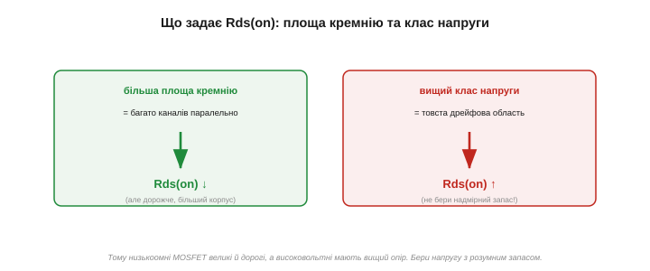
*Рис. 2.7.5.5. Дві шальки терезів. Більша площа кремнію знижує Rds(on) (дорожче). Вищий клас напруги вимагає товстішої дрейфової області — а вона піднімає Rds(on). Тому не варто переплачувати запасом по напрузі.*

Як узагалі вдається отримати міліоми? Силовий MOSFET — це не один канал, а **тисячі однакових комірок**, з'єднаних паралельно на одному кристалі: їхні опори діляться, і сумарний падає до міліомів. А щоб канал був короткий і широкий, потужні MOSFET роблять **вертикальними** — струм іде не вздовж поверхні, а вглиб кристала, крізь усю його товщу, від стоку знизу до витоку згори. Тому силовий MOSFET зовні — звичайний трипінсовий корпус, а всередині — ціле військо паралельних транзисторів, що тягнуть струм разом.

> 📜 **Як з'явилися ці комірки.** Хто й коли придумав нарізати силовий MOSFET на тисячі паралельних комірок — і чому вони шестикутні. Від японського VMOS до каліфорнійського HEXFET (1979), що зробив малий Rds(on) дешевим товаром, — в [історичній вставці «HEXFET: як силовий MOSFET став масовим»](hist-hexfet.md).

**3. Температура.** Rds(on) **росте з нагрівом** — типово вдвічі від 25 °C до ~150 °C. Здавалося б, погано (гарячіший ключ гріється ще дужче), та насправді це **рятівна** риса: вона ж і не дає теплового розгону й дозволяє ставити MOSFET **паралельно** — гарячіший сам бере менше струму, віддаючи його холоднішому, тож вони вирівнюються. Біполярний, навпаки, схильний до розгону ([§2.6.8](../bjt/bjt.md)). Але грійку треба рахувати на **гарячий** опір: P = Id²·Rds(on, гарячий).

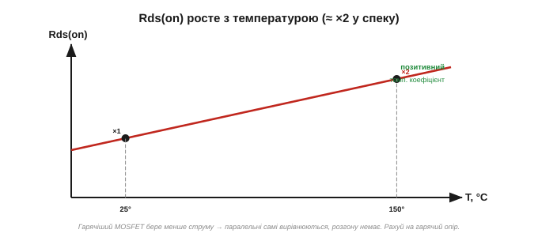
*Рис. 2.7.5.6. Опір каналу зростає з температурою (приблизно вдвічі від 25 до 150 °C). Це позитивний температурний коефіцієнт: гарячіший MOSFET бере менше струму, тож паралельні самі вирівнюються й розгону немає. Грійку рахуй на гарячий Rds(on).*

Завдяки цьому в потужних перетворювачах сміливо ставлять по кілька MOSFET **паралельно**, щоб поділити струм: якби опір з нагрівом падав (як у біполярного), гарячіший хапав би дедалі більше струму, грівся ще дужче — і згорів. А що в MOSFET навпаки, струм самотужки розходиться між ними порівну. Це велика практична перевага для сильнострумових схем.

І ще одне, що знадобиться при виборі: між собою MOSFET часто порівнюють не самим Rds(on), а **добутком** Rds(on) на заряд затвора Qg. Малий Rds(on) зазвичай дається ціною більшого, «повільнішого» затвора, і навпаки — тож цей добуток і є чесною мірою якості. Компроміс між втратами на проведення (Rds(on)) і на перемикання (Qg) — головний у виборі силового ключа; до заряду затвора ми дійдемо в [§2.7.7](mosfet.md).

> 🔧 **Навіщо це.** Практичний рецепт вибору силового MOSFET за грійкою: (1) візьми **Rds(on) при своїй Vgs** (не заголовний при 10 В); (2) подвой його на гарячий стан; (3) порахуй P = Id²·Rds(on, гарячий); (4) перевір, що цю потужність відведе корпус/радіатор. Якщо P завелика — бери MOSFET із меншим Rds(on) (більший, дорожчий) або з нижчим класом напруги. І не плутай: Rds(on) дає лише втрати **на проведення**; є ще втрати **на перемикання**, і за швидкого перемикання вони можуть переважити — про них у [§2.7.7](mosfet.md).

Підсумуймо інтуїцію: відкритий MOSFET — це маленький резистор, і вся його грійка у відкритому стані описується одним рядком, P = Id²·Rds(on). Зроби Rds(on) малим — досить високою напругою затвора, добрим приладом, не надмірним класом напруги, — порахуй грійку на **гарячий** опір, перевір, що її відведе корпус, — і ключ буде холодний. Це половина історії втрат. Друга половина — короткі спалахи тепла в **миті перемикання**, коли транзистор швидко проходить крізь «напіввідкриту» зону; їй присвячено [§2.7.7](mosfet.md).

### Що далі

Отже, Rds(on) — це опір відкритого каналу, і саме він через P = Id²·Rds(on) визначає, як гріється силовий ключ; залежить він від напруги затвора, розміру й класу приладу та температури. Ми вже знаємо про MOSFET майже все, щоб **зібрати з нього реальний ключ**: відмикання порогом, потрібну Vgs, опір і грійку. Час скласти це докупи на схемі — як підключити MOSFET, щоб керувати навантаженням.

> ▶️ Далі: [§2.7.6 MOSFET як силовий ключ](mosfet.md)

## 2.7.6 MOSFET як силовий ключ

Ми знаємо про MOSFET усе потрібне: поріг ([§2.7.3](mosfet.md)), типи ([§2.7.4](mosfet.md)), опір і грійку ([§2.7.5](mosfet.md)). Час зібрати з нього **реальний ключ** — схему, якою мікроконтролер вмикає щось потужне: моторчик, світлодіодну стрічку, електромагніт, нагрівач. Це найчастіше застосування MOSFET у саморобній електроніці, і саме воно знадобиться нам у курсі далі.

### Класична схема: ключ нижнього плеча на N-каналі

Найпростіший і найпоширеніший варіант — **n-канальний ключ нижнього плеча** *(low-side switch)*, прямий нащадок біполярного ключа з [§2.6.6](../bjt/bjt.md):

- **Навантаження** вмикають між **+V** і **стоком**.
- **Витік** — на **землю**.
- **Затвор** — від ніжки мікроконтролера.

Подав мікроконтролер на затвор високий рівень (наприклад, 5 В) — Vgs > Vth, канал відкрився, струм потік крізь навантаження й MOSFET на землю. Подав низький (0 В) — Vgs = 0, канал зник, струм спинився. Навантаження керується «знизу», з боку землі, — звідси й назва. Чому саме знизу й чому n-канал, ми вже знаємо: NMOS чудово «садить» вузол до землі й зручно керується з мікроконтролера ([§2.7.4](mosfet.md)).

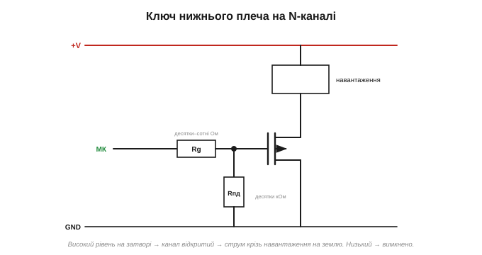
*Рис. 2.7.6.1. Канонічний low-side ключ. Навантаження між +V і стоком; витік на землю; затвор — від ніжки МК через резистор затвора, плюс підтяжний резистор донизу. Високий рівень на затворі вмикає, низький — вимикає.*

Чому нижнє плече таке зручне? Бо керівна напруга міряється **затвор–витік** ([§2.7.4](mosfet.md)), а в нижньому плечі витік **прибитий до землі** — він не рухається. Тож 5 В від мікроконтролера на затворі дають рівно Vgs = 5 В, просто й передбачувано. І навантаження тому ставлять між +V і **стоком**, а не під витоком: якби воно висіло під витоком, то, відкриваючись, MOSFET підіймав би витік, Vgs зменшувалася б — ключ сам себе прикривав (та сама «кволість» NMOS згори, [§2.7.4](mosfet.md)). Прибитий до землі витік дає затвору повну, незмінну Vgs.

### Дві деталі біля затвора, яких не було в біполярного

Затвор MOSFET — це конденсатор, що в спокої струму не бере ([§2.7.1](mosfet.md)). Тому, на відміну від біполярного, тут **не треба** рахувати струм керування й резистор бази під нього. Але з'являються дві інші деталі, специфічні саме для MOSFET.

**Резистор затвора** *(gate resistor)* — невеликий (десятки–сотні ом) резистор **послідовно** із затвором. Навіщо, якщо струму немає? Бо в **мить** перемикання затвор-конденсатор треба зарядити, і без обмеження ніжка МК віддала б різкий кидок струму, а на паразитних індуктивностях виникло б дзвоніння. Резистор затвора **обмежує** цей кидок і гасить дзвін. Він не для сталого струму (його нема), а для **перехідного**. Той самий резистор дає й безкоштовний **плавний пуск**: він трохи сповільнює відкривання, тож навантаження з великою початковою ємністю (довгі світлодіодні стрічки, входи з конденсаторами) вмикаються не різким кидком струму, а м'якше. Більший резистор — повільніше й м'якше; та надто великий шкодить **швидкому** перемиканню, тож тут шукають баланс.

А якщо перемикати треба **часто** — тисячі разів за секунду (керування яскравістю, обертами)? Тоді цей перехідний кидок повторюється безперервно, і для великих MOSFET кволої ніжки МК уже бракує, щоб устигати перезаряджати затвор: ставлять окремий **драйвер затвора** *(gate driver)* — підсилювач, що жене в затвор потужні короткі імпульси. Чому це так важливо для швидкості й грійки — у [§2.7.7](mosfet.md).

**Підтяжний резистор** *(pull-down)* — резистор (10–100 кОм) від затвора **до землі**. Це найважливіша й найчастіше забувана деталь. Поки мікроконтролер не налаштував свою ніжку (під час скидання, увімкнення живлення, перепрошивки), вона висить у **високоомному** стані — нічого не задає. А затвор-конденсатор тримає той заряд, що випадково на нього потрапив, і MOSFET може **сам собою прочинитися** й увімкнути навантаження не до речі. Підтяжний резистор тихо стягує затвор до нуля, тож «коли ніхто не керує — вимкнено».

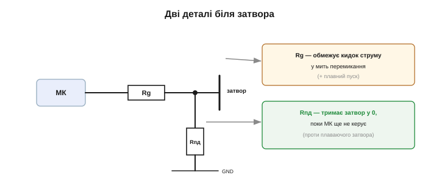
*Рис. 2.7.6.2. Дві деталі біля затвора. Послідовний резистор (десятки–сотні Ом) обмежує кидок струму в мить перемикання. Підтяжний резистор (десятки кОм) до землі тримає затвор у нулі, поки МК його не керує.*

> 🔧 **Навіщо це.** **Плаваючий затвор** *(floating gate)* — класична халепа новачка з MOSFET. Зібрав ключ без підтяжки — і навантаження то вмикається саме, то «залипає», бо затвор-конденсатор тримає випадковий заряд, а ніжка під час старту МК ще не керує. Завжди став підтяжний резистор: для n-канального **донизу** (до землі — щоб у спокої було закрито), для p-канального — **догори** (до +V, бо його вимикає висока напруга на затворі). Кілька десятків кОм — і проблеми як не було.

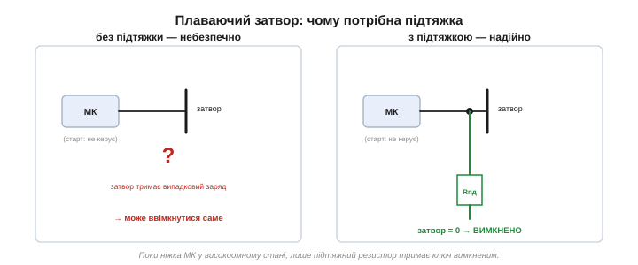
*Рис. 2.7.6.3. Плаваючий затвор. Ліворуч: без підтяжки, поки МК ще не керує (старт, скидання), затвор-конденсатор тримає випадковий заряд — навантаження може ввімкнутися саме. Праворуч: підтяжний резистор стягує затвор до нуля — у спокої надійно вимкнено.*

### Логічний рівень — обов'язково

Повторимо найважливіше з [§2.7.3](mosfet.md) і [§2.7.5](mosfet.md), бо саме тут це б'є боляче: керуючи MOSFET від мікроконтролера (3.3 чи 5 В), бери прилад **логічного рівня**, повністю відкритий при твоїй напрузі. Інакше канал прочиниться лише трохи, Rds(on) буде великий, ключ розжариться й, можливо, згорить. Перевіряй у даташиті не сам поріг, а **Rds(on) при твоїй Vgs**.

> 🔌 **Як упізнати такий прилад.** Чому звичайний MOSFET від 3.3/5 В лишається гарячим, як прочитати в даташиті, що прилад «логічного рівня» (рядок Rds(on) @ Vgs), і чим відрізняються класи IRF540 / IRLZ44 / AO3400 — у компонентній вставці [«MOSFET логічного рівня»](comp-logic-level.md).

> ⚙️ **А чи перегріється.** Як із Rds(on) і струму порахувати температуру кристала за «тепловим законом Ома» (Tj = Tamb + P·θ) і винести вердикт «чи треба радіатор» — в [алгоритмічній вставці «Тепловий розрахунок ключа»](proj-thermal-calc.md).

### Індуктивне навантаження — гасний діод

Якщо навантаження індуктивне (моторчик, реле, соленоїд), при вимиканні воно «брикається» викидом напруги ([§2.2.5](../inductor/inductor.md)) — і цей викид може пробити MOSFET. Як і з біполярним ([§2.6.6](../bjt/bjt.md), [§2.5.9](../diode-pn-junction/diode-pn-junction.md)), рятунок — **гасний діод** паралельно навантаженню, катодом до +V: він замикає викид на себе.

Тут є тонкість, варта уваги. У MOSFET є **вбудований діод** *(body diode)* між витоком і стоком ([§2.7.2](mosfet.md)). Може здатися, ніби він і захистить від викиду — але **ні**: у схемі нижнього плеча викид від навантаження задирає **стік** угору, а вбудований діод для такої полярності закритий (катод на стоці). Тож **зовнішній гасний діод на навантаженні все одно потрібен** — вбудований діод тут не рятує (він стає в пригоді в інших схемах — мостах, верхньому плечі, при зворотній полярності).


*Рис. 2.7.6.4. Для індуктивного навантаження — зовнішній гасний діод паралельно навантаженню (катод до +V). Вбудований діод MOSFET (витік→стік) при викиді на стоці закритий, тож не захищає — зовнішній діод обов'язковий.*

### Верхнє плече: коли треба комутувати «плюс»

Іноді треба розривати не землю, а **+V** (наприклад, щоб геть знеструмити навантаження). Це **верхнє плече** *(high-side)*. Тут зручний **p-канальний** MOSFET: витік до +V, навантаження під стоком, а вмикають його, **притягнувши затвор до землі** (Vgs стає від'ємним, [§2.7.4](mosfet.md)) — просто й без зайвих напруг. Можна й n-канальний у верхньому плечі (він ефективніший), але йому на затвор треба напругу **вищу за +V**, а її доводиться добувати окремою схемою — **зарядовою помпою** *(charge pump)* чи драйвером. Тому для простого вимикача живлення беруть PMOS, а N-канал угорі — там, де потрібна гранична ефективність.

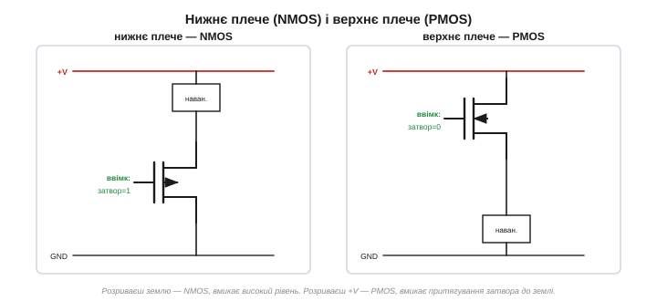
*Рис. 2.7.6.5. Нижнє плече: NMOS, витік до землі, вмикає високий рівень на затворі. Верхнє плече: PMOS, витік до +V, вмикає притягування затвора до землі. P-канал у верхньому плечі — найпростіший шлях комутувати «плюс».*

Гарний побічний фокус, що випливає з усього вивченого: MOSFET — чудовий **захист від зворотної полярності** живлення. Звичайний діод послідовно теж захистив би, але спадав би на собі ~0.7 В і грівся ([§2.5.9](../diode-pn-junction/diode-pn-junction.md)). А MOSFET, увімкнений «назустріч» струму, за правильної полярності сам відкривається й проводить майже без втрат (лише Rds(on)!), а за зворотної — лишається закритим. Виходить «розумний діод» зі спадом у мілівольти замість вольта; саме тому його часто й ставлять на вході живлення пристроїв.

> 🔌 **Порахуймо й зберемо.** Скільки саме потужності крав би діод (1.2 Вт проти 0.18 Вт на 3 А), як самозміщений P-MOS вмикається сам за правильної полярності й блокує за зворотної, і що роблять мікросхеми-контролери «ідеального діода» — у компонентній вставці [«Ідеальний діод»](comp-ideal-diode.md).

### Порівняння з біполярним ключем

Поставмо поряд два ключі — біполярний ([§2.6.6](../bjt/bjt.md)) і MOSFET, — щоб різниця вляглася.

- **Біполярний:** керується **струмом**; резистор бази рахують під потрібний Ib = Ic/β; струм керування тече весь час, поки ключ відкритий; спад на ключі — сталі ~0.2 В.
- **MOSFET:** керується **напругою**; резистор затвора малий і потрібен лише для перехідного кидка; струму керування в спокої немає; спад — Id·Rds(on), часто менший за біполярний; додають підтяжку проти плаваючого затвора.

Для більшості сучасних задач MOSFET-ключ зручніший і холодніший — тому він і став **типовим** ключем у саморобній електроніці. Біполярний лишається там, де він і так під рукою, або для зовсім дрібних навантажень.


*Рис. 2.7.6.6. Біполярному в базу ллють струм (резистор бази під Ib); MOSFET керується напругою (резистор затвора + підтяжка, струму керування нема). MOSFET зазвичай холодніший і простіший у керуванні.*

Цей скромний ключ — насправді робоча конячка всієї силової електроніки. Тим самим прийомом мікроконтролер вмикає й вимикає геть усе: світло, нагрівачі, помпи, моторчики, клапани. А коли його перемикати **швидко** й керувати **часткою** часу у ввімкненому стані (широтно-імпульсна модуляція, ШІМ — *PWM*), той самий ключ плавно регулює яскравість світла, оберти мотора чи напругу перетворювача — і майже не гріється, бо у відкритому стані спад малий, а в закритому струму нема. Саме на MOSFET-ключах побудовано драйвери моторів, що рухатимуть наші майбутні проєкти.

### Зберімо приклад докупи

Хай треба вмикати з 5-вольтового мікроконтролера **моторчик 12 В / 2 А**. Збираємо low-side ключ:

```
1) MOSFET: n-канальний, ЛОГІЧНОГО РІВНЯ (повністю відкритий при Vgs = 5 В)
   Id(max) ≥ 2·2 = 4 А;   Vds(max) > 12 В + запас на викиди (бери ≥ 30 В)
2) затвор: послідовний резистор ~100 Ом  +  підтяжка 10 кОм до землі
3) навантаження (мотор) між +12 В і стоком; витік на землю
4) гасний діод паралельно мотору (катод до +12 В)
5) грійка: при Rds(on) ≈ 20 мОм →  P = Id²·Rds(on) = 4 · 0.02 = 0.08 Вт (холодний)
```

П'ять кроків — і надійний ключ на копійчаних деталях, що холодно жене два ампери. Із поширених логічного рівня під таку задачу годяться, наприклад, IRLZ44N (наскрізний TO-220) чи дрібний AO3400 у корпусі SOT-23 для менших струмів. Назви запам'ятовувати не треба — досить уміти прочитати в даташиті Id(max), Vds(max) і Rds(on) при потрібній Vgs, як ми щойно й зробили. Зверніть увагу: ми **не рахували струм затвора** (його нема) — лише подбали про логічний рівень, підтяжку й гасний діод. Якби струм був більший або MOSFET — не логічного рівня, грійка вийшла б помітна, і знадобився б радіатор (чи прилад із меншим Rds(on)). Але для мирних кількох амперів логічного рівня MOSFET у дрібному корпусі впорається без жодного радіатора — і це типова картина в саморобних схемах.

У шумних чи високовольтних колах до набору додають ще одну деталь — захисний **стабілітрон** ([§2.5.8](../diode-pn-junction/diode-pn-junction.md)) між затвором і витоком: він не дає напрузі на тонкому оксиді ([§2.7.2](mosfet.md)) перевищити безпечну межу й пробити затвор статикою чи викидом. Для мирних 5 В від мікроконтролера він не потрібен, але в силових драйверах — звична осторога.

> 🔧 **Навіщо це.** Запам'ятайте «джентльменський набір» MOSFET-ключа нижнього плеча: **(1)** логічного рівня під вашу напругу; **(2)** резистор затвора (десятки–сотні Ом); **(3)** підтяжка донизу (десятки кОм); **(4)** гасний діод, якщо навантаження індуктивне; **(5)** перевірена грійка P = Id²·Rds(on). Пропустиш підтяжку — ключ «живе своїм життям»; пропустиш гасний діод на моторі — раніше чи пізніше пробитий MOSFET; візьмеш не логічного рівня — грітиметься. Усі чотири граблі добре відомі — і легко обходяться.

### Що далі

Ми зібрали робочий ключ — і поки що вмикали його **повільно** (увімкнув і тримай). Та коли MOSFET перемикають **швидко** — тисячі й мільйони разів за секунду, щоб керувати яскравістю, обертами чи будувати перетворювач живлення, — на сцену виходить затвор-конденсатор: його щоразу треба перезаряджати, і це і обмежує швидкість, і додає втрат. Саме цьому — швидкості перемикання — присвячена наступна тема.

> ▶️ Далі: [§2.7.7 Затвор як ємність: швидкість перемикання](mosfet.md)

## 2.7.7 Затвор як ємність: швидкість перемикання

У [§2.7.1](mosfet.md) ми з'ясували: затвор — це конденсатор, і в **спокої** він струму не бере. Та сама властивість має зворотний бік: щоб **перемкнути** MOSFET, цей конденсатор треба щоразу **зарядити** (увімкнути) чи **розрядити** (вимкнути). Поки ми вмикали ключ зрідка, це було байдуже. Але коли MOSFET перемикають **тисячі й мільйони разів за секунду** — у ШІМ-регуляторах, перетворювачах живлення, — заряджання затвора стає головним: воно і обмежує **швидкість**, і додає **втрат**. Це друга половина історії втрат, доповнення до Rds(on) з [§2.7.5](mosfet.md).

### Заряд затвора Qg — скільки треба «налити»

Ємність затвора — величина примхлива: вона змінюється з напругою, тож рахувати нею незручно. Тому в даташиті подають інше, практичніше число — **повний заряд затвора** *(total gate charge, Qg)*: скільки заряду (у нанокулонах, нКл) треба «впхати» в затвор, щоб повністю його відкрити. Хочеш увімкнути — достав у затвор Qg; хочеш вимкнути — забери Qg назад.

Це наче відерце, яке треба наповнити, щоб ключ відкрився, і спорожнити, щоб закрився. Розмір відерця — Qg — і визначає, скільки «роботи» на кожне перемикання. У дрібних сигнальних MOSFET воно крихітне (одиниці нКл), у потужних силових — десятки й сотні нКл.

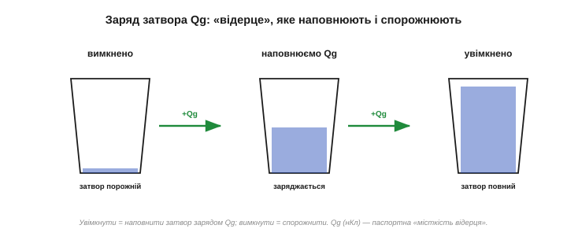
*Рис. 2.7.7.1. Затвор — це відерце місткістю Qg (нанокулони). Щоб увімкнути MOSFET, його треба наповнити зарядом, щоб вимкнути — спорожнити. Більший прилад — більше відерце, більший Qg.*

Чому саме заряд, а не ємність? Бо ємність затвора **нелінійна** — вона помітно більша, поки канал відкривається, і менша потім. Рахувати зі змінною ємністю незручно, а **повний заряд** Qg усе це вже враховує одним числом: він і є та ємність, проінтегрована по напрузі. Тому даташити оперують зарядом Qg і готовою кривою «напруга затвора від заряду» (її ми побачимо нижче).

> 🧮 **У числах.** Чому ємність бреше, що означають частини кривої заряду (Qgs і Міллерів Qgd) і як із Qg порахувати струм драйвера (I = Qg / t) та втрати на перемикання — у математичній вставці [«Заряд затвора Qg: кулони, а не фаради»](math-gate-charge.md).

### Швидкість: час ≈ Qg / струм у затвор

Як швидко перемкнеться ключ? Рівно настільки, наскільки швидко ми зможемо доставити (чи забрати) той заряд Qg. А швидкість доставки заряду — це **струм**: заряд = струм × час, тож

```
час перемикання ≈ Qg / I(затвора)
```

Чим більший струм у затвор, то швидше наповнюється «відерце». Кволенька ніжка мікроконтролера дає одиниці міліампер — заряджатиме повільно; потужний **драйвер затвора** дає ампери — наповнить миттю.

Порахуймо. Хай Qg = 30 нКл:

```
ніжка МК (4 мА):     t = Qg / I = 30 нКл / 4 мА   = 7.5 мкс   (повільно)
драйвер затвора (1 А): t = Qg / I = 30 нКл / 1 А   = 30 нс     (миттєво)
```

Та сама ємність — а різниця у швидкості в **250 разів**, бо в 250 разів різний струм заряду. Ось чому для швидкого перемикання потужних MOSFET ніжки МК замало.

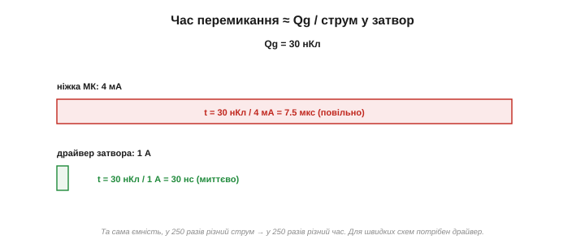
*Рис. 2.7.7.2. Час перемикання = Qg, поділений на струм заряду. Ніжка МК (міліампери) заряджає затвор мікросекунди; драйвер затвора (ампери) — наносекунди. Той самий Qg, у сотні разів різна швидкість.*

Зверніть увагу: **вимикання** так само потребує струму — щоб **витягти** заряд Qg назад із затвора. Якщо лишити затвор спорожнюватися лише крізь підтяжний резистор ([§2.7.6](mosfet.md)), він розрядиться повільно, і ключ довго гаснутиме (а отже, довго стоятиме в гарячій напіввідкритій зоні). Тому драйвер жене струм в **обидва** боки — швидко наповнює й швидко спорожняє «відерце».

### Плато Міллера: чому в середині «затинається»

Заряджання затвора не рівномірне — у ньому є підступна **сходинка**. Коли напруга на затворі доходить до певного рівня й MOSFET починає **перемикати напругу на стоці**, затвор на якийсь час ніби **застрягає**: напруга на ньому майже не росте, хоч заряд далі вливається. Цю «полицю» звуть **плато Міллера** *(Miller plateau)*.

Звідки воно? У MOSFET є невелика ємність **затвор–стік** (її звуть міллерівською). Поки стік різко змінює свою напругу під час перемикання, ця ємність «перекачує» заряд, і весь струм затвора йде на неї, а не на підняття напруги затвора — звідси й застій. Саме на плато Міллера й минає **більша частина** часу перемикання, і саме там MOSFET найдовше перебуває в небезпечному напіввідкритому стані. Нам не треба рахувати це точно — досить розуміти: у заряді Qg є «горб», що й гальмує перехід.

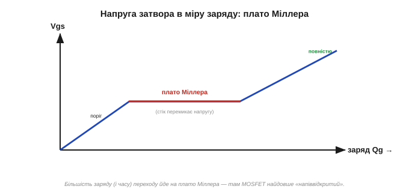
*Рис. 2.7.7.3. Напруга затвора в міру вливання заряду: спершу росте, тоді застрягає на плато Міллера (стік перемикає напругу), далі росте знову. Більшість часу переходу — на цьому плато; саме воно гальмує перемикання.*

У плато Міллера є й підступний практичний наслідок. Та сама ємність затвор–стік може **перекинути** різкий стрибок напруги зі стоку назад на затвор і ненароком прочинити (чи не дати закрити) ключ — це звуть **паразитним вмиканням**. Тому в швидких схемах затвор тримають «міцно»: драйвером із малим вихідним опором, розташованим **близько** до затвора, щоб той не гуляв сам по собі. Для повільних схем це знову ж таки байдуже, а от для імпульсних перетворювачів паразитне вмикання — реальна причина перегріву й відмов, тож близький потужний драйвер там не примха, а необхідність.

### Втрати на перемикання

Згадаймо [§2.7.5](mosfet.md): найгарячіший стан MOSFET — **напіввідкритий**, коли на ньому водночас і чимала напруга, і чималий струм. У сталому режимі ключ туди не потрапляє (він або повністю відкритий, або закритий). Але **під час кожного перемикання** він **мусить пройти** крізь цю зону — на ту коротку мить, поки заряджається затвор. І там спалахує **сплеск потужності**: напруга й струм перекриваються, виділяється порція тепла.

Енергія, втрачена за одне перемикання, приблизно `E ≈ ½ · V · I · t(перемикання)`. Що **швидше** перемикання (менший t), то менша ця порція — ось ще навіщо швидкий драйвер. А тепер головне: ця енергія губиться **на кожному** перемиканні, тож сумарна **втрата на перемикання** *(switching loss)* росте з **частотою**:

```
P(перемикання) ≈ E · f       (енергія за один раз × скільки разів за секунду)
```

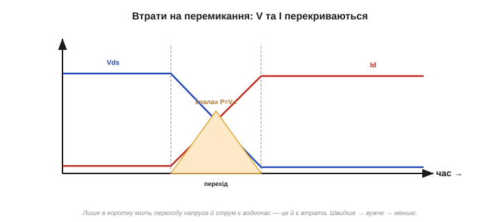
*Рис. 2.7.7.4. У мить перемикання напруга на ключі й струм крізь нього перекриваються — спалах потужності (тепла). Що швидший перехід, то вужчий спалах і менша втрачена енергія. Тому швидкий драйвер економить тепло.*

Числа на відчуття. Хай ключ комутує 12 В і 2 А, а перехід триває t = 1 мкс. Енергія за один перехід: E ≈ ½·V·I·t = 0.5·12·2·(1·10⁻⁶) = 12 мкДж. На частоті 20 кГц це P = E·f = 12 мкДж · 20000 = **0.24 Вт** — терпимо. А на 200 кГц — уже **2.4 Вт**, удесятеро більше, бо вдесятеро частіше перемикаємо. Прискорив би драйвер перехід до 0.1 мкс — і втрата впала б у десять разів. Ось чому на високих частотах борються за кожну наносекунду переходу.

А чи завжди швидше — краще? Ні. Згадаймо резистор затвора з [§2.7.6](mosfet.md): більший резистор уповільнює заряд Qg, тож перемикання м'якше — менше різких стрибків напруги й струму, а отже менше **електромагнітних завад** *(EMI)* та дзвоніння. Але сповільнення збільшує втрати на перемикання й грійку. Тому резистором затвора **балансують**: швидше — холодніше, але «брудніше» в ефірі; повільніше — тихіше, але гарячіше. Інженер шукає золоту середину між втратами й завадами.

### Дві втрати, дві поведінки

Тепер видно повну картину втрат у силовому ключі — і вона з **двох** доданків із різною поведінкою:

- **Провідні втрати** *(conduction)*, P = Id²·Rds(on) ([§2.7.5](mosfet.md)) — від струму й опору; від **частоти не залежать**.
- **Втрати на перемикання** *(switching)*, P = E·f — від енергії переходу й частоти; **ростуть із частотою**.

За низьких частот головні — провідні втрати (дивись на Rds(on)). За високих — верх беруть втрати на перемикання (дивись на Qg і швидкість драйвера). Десь є межа, де вони зрівнюються; вище неї частоту піднімати вже невигідно — ключ перегріється саме від перемикань.

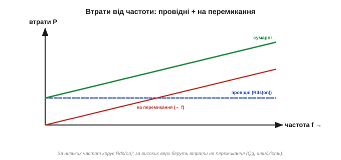
*Рис. 2.7.7.5. Провідні втрати від частоти не залежать (рівна лінія). Втрати на перемикання ростуть із частотою. Сумарні — їхня сума: за низьких частот керує Rds(on), за високих — Qg і швидкість перемикання.*

Приклад із життя: керуючи обертами мотора через ШІМ, інженер обирає частоту як компроміс. Низька (скажімо, 1 кГц) — чути неприємний писк, зате втрат на перемикання майже нема. Висока (20–30 кГц, вище чутного) — тиша, але вже відчутні втрати на перемикання, тож потрібен пристойний драйвер і, можливо, радіатор. Тому типові драйвери моторів і працюють десь на 20 кГц — щойно за межею чутного, де ще не пече перемиканнями.

І ще ширша думка. Кожне перемикання будь-якого MOSFET коштує енергії на перезаряд його ємностей — близько ½·C·V² на затвор. У процесорі таких перемикань — мільярди транзисторів, помножені на мільярди тактів за секунду; і вся та крихітна енергія, складена докупи, і є тепло, що його відводить радіатор на чипі. Розженеш частоту вдвічі — удвічі більше перемикань — удвічі більше тепла. Саме тому процесори впираються в «теплову стелю»: це той самий заряд затвора, лише в неосяжному масштабі.

> 🔧 **Навіщо це.** Звідси й практичний поділ. **Простий ключ** (увімкнув реле, лампу, нагрівач — перемикань мало): втрати на перемикання мізерні, дивись лише на Rds(on), і ніжки МК для затвора цілком досить. **Швидкий ШІМ чи перетворювач живлення** (десятки–сотні кГц): втрати на перемикання вже відчутні — потрібні і малий Qg, і **швидкий драйвер затвора**, що жене ампери, аби пройти небезпечну зону якнайшвидше. Не плутай ці два світи: те, що байдуже для реле, критичне для імпульсного перетворювача.

### Драйвер затвора

Звідси й окрема деталь у швидких схемах — **драйвер затвора** *(gate driver)*: невелика мікросхема (або каскад), що приймає кволий логічний сигнал від МК і видає в затвор **потужні короткі імпульси** струму — амперні, в обидва боки (швидко зарядити й швидко розрядити). Він — як підсилювач струму спеціально для затвора: сам МК такого кидка не подужає, а драйвер легко.

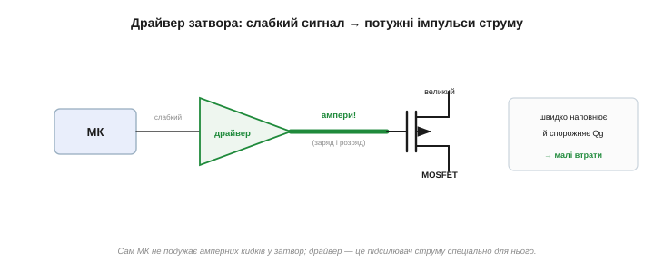
*Рис. 2.7.7.6. Між МК і затвором ставлять драйвер: він приймає слабкий логічний сигнал і видає в затвор потужні імпульси струму (ампери), щоб швидко наповнювати й спорожняти Qg. Сам МК для великих MOSFET надто кволий.*

> 🔌 **Що всередині й навіщо бутстреп.** Який «тотемний» вихід жене ці ампери, як драйвер живить затвор **верхнього** N-ключа над силовою шиною (бутстрепний конденсатор) і чим відрізняються низькобічні, півмостові та ізольовані драйвери — у компонентній вставці [«Драйвер затвора»](comp-gate-driver.md).

Для більшості наших майбутніх проєктів — увімкнути моторчик, світлодіод, помпу — усе це «повільні» перемикання, і ніжки мікроконтролера з резистором затвора цілком досить; про Qg можна навіть не згадувати. Знати про заряд затвора варто на той випадок, коли візьметеся за щось **швидке** — імпульсний перетворювач, потужний світлодіодний драйвер, керування двигуном на високій частоті. Тоді Qg і драйвер виходять на перший план, і саме вони, а не Rds(on), вирішують, чи буде ключ холодним.

> 🔧 **Навіщо це.** Згадаймо компроміс Rds(on)·Qg із [§2.7.5](mosfet.md): малий Rds(on) зазвичай дається ціною більшого затвора (більшого Qg), бо обидва ростуть із розміром кристала. Тому «найкращого взагалі» MOSFET немає — є найкращий **під твою частоту**: для рідкісних перемикань бери найменший Rds(on) (Qg байдужий), для високочастотного ШІМ шукай баланс, а то й жертвуй опором заради меншого заряду й швидшого, холоднішого перемикання.

### Що далі

Отже, затвор-конденсатор у спокої безкоштовний, але на кожне перемикання вимагає заряду Qg — а це і обмежує швидкість (час ≈ Qg/струм), і додає втрат, що ростуть із частотою. До речі, та сама фізика — заряд-розряд ємностей на кожному такті — керує й споживанням **цифрових** мікросхем: знаменита формула «потужність = ємність × напруга² × частота» описує саме це, тільки для мільярдів крихітних затворів у процесорі. До цього ми повернемося в [§2.7.9](mosfet.md). А спершу — підсумуймо все протистояння двох транзисторів: коли брати біполярний, а коли польовий.

> ▶️ Далі: [§2.7.8 BJT проти MOSFET: коли що](mosfet.md)

## 2.7.8 BJT проти MOSFET: коли що

Ми вивчили обидва транзистори — біполярний ([Розділ 2.6](../bjt/bjt.md)) і польовий (цей розділ). Час звести їх віч-на-віч і відповісти на питання, яке щоразу постає за робочим столом: **коли який брати?** Гарна новина — відповідь майже завжди проста, і випливає вона з однієї-єдиної кореневої відмінності.

### Корінь усього: струм проти поля

Уся різниця між ними виростає з одного: **чим керують**.

- **Біполярний** керується **струмом** бази: щоб тримати його відкритим, у базу весь час тече Ib = Ic/β ([§2.6.4](../bjt/bjt.md)).
- **Польовий** керується **полем** — напругою на затворі, а струму в затвор у спокої нема ([§2.7.1](mosfet.md)).

З цього єдиного факту випливає **геть усе** інше: і вхідний опір, і характер втрат, і поведінка з температурою, і придатність до масової цифрової логіки. Тримаймо цей корінь у голові — і решта запам'ятається сама.

Образно: біполярним керуєш, **тиснучи на педаль струмом** (відпустив — заглух), а польовим — **повертаючи перемикач напруги** (поставив — і тримається сам). Перший витрачає пальне на саме лиш утримання педалі; другий — ні. Усе подальше — лише наслідки цього.

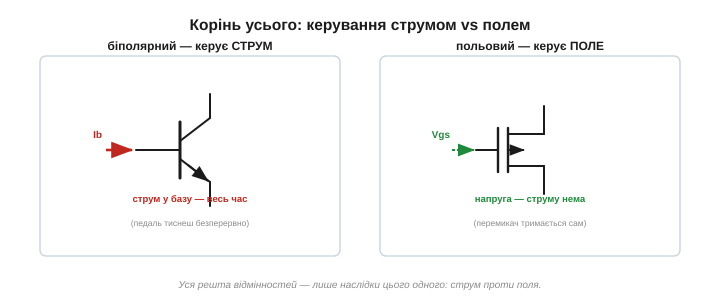
*Рис. 2.7.8.1. Одна коренева різниця. Біполярний треба «годувати» струмом бази весь час; польовий тримається полем задарма. З цього й виростають усі інші відмінності.*

### Таблиця віч-на-віч

Зведімо головне в одну таблицю — її варто закарбувати.

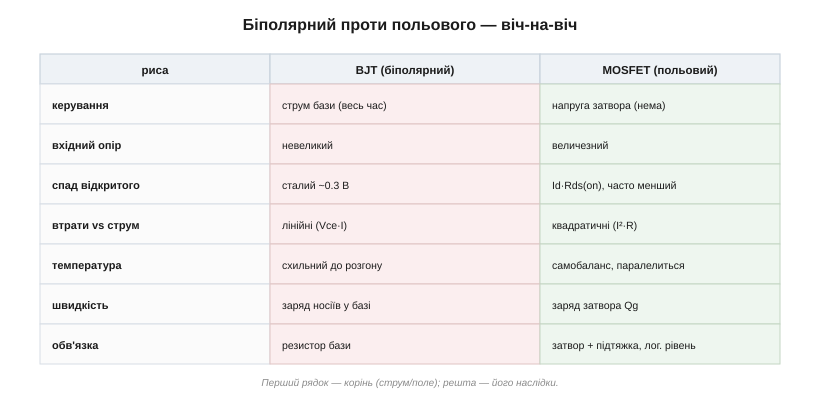
*Рис. 2.7.8.2. Біполярний проти польового за всіма рисами. Перший рядок — корінь (струм/поле), решта — його наслідки.*

Словами, рядок за рядком:

- **Керування:** BJT — струмом бази (тече весь час); MOSFET — напругою затвора (струму в спокої нема).
- **Вхідний опір:** BJT — невеликий (сотні ом, вантажить джерело); MOSFET — величезний (трильйони ом, майже не вантажить).
- **Спад у відкритому стані:** BJT — майже сталі Vce(sat) ≈ 0.2–0.3 В; MOSFET — резистивний Id·Rds(on), часто менший ([§2.7.5](mosfet.md)).
- **Втрати від струму:** BJT — лінійні (Vce·I); MOSFET — квадратичні (I²·Rds(on)), але за помірних струмів менші.
- **Температура:** BJT — схильний до теплового розгону; MOSFET — самобалансується (Rds(on) росте з нагрівом), легко паралелиться.
- **Швидкість:** в обох є межа, але різної природи — у BJT накопичення носіїв у базі, у MOSFET заряд затвора Qg ([§2.7.7](mosfet.md)).
- **Обв'язка:** BJT — резистор бази під струм; MOSFET — резистор затвора + підтяжка, і обов'язково логічний рівень.

Один нюанс на захист біполярного варто тримати в голові. Його спад **сталий** (~0.3 В), а в MOSFET — резистивний (Id·Rds(on)), тож росте зі струмом. За **дуже** великих струмів настає мить, коли Id·Rds(on) перевищує ті 0.3 В, і біполярний вихід (чи його нащадок IGBT) знову стає холоднішим ([§2.7.5](mosfet.md) — ми вже бачили цю точку перетину). Саме тому в надпотужних колах повертаються до біполярного виходу. Але для звичайних кількох-десятків амперів MOSFET попереду.

І ще одна практична відмінність, про яку згадують рідше, — **живучість**. У біполярного немає тонкого підзатворного оксиду, тож статики він майже не боїться: кинув у коробку, припаяв голіруч — нічого йому не станеться. А затвор MOSFET — це кілька атомів скла ([§2.7.2](mosfet.md)), і необережний доторк зарядженою рукою здатен пробити його назавжди. Тому MOSFET зберігають у провідній упаковці й паяють обачніше. За зручність керування полем платять крихкістю затвора.

### Коли виграє MOSFET (а це майже завжди)

Чесно кажучи, у більшості сучасних задач перемагає **польовий**:

- **Силове перемикання** — моторчики, перетворювачі, силові ключі: малий Rds(on), холодний, керується напругою прямо з логіки ([§2.7.6](mosfet.md)).
- **Цифрова логіка** — уся вона на КМОН, бо в спокої майже не споживає ([§2.7.9](mosfet.md)).
- **Батарейні пристрої** — нульова потужність керування продовжує життя батареї.
- **Високий вхідний опір** — буфери, входи давачів, що їх не можна вантажити.
- **Будь-що масове чи інтегроване** — мільярди на чипі.

Окремо наголосімо на цифрі: саме там перемога польового цілковита й безповоротна. Біполярна логіка існувала (сімейства TTL, ECL), і працювала швидко, але кожен вентиль безперервно тягнув струм і грівся, тож багато їх на чип не вмістиш. КМОН на польових майже не споживає в спокої — і тільки тому вдалося стиснути мільярди вентилів в один процесор, не розплавивши його. Без MOSFET сучасного комп'ютера просто не існувало б.

### Коли все ще беруть BJT

Та біполярний не зник — у нього лишилися свої вотчини, переважно **аналогові**:

- **Точний аналог:** його передбачувана експоненційна залежність струму від напруги — основа **дзеркал струмів** *(current mirror)*, опорних джерел, температурних давачів (через стабільне падіння Vbe ≈ 0.7 В, що рівно повзе з температурою).
- **Малошумні й узгоджені пари** — там, де треба два однаковісінькі прилади поряд (диференційні каскади).
- **Дрібні дешеві ключі** — коли біполярний і так під рукою, а навантаження мізерне, його простота виграє.

Чому аналогові інженери досі люблять біполярний? У нього вища **крутість** *(transconductance, gm)* на той самий струм — з даного струму він «вичавлює» більше підсилення; його експонента напрочуд точна й передбачувана на багато порядків струму (звідси логарифмічні та опорні схеми); а два сусідні біполярні на кристалі виходять разюче однаковими, що безцінно для точних диференційних пар. MOSFET у цьому всьому трохи «м'якший» і примхливіший, тож у прецизійному аналозі біполярний і досі вдома.

Щоправда, у багатьох аналогових задачах і BJT, і MOSFET давно потіснив **операційний підсилювач** — готова мікросхема, якій байдуже, що в неї всередині ([Розділ 2.8](../opamp-comparator/opamp-comparator.md)). Це загальна тенденція: дискретні підсилювачі — що на біполярних, що на польових — у саморобній практиці майже зникли, поступившись готовим операційникам. Тому на ділі питання «BJT чи MOSFET?» постає здебільшого про **перемикання** (а там відповідь — MOSFET) та про вибір **усередині** мікросхем, який роблять уже їхні розробники. Окремий транзистор саморобник найчастіше бере саме як ключ.

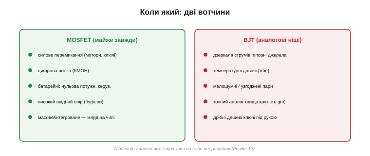
*Рис. 2.7.8.3. MOSFET бере силове перемикання, цифру, економність, високий вхідний опір. BJT лишається в точному аналозі: дзеркала струмів, опорні джерела, малошумні пари.*

Цікаво, що й «повільність» у них різної природи. Біполярний у глибокому насиченні **накопичує** надлишкові носії в базі, і щоб його закрити, ті носії спершу треба розсмоктати — це й гальмує вимикання (час розсмоктування). MOSFET носіїв не накопичує: його швидкість упирається тільки в заряд затвора Qg ([§2.7.7](mosfet.md)), який можна качати скільки завгодно швидко потужним драйвером. Тому на дуже високих частотах перемикання польовий знову попереду.

### Правило вибору на одному диханні

Якщо звести все до короткого рецепта:

```
Перемикати потужне навантаження?      → MOSFET (логічного рівня)
Цифрова логіка / економність?          → MOSFET (КМОН)
Точний аналог: дзеркало, опора, пара?  → BJT (або операційник, Розділ 2.8)
Просто ввімкнути світлодіод/реле?       → байдуже, що під рукою
```

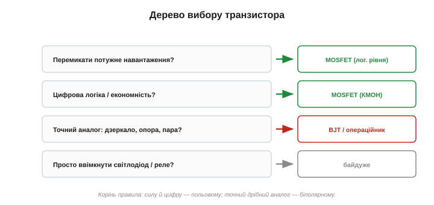
*Рис. 2.7.8.4. Дерево вибору. Силове перемикання й цифра — MOSFET; точний дрібний аналог — BJT (чи операційник). Для простого ввімкнення згодяться обидва.*

Ще приклад того, як корінь визначає зручність. Щоб біполярним керувати від зовсім кволого джерела, доводиться нарощувати підсилення — складати пару Дарлінгтона ([§2.6.8](../bjt/bjt.md)), бо одного β замало. MOSFET же кволому джерелу майже не опирається: дай лише потрібну **напругу** — і він відкриється, струму з джерела майже не відбираючи. Тому керувати польовим від слабкої логіки чи давача простіше з самого початку.

### Та сама задача двома шляхами

Покажемо різницю на одній задачі — увімкнути **моторчик 2 А** з мікроконтролера.

```
Біполярним:  β = 100 → у базу весь час ~20 мА; Vce(sat) ≈ 0.3 В
             → спад 0.3 В на 2 А = 0.6 Вт + витрата на базу, гарячіше
MOSFET-ом:   струм затвора ≈ 0; Rds(on) ≈ 20 мОм (логічного рівня)
             → спад Id·Rds = 0.04 В; P = I²·Rds = 4·0.02 = 0.08 Вт, холодний
```

Польовий і холодніший (0.08 проти 0.6 Вт), і не марнує струму на керування. Для **перемикання** висновок однозначний. А от якби стояла **аналогова** задача — скажімо, зробити стабільне джерело струму чи виміряти температуру за падінням Vbe, — у руку лягав би вже біполярний із його чесною експонентою.

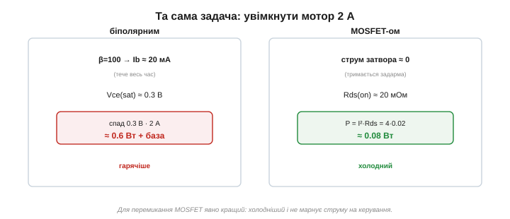
*Рис. 2.7.8.5. Один ключ на 2 А двома способами. Біполярний: ~20 мА в базу весь час, спад 0.3 В, ~0.6 Вт. MOSFET: затвор задарма, спад 0.04 В, 0.08 Вт. Для перемикання MOSFET явно кращий.*

На практиці обидва транзистори — копійчані й усюди доступні, тож вибір диктує не ціна, а задача. Простий орієнтир для саморобника-початківця: тримай у наборі деталей кілька логічного рівня N-канальних MOSFET (для ввімкнення навантажень) і жменю дрібних біполярних (для аналогових дрібниць) — і майже все буде під рукою на будь-який випадок.

> 🔧 **Навіщо це.** Робоче правило для саморобника, на один рядок: **перемикаєш потужність або робиш цифру — MOSFET; робиш точний дрібний аналог — BJT (а частіше операційник).** А для звичайного «ввімкнути навантаження з ардуїно» бери low-side ключ на логічного рівня MOSFET ([§2.7.6](mosfet.md)) — це сучасний типовий вибір, що майже ніколи не підведе. А якщо колись завагаєшся, який брати, згадай образ із початку теми: біполярний — це педаль, яку треба тиснути струмом весь час, а польовий — перемикач, що тримається напругою сам. Для ключа майже завжди зручніший перемикач.

### Не вороги, а напарники

Наостанок варто розвіяти хибне враження, ніби це «або-або». Часто обидва працюють **разом**. На одному кристалі їх поєднують (технологія **BiCMOS**): MOSFET роблять логіку, біполярні — точний аналог. Так збудовано чимало аналого-цифрових мікросхем: цифрову частину — на КМОН (економно й щільно), а поряд чутливий вхідний підсилювач чи опорне джерело — на біполярних (точно й малошумно). Кінцевий користувач і не здогадується, що в одному корпусі мирно живуть обидва типи транзисторів, кожен на своєму місці. Тож «BJT проти MOSFET» — це зрештою не війна на знищення, а **розподіл праці**, що склався за десятиліття. А для **дуже великих** потужностей (промислові приводи, електромобілі, індукційні плити) винайшли гібрид — **IGBT** *(біполярний транзистор з ізольованим затвором)*: у нього затвор-конденсатор, як у MOSFET (керується напругою, легко), а провідна частина — як у біполярного (малий спад на високих напругах і струмах). Найкраще від обох: зручність керування польового й витривалість біполярного. IGBT панує там, де водночас і висока напруга (сотні–тисячі вольтів), і великий струм: тягові інвертори електромобілів і потягів, індукційні плити, зварювальні апарати, сонячні інвертори. На таких напругах Rds(on) звичайного MOSFET став би завеликим, а сталий спад біполярного виходу IGBT — ні. Орієнтовно: до кількох сотень вольтів царює MOSFET, вище — IGBT (межа щороку повзе вгору, бо MOSFET дешевшають і кращають).

Озирнімося й на всю дугу подій. Біполярний прийшов першим (1947, [історія Розділу 2.6](../bjt/hist-transistor.md)) і три десятиліття одноосібно правив електронікою. Польовий, хоч ідею його записали ще раніше (1925, [історія цього розділу](hist-mosfet.md)), довго лишався «гидким каченям» — повільним і незграбним. Та щойно навчилися робити КМОН, він забрав собі спершу цифру, потім силове перемикання — і став найпоширенішим приладом в історії. Біполярний не програв, а **відступив** у свою аналогову твердиню, де його чесна фізика й досі неперевершена.

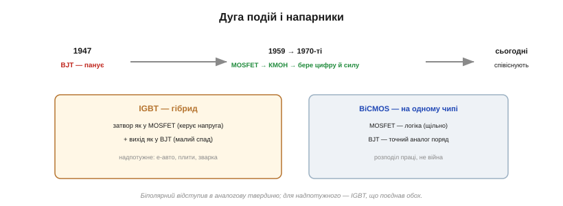
*Рис. 2.7.8.6. Біполярний прийшов першим (1947) і панував; польовий (1959) спершу був «гидким каченям», потім забрав цифру й силове перемикання. Сьогодні вони співіснують: BiCMOS на чипі, а IGBT поєднує затвор MOSFET із виходом BJT для надпотужних задач.*

### Що далі

Отже, корінь усього — струм проти поля, а з нього випливає просте правило: силове перемикання й цифра — польовому, точний аналог — біполярному. Найбільший тріумф польового — **цифрова логіка**: ми вже кілька разів згадували КМОН, комплементарну пару N+P, що майже не споживає в спокої. Настав час розібрати її як слід — бо саме з неї зроблено кожен процесор у світі. Це завершальна тема розділу.

> ▶️ Далі: [§2.7.9 CMOS: пара, з якої зроблено всю цифрову техніку](mosfet.md)

## 2.7.9 CMOS: пара, з якої зроблено всю цифрову техніку

Ми кілька разів натякали на неї — у [§2.7.4](mosfet.md) про комплементарну пару, у [§2.7.7](mosfet.md) про динамічне споживання. Настав час розібрати цю ідею як слід, бо вона — найбільший тріумф польового транзистора й фундамент усієї цифрової техніки. Це **КМОН** *(CMOS — complementary MOS)*: пара з N- і P-канального MOSFET, із якої складено кожен процесор, кожну комірку пам'яті на Землі.

### Інвертор: найдрібніша цеглинка

Почнімо з найпростішого вузла — **інвертора** *(inverter)*, він же вентиль **НЕ**. Це рівно та комплементарна пара з [§2.7.4](mosfet.md):

- **PMOS** угорі, витоком до **+V** (він добре тягне вихід до одиниці);
- **NMOS** унизу, витоком до **землі** (він добре садить вихід до нуля);
- їхні **затвори з'єднані** — це **вхід**; їхні **стоки з'єднані** — це **вихід**.

Простежмо, що він робить:

- **Вхід = 1 (висока напруга):** NMOS відкривається (Vgs > 0), PMOS закривається (його Vgs ≈ 0). Вихід притягнуто до **землі** → **0**.
- **Вхід = 0 (низька напруга):** навпаки — PMOS відкривається, NMOS закривається. Вихід притягнуто до **+V** → **1**.

Вихід — завжди **перевернутий** вхід: 1→0, 0→1. Це і є «НЕ», найдрібніша цеглинка всієї логіки.

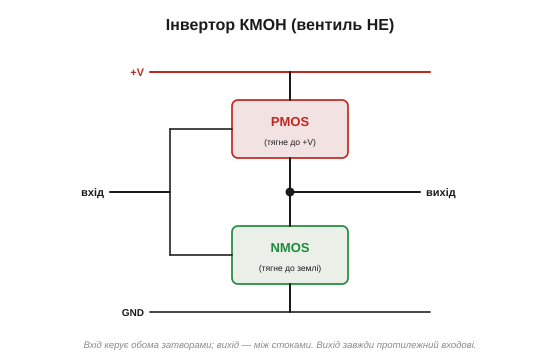
*Рис. 2.7.9.1. Інвертор. PMOS тягне вихід до +V, NMOS — до землі; затвори з'єднані (вхід), стоки з'єднані (вихід). Вихід — завжди протилежний входові.*

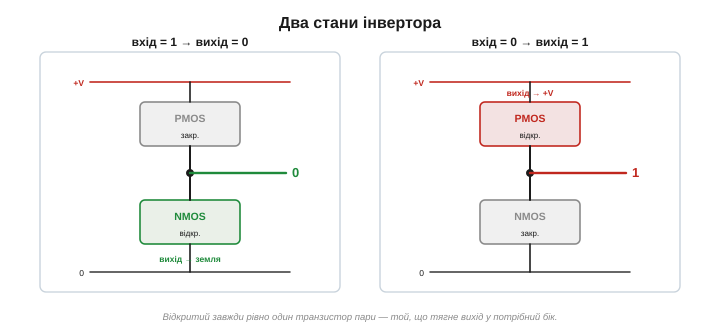
*Рис. 2.7.9.2. Два стани. Вхід «1» відмикає NMOS — вихід сідає на землю («0»). Вхід «0» відмикає PMOS — вихід підтягується до +V («1»). У кожному стані відкритий рівно один із пари.*

Цікава дрібниця: рівно **посередині** переходу, коли вхід близько до порога, інвертор насправді працює як **підсилювач** із великим підсиленням — обидва транзистори прочинені, і крихітна зміна входу дає велику зміну виходу. Цифрова техніка проскакує цю зону якнайшвидше (там і нечіткість, і витрати), а от в аналогових схемах той самий інвертор інколи навмисне тримають у ній — як готовий каскад підсилення. Але це вже інша історія.

### Магія: у спокої струму немає

Ось серце КМОН, заради чого все й затівалося. Придивіться: у **кожному** зі станів відкритий **рівно один** транзистор пари, а другий **закритий**. А отже, **немає наскрізного шляху** від +V до землі — він завжди перекритий тим, що закрите. Тому в усталеному стані крізь інвертор **струму майже не тече** (лише крихітний струм витоку, [§2.7.3](mosfet.md)).

Це й є магія КМОН: **тримати** будь-який стан — «0» чи «1» — коштує майже **нічого**. Саме тому мільярд таких вентилів можна стиснути в один процесор, і він не розплавиться від самого лиш утримання стану.

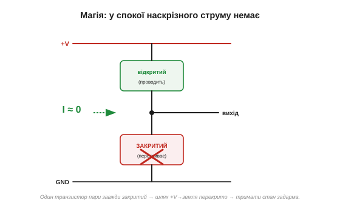
*Рис. 2.7.9.3. Чому КМОН майже не споживає. Хоч у якому стані, один транзистор пари закритий і перекриває шлях від +V до землі. Тож у спокої наскрізного струму немає — тримати стан задарма.*

> 🔧 **Навіщо це.** Згадаймо [§2.7.4](mosfet.md): однотипна MOS-логіка (як-от NMOS) обходилася резистором-підтяжкою замість другого транзистора. Той резистор у половині станів безперервно лив струм від +V до землі — чип грівся й жер енергію навіть нічого не роблячи. КМОН прибрала цей резистор, замінивши його **активним** PMOS, що в потрібний момент сам закривається. Звідси й стрибок економності: демонстраційна КМОН-схема споживала в спокої **в мільйон разів** менше за тодішню біполярну логіку. Це не покращення на відсотки — це інша ліга.

### Звідки ж тоді споживання: динаміка

Якщо в спокої струму нема, чому процесор гарячий? Бо споживання КМОН — **динамічне**: воно виникає лише в **мить перемикання**. Щоб перемкнути вихід, треба перезарядити всі ємності, що висять на ньому, — затвори наступних вентилів, ємність доріжок. Це той самий заряд-розряд, що ми бачили в [§2.7.7](mosfet.md), тільки тепер у масштабі цілого чипа.

Енергія на одне перемикання — приблизно ½·C·V², а сумарна потужність:

```
P(динамічна) ≈ C · V² · f
```

де C — ємність навантаження, V — напруга живлення, f — частота перемикань. Одна формула керує **всім** споживанням цифрової техніки. З неї видно, чому борються за **низьку напругу** (квадрат!) і **малу ємність** (дрібніші транзистори), і чому розгін частоти f напряму додає тепла.

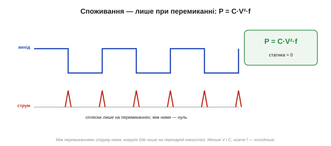
*Рис. 2.7.9.4. КМОН споживає лише при перемиканні — на перезаряд ємностей виходу. P = C·V²·f. Тому знижують напругу (квадрат!) і ємність, а розгін частоти прямо додає тепла.*

Числа на відчуття. Хай один вентиль має на виході ємність C ≈ 1 фФ (фемтофарада), живлення V = 1 В, перемикається на f = 1 ГГц: енергія за такт ≈ ½·C·V² ≈ 0.5 фДж, а потужність C·V²·f ≈ 1 мкВт. Дрібниця! Та помножте на **мільярд** вентилів — і вже сотні ватів. Рятує те, що не всі вони перемикаються щотакту (більшість стоїть), тож реальне споживання менше; але порядок саме такий — звідси й уся боротьба за зниження V та C.

Є й дрібніша добавка до динаміки. У саму **мить** переходу, поки вхід проходить десь посередині, на коротку хвильку відкриваються **обидва** транзистори пари — і крізь них проскакує невеликий наскрізний імпульс (його звуть протіканням, *shoot-through*). Тому переходи й намагаються робити різкими: що швидше вхід проскочить «небезпечну середину», то менший цей імпульс. Але в усталеному стані, нагадаємо, наскрізного струму немає зовсім.

> 🔧 **Навіщо це.** Саме ця формула P = C·V²·f і привела до «**стіни потужності**» ([§2.7.7](mosfet.md)). Десятиліттями транзистори меншали, напруга падала — і частоту вдавалося піднімати майже задарма. Та десь по 2005 році напругу вже не було куди знижувати, а мільярди швидких вентилів стали виділяти стільки тепла, що далі гнати частоту стало неможливо. Тому процесори перестали просто «прискорюватися» й пішли вшир — у **багатоядерність**. Уся ця історія — наслідок одного рядка C·V²·f.

Та сама формула пояснює й те, чому живлення цифрових чипів десятиліттями **падало**: 5 В → 3.3 → 1.8 → близько 1 В сьогодні. Кожне зниження напруги через квадрат V² різко зменшує споживання й тепло, тож щойно технологія дозволяла, напругу опускали.

А от у найдрібнішому масштабі КМОН частково втратила свою магію. Коли транзистори зменшили до кількох нанометрів, **підпороговий** струм витоку ([§2.7.3](mosfet.md)) з кожного вентиля перестав бути зовсім мізерним, а помножений на мільярди — дав уже відчутне **статичне** споживання навіть у спокої. «Безкоштовний спокій» трохи зблід; сучасні чипи борються з витоком хитрощами, аж до вимикання живлення цілим непрацюючим блокам (*power gating*). Та принцип лишається непохитним: динаміка домінує, і КМОН досі поза конкуренцією.

### Від інвертора до будь-якої логіки

Інвертор — лише початок. Та сама ідея — **підтягувальна мережа з PMOS** (до +V) і **стягувальна з NMOS** (до землі), влаштовані так, щоб для будь-якого входу проводила рівно одна, — дає **всі** логічні вентилі.

Наприклад, вентиль **І-НЕ** *(NAND)*: знизу два NMOS **послідовно** (стягнуть вихід до нуля, лише якщо **обидва** входи «1»), а зверху два PMOS **паралельно** (підтягнуть до одиниці, якщо хоч один вхід «0»). Знову ж: для будь-якої комбінації входів працює рівно одна мережа, наскрізного струму нема, а вихід чистий.

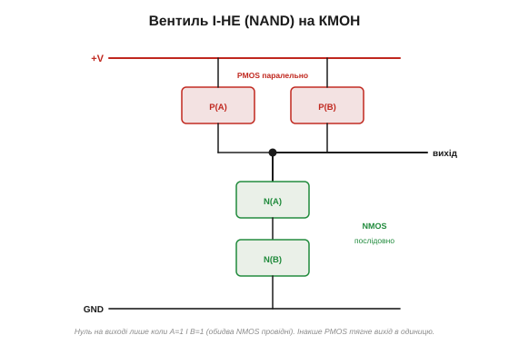
*Рис. 2.7.9.5. Вентиль І-НЕ (NAND). Стягувальна мережа — два NMOS послідовно (нуль лише коли обидва входи «1»); підтягувальна — два PMOS паралельно. Комплементарні мережі: проводить завжди рівно одна.*

А вентиль І-НЕ (як і АБО-НЕ) — **універсальний**: з самих лише НЕ-та-І комбінацій можна скласти будь-яку логічну функцію, будь-яке обчислення. Це не перебільшення: з самих І-НЕ складають суматори (щоб додавати числа), тригери (щоб пам'ятати біт), лічильники, дешифратори — і так, поверх за поверхом, аж до цілого процесора. Інженер-цифровик майже ніколи не думає про окремі транзистори: він оперує вентилями, а ті вже зведено до КМОН-пар на нижчому рівні. Складаючи мільйони й мільярди таких вентилів, отримують пам'ять, арифметику, цілий процесор. **Уся цифрова техніка — це КМОН-вентилі**, повторені незліченно багато разів.

І не лише обчислення. Швидка пам'ять процесора (кеш, регістри) — теж КМОН-вентилі, зчеплені в комірки, що тримають біт. Тобто і «думання», і «пам'ять» чипа зроблено з тієї самої комплементарної пари. Коли кажуть «у процесорі N мільярдів транзисторів», за цим стоять приблизно N/2 мільярдів КМОН-пар, кожна з яких — той самий PMOS+NMOS, що ми щойно розібрали на одному інверторі.

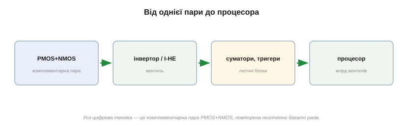
*Рис. 2.7.9.6. Сходження масштабу. Інвертор → універсальний вентиль І-НЕ → логічні блоки → процесор із мільярдів КМОН-вентилів. Усе цифрове зведено до повторення комплементарної пари.*

### Чистота рівнів — теж від пари

Є ще одна причина, чому КМОН така надійна. Згадаймо [§2.7.4](mosfet.md): NMOS дає **сильний** нуль (садить до самої землі), PMOS — **сильну** одиницю (тягне до самого +V). Тож вихід КМОН-вентиля гойдається **від рейки до рейки** — чистий «0» дорівнює землі, чиста «1» дорівнює +V, без провисань. А поріг ([§2.7.3](mosfet.md)) надійно відрізняє їх із запасом на шум. Тому цифровий сигнал можна передавати крізь мільярди вентилів, і він не «розпливається» — кожен вентиль відновлює чисті рівні.

Цю властивість звуть **відновленням** *(regeneration)*: кожен вентиль не просто передає сигнал, а наново «вичищає» його до повних рівнів — і ще й здатен живити входи **кількох** наступних вентилів (це звуть навантажувальною здатністю, *fan-out*). Завдяки цьому з вентилів можна будувати скільки завгодно глибокі ланцюги: сигнал не згасає й не бруднішає по дорозі, бо щоразу народжується заново. Аналоговий сигнал так не вміє — він із кожним каскадом лише псується; цифровий цим і сильний.

Зупинімося на мить, щоб оцінити масштаб зробленого. Кожне натискання клавіші, кожен піксель екрана, кожен байт у пам'яті телефона проходить крізь незліченні КМОН-вентилі — і всі вони мовчки тримають свої стани, майже нічого не споживаючи, аж поки не настане їхня черга перемкнутися. Уся обчислювальна міць нашої цивілізації стоїть, зрештою, на одній скромній парі транзисторів — PMOS над NMOS, — повтореній стільки разів, скільки людині годі й уявити.

### Народження КМОН

Цю ідею — поєднати P- і N-канальні транзистори в комплементарну пару заради майже нульового споживання — подали 1963 року у Fairchild Semiconductor **Френк Ванласс** *(Frank Wanlass)* та **Чіхтан Са** *(Chih-Tang Sah)*. Їхня демонстраційна схема споживала в спокої приголомшливо мало — на шість порядків менше за тодішню біполярну логіку. Тоді це здавалося цікавинкою без застосувань (надто повільно); мине років двадцять, поки КМОН переможе всі інші технології й стане єдиною основою цифрового світу. Перелом настав, коли вирішальним стало вже не швидкодія одного вентиля, а **сумарне тепло** мільйонів: тут КМОН із її майже нульовим спокоєм не мала рівних, і доба портативної та щільної електроніки зробила ідею Ванласса й Са безальтернативною. Двоє інженерів заклали те, на чому стоїть уся цифрова цивілізація, — а кому й за що належить визнання й чому винахід так довго чекав свого часу, розберемо в історії до теми.

> 📜 **Історія:** [CMOS — Френк Ванласс і майже нульове споживання](hist-cmos.md)

### Перехід до застосування

Ми пройшли польовий транзистор від ідеї до її найбільшого плоду. Поле замість струму ([§2.7.1](mosfet.md)) дало прилад, що керується задарма; з нього зробили і силові ключі ([§2.7.6](mosfet.md)), і — поєднавши N та P у комплементарну пару — усю цифрову логіку, що майже не споживає в спокої. Лишилося побачити силовий MOSFET-ключ у найкласичнішій його ролі — там, де **чотири** такі ключі разом крутять мотор в обидва боки. Ця схема, **H-міст**, — обряд посвяти силової електроніки, і нею ми завершимо розділ.

---

## 2.7.10 H-міст: чотири ключі, щоб крутити мотор в обидва боки

MOSFET-ключ із [§2.7.6](mosfet.md) уміє вмикати й вимикати мотор. Та цього мало: іграшковій машинці, дрону, принтеру, роботу-пилососу треба крутити мотор **в обидва боки** — уперед і назад. А простий ключ цього не вміє: він лише перекриває струм, але не може **перевернути** його напрямок. Розв'язок — найзнаменитіша схема силової електроніки, **H-міст**, у якій чотири ключі разом і вмикають мотор, і реверсують, і гальмують. Ця тема зшиває все вивчене про MOSFET-ключ у одну живу й дуже корисну схему.

### Чому одного ключа замало

Згадаймо мотор постійного струму: у який бік крізь нього тече струм, у той бік він і крутиться. Щоб змінити напрямок обертання, треба **поміняти місцями** його два дроти — пустити струм у зворотний бік:

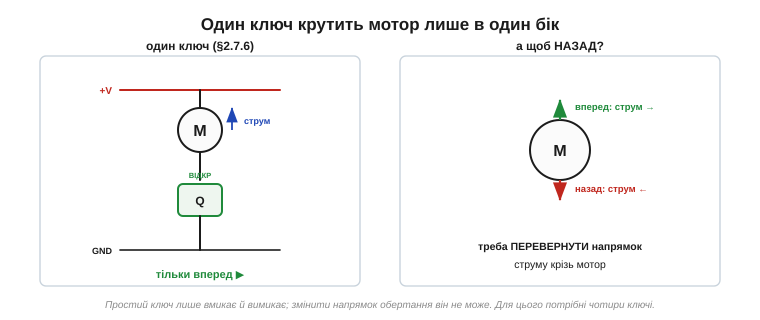
*Рис. 2.7.10.1. Один ключ ([§2.7.6](mosfet.md)) вмикає мотор в один напрямок — і все. Щоб закрутити назад, потрібно перевернути напрямок струму крізь мотор, а на це простий ключ не здатний.*

Можна було б, звісно, фізично перемикати дроти реле — але реле повільне, зношується ([§2.6.9](../bjt/bjt.md)) і не дасть плавно керувати швидкістю. Електронне рішення елегантніше: оточити мотор **чотирма** ключами так, щоб самими ключами обирати, куди тече струм.

### Чотири ключі у формі H

Поставимо мотор посередині, а навколо — чотири ключі: два зверху (до «плюса») і два знизу (до землі). Малюнок справді схожий на літеру **H**, де мотор — горизонтальна перекладина:

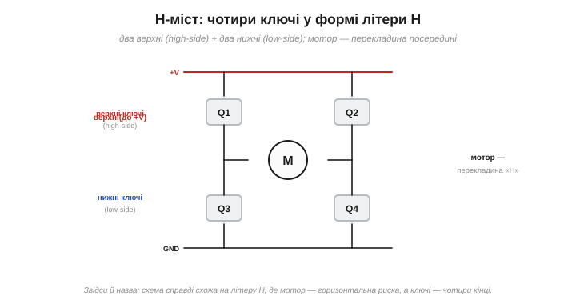
*Рис. 2.7.10.2. Два **верхні** ключі (high-side) з'єднують кінці мотора з «плюсом», два **нижні** (low-side) — із землею. Мотор-перекладина висить між ними. Звідси й назва — H-міст (*H-bridge*).*

Позначмо ключі Q1–Q4: верхній лівий (Q1), верхній правий (Q2), нижній лівий (Q3), нижній правий (Q4). Уся хитрість — у тому, **які** з них відкривати одночасно.

### Напрямок задає діагональ

Щоб мотор закрутився, треба з'єднати один його кінець із «плюсом», а інший — із землею. Це робить **діагональна** пара ключів:

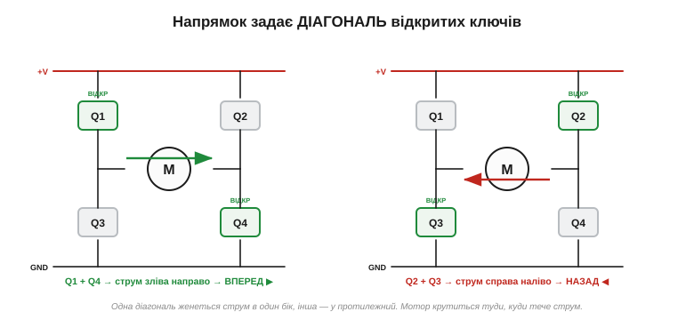
*Рис. 2.7.10.3. Відкрили Q1 (верхній лівий) і Q4 (нижній правий) — струм тече крізь мотор зліва направо, мотор крутиться **вперед**. Відкрили іншу діагональ, Q2 і Q3, — струм тече справа наліво, мотор крутиться **назад**.*

Ось і вся ідея реверсу. Одна діагональ (Q1+Q4) женеться струм в один бік, протилежна (Q2+Q3) — у зворотний. Жодних механічних перемикань: напрямок обертання обирають тим, **яку діагональ** відкрити. Решта два ключі при цьому замкнені.

### Чотири корисні стани

Окрім «вперед» і «назад», той самий міст уміє ще два корисні режими:

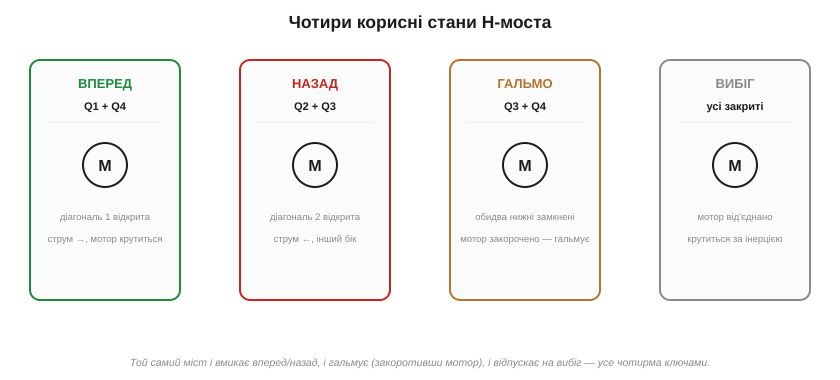
*Рис. 2.7.10.4. Вперед (Q1+Q4) і назад (Q2+Q3) ми вже знаємо. **Гальмо**: відкрити обидва нижні ключі (Q3+Q4) — мотор закорочено сам на себе, і він різко гальмує (його ж власна інерція женеться струм по колу й гаситься). **Вибіг**: усі ключі закрити — мотор від'єднано, він крутиться вільно за інерцією до зупинки.*

Чому закорочений мотор гальмує? Бо коли він обертається за інерцією, то сам стає **генератором** (наведення, [§2.2.2](../inductor/inductor.md)); закоротивши його, ми пускаємо цей наведений струм по колу, а він гальмує ротор — те саме «магнітне гальмо», що в електромобілях зветься рекуперацією. Тож один міст дає повний набір команд мотору: вперед, назад, стоп-гальмо, вільний вибіг.

### H-міст — це два півмости

Подивімося на схему інакше. Кожен **вертикальний** бік H — це верхній ключ плюс нижній зі спільною точкою посередині, від якої йде дріт до мотора. Така пара зветься **півмостом** (*half-bridge*), а H-міст — просто **два півмости**:

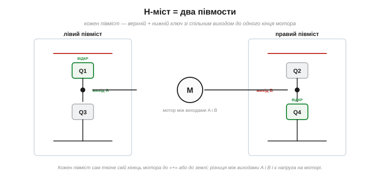
*Рис. 2.7.10.5. Лівий півміст (Q1 зверху, Q3 знизу) тягне лівий кінець мотора або до «плюса», або до землі; правий півміст (Q2, Q4) робить те саме з правим кінцем. Напруга на моторі — це **різниця** між виходами двох півмостів.*

Це не просто інша назва — це корисний спосіб думати. Кожен півміст самостійно вирішує, куди тягнути свій кінець мотора: вгору (до «+») чи вниз (до землі). Лівий вгору, правий вниз — струм тече ліворуч-праворуч; навпаки — назад. Півміст — універсальна цеглинка силової електроніки: з нього роблять не лише H-мости, а й імпульсні перетворювачі та інвертори, тож варто впізнавати його в обличчя.

### Смертельна заборона: наскрізний струм

А тепер найважливіше правило, яке відрізняє робочий H-міст від спаленого. **Ніколи не можна відкривати верхній і нижній ключ одного півмоста одночасно.** Бо це з'єднало б «плюс» із землею **прямо** крізь два відкриті ключі — миттєве коротке замикання живлення:

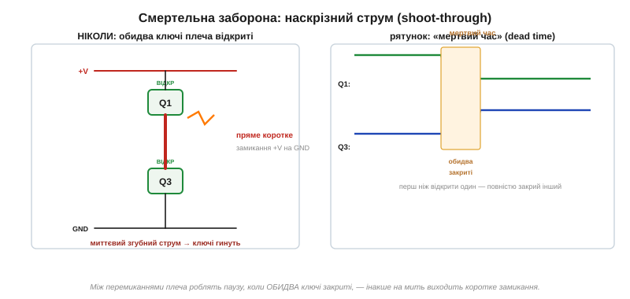
*Рис. 2.7.10.6. Якщо Q1 і Q3 відкриті разом, струм летить із «+» прямо в землю крізь обидва ключі, обминаючи мотор, — це **наскрізний струм** (*shoot-through*). За мить він спалює ключі. Рятунок — **мертвий час** (*dead time*): перш ніж відкрити один ключ плеча, повністю закривають інший, лишаючи коротку паузу, коли закриті **обидва**.*

Ця біда — **наскрізний струм** (*shoot-through*) — найчастіша причина «димку» в саморобних мостах. Вона особливо підступна під час **перемикання**: ключ закривається не миттєво (затвор — це ємність, [§2.7.7](mosfet.md)), і якщо одразу відкрити протилежний, на коротку мить обидва будуть прочинені. Тому в керуванні мостом завжди закладають **мертвий час** — паузу, коли обидва ключі плеча гарантовано закриті, перш ніж відкрити наступний. Готові драйвери мостів роблять це автоматично; у саморобних мостах про мертвий час дбають окремо, бо ціна помилки — згорілі ключі.

> ⚙️ **Як це в логіці.** Як з одного ШІМ зробити два протилежні сигнали з гарантованою паузою «обидва закриті», скільки той мертвий час має тривати (t_dead > час вимикання ключа) і чому це довіряють апаратному комплементарному ШІМ, а не двом ніжкам уручну — в [алгоритмічній вставці «Наскрізний струм і мертвий час»](proj-shoot-through.md).

### Зведена таблиця керування

Усі команди мосту зручно тримати однією таблицею (× — відкритий ключ):

```
режим        Q1(вл)  Q2(вп)  Q3(нл)  Q4(нп)   що з мотором
вперед         ×       ·       ·       ×       струм →, крутиться вперед
назад          ·       ×       ×       ·       струм ←, крутиться назад
гальмо         ·       ·       ×       ×       закорочено знизу — гальмує
вибіг          ·       ·       ·       ·       від'єднано — вільний хід
─────────────────────────────────────────────────────────────────
ЗАБОРОНЕНО:  Q1+Q3 разом  або  Q2+Q4 разом  → наскрізний струм!
```

Зверніть увагу на структуру: у кожному **дозволеному** рядку в одному плечі відкрито щонайбільше один ключ — це і є страховка від наскрізного струму. Два верхні рядки реверсують мотор, два нижні зупиняють (різко чи плавно), а останній рядок — те, чого не можна ніколи. Прошивка, що керує мостом, по суті лише вибирає рядок із цієї таблиці (а для швидкості ще й «миготить» обраним рядком за ШІМ).

### Швидкість — широтно-імпульсним керуванням

Лишилося навчитися керувати не лише напрямком, а й **швидкістю**. Тут на сцену виходить уже знайомий прийом — **широтно-імпульсне керування** (ШІМ): діагональ відкривають не наглухо, а швидко вмикають-вимикають, міняючи частку «увімкненого» часу:

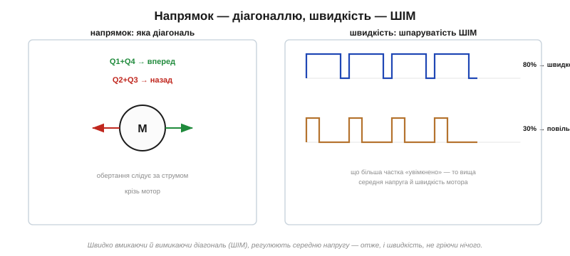
*Рис. 2.7.10.7. Напрямок задає вибір діагоналі, а швидкість — **шпаруватість** ШІМ: 80 % «увімкнено» — мотор крутиться майже на повну, 30 % — повільно. Мотор зі своєю інерцією усереднює імпульси в плавне обертання, а ключі при цьому майже не гріються (вони або повністю відкриті з малим Rds(on), або закриті).*

Чому саме ШІМ, а не плавне зменшення напруги? Бо плавно «придушити» струм лінійним елементом означало б розсіювати надлишок у тепло — гаряче й марнотратно. А ключ, що то повністю відкритий (малий опір [§2.7.5](mosfet.md), мало тепла), то повністю закритий, майже не гріється; мотор же зі своєю механічною інерцією й електричною індуктивністю сам згладжує імпульси в рівне обертання. Тож H-міст плюс ШІМ дають **повне** керування мотором: напрямок — діагоналлю, швидкість — шпаруватістю, плюс гальмо й вибіг, — і все це холодними, ефективними ключами.

### Куди дівається струм у паузі ШІМ

У швидкого вмикання-вимикання є наслідок, який не можна оминути. Мотор — це передусім **котушка** (обмотка), а котушка не дає струмові урватися миттєво ([§2.2.2](../inductor/inductor.md)): щойно діагональ закрилася, накопичений в обмотці струм мусить кудись текти й далі. Якщо не дати йому дороги, він викине на ключах гострий стрибок напруги — той самий руйнівний «брик» індуктивності, що ми вже бачили на реле й діодах ([§2.5.9](../diode-pn-junction/diode-pn-junction.md)), — і проб'є транзистори.

Рятунок схований у самій будові силового MOSFET: між його витоком і стоком уже «вбудовано» діод (паразитний body-діод, [§2.7.2](mosfet.md)). Чотири такі діоди утворюють для індуктивного струму замкнене кільце, по якому він спокійно добігає в паузі ШІМ, поки знову не відкриється діагональ. Цей струм, що замикається сам на себе, інженери звуть **струмом самоходу** (freewheeling). Тому в H-мості діоди — не зайва пересторога, а обов'язкова частина схеми: без них індуктивний мотор спалив би ключі за лічені цикли.

Тонкість у тому, що body-діод відкривається лише з падінням близько 0.7 В і на амперному струмі помітно гріється. Тому в «дорослих» мостах роблять хитро: у паузі замість того, щоб віддавати струм діодові, на коротку мить відкривають **протилежний** MOSFET — його малий опір пропускає той самий струм майже без втрат. Це зветься **синхронним випрямленням**; саме воно робить сучасні мости такими холодними. Але вмикати цей зустрічний ключ можна лише витримавши паузу-затримку, інакше знову відчиниться смертельна діагональ — усе впирається в ту саму дисципліну мертвого часу, що й вище.

### Чому саме MOSFET і що ще треба

H-мости будують і на біполярних транзисторах, але MOSFET тут майже завжди кращий: малий опір у відкритому стані ([§2.7.5](mosfet.md)) означає мало тепла на великому струмі мотора, а керування полем ([§2.7.1](mosfet.md)) і висока швидкість ([§2.7.7](mosfet.md)) ідеально пасують до ШІМ. Прикиньмо на числах. Мотор тягне 3 А; на MOSFET із Rds(on) = 20 мОм у відкритому стані розсіюється P = I²·R = 9·0.02 ≈ 0.18 Вт — ключ ледь теплий. Біполярний на тому самому струмі тримав би падіння Vce(sat) ≈ 0.3 В, тобто P = 0.3·3 ≈ 0.9 Вт — уп'ятеро більше тепла, та ще й постійний струм бази на додачу. На амперних струмах ця різниця між «опором» і «падінням» вирішує все: MOSFET лишається холодним там, де біполярний просив би радіатора. Та один практичний клопіт варто назвати наперед — **верхні** ключі: щоб відкрити верхній N-MOSFET, на його затвор треба подати напругу **вище** за «плюс» живлення — а це окремий клопіт, який розв'язують спеціальні мікросхеми-драйвери затворів ([§2.7.7](mosfet.md) натякав на їхню потребу). Тому на практиці H-міст рідко паяють із голих транзисторів — беруть готову мікросхему-драйвер, що ховає всі ці тонкощі всередині; саме про такі модулі — окрема компонентна вставка.

> 🔌 **Готова плата.** Що насправді стоїть на модулі-драйвері мотора, чим класичний L298-клас відрізняється від сучасних MOSFET-драйверів і як підключити його трьома дротами — у компонентній вставці [«Плата драйвера мотора: L298-клас і сучасні MOSFET-драйвери»](comp-h-bridge-board.md).

### Де живуть H-мости

Варто знати, наскільки ця схема всюдисуща. H-міст крутить колеса й гусениці кожного **робота** й радіокерованої машинки, рухає каретку й валики **принтера**, відкриває-закриває заслінки й клапани, гойдає голку швейної машини, керує **електроінструментом** і кухонною технікою — словом, живе всюди, де щось обертається в обидва боки під керуванням електроніки. А підрісши на один півміст, ідея веде далі: **три** півмости разом керують **трифазним** мотором — тим самим безколекторним (BLDC) двигуном, що стоїть у дронах, електросамокатах, вентиляторах і дисководах. І потужний **кроковий** двигун (молодшого брата якого ми бачили у [вставці про ULN](../bjt/comp-darlington-uln.md)) теж керується мостами — по одному на кожну обмотку. Тобто, зрозумівши H-міст, ви тримаєте в руках ключ до майже всієї електроніки руху: від іграшкового моторчика до тягового привода електромобіля — скрізь усередині ті самі півмости з холодними MOSFET-ключами, лише різного калібру.

> 🔧 **Навіщо це.** H-міст — стандартна відповідь на питання «як крутити мотор в обидва боки й керувати швидкістю». Запам'ятайте суть: чотири ключі, **напрямок — вибором діагоналі** (Q1+Q4 проти Q2+Q3), **швидкість — ШІМ**, плюс режими гальма (закоротити мотор) і вибігу. І головне правило безпеки: **ніколи не відкривайте обидва ключі одного плеча разом** — це наскрізний струм, що миттєво палить міст; між перемиканнями завжди має бути мертвий час. На практиці беріть готовий драйвер моста, а не голі транзистори.

### Підсумок розділу

H-міст гарно завершує розділ, бо показує силовий MOSFET-ключ у його найкласичнішій ролі — там, де чотири холодні, швидкі, керовані полем ключі роблять те, чого не зробить жоден поодинокий вимикач: крутять мотор в обидва боки з плавним керуванням швидкістю. Ми пройшли весь польовий транзистор: інша ідея — керувати **полем**, а не струмом ([§2.7.1](mosfet.md)); будова із затвором-ізолятором ([§2.7.2](mosfet.md)) і поріг, за яким поле відкриває канал ([§2.7.3](mosfet.md)); два типи NMOS/PMOS ([§2.7.4](mosfet.md)); опір Rds(on) ([§2.7.5](mosfet.md)); силовий ключ ([§2.7.6](mosfet.md)) і затвор-ємність, що задає швидкість ([§2.7.7](mosfet.md)); порівняння з біполярним ([§2.7.8](mosfet.md)); і нарешті КМОН ([§2.7.9](mosfet.md)) — серце всієї цифрової техніки, та H-міст — серце силової.

На цьому ми знаємо **обидва** транзистори — біполярний і польовий — і вміємо ними і перемикати, і підсилювати. Лишився, щоправда, один борг: будуючи H-міст, ми двічі наштовхнулися на ту саму незручність — **верхній ключ**. І в [§2.7.4](mosfet.md), і в [§2.7.6](mosfet.md), і наприкінці [§2.7.10](mosfet.md) ми мимохідь казали: щоб відкрити верхній N-MOSFET, на затвор треба подати напругу **вищу за «плюс» живлення**, а такої в схемі зазвичай немає. Раз обіцянка повторилася стільки разів — час її виконати: остання тема розділу присвячена тому, **звідки взяти ту «надшинну» напругу** й чому готові мости та перетворювачі завжди мають усередині цей фокус.

## 2.7.11 Верхній ключ: bootstrap, charge pump і драйвер півмоста

У [§2.7.10](mosfet.md) ми зібрали H-міст і, дійшовши до його верхніх ключів, чесно зізналися: тут чигає окремий клопіт. N-канальний ключ хочеться поставити **й угорі** — він дешевший, менший і має менший Rds(on) за рівноцінний p-канальний ([§2.7.4](mosfet.md)). Але керувати верхнім N-ключем виявляється напрочуд незручно: щоб його відкрити, на затвор доводиться подавати напругу **вищу за шину живлення** — більшу, ніж найбільша напруга в усій схемі. Звідки взяти таку напругу? Відповідь на це питання — окрема маленька галузь схемотехніки, і без неї **жодна** плата силового мосту чи імпульсного перетворювача не запрацює. Розберімо її до дна — і заразом навчимося читати чужі плати, на яких ці хитрощі трапляються на кожному кроці.

### Чому верхньому N-ключу мало самої шини

Корінь усієї проблеми — в одному факті, який ми знаємо з [§2.7.1](mosfet.md): MOSFET відмикає не «напруга на затворі» сама собою, а напруга **затвор–витік**, Vgs. Витік — це точка відліку, від якої транзистор міряє своє керівне поле. Поки витік стоїть на місці, усе просто. А у верхньому ключі він **не стоїть**.

Подивімося на нижній ключ ([§2.7.6](mosfet.md)) для контрасту. Там витік **прибитий до землі** — нерухомий нуль. Подав мікроконтролер на затвор 5 В — і Vgs = 5 − 0 = 5 В, чітко й передбачувано. Тому нижнім ключем так легко керувати прямо з ніжки логіки.

Тепер верхній ключ. Навантаження висить **під** ним (між витоком ключа й землею), а сам ключ — між шиною та навантаженням. Щойно ключ відкривається, його витік **підіймається майже до шини**: уся напруга живлення опиняється на витоку. І ось пастка: Vgs = (напруга затвора) − (напруга витоку), а витік тепер сам дорівнює, скажімо, 12 В. Якщо ми, як для нижнього ключа, подамо на затвор ті самі 12 В, то дістанемо Vgs = 12 − 12 = **0 В** — і ключ закриється. Парадокс: подаємо «повну шину» на затвор, а транзистор замкнений.

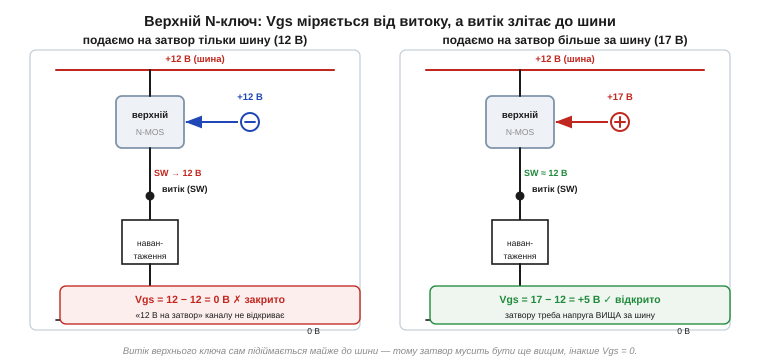
*Рис. 2.7.11.1. Витік верхнього N-ключа підіймається майже до шини. Подаси на затвор саму шину (12 В) — Vgs = 12 − 12 = 0, ключ замкнений (ліворуч). Щоб відкрити, на затвор треба напругу **вищу** за шину (праворуч): 17 В дають Vgs = 17 − 12 = +5 В.*

Щоб верхній N-ключ був надійно відкритий, на його затворі потрібна напруга десь на 10…15 В **вищу за витік**, тобто **вищу за шину**. Якщо шина 12 В, на затвор треба близько 22…27 В; якщо шина 48 чи 300 В — то й затвор треба так само високо над нею. А найбільша напруга, що є в схемі, — це і є шина. Тобто потрібну напругу **немає звідки взяти** — її доведеться **виготовити**, підняти над шиною штучно. У цьому й полягає вся задача керування верхнім ключем.

> 🔧 **Навіщо це.** Це не академічна тонкість, а перше, об що спотикаються, читаючи чужу плату драйвера мотора чи перетворювача. Біля кожного верхнього ключа на платі ви побачите крихітний конденсатор і діод «у повітрі» — і доти, доки не зрозумієте проблему «затвор вище шини», ці деталі здаватимуться загадкою. А це і є та сама схема підняття напруги. Знаючи її, ви читаєте півмостові каскади з першого погляду.

### Нижній ключ простий, верхній — ні

Зведімо контраст в один образ, бо саме він — ключ до всього подальшого. Уся складність верхнього ключа зводиться до того, **де стоїть опора, від якої міряється Vgs**.

- У **нижньому** ключі опора (витік) **прибита до землі** й не рухається. Керівна напруга — проста різниця «затвор мінус нуль». Джерело сигналу (хоч ніжка МК, хоч драйвер) теж стоїть однією ногою на землі — спільна опора, жодних складнощів.
- У **верхньому** ключі опора (витік) **плаває**: вона стрибає від нуля (коли ключ закритий) майже до шини (коли відкритий). Керувати треба напругою, що **їздить разом** із цією рухомою опорою, лишаючись на 10…15 В вищою за неї. А це означає, що й саме «живлення» для керування затвором мусить плавати разом із витоком.

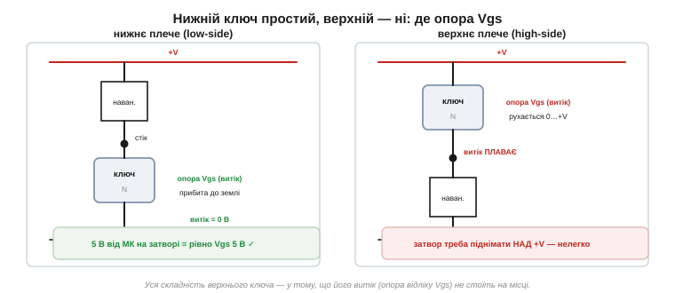
*Рис. 2.7.11.2. Уся різниця — в опорі відліку Vgs. Ліворуч (нижній ключ) витік прибитий до землі, тож 5 В від МК = рівно Vgs 5 В. Праворуч (верхній ключ) витік плаває від 0 до +V, тож затвор доводиться підіймати над шиною — а це нелегко.*

Отже, нам потрібне джерело напруги, яке **їздить вгору-вниз разом із витоком** верхнього ключа, тримаючись завжди на потрібні 10…15 В вище за нього. Таке «плаваюче» джерело живлення затвора й роблять двома способами: дешевим і хитрим — **бутстрепом** (bootstrap), і трохи дорожчим, зате невтомним — **зарядовою помпою** (charge pump). Розгляньмо обидва.

### Бутстреп: «відерце», що їздить із витоком

Перший спосіб — **бутстреп** *(bootstrap)*, від англійського «підтягнути себе за власні шнурки»: схема сама піднімає собі живлення вище шини, не маючи жодного зовнішнього джерела вищої напруги. Деталей лише дві — один **діод** і один **конденсатор**, — а працює це красиво.

Згадаймо: верхній ключ ніколи не сидить відкритим вічно. У будь-якому ШІМ (а саме для ШІМ нам і потрібні швидкі ключі, [§2.7.7](mosfet.md)) верхній і нижній ключі півмоста **чергуються**: то відкритий верхній, то нижній. Бутстреп користається саме цим чергуванням.

Простежмо за двома фазами. Маємо півміст ([§2.7.10](mosfet.md)): верхній ключ Q_верх і нижній Q_низ зі спільною точкою SW (це витік верхнього). Поряд — низьковольтне живлення драйвера, скажімо Vdrv = 12 В. Між Vdrv і верхнім вузлом VB ставимо діод Dbs, а між VB і точкою SW — бутстрепний конденсатор Cbs.

**Фаза 1 — заряд (відкритий нижній ключ).** Поки відкритий Q_низ, точка SW притягнута **до землі** (≈ 0 В). Тепер Cbs одним кінцем (через SW) на нулі, а другим — через діод Dbs — приєднаний до Vdrv (12 В). Струм біжить Vdrv → Dbs → Cbs → SW → земля, і конденсатор **заряджається до 12 В**. «Відерце» наповнили.

**Фаза 2 — робота (відкритий верхній ключ).** Тепер закриваємо нижній і відкриваємо верхній. Точка SW **злітає до шини** (≈ Vbus). А разом із нею злітає й **нижній** кінець конденсатора Cbs — адже він приєднаний до SW. Конденсатор не може миттєво змінити свою напругу ([§2.1.4](../capacitor/capacitor.md)): на ньому як було 12 В, так і лишилося. Тож якщо нижній кінець тепер на Vbus, то верхній (VB) опиняється на **Vbus + 12 В** — вище за шину! Діод Dbs при цьому замикається (з боку VB напруга тепер більша за Vdrv) і не дає заряду стекти назад. Ось воно: ми дістали напругу вище шини, нічого не маючи, крім 12-вольтового живлення, діода та конденсатора. Цією напругою (VB відносно SW — рівно ті збережені 12 В) драйвер і тримає затвор Q_верх відкритим.

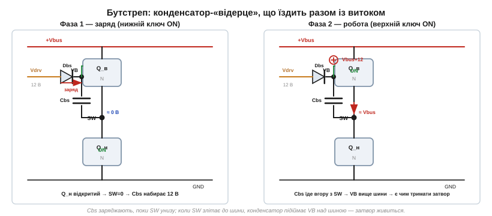
*Рис. 2.7.11.3. Бутстреп. Фаза 1 (ліворуч): нижній ключ відкритий, SW ≈ 0, Cbs заряджається від Vdrv крізь Dbs до 12 В. Фаза 2 (праворуч): верхній ключ відкритий, SW злітає до Vbus, Cbs їде вгору разом із ним — і VB опиняється на Vbus + 12 В. Діод не дає заряду втекти назад.*

Краса бутстрепа — у тому, що конденсатор **сам їздить** разом із плаваючою опорою (витоком), завжди тримаючи над нею ті самі 12 В. Це точно те «плаваюче джерело», яке нам і було потрібне. А коштує воно — копійчаний діод і конденсатор.

> 🔧 **Навіщо це.** Бутстреп — найпоширеніший спосіб керувати верхнім N-ключем, і саме його ви бачите на 99 % плат драйверів мостів. Пам'ятайте дві умови його роботи: **(1)** має бути низьковольтне живлення драйвера (Vdrv) для зарядки; **(2)** нижній ключ мусить **періодично** відкриватися, щоб опустити SW до землі й перезарядити Cbs. Звідси й практичне правило: бутстрепному півмосту потрібен мінімальний рух ШІМ — він не любить «застиглих» станів, і ось чому.

### Слабке місце бутстрепа: він поволі «стікає»

У бутстрепа є вроджена вада, і знати її обов'язково. Конденсатор Cbs — це «відерце» зі скінченним запасом заряду, і поки верхній ключ відкритий, з нього **потроху витікає** заряд: трохи бере драйвер на тримання затвора, трохи — струми витоку. Заряд поповнюється **лише** у фазі 1, коли SW падає до землі. А якщо ми тримаємо верхній ключ відкритим **надто довго**, не відкриваючи нижнього, поповнити «відерце» нема коли — напруга VB−SW поволі спадає, аж поки не впаде нижче порога, і верхній ключ **сам згасне**.

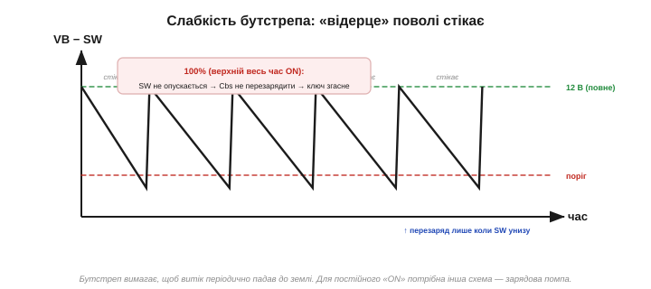
*Рис. 2.7.11.4. Напруга на бутстрепному конденсаторі (VB − SW) у часі: між перезарядами вона «стікає». Поповнюється лише тоді, коли SW падає до землі (нижній ключ ON). Тримай верхній ключ відкритим без пауз — і напруга впаде нижче порога, ключ згасне.*

Звідси — головне обмеження: **бутстреп не вміє тримати верхній ключ відкритим на всі 100 %**. Йому потрібні регулярні паузи, коли SW падає донизу. Для ШІМ із шпаруватістю, скажімо, до 95 % це не проблема — паузи трапляються самі. Але якщо задача вимагає, щоб верхній ключ стояв відкритим **постійно** (наприклад, ключ живлення, що має просто з'єднати навантаження з шиною й тримати — згадайте load switch зі [вставки до §2.7.4](comp-pmos-load-switch.md), тільки на N-каналі), бутстреп не годиться: перезарядити його ніколи. Для такого випадку потрібне джерело, що тримає напругу над шиною **невтомно**, без жодних пауз. Це — зарядова помпа.

> ⚙️ **Як це в логіці.** Та сама вимога «нижній ключ мусить періодично відкриватися» зшивається з мертвим часом із [§2.7.10](mosfet.md): драйвер чергує ключі сам, лишаючи паузу «обидва закриті». Деталі того чергування — в [алгоритмічній вставці «Наскрізний струм і мертвий час»](proj-shoot-through.md).

### Зарядова помпа: невтомний насос напруги

**Зарядова помпа** *(charge pump)* розв'язує ту саму задачу інакше — і без жодного руху силових ключів. Вона **сама** виробляє напругу вище шини, перекидаючи заряд конденсаторами в такт внутрішнього генератора. Це маленький «насос», що качає не воду, а заряд — угору по напрузі.

Принцип найпростішої помпи — той самий бутстрепний фокус, але повторюваний **безперервно** власним тактом, а не чеканням, поки відкриється нижній ключ. Уявімо два такти й «летючий» конденсатор C1.

**Такт A.** C1 під'єднують між живленням (12 В) і землею — він заряджається до 12 В.

**Такт B.** C1 відривають від землі й **підкидають** його нижній кінець угору — на ті самі 12 В. Оскільки на конденсаторі лишилися 12 В, його верхній кінець стрибає на 24 В і крізь другий діод **переливає** цей заряд у вихідний конденсатор Cout. На Cout накопичується напруга **вище шини** (близько 24 В у нашому прикладі — подвоєння).

Перемикаючи такти A↔B тисячі разів за секунду, помпа **безперервно** підливає заряд у Cout і тримає на ньому високу напругу — скільки завгодно довго, без жодних пауз. Силові ключі при цьому можуть стояти як завгодно: помпа працює сама по собі від свого генератора.

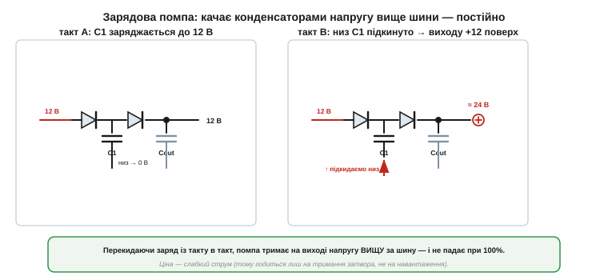
*Рис. 2.7.11.5. Зарядова помпа. Такт A: летючий конденсатор C1 заряджається до 12 В. Такт B: його низ підкидають угору, і він переливає заряд у Cout — на виході виходить напруга вище шини (тут ≈ 24 В). Безперервне чергування тактів тримає цю напругу постійно, без пауз.*

Розплата за невтомність — **малий струм**. Помпа віддає крихту заряду за кожен такт, тож її вистачає рівно на те, щоб **тримати** затвор (де струм у спокої майже нульовий, [§2.7.1](mosfet.md)), але не на живлення навантаження. Це не біда: для керування затвором більше й не треба. Зарядові помпи трапляються не лише у драйверах — ними роблять і невеликі негативні чи подвоєні напруги для аналогових схем, — але нам вони цікаві передусім як спосіб **постійно** тримати відкритим верхній N-ключ.

> 🔧 **Навіщо це.** Практичний поділ простий. **Бутстреп** — коли ключ **перемикається** (будь-який ШІМ, мости моторів, перетворювачі): дешево, потужний імпульс у затвор, але 100 % не тримає. **Зарядова помпа** — коли верхній ключ має бути відкритим **постійно** (ключ живлення «увімкнув і забув», високобічний «ідеальний діод»): тримає вічно, але струм кволий. Багато готових мікросхем мають **обидва** механізми всередині: бутстреп для перемикань і маленьку помпу, щоб дотягувати заряд при дуже високій шпаруватості.

### Бутстреп проти зарядової помпи

Поставмо два способи поряд, щоб вибір був очевидний.

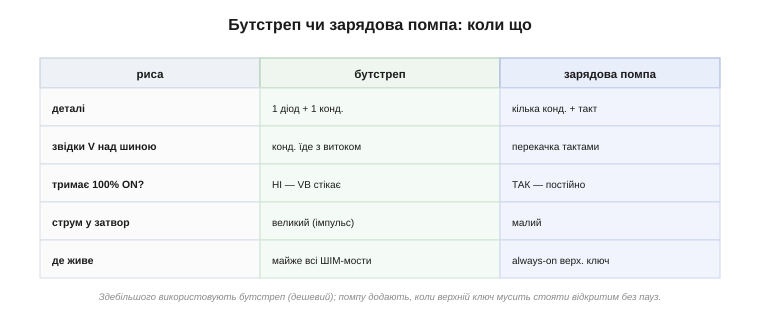
*Рис. 2.7.11.6. Бутстреп проти зарядової помпи. Бутстреп — дешевий (діод + конденсатор), дає потужний імпульс у затвор, але не тримає 100 %. Помпа — складніша, струм слабкий, зате тримає напругу над шиною постійно. Звідси й розподіл задач.*

```
                бутстреп               зарядова помпа
деталі          1 діод + 1 конденсатор кілька конденсаторів + такт
V над шиною     конденсатор їде з SW   перекачка заряду тактами
тримає 100% ON  НІ (стікає)            ТАК (постійно)
струм у затвор  великий (імпульсний)   малий
типове місце    ШІМ-мости, інвертори   always-on верхній ключ
```

Здебільшого використовують **бутстреп** — він дешевший і дає потужніший імпульс, потрібний для швидкого перемикання. **Зарядову помпу** додають там, де верхній ключ мусить стояти відкритим без пауз. А межа між ними — це питання «чи перемикається верхній ключ достатньо часто, щоб устигати перезаряджати конденсатор».

### Усе разом: мікросхема-драйвер півмоста

На практиці ніхто не паяє бутстреп, зсув рівня й мертвий час із дискретних деталей — беруть готову **мікросхему-драйвер півмоста** *(half-bridge gate driver)*, що ховає всі ці тонкощі всередині. Це природне продовження драйвера затвора з [§2.7.7](mosfet.md), тільки тепер драйвер уміє керувати **обома** ключами плеча — і нижнім, і підступним верхнім.

Що в ній є? З боку логіки — два входи, **HIN** і **LIN** *(high/low input)*: куди мікроконтролер подає, який ключ має бути відкритий (часто це просто комплементарний ШІМ). З боку силовому — два виходи, **HO** і **LO** *(high/low output)*, що йдуть прямо на затвори верхнього й нижнього ключів. Верхній вихід живиться від **плаваючої** пари виводів: **VB** (плаваючий «плюс» для верхнього ключа) і **VS** (плаваюча опора, яку приєднують до точки SW — до витоку верхнього ключа). Саме між VB і VS вішають той самий бутстрепний конденсатор, а діод іде від низьковольтного живлення до VB. Драйвер усередині **стежить** виводом VS за плаваючим витоком і подає на HO напругу, що завжди тримається потрібні 10…15 В вище за нього.

І найцінніше: добрий драйвер **сам** забезпечує **мертвий час** ([§2.7.10](mosfet.md)) — навіть якщо керувати обома входами недбало, він не дасть верхньому й нижньому ключам відкритися разом, лишаючи між перемиканнями захисну паузу. Те, чого в саморобному мості доводиться пильнувати вручну, тут уже зашите всередину.

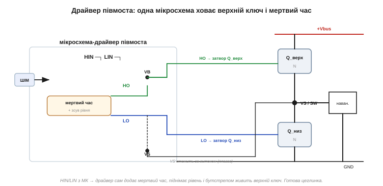
*Рис. 2.7.11.7. Драйвер півмоста. Зліва логічні входи HIN/LIN з МК; усередині — зсув рівня й мертвий час; справа виходи HO/LO на затвори. Верхній канал живиться від плаваючої пари VB/VS (бутстрепний конденсатор між ними), а вивід VS стежить за рухомим витоком. Одна мікросхема ховає весь клопіт верхнього ключа.*

> 🔌 **Що насправді на платі.** Як саме виглядають ці виводи (HIN/LIN, HO/LO, VB/VS), де на готовому модулі шукати бутстрепний конденсатор і діод, і чим класичний L298-клас відрізняється від сучасних MOSFET-драйверів із бутстрепом — у компонентній вставці [«Плата драйвера мотора: L298-клас і сучасні MOSFET-драйвери»](comp-h-bridge-board.md).

### Зберімо приклад докупи

Хай маємо півміст на двох N-канальних ключах із шиною Vbus = 24 В і керуємо ним ШІМ на 20 кГц. Як живити затвор верхнього ключа?

```
1) спосіб: БУТСТРЕП (ключ перемикається — паузи є самі собою)
2) живлення драйвера Vdrv = 12 В (низьковольтне, для зарядки Cbs)
3) Dbs: швидкий діод від Vdrv до VB; Cbs: між VB і VS (≈ точка SW)
4) фаза заряду: нижній ключ ON → SW ≈ 0 → Cbs набирає 12 В
5) фаза роботи: верхній ключ ON → SW злітає до 24 В →
   VB = 24 + 12 = 36 В → Vgs(верх) = VB − SW = 12 В  ✓ відкрито
6) мертвий час між ключами лишає драйвер сам (проти наскрізного струму)
```

Шість пунктів — і верхній N-ключ слухняно відкривається над 24-вольтовою шиною, хоча найвища напруга живлення в схемі — лише ті самі 24 В. А якби той самий ключ мав стояти відкритим **постійно** (не ШІМ, а просто «увімкнути й тримати»), бутстреп би згас — і ми взяли б натомість драйвер із **зарядовою помпою**, що тримає 36 В на затворі невтомно. Зверніть увагу: ми ніде не «добули» вищу напругу ззовні — її щоразу **виготовляє** сама схема, перекидаючи заряд конденсатором.

> 🔧 **Навіщо це.** Підсумок усієї теми в одному правилі. Верхній N-ключ вимагає на затворі напруги **вище за шину** — бо його витік сам злітає до шини, а Vgs міряється від витоку. Цю напругу **виготовляють**: **бутстрепом** (діод + конденсатор, що їде з витоком) для ключів, які **перемикаються**, або **зарядовою помпою** для тих, що мають бути відкриті **постійно**. На практиці беріть готову мікросхему-драйвер півмоста — вона ховає і бутстреп, і зсув рівня, і мертвий час, і дає вам лише два прості входи HIN/LIN. Саме тому на чужих платах біля кожного верхнього ключа ви й бачите той загадковий конденсатор із діодом — тепер ви знаєте, що це і навіщо.

### Підсумок розділу

На цьому польовий транзистор вичерпано вже геть до краю. Ми пройшли його від самої ідеї — керувати **полем**, а не струмом ([§2.7.1](mosfet.md)) — крізь будову ([§2.7.2](mosfet.md)), поріг ([§2.7.3](mosfet.md)), два типи ([§2.7.4](mosfet.md)), опір ([§2.7.5](mosfet.md)), силовий ключ ([§2.7.6](mosfet.md)) і швидкість ([§2.7.7](mosfet.md)), порівняли з біполярним ([§2.7.8](mosfet.md)), зібрали КМОН-логіку ([§2.7.9](mosfet.md)) та H-міст ([§2.7.10](mosfet.md)) — і нарешті закрили останній борг, навчившись керувати **верхнім** ключем над шиною. Тепер MOSFET для нас — не загадка, а зрозумілий і керований інструмент, від логічного вентиля до тягового мосту.

А тепер — назад до аналогу. Ми знаємо **обидва** транзистори й уміємо ними і перемикати, і підсилювати. Та щоразу, проєктуючи підсилювач, ми мусили морочитися з робочими точками, зміщенням і розкидом параметрів. А що, як хтось уже сховав цю мороку всередину готового приладу й дав інженерові майже **ідеальний** підсилювач — бери й користуйся? Саме це й зробив **операційний підсилювач**, з якого почнеться наступний розділ.

> ▶️ Далі: [Розділ 2.8 — Операційний підсилювач і компаратор](../opamp-comparator/opamp-comparator.md)
