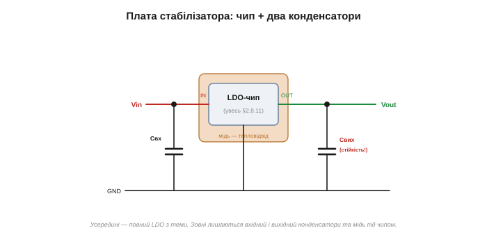
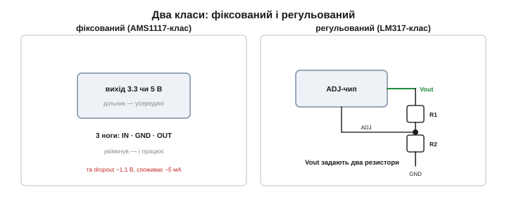

# 🔌 Модуль лінійного стабілізатора: AMS1117-клас і чому він гріється

> Це компонентна вставка до теми [2.8.11 «LDO зсередини»](opamp-comparator.md). Тема розклала стабілізатор на нутрощі — ОП, прохідний транзистор і опорну напругу в петлі. Тут — про **готову** мікросхему, що пакує все це у три ноги: що на платі довкола неї, чому без одного конденсатора вона «заводиться», чому гріється і чим фіксований клас відрізняється від регульованого.

### Що це за клас пристроїв

Мікросхема лінійного стабілізатора — це весь LDO з теми, спакований в один крихітний триногий корпус. Подаєш на вхід «брудну» напругу — на виході маєш рівну. Найпоширеніший дешевий фіксований представник — **AMS1117-клас** (версії на 3.3 В, 5 В тощо), класичний регульований — **LM317-клас**.

### Що на платі

*Рис. 2.8.11c.1. Усередині чипа — повний LDO з теми (прохідний транзистор, підсилювач-наглядач, еталон, а у фіксованих версіях і дільник). Зовні треба небагато: вхідний конденсатор, **вихідний** конденсатор (обов'язково — заради стійкості петлі) і **мідний поліґон** під чипом, бо корпус скидає тепло саме в плату.*

Тобто все хитре вже всередині кремнію — від вас лишаються дві «цеглинки» обв'язки й трохи міді для тепловідводу.

### Розпіновка й підключення

**Фіксований** (AMS1117-клас) — три ноги: **IN**, **GND**, **OUT**. Подати вхід на IN, навантаження зняти з OUT, землю з'єднати; конденсатор на вхід і конденсатор на вихід — близько до ніг. І все.

**Регульований** (LM317-клас) — ноги **IN**, **OUT**, **ADJ**: вихід задають **два зовнішні резистори** за тією самою формулою з теми, Vout = Vref·(1 + R1/R2), де еталон у LM317-класі ≈1.25 В.

*Рис. 2.8.11c.2. Фіксований дає готову напругу й не потребує нічого, крім конденсаторів. Регульований лишає дільник назовні — і ви добираєте Vout двома резисторами. Зручність фіксованого — простота; гнучкість регульованого — будь-яка напруга.*

### Перший «байт»

Коду тут нема — його просто вмикають: «брудне» на вхід, рівне з виходу. Головне — не забути вихідний конденсатор (а для декотрих чипів ще й **певного** типу) і спільну землю.

### Типові граблі

**Вихідний конденсатор = стійкість.** Без нього (чи з невідповідним) петля зворотного зв'язку «розгойдується» й починає коливатися замість тримати напругу — рівно та загроза, про яку попереджала тема. Став правильний конденсатор і ближче до ніг.

**Тепло.** Чип палить (Vin − Vout)·I. AMS1117 у дрібному корпусі без міді перегрівається за мить: зробити 3.3 В із 5 В при 0.5 А — це ≈0.85 Вт на маленькому корпусі, відчутно гаряче ([тепловий розрахунок](../mosfet/proj-thermal-calc.md)). Дай йому мідь або візьми імпульсний.

**«LDO», та не аж такий малий.** Dropout у AMS1117 — близько 1.1 В, тобто не дуже-то й «low»: зробити 5 В із 5.2 В ним не вийде. Справжні малодропаутні прилади тримають вихід ближче до входу.

**Власне споживання.** AMS1117 сам з'їдає ~5 мА — згубно для пристрою на батарейці, що має місяцями спати. Для автономних схем беруть LDO з мікроамперним споживанням.

**Струм і захист.** Тримає десь до ампера; зате має вбудований **тепловий захист** і **обмеження струму** — сам себе вимкне, якщо перегріється чи закоротити вихід. Це приємний бонус.

### Варіації

Фіксований (AMS1117-3.3/-5.0) — найпростіший. Регульований (LM317-клас) — будь-яка напруга двома резисторами. **Малодропаутні** й **мікроспоживні** LDO — для батарейних пристроїв. Старий **7805-клас** — більший dropout (~2 В), зате невибагливий і витривалий. А коли важать тепло й ККД (велика різниця напруг чи чималий струм) — беруть уже **імпульсний** стабілізатор, та це інша історія.

> 🔧 **Навіщо це.** Беручи готовий стабілізатор: пам'ятай, що це весь LDO з теми у трьох ногах. **Завжди** став вихідний конденсатор (без нього схема коливатиметься), дай чипу мідь під тепловідвід і чесно прикинь нагрів (Vin − Vout)·I. Для батарейки дивись на власне споживання, а коли різниця напруг чи струм великі — лінійний уже не варіант, бо все зайве йде теплом. Фіксований AMS1117-клас — коли треба «просто 3.3 В», регульований LM317-клас — коли напруга нестандартна.
