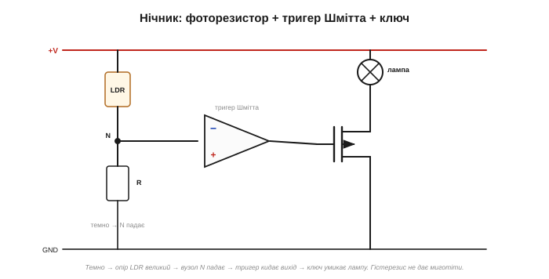
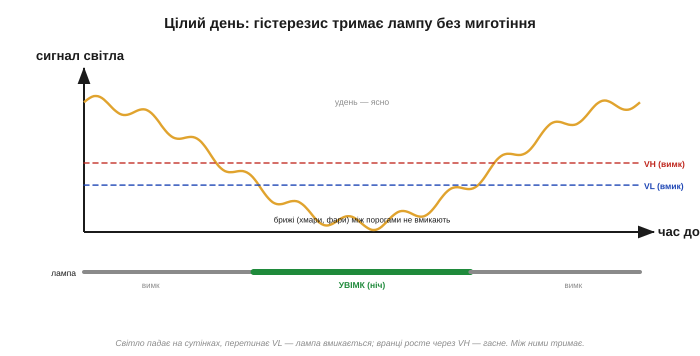

# ⚙️ Поріг із гістерезисом наживо: нічник без миготіння

> Це алгоритмічна вставка до теми [2.8.8 «Гістерезис і тригер Шмітта»](opamp-comparator.md). Тема пояснила, чому гістерезис гасить дребезг. Тут — повна збірка наживо: автоматичний **нічник** із фоторезистора й тригера Шмітта, що вмикається в сутінках і **не миготить**, коли межу перетинають хмари чи фари. Усе на аналоговому залізі, без жодного коду.

### Задача

Лампа, що сама вмикається в темряві й гасне на світлі. Наївний варіант — один компаратор, один поріг — на сутінках миготить до сказу: світло повільно повзе через поріг, і кожна хмара, кожна машина, що проїхала, совгає його туди-сюди — лампа блимає. Нам же треба **одне** чисте ввімкнення на сутінках і одне вимкнення на світанку.

### Ідея: давач + поріг із пам'яттю

Збираємо з трьох уже знайомих блоків:


*Рис. 2.8.8a.1. **Давач:** фоторезистор (LDR) у дільнику з резистором R дає на вузлі N напругу, що стежить за яскравістю (темно → опір LDR великий → N падає). **Рішення:** тригер Шмітта (компаратор із гістерезисом, [§2.8.8](opamp-comparator.md)) — два пороги, тож, перемкнувшись, він тримається. **Дія:** вихід керує MOSFET-ключем ([§2.7.6](../mosfet/mosfet.md)), що вмикає лампу.*

### Процедура побудови

```
1. Дільник LDR:  V_N = +V · R / (R + R_LDR)     # темно → R_LDR↑ → V_N падає
2. Обрати рівень сутінків (за якої яскравості перемикати) → центр порогів
3. Зазор гістерезису зробити БІЛЬШИМ за шум сутінків (хмари, фари);
   ширину задає зворотний зв'язок (як рахувати — вставка §2.8.8m)
4. Вихід тригера → затвор MOSFET → лампа
```

### Логіка стану


*Рис. 2.8.8a.2. Удень сигнал високий (ясно). На сутінках падає, перетинає нижній поріг VL — лампа вмикається. Уночі тримається низько (лампа горить). На світанку росте, перетинає верхній поріг VH — гасне. А брижі від хмар і фар, що не виходять за смугу між порогами, стан **не** чіпають.*

```
V_N упав нижче VL (стало темно)   → лампа УВІМК
V_N піднявся вище VH (знову ясно) → лампа ВИМК
між VL і VH                        → тримає стан (не миготить)
```

Уся хитрість — у тому, що зазор VH − VL роблять **ширшим** за коливання яскравості на сутінках. Тоді хмара, що набігла, чи фари авто хоч і смикнуть сигнал, але в межах смуги — і лампа стоятиме твердо. Одне чисте ввімкнення ввечері, одне вимкнення вранці.

### Складність і пастки

**Ширина гістерезису.** Замала — миготіння (хмари перемикають); завелика — лампа вмикається вже глибокої ночі, а гасне далеко за полудень. Бери зазор трохи більший за найгірше коливання на сутінках.

**Лампі потрібен ключ.** Компаратор (а тим паче його відкритий колектор, [§2.8.7](opamp-comparator.md)) живити лампу сам не може — м'язи дає **MOSFET** ([§2.7.6](../mosfet/mosfet.md)). Якщо лампа мережева — реле ([§2.6.9](../bjt/bjt.md)) з належною ізоляцією.

**Тонкощі LDR.** Фоторезистори повільні й нелінійні — для нічника байдуже (світло міняється поволі). Та класичні LDR на сульфіді кадмію містять токсичний метал і їх поступово витісняють; у сучасних схемах беруть **[фототранзистор](book:components/light-sensors)** чи фотодіод — ідея дільника та сама.

**Сталий струм спокою.** Дільник із LDR увесь час трохи споживає — для батарейної схеми бери більший R.

**Рівень спрацювання.** Зробіть R змінним (потенціометром) — і дістанете ручку «наскільки стемніти, щоб увімкнутися».

### Варіації

Фототранзистор замість LDR (швидший, без токсичного металу). Версія на мікроконтролері: дільник читає АЦП, а два пороги роблять у коді (для високоомного давача згодиться [буфер](comp-buffer-divider.md)). Краса ж аналогової версії — **нуль коду**: працює тієї ж миті, щойно подаси живлення. Можна додати ще й затримку, щоб короткий спалах світла не перемкнув лампу.

> 🔧 **Навіщо це.** Запам'ятайте кістяк **«давач → дільник → тригер Шмітта → ключ»** — це скелет **усієї** порогової автоматики: нічник, термостат, давач рівня, сторож темряви. Перетвори величину на напругу, порівняй із порогом **із гістерезисом** (щоб не миготіло на шумі), а тоді перемкни навантаження транзистором. Той самий гістерезис, що тема показала як ідею, тут став реальним пристроєм на столі.
