# Розділ 2.4 — АЧХ, децибели й фільтри

Попередній розділ дав нам мову частоти: реактивності, фази, резонанс. Тепер настав час головного практичного питання: як **описати ціле коло** одним портретом — щоб з одного погляду бачити, які частоти воно пропускає, які гасить і що робить із фазою? Такий портрет зветься **частотною характеристикою**, її графік — **діаграмою Боде**, а кола, спроєктовані заради бажаної характеристики, — **фільтрами**. Цей розділ збирає інструменти, якими аналогова електроніка користується щодня: частота зрізу, децибели, нахили −20 дБ/декаду, смуга пропускання й точка −3 дБ.

Усе потрібне вже в руках: реактивності Xc і XL з [Розділу 2.3](../ch09-reactance-resonance/ch09-reactance-resonance.md), дільник напруги з [Розділу 1.5](../../block-1-circuits-physics/ch05-equivalent-circuits/ch05-equivalent-circuits.md) і фазори для тих, хто хоче строгості.

> 📜 **Перед матеріалом — історія:** [Гендрік Боде — графіки, що приручили зворотний зв'язок](r04-history-bode.md). Вона показує, *звідки* взялися ці графіки: з боротьби за телефонну лінію через континент, проти підсилювачів, що вили, — і чому інструмент 1938 року досі живе в кожному даташиті.

---

## 2.4.1 Коло як фільтр: що таке частотна характеристика

Розділ 2.3 навчив нас головного: конденсатор і котушка поводяться **по-різному на різних частотах**. Але всі наші розрахунки там стосувалися однієї синусоїди за раз — однієї частоти, однієї амплітуди. А реальні сигнали не такі: голос у мікрофоні, музика в підсилювачі, цифровий фронт на шині, живлення з шумом перетворювача — це завжди **суміші** багатьох частот одразу. Постає питання, без якого далі нікуди: що коло робить із **усією сумішшю**? Невже доведеться рахувати кожен сигнал окремо? На щастя, ні. У цій темі ми побудуємо найпотужнішу ідею всього розділу: один **частотний портрет** кола, який раз і назавжди каже, що воно зробить із будь-яким сигналом. Цей портрет зветься частотною характеристикою — і щойно ви навчитеся його бачити, кожне коло з R, L і C перетвориться для вас на **фільтр**.

### Сигнали — це суміші синусоїд

Почнімо з твердження, яке спершу звучить неймовірно: **будь-який** періодичний сигнал можна скласти з синусоїд. Не приблизно, не «схоже» — точно. Прямокутний меандр, трикутник, пилка, запис голосу — все це суми синусоїд певних частот, амплітуд і фаз. Цей факт довів математик Жан-Батист Фур'є ще на початку XIX століття (для задач про теплоту, навіть не підозрюючи про електроніку), і доводити його ми не будемо — але подивитися, як це працює, варто на власні очі:


*Рис. 2.4.1.1. Складаємо меандр із синусоїд-«гармонік»: основна частота, потім додаємо 3-тю гармоніку (утричі вищу за частотою, утричі меншу за амплітудою), 5-ту, 7-му… З кожним доданком сума дедалі більше схожа на прямокутник. Зверніть увагу: крутим фронтам потрібні високі гармоніки — швидкі деталі сигналу «зашиті» у високих частотах.*

Складники звуть **гармоніками** (*harmonics*): перша — основна частота сигналу, далі кратні їй. У меандра, наприклад, живуть лише непарні гармоніки (1-ша, 3-тя, 5-та…) зі спадними амплітудами — ми вже зустрічали його «третю гармоніку» як привида у [вставці про свіп](../ch09-reactance-resonance/ch09-s5-a-resonance-sweep.md). Набір «яка частота — скільки її в сигналі» називають **спектром** (*spectrum*) сигналу. Найважливіший практичний висновок із Рис. 2.4.1.1: **що крутіші деталі сигналу, то вищі частоти в них зашиті**. Плавна хвиля — низькочастотна; гострий фронт чи вузька голка — це обов'язково високі гармоніки. Тримайте це в голові: воно пояснить половину розділу.

### Лінійне коло розбирає суміш по одній синусоїді

Тепер другий складник ідеї. У [вставці про похідні синуса](../ch09-reactance-resonance/ch09-s4-m-sine-derivative.md) ми з'ясували: синусоїда — єдина форма, яку лінійне коло (з резисторів, конденсаторів, котушок) **не спотворює**. Подали синус частоти f — на виході отримаєте синус **тієї самої частоти** f; коло може лише змінити його амплітуду й зсунути фазу. Жодних нових частот лінійне коло не народжує.

А завдяки суперпозиції ([Розділ 1.4](../../block-1-circuits-physics/ch04-kirchhoff-circuit-analysis/ch04-kirchhoff-circuit-analysis.md): у лінійному колі відгуки на кілька джерел додаються) коло обробляє кожну синусоїду суміші **незалежно від сусідок**: третя гармоніка «не знає», що поряд іде перша. Складіть це разом — і вийде разючий висновок: щоб знати, що коло зробить із *будь-яким* сигналом, досить знати, що воно робить із *кожною окремою частотою*. А це лише два числа на частоту:

```
K(f) — у скільки разів змінюється амплітуда синусоїди частоти f
φ(f) — на який кут зсувається її фаза
```

Пара функцій K(f) і φ(f) — це і є **частотна характеристика** (*frequency response*) кола. Графік K(f) звуть **амплітудно-частотною характеристикою** — **АЧХ** (*amplitude response*); графік φ(f) — **фазо-частотною**, ФЧХ. Один раз виміряв чи порахував — і маєш повний портрет кола на всі випадки життя.

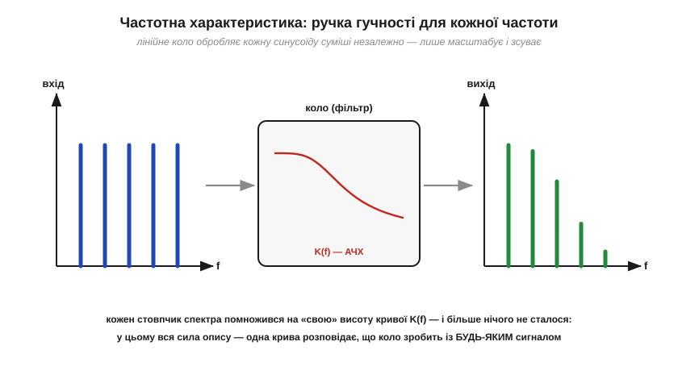
*Рис. 2.4.1.2. Як працює лінійне коло з сумішшю: вхідний спектр (сині стовпчики) проходить крізь коло, і кожен стовпчик множиться на «свою» висоту кривої K(f) — виходить вихідний спектр (зелені). Більше нічого не відбувається: уся дія кола на будь-який сигнал закодована в одній кривій.*

Найкраща побутова метафора — **еквалайзер** у музичному застосунку: ряд повзунків, кожен керує гучністю своєї смуги частот. АЧХ — це той самий еквалайзер, лише з нескінченно багатьма повзунками, положення яких задано не вашим смаком, а самою схемою. І ключове прозріння теми: **кожне лінійне коло — еквалайзер**, незалежно від того, чи ви його таким задумували.

### Звідки береться форма K(f): перший приклад

Подивімося, як схема «малює» свою характеристику, на найпростішому колі — резистор послідовно, конденсатор на вихід (це той самий дільник із реактивністю, що ми бачили у [π-фільтрі](../ch09-reactance-resonance/ch09-s3-c-lc-supply-filter.md), у найголішому вигляді). Міркуємо трьома опорними частотами, як учив [Розділ 2.3](../ch09-reactance-resonance/ch09-reactance-resonance.md):


*Рис. 2.4.1.3. На низьких частотах Xc величезна — дільник майже не ділить, K ≈ 1. На високих Xc мізерна — вихід практично замкнено на землю, K → 0. Між ними, довкола частоти, де Xc = R, лежить плавний перехід. Ціла крива K(f) виросла з одного правила «Xc = 1/(2πfC)».*

На низькій частоті реактивність конденсатора Xc = 1/(2πfC) величезна порівняно з R — дільник віддає на вихід майже все: K ≈ 1. На високій — Xc крихітна, вихід «сидить» майже на землі: K → 0. А там, де Xc = R, коло ділить навпіл за потужністю (чому це «0.7 за амплітудою» — окрема розмова в темах далі). Виходить плавна крива, що пропускає низ і ріже верх, — **фільтр нижніх частот**. Його докладний розбір — наступна тема; тут нам важливий сам механізм: частотна залежність реактивностей із Розділу 2.3 **і є** причиною, чому в кола взагалі є нетривіальна АЧХ.

### Чотири характери

Комбінуючи реактивності, що тягнуть у протилежні боки ([§2.3.1](../ch09-reactance-resonance/ch09-reactance-resonance.md): Xc спадає, XL росте), отримують чотири канонічні форми характеристики:

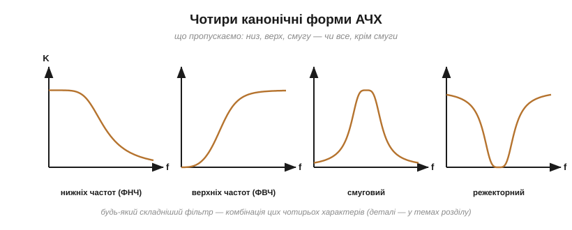
*Рис. 2.4.1.4. Фільтр нижніх частот пропускає повільне і ріже швидке; верхніх — навпаки; смуговий вирізає й пропускає лише околицю однієї частоти (це наш резонансний контур із §2.3.5 очима АЧХ); режекторний — пропускає все, КРІМ смуги. Складніші фільтри — комбінації цих чотирьох характерів.*

Зауважте: ми нічого нового не збудували — смуговий фільтр це просто RLC-вибірковість із [§2.3.7](../ch09-reactance-resonance/ch09-reactance-resonance.md), перемальована як K(f). Новою є **мова**: замість «контур відгукується на свою частоту» ми тепер кажемо «АЧХ має пік» — і ця мова однаково описує і резонанс, і розв'язку живлення, і аудіотракт.

### Як побачити характеристику наживо

Частотна характеристика — не абстракція з підручника: її можна виміряти на столі, і інструмент у нас уже є. Це той самий **свіп** із [вставки до §2.3.5](../ch09-reactance-resonance/ch09-s5-a-resonance-sweep.md): подаємо на вхід кола синусоїду, крокуємо частотою, на кожному кроці міряємо амплітуду на виході й ділимо на вхідну — точка за точкою виростає крива K(f). Хочеться й фази — міряємо зсув на кожному кроці (зручніше за все [фігурами Ліссажу](../ch09-reactance-resonance/ch09-s4-a-lissajous.md): форма петлі дає кут одразу). Усі застереження свіпу чинні й тут: дати колу встановитися, не перевантажувати його рівнем, пам'ятати про гармоніки меандра.

А є і швидкий якісний тест без жодного свіпу — подати **меандр** і подивитися на форму виходу. Логіка прямо з Рис. 2.4.1.1: меандр везе в собі цілий віяр гармонік одразу, тож форма на виході розповідає про характеристику з одного погляду. Заокруглені кути — коло ріже верх (ФНЧ-характер); загострені «вуса» на фронтах і провисла полиця — ріже низ; дзвін після фронту — десь стирчить резонансний пік ([§2.2.9](../ch08-inductor/ch08-inductor.md) про дзвін ми вже знаємо). Цей трюк «меандр як зонд» — улюблений прийом налагоджувальника, і він ще не раз з'явиться в курсі.

### Межа портрета: лише лінійні кола

Перш ніж закохатися в нову ідею остаточно, чесно окреслимо її межі. Увесь фокус «коло повністю описане своєю K(f)» стоїть на **лінійності**: на тому, що синус проходить крізь коло, лишаючись синусом тієї самої частоти. Резистори, конденсатори, котушки — лінійні (поки котушка не в насиченні, [§2.2.7](../ch08-inductor/ch08-inductor.md), а кераміка не «пливе» від напруги, [§2.1.5](../ch07-capacitor/ch07-capacitor.md)). А от **діод** ([Розділ 2.5](../ch10-diode-pn-junction/ch10-diode-pn-junction.md)) — ні: подайте на нього чистий синус, і на виході з'являться частоти, яких на вході **не було** — кратні гармоніки. Те саме робить будь-який підсилювач, загнаний у перевантаження: «зрізані» вершини синусоїди — це новонароджені високі гармоніки, і саме їх вухо чує як хрип.

Для нелінійних кіл частотний портрет у нашому простому сенсі не складається: мало знати, що коло робить із кожною частотою окремо, бо частоти в ньому **взаємодіють**. Це не робить ідею марною — навпаки: лінійна частина схеми описується АЧХ, а нелінійності розглядають окремо, як джерела нових частот. Інженерний словник тут такий: «спотворення» (*distortion*) — це поява гармонік, яких не було; «смуга» — властивість лінійної частини. Розрізняти ці два механізми псування сигналу — заокруглення від обмеженої смуги проти хрипу від нелінійності — означає одразу знати, **де** в тракті шукати винуватця.

### Фаза — друга половина портрета

Чому портрет складається з **двох** кривих, а не однієї? Здавалося б, фаза — дрібниця: ну зсунулась синусоїда трохи вбік, хто помітить? Для однієї синусоїди — справді ніхто. Але в суміші гармоніки складаються в форму сигналу **узгоджено**, і якщо коло зсуне їх по фазі по-різному, сума складеться вже в **іншу форму** — навіть якщо всі амплітуди незаймані:


*Рис. 2.4.1.5. Два сигнали з однаковісінькими спектрами амплітуд: угорі фази гармонік правильні — меандр як меандр; унизу 3-тю, 5-ту й вищі гармоніки зсунуто по фазі — і форма попливла. АЧХ цих сигналів не відрізнити; різниця живе у ФЧХ. Ось чому в даташитах поруч із кривою підсилення малюють криву фази.*

Тож запам'ятаймо чесне правило: **АЧХ каже, що станеться з амплітудами; ФЧХ — чи збережеться форма**. Для багатьох задач (фільтр живлення, виділення станції) досить АЧХ; але там, де важлива форма сигналу — осцилографи, передача даних, якісне аудіо, — фаза стає повноправною половиною портрета. У цьому розділі ми здебільшого працюватимемо з АЧХ, чесно позначаючи місця, де фаза вийде на сцену (а вона вийде — згадайте, чим закінчилась [історія Боде](r04-history-bode.md): саме фаза вирішує, чи завиє зворотний зв'язок).

### Фільтрує все

І останній поворот теми, найважливіший для практики. Слово «фільтр» звучить як назва спеціальної деталі, яку інженер *ставить навмисне*. Насправді нетривіальну частотну характеристику має **кожне** реальне коло — бо паразитні опори та ємності є скрізь ([§2.1.1](../ch07-capacitor/ch07-capacitor.md): будь-які два провідники — вже конденсатор):

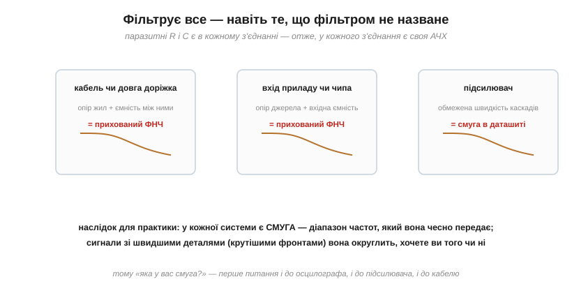
*Рис. 2.4.1.6. Кабель (опір жил + ємність між ними), вхід приладу (опір джерела + вхідна ємність), підсилювач (швидкість його каскадів скінченна) — у кожного є власний прихований ФНЧ. Наслідок: у кожної системи є СМУГА — діапазон частот, який вона чесно передає; усе швидше вона округлить.*

**Приклад (меандр крізь приховане RC).** Цифровий меандр 100 кГц біжить довгим кабелем, чиї паразитні R і C утворюють ФНЧ із переходом близько 200 кГц. Що станеться з формою? Розкладемо меандр на гармоніки (Рис. 2.4.1.1) і пропустимо кожну крізь K(f) = 1/√(1 + (f/f_c)²) — формулу цієї кривої ми чесно виведемо в наступних темах, а зараз просто скористаємось:

```
1-ша гармоніка (100 кГц):  f/f_c = 0.5   →  K ≈ 0.89   (майже ціла)
3-тя гармоніка (300 кГц):  f/f_c = 1.5   →  K ≈ 0.55   (удвічі слабша)
5-та гармоніка (500 кГц):  f/f_c = 2.5   →  K ≈ 0.37   (утричі слабша)
```

Високі гармоніки — ті самі, що тримали круті фронти, — пригасли сильніше за основну. Сума недорахується швидких складників, і прямокутник на тому кінці кабелю приїде з **заокругленими кутами й затягнутими фронтами**. Упізнаєте? Це ж та сама картина, що дає RC-коло в часі ([§2.1.4](../ch07-capacitor/ch07-capacitor.md): експоненційне заряджання згладжує сходинку)! Часова мова («конденсатор не встигає зарядитися») і частотна («високі гармоніки зрізано») — **два описи одного явища**, і вміння перемикатися між ними — чи не головна навичка, яку дасть цей розділ.

> 🔌 **Компонентна вставка:** [щуп осцилографа 10:1 — АЧХ просто в руках](r04-s1-c-scope-probe.md). Найбуденніший приклад «фільтрує все»: усередині звичайного щупа — частотно-компенсований дільник, без конденсатора він був би фільтром на 160 Гц, а його характеристику ви самі вирівнюєте викруткою по меандру з клеми «PROBE COMP».

> 🔧 **Навіщо це.** Частотна характеристика — це мова, якою описано пів електроніки. «Смуга осцилографа 100 МГц», «підсилювач до 20 кГц», «фільтр перед вимірюванням», «кабель завалює фронти» — усе це твердження про K(f). Звикайте до питання «а яка тут АЧХ?» щодо будь-якого кола між джерелом сигналу і його споживачем: воно або збереже ваш сигнал, або непомітно перетворить його на щось інше. У наступних темах ми навчимося цю криву рахувати, малювати за хвилину і читати з даташитів.

Підсумуймо. Реальні сигнали — **суміші синусоїд** (спектр), і що крутіші деталі сигналу, то вищі частоти в них зашиті. Лінійне коло не народжує нових частот: воно лише множить амплітуду кожної гармоніки на K(f) і зсуває фазу на φ(f) — тож пара кривих K(f) та φ(f), **частотна характеристика**, повністю визначає дію кола на будь-який сигнал. АЧХ буває чотирьох канонічних характерів (низ, верх, смуга, виріз), фаза відповідає за збереження форми, а нетривіальна характеристика є в *кожного* кола — навмисного фільтра чи випадкового. Лишилося зробити цю мову кількісною: порахувати першу криву чесно, з формулою і характерною точкою зрізу. Беремо найпростіший і найуживаніший випадок — RC-фільтр нижніх частот.

---

## 2.4.2 RC-фільтр низьких частот: частота зрізу

Попередня тема намалювала ескіз: резистор у шлях сигналу, конденсатор у землю — і коло пропускає повільне, ріже швидке. Тепер зробімо з ескіза робочий інструмент: чесну формулу K(f), одну характерну точку, яку треба знати напам'ять, і пару прямих, якими ця крива малюється за десять секунд. RC-фільтр нижніх частот — мабуть, найтиражованіше коло в електроніці взагалі: він стоїть на входах вимірювань, у колах живлення, в аудіотрактах, у лініях скидання — а головне, він є **мимоволі** скрізь, де є опір і ємність. Розібравши його один раз як слід, ви отримаєте ключ до половини схем, які будь-коли побачите.

### Схема і механізм

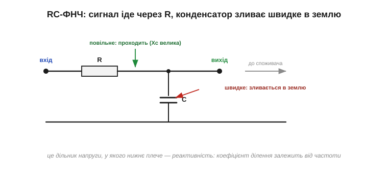
*Рис. 2.4.2.1. Сигнал іде до виходу через R; конденсатор підпирає вихід знизу. Для повільних складників Xc величезна — зливати нікуди, все доходить до виходу. Для швидких Xc мізерна — вони стікають у землю, не дійшовши. Це дільник напруги, в якого нижнє плече залежить від частоти.*

**Фільтр нижніх частот** (*low-pass filter*, ФНЧ) — це дільник напруги ([Розділ 1.5](../../block-1-circuits-physics/ch05-equivalent-circuits/ch05-equivalent-circuits.md)) з резистором угорі та конденсатором унизу. Вся частотна поведінка успадкована від Xc = 1/(2πfC) ([§2.3.2](../ch09-reactance-resonance/ch09-reactance-resonance.md)): нижнє плече дільника «тане» зі зростанням частоти, і дедалі менша частка вхідної напруги дістається виходу.

### Виводимо K(f)

Скільки саме дістається? Для звичайного дільника K = R₂/(R₁+R₂). Тут нижнє плече — реактивність, а вона не складається з опором арифметично: напруги на R і на C зсунуті між собою на 90° ([§2.3.4](../ch09-reactance-resonance/ch09-reactance-resonance.md)), тож додавати їх треба **як катети прямокутного трикутника** — це ми вже робили, рахуючи |Z| послідовного RC у [вставці про фазори](../ch09-reactance-resonance/ch09-s1-m-complex-phasors.md).

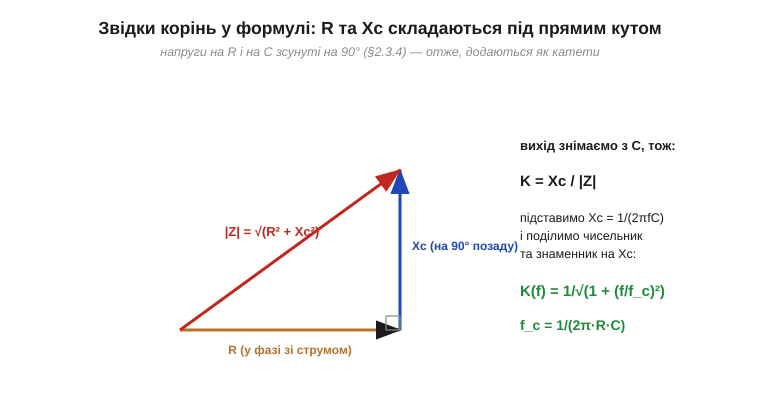
*Рис. 2.4.2.2. R і Xc перпендикулярні, повний опір — гіпотенуза √(R² + Xc²). Вихід знімаємо з конденсатора, тож K = Xc/√(R² + Xc²); поділивши все на Xc, отримуємо канонічний вигляд формули.*

```
K = Xc / √(R² + Xc²)        (дільник з урахуванням 90°)

поділимо чисельник і знаменник на Xc та підставимо Xc = 1/(2πfC):

K(f) = 1 / √(1 + (f/f_c)²),        де   f_c = 1/(2π·R·C)
```

Уся крива залежить від частоти лише через відношення f/f_c — тобто **одна-єдина точка** f_c повністю задає характеристику. Її звуть **частотою зрізу** (*cutoff frequency*). Ми вже зустрічали її двічі: у [§2.3.2](../ch09-reactance-resonance/ch09-reactance-resonance.md) як частоту, де Xc = R, і — придивіться до формули — це ж 1/(2πτ) зі сталою часу τ = RC із [§2.1.4](../ch07-capacitor/ch07-capacitor.md). Часова й частотна мови знову зійшлися в одному числі.

> 🧮 **Математична вставка:** [передавальна функція RC — модуль і фаза з одного дробу](r04-s2-m-transfer-function.md). Той самий результат за два рядки мовою комплексного дільника H(jω) = 1/(1 + jωRC): трикутник виявляється знаменником на комплексній площині, формула фази випадає безплатно, а слово «полюс» дістає формульне обличчя.

### Читаємо криву: три опорні точки

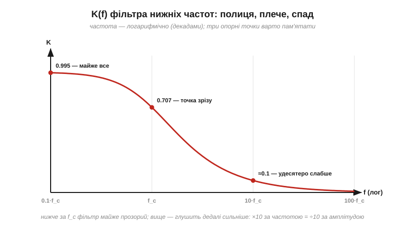
*Рис. 2.4.2.3. На декаду нижче зрізу фільтр практично прозорий (K ≈ 0.995); у самому зрізі передає 0.707 (про сенс цього числа — окрема розмова в темах далі); на декаду вище — глушить удесятеро. Це і є робочий «скелет» будь-якого ФНЧ першого порядку.*

Підставте у формулу три частоти — і отримаєте таблицю, яку варто пам'ятати:

```
f = 0.1·f_c:   K = 1/√1.01 ≈ 0.995    (проходить майже все)
f = f_c:       K = 1/√2    ≈ 0.707    (точка зрізу)
f = 10·f_c:    K = 1/√101  ≈ 0.0995   (≈ удесятеро слабше)
```

**Приклад (порахуємо конкретний фільтр).** R = 1.6 кОм, C = 100 нФ:

```
τ   = R·C = 1600 · 100×10⁻⁹ = 160 мкс
f_c = 1/(2π·τ) = 1/(2π·160×10⁻⁶) ≈ 1 кГц

сигнал 100 Гц:  K ≈ 0.995  — пройде незайманим
завада 10 кГц:  K ≈ 0.1    — ослабне вдесятеро
```

Один резистор і один конденсатор — і коло вже відрізняє корисний сигнал від завади у сто разів вищої частоти.

Чому за «офіційну» межу взято саме 0.707, а не, скажімо, 0.9? Коротка відповідь: 0.707² = 0.5 — у цій точці до виходу доходить рівно **половина потужності** сигналу, тож вона чесно ділить частоти на «здебільшого проходять» і «здебільшого ні». Докладніше про це число і його звичне ім'я «−3 дБ» поговоримо в темі про смугу пропускання; поки що досить запам'ятати: **зріз — це половина потужності, а не нуль сигналу**. Фільтр на f_c ще цілком жвавий — він глушить по-справжньому лише далі.

### Вибір номіналів: одна f_c — багато пар R·C

Формула f_c = 1/(2πRC) задає лише **добуток** R·C: пара «1.6 кОм + 100 нФ» дає той самий кілогерц, що «16 кОм + 10 нФ» чи «160 Ом + 1 мкФ». Яку обрати? Тут і живе інженерія. **Завеликий R** (сотні кілоом і вище) робить вузол високоомним: він ловить наведення ([§2.1.1](../ch07-capacitor/ch07-capacitor.md) — усе довкола є антеною й конденсатором), помітно реагує на витік конденсатора ([§2.1.5](../ch07-capacitor/ch07-capacitor.md)) і на струми входу, до якого підключений. **Замалий R** (десятки ом) перекладає роботу на джерело сигналу: воно мусить ганяти чималий струм у конденсатор, і його власний вихідний опір почне додаватися до R, зсуваючи зріз. Звідси буденне правило: R беруть у діапазоні одиниць-десятків кілоом — значно більшим за вихідний опір джерела і значно меншим за вхідний опір споживача, — а C добирають під потрібну f_c, пильнуючи тип діелектрика: для передбачуваного зрізу краще стабільна кераміка класу 1 чи плівка, бо «10 мкФ» класу 2 під напругою можуть виявитися шістьма ([вставка про MLCC](../ch07-capacitor/ch07-s5-c-mlcc.md)).

### Асимптоти: ескіз Боде за десять секунд

Тут і спрацьовує фокус із [історії розділу](r04-history-bode.md). Подивіться на формулу в крайніх випадках. Далеко **нижче** зрізу (f ≪ f_c) одиниця під коренем головує: K ≈ 1 — горизонтальна **полиця**. Далеко **вище** (f ≫ f_c) головує (f/f_c)²: K ≈ f_c/f — амплітуда падає **обернено до частоти**: подвоїли частоту — удвічі слабше, удесятеро — удесятеро. На логарифмічних осях обидві ділянки — **прямі лінії**:

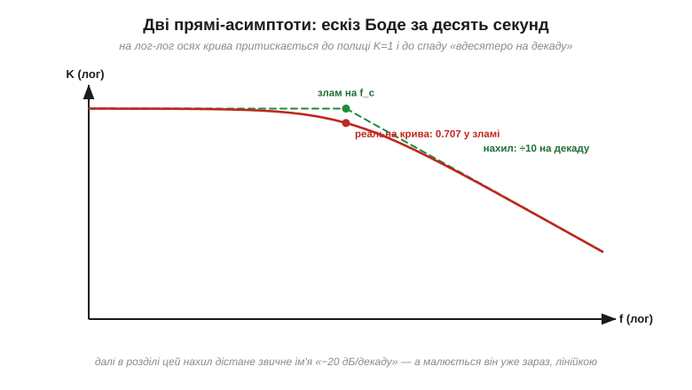
*Рис. 2.4.2.4. Полиця K = 1 і спад «удесятеро на декаду» — дві прямі, що перетинаються рівно на f_c. Реальна крива всюди тулиться до асимптот, відходячи помітно лише біля зламу (там вона проходить через 0.707). Ескіз будь-якого RC-фільтра малюється лінійкою: полиця — злам — похила.*

Найбільша похибка ескіза — якраз у зламі, і вона відома наперед: реальна крива там на 0.707 замість 1. Скрізь далі асимптоти брешуть менш ніж на кілька відсотків. Цей нахил «÷10 на декаду» — головний будівельний блок усіх діаграм розділу; за пару тем він дістане своє традиційне ім'я в децибелах, але малювати його ви вмієте вже зараз.

### Фаза: вихід запізнюється

Друга половина портрета ([§2.4.1](r04-frequency-response.md)) у ФНЧ теж проста. На низьких частотах конденсатор «не заважає» — вихід іде в ногу зі входом, φ ≈ 0. На високих колом командує конденсатор, а його напруга відстає від струму на 90° ([§2.3.4](../ch09-reactance-resonance/ch09-reactance-resonance.md)) — вихід запізнюється до −90°. А в точці зрізу, де R і Xc рівні, — рівно **−45°**, посередині:

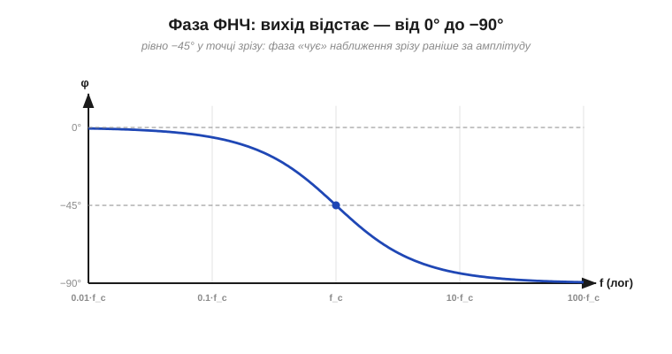
*Рис. 2.4.2.5. Фаза ФНЧ повзе від 0° до −90°, проходячи −45° точно на f_c. Зверніть увагу, яка вона «розлога»: помітний зсув починається вже за декаду до зрізу — фаза відчуває наближення f_c раніше, ніж амплітуда. Саме тому в задачах стійкості (історія Боде!) стежать насамперед за фазою.*

### Дві мови, одне коло

Зведемо найважливіший місток розділу. Те саме RC ми вже досліджували в [§2.1.4](../ch07-capacitor/ch07-capacitor.md) — тоді ми подавали **сходинку** й діставали експоненту зі сталою часу τ = RC. Тепер подали **синуси** — і дістали криву з зрізом f_c = 1/(2πτ). Це не два кола, а два портрети одного:

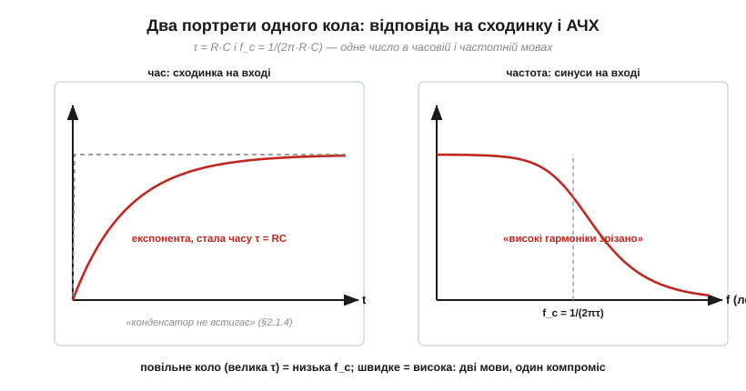
*Рис. 2.4.2.6. Часовий портрет (експонента, τ) і частотний (полиця-спад, f_c) пов'язані жорстко: f_c = 1/(2πτ). «Конденсатор не встигає зарядитися» і «високі гармоніки зрізано» — одне й те саме речення двома мовами. Повільне коло = низький зріз; швидке = високий.*

Практичний наслідок цієї пари: хочете, щоб фільтр пропускав швидші сигнали — мирітеся з тим, що він повільніше встановлюється, і навпаки. Компроміс «швидкість проти гладкості» неминучий, бо це одна ручка — добуток RC.

### Другий фах ФНЧ: добути середнє з імпульсів

У часовій мові в ФНЧ є робота, яку частотна мова описує особливо красиво: **усереднення**. Подайте на фільтр прямокутні імпульси, що повторюються значно швидше за f_c. Зі спектрального погляду ([§2.4.1](r04-frequency-response.md)) такий сигнал — це постійна складова (його середнє значення) плюс гармоніки на частоті повторення й вище. Якщо частота повторення лежить на декаду-дві за зрізом, усі гармоніки глушаться вдесятеро-всотеро, а постійна складова (f = 0 — глибоко на «полиці») проходить незайманою. На виході лишається **середнє** вхідного сигналу з невеликими брижами.

А середнім легко керувати: ширші імпульси — вище середнє, вужчі — нижче. Тож пара «швидкі прямокутні імпульси змінної ширини + RC-ФНЧ» — це найдешевший у світі спосіб зробити з цифрового виходу **керовану постійну напругу**: мікроконтролер вміє лише «нуль» та «одиницю», а після фільтра отримує будь-що між ними. Цей прийом ще зустрінеться нам багато разів у модулях про мікроконтролери й живлення; фундамент його — рівно ця тема: гармоніки за зріз, середнє на полицю.

### Пастка навантаження

Формула K(f) виведена для фільтра, з виходу якого **нічого не тече**. Реальний споживач має власний опір R_L — і він вмикається паралельно конденсатору, стаючи другим плечем дільника:

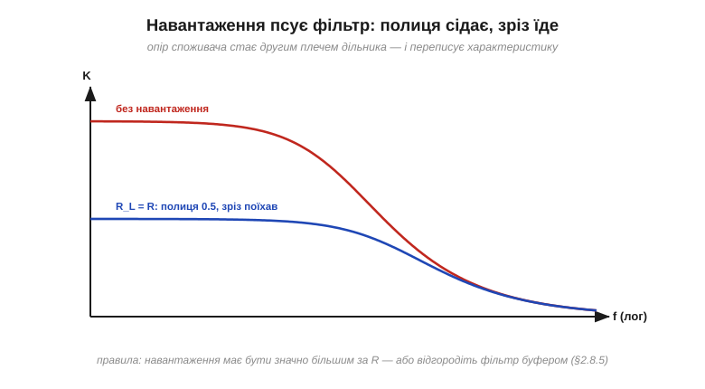
*Рис. 2.4.2.7. З навантаженням R_L = R полиця сідає до 0.5, а зріз їде вгору — характеристика вже не та, яку ви рахували. Правило: опір споживача має бути значно більшим за R фільтра, інакше між ними потрібен буфер.*

Ліки стандартні: або обирати R фільтра в десятки разів меншим за опір навантаження, або відгородити фільтр **повторювачем** ([§2.8.5](../ch13-opamp-comparator/ch13-opamp-comparator.md)) — він бере з фільтра мізерний струм і чесно повторює напругу для будь-якого споживача. Ця сама пастка взаємного навантаження повернеться, щойно ми спробуємо ставити фільтри один за одним.

**Приклад (проєктуємо фільтр під задачу).** Давач видає корисний сигнал до 10 Гц, а на провід наводиться мережева завада 50 Гц. Куди поставити зріз? Спробуємо f_c = 20 Гц:

```
K(10 Гц) = 1/√(1+0.25) ≈ 0.89    (сигнал трохи притиснули)
K(50 Гц) = 1/√(1+6.25) ≈ 0.37    (завада ослабла лише втричі)
```

Слабко. Зсунемо зріз нижче, f_c = 10 Гц: сигнал на краю діапазону отримає чесні 0.707, зате завада — 0.196, уп'ятеро. Краще, але видно межу: **один RC — пологий фільтр**, і коли сигнал із завадою близькі за частотою, доводиться або жертвувати сигналом, або шукати крутіші схеми — про них наприкінці розділу.

> 🔌 **Компонентна вставка:** [RC-фільтр на вході вимірювання](r04-s2-c-input-rc.md). Найтиражніше місце цього кола — між давачем і АЦП: як обрати зріз у чотири числа, чому R затиснутий між опором джерела і примхами входу АЦП, скільки мілісекунд коштує гладкість — і чесне слово про заваду 50 Гц.

> 🔧 **Навіщо це.** RC-ФНЧ — перше, що ставлять між «брудним» світом і чутливим входом: він знімає тремтіння з показів давача, вигладжує прямокутні імпульси в майже постійну напругу, не пускає високочастотне сміття у вимірювальний тракт. Розрахунок завжди той самий, у два рядки: обрати f_c (вище за корисний сигнал, нижче за заваду) і взяти будь-яку пару R·C = 1/(2π·f_c) — з оглядкою лише на навантаження (R значно менший за опір споживача) і на джерело (R значно більший за його вихідний опір). Це найдешевший фільтр у світі — і найчастіше його якраз і досить.

Підсумуймо. RC-ФНЧ — дільник напруги з реактивним нижнім плечем; його характеристика **K(f) = 1/√(1+(f/f_c)²)** повністю задана однією точкою — частотою зрізу **f_c = 1/(2πRC) = 1/(2πτ)**. Нижче зрізу — полиця K ≈ 1, у зрізі — 0.707 і фаза −45°, вище — спад «удесятеро на декаду», який на лог-осях малюється прямою. Часовий і частотний портрети кола жорстко пов'язані через τ, а формули чинні, поки фільтр не навантажено. Тепер дзеркальне питання: а як пропустити **швидке** і зрізати повільне? Поміняймо R і C місцями — і подивимось, що вийде.

---

## 2.4.3 RC-фільтр високих частот

Поміняти в схемі попередньої теми резистор із конденсатором місцями — здавалося б, дрібна перестановка. Але вона перевертає характер кола: тепер воно пропускає **швидке** і глушить повільне, аж до повної заборони постійного струму. І це не лабораторна іграшка-дзеркало: саме це коло, під назвою «розділовий конденсатор», ми вже бачили в [§2.1.6](../ch07-capacitor/ch07-capacitor.md) — ним з'єднана половина каскадів усієї аналогової техніки. Час порахувати його чесно: та сама f_c, дзеркальна крива, нова фаза — і дві суто «ФВЧ-шні» примхи, провисання й вуса, які треба знати в обличчя.

### Схема: конденсатор у шлях, резистор униз

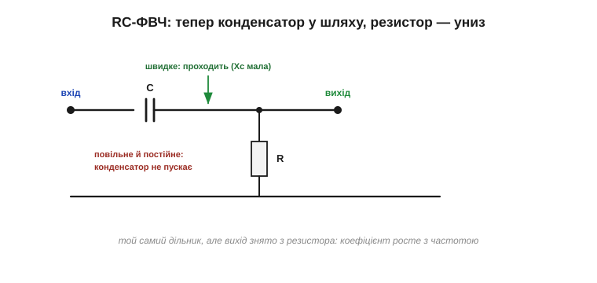
*Рис. 2.4.3.1. **Фільтр верхніх частот** (*high-pass filter*, ФВЧ): сигнал мусить пройти крізь конденсатор, вихід знято з резистора. Для швидких складників Xc мізерна — вони майже не помічають перешкоди; для повільних Xc величезна — до резистора доходять крихти; постійний струм не проходить узагалі.*

Інтуїція — три опорні частоти, як завжди. На високих частотах Xc → 0: конденсатор прозорий, уся вхідна напруга падає на R — K ≈ 1. На низьких Xc → ∞: майже все падає на конденсаторі, виходу дістаються крихти. А при f = 0 — узагалі нічого: це строга, кількісна версія правила «конденсатор блокує постійне» з [§2.1.1](../ch07-capacitor/ch07-capacitor.md).

### Формула: той самий трикутник, інший катет

Виведення коротше, ніж у ФНЧ, бо вся геометрія вже готова. Повний опір послідовного RC — та сама гіпотенуза √(R² + Xc²); різниця лише в тому, **з якого катета** знімаємо вихід:

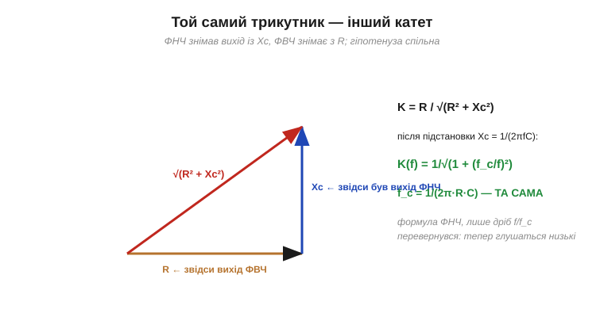
*Рис. 2.4.3.2. ФНЧ ділив на користь Xc, ФВЧ ділить на користь R. Гіпотенуза спільна, частота зрізу — теж: f_c = 1/(2πRC). У формулі лише перевернувся дріб під коренем.*

```
K = R / √(R² + Xc²)        →        K(f) = 1 / √(1 + (f_c/f)²)

f_c = 1/(2π·R·C)   —  та сама, що й у ФНЧ із цих самих деталей
```

Порівняйте з ФНЧ: там під коренем стояло (f/f_c)², тут — (f_c/f)². Один перевернутий дріб — і фільтр дивиться в інший бік. Опорні точки віддзеркалюються разом із ним:

```
f = 0.1·f_c:   K ≈ 0.0995   (удесятеро слабше)
f = f_c:       K ≈ 0.707    (зріз — як завжди)
f = 10·f_c:    K ≈ 0.995    (майже все проходить)
```

### Крива й асимптоти

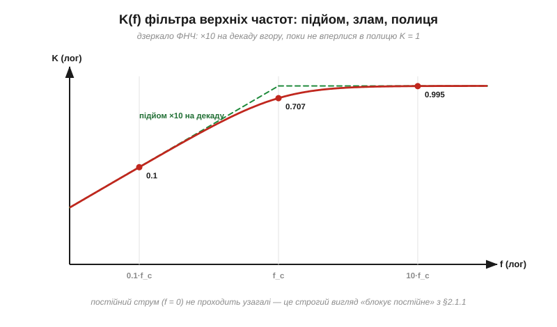
*Рис. 2.4.3.3. На лог-лог осях ФВЧ — це підйом «удесятеро на декаду», що на f_c ламається в полицю K = 1. Дзеркальний ескіз Боде: ті самі дві прямі, той самий злам із реальною кривою на 0.707 — лише похила тепер ліворуч від зламу.*

Асимптоти читаються з формули так само, як у ФНЧ. Далеко вище зрізу (f ≫ f_c) — полиця K ≈ 1. Далеко нижче (f ≪ f_c) — K ≈ f/f_c: амплітуда **пропорційна частоті**, тобто зростає вдесятеро на декаду. Ескіз малюється лінійкою за ті самі десять секунд: похила — злам на f_c — полиця.

### Фаза: вихід попереду

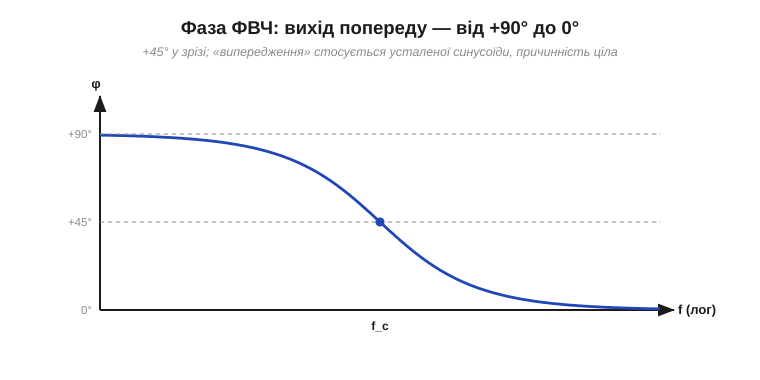
*Рис. 2.4.3.4. Фаза ФВЧ спадає від +90° на наднизьких частотах до 0° на високих, проходячи +45° точно в зрізі. Знак плюс — вихід випереджає вхід: дзеркало запізнення ФНЧ.*

Глибоко в смузі загородження колом командує конденсатор, а його струм випереджає напругу на 90° ([§2.3.4](../ch09-reactance-resonance/ch09-reactance-resonance.md)) — вихід (він же напруга на R, пропорційна струмові) випереджає вхід майже на +90°. У смузі пропускання фаза сходить до нуля, а в зрізі — рівно +45°. Слово «випереджає» не порушує причинності: воно описує усталений зсув між двома нескінченними синусоїдами, а не пророцтво — на реальний стрибок ФВЧ відгукується, як і належить, після стрибка.

### Часова мова: вуса і провисання

А тепер дві фірмові примхи ФВЧ, які найкраще видно в часі. Подамо на вхід меандр, повільний відносно f_c:

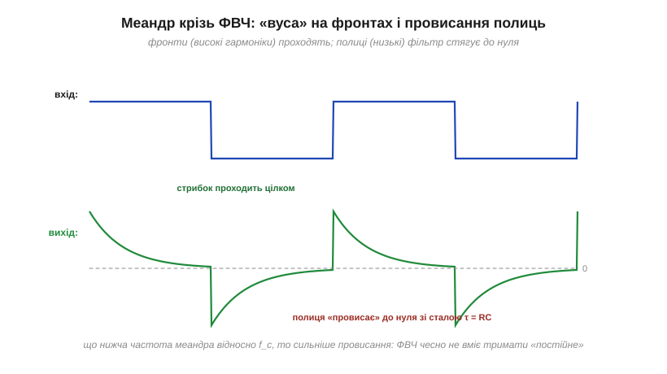
*Рис. 2.4.3.5. Кожен фронт меандра проходить на повну (стрибок — це високі частоти), але полиця, що йде за ним, — це «майже постійне», і фільтр чесно стягує її до нуля з експонентою τ = RC. Виходять загострені «вуса» замість прямокутників.*

Частотна мова каже: фронти зшиті з високих гармонік — проходять; полиці тримаються на низьких — глушаться. Часова мова ([§2.1.4](../ch07-capacitor/ch07-capacitor.md)) каже те саме інакше: стрибок напруги конденсатор передає миттю (заряд не встигає змінитися), а далі резистор розряджає його зі сталою τ — і вихід сповзає до нуля. Звідси два практичні терміни. **Провисання** (*sag, droop*) — полиці довгих імпульсів «стікають» донизу; що нижча частота сигналу відносно f_c, то помітніше. **Вуса** — загострені викиди на фронтах, які лишаються, коли все повільне стекло. До речі, для дуже повільних сигналів ФВЧ працює грубим **диференціатором**: його вихід пропорційний швидкості зміни входу — це знову I = C·dV/dt із [вставки до §2.1.2](../ch07-capacitor/ch07-s2-m-derivative-current.md) у новій ролі.

### Головна служба: розділовий конденсатор

Тепер — місце, де ФВЧ працює мільярдними накладами. У багатокаскадних схемах кожен каскад живе навколо **власного** постійного рівня (робочої точки), і тягти чужу «постійку» до сусіда не можна — вона зіб'є його режим. Розв'язка відома з [§2.1.6](../ch07-capacitor/ch07-capacitor.md): послідовний конденсатор. Але тепер ми бачимо її точніше: конденсатор зв'язку **плюс вхідний опір наступного каскада** — це і є ФВЧ, і в нього є цілком конкретна f_c:

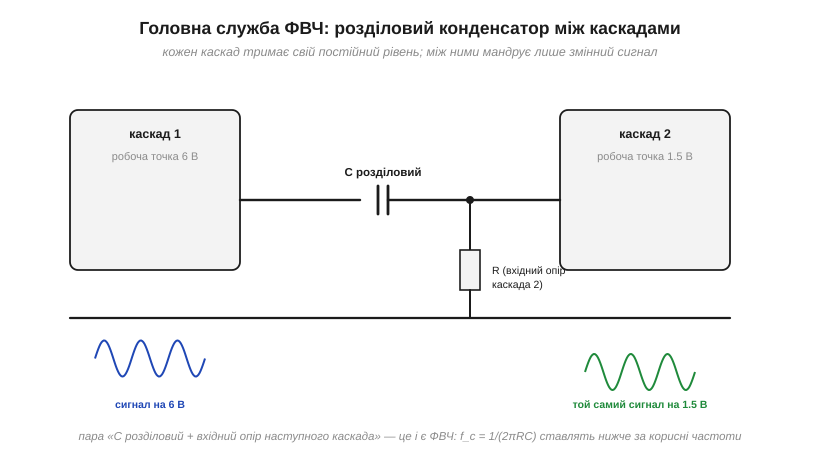
*Рис. 2.4.3.6. Каскади з різними робочими точками обмінюються лише змінним сигналом через розділовий конденсатор. Пара «C + вхідний опір наступного каскада» утворює ФВЧ — його зріз ставлять на декаду нижче за найнижчу корисну частоту, щоб сигнал проходив полицею.*

**Приклад (обираємо розділовий конденсатор).** Аудіотракт має передавати від 20 Гц; вхідний опір наступного каскада R = 10 кОм. Ставимо зріз із запасом у декаду, f_c = 2 Гц:

```
C = 1/(2π·f_c·R) = 1/(2π·2·10⁴) ≈ 8 мкФ   →   беремо 10 мкФ
перевірка: K(20 Гц) = 1/√(1+(2/20)²) ≈ 0.995 — сигнал цілий
```

Чому саме декада запасу, а не «зріз упритул»? По-перше, на f_c сигнал уже втратив 30% амплітуди і набрав +45° фази — для краю робочої смуги це забагато. По-друге, каскадів зазвичай кілька, і їхні ФВЧ **множаться**: три каскади зі зрізом «упритул» дадуть на нижній частоті 0.707³ ≈ 0.35 — утричі менший сигнал і солідний фазовий зсув. Запас у декаду на кожному робить сумарний ефект непомітним.

> 🔌 **Компонентна вставка:** [розділовий конденсатор в аудіотракті](r04-s3-c-coupling-cap.md). Чому біля гнізда навушників стоїть «бочка» на сотні мікрофарад, а між каскадами — дрібниця; звідки «клац» при вмиканні і як його лікують; куди дивиться плюс електроліта в сигнальному шляху — і коли розділовий викидають зовсім (двополярне живлення).

> 🔧 **Навіщо це.** Найвідоміший ФВЧ у вашій лабораторії — кнопка «AC» на вході осцилографа ([§1.6.7](../../block-1-circuits-physics/ch06-schematics-measurement/ch06-schematics-measurement.md)): вона вмикає всередині розділовий конденсатор зі зрізом близько одиниць герців, щоб дивитися на дрібні пульсації поверх великої постійної напруги — наприклад, брижі ±50 мВ на шині 5 В, які в режимі DC потонули б у масштабі. Але пам'ятайте про провисання з Рис. 2.4.3.5: повільний меандр у режимі AC «сповзає» й нахиляється — це не схема несправна, це ваш власний ФВЧ чесно глушить низькі гармоніки. Повільні сигнали дивляться лише в режимі DC.

І зворотний бік тієї самої медалі: через ФВЧ **не можна** передати повільний чи постійний сигнал у принципі — давач температури чи струму, чий корисний сигнал і є «постійкою», крізь розділовий конденсатор просто зникне. Для таких сигналів каскади з'єднують напряму, і це окремий клопіт зміщень, з яким ми зустрінемося в розділі про операційні підсилювачі.

**Приклад (AC-зв'язок власноруч).** Хочемо подивитися пульсації перетворювача (сотні кілогерців, десятки мілівольтів) поверх шини 12 В, а вхід приладу витримує лише ±8 В. Зробимо зовнішній ФВЧ: вхідний опір приладу R = 1 МОм уже є нижнім плечем — лишилося дібрати послідовний конденсатор. Поставимо зріз на 10 Гц:

```
C = 1/(2π·f_c·R) = 1/(2π·10·10⁶) ≈ 16 нФ
постійні 12 В:        заблоковані повністю (f = 0)
пульсації 100 кГц:    K ≈ 1 — проходять полицею, без втрат
```

Шістнадцять нанофарад плівки — і небезпечна для входу «постійка» зникла, а корисні брижі видно в повний зріст.

### Пастки навантаження — дзеркально

У ФНЧ навантаження сідало на конденсатор і псувало полицю; у ФВЧ ролі міняються. **З боку виходу** резистор фільтра сам є навантаженням — його не можна брати безкарно малим: на високих частотах, де конденсатор прозорий, джерело бачить просто R на землю і мусить його тягнути. **З боку входу** вихідний опір джерела додається послідовно з конденсатором — він не зсуває зріз (той задає добуток RC із «нижнім» R), але разом із R утворює дільник і підрізає полицю. Правило те саме, що завжди: R фільтра — значно більший за вихідний опір джерела і значно менший за те, що фільтр має право навантажувати; сумніваєтеся — ставте буфер ([§2.8.5](../ch13-opamp-comparator/ch13-opamp-comparator.md)).

І ще одна служба дзеркальної пари, яку варто знати наперед: у звукових колонках ФВЧ захищає високочастотний динамік-«пищалку» від басів, які його механічно вбили б, а ФНЧ віддає баси великому динаміку. Така пара зветься кросовером, і ми розберемо її окремо наприкінці розділу.

### Дзеркальна таблиця

Обидва фільтри тепер зручно тримати одним записом — відрізняється лише напрямок погляду:

```
                       ФНЧ                          ФВЧ
схема:                 R у шлях, C униз             C у шлях, R униз
K(f):                  1/√(1+(f/f_c)²)              1/√(1+(f_c/f)²)
f_c:                   1/(2πRC)                     1/(2πRC)  (та сама!)
полиця:                нижче f_c                    вище f_c
спад/підйом:           ÷10 на декаду вище f_c       ×10 на декаду нижче f_c
фаза:                  0 → −45° → −90° (відстає)    +90° → +45° → 0 (випереджає)
f = 0:                 проходить                    заборонено
сходинка в часі:       плавний підйом (τ = RC)      «вус» зі спадом (τ = RC)
головна служба:        згладити, усереднити         розділити каскади, зняти DC
```

Підсумуймо дзеркальну пару. ФВЧ — той самий дільник із тією самою **f_c = 1/(2πRC)**, лише вихід знято з резистора: **K(f) = 1/√(1+(f_c/f)²)**, підйом «удесятеро на декаду» до полиці, фаза від +90° до 0° із +45° у зрізі, постійний струм заборонений повністю. У часі це дає провисання полиць і «вуса» на фронтах — ціна, яку платять за відсікання постійного рівня. Головна служба — розділовий конденсатор між каскадами (зріз на декаду нижче робочої смуги) і режим AC осцилографа. Тепер у нас є обидві цеглинки — ФНЧ і ФВЧ — і ескізи їхніх характеристик прямими. Час дати цим прямим, нахилам і рівням загальноприйняту мову, якою підписано кожен графік у кожному даташиті: **децибели**.

---

## 2.4.4 Децибели: чому логарифмічна шкала

Досі ми описували фільтри саморобними словами: «передає 0.707», «глушить удесятеро на декаду», «у тисячу разів». Слова чесні, але індустрія розмовляє інакше: «−3 дБ», «−20 дБ/декаду», «−60 дБ». Децибели лякають новачків — логарифм у побутовій одиниці! — і даремно: це найзручніший винахід інженерної арифметики, який дозволяє рахувати тракти **в умі, стовпчиком**. У цій темі — звідки береться логарифмічна шкала, чому для потужності множник 10, а для напруги 20, таблиця, яку варто знати напам'ять, і навичка переводити дБ у рази без калькулятора.

### Дві причини для логарифма

Перша причина — **діапазони**. Антена ловить наносигнали в нановольти, вихід підсилювача — вольти: дев'ять порядків величини. На лінійній осі такий діапазон зобразити неможливо — усе, крім найбільшого, злипається в нуль:

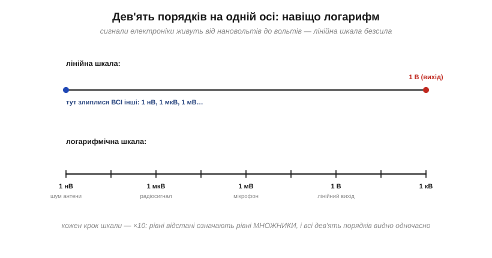
*Рис. 2.4.4.1. На лінійній шкалі від нановольта до вольта видно лише вольт — решта невідрізненна від нуля. Логарифмічна шкала віддає рівні відрізки рівним множникам — і всі дев'ять порядків живуть на одній осі. Саме так ми вже малювали частоту; тепер так само вчинимо з амплітудою.*

Друга причина глибша — **каскади перемножуються**. Сигнал у тракті проходить підсилювач (×100), фільтр (×0.707), кабель (×0.89) — загальний коефіцієнт є добутком. А логарифм перетворює добутки на суми ([§1.3](../../block-1-circuits-physics/ch03-resistance-power-heat/ch03-resistance-power-heat.md) ми вже користувалися цією властивістю, а [історія Боде](r04-history-bode.md) показала, як на ній виросли цілі графічні методи). Інженери просто домовилися міряти коефіцієнти в логарифмічних одиницях — і множення трактів назавжди стало додаванням стовпчиком.

> 🧮 **Математична вставка:** [логарифми — лічильник порядків](r04-s4-m-logarithms.md). Що саме питає log, звідки суперсили «добуток → сума» і «степінь → множник», як із двох чисел (log 2 ≈ 0.301, log 3 ≈ 0.477) зібрати всю драбину децибелів — і чим відрізняються lg, ln та log₂.

### Означення: бел, децибел і потужність

Базова одиниця — **бел** (*bel*): десятковий логарифм відношення **потужностей**. Бел виявився завеликим для щоденних потреб, тож уживають його десяту частину — **децибел** (*decibel*, дБ / dB):

```
G [дБ] = 10 · log₁₀ (P₂ / P₁)
```

Зверніть увагу на головне: децибел — це **відношення**, а не абсолютна величина. «+20 дБ» означає «у сто разів більша потужність, ніж щось»; без указання, ніж *що*, число висить у повітрі.

> 📜 **Історія до теми:** [Бел і «миля стандартного кабелю» — як телефоністи подарували світу децибел](r04-s4-history-decibel.md). Про еталон, яким була котушка дроту в шафі, вимірювальний прилад, яким працювало вухо, множник 10, дібраний заради сумісності зі старими записами, — і чому одиниця носить ім'я людини, яка про неї так і не дізналася.

### Чому для напруг — 20·log

В електроніці частіше міряють не потужності, а **напруги**. І тут з'являється знаменита двійка. Потужність пропорційна квадрату напруги (P = V²/R, [§1.3.6](../../block-1-circuits-physics/ch03-resistance-power-heat/ch03-resistance-power-heat.md)) — тож якщо ми хочемо, щоб ті самі децибели описували ту саму фізичну зміну, квадрат мусить «вийти» з-під логарифма множником два:

```
G [дБ] = 10·log₁₀(V₂²/V₁²) = 20·log₁₀(V₂/V₁)
```

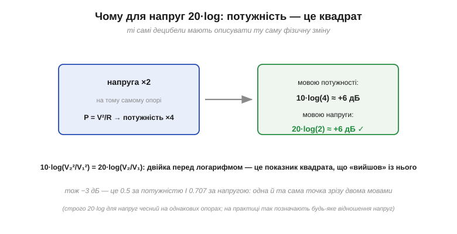
*Рис. 2.4.4.2. Подвоїли напругу на тому самому опорі — потужність зросла вчетверо. Мовою потужності це 10·log(4) ≈ +6 дБ; мовою напруги — 20·log(2) ≈ +6 дБ. Одна фізична зміна — одне число дБ, заради цього й двійка.*

Звідси й розгадка числа з двох попередніх тем: 0.707 за напругою — це 20·log(0.707) = **−3 дБ**, тобто рівно **половина потужності** (10·log(0.5) = −3 дБ). «Точка −3 дБ», «частота зрізу», «половина потужності», «0.707 амплітуди» — чотири імені однієї точки. Дрібний шрифт для чесності: строго кажучи, 20·log для напруг збігається з потужнісними децибелами лише на однакових опорах; на практиці ж конвенція проста — будь-яке відношення напруг позначають 20·log, і всі розуміють однаково.

### Розмовник: дБ ↔ рази

Уся практична сила децибелів — у маленькій таблиці, яку варто завчити як таблицю множення:

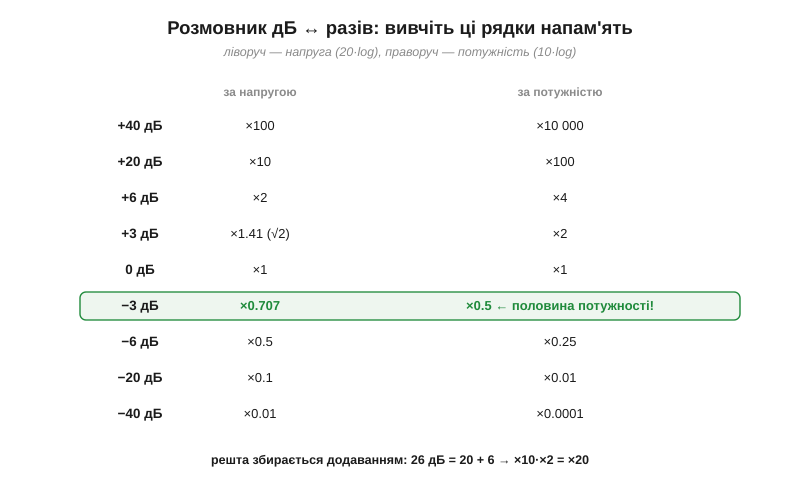
*Рис. 2.4.4.3. Опорні рядки: ±3, ±6, ±20, ±40 дБ. Для напруги +6 дБ — це ×2, +20 дБ — ×10; для потужності ×2 — це вже +3 дБ. Рядок −3 дБ підсвічено недарма: це та сама точка зрізу всіх наших фільтрів.*

А решта значень **збирається додаванням** опорних — у цьому весь трюк усної лічби:

```
+26 дБ = 20 + 6        → ×10 · ×2   = ×20      (за напругою)
+34 дБ = 40 − 6        → ×100 / ×2  = ×50
−43 дБ = −(40 + 3)     → 0.01 / 1.41 ≈ 0.007
```

Хвилина тренування — і ви переводите будь-які дБ у рази швидше, ніж дістаєте калькулятор. У зворотний бік так само: «послабити в 400 разів» = ×100 (40 дБ) · ×4 (12 дБ) = 52 дБ.

А для повної свободи бракує лише дрібних кроків. Запам'ятайте ще два: **1 дБ ≈ ×1.12** (плюс дванадцять відсотків) і **2 дБ ≈ ×1.26**. Тепер розкладається будь-яке число. Скажімо, −47 дБ за напругою:

```
−47 = −40 − 6 − 1   →   0.01 · 0.5 · 0.89 ≈ 0.0045
```

Точна відповідь — 0.00447: усна лічба розійшлася з калькулятором у третьому знаку. Корисний побічний ефект: ви відчуваєте, що **1 дБ — це зміна на ~12%**, на межі того, що взагалі помітно у вимірюванні; тому в специфікаціях допуски на кшталт «±1 дБ» означають «практично точно», а битися за пів децибела має сенс лише там, де їх складаються десятки.

### Бонус: ваше вухо теж рахує в децибелах

Логарифмічна шкала — не лише інженерна зручність: так влаштоване людське сприйняття. Вухо оцінює гучність за **відношенням**, а не за різницею: крок від шепоту до тихої розмови воно чує таким самим, як від розмови до крику, хоча в потужностях ці кроки різняться в тисячі разів. Загальний діапазон слуху — від порога чутності до больового порога — близько **120 дБ**, дванадцять порядків потужності; жодна лінійна шкала такого не вмістить. Саме тому гучність у техніці завжди задають у децибелах, а регулятор гучності робить логарифмічним — щоб рівним поворотам ручки відповідали рівні відчуття. Зустрінете в специфікаціях «дБ SPL» (рівень звукового тиску) чи повзунок мікшера, розмічений у дБ, — це все та сама драбина, якою ми щойно навчилися ходити. Інженери, по суті, лише оформили в одиницю те, що природа давно вбудувала у сприйняття.

Звідси й корисне інженерне поняття — **динамічний діапазон** (*dynamic range*): відношення найбільшого сигналу, який система передає без спотворень, до найменшого, який ще видно над її шумом, у децибелах. У слуху це ~120 дБ, у вінілової платівки — близько 60, у гарного аудіотракту — за 100. Одне число в дБ описує «розмах можливостей» системи так само компактно, як f_c описує її смугу.

### Каскади: рахунок стовпчиком

Тепер головна виплата. Тракт із кількох блоків мовою разів вимагає перемноження дробів; мовою децибелів — додавання цілих чисел:

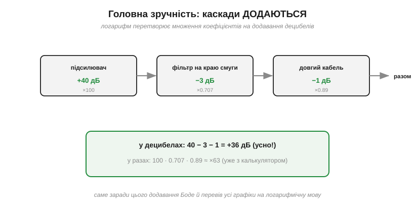
*Рис. 2.4.4.4. Підсилювач +40 дБ, фільтр на краю смуги −3 дБ, кабель −1 дБ: разом +36 дБ — порахували усно. У разах це 100·0.707·0.89 ≈ 63 — уже вправа для калькулятора. На довгих трактах із десятків блоків різниця стає прірвою.*

**Приклад (три каскади зв'язку з §2.4.3).** Ми казали, що три розділові конденсатори зі зрізом «упритул» дають на нижній частоті 0.707³. У децибелах це очевидно без степенів: −3 дБ + (−3 дБ) + (−3 дБ) = **−9 дБ** ≈ ×0.355. Однакові каскади просто множать децибели на свою кількість.

**Приклад (наскільки фільтр глушить заваду).** RC-ФНЧ зі зрізом 1 кГц, завада на 100 кГц — дві декади вище. Нахил −20 дБ/декаду × 2 декади = **−40 дБ** = у 100 разів за напругою. Відповідь отримана без жодної формули — лише ескіз Боде і драбина дБ.

### Нахили дістають імена

Час перепідписати наші асимптоти. «Удесятеро за амплітудою на декаду частоти» — це 20·log(0.1) = **−20 дБ/декаду**; те саме інколи кажуть як −6 дБ/октаву (октава — подвоєння частоти). На осі, розміченій у дБ, навіть вертикаль стає лінійною — рівні децибели займають рівні відрізки, і характеристика фільтра остаточно перетворюється на креслення з прямих:

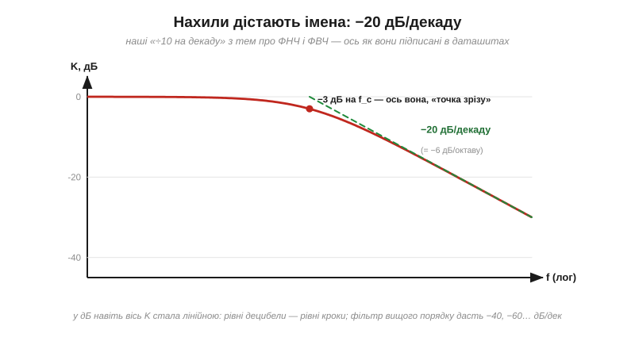
*Рис. 2.4.4.5. Та сама крива ФНЧ із §2.4.2, але вісь K розмічено в дБ: полиця 0 дБ, злам із чесними −3 дБ на f_c, похила −20 дБ/декаду. Це вже повноцінна діаграма Боде — їй лишилося тільки дістати офіційне ім'я в наступній темі. Фільтри вищих порядків даватимуть −40, −60 дБ/декаду.*

### Абсолютна шкала: дБм

Децибел — відношення; але достатньо домовитися про **опорну точку**, і він стає абсолютним рівнем. Найуживаніша опора — один міліват: **дБм** (*dBm*) — це потужність відносно 1 мВт. 0 дБм = 1 мВт, +30 дБм = 1 Вт, −30 дБм = 1 мкВт:

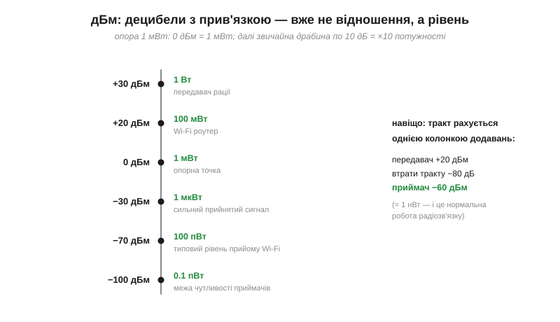
*Рис. 2.4.4.6. Драбина дБм від передавача до межі чутливості приймача — дванадцять порядків потужності на одній колонці. І головна зручність: тракт рахується наскрізним додаванням — рівень у дБм плюс підсилення й втрати в дБ дає рівень у дБм на виході.*

Саме в дБм розмовляє все радіо: «передавач +20 дБм, втрати тракту 80 дБ — на приймачі −60 дБм». Це нановат — і це **нормальна** робота радіозв'язку: дванадцять порядків між переданим і прийнятим, які лінійною мовою неможливо навіть охайно записати. Існують і сусідні опори — дБВ (відносно 1 В), дБмкВ (відносно мікровольта, любить кабельна техніка) — принцип у всіх один: дБ плюс зафіксована опора.

### Пастки

- **Сплутати 10 і 20.** «Удвічі» — це +3 дБ потужності, але +6 дБ напруги. Перш ніж переводити, спитайте себе, про яку величину мова.
- **дБ без опори.** «Сигнал 60 дБ» — шістдесят децибелів *чого відносно чого*? Або це відношення (тоді між чим і чим), або рівень (тоді дБм/дБВ/дБмкВ).
- **Скласти рази замість дБ.** Два каскади по ×10 — це ×100 (+40 дБ), а не ×20. Додаються лише логарифми.
- **Зневажити «якісь −3 дБ».** Це половина потужності — у тепловому розрахунку чи бюджеті радіолінії таке «трохи» важить дуже багато.
- **Шукати 0 на шкалі дБ.** Нульовий сигнал — це −∞ дБ; 0 дБ — це «без змін» (×1). Плутанина між ними — класика перших лабораторних.

> 🔧 **Навіщо це.** Децибели — мова всіх даташитів і вимірювань: смуга підсилювача задана точкою −3 дБ, якість фільтра — децибелами заглушення, шумність тракту — відношенням сигнал/шум у дБ, радіомодулі звітують потужність у дБм. Хто вільно ходить драбиною «3–6–20–40», той читає графік або специфікацію з льоту й рахує тракти в умі — а хто ні, той щоразу спотикається об логарифми. Інвестуйте двадцять хвилин у таблицю з Рис. 2.4.4.3 — вона окупиться сотні разів.

Підсумуймо. Децибел — **логарифмічна міра відношення**: 10·log для потужностей, 20·log для напруг (бо P ∝ V²); −3 дБ = половина потужності = 0.707 напруги — це і є «точка зрізу». Логарифм потрібен двічі: він уміщає величезні діапазони на одну вісь і перетворює множення каскадів на додавання. Опорні рядки драбини (3, 6, 20, 40 дБ) дозволяють рахувати в умі; нахил RC-фільтра відтепер зветься −20 дБ/декаду; а з опорою (дБм) децибели стають абсолютною шкалою рівнів. Усі складники готові — час зібрати їх в офіційний портрет кола, той самий графік з історії розділу: **діаграму Боде**.

---

## 2.4.5 АЧХ і діаграма Боде (−20 дБ/декаду)

Усі цеглинки в нас на руках: поняття частотної характеристики ([§2.4.1](r04-frequency-response.md)), дві базові криві ФНЧ і ФВЧ з їхніми асимптотами ([§2.4.2](r04-frequency-response.md)–[§2.4.3](r04-frequency-response.md)) і децибели, що перетворюють множення на додавання ([§2.4.4](r04-frequency-response.md)). Час скласти з них головний інструмент розділу — той самий графік, заради якого ми розповідали [історію Боде](r04-history-bode.md). У цій темі ми домовимося про офіційний формат, виведемо «алфавіт» із чотирьох елементарних ліній — і навчимося малювати діаграму будь-якого простого тракту за хвилину, а читати чужу (з даташита) — за секунди.

### Офіційний формат: дві панелі

**Діаграма Боде** (*Bode plot*) — це два графіки на спільній логарифмічній осі частоти: зверху **амплітудна** панель (K у децибелах), знизу **фазова** (φ у градусах):

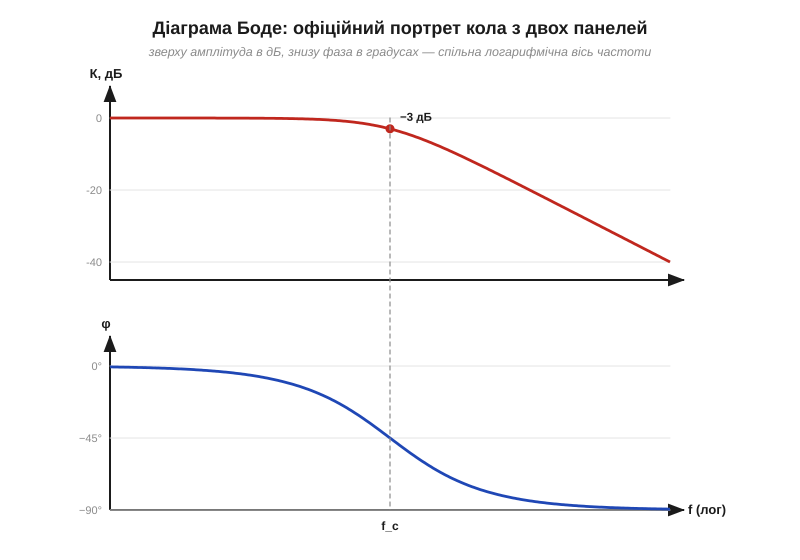
*Рис. 2.4.5.1. Знайомий ФНЧ у паспортному вигляді: амплітуда в дБ із позначкою −3 дБ на зрізі, під нею фаза від 0° до −90° із −45° на тій самій частоті. Дві панелі ділять одну вісь — тож видно, як амплітудні й фазові події відбуваються «в одних і тих самих місцях» осі частот.*

Конвенції прості й жорсткі: частота — завжди лог-вісь у декадах; амплітуда — у дБ (тому вертикаль теж фактично логарифмічна, і криві спрямлюються); фаза — у градусах на лінійній осі. У цьому форматі друкують характеристики всі даташити світу — від операційних підсилювачів до стабілізаторів і фільтрів.

### Алфавіт: чотири елементарні лінії

Сила формату в тому, що складні діаграми **збираються з простих**. У дБ характеристики каскадів додаються ([§2.4.4](r04-frequency-response.md)) — тож досить мати абетку елементарних ліній:

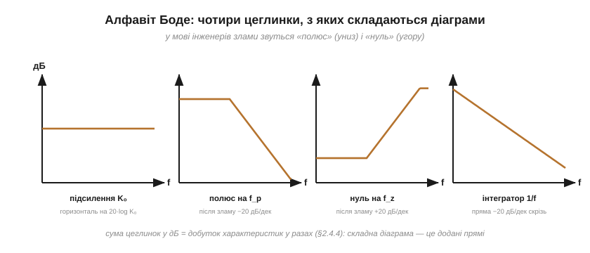
*Рис. 2.4.5.2. Алфавіт: горизонталь чистого підсилення K₀; злам униз (після нього −20 дБ/дек) — інженери звуть його «полюсом»; злам угору (+20 дБ/дек) — «нуль»; і суцільна похила інтегратора чи диференціатора. Будь-який RC/RL-тракт — сума цих ліній.*

Два слова про терміни. Злами діаграми в інженерній мові звуться **полюсами** (*pole* — злам униз, наш ФНЧ-зріз) і **нулями** (*zero* — злам угору). Походять назви з комплексної математики передавальних функцій — для нас поки що це просто стандартні імена зламів, які ви постійно зустрічатимете у фразах на кшталт «полюс на 10 герцах». Кожен полюс додає до нахилу −20 дБ/дек і веде фазу на −90°; кожен нуль — дзеркально.

### Рецепт: малюємо тракт за хвилину

Алгоритм асимптотичного ескізу, успадкований прямо від Боде:

```
1. Випишіть характерні частоти (усі полюси й нулі тракту).
2. Почніть зліва з рівня на найнижчих частотах.
3. Ведіть пряму; на кожному полюсі змінюйте нахил на −20 дБ/дек,
   на кожному нулі — на +20 дБ/дек.
4. Пам'ятайте: реальна крива в кожному зламі на 3 дБ нижча/вища за ескіз.
```

**Приклад (смуговий підсилювач).** Тракт: розділовий конденсатор зі зрізом 20 Гц ([§2.4.3](r04-frequency-response.md)), каскад підсилення ×100 (+40 дБ), і ФНЧ-полюс самих каскадів на 20 кГц. Складаємо три цеглинки:

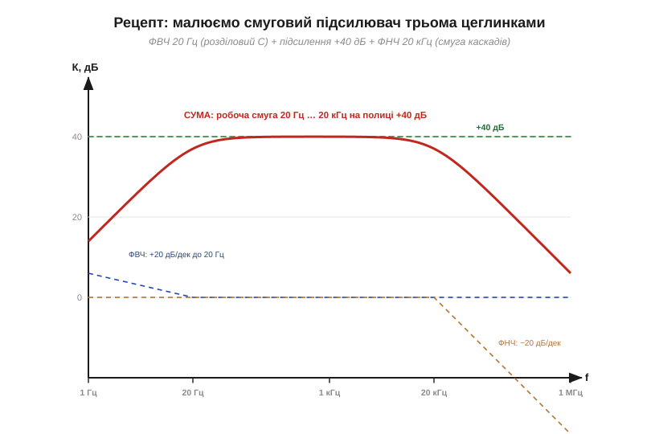
*Рис. 2.4.5.3. Пунктиром — три цеглинки: підйом ФВЧ до 20 Гц, горизонталь +40 дБ, спад ФНЧ після 20 кГц. Суцільна червона — їхня сума: робоча смуга 20 Гц…20 кГц на полиці +40 дБ зі спадами по −20 дБ/дек обабіч. Намальовано лінійкою, без жодного обчислення.*

Саме так виглядає підсилювач звуку в даташиті — і тепер видно, *чому*: його характеристика зобов'язана мати ФВЧ-край (розділові конденсатори не пускають «постійку») і ФНЧ-край (швидкість каскадів скінченна), а між ними — полицю корисної смуги.

### Фазова панель — тим самим рецептом

Фаза збирається з тих самих зламів, лише «розмазаніше»: кожен полюс веде фазу до −90°, причому перехід розтягнутий приблизно на **дві декади** (від f_p/10 до 10·f_p), з точними −45° на самому зламі; нуль — дзеркально до +90°:

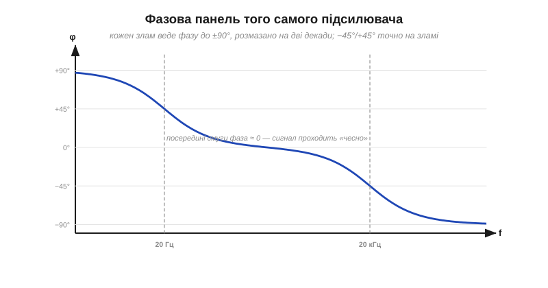
*Рис. 2.4.5.4. Фаза того самого тракту: +90° глибоко внизу (командує розділовий конденсатор), нуль посередині смуги (сигнал проходить «чесно»), і з'їзд до −90° за верхнім зрізом. Зверніть увагу, наскільки заздалегідь фаза «чує» кожен злам — за декаду до нього.*

Ця «далекозорість» фази — не курйоз, а серце інженерії стійкості з [історії Боде](r04-history-bode.md): у петлі зворотного зв'язку саме накопичена фаза вирішує, чи завиє система, і дивитися доводиться не на злам амплітуди, а на фазу за декаду до нього. Ми повернемося до цього впритул у розділі про операційні підсилювачі.

### Тренування: читаємо чужу діаграму

Половина користі Боде — швидке **читання** графіків із даташитів. Спробуйте на типовій криві підсилення операційного підсилювача (його межі ми розбирали в [§2.8.9](../ch13-opamp-comparator/ch13-opamp-comparator.md)):

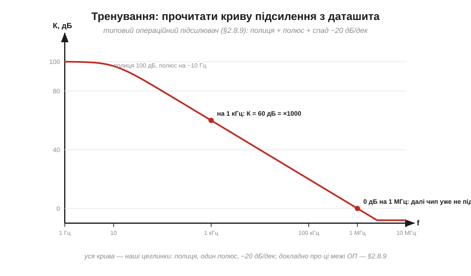
*Рис. 2.4.5.5. Полиця 100 дБ (×100 000) до полюса на ~10 Гц, далі рівний спад −20 дБ/дек. Читаємо з графіка: на 1 кГц лишилося 60 дБ (×1000); на 1 МГц крива перетинає 0 дБ — вище цієї частоти чип уже нічого не підсилює. Дві відповіді — два погляди на пряму.*

Зверніть увагу, як швидко це робиться: знайти полицю, знайти злам, повести пальцем по −20 дБ/дек — і ви знаєте підсилення на будь-якій частоті без жодної формули. Саме ця швидкість і зробила формат безсмертним.

> ⚙️ **Алгоритмічна вставка:** [зняти АЧХ власноруч](r04-s5-a-bode-measurement.md). Прочитали чужу діаграму — намалюйте власну: генератор + два канали (щоб примхи генератора скоротилися), лог-кроки частоти, очікування встановлення біля резонансів, перевід у дБ і звірка з асимптотами — плюс варіанти зі звуковою картою та мікроконтролером.

### Що буде за другим порядком

Усе намальоване досі — кола **першого порядку**: один накопичувач енергії, один полюс, −20 дБ/дек. Поставте поряд котушку й конденсатор — і полюси з'являться **парою**: спад стане −40 дБ/дек, а біля частоти Томсона може вирости резонансний пік, висота якого задається добротністю ([§2.3.6](../ch09-reactance-resonance/ch09-reactance-resonance.md)):

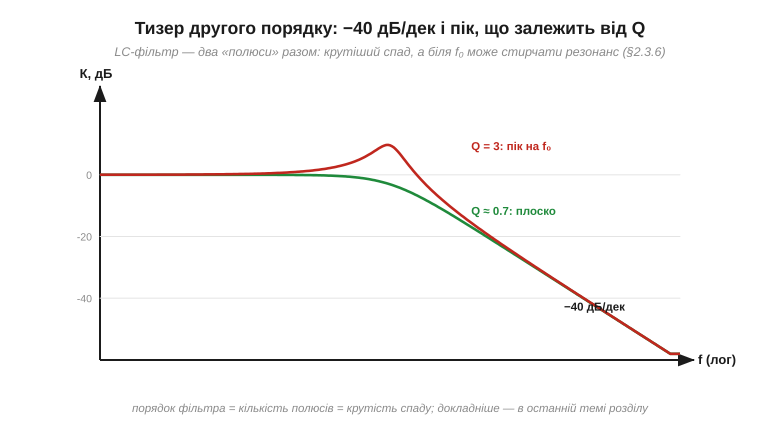
*Рис. 2.4.5.6. ФНЧ другого порядку: за Q ≈ 0.7 характеристика плоска й чемна, за Q = 3 — пік на f₀ перед спадом. Нахил після зрізу — уже −40 дБ/дек: два полюси працюють разом. Порядок фільтра = кількість полюсів = крутість спаду; докладніше — в останній темі розділу.*

### Пастки

- **Прочитати лог-вісь як лінійну.** Середина між «1 кГц» і «10 кГц» на діаграмі — це ≈3 кГц, а не 5.5; відстані міряються множниками.
- **Сплутати ескіз із кривою.** Асимптоти брешуть найбільше в зламах — рівно на 3 дБ для одиночного полюса; для пари полюсів із високою Q реальна крива може стирчати над ескізом на десятки дБ (Рис. 2.4.5.6).
- **Ігнорувати фазову панель.** Для фільтра вона другорядна, для петлі зворотного зв'язку — головна; звичка дивитися на обидві панелі окупиться в темах про підсилювачі.
- **Забути, що це портрет лінійного усталеного режиму.** Перевантажений каскад чи перехідний процес діаграма не описує ([§2.4.1](r04-frequency-response.md) про межі).

> 🔧 **Навіщо це.** Діаграма Боде — це «рідна мова» аналогової документації: характеристики ОП, стабілізаторів, фільтрів, датчиків друкують саме так. Уміння за хвилину накидати ескіз свого тракту (цеглинки → сума) і за секунди прочитати чужий графік (полиця → злами → нахили) — навичка, що перетворює сторінку даташита з орнаменту на відповіді. А коли дійдемо до зворотного зв'язку, ця сама діаграма стане інструментом безпеки — як і замислював її автор.

Підсумуймо. Діаграма Боде — **двопанельний портрет** кола: амплітуда в дБ і фаза в градусах на спільній лог-осі частоти. Вона збирається з алфавіту простих ліній — підсилення-горизонталь, полюс (злам на −20 дБ/дек, фаза до −90°), нуль (дзеркально), похила інтегратора, — бо в децибелах каскади додаються. Ескіз малюється лінійкою за рецептом «рівень зліва → злами → нахили», з поправкою −3 дБ у зламах; другий порядок дає −40 дБ/дек і пік, керований добротністю. Лишилося формалізувати головне слово, яким описують придатність кола до роботи: **смугу пропускання** і її межу — точку −3 дБ.

---

## 2.4.6 Смуга пропускання й точка −3 дБ

«Осцилограф 100 МГц», «підсилювач 20 Гц – 20 кГц», «давач зі смугою 1 кГц» — жодна характеристика не трапляється в описах техніки частіше, ніж **смуга**. Інтуїтивно все ясно: це діапазон частот, які система «тягне». Але інтуїції замало, коли треба порівняти два даташити, вибрати прилад для вимірювання чи зрозуміти, чому тракт із трьох гарних каскадів раптом «не тягне» те, що тягнув кожен окремо. У цій темі ми зробимо смугу точним числом, з'ясуємо, що відбувається на її краях, — і виведемо два правила, якими інженери користуються щодня: зв'язок смуги з найкрутішим фронтом і звуження смуги в каскадах.

### Означення: −3 дБ від полиці

**Смуга пропускання** (*bandwidth*, BW) — це діапазон частот, у якому передача кола не падає більш ніж на **3 дБ** від рівня полиці (максимуму). Межі діапазону — знайомі нам точки зрізу:

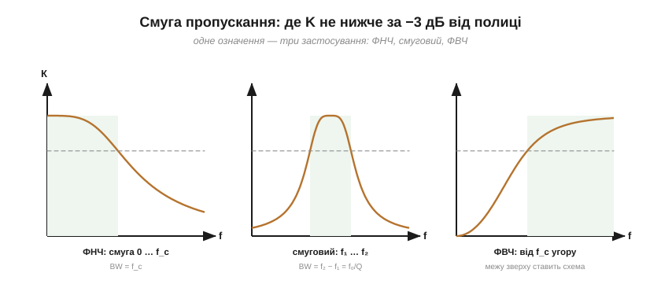
*Рис. 2.4.6.1. Одне означення на всі випадки. У ФНЧ смуга тягнеться від нуля до f_c, тож BW = f_c. У смугового — між двома точками −3 дБ: BW = f₂ − f₁. У ФВЧ смуга йде від f_c «угору» — реальну верхню межу ставлять інші частини схеми.*

Чому межею обрано саме −3 дБ, ми вже знаємо з [§2.4.4](r04-frequency-response.md): це **половина потужності** — точка енергетично однозначна й зручно прив'язана до зламу асимптот. Але чесність вимагає сказати: це **конвенція**. У відеотехніці інколи означують смугу за −6 дБ, у прецизійних трактах — за −1 дБ чи −0.1 дБ («плоска» смуга). Тож перше правило даташит-грамотності: порівнюючи смуги, перевірте, *за яким рівнем* їх означено.

> 🧮 **Математична вставка:** [чому −3 дБ — це половина потужності й 0.707 амплітуди](r04-s6-m-half-power.md). Звідки точно 1/√2, чому 10·log(½) і 20·log(0.707) — одне число, Піфагорів доказ, що фільтр на f_c віддає рівно половину, — і чим ця точка заслужила роль межі смуги.

**Приклад (що насправді каже «смуга 1 МГц»).** Однополюсний підсилювач зі смугою 1 МГц:

```
на 1 МГц:   −3 дБ   → 0.707 амплітуди (і фаза вже −45°!)
на 2 МГц:   −7 дБ   → 0.45
на 10 МГц:  −20 дБ  → 0.1
```

«Смуга 1 МГц» не означає «до 1 МГц все ідеально, далі нічого»: на самому краю сигнал уже втратив 30% і чверть оберту фази, а за краєм згасає поступово. Тому **робочий діапазон** беруть із запасом усередині смуги — зазвичай у 3–5 разів вужчим.

### Смуга ↔ швидкість: t_r ≈ 0.35/BW

Найкорисніший наслідок означення — місток до часу, продовження пари «τ ↔ f_c» із [§2.4.2](r04-frequency-response.md). Система з обмеженою смугою не вміє робити скільки завгодно крутих фронтів: її **час наростання** (*rise time*, від 10% до 90% сходинки) жорстко прив'язаний до смуги:

```
t_r ≈ 0.35 / BW        (для одного полюса; звідки 0.35 — у вставці до теми)
```

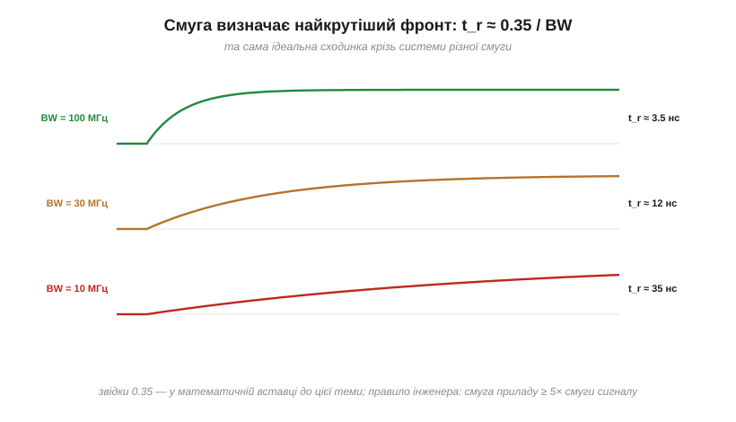
*Рис. 2.4.6.2. Та сама ідеальна сходинка після систем зі смугою 100, 30 і 10 МГц: фронти 3.5, 12 і 35 нс. Система не може показати фронт, коротший за власний t_r, — вона показує свій.*

**Приклад (вибір осцилографа).** Осцилограф зі смугою 100 МГц має власний t_r ≈ 3.5 нс. Подайте йому фронт 2 нс — і він намалює ≈4 нс: ви побачите **його** швидкість, а не сигналу. Звідси інженерне правило **5×**: смуга вимірювального приладу має бути щонайменше вп'ятеро ширшою за смугу сигналу — тоді внесок приладу в побачений фронт стає незначним.

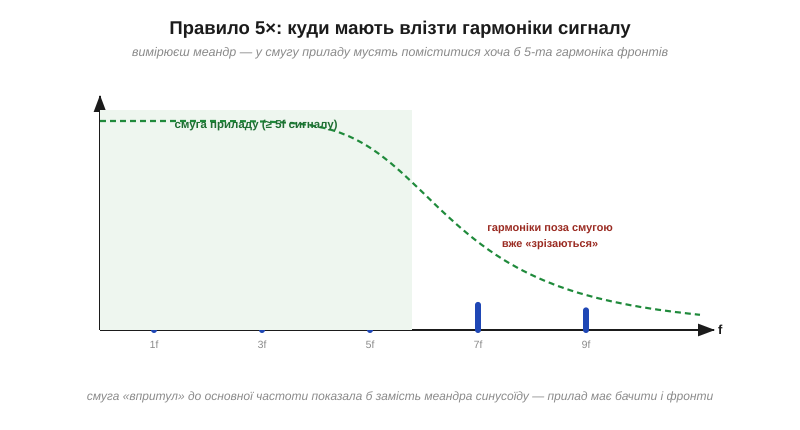
*Рис. 2.4.6.3. Той самий зміст спектральною мовою (§2.4.1): форму меандра тримають непарні гармоніки, і прилад мусить пропустити хоча б п'яту. Смуга «впритул» до основної частоти показала б замість прямокутника синусоїду.*

> 🧮 **Математична вставка:** [фронт і смуга — звідки t_r ≈ 0.35/BW](r04-s6-m-risetime-bandwidth.md). Виведення в чотири рядки (0.35 — це ln 9/2π), чому фронт міряють між 10% і 90%, «Піфагор у часі» для каскадів із прикладом віднімання фронту осцилографа — і коли коефіцієнт чесніше брати 0.45.

### Каскади: смуга стискається

Другий щоденний наслідок. Поставимо два однакові каскади послідовно — кожен зі своєю смугою BW. На старій частоті зрізу кожен дає −3 дБ, разом — **−6 дБ** ([§2.4.4](r04-frequency-response.md): децибели додаються). А сумарна точка −3 дБ переїжджає туди, де кожен каскад втрачає лише по 1.5 дБ — **ліворуч**:

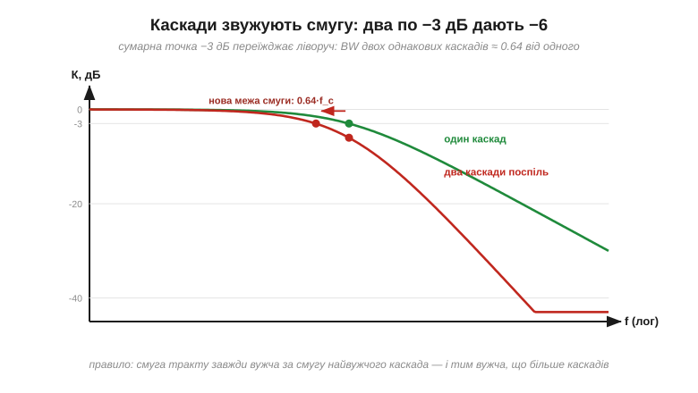
*Рис. 2.4.6.4. Один каскад проти двох таких самих: на старій f_c тепер −6 дБ, а нова межа смуги — приблизно 0.64·f_c. Три каскади дали б ≈0.51·f_c. Смуга тракту завжди вужча за смугу найвужчого каскада.*

Число для пам'яті: **два однакові однополюсні каскади мають смугу ≈ 0.64** від одиночної; три — ≈ 0.51. Ця сама арифметика працює і в часі (через t_r ≈ 0.35/BW): часи наростання каскадів складаються приблизно як корінь із суми квадратів — t_r(тракту) = √(t_r₁² + t_r₂² + …). Саме за цією формулою, до речі, «віднімають» власний фронт осцилографа з виміряного.

**Приклад (чому тракт «не тягне»).** Три підсилювальні каскади, кожен зі смугою 1 МГц, складені в тракт: сумарна смуга ≈ 0.51 МГц — удвічі менша, ніж у кожного! А виміряний фронт замість 0.35 мкс одного каскада стане √3·0.35 ≈ 0.61 мкс. Проєктуючи каскадний тракт, кожен каскад беруть зі смугою з **запасом** відносно вимог до цілого.

### Смуговий фільтр: BW = f₀/Q

Для смугового фільтра означення через −3 дБ замикає коло з [Розділом 2.3](../ch09-reactance-resonance/ch09-reactance-resonance.md): ширина між точками −3 дБ — це рівно та сама Δf з означення добротності, тож

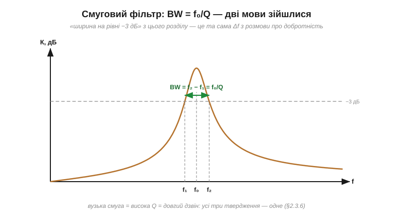
*Рис. 2.4.6.5. Резонансний пік мовою цього розділу: центральна частота f₀, межі f₁ і f₂ на рівні −3 дБ, і ширина BW = f₀/Q. «Вузька смуга», «висока добротність» і «довгий дзвін» — три формулювання однієї властивості.*

```
BW = f₀ / Q
```

Контур приймача з [вставки про Q](../ch09-reactance-resonance/ch09-s6-m-q-factor.md) — f₀ = 1.59 МГц, Q = 100 — мовою цієї теми має смугу 16 кГц: рівно стільки, скільки потрібно одній АМ-станції. Дві мови розділів 2.3 і 2.4 виявилися однією.

### Смуга і шум

Ще одна причина не брати смугу «із запасом про всяк випадок»: разом із корисними частотами в систему заходить **шум** — і кожен зайвий герц смуги приносить свою частку. Удвічі ширша смуга — приблизно вдвічі більша потужність зібраного шуму при тому самому сигналі. Тому правильна смуга — це **точно під сигнал плюс розумний запас**, а не «якнайширше»: вузька смуга — найдешевший фільтр шуму, який існує. Фізику самого шуму ми розбиратимемо окремо; для цієї теми досить принципу.

### Пастки

- **«Смуга N» ≠ «до N усе ідеально».** На краю смуги вже −3 дБ і ±45° фази; робочий діапазон — усередині з запасом.
- **Порівняння смуг із різних означень.** −3 дБ проти −6 дБ проти «плоскої» — це різні числа для тієї самої залізяки.
- **Забутий каскадний ефект.** Тракт завжди вужчий за найвужчий каскад; множте 0.64/0.51 або складайте t_r квадратично.
- **Вимірювання «впритул».** Прилад зі смугою, рівною сигналу, показує себе, а не сигнал — правило 5×.
- **Гонитва за широкою смугою без потреби.** Зайва смуга — це зайвий шум і зайва чутливість до завад.

> 🔧 **Навіщо це.** Смуга — перше число, яке ви звіряєте між вимогою і даташитом: чи «бачить» осцилограф ваші фронти (t_r ≈ 0.35/BW і правило 5×), чи пройде сигнал давача крізь тракт, скільки каскадів можна скласти, не задушивши смугу. І навпаки — навмисне **звуження** смуги до потреб сигналу: найперший і найдешевший спосіб виграти в шумі. Пара формул цієї теми — 0.35/BW і f₀/Q — входить до десятки найуживаніших оцінок «на серветці» в усій електроніці.

Підсумуймо. **Смуга пропускання** — діапазон, де передача не падає більш як на 3 дБ від полиці (половина потужності); для ФНЧ це 0…f_c, для смугового — f₂−f₁ = **f₀/Q**. Смуга жорстко зв'язана зі швидкістю: **t_r ≈ 0.35/BW**, і система не показує фронтів, коротших за власний. Каскади звужують смугу (два однакові — до 0.64), а часи наростання складаються квадратично. Смугу обирають під сигнал із запасом — але не ширшою, бо кожен герц приносить шум. Лишився останній крок розділу: що робити, коли пологих −20 дБ/декаду одного RC не досить, — фільтри з котушками, резонансом і вищими порядками.

---

## 2.4.7 LC- і RLC-фільтри; порядок фільтра

Подивімося чесно на наш RC-фільтр. Його спад −20 дБ/декаду означає: щоб заглушити заваду в сто разів, вона мусить лежати на **дві декади** вище зрізу. А якщо завада сидить упритул до сигналу? Корисна смуга давача — до 1 кГц, а поряд на платі імпульсний перетворювач сипле завадою на 5 кГц. RC зі зрізом 1 кГц дасть на 5 кГц лише −14 дБ — завада поменшає вп'ятеро, але нікуди не зникне. Хочеться спаду крутішого — не пологого схилу, а урвища. У цій темі — чому «ще один RC» тут не рятує, як котушка подвоює крутість, що таке **порядок фільтра**, хто керує характером коліна — і чому пасивні LC-фільтри вимагають поваги до опорів навколо себе.

### «Ще один RC»? Коліно м'якшає, а не гострішає

Перша думка очевидна: один RC дає −20 дБ/дек, то поставимо два поспіль — буде −40! Далекий спад справді стане −40 дБ/дек. Але подивіться, що коїться біля коліна:

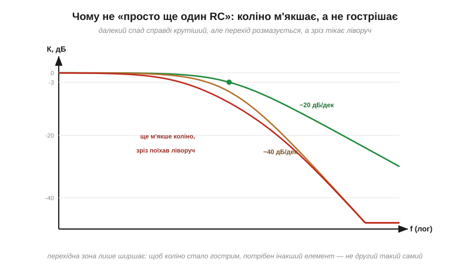
*Рис. 2.4.7.1. Один RC (зелена) проти двох. Два каскади з буфером між ними (мідна) дають −40 дБ/дек удалині — але коліно подвійно м'яке: на старому зрізі вже −6 дБ. Два RC впритул (червона) ще гірші: каскади навантажують один одного, полиця провисає, зріз тікає ліворуч.*

Біди дві. Якщо з'єднати дві RC-ланки напряму, друга стає навантаженням для першої — а ми ще з [§2.4.2](r04-frequency-response.md) знаємо, що навантажений дільник бреше: коліно розповзається, зріз їде. Буфер між ланками ([§2.8.5](../ch13-opamp-comparator/ch13-opamp-comparator.md)) лікує навантаження — але не другу біду: кожна ланка чесно додає свої −3 дБ у зрізі, разом −6 дБ, і сумарна точка −3 дБ переїжджає вглиб смуги — те саме звуження до 0.64·f_c, яке ми порахували в [§2.4.6](r04-frequency-response.md). Перехідна зона між «пропускаю» і «глушу» не звузилася — вона **поширшала**. Точну арифметику цього ефекту розбирає математична вставка до цієї теми; висновок же простий: складаючи однакові м'які коліна, гострого не збудуєш. Потрібен елемент з **іншим характером** — і він у нас давно є.

> 🧮 **Математична вставка:** [каскадування фільтрів — чому два RC впритул не «двічі один RC»](r04-s7-m-cascading.md). Взаємне навантаження однією літерою (знаменник z²+3z+1 проти z²+2z+1), зріз, що з'їжджає до 0.37·f_c, чому пасивні RC не дають Q вище 0.5 — і правило «кожна наступна ланка вдесятеро високоомніша», що рятує без буфера.

### Котушка входить у гру: LC-фільтр

Згадаймо ролі. Конденсатор у ФНЧ стоїть **поперек** шляху — додолу, на землю: його X_C = 1/(2πfC) падає з частотою, і швидкі сигнали він зливає. А котушка просилася б у **сам шлях**: її X_L = 2πfL із частотою росте ([§2.3.3](../ch09-reactance-resonance/ch09-reactance-resonance.md)) — для повільного вона прозорий дріт, для швидкого — стіна. Поставимо обидві:

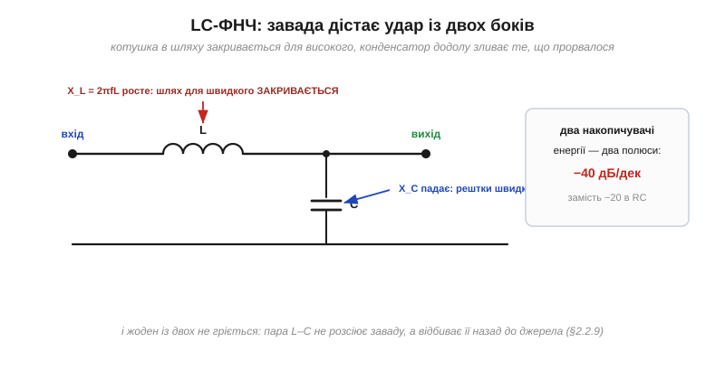
*Рис. 2.4.7.2. LC-фільтр низьких частот. Завада дістає удар із двох боків: котушка закриває їй шлях (X_L росте), а те, що просочилося, конденсатор зливає в землю (X_C падає). Два накопичувачі енергії — два полюси — −40 дБ/дек.*

Тепер із частотою працюють **обидва** плеча дільника, і то в протилежні боки: верхнє росте, нижнє падає. Вище зрізу передача падає не як 1/f, а як 1/f² — рівно **−40 дБ/декаду**, удвічі крутіше за RC, тими самими двома деталями:

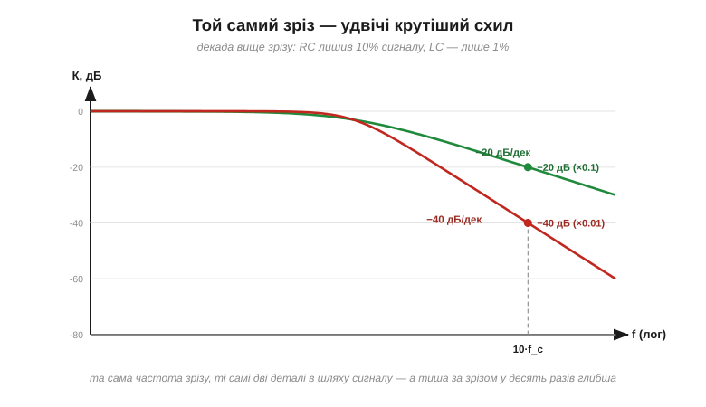
*Рис. 2.4.7.3. Той самий f_c, а схили різні: декадою вище зрізу RC лишає 10% сигналу, LC — 1%. Наша завада на 5 кГц при зрізі 1 кГц дістала б від LC −28 дБ замість −14: уже не «вп'ятеро менше», а «у двадцять п'ять разів».*

Звідки саме −40, видно з того самого дільника, яким ми рахували RC у [§2.4.2](r04-frequency-response.md). Глибоко вище зрізу передача — це просто відношення нижнього плеча до верхнього:

```
K ≈ X_C / X_L = (1/(2πfC)) / (2πfL) = 1 / ((2πf)²·L·C)
```

Частота сидить у знаменнику **в квадраті** — бо тепер вона працює двічі, в обох плечах. Подвоїли f — передача впала вчетверо (−12 дБ/октаву); удесятерили — впала в сто разів (−40 дБ/дек). А де злам? Там, де плечі рівні: X_L = X_C — але ж це точнісінько умова резонансу з [§2.3.5](../ch09-reactance-resonance/ch09-reactance-resonance.md)! Зріз LC-фільтра — це **частота Томсона** його власної пари, f₀ = 1/(2π√(LC)): стара формула знайшла ще одну службу.

І ще одна принципова відмінність, знайома з розмови про ферити ([§2.2.9](../ch08-inductor/ch08-inductor.md)). Резистор RC-фільтра глушить заваду, **спалюючи** її в тепло. Ідеальна пара L–C не розсіює нічого: на частотах завади фільтр просто стає для джерела нездоланним бар'єром і **відбиває** її назад. Тому LC — природний вибір силових кіл: проганяти ампери живлення крізь резистор означало б гріти його дарма, а котушка пропускає постійний струм майже задурно — π-фільтр живлення з [вставки §2.3.3](../ch09-reactance-resonance/ch09-s3-c-lc-supply-filter.md) побудований саме на цьому.

### Порядок фільтра: рахуємо накопичувачі

Час дати імення тому, що ми щойно зробили. **Порядок фільтра** (*filter order*) — це кількість незалежних накопичувачів енергії в ньому: кожен конденсатор і кожна котушка, що працюють самостійно, додають один полюс ([§2.4.5](r04-frequency-response.md)) — і свої −20 дБ/дек до далекого спаду:

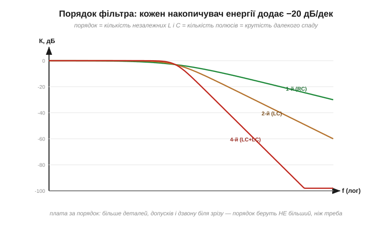
*Рис. 2.4.7.4. Порядок = кількість незалежних L і C = кількість полюсів. RC — перший порядок, LC — другий, дві LC-ланки — четвертий: −80 дБ/дек, за декаду від зрізу завада тоншає в десять тисяч разів. Фаза теж множиться: кожен полюс докручує свої −90°.*

Звідси робочий рецепт вибору. Порахуйте, **скільки** дБ заглушення треба і **на якій відстані** (у декадах) від зрізу сидить завада — і поділіть одне на одне:

```
сигнал до 1 кГц, завада на 100 кГц (2 декади), треба −80 дБ:
   80 дБ / 2 декади = 40 дБ/дек  →  досить 2-го порядку (одна LC-ланка)

та сама завада на 10 кГц (1 декада):
   80 дБ / 1 декада = 80 дБ/дек  →  потрібен 4-й порядок
```

**Приклад (ШІМ стає напругою).** Класична задача вбудованої електроніки: мікроконтролер не має аналогового виходу, але вміє ШІМ — прямокутник 50 кГц зі змінною шпаруватістю, чиє середнє і є бажаною напругою. Треба лишити середнє, а 50-кілогерцеву «пилку» прибрати до часток відсотка. Перший порядок упорається: RC зі зрізом 100 Гц — це 2.7 декади відстані, −54 дБ, пульсації ≈ 0.2%. Але ціна — повільність: τ = 1.6 мс, і на новий рівень вихід виповзатиме мілісекундами ([§2.4.2](r04-frequency-response.md): зріз і швидкість зв'язані жорстко). LC другого порядку зі зрізом 1 кГц дає ті самі ≈ −68 дБ на 50 кГц — але реагує на зміну завдання **вдесятеро швидше**. Крутіший схил дозволив поставити зріз ближче до завади, не жертвуючи заглушенням: ось навіщо платять за порядок.

Що ближче завада до сигналу, то крутіший потрібен схил — і то вищий порядок. А чому б тоді одразу не десятий? Бо порядок не безплатний: більше деталей — більше допусків (характеристика «розпливається» від екземпляра до екземпляра), котушки громіздкі й недешеві, а біля зрізу високий порядок схильний дзвеніти на фронтах і тягне за собою чималу фазову затримку. Інженерне правило незмінне: порядок беруть **мінімальний достатній**, а не «із запасом про всяк випадок».

### Біля коліна: повертається добротність

Далекий схил задає порядок. А от **характер коліна** — те, що відбувається в околиці зрізу, — задає інше, і тут на сцену повертається стара знайома. Пара L–C — це ж резонансний контур ([§2.3.5](../ch09-reactance-resonance/ch09-reactance-resonance.md))! Поблизу його f₀ реактивності гасяться, і фільтр може не послабити, а **підсилити** — наскільки, вирішує добротність Q, тобто опір, що демпфує контур: вихідний опір джерела, навантаження, втрати самої котушки.

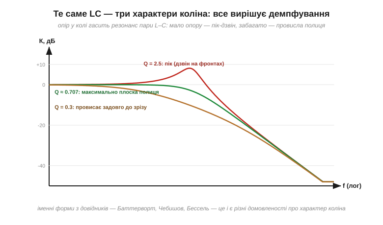
*Рис. 2.4.7.5. Те саме LC, різне демпфування. Мало опору (Q = 2.5) — пік на зрізі й дзвін на кожному фронті; Q ≈ 0.707 — максимально плоска полиця без піка; забагато демпфування (Q = 0.3) — полиця провисає задовго до зрізу. Порядок задає схил, добротність — коліно.*

Саме звідси ростуть «іменні» характеристики, які ви зустрінете в довідниках і калькуляторах фільтрів: **Баттерворт** — максимально плоска полиця (та сама Q ≈ 0.707 для другого порядку); **Чебишов** — дозволяє дрібні хвильки в полиці, вигадуючи за це крутіше коліно; **Бессель** — жертвує крутістю заради найчеснішої фази, щоб фронти проходили без дзвону (чому фаза псує форму — ми бачили в [§2.4.1](r04-frequency-response.md)). Підкреслимо: це не різні схеми, а різні **домовленості про компроміс**, утілені добором номіналів тієї самої драбинки L і C. Глибше в їхню математику ми не підемо — для практики досить знати, що між «плоско», «круто» і «без дзвону» доводиться обирати.

### π і Т: ті самі цеглинки, складені інакше

Драбинку LC можна почати з котушки, а можна з конденсатора — так народжуються дві класичні топології:

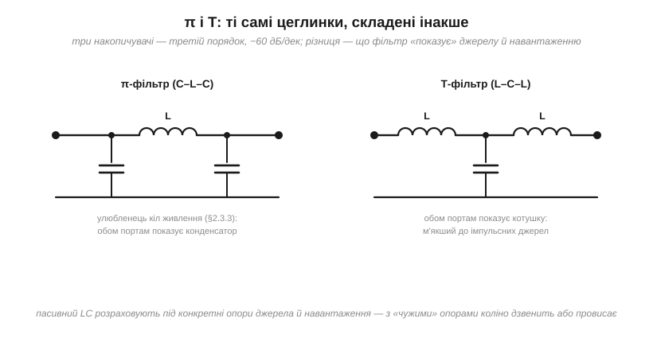
*Рис. 2.4.7.6. π-фільтр (C–L–C) і Т-фільтр (L–C–L): по три накопичувачі — третій порядок, −60 дБ/дек. Різниця — у тому, що фільтр «показує» сусідам: π зустрічає обидва порти конденсатором (улюбленець кіл живлення), Т — котушкою.*

І тут саме місце для головної чесності про пасивні LC-фільтри: їх **розраховують під конкретні опори** джерела і навантаження. Класична радіотехніка недарма стандартизувала свої 50 Ом: усі таблиці й калькулятори фільтрів питають «опір джерела? опір навантаження?» — бо саме ці опори демпфують резонанси ланок і формують те саме коліно з Рис. 2.4.7.5. Постав готовий фільтр у коло з «чужими» опорами — і акуратний Баттерворт обернеться на горбатого Чебишова, якого ніхто не замовляв. Найпідступніший випадок — **холостий хід**: LC-ФНЧ без навантаження ніщо не демпфує, і біля f₀ він може віддати на виході *більше*, ніж на вході. У колі живлення це сюрприз із розряду неприємних: «фільтр» сам зробив викид напруги.

### Коли котушка небажана

Чому ж тоді не всі фільтри — LC? Бо в котушки є своя ціна, знайома з [§2.2.7](../ch08-inductor/ch08-inductor.md): на низьких частотах (звук, сигнали давачів) потрібні великі індуктивності — а це габарити, гроші, опір обмотки й антена для наведень. Тому в сигнальних колах нижче сотень кілогерців світ давно пішов іншим шляхом: **активні фільтри** — операційний підсилювач плюс кілька RC, які разом поводяться як фільтр високого порядку без жодної котушки. Усі складники в нас уже є ([Розділ 2.8](../ch13-opamp-comparator/ch13-opamp-comparator.md)), а самі схеми чекають попереду. Ще далі — у цифровому світі — фільтр узагалі стає програмою, що рахує над відліками сигналу. А пасивний LC лишається беззмінним королем там, де течуть великі струми чи літають високі частоти: фільтри живлення, радіотракти, виходи підсилювачів класу D — і кросовер у звуковій колонці, де пара ФНЧ+ФВЧ другого порядку ділить музику між басовиком і пищалкою; його ми розберемо в окремій вставці.

> 🔌 **Компонентна вставка:** [кросовер у колонці — LC-фільтри ділять звук](r04-s7-c-speaker-crossover.md). Чому пищалці ФВЧ — питання виживання, дві деталі першого порядку з числами для 2 кГц/8 Ом, навіщо в другому порядку пищалку вмикають перевернутими клемами — і як ланка Цобеля «вдає» рівний опір для фільтра, що не терпить гуляючого навантаження.

### Пастки

- **Реальна котушка — не L.** Опір обмотки з'їдає глибину заглушення, а вище власного резонансу (SRF, [§2.2.7](../ch08-inductor/ch08-inductor.md)) «котушка» поводиться як конденсатор — і красивий схил −40 дБ/дек ламається. Тиша глибша за −60…−80 дБ упирається вже не в схему, а в паразити й монтаж.
- **LC без думки про опори.** Незадемпфований фільтр дзвенить і підсилює біля f₀; перевіряйте, *що* демпфує кожну ланку — і що буде на холостому ході.
- **Насичення осердя.** У силових дроселях індуктивність падає з ростом струму ([§2.2.7](../ch08-inductor/ch08-inductor.md)) — фільтр, розрахований «на папері», під повним навантаженням «розчиняється».
- **Порядок заради порядку.** Кожен зайвий полюс — це допуски, дзвін, фазова затримка й ціна. Спершу полічіть потрібні дБ і декади.
- **Стос незалежних ланок.** Два LC впритул — не «сума двох LC»: ланки навантажують одна одну, як ті два RC. Багатоланкові фільтри розраховують як ціле — таблицями чи калькулятором, а не складанням.

> 🔧 **Навіщо це.** Вибір фільтра — щоденна інженерна задача: відсіяти ШІМ-шум перед АЦП, придушити пульсації перетворювача, не випустити радіозавади в мережу, розділити смуги в аудіо. Ланцюжок цієї теми — «скільки дБ треба → на якій відстані завада → потрібний нахил → мінімальний порядок → RC, LC чи активний» — дозволяє оцінити рішення за хвилину на папірці, до симулятора й каталогу. А звичка питати «що демпфує мій LC і що в нього на холостому ході» рятує від найтиповішого сюрпризу силових плат.

Підсумуймо тему. Коли −20 дБ/дек одного RC мало, каскад таких самих RC лише розмазує коліно — натомість **котушка в шляху плюс конденсатор додолу** дають −40 дБ/дек: реактивності працюють у протилежні боки, а завада не спалюється, а відбивається. **Порядок** фільтра — кількість незалежних накопичувачів енергії: кожен полюс додає −20 дБ/дек схилу і −90° фази; потрібний порядок рахується з «дБ на декаду відстані». Характер коліна окремо задає **добротність** — від піка до провисання, з іменними компромісами Баттерворта, Чебишова й Бесселя. Пасивний LC вимагає правильних опорів обабіч і чесних компонентів; на низьких частотах його заступають активні схеми.

---

## Підсумок розділу

Цей розділ дав нам нову пару очей. Тепер будь-яке лінійне коло можна побачити **з боку частоти**: у нього є характеристика — портрет «що воно робить кожній частоті» ([§2.4.1](r04-frequency-response.md)); є дві базові цеглинки — ФНЧ і ФВЧ, той самий дільник із реактивністю і зрізом f_c = 1/(2πRC) ([§2.4.2](r04-frequency-response.md)–[§2.4.3](r04-frequency-response.md)); є мова, якою все це записують, — децибели, що перетворюють множення трактів на додавання ([§2.4.4](r04-frequency-response.md)); є офіційний портрет — діаграма Боде з полюсами, нулями й нахилами ([§2.4.5](r04-frequency-response.md)); є головне паспортне число — смуга з її точкою −3 дБ, зв'язана з часом наростання через 0.35/BW ([§2.4.6](r04-frequency-response.md)); і є шлях до крутих схилів — порядок фільтра й LC-ланки ([§2.4.7](r04-frequency-response.md)).

Разом із [Розділом 2.3](../ch09-reactance-resonance/ch09-reactance-resonance.md) це завершує наш інструментарій **лінійної пасивної** електроніки. R, L і C уміють дивовижно багато: ділити, накопичувати, згладжувати, зсувати фази, обирати частоти, фільтрувати. Але погляньте, чого вони не вміють принципово. Подвойте вхід будь-якої нашої схеми — подвоїться вихід: лінійність. Жоден із трьох не пропускає струм лише в один бік, не підсилює слабкий сигнал сильним джерелом, не вмикає й не вимикає нічого. Уся техніка навколо вас — від зарядки до комп'ютера — стоїть на компонентах, які це вміють: на **напівпровідниках**. З найпростішого з них — діода, клапана для струму — і почнемо.

> ▶️ Далі: [Розділ 2.5 — Діод і PN-перехід](../ch10-diode-pn-junction/ch10-diode-pn-junction.md)

