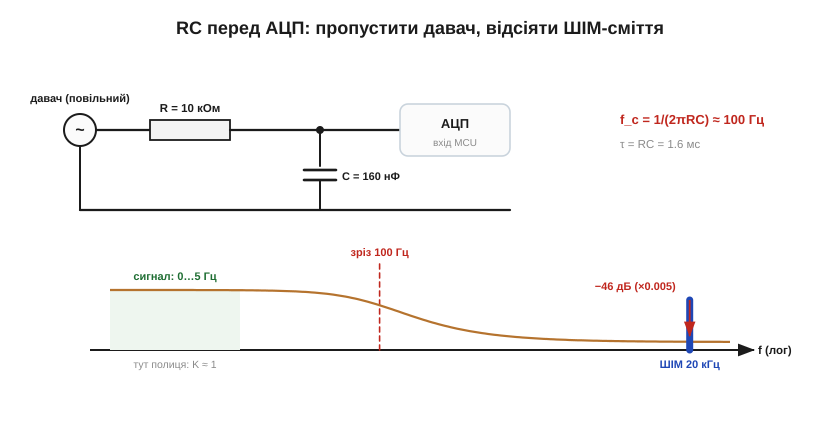
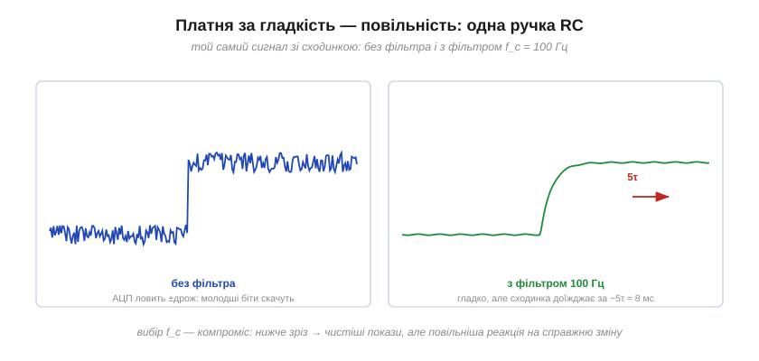

# 🔌 RC-фільтр на вході вимірювання: зняти тремтіння, не спотворивши сигнал

> Це компонентна вставка до теми [2.4.2 «RC-фільтр низьких частот»](r04-frequency-response.md). Формула з теми — у дві хвилини; мистецтво — в номіналах. Найчастіше RC-ФНЧ у вбудованій електроніці стоїть в одному конкретному місці: між давачем і входом АЦП мікроконтролера. Тут — як обрати зріз і номінали саме для цього місця, чому R затиснутий з обох боків, скільки коштує гладкість у мілісекундах — і чесне слово про заваду 50 Гц, проти якої RC слабкий.

### Задача і розв'язок у чотири числа

Типова сцена: термістор чи датчик струму видає повільний сигнал (одиниці герців), а поряд на платі працює імпульсний перетворювач чи ШІМ мотора на 20 кГц. Без фільтра покази АЦП «дихають» — молодші біти скачуть у такт сміттю. Ставимо дільник теми між давачем і ніжкою:


*Рис. 2.4.2c.1. Зріз 100 Гц — на дві декади вище сигналу (той майже не зачеплений: K ≈ 1) і на 2.3 декади нижче ШІМ-завади, якій дістається −46 дБ: від двадцяти кілогерців лишається пів відсотка.*

```
сигнал ≤ 5 Гц, завада 20 кГц  →  зріз кладемо між ними: f_c = 100 Гц
R = 10 кОм, C = 160 нФ        →  f_c = 1/(2πRC) ≈ 100 Гц
заглушення на 20 кГц: 200×    →  −46 дБ (драбина §2.4.4)
```

Правило вибору зрізу просте: **на декаду вище за сигнал** (щоб полиця була чесною і фаза не лізла в смугу) і **якнайдалі від завади** — кожна декада відстані дарує −20 дБ.

### Чому R = одиниці кілоом, а не що завгодно

Формулі f_c байдуже, як поділити добуток RC між співмножниками, — а схемі ні. R затиснутий з обох боків:

- **Знизу** — джерелом: R фільтра разом із вихідним опором давача утворює дільник ([§2.4.2](r04-frequency-response.md), пастки), тож R беруть значно більшим за вихідний опір джерела.
- **Зверху** — самим АЦП. По-перше, вхід тягне крихітний, але не нульовий струм витоку: типові ~100 нА на 100 кОм дали б 10 мВ зміщення — десятки молодших бітів похибки; на наших 10 кОм — терпимий мілівольт. По-друге, АЦП послідовного наближення в момент вибірки підключає до ніжки свій внутрішній семплювальний конденсатор (одиниці-десятки пікофарад) — і той мусить встигнути зарядитися через наш R за відведені мікросекунди. Великий R = повільна вибірка або брехливий код.

Звідси й народний стандарт: **R — одиниці-десяток кілоом, решту зрізу добирає C**. Приємний бонус нашої схеми: великий C фільтра (160 нФ проти пікофарад семплювального) працює місцевим резервуаром заряду — миттєвий «ковток» вибірки він віддає, навіть не здригнувшись.

### Ціна гладкості: мілісекунди

Фільтр не розрізняє «шум» і «справжню зміну» — він уповільнює все:


*Рис. 2.4.2c.2. Ліворуч — чесна швидкість і брудні покази; праворуч — чисті покази, але сходинка реальної зміни доїжджає до АЦП за ~5τ ≈ 8 мс. Для термістора це ніщо; для струму захисту — вічність.*

τ = RC = 1.6 мс, і за правилом п'яти сталих часу ([§2.1.4](../ch07-capacitor/ch07-capacitor.md)) нове значення встановлюється за ~8 мс. Перш ніж тиснути зріз нижче «для краси», спитайте: а як швидко мені треба *побачити зміну*? Вимірюванню температури і 1 Гц зрізу не зашкодить; а от фільтр у колі струмового захисту, який «для чистоти» зробили на 10 Гц, дізнається про коротке замикання останнім. І пам'ятайте: після RC часто працює ще й цифрове усереднення в коді — це другий ФНЧ, їхні повільності складаються.

### Чесно про 50 Гц

Проти мережевої наводки RC-ФНЧ — поганий боєць, і тема вже показала чому: коли сигнал 10 Гц, а завада 50 Гц, між ними пів декади, і один RC дає жалюгідні рази, а не десятки. Тиснути зріз нижче — означає зробити вимірювання повільним, як патока. Тож проти 50 Гц працюють інакше: прибирають причину (екран, кручена пара, акуратна земля), міряють диференційно, ставлять вирізаючий фільтр на одну частоту ([§2.3.7](../ch09-reactance-resonance/ch09-reactance-resonance.md)) — або беруть інтегруючий АЦП, який навмисне усереднює рівно за період мережі. RC лишіть для того, що він уміє найкраще: давити високочастотне сміття за дві декади від сигналу.

Підсумок-рецепт: зріз — декада над сигналом і якнайдалі від завади; R — кілоомний компроміс між джерелом і входом АЦП; C — решта добутку; перевірити τ проти потрібної швидкості реакції — і не вимагати від одного RC чудес біля 50 Гц.
