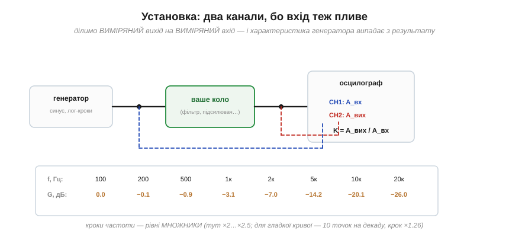
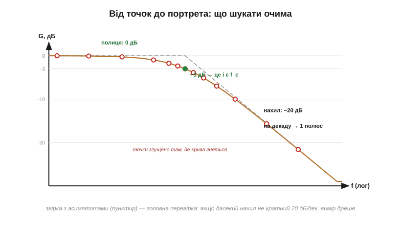

# ⚙️ Зняти АЧХ власноруч: свіп, таблиця, діаграма Боде

> Це алгоритмічна вставка до теми [2.4.5 «АЧХ і діаграма Боде»](r04-frequency-response.md). Читати чужі діаграми ми вже вміємо — час намалювати власну. Метод — прямий нащадок [пошуку резонансу свіпом](../ch09-reactance-resonance/ch09-s5-a-resonance-sweep.md): там ми шукали один максимум, тут знімемо **весь портрет** кола, з децибелами, лог-віссю і фазою. Жодного спецобладнання: генератор синуса, двоканальний осцилограф — або мікроконтролер, якщо лабораторія кишенькова.

### Установка: чому каналів два

Подаємо синус на вхід кола, міряємо вихід — здавалося б, досить одного каналу. Ні: амплітуда самого генератора теж залежить від частоти (у нього своя АЧХ, та й коло його навантажує — [§2.4.2](r04-frequency-response.md), пастки). Тому міряємо **обидві** напруги й ділимо виміряне на виміряне:


*Рис. 2.4.5a.1. CH1 дивиться на вхід кола, CH2 — на вихід; K = A_вих/A_вх для кожної частоти. У відношенні примхи генератора скорочуються. Кроки частоти — рівні множники, не рівні герці.*

Кроки частоти беріть **логарифмічно** — рівними множниками: для ескізу досить «1–2–5» у кожній декаді, для гладкої кривої — 10 точок на декаду (множник ×1.26 = 10^0.1, [вставка про логарифми](r04-s4-m-logarithms.md)). Лінійний крок змарнує сотню точок на останню декаду й залишить голим усе цікаве внизу.

### Алгоритм

```
для f від f_min до f_max лог-кроками:
    1. встанови частоту, НЕ міняючи амплітуди
    2. зачекай встановлення (≥ 5τ кола; для резонансного — ~Q періодів!)
    3. виміряй A_вх (CH1) і A_вих (CH2) тим самим способом
       (розмах чи RMS — байдуже, але всюди однаково)
    4. запиши G = 20·log10(A_вих/A_вх)
    5. (фаза) виміряй зсув Δt між нуль-переходами CH1 і CH2:
       φ = −360°·f·Δt
повтори згущеним кроком там, де G змінюється швидко
```

Два кроки тут важливіші за решту. **Очікування встановлення** (крок 2): після зміни частоти коло ще «дзвенить» перехідним процесом; для RC досить п'яти сталих часу, але контур із добротністю Q пам'ятає минуле близько Q періодів ([вставка про Q](../ch09-reactance-resonance/ch09-s6-m-q-factor.md)) — поспіх біля резонансу занижує пік. **Малий рівень сигналу** (крок 1): перевантажене коло стає нелінійним, з'являються гармоніки — а наш метод мовчки припускає, що на виході та сама частота, що на вході ([§2.4.1](r04-frequency-response.md), межі портрета).

### Від таблиці до діаграми

Відкладіть точки на лог-осі частот і дБ-осі — і прочитайте власну криву тими ж очима, що чужу з даташита:


*Рис. 2.4.5a.2. Полиця → рівень підсилення; точка −3 дБ від полиці → f_c; далекий нахил → порядок (кратний −20 дБ/дек). Пунктирні асимптоти — найкраща перевірка вимірювання: справжні кола не вміють у «−27 дБ/декаду».*

Звірка з асимптотами — це і контроль якості: нахил, не кратний 20 дБ/дек, або полиця, що «дихає», майже завжди означають перевантаження, наводку чи неврахований дільник, а не екзотичне коло.

### Фаза і кишенькові варіанти

Для фазової панелі міряйте затримку між нуль-переходами обох каналів (формула в алгоритмі) або скористайтеся [фігурами Ліссажу](../ch09-reactance-resonance/ch09-s4-a-lissajous.md) у режимі XY — на −45° у зрізі еліпс упізнається миттєво.

Без лабораторного генератора теж можна. Звукова карта комп'ютера — чесний генератор і двоканальний «осцилограф» до ~20 кГц: цього вистачає на всі аудіо- і сенсорні фільтри. Мікроконтролер робить те саме для своїх кіл: ШІМ із наступним ФНЧ (та сама ідея «середнього з імпульсів» із [§2.4.2](r04-frequency-response.md)) або дешевий DDS-модуль дає синус, АЦП міряє вхід і вихід, а прошивка крутить той самий цикл лог-кроків. Сучасні «розумні» осцилографи й узагалі мають кнопку «Bode plot» — тепер ви знаєте, що саме вона робить усередині.

### Навіщо це вміти

Зняти АЧХ — універсальний спосіб **побачити** будь-яке коло як фільтр: перевірити, чи справді ваш вхідний RC ріже там, де розраховано ([вставка до §2.4.2](r04-s2-c-input-rc.md)), знайти прихований резонанс у тракті, виміряти смугу саморобного підсилювача, навіть упізнати невідому «чорну скриньку» за зламами її портрета. А головне — після десятка власноруч знятих кривих діаграми Боде з даташитів перестають бути картинками і стають мовою, якою ви думаєте.
