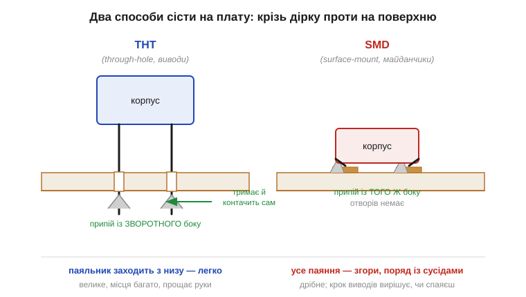
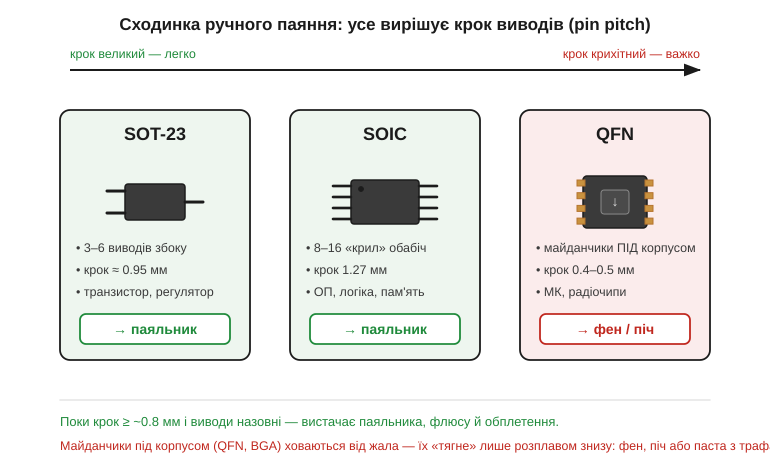

# 🔌 Корпуси наживо: THT проти SMD, SOT-23/SOIC/QFN — що реально паяється вручну

> Це компонентна вставка до теми [§2.9.5 «Корпуси, маркування, розпіновка»](r09-reading-datasheets.md). Тема каже, що в даташиті є розділ *Package / Mechanical*: розміри корпуса, крок виводів, посадкове місце. Але папір не відповідає на питання, від якого залежить, чи зберете ви прототип на столі: **чи спаяю я це руками?** Тут — про корпус як фізичну річ на платі. Дві великі родини (THT і SMD), три типові SMD-корпуси (SOT-23, SOIC, QFN) і одне число, що вирішує все, — **крок виводів** *(pin pitch)*.

### Дві родини: крізь дірку проти на поверхню

Усі корпуси діляться на два табори за тим, **як вони тримаються на платі**. **THT** *(through-hole technology, наскрізний монтаж)* — у компонента довгі дротяні виводи, вони пролазять крізь металізовані отвори в платі, і паяють їх із **зворотного** боку. **SMD** *(surface-mount device, поверхневий монтаж)* — компонент лежить **на** платі, на пласких мідних майданчиках *(pads)*, і паяється з **того самого** боку, де сидить; жодних отворів.

*Рис. 2.9.5c.1. Ліворуч THT: вивід прошиває плату, галтель припою знизу водночас тримає деталь механічно й проводить струм. Праворуч SMD: корпус лежить на майданчиках, усе паяння — згори, поряд із сусідами. THT велике й прощає руки; у SMD усе вирішує, наскільки дрібний крок виводів.*

Різниця не косметична. THT прощає: виводи товсті, відстані великі, припій сам затягується в отвір, а деталь стирчить — її легко тримати. Тому майже все «навчальне» (макетка, перші схеми) — це THT. Платять за це місцем: THT-деталь займає обидва боки плати й купу площі, тож промисловість давно перейшла на SMD — дрібніше, дешевше в автоскладанні, краще на високих частотах (коротші виводи — менша паразитна індуктивність, [§2.9.4](r09-reading-datasheets.md)). Ось чому в сучасному даташиті THT-корпус часто вже навіть не пропонують: є лише SMD, і питання «спаяю руками?» стає реальним.

### Три SMD-корпуси, які ви зустрінете першими

Якщо вже SMD неминучий, варто знати, з чим саме доведеться мати справу. З-поміж десятків SMD-корпусів три трапляються постійно — і саме вони добре показують усю шкалу складності: від такого, що береться паяльником за хвилину, до такого, до якого паяльник узагалі не дотягується.

**SOT-23** *(small-outline transistor)* — крихітний корпус на 3–6 виводів. Класичний дім для одного транзистора ([§2.6](../ch11-bjt/ch11-bjt.md), [§2.7](../ch12-mosfet/ch12-mosfet.md)) чи малого регулятора. Виводи стирчать назовні, крок ≈ 0.95 мм — паяльником береться легко.

**SOIC** *(small-outline IC)* — прямокутник із виводами-«крилами» *(gull-wing)* обабіч, по 8–16 штук, крок 1.27 мм. Тут живуть операційні підсилювачі ([§2.8](../ch13-opamp-comparator/ch13-opamp-comparator.md)), проста логіка, мікросхеми пам'яті. Виводи відкриті, відстань велика — теж дружній до паяльника.

**QFN** *(quad flat no-lead, без виводів)* — плаский квадрат, у якого виводів **назовні немає взагалі**: контактні майданчики сховані **під** корпусом по периметру, плюс великий тепловідвідний майданчик *(thermal pad)* посередині. Крок 0.4–0.5 мм. Тут сидять мікроконтролери й радіочипи. Паяльником ви до тих майданчиків **просто не дотягнетесь** — жало не лізе під корпус.

### Крок виводів — число, що вирішує

Ці три корпуси шикуються в чітку сходинку складності, і не випадково: за нею стоїть одне-єдине число — відстань між сусідніми виводами. Разом із тим, чи стирчать вони назовні, воно й вирішує долю ручного паяння.

*Рис. 2.9.5c.2. Що менший крок виводів і що глибше вони ховаються під корпус, то важче паяти вручну. SOT-23 і SOIC — виводи назовні, крок ≥ ~0.95 мм — беруться звичайним паяльником. QFN — майданчики під корпусом, крок 0.4–0.5 мм — лише фен, піч або паста з трафаретом.*

Уся складність ручного паяння зводиться до двох чисел у розділі *Package*: **крок виводів** і чи виводи **назовні**. Поки крок ≥ приблизно 0.8 мм і виводи стирчать збоку (SOT-23, SOIC, а з THT і поготів), вистачає звичайного інструмента: паяльник із тонким жалом, флюс, мідне обплетення *(solder wick)* щоб зняти зайве. Навіть «крила» SOIC паяють гуртом — технікою *drag soldering*: ведуть краплю припою вздовж ряду, флюс сам розводить її по виводах.

А от QFN (і ще щільніший **BGA** *(ball grid array)*, де контакти — кульки під корпусом) ховають з'єднання від жала. Дотягтися можна лише розплавом **знизу**: гарячим повітрям (фен), у печі або нанісши паяльну пасту крізь трафарет і розплавивши все разом. Тому, побачивши в даташиті лише QFN/BGA, плануйте фен — або шукайте плату-перехідник, де чип уже розведено на зручніший крок.

> 🔧 **Навіщо це.** Перш ніж замовляти компонент, гляньте в даташиті **дві речі** з розділу *Package*: який корпус і який крок виводів. THT, SOT-23, SOIC (крок ≥ ~0.95 мм, виводи назовні) — спокійно паяєте паяльником на столі. QFN чи BGA (крок ≤ 0.5 мм, контакти під корпусом) — потрібен фен або піч, інакше прототип просто не зберете руками. Те саме рішення інколи дає вибір **між версіями того ж чипа**: один номер живе і в SOIC, і в QFN — для ручного прототипу беріть ширший корпус, навіть якщо він більший. Корпус — це не «механіка наприкінці даташита», а перше практичне питання: чим я це паятиму.
