# Розділ 2.10 — Резонатори й опорні частоти

[Розділ 2.9](../r09-reading-datasheets/r09-reading-datasheets.md) навчив читати паспорт компонента — тепер у нас є мова, щоб говорити з даташитом будь-якої деталі. А цей розділ присвячено компоненту, без якого не цокає жоден цифровий пристрій: **резонатору**, що задає системі **опорну частоту** *(reference frequency, clock)*. Усе, що в електроніці відбувається «вчасно» — кожна команда процесора, кожен біт на шині, кожна секунда годинника — відлічується від коливань крихітного кристала кварцу або його замінників.

Дотепер ми будували кола, у яких час або не грав ролі (резистивні дільники), або задавався «м'яко» сталою RC ([§2.1.4](../ch07-capacitor/ch07-capacitor.md)) чи резонансом LC-контуру ([§2.3.5](../ch09-reactance-resonance/ch09-reactance-resonance.md)). Усі вони мали спільну ваду: частота «плавала» — з температурою, з розкидом деталей, з напругою. Для блимання світлодіода це байдуже. Для годинника, що має йти роками, чи для приймача, що ловить вузьку радіосмугу, — катастрофа. Цей розділ показує, як інженери приборкали час: спершу — навіщо взагалі потрібна стабільна опорна частота і чому простого генератора замало; потім — фізику **п'єзоефекту** й **кварцового резонатора**, що дає добротність у десятки тисяч; його **еквівалентну схему** і класичний **генератор П'єрса**; нарешті — мову **точності в ppm**, годинниковий кварц **32768 Гц**, дешеві **керамічні** й сучасні **MEMS**-резонатори та найточніші **TCXO/OCXO**. Як кварц став практичним (Кеді, П'єрс) і як він колись обвалив цілу годинникову індустрію — у [📜 історії до розділу](r10-history-pierce-ft243.md).

## 2.10.1 Навіщо системі опорна частота

Будь-який цифровий пристрій живе за тактом. Процесор виконує команди не «коли захоче», а в чітко відмірені моменти — на фронтах **тактового сигналу** *(clock)*. Лічильник часу нарощує секунди, відлічуючи однакові інтервали. Послідовний інтерфейс посилає біти зі строго заданою швидкістю, щоб приймач знав, коли «дивитися» на лінію. У серці кожного з цих процесів стоїть **опорна частота** — джерело рівних, незмінних «тіків», від яких відраховується все інше. Перш ніж занурюватись у фізику кварцу, варто зрозуміти, **навіщо** ця частота має бути такою стабільною — бо саме вимога стабільності й веде нас від простих RC-генераторів до кристала.

### Один генератор живить усе, що залежить від часу

Уявімо мікроконтролер. Усередині нього — арифметичний блок, пам'ять, периферія: таймери, аналого-цифровий перетворювач, послідовні порти. Усі вони синхронізовані одним сигналом — **системним тактом**. Він не робить корисної роботи сам по собі; його єдина задача — бути **метрономом**, рівномірно відраховувати час, щоб решта схеми крокувала в ногу.

Чому метроном узагалі потрібен? Бо цифрова логіка працює **синхронно**: дані переходять з одного регістра в наступний не безперервно, а порціями, на кожному такті. Між фронтами такту схема «думає» — сигнали встигають пройти крізь логічні вентилі й усталитися; на фронті результат **защіпується** в регістр. Прибрати такт — і не буде моменту, коли всі вузли узгоджено роблять крок; схема перетвориться на хаос станів, що міняються будь-коли. Такт — це барабанщик, під чий удар уся команда веслує одночасно. Тому навіть найпростіший мікроконтролер не зробить жодної команди без джерела такту: перше, що він робить, прокидаючись, — запускає генератор.


*Рис. 2.10.1.1. Опорний генератор як метроном системи. Один потік стабільних імпульсів живить такт процесора (кожна команда — за тактом), відлік часу (годинник і таймери), послідовну шину (момент кожного біта) і вибірку АЦП/ШІМ. Усе, що має статися «вчасно», відраховується від цих тіків.*

Зверніть увагу: тут важлива не так **висока** частота, як її **постійність**. Процесор не зламається, якщо такт буде трохи повільніший — він просто рахуватиме повільніше. Лихо настає, коли частота **гуляє**: то швидше, то повільніше, непередбачувано. Тоді розсинхронізуються вузли, що мали б крокувати разом, а відлік часу «попливе».

Варто розрізнити дві геть різні вимоги до такту, які часто плутають: **абсолютну точність** (наскільки частота близька до номіналу) і **короткочасну стабільність** (наскільки рівні сусідні періоди). Для самої роботи процесора абсолютна точність майже не важить — він однаково лічитиме команди, хоч би такт був 15.9 чи 16.1 МГц. А от рівність періодів і відсутність «провалів» критичні завжди. Натомість для відліку часу й зв'язку на перший план виходить уже абсолютна точність: тут кожен зайвий проміль перетворюється на втрачені секунди чи биті пакети. Тримаймо цю відмінність у голові — вона повертатиметься весь розділ.

### Чому досить одного джерела на всю систему

Може здатися дивним: процесор тактується десятками чи сотнями мегагерц, USB вимагає своєї частоти, периферія — своєї, а опорний генератор у системі зазвичай **один** і часто навіть невисокої частоти. Як одне джерело задовольняє всіх? Відповідь — у **множенні й діленні** частоти всередині чипа. Поділ навпіл ми вже бачили: один тригер удвічі знижує частоту, ланцюжок тригерів дає будь-який степінь двійки нижче. А підняти частоту дозволяє спеціальний вузол — **фазове автопідстроювання частоти** (*phase-locked loop*, PLL), що генерує високу частоту й утримує її в строгій кратності до опорної. Грубо: PLL — це внутрішній генератор, який примусово «крокує в ногу» з опорним, але робить N своїх кроків на кожен крок опорного.

Тут важливий не пристрій PLL (його глибше розбирають окремо), а наслідок: **уся точність системи успадковується від одного опорного джерела**. Якщо опорний кварц має ±20 ppm, то й помножена з нього частота процесора матиме ±20 ppm, і поділена частота шини — теж. Множення й ділення зберігають **відносну** точність: вони множать і саму частоту, і її похибку на той самий коефіцієнт. Тому ставити окремий точний генератор на кожну частоту не треба — достатньо одного хорошого опорного, а решту виведе синтез усередині чипа.

Звідси й практика: на платі з потужним процесором часто бачимо лише один зовнішній кварц (іноді ще окремий годинниковий на 32768 Гц, §2.10.7), а всі робочі частоти — це його похідні. Така архітектура й пояснює, чому вибір цього єдиного резонатора такий важливий: він задає планку точності для **всього**, що тактується в системі. Помилишся з ним — попливе одразу все.

### Три задачі, де стабільність критична

Тепер пройдімо по трьох типових задачах, де вимоги до опорної частоти різко зростають, — від найм'якшої до найжорсткішої. Це й окреслить, навіщо взагалі морочитися з кварцом.

Перша — **відлік часу**. Якщо ваш пристрій веде годинник чи ставить мітки часу на дані, то похибка частоти прямо перетворюється на похибку годинника, причому **лінійно з часом**: похибка не усереднюється й не зникає, а невпинно накопичується. Генератор, що поспішає на 1 %, за добу набіжить **майже на чверть години** (86 400 с · 0.01 = 864 с ≈ 14.4 хв). Через тиждень такий годинник годі впізнати — він збіжить більш ніж на півтори години. Для будь-чого, що міряє час, потрібна частота, відома з точністю до часток відсотка, а краще — до часток мільйонної. Саме тому годинник — класичний споживач кварцу, і навіть кварца буває замало (§2.10.6).

Друга — **такт процесора**. Тут абсолютне значення менш критичне (аби лиш не вище максимуму з даташита), але стабільність усе одно потрібна: уся внутрішня логіка розрахована на конкретний період, і кожен такт має давати схемі досить часу, щоб усталитися. Більшість мікроконтролерів цілком щасливо тактується від внутрішнього RC — для рахунку команд ±2 % несуттєві. Але є винятки, що ламають цю безтурботність. Найвідоміший — **USB**: його протокол вимагає, щоб частота тактування не відхилялася більш ніж на частки відсотка (для повношвидкісного USB — близько ±0.25 %), інакше хост і пристрій не домовляться про біти й з'єднання просто не встановиться. Тому пристрій із USB майже завжди має кварц, навіть якщо для решти вистачило б RC.

Третя, найвимогливіша до точності, — **послідовний зв'язок**. Розгляньмо асинхронний інтерфейс на кшталт UART: два пристрої домовилися про швидкість (скажімо, біт триває певний час) і обмінюються байтами **без окремої лінії такту**. Приймач сам відлічує моменти, коли треба «подивитися» на лінію — у середині кожного біта. Робить він це за **власним** генератором, відраховуючи від стартового фронту: «через півбіта — середина старт-біта, ще через біт — середина першого біта даних» і так далі. Якщо генератори передавача й приймача хоч трохи різняться, моменти семплування поступово **розповзаються** відносно справжніх кромок.


*Рис. 2.10.1.2. Чому RC-генератора замало для зв'язку. Зверху — точний кварц: кромки бітів збігаються з ідеальними моментами семплування весь кадр. Знизу — RC ±5 %: похибка накопичується від біта до біта, і до кінця байта приймач семплує вже не той біт. Помилка часу множиться на довжину кадру.*

Ось чому зв'язок особливо чутливий: похибка **накопичується**. Один біт зсунувся на крихту — дрібниця. Але приймач відраховує всі біти кадру від **єдиного** стартового фронту, тож зсуви додаються: до десятого біта накопичений зсув уже може перевалити за половину бітового інтервалу, і приймач прочитає **сусідній** біт. Прикинемо бюджет. Кадр UART — старт-біт, 8 біт даних, стоп-біт, разом близько 10 бітів; семплування має влучати приблизно в середину біта, тож накопичений зсув на останньому біті не повинен перевищувати ±½ біта. Десять бітів, похибка ділиться на десять, та ще й на дві сторони — звідси класичне правило: сумарна різниця частот має бути менша за кілька відсотків.

**Приклад (бюджет розсинхронізації UART).** Кадр — 10 бітів; семплувати треба не далі ніж за ±0.5 біта від кромки на останньому біті.

```
гранична сумарна похибка ≈ 0.5 біта / 10 бітів = 0.05 = 5 %
ділимо на дві сторони (обидві мають свій генератор):
на кожну сторону ≈ 2.5 %
з запасом на форму фронтів беруть    ≲ 2 % на сторону
```

Внутрішній RC із ±5 % сюди **не вкладається** навіть з одного боку — звідси й практика: для надійного UART обидві сторони бажано тактувати кварцом (десятки ppm — мізер проти 2 %), а RC лишають хіба для коротких посилок на невисокій швидкості, та й то ризиковано на краях температури.

Зверніть увагу на спільну рису всіх трьох задач: проблема не в **середній** частоті, а в тому, що похибка **накопичується або зсуває момент**. Годинник набігає, бо похибка частоти інтегрується в час. Зв'язок розсипається, бо зсуви бітів додаються. USB не встановлюється, бо вимога до допуску жорстка від початку. У всіх випадках виручає не «висока» частота, а **передбачувана й стабільна** — і саме її дає кварц. Тому, оцінюючи проєкт, питають не «скільки мегагерц треба», а «наскільки точно й стабільно має триматися частота» — це геть інше питання, і відповідь на нього визначає, чи можна обійтися дешевим вбудованим генератором, чи доведеться ставити зовнішній резонатор.

### Чому RC-генератора недостатньо

Чому ж не обійтися найпростішим генератором на резисторі й конденсаторі? Адже стала часу RC ([§2.1.4](../ch07-capacitor/ch07-capacitor.md)) задає цілком певний період, і зібрати такий генератор — кілька деталей. Найпоширеніший RC-генератор (на основі тригера Шмітта, [§2.8.8](../ch13-opamp-comparator/ch13-opamp-comparator.md)) безперервно заряджає й розряджає конденсатор через резистор між двома порогами, і період цих циклів задається добутком R·C. Проблема в тому, що **і R, і C погано тримають своє значення**.

Номінал резистора має допуск (звичайні — ±5 % чи ±1 %), і він повзе з температурою. Ємність конденсатора — ще гірше: керамічні конденсатори класу Y5V втрачають десятки відсотків ємності в робочому діапазоні температур ([🔌 MLCC](../ch07-capacitor/ch07-s5-c-mlcc.md)), а ще «сідають» під прикладеною напругою. Додайте сюди розкид самих порогів тригера й залежність їх від напруги живлення — і стане ясно, чому RC-генератор принципово не може бути точним: він зібраний з елементів, кожен з яких «дихає». Вбудований у мікроконтролер RC-генератор зазвичай дає точність **близько ±1…5 %** після заводського калібрування — і то лише за кімнатної температури й номінального живлення; на краях діапазону похибка більша. У ppm це 10 000…50 000 ppm — у тисячу разів грубіше за кварц (про саму одиницю ppm — §2.10.6).

Зробімо проміжний підсумок числами, щоб відчути прірву. RC дає ±1…5 %, тобто 10 000…50 000 ppm. Кварц дає десятки ppm. Різниця — приблизно в **тисячу разів**. Це не «трохи краще» — це інший клас. П'ять відсотків — це і є та сама «чверть години на добу»; двадцять ppm — це менш як дві секунди на добу (§2.10.6). Для метронома, що блимає індикатором, RC годиться чудово; для всього, де час або частота мають значення, — ні.

Чому ж RC взагалі тримають у мікроконтролерах, якщо він такий неточний? Бо в нього є дві справжні переваги: він **безкоштовний** (уже всередині чипа, не треба ні зовнішнього компонента, ні місця на платі, ні двох конденсаторів) і **миттєво стартує** (на відміну від кварцу, що розгойдується мілісекунди, §2.10.8). Тому типова схема така: мікроконтролер прокидається на внутрішньому RC (щоб одразу почати працювати), а вже потім, якщо задача того потребує, запускає зовнішній кварц і перемикається на нього. Уміння свідомо обрати між RC і кварцом — окрема практична навичка ([🔌 внутрішній RC проти кварцу](r10-s1-c-internal-rc.md)).

> 🔧 **Навіщо це.** Перше технічне рішення кожного проєкту — звідки брати такт, і воно прямо впливає на собівартість і надійність. Дешевий пристрій, що лише блимає і нічого не передає, обійдеться вбудованим RC-генератором: не треба ні кварцу, ні двох конденсаторів, ні місця на платі, ні турбот із розведенням. А от щойно з'являється UART на пристойній швидкості, USB, точний годинник чи радіо — RC вже не годиться, і ставлять кварц. Уміння провести цю межу — заощадити там, де можна, і не зекономити там, де не можна — економить і гроші, і місце, і нерви на налагодженні «чомусь не працює зв'язок». Половина загадкових «пристрій бачить дані, а CRC не сходиться» — це саме розсинхронізація через надто грубий генератор.

Отже, потрібен елемент, чия частота задається не «м'якими» R і C, а чимось **жорстким і відтворюваним** — властивістю самої речовини, що майже не міняється з температурою, напругою чи часом. Таким елементом і виявився кристал кварцу, де частоту визначає не електрична схема, а **механічний резонанс** твердого тіла. Перш ніж дійти до нього, розберемось у фізиці, що дозволяє електричній схемі взагалі розгойдати кристал, — у **п'єзоефекті**.

## 2.10.2 П'єзоефект: кристал перетворює напругу на деформацію і навпаки

Щоб зрозуміти кварцовий резонатор, треба спершу збагнути дивовижну властивість деяких кристалів: вони пов'язують **механіку** й **електрику** напряму. Стисніть такий кристал — на його гранях з'явиться електрична напруга. Прикладіть напругу — кристал злегка змінить форму. Це **п'єзоефект** *(piezoelectric effect)*, від грецького *piezō* — «тисну». Саме він робить кварц придатним на роль резонатора: електрична схема може **штовхати** кристал напругою і **слухати** його механічні коливання — теж через напругу.

### Два напрями одного ефекту

П'єзоефект працює в обидва боки, і обидва нам знадобляться — тому розберімо кожен окремо, перш ніж з'єднати їх у резонатор.

**Прямий ефект** *(direct effect)*: механічна деформація породжує заряд. Стиснули кристал — зміщення атомів у його ґратці розсуває центри додатного й від'ємного зарядів, і на протилежних гранях накопичується різнойменний заряд, тобто з'являється напруга. Розтиснули — напруга зникає; стиснули в інший бік — напруга змінює знак. Що сильніше тиснемо, то більший заряд — залежність приблизно лінійна. Саме прямий ефект дозволяє використати кристал як давач сили, тиску чи вібрації: механічна дія входить — електричний сигнал виходить. На ньому працюють контактні мікрофони, давачі удару й детонації в двигунах, кнопки-«п'єзо» без рухомих контактів.

**Зворотний ефект** *(converse effect)*: прикладена напруга породжує деформацію. Подали напругу на грані — електричне поле зміщує заряджені атоми ґратки, і кристал злегка стискається чи розтягується. Змінюємо знак напруги — змінюється напрям деформації; що більша напруга, то більший рух. Кристал працює як крихітний, але напрочуд точний привод *(actuator)*. На зворотному ефекті працюють п'єзовипромінювачі звуку (зумери, динаміки-«пищалки»), ультразвукові випромінювачі, мікроприводи точного позиціювання — аж до тих, що рухають голку в скануючих мікроскопах на частки нанометра.

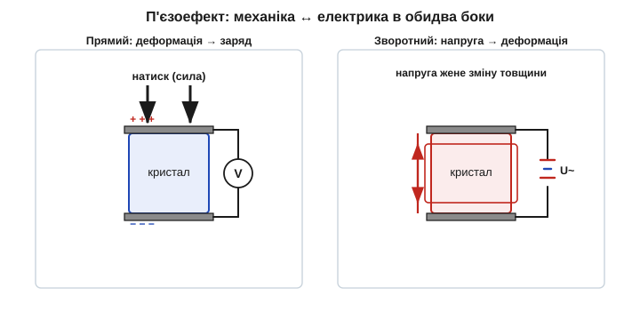
*Рис. 2.10.2.1. П'єзоефект в обидва боки. Ліворуч — прямий: натиск на кристал зсуває заряди ґратки, на електродах з'являється напруга (давач). Праворуч — зворотний: прикладена напруга деформує кристал, змінюючи його товщину (привод). Той самий кристал може і відчувати силу, і рухатися від напруги.*

Важливо вхопити, що це **один** фізичний механізм, а не два різні явища: і там, і там працює та сама пружна несиметрія ґратки, просто «читана» з різних кінців. Тому коефіцієнти прямого й зворотного ефектів для одного кристала строго пов'язані — це наслідок збереження енергії. А для нас головне ось що: оскільки кристал водночас і рухається від напруги (зворотний), і породжує напругу від руху (прямий), його можна вмонтувати в електричну схему так, щоб схема **і штовхала** кристал, **і слухала** його відгук — самими лише дротами, без жодної механіки назовні. Це і є шлях до резонатора.

Історія цього відкриття коротка й знаменна. Прямий ефект описали 1880 року брати **П'єр і Жак Кюрі** *(Pierre & Jacques Curie)*, помітивши заряд на стиснутих кристалах кварцу, турмаліну й сегнетової солі. Зворотний ефект вони спершу не передбачили — його теоретично вивів наступного року Ґабріель **Ліппман** *(Gabriel Lippmann)* з термодинаміки, а Кюрі одразу підтвердили дослідом. Десятиліттями ефект лишався лабораторною цікавинкою — поки Перша світова не дала йому грізне застосування.

Ця двобічність — ключ до всього розділу. Якщо подати на кристал **змінну** напругу, зворотний ефект змусить його **вібрувати** в такт. А прямий ефект водночас перетворить ці вібрації назад на напругу. Виходить компонент, який електрична схема може і збуджувати, і слухати — а отже, вбудувати в петлю зворотного зв'язку й змусити коливатися самостійно ([§2.10.5](r10-resonators-references.md)).

### Звідки береться ефект: несиметрія ґратки

Чому одні кристали п'єзоелектричні, а інші — ні? Річ у **симетрії кристалічної ґратки**. Уявімо ґратку як регулярний візерунок із додатних і від'ємних іонів. У речовини, де цей візерунок має **центр симетрії** (для кожного іона є дзеркальний у протилежному напрямі), деформація зсуває додатні й від'ємні заряди узгоджено — їхні «центри ваги» лишаються в одній точці, і назовні нічого не з'являється. Більшість простих кристалів саме такі, тому й не п'єзоелектричні.

А от у кристалах **без центра симетрії** — як-от кварц (діоксид кремнію SiO₂ у певній кристалічній формі, α-кварц) — стиск зсуває «плюси» й «мінуси» **по-різному**: їхні центри розходяться, і виникає **дипольний момент**, тобто напруга на гранях. У кварці кремній і кисень укладені гвинтовими спіралями без центра симетрії, тож будь-яка деформація неминуче розводить заряди — звідси й ефект. Це пояснює і двобічність: коли ж навпаки прикласти поле, воно тягне ті самі асиметрично розкладені заряди й деформує ґратку.

Звідси два практичні наслідки. По-перше, п'єзоелектрика — властивість саме **монокристала** з правильною ґраткою, а не речовини взагалі: розплавлений чи аморфний кварц (звичайне скло) ефекту не має, бо в безладній структурі немає тієї регулярної асиметрії. По-друге, напрям і сила ефекту прив'язані до **осей** кристала — кварц анізотропний. Тому щоб вирізати з нього пластину з потрібними властивостями, її орієнтують під точним кутом до кристалічних осей; від кута зрізу залежить і спосіб коливання, і температурна поведінка (про зрізи — §2.10.3).

Цікаво, що сам кварц — це той самий діоксид кремнію, з якого складається пісок і з якого роблять і скло, і кремній для чипів; уся різниця — в упорядкуванні. Безладний SiO₂ — скло, нічого не дає; правильний монокристал α-кварцу — п'єзоелектрик. Колись для резонаторів відбирали природні кристали гірського кришталю, прискіпливо перевіряючи їх на дефекти; нині майже весь кварц для електроніки **вирощують штучно** — у автоклавах під тиском і температурою, з насиченого розчину, великими однорідними кристалами без дефектів. Це здешевило резонатори й зробило їх відтворюваними: кожна партія однакова. Тож кварцовий резонатор — гарний приклад того, як рідкісний природний матеріал, ставши вирощеним промислово, перетворився на масову дешеву деталь.

Кварц — не єдиний п'єзоматеріал, і корисно бачити всю родину. Природний п'єзоефект мають кварц, турмалін, сегнетова сіль. Куди сильніший ефект дають штучні **п'єзокераміки** — спечені полікристалічні матеріали, як-от цирконат-титанат свинцю (PZT). Їх «поляризують» при виготовленні (нагрівають і прикладають сильне поле, упорядковуючи мікродомени), і після цього вони сильно п'єзоелектричні. Кераміку застосовують там, де потрібен **потужний рух чи гучний звук**: п'єзовипромінювачі (той самий «писк» у годиннику чи зумері), ультразвукові випромінювачі далекомірів і пралок, приводи. Платіж за силу — нестабільність: керамічний резонанс куди менш добротний і «плавкіший» за монокристал, бо в полікристалі багато меж зерен і втрат. Тому для **гучності й сили** беруть кераміку, а для **точної опорної частоти** — монокристал кварцу (детальне порівняння — §2.10.8).

Перше гучне застосування п'єзоефекту — це **гідроакустика**. Під час Першої світової війни постала задача виявляти підводні човни, і фізик Поль **Ланжевен** *(Paul Langevin)* близько 1917 року збудував випромінювач-приймач ультразвуку на кварцових пластинах: зворотний ефект випромінював у воду потужний ультразвуковий імпульс, прямий — ловив відлуння від перешкоди. Це був прообраз **сонара** (детальніше — у §5.2, де йдеться про вимірювання відстані). Саме практична потреба «слухати глибину» вперше показала інженерам, що кварц — не просто лабораторна дивина, а робочий перетворювач; а з нього вже виріс і кварцовий резонатор частоти.

> 🔧 **Навіщо це.** П'єзоефект — це не лише про резонатори. Той самий принцип працює у п'єзозумерах (подаєш меандр — кераміка пищить на його частоті), у контактних мікрофонах і давачах удару (стук → напруга), в ультразвукових далекомірах і медичних сканерах (електрика → ультразвук і назад), у газових запальничках і п'єзокнопках (різкий удар → іскра). Зрозумівши прямий і зворотний ефект тут, ви впізнаєте його в десятках компонентів — і завжди ставитимете правильне питання: цей елемент я «слухаю» (прямий ефект, він давач), «штовхаю» (зворотний, він привод), а чи і те, і те разом — як у резонаторі, де схема й штовхає, і слухає той самий кристал.

### Резонанс: коли штовхати в такт власній частоті

Лишилося з'єднати п'єзоефект із резонансом — і ми отримаємо резонатор. Будь-яке пружне тіло має **власну частоту** коливань — частоту, на якій воно «хоче» коливатися, якщо його розгойдати й відпустити: так дзвенить струна, гуде камертон, співає келих від пальця. Власна частота залежить від маси й пружності тіла, тобто від його матеріалу й розмірів. Кристал кварцу — теж пружне тіло, тож і він має власну частоту, задану його розмірами й способом коливання (товщиною пластини, формою).

І тут спрацьовує знайоме з резонансу ([§2.3.5](../ch09-reactance-resonance/ch09-reactance-resonance.md)) правило: якщо штовхати систему **точно на її власній частоті**, поштовхи додаються «в ногу» з коливанням, енергія накопичується, і амплітуда різко зростає. Штовхати ж невпопад — поштовхи то допомагають, то гасять рух, і нічого не розгойдується. Класична картинка — гойдалка: підштовхуй її в ритм власних колихань, і розмахаєш до неба; штовхай абияк — лишиться на місці.

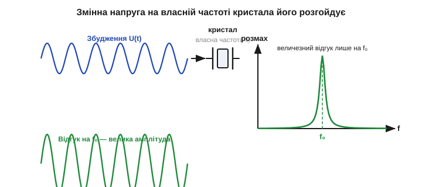
*Рис. 2.10.2.2. Резонансне збудження кристала. Змінна напруга через зворотний п'єзоефект «штовхає» кристал. Коли частота збудження збігається з власною частотою f₀, амплітуда механічних коливань різко зростає (вузький пік), а прямий ефект повертає їх у вигляді великої напруги. Поза f₀ відгук мізерний.*

Тепер з'єднаймо це з п'єзоефектом. Подайте на кристал **змінну** напругу — зворотний ефект змусить його деформуватися в такт. Якщо частота напруги далеко від власної частоти кристала, він майже не ворухнеться: поштовхи невпопад. Але підберіть частоту точно під власну — і кристал розгойдається, накопичуючи енергію коливання за коливанням, аж поки рух не стане великим; а прямий ефект водночас перетворить ці потужні коливання назад на велику напругу на гранях. Кварц поводиться як надзвичайно вибірковий резонатор: він сильно відгукується **лише** на дуже вузьку смужку частот довкола своєї власної, а на решту — майже ніяк.

Ця вибірковість — і є та властивість, заради якої кварц ставлять у генератори. Якщо вмонтувати кристал у петлю підсилювача так, щоб петля підтримувала коливання лише там, де кристал дає сильний відгук, генератор буде змушений коливатися на власній частоті кварцу — і ні на якій іншій. А власна частота кварцу надзвичайно стабільна, бо задана **фізичними розмірами твердого монокристала**, а не «м'якими» R і C: розміри кварцу майже не міняються ні з температурою (для правильного зрізу), ні з напругою, ні з часом.

### Чому саме кварц переміг на роль резонатора

Раз сильний п'єзоефект має радше кераміка, постає природне питання: чому опорні частоти будують **не на ній**, а на кварці зі скромнішим ефектом? Бо для резонатора потрібен не сильний ефект, а сильний **і стабільний резонанс**, а це геть інші вимоги. Кварц виграє за цілим набором властивостей одразу, і варто їх перелічити, щоб зрозуміти його монополію.

По-перше, кварц — **монокристал**, без меж зерен, тож його механічні втрати мізерні, а добротність — колосальна (саме про це наступна тема). Кераміка-полікристал такої Q не дасть ніколи. По-друге, у кварцу є **зрізи з майже нульовою температурною залежністю** (AT, §2.10.6): підібравши кут, частоту роблять майже байдужою до температури в робочому діапазоні — у кераміки такого важеля нема. По-третє, кварц винятково **стабільний у часі** й хімічно інертний: він майже не старіє й не реагує на довкілля. По-четверте, його **легко вирощувати**: синтетичний кварц вирощують у автоклавах великими однорідними кристалами дешево й у величезних кількостях.

Складіть це разом — і вийде ідеальний резонатор: гострий, температурно-плаский, нестаріючий, дешевий. Кераміці лишається ніша «дешево й приблизно» (§2.10.8), а сильний ефект свинцевих керамік потрібен там, де треба рух і звук, а не точна частота. Так розподіл праці й усталився: кераміка штовхає й гуде, кварц — відлічує час.

Зробімо ще одне спостереження про **частоту й розміри**, бо воно знадобиться далі. Власна частота механічного резонатора задається його геометрією: для пластини, що коливається по товщині, частота приблизно обернена до товщини. Прикинемо порядок:

```
для AT-зрізу кварцу: f(МГц) ≈ 1.67 / товщина(мм)
кварц на 10 МГц:   товщина ≈ 1.67 / 10 ≈ 0.17 мм
кварц на 50 МГц:   товщина ≈ 1.67 / 50 ≈ 0.033 мм (тонше за волосину!)
```

Звідси одразу видно два факти, що повертатимуться весь розділ. По-перше, **висока частота = тонка крихка пластина**: тому кварц прямого коливання обмежений десятками мегагерц, а вище йдуть на гармоніки (§2.10.3) або на синтез із нижчої частоти (§2.10.1). По-друге, **низька частота = велика пластина**: тому годинникові 32768 Гц роблять не товстою плитою, а тонким згинальним камертоном (§2.10.7). Геометрія прямо диктує і форму резонатора, і доступний діапазон частот.

Наскільки вузька смужка відгуку кварцу — і чому вона робить його в тисячі разів кращим за LC-контур — кількісно розберемо в наступній темі через добротність Q. Поки зафіксуймо головний підсумок: завдяки двобічному п'єзоефекту кристал кварцу — це **електромеханічний резонатор**, який електрична схема може і збуджувати, і слухати самими лише дротами, а його різкий і стабільний механічний резонанс задає винятково стабільну частоту.

## 2.10.3 Кварцовий резонатор: механічний резонанс із добротністю в десятки тисяч

Ми вже знаємо, що кварц — електромеханічний резонатор. Тепер — головне число, заради якого його взагалі застосовують: **добротність** *(quality factor, Q)*. У кварцу вона сягає **десятків і сотень тисяч** — на два-три порядки вища, ніж у найкращого LC-контуру з [§2.3.6](../ch09-reactance-resonance/ch09-reactance-resonance.md). Саме ця колосальна Q і робить частоту кварцу такою стабільною. Розберімось, що це означає фізично і звідки береться така перевага.

### Що таке кварцовий резонатор зсередини

Кварцовий резонатор — це тонка **пластина**, вирізана з монокристалічного кварцу під точним кутом до його осей, з нанесеними на дві грані тонкими металевими **електродами** (зазвичай напиленими сріблом чи золотом). Електроди — це виводи, через які схема подає напругу (зворотний ефект збуджує коливання) і знімає відгук (прямий ефект). Пластину закріплюють у кількох точках по краях — там, де при коливанні майже немає руху, щоб кріплення не «глушило» вібрацію й не з'їдало добротність. Усе це герметично запаковують у металевий чи скляний корпус, часто у вакуумі або в інертному газі, щоб повітря не гальмувало вібрацію й не псувало Q.

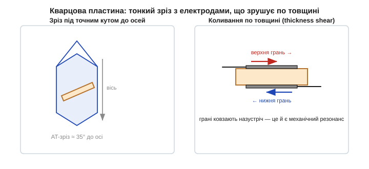
*Рис. 2.10.3.1. Будова кварцового резонатора. Ліворуч — з монокристала вирізають пластину під точним кутом до осей (популярний AT-зріз ≈ 35°). Праворуч — на грані наносять електроди; під змінною напругою грані пластини ковзають назустріч одна одній (коливання зсуву по товщині). Це і є механічний резонанс, частоту якого задає товщина пластини.*

Спосіб, у який коливається пластина, залежить від зрізу й розмірів. Найпоширеніший для частот від одиниць до десятків мегагерц — **AT-зріз** *(AT-cut)*, де пластина коливається **зсувом по товщині** *(thickness shear)*: верхня й нижня грані ковзають у протилежні боки, як дві карти колоди, що зрушуються одна відносно одної. Частота такого резонансу **обернено пропорційна товщині** пластини: що тонша — то вища частота (приблизно як обернено до товщини). Для типових мегагерцових кварців товщина — частки міліметра; кварц на 100 МГц прямим коливанням зробити вже важко, бо пластина вийшла б тоншою за фольгу й надто крихкою.

Кут зрізу обирають невипадково: при AT-зрізі частота **слабко залежить від температури** в широкому діапазоні — її температурна крива пласка біля кімнатних температур (про неї — §2.10.6), і це головна причина популярності AT. Інші зрізи мають інші переваги: годинниковий камертон (§2.10.7) ріжуть інакше, бо в нього інша частота й форма коливання. Зрізи позначають двобуквено (AT, BT, SC…), і кожен — компроміс між частотним діапазоном, температурною стабільністю й чутливістю до напружень.

Окремо варто згадати **гармоніки (овертони)**. Пластина може коливатися не лише на основній частоті, а й на непарних кратних — 3-й, 5-й, 7-й гармоніці (як струна, що дає не лише основний тон, а й обертони). Це дає шлях до високих частот: замість тоншати пластину до неможливого, кварц на, скажімо, 100 МГц роблять як резонатор на 33 МГц, що працює на 3-й гармоніці. Така деталь так і зветься — «overtone crystal», і генератор для неї треба будувати інакше, бо інакше він заведеться на основній частоті замість гармоніки. Для звичайних мегагерцових тактів цього не треба — там працюють на основній частоті.

### Чому Q кварцу на порядки вищий за LC-контур

Згадаймо, що таке добротність ([§2.3.6](../ch09-reactance-resonance/ch09-reactance-resonance.md)): Q — це міра того, **наскільки мало енергії втрачає резонатор за період** коливання. Формально Q = 2π · (запасена енергія) / (втрати за період). Високе Q означає малі втрати: розгойданий резонатор довго «дзвенить» після того, як його перестали штовхати, а його резонансний пік вузький і гострий. Низьке Q — швидке згасання й широкий розмитий пік.

Чому ж у LC-контурі Q невисоке? Бо там енергія снує між котушкою (магнітне поле) і конденсатором (електричне поле), і на кожному переливі частину її з'їдають втрати: активний опір дроту котушки гріється струмом, осердя має втрати на перемагнічування, конденсатор трохи протікає. Усі ці втрати неминучі для реальних деталей, тож Q реального LC-контуру рідко перевищує сотню-другу — на радіочастотах добре, якщо вийде 100–200.

У кварцу енергія запасається геть інакше — не в полях, а в **механічних коливаннях** пружного кристала, у пружній деформації самої ґратки. А механічні втрати в монокристалі кварцу мізерні з кількох причин разом: монокристал надзвичайно пружний і однорідний, без меж зерен, де гасла б енергія; внутрішнє тертя (загасання пружних хвиль) у ньому крихітне; кріплення зроблено у вузлах коливання, тож майже не відбирає енергії; а вакуумований корпус прибирає опір повітря. Усе це разом і дає те, чого LC ніколи не досягне: розгойданий кристал втрачає лише крихітну дрібку енергії за коливання, тож Q сягає **10⁴…10⁵**, а в особливих кварцах і мільйона. Це на два-три порядки більше за LC.


*Рис. 2.10.3.2. Згасання дзвону за однаковий проміжок часу. Угорі — LC-контур (Q≈100): коливання гаснуть за десятки періодів. Унизу — кварц (Q≈50 000): на тому самому відрізку амплітуда майже не падає. Що повільніше гасне резонатор, то стабільніше він тримає свою частоту.*

Є гарний спосіб відчути, що таке Q, через **число коливань загасання**: грубо кажучи, після поштовху резонатор зробить близько Q коливань, перш ніж помітно затихне. LC з Q = 100 «дзвенить» сотню періодів — частки мікросекунди, і по всьому. Кварц із Q = 50 000 «дзвенить» десятки тисяч періодів. Саме тому на рис. 2.10.3.2 за однаковий час LC встигає згаснути дощенту, а кварц майже не міняє амплітуди. Глибше зв'язок Q зі стабільністю — у [🧮 Q і стабільність](r10-s3-m-q-stability.md).

**Приклад (як довго «дзвенить» кварц).** Кварц на 8 МГц із Q = 80 000. Скільки приблизно триватиме його вільне згасання?

```
число коливань до згасання ≈ Q = 80 000
період одного коливання = 1/f = 1/8 000 000 = 0.125 мкс
час згасання ≈ 80 000 · 0.125 мкс = 10 000 мкс = 10 мс
```

Десять мілісекунд вільного «дзвону» в кристала завбільшки з зернятко — ціла вічність для електроніки. Цей самий час пояснює і повільний старт генератора (§2.10.8): щоб розгойдати такий добротний резонатор від шуму, теж потрібні мілісекунди. Висока Q — це палиця з двома кінцями: чудова стабільність, але млявий старт.

### Чому втрати вдається зробити такими малими

Варто трохи затриматися на тому, як інженери відвойовують кожну крихту Q, бо це показує, наскільки тонко зроблено кварцовий резонатор. Головний ворог Q — **витік енергії з пластини**, насамперед через точки кріплення: якщо закріпити пластину там, де вона активно рухається, коливання «витечуть» у тримач і згаснуть, як гасне струна, затиснута пальцем. Тому застосовують **захоплення енергії** *(energy trapping)*: електроди роблять трохи меншими за пластину й розташовують по центру, тож коливання зосереджуються в центральній зоні під електродами й майже не доходять до країв, де пластина кріпиться. Краї лишаються майже нерухомі — там і тримають.

Друге джерело втрат — **середовище**: молекули газу довкола пластини відбирають енергію при кожному коливанні. Тому добротні кварці герметизують у вакуумі або в розрідженому інертному газі. Третє — **домішки й дефекти** в кристалі: чим чистіший і досконаліший монокристал, тим менше внутрішнє тертя. Синтетичний кварц, вирощений у автоклаві, для цього навіть кращий за природний — він однорідніший. Складіть усе разом — захоплення енергії, вакуум, чистий монокристал, кріплення у вузлах — і дістанете ту саму Q у десятки тисяч, що недосяжна для жодного LC. За кожним порядком добротності стоїть конкретне інженерне рішення, а не просто «кварц такий від природи».

> 🔧 **Навіщо це.** Високе Q — це не абстрактна чеснота, а прямий шлях до стабільної частоти. Що вужчий резонансний пік, то «жорсткіше» резонатор тримається власної частоти й то менше її здатні зрушити сторонні впливи — паразитні ємності схеми, дрейф інвертора, наведення. Коли ви ставите кварц замість RC-генератора, ви фактично купуєте оцю гостроту піка: генератор просто **не може** коливатися помітно осторонь від f₀, бо поза вузькою смугою кристал не дає достатнього відгуку, щоб підтримати коливання.

### Гострий пік означає стабільну частоту

Зв'язок між Q і стабільністю найкраще видно на резонансній кривій. Високе Q — це вузький, гострий пік відгуку проти частоти. А генератор коливається там, де резонатор дає найбільший відгук, тобто на вершині піка.


*Рис. 2.10.3.3. Гострота резонансу й стабільність частоти. Широкий пік LC-контуру (Q≈100) дозволяє частоті помітно «гуляти» в межах смуги. Вузький пік кварцу (Q≈50 000) майже не лишає свободи — генератор тримається саме f₀. Що вужчий пік, то стабільніша частота.*

Уявіть, що якийсь зовнішній чинник намагається трохи зрушити частоту генератора — наприклад, дрейфнула паразитна ємність схеми чи «поплив» інвертор. У широкого піка (LC) сусідні частоти дають майже такий самий відгук, тож частота легко зміщується слідом за збуренням — система «не опирається». У гострого піка (кварц) досить крихітного відходу від f₀, щоб відгук різко впав, — а генератор завжди тягнеться туди, де відгук найбільший, тож його миттєво повертає назад до f₀. Образно: вузький пік — як глибока вузька яма, з якої кульку не викотити жодним поштовхом; широкий пік — пологе блюдце, де кулька вільно гуляє від найменшого нахилу. Висока Q — це і є та глибока яма.

Зробімо грубу оцінку, щоб відчути масштаб. Ширина резонансної смуги пов'язана з Q простим співвідношенням, яке ми вже бачили ([§2.3.6](../ch09-reactance-resonance/ch09-reactance-resonance.md)): смуга на рівні половини потужності ≈ f₀/Q. Що вища Q, то вужча смуга при тій самій центральній частоті.

**Приклад (смуга й «свобода» частоти: LC проти кварцу).** Порівняймо два резонатори на ту саму f₀ = 10 МГц.

```
LC-контур, Q = 100:
смуга = f₀ / Q = 10 000 000 / 100 = 100 000 Гц = 100 кГц
відносно f₀:     100 000 / 10 000 000 = 0.01 = 1 %  (тобто ±0.5 %)

кварц, Q = 50 000:
смуга = f₀ / Q = 10 000 000 / 50 000 = 200 Гц
відносно f₀:     200 / 10 000 000 = 0.00002 = 20 ppm
```

Двісті герц проти ста тисяч — у **п'ятсот разів** вужче, рівно у стільки разів, у скільки Q кварцу більша. Ось чому кварц тримає частоту з точністю в одиниці-десятки ppm, а LC — лише в частки відсотка: вузька смуга прямо обмежує, наскільки частота взагалі здатна зміститися. Сама фізика гострого механічного резонансу й дарує цю точність — не калібрування, не підбір деталей, а просто колосальна Q пружного кристала.

Тут варто застерегти від частої плутанини. Висока Q сама по собі **не гарантує**, що частота точно дорівнює номіналу, — вона гарантує лише, що частота **стабільна** й важко зрушується. Абсолютне значення (чи це рівно 10.000000 МГц, чи 10.000200 МГц) задається початковим допуском і навантажувальною ємністю (§2.10.5, §2.10.6); Q відповідає за те, щоб обране значення **не плавало**. Це знов та сама відмінність абсолютної точності й стабільності, що ми провели в §2.10.1: кварц блискуче дає стабільність, а абсолютну точність ще треба «налаштувати».

### Q як стійкість до фазових збурень

Є й точніший погляд на те, чому висока Q стабілізує частоту, — через **фазу**. У будь-якому генераторі частота встановлюється там, де повний фазовий зсув по петлі дорівнює потрібному (§2.10.5). Тепер уявімо, що щось у схемі додало невеликий паразитний зсув фази — нагрівся інвертор, дрейфнула ємність. Генератор мусить компенсувати цей зсув, трохи зрушивши частоту, бо фаза резонатора залежить від частоти. І ось ключове: **наскільки** доведеться зрушити частоту, щоб набрати потрібну поправку фази, залежить від того, **наскільки круто** фаза резонатора міняється з частотою біля резонансу. А ця крутість прямо пропорційна Q.

У кварцу з його гігантською Q фаза біля f₀ міняється надзвичайно круто: щоб набрати навіть помітний зсув фази, частоту треба зрушити лише на мізерну дрібку. Тому будь-яке паразитне збурення фази генератор «гасить» крихітним зсувом частоти. У низькодобротного LC фаза пологіша, тож те саме збурення тягне частоту куди сильніше. Образно: кварц — це жорстка фазова пружина, що майже не подається; LC — м'яка, що легко прогинається. Звідси загальне правило стабільності генераторів: **відносний зсув частоти від будь-якого фазового збурення обернено пропорційний Q**. Удвічі більша Q — удвічі стабільніша частота за тих самих збурень. Саме тому в погоні за стабільністю інженери завжди тягнуться до якнайвищої Q — і саме тому кварц з його десятками тисяч недосяжний для LC. Формальніше цей зв'язок розгорнуто у [🧮 Q і стабільність](r10-s3-m-q-stability.md).

Але як описати цей механічний резонатор мовою електричної схеми, щоб рахувати генератори навколо нього? Адже паяємо ми не «механічну Q», а компонент із двома виводами. Виявляється, для зовнішньої схеми кварц поводиться **точнісінько як певне коло з котушки, конденсатора й резистора** — і саме до цієї еквівалентної схеми ми тепер і переходимо.

## 2.10.4 Еквівалентна RLC-схема кварцу (модель Баттерворта–ван Дайка)

Кварц — механічний резонатор, але вмикають його в електричну схему. Щоб розраховувати генератори, нам потрібна **електрична модель** кристала — таке коло з R, L і C, яке для зовнішньої схеми поводилося б точнісінько, як кварц. Така модель давно є й зветься **схемою Баттерворта–ван Дайка** *(Butterworth–Van Dyke, BVD)*. Вона напрочуд проста — і пояснює одразу два резонанси кварцу й ту дивну «нереальність» його еквівалентних L та C.

### Механіку перекладаємо на R, L, C

Звідки взагалі впевненість, що механічний резонатор можна намалювати електричним колом? З глибокої аналогії між механічними й електричними коливаннями, яку ми вже бачили на маятнику й LC-контурі ([§2.3.5](../ch09-reactance-resonance/ch09-reactance-resonance.md)). Рівняння коливань однакові за формою, лише з різними «дійовими особами»: маса (інертність, що опирається зміні швидкості) грає роль індуктивності; пружність (що повертає тіло назад) — роль оберненої ємності (1/C); тертя (що з'їдає енергію) — роль опору. Якщо два явища описуються однаковими рівняннями, то й поводяться однаково — тож механічний резонанс **точно** відтворюється відповідним RLC-колом.

Механічний резонатор-кварц має всі три складники: масу рухомої частини пластини, пружність кристалічної ґратки й крихітні втрати на тертя. Перекладемо кожен в електричний еквівалент і дістанемо послідовне RLC-коло:

- **L₁** *(motional inductance)* — еквівалент **маси** колишеться пластини (інертність);
- **C₁** *(motional capacitance)* — еквівалент **пружності** кристала (що менша C₁, то «жорсткіша» пружина);
- **R₁** *(motional resistance, ESR)* — еквівалент механічних **втрат** (загасання).

Цю трійку звуть **механічною** (або *motional*) гілкою — вона описує сам резонанс і нічого більше. Але реальний кварц — це ще й фізична деталь: дві металеві грані-електроди з діелектриком-кварцом між ними. А дві пластини з діелектриком — це ж готовий **конденсатор** ([§2.1.1](../ch07-capacitor/ch07-capacitor.md))! Його ємність нікуди не дінеться й існує незалежно від того, коливається кристал чи ні. Тому паралельно до механічної гілки додають **C₀** *(shunt capacitance)* — статичну ємність електродів, виводів і корпусу. На відміну від «механічних» L₁ і C₁, ця C₀ — звичайнісінький фізичний конденсатор, який можна було б навіть зміряти на нерухомому кристалі.


*Рис. 2.10.4.1. Еквівалентна схема кварцу (BVD). Послідовна (motional) гілка R₁–L₁–C₁ описує механічний резонанс: L₁ — маса пластини, C₁ — пружність, R₁ — втрати. Паралельно стоїть C₀ — реальна ємність електродів і корпусу. Усе разом для зовнішньої схеми поводиться точнісінько як кварц.*

### «Нереальні» значення L та C

А тепер — найдивніше. Якщо взяти даташит кварцу й підставити числа, еквівалентні L₁ і C₁ виявляться **фізично немислимими** для звичайних деталей. Типовий кварц на кілька мегагерц має приблизно такі параметри:

```
L₁ ≈ 10 мГн … кілька Гн      (величезна індуктивність!)
C₁ ≈ 0.01 … 0.03 пФ          (мізерна ємність — соті частки пікофарада)
R₁ ≈ десятки … сотні Ом
C₀ ≈ 3 … 7 пФ                (звичайна ємність електродів)
```

Котушка на кілька **генрі** — це важезний моток дроту завбільшки з кулак (для порівняння: дроселі на платах — це мікро- й мілігенрі); конденсатор на **сотих частки пікофарада** взагалі годі виготовити окремо — це менше за паразитну ємність двох сусідніх доріжок плати! Як же кварц завбільшки з рисове зерно «містить» котушку на кулак? А він її не містить. Ці значення не «зроблені» з міді й діелектрика — вони лише **математичний переклад** механічних властивостей у мову електрики: величезна L₁ відбиває колосальну «інертність» (вузькість, повільність) гострого механічного резонансу, а крихітна C₁ — його надзвичайну «пружність» (жорсткість). Іншими словами, щоб електричне коло поводилося так само вибірково, як механічний кварц, йому й знадобилися б такі екзотичні номінали — а кварц дає їх «безкоштовно» самою своєю фізикою. Перевірмо, що ця пара дає правильну частоту:

**Приклад (частота з еквівалентних L₁, C₁).** Кварц із L₁ = 0.5 Гн і C₁ = 0.05 пФ. Послідовна резонансна частота — за формулою Томсона ([§2.3.5](../ch09-reactance-resonance/ch09-reactance-resonance.md)):

```
fs = 1 / (2·π·√(L₁·C₁))
L₁·C₁ = 0.5 · 0.05·10⁻¹²  = 2.5·10⁻¹⁴
√(L₁·C₁)                  = 1.58·10⁻⁷
fs = 1 / (2·π·1.58·10⁻⁷)  ≈ 1.0·10⁶ Гц = 1.0 МГц
```

Звичайні числа на виході — мегагерци, як і треба. Дивні L і C — це просто ціна, якою механічний резонанс описується в електричних термінах. Зате тепер видно, звідки береться величезне Q. Добротність послідовного контуру — Q = (1/R₁)·√(L₁/C₁); підставимо порядки величин:

```
Q = (1/R₁)·√(L₁/C₁)
з L₁ = 0.5 Гн, C₁ = 0.05 пФ, R₁ = 30 Ом:
√(L₁/C₁) = √(0.5 / 0.05·10⁻¹²) = √(10¹³) ≈ 3.16·10⁶
Q = 3.16·10⁶ / 30 ≈ 1.05·10⁵
```

Сто тисяч — те саме Q, про яке йшлося в §2.10.3, тільки тепер воно випало само з еквівалентних номіналів. Велика L₁ при крихітній C₁ дає величезне √(L₁/C₁), а малий R₁ ділить його на майже нічого — звідси й колосальна добротність. Усе сходиться: дивна електрична модель правильно відтворює і частоту, і гостроту резонансу реального кристала.

### Два резонанси: послідовний і паралельний

Тепер головна особливість, заради якої BVD взагалі потрібна, а не просто послідовний RLC. Через ту паралельну C₀ кварц має **не один, а два** близькі резонанси — і це принципово для генераторів, бо різні схеми працюють на різних із них.

Перший — **послідовний резонанс** *(series resonance, fs)*. На цій частоті реактивний опір L₁ і C₁ у механічній гілці взаємно гаситься (як у звичайному послідовному LC), і гілка має мінімальний опір — лише R₁. Кварц поводиться як майже чистий малий опір.

Трохи вище є другий — **паралельний резонанс** *(parallel / anti-resonance, fp)*. Тут механічна гілка вже стала індуктивною (вище fs L₁ переважає над C₁) і вступає в резонанс із паралельною C₀. На цій частоті повний опір кварцу різко зростає до максимуму.


*Рис. 2.10.4.2. Два резонанси кварцу. Реактанс X переходить через нуль на послідовній частоті fs (мінімум опору, кварц = малий резистор) і злітає в нескінченність на паралельній fp (максимум опору). Між fs і fp — вузьке «вікно», де кварц поводиться як величезна керована індуктивність. Відстань fp − fs — лише частки відсотка.*

Між fs і fp лежить вузьке «вікно» (зазвичай **частки відсотка** частоти — для типового кварцу fp перевищує fs лише на 0.1…0.5 %), де кварц виглядає як **дуже велика індуктивність**, що стрімко росте з частотою. Саме в цьому вікні й працюють генератори типу П'єрса ([§2.10.5](r10-resonators-references.md)): кристал заміняє в них котушку, тільки незрівнянно стабільнішу за будь-яку мідну. Тому такі генератори звуть «паралельно-резонансними»: вони ведуть кварц десь між fs і fp, де він індуктивний. А «послідовно-резонансні» схеми (рідші, у радіотехніці) ведуть кварц рівно на fs, де він — чистий малий опір.

Звідси і два режими паспортизації кварцу: на корпусі або в даташиті пишуть, на **який резонанс** його відкалібровано — послідовний (вказують просто частоту) чи паралельний (тоді обов'язково вказують навантажувальну ємність CL, бо без неї паралельна частота невизначена, §2.10.5). Поставити «паралельний» кварц у послідовну схему (чи навпаки) — типова помилка, через яку частота виходить на сотні ppm не та.

Мала відстань fp − fs дає інженерові ще й важіль: оскільки в паралельному режимі робоча точка лежить десь усередині вікна, її можна трохи «возити» по ньому, підкручуючи зовнішню ємність, — тобто **підстроювати частоту**. Діапазон підстроювання обмежений якраз шириною вікна fp − fs, тому він невеликий (одиниці-десятки ppm), але цього часто досить (про це — далі).

> 🔧 **Навіщо це.** Модель BVD — це не теорія заради теорії, а інструмент, що пояснює практику. Чому кварц у даташиті має параметр «навантажувальна ємність CL» (§2.10.5)? Бо робоча частота лежить між fs і fp і залежить від того, яку ємність кварц «бачить» зовні. Чому генератор іноді не стартує? Бо R₁ завеликий і петля не набирає підсилення (§2.10.5). Чому годинниковий кварц можна злегка підкрутити підбором конденсаторів? Бо ви рухаєте точку в вікні fs…fp. Усе це — прямі наслідки чотирьох елементів BVD.

### Як параметри BVD читаються в даташиті

Чотири елементи моделі — не абстракція: вони прямо виписані в даташиті кожного кварцу, лише іноді під іншими іменами. Корисно навчитися їх упізнавати, бо саме за ними добирають кварц під схему.

**R₁** часто значиться як **ESR** (*equivalent series resistance*) — той самий motional-опір. Його гранична величина (max ESR) — найважливіше для старту генерації: чим він менший, тим легше схемі розгойдати кристал. Виробник мікроконтролера у своєму даташиті теж задає «максимальний ESR кварцу, що гарантовано заведеться» — і два числа треба звірити: ESR обраного кварцу має бути нижчим за межу контролера.

**C₀** — «shunt» чи «static capacitance», звичайно 3…7 пФ; її іноді треба знати, щоб точно порахувати, як CL зсуває частоту.

**C₁** (motional) у даташиті трапляється рідше, але саме вона визначає **pullability** — наскільки сильно частота реагує на зміну CL: що більша C₁ відносно (C₀ + CL), то ширший діапазон підстроювання. Годинникові камертони мають крихітну C₁ — тому й тягнуться лише на одиниці ppm.

Є ще один зведений параметр — **відношення ємностей** r = C₀/C₁ (для кварцу — сотні-тисячі). Він показує, наскільки «слабка» механічна гілка проти статичної ємності, і прямо керує тим, наскільки вузьке вікно fp − fs. Велике r — вузьке вікно — мала pullability, зате й мала чутливість частоти до паразитних ємностей плати. Усе це — різні погляди на ту саму четвірку R₁, L₁, C₁, C₀.

**Приклад (наскільки вузьке вікно fp − fs).** Кварц із C₁ = 0.02 пФ і C₀ = 5 пФ. Відносна відстань паралельної частоти від послідовної приблизно дорівнює C₁/(2·C₀):

```
(fp − fs)/fs ≈ C₁/(2·C₀) = 0.02 / (2·5) = 0.002 = 0.2 %
для fs = 16 МГц:  fp − fs ≈ 0.002 · 16 000 000 = 32 000 Гц = 32 кГц
```

Усього 32 кГц на 16 МГц — оце і є все «поле для маневру» частоти. У цих 0.2 % і живе вся pullability: підстроювати частоту можна тільки в межах цього вузенького вікна, і ні на герц більше.

### Чого модель не показує

Як кожна модель, BVD — спрощення, і корисно знати її межі. По-перше, вона описує **один** резонанс. Та реальна пластина має ще й гармоніки (овертони, §2.10.3), а також паразитні «побічні» моди (*spurious modes*) — небажані способи коливання поряд з основним. Кожному з них відповідала б своя додаткова R-L-C гілка. Зазвичай їх ігнорують, бо генератор працює на основній моді, але інколи погано спроєктована схема «зачіпається» за побічну моду чи за гармоніку й заводиться не на тій частоті — і ось тоді про ці зайві гілки доводиться згадати.

По-друге, елементи BVD насправді **не зовсім сталі**: R₁ трохи росте з навантаженням, C₀ ледь залежить від частоти, а вся четвірка повзе з температурою (звідси й температурний дрейф, §2.10.6). Тобто BVD — це «миттєвий знімок» кварцу за фіксованих умов, добрий для розрахунку генератора, але не вічна істина.

І все ж саме ця проста чотириелементна модель — робочий інструмент, яким користуються щодня: вона з потрібною точністю передбачає і частоту, і два резонанси, і поведінку з навантажувальною ємністю, і умови старту. Складніші моделі (з гармоніками й побічними модами) дістають із шухляди лише тоді, коли проста перестає пояснювати дивну поведінку. Це типова інженерна мудрість: бери найпростішу модель, що ще працює, і ускладнюй лише за потреби.

### Що означають елементи фізично

Повернімося наостанок до фізичного сенсу четвірки — він допомагає не плутатися в знаках і залежностях. Велика **L₁** — це «важкість» резонансу: що більша еквівалентна маса (а в кварці вона мала за абсолютним значенням, зате в електричному перекладі дає генрі), то нижча частота й вужчий пік. Мала **C₁** — це «жорсткість» пружини: жорстка пружина — мала ємність — і вона ж робить резонанс гострим. **R₁** — це тертя: єдиний елемент, що з'їдає енергію, і саме він обмежує Q й вимагає від генератора підсилення для старту. **C₀** стоїть осторонь — це не частина резонансу, а просто ємність «конденсатора з електродів», що паразитно шунтує кристал; саме вона породжує другий, паралельний резонанс і трохи «зашумлює» картину біля fp.

Корисний уявний експеримент: що було б, якби C₀ не існувало? Тоді кварц був би чистим послідовним RLC з єдиним резонансом fs — як ідеальний камертон. Паралельного fp не було б зовсім, не було б і «вікна» індуктивності, і паралельні генератори стали б неможливі. Отже, саме небажана на перший погляд ємність електродів і дає кварцу його другий резонанс, на якому працює більшість схем. Прикра паразитна ємність обертається корисною властивістю — гарний приклад того, як у реальному компоненті «дефект» стає функцією.

Ще один наслідок фізичного погляду — чому кварц **не можна замінити звичайним LC**, навіть підібравши L і C на ту саму частоту. Бо щоб відтворити кварцову Q, котушці знадобилися б ті самі генрі при мікроскопічних втратах — а реальна котушка на кілька генрі має сотні ом опору дроту й Q у найкращому разі сотні. Електричними деталями таку добротність просто не зробити; її дає лише механіка кристала. Модель BVD це й показує наочно: номінали, що випадають із кварцу, для дискретних деталей фізично недосяжні.

## 2.10.5 Схема генератора: кварц + інвертор + два конденсатори (генератор П'єрса)

Кварц сам по собі лише **резонатор** — він уміє дзвеніти, але не підтримує коливань вічно: втрати R₁ їх гасять. Щоб дістати незатухаючий сигнал, кристал треба вмонтувати в **генератор** — схему, що сама себе розгойдує, поповнюючи втрачену енергію. Найпоширеніша така схема — **генератор П'єрса** *(Pierce oscillator)*. Саме він стоїть усередині майже кожного мікроконтролера, тож знати його будову мусить кожен.

### Що потрібно генератору: підсилення й зворотний зв'язок

Будь-який генератор — це **підсилювач, охоплений позитивним зворотним зв'язком** через частотно-вибірковий елемент. Згадаймо протилежний випадок: у підсилювачі з ОП ми навмисне будували **від'ємний** зворотний зв'язок, щоб приборкати підсилення й дістати стабільність ([§2.8.2](../ch13-opamp-comparator/ch13-opamp-comparator.md)). Генератор робить навпаки: повертає частину виходу на вхід **синфазно** (позитивно), щоб сигнал сам себе підживлював і наростав, а не гаснув.

Щоб коливання трималися незатухаючими, мусять виконатися дві умови разом (це **умови Баркгаузена** *(Barkhausen)*): по-перше, петлеве підсилення на робочій частоті — не менше за одиницю (підсилювач має поповнювати рівно стільки енергії, скільки з'їдають втрати; коли амплітуда мала, підсилення трохи більше за одиницю — і коливання наростають, поки не впруться в межу й підсилення не впаде до рівно одиниці). По-друге, повний зсув фази по петлі — нуль (чи кратний 360°), щоб сигнал, обійшовши коло, повернувся «в ногу» сам із собою. Вибірковий елемент стежить, аби обидві умови збігалися **лише на одній частоті** — інакше схема коливалася б де завгодно або на кількох частотах разом. Саме кварц робить це збігання гранично гострим.

У генераторі П'єрса ролі розподілені так:

- **підсилювач** — звичайний логічний **інвертор** усередині мікроконтролера (по суті CMOS-каскад, [§2.7.9](../ch12-mosfet/ch12-mosfet.md));
- **вибірковий елемент зворотного зв'язку** — наш **кварц**, увімкнений між виходом і входом інвертора;
- **два конденсатори** (C₁ і C₂) — від кожного виводу кварцу на землю; вони задають правильні фази й «навантажують» кристал;
- **резистор зворотного зв'язку Rf** — паралельно інвертору; зміщує його в лінійний режим (у середину передатної характеристики), щоб він був підсилювачем, а не просто логічним вентилем.

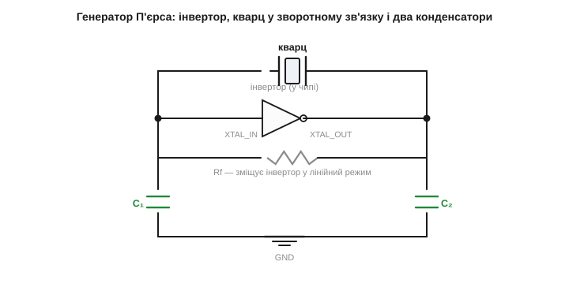
*Рис. 2.10.5.1. Класична схема П'єрса. Інвертор (у чипі) працює підсилювачем; резистор Rf зміщує його в лінійний режим. Кварц замикає зворотний зв'язок з виходу (XTAL_OUT) на вхід (XTAL_IN). Конденсатори C₁ і C₂ від виводів кварцу на землю задають фазу й навантажують кристал. Виводи XTAL_IN/XTAL_OUT — це і є ніжки мікроконтролера.*

Працює це так. Інвертор сам по собі перевертає сигнал — додає 180° фази. Щоб зворотний зв'язок став позитивним, бракує ще 180°, і їх дає фазообертальна ланка з кварцу й двох конденсаторів. У вікні fs…fp кварц виглядає як велика індуктивність ([§2.10.4](r10-resonators-references.md)), а з C₁ і C₂ на землю він утворює П-подібну ланку (кварц-індуктивність між двома ємностями на землю), що додає рівно ті 180°, яких бракувало, — і саме на частоті всередині вікна fs…fp. Інвертор додає підсилення. На частоті, де петлеве підсилення ≥1 і повна фаза кратна 360°, коливання самопідтримуються; на всіх інших — гаснуть. Кварц робить це вікно гранично вузьким, тому частота генератора міцно прив'язана до f₀ кристала й не «гуляє» слідом за дрейфом інвертора чи конденсаторів.

Звідки беруться самі коливання, якщо спершу їх нема? Зі шуму. У момент увімкнення на вході інвертора завжди є крихітний теплові й перемикальні шуми — суміш усіх частот. Петля підсилює їх, але на всіх частотах, крім робочої, фаза «не та» й вони гаснуть; а от складова рівно на резонансі кварцу повертається синфазно, підсилюється, повертається знову — і наростає по колу, поки амплітуда не впреться в межу (рейки живлення інвертора), де підсилення природно падає до одиниці. Відтоді генератор коливається стабільно. Цей розгін від шуму й займає час старту (§2.10.8): що вища Q, то повільніше «розгойдується дзвін».

Тут варто прояснити важливий момент про **амплітуду**. У стабільному режимі петлеве підсилення мусить дорівнювати рівно одиниці — не більше й не менше. Якби воно лишалося більшим, амплітуда росла б нескінченно; якби меншим — коливання згасли б. Як же воно саме встановлюється на одиниці? Через **нелінійність** інвертора: поки амплітуда мала, інвертор працює в лінійній зоні з великим підсиленням (понад одиницю — коливання наростають), але щойно розмах сягає рейок живлення, інвертор починає «обрізатися», і його ефективне підсилення на основній частоті падає. Амплітуда зупиняється рівно там, де середнє підсилення за період дорівнює одиниці. Це автоматичне саморегулювання — генератор сам знаходить свій рівень, без жодної окремої схеми. У точних генераторах (TCXO, §2.10.9) додають справжнє автоматичне регулювання підсилення, щоб тримати амплітуду малою й синусоїдальною заради чистоти спектра, але в простому П'єрсі вистачає й «обрізання» об рейки.

Який сигнал реально побачимо на ніжках? На вході інвертора (XTAL_IN) — майже чиста синусоїда невеликого розмаху (кварц з конденсаторами добре фільтрує гармоніки), а на виході (XTAL_OUT) — сигнал, наближений до прямокутного, бо інвертор підсилює до насичення. Звідси й практична осторога діагностики: торкатися виводу кварцу щупом осцилографа треба обережно — щуп додає кілька пікофарад паразитної ємності прямо в чутливий вузол, що змінює CL, зсуває частоту, а часом і зовсім зриває генерацію. Тому генератор зазвичай дивляться через буфер або на вже поділеному виході такту, а не «в лоб» на кварці.

### Навантажувальна ємність CL

Найважливіший практичний параметр — **навантажувальна ємність** *(load capacitance, CL)*. Це та сумарна ємність, яку кварц «бачить» з боку схеми. Пригадаймо: робоча частота генератора лежить у вікні fs…fp, а де саме — залежить від цієї зовнішньої ємності. Виробник кварцу вказує в даташиті, **під яку CL** його відкалібровано (типово 8, 12, 18 чи 20 пФ): лише навантаживши кварц саме такою ємністю, ви дістанете точно ту частоту, що написана на корпусі.

Конденсатори C₁ і C₂ стоять послідовно з боку кварцу (від виводу на землю й через землю до другого виводу), тож їхній внесок — як у послідовно з'єднаних конденсаторів ([§2.1.7](../ch07-capacitor/ch07-capacitor.md)). Плюс завжди є паразитна ємність ніжок чипа й доріжок плати (Cпар, зазвичай 3…5 пФ). Повна формула:

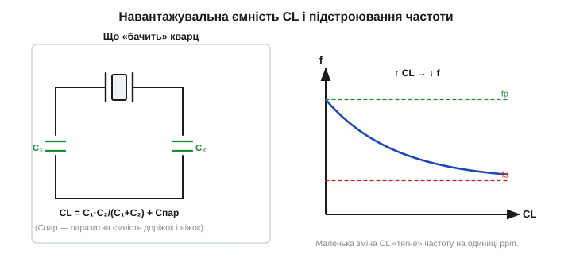
*Рис. 2.10.5.2. Навантажувальна ємність і підстроювання. Ліворуч: кварц бачить C₁ і C₂ як послідовно з'єднані, плюс паразитну ємність — CL = C₁·C₂/(C₁+C₂) + Cпар. Праворуч: частота монотонно залежить від CL — більша CL тягне частоту вниз (до fs), менша — вгору (до fp). Маленька зміна CL зсуває частоту на одиниці ppm.*

**Приклад (підбір конденсаторів під задану CL).** Кварц вимагає CL = 18 пФ. Паразитну ємність плати оцінюємо в Cпар ≈ 5 пФ. Симетрично беремо C₁ = C₂ = C. Тоді:

```
CL = C·C/(C+C) + Cпар = C/2 + Cпар
18 = C/2 + 5
C/2 = 13   →   C = 26 пФ
```

Беремо найближчий стандартний номінал — 27 пФ на кожен вивід. Якби паразитну ємність недооцінити, реальна CL виявиться більшою за 18 пФ — і частота трохи **занизиться**; саме так і виникають дрібні похибки годинників «з коробки».

Оскільки частота залежить від CL, зміною конденсаторів її можна **підстроювати**. Збільшуєш CL — частота повзе вниз (до fs); зменшуєш — угору (до fp). Інтуїція проста: більша зовнішня ємність «пом'якшує» сумарну реактивність, зсуваючи робочу точку ближче до послідовного резонансу fs, що лежить нижче. Чутливість цього важеля характеризують параметром «pullability» — скільки ppm на пікофарад; біля номінальної CL вона нелінійна (що менша CL, то різкіше частота реагує). Діапазон такого «возіння» невеликий — одиниці-десятки ppm, бо вікно fs…fp вузьке (§2.10.4), — але цього досить, щоб скоригувати дрібний дрейф або вивести годинник точно на номінал. У годинникових кварцах для цього іноді ставлять навіть підстроювальний конденсатор, а в TCXO керовану ємність (варікап) рухає сама схема компенсації (§2.10.9).

> 🔧 **Навіщо це.** Коли ви розводите плату з мікроконтролером, кварц і два конденсатори ставлять **упритул до ніжок чипа**, короткими доріжками. Причина пряма: кожен зайвий пікофарад паразитної ємності й кожен зайвий наногенрі довгої доріжки збивають CL і фазу, зміщуючи частоту або взагалі зриваючи генерацію. А номінали C₁/C₂ беруть **під CL з даташита кварцу** — не «на око». Дві найчастіші причини, чому годинник пристрою «бреше» або генератор не стартує, — це неправильні конденсатори й довгі доріжки до кварцу.

### Чому генератор може не стартувати

Найчастіший «загадковий» дефект із кварцом — генератор просто не заводиться, і пристрій або мовчить, або висить. Корінь майже завжди в порушенні однієї з умов Баркгаузена. По-перше, петля має давати підсилення **з запасом** (на практиці беруть запас разів у п'ять, щоб гарантувати старт навіть для найгіршого екземпляра кварцу й на холоді). А це підсилення з'їдає R₁ кварцу ([§2.10.4](r10-resonators-references.md)): якщо опір кристала завеликий (старий, неякісний чи перегрітий при паянні кварц), а вбудований інвертор слабкий, петлеве підсилення не дотягує до одиниці — і коливання не народжуються взагалі. По-друге, **завелика CL** теж глушить старт: чим важче навантажений кристал, тим більше підсилення треба, щоб його розгойдати, тож надмірні C₁/C₂ або зайва паразитна ємність довгих доріжок можуть зірвати генерацію.

Тому виробники мікроконтролерів задають у даташиті граничний R₁ (часто звуть «максимальний ESR кварцу») і рекомендовану CL для вбудованого генератора — і кварц треба добирати під ці межі, а не навмання. Інші типові причини: «паралельний» кварц у схемі, розрахованій на іншу CL; забуто резистор Rf (тоді інвертор не в лінійному режимі); надто довгі доріжки до кварцу (зайва паразитна ємність і наведення); вологість чи бруд між виводами (паразитний витік). Покрокова діагностика «чому не стартує» — від перевірки номіналів до огляду розведення — окрема практична тема ([⚙️ діагностика генератора](r10-s5-a-oscillator-debug.md)). А правила розведення (корпуси HC-49 і SMD, конденсатори впритул до чипа) — у [🔌 кварц на платі](r10-s5-c-crystal-layout.md).

### Резистор у виводі й чистота сигналу

Подеколи в схемі П'єрса бачимо ще один резистор — послідовний, у виводі XTAL_OUT між інвертором і кристалом (його звуть Rs, *series* чи *drive-limiting resistor*). Навіщо він, якщо й так усе працює? Він обмежує **потужність, що вганяється в кристал**. Кварц — крихка механічна деталь; якщо інвертор надто сильний, він розгойдує пластину з надмірною амплітудою, а це і пришвидшує старіння, і навіть здатне з часом її пошкодити (особливо тендітний годинниковий камертон). Послідовний Rs разом із C₂ утворює дільник, що пом'якшує розгойдування до безпечного рівня. Параметр, що це нормує, — **drive level** (рівень збудження, у мікроватах); даташит кварцу задає його максимум, і Rs підбирають так, щоб у нього вкластися. У сучасних мікроконтролерів сила інвертора часто регулюється програмно, тоді зовнішній Rs не потрібен.

Цей самий Rs трохи покращує й **форму сигналу**: він пригладжує надто різкі фронти на виході інвертора, зменшуючи паразитне випромінювання й «дзвін». Тут варто згадати важливе правило безпеки сигналу: вивід кварцу — **високоомний і чутливий вузол** з мізерними струмами, тож будь-яка швидка лінія, що пройде поряд по платі, наведе на нього перешкоду й здатна збити частоту чи зірвати генерацію. Тому кварцовий контур не лише ставлять упритул до чипа, а й по змозі огороджують від швидких цифрових доріжок — окрема земляна заливка довкола кварцу тут звичайна практика.

### Чим П'єрс кращий за інші схеми

Генератор П'єрса — не єдина схема кварцового генератора (є ще Колпітца, Клараппа, осцилятори на двох інверторах), але саме він став стандартом «усередині чипа», і варто розуміти чому. По-перше, він вимагає **лише одного активного елемента** — одного інвертора, який у будь-якому цифровому чипі вже є; не треба ні котушки, ні складної обв'язки. По-друге, обидва конденсатори C₁ і C₂ стоять **на землю**, а не між вузлами, тож їхню роль чудово грають навіть паразитні ємності виводів, і схема нечутлива до них. По-третє, кристал тут увімкнено між входом і виходом інвертора, де він працює як вузький фільтр зворотного зв'язку, — а це дає чисту, стабільну генерацію саме на f₀. Через цю простоту й невибагливість виробники чипів і вбудовують саме П'єрс: користувачеві лишається додати кварц і два конденсатори — і генератор готовий. Тому, відкривши майже будь-який мікроконтролер, на ніжках OSC_IN/OSC_OUT ви побачите саме цю схему.

## 2.10.6 Точність у ppm: температурний дрейф, старіння, допуск

Кварц стабільний — але не ідеальний. Його частота все ж відхиляється від номіналу, тільки на крихітні величини. Щоб говорити про них, інженери користуються одиницею **ppm** *(parts per million — частин на мільйон)*. Зрозуміти, що таке «±20 ppm» і в які реальні секунди це виливається, конче потрібно: саме за цим числом обирають кварц під задачу й вирішують, чи його взагалі досить.

### Що таке ppm

Один ppm — це **одна мільйонна частка**, тобто 10⁻⁶, або 0.0001 %. Це просто зручніший спосіб записати дуже малий відсоток: 20 ppm = 0.002 % = 0.00002. Запис «±20 ppm» означає, що частота може відхилятися від номіналу не більш ніж на 20 мільйонних у будь-який бік. Щоб перекласти ppm у герци, множать номінал на ppm·10⁻⁶: для кварцу на 10 МГц ±20 ppm — це ±200 Гц; для годинникового на 32768 Гц — лише ±0.65 Гц.

ppm зручний саме тому, що **безрозмірний** і не прив'язаний до конкретної частоти. Це принципово: одна й та сама технологія кварцу (той самий зріз, та сама якість) дає приблизно ту саму **відносну** похибку незалежно від номіналу — і 10 МГц, і 20 МГц кварц того самого класу матимуть, скажімо, ±30 ppm. Тому в даташитах усе нормують у ppm, а вже потім перекладають у герци чи секунди під конкретний випадок. Це дозволяє порівнювати джерела частоти між собою однією міркою, не плутаючись у різних номіналах. Арифметика перекладу проста й варта окремого тренування ([🧮 ppm-арифметика](r10-s6-m-ppm-math.md)).

Той самий ppm міряє й **дрейф швидкості зв'язку**. Якщо UART налаштовано на певну швидкість, а генератор має ±30 ppm, то й реальна швидкість плаває на ±30 ppm — мізер проти бюджету в кілька відсотків (§2.10.1). Звідси видно, чому десятки ppm кварцу для зв'язку — це з колосальним запасом: похибка в тисячу разів менша за дозволену.

Найнаочніше ppm перекладається в **похибку годинника**. У добі 86 400 секунд. Похибка частоти в X ppm дає похибку часу X мільйонних від доби:

```
похибка за добу = 86 400 с · X·10⁻⁶ = 0.0864·X  секунд
```

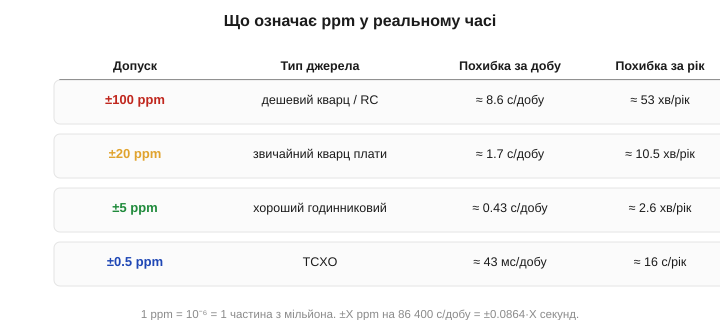
*Рис. 2.10.6.1. Переклад ppm у секунди. Дешевий кварц чи RC (±100 ppm) набігає ≈8.6 с/добу (≈53 хв/рік). Звичайний кварц плати (±20 ppm) — ≈1.7 с/добу (≈10 хв/рік). Хороший годинниковий (±5 ppm) — ≈0.4 с/добу. TCXO (±0.5 ppm) — лічені десятки мілісекунд за добу. Кожен крок точності — приблизно вдесятеро менша похибка.*

**Приклад (±20 ppm у секундах на добу).** Звичайний кварц плати з допуском ±20 ppm:

```
за добу:  0.0864 · 20 = 1.73 с/добу
за рік:   1.73 · 365  ≈ 631 с ≈ 10.5 хв/рік
```

Близько хвилини за місяць. Для багатьох пристроїв прийнятно; для точного годинника, що має йти роками без звіряння, — забагато, і тоді його періодично синхронізують по мережі або беруть точніше джерело (§2.10.9).

Той самий переклад працює в обидва боки — від вимоги до потрібного ppm. Якщо замовник каже «годинник не повинен набігати більш ніж на 5 секунд за добу», ділимо: 5 / 0.0864 ≈ 58 ppm, отже згодиться навіть пересічний кварц на ±50 ppm. А вимога «не більш ніж 10 секунд за рік» (10 / 365 / 0.0864 ≈ 0.32 ppm) одразу відсікає звичайний кварц і веде до TCXO. Тому перше, що роблять із будь-якою вимогою до часу чи частоти, — переводять її в ppm: це спільна мова, якою говорять і вимоги задачі, і даташити компонентів.

**Приклад (зв'язок двох пристроїв: чи зійдуться частоти).** Два пристрої обмінюються по UART; перший має кварц ±30 ppm, другий — ±50 ppm. Чи вкладаються вони в бюджет ±2 % на сторону (§2.10.1)?

```
сумарна можлива розбіжність = 30 + 50 = 80 ppm = 0.008 %
бюджет (сумарний) ≈ 5 % (по 2.5 % на сторону, з запасом 2 %)
0.008 % проти ~4 % дозволених  →  запас у 500 разів
```

Навіть склавши похибки обох сторін у найгіршому напрямі, маємо 80 ppm — у сотні разів менше за дозволене. Ось чому кварцом UART «просто працює»: бюджет розсинхронізації витрачено на крихту. А тепер замініть один кварц на RC ±5 % (50 000 ppm) — і та сама сума вибухне далеко за межу, пакети поб'ються. Це й є кількісне обґрунтування правила «для зв'язку — кварц».

### Три складники похибки

Сумарний допуск кварцу складається з кількох внесків, і важливо їх розрізняти, бо борються з ними по-різному.

**Початковий допуск** *(initial / calibration tolerance)* — наскільки частота відхилена від номіналу одразу, на заводі, за кімнатної температури. Це розкид виготовлення: ніяка пластина не виходить ідеально точного розміру. Типово ±10…±30 ppm для звичайних кварців. Цей внесок сталий — його можна один раз скоригувати підбором CL (§2.10.5) або врахувати програмно.

**Температурний дрейф** *(temperature drift)* — найбільший і найпідступніший внесок, бо він не сталий, а змінюється разом з умовами роботи. Частота кварцу залежить від температури, бо з нагрівом трохи змінюються пружність ґратки й розміри пластини, а від них залежить власна частота. Форма цієї залежності задається **зрізом** — і це знов причина, чому зріз обирають так ретельно. У популярного AT-зрізу температурна крива має пологий **кубічний** хід — S-подібну криву з точкою перегину біля кімнатної температури: поблизу 25 °C нахил майже нульовий (частота ледь міняється), а на краях діапазону (−40 чи +85 °C) відхилення сягає десятків ppm у різні боки. Саме тому AT-зріз і люблять у звичайній техніці — він найпласкіший там, де пристрій працює найчастіше, тобто за кімнатних температур.

**Приклад (внесок температури в загальний бюджет).** Кварц AT-зрізу з паспортом: початковий допуск ±10 ppm, температурний дрейф ±20 ppm у діапазоні −20…+70 °C, старіння ±3 ppm/рік. Який сумарний допуск за 5 років служби?

```
початковий:        ±10 ppm
температура:        ±20 ppm
старіння за 5 р.:   ±3 · 5 = ±15 ppm  (грубо, насправді менше — хід сповільнюється)
сумарно (найгірше): ±(10 + 20 + 15) = ±45 ppm
```

Температура тут — найбільший одинак, і саме її прибирають у TCXO та OCXO (§2.10.9), щоб із ±45 ppm зробити одиниці ppm.

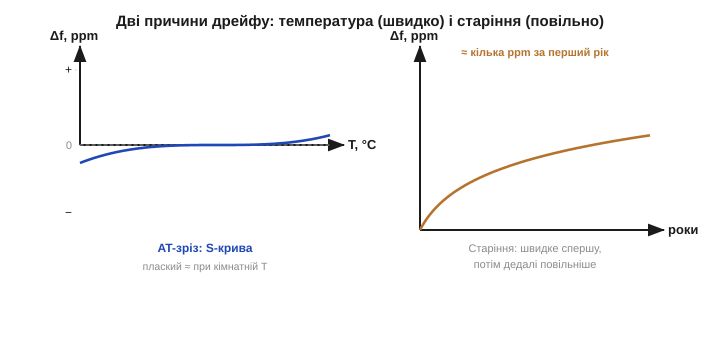
*Рис. 2.10.6.2. Дрейф частоти кварцу. Ліворуч — температурна крива AT-зрізу: пологий кубічний хід, майже плаский біля кімнатної температури й крутіший на краях діапазону. Праворуч — старіння: частота повзе з часом, швидко в перший рік і дедалі повільніше потім (логарифмічний хід). Перше борють компенсацією (§2.10.9), друге — попереднім «вистоюванням» кварцу.*

**Старіння** *(aging)* — повільний дрейф частоти з часом, навіть за сталої температури. Причини — поступова релаксація механічних напружень у кристалі й кріпленні, осідання чи перерозподіл мікрозабруднень на пластині (а маса пластини задає частоту, тож навіть наномірні зміни маси її зсувають). Типово кілька ppm за перший рік, далі дедалі менше — хід логарифмічний, найшвидше спочатку, бо найбільші напруження «відпускають» першими. Боротися можна попереднім штучним старінням («вистоюванням») кварцу на заводі — кристал витримують при підвищеній температурі, щоб найбурхливіша фаза дрейфу минула ще до встановлення; покупцеві дістається вже «заспокоєний» резонатор.

Є й дрібніші чинники: залежність від напруги живлення інвертора (зміна живлення трохи зсуває робочу точку), від навантаження на виході, чутливість до механічної вібрації й до прискорення (важливо для рухомої техніки). Сумарний паспортний допуск («overall frequency tolerance») записують як суму найгірших значень усіх внесків у ppm — початковий допуск плюс температурний діапазон плюс старіння за термін служби. Саме це підсумкове число порівнюють з вимогою задачі, бо воно гарантує: за будь-яких умов за весь строк служби частота не вийде за ці межі.

Тут варто застерегти від частої помилки новачка — брати з даташита **лише початковий допуск** і думати, що це й є точність. Виробник нерідко виносить у назву чи на першу сторінку гарне число «±10 ppm», а воно стосується тільки заводського калібрування за +25 °C. Реальна ж точність у вашому пристрої — це сума з температурою й старінням, тобто ті самі ±45 ppm із прикладу вище. Тому, читаючи кварцовий даташит, шукають **усі три** числа окремо: frequency tolerance (початкове), frequency stability (по температурі) і aging — і додають їх. Інакше легко спроєктувати годинник «на ±10 ppm», що насправді набігає вп'ятеро більше.

### Як точність записують у даташиті

Корисно знати й форму, у якій ці числа подають. Початковий допуск і температурну стабільність часто наводять **окремими рядками** в одиницях ppm, причому температурну — ще й із прив'язкою до діапазону («±20 ppm, −20…+70 °C»). Іноді замість числа дають **графік** залежності частоти від температури — ту саму S-криву AT-зрізу; з нього зчитують відхилення для свого діапазону (зчитувати такі графіки — окрема навичка, бо осі бувають нерівномірні). Старіння подають як «ppm за перший рік» і часто окремо «ppm за 10 років». Робочий і складський діапазони температур — теж окремо, і їх не можна плутати: складський ширший, але точність гарантують лише в робочому.

Є й буквені **коди стабільності** (на кшталт тих, що в конденсаторів), та на практиці частіше орієнтуються на явні ppm-числа. Головне — звичка: знайти в таблиці всі внески, перевести в єдині ppm і скласти. Прочитати ці рядки правильно — половина успіху у виборі кварцу, і саме цьому присвячено вміння читати даташити з [§2.9](../r09-reading-datasheets/r09-reading-datasheets.md).

> 🔧 **Навіщо це.** Коли в даташиті кварцу бачите «±50 ppm overall», розумійте це як обіцянку: за весь термін служби, у всьому діапазоні температур, з урахуванням старіння — частота не вийде за ±50 ppm. Звідси прямий розрахунок: чи вкладається ваш UART у свій бюджет розсинхронізації, чи набіжить годинник прийнятно мало, чи спіймає приймач потрібну смугу. Якщо ±50 ppm замало — далі по піраміді точності: годинниковий кварц із компенсацією, TCXO, OCXO (§2.10.9). Якщо забагато точності за ваші гроші — простий кварц чи навіть керамічний резонатор (§2.10.8).

### Систематична похибка проти випадкової: чому годинник можна підкрутити

Корисно зрозуміти, які з цих внесків можна **прибрати**, а які — ні. Початковий допуск і температурна крива — **систематичні**: вони передбачувані й повторювані. Початковий зсув сталий, тож його раз вимірюють і коригують (підбором CL або програмною поправкою лічильника). Температурну криву теж знають наперед, тож за виміряною температурою її можна порахувати й скомпенсувати — на цьому стоять і TCXO (§2.10.9), і програмна термокомпенсація в точних RTC. Старіння повільне й майже лінійне на коротких відрізках, тож його теж частково коригують, періодично звіряючись із точнішим джерелом.

А от **випадкову** складову — джиттер, шум, миттєві коливання — скомпенсувати не можна: вона непередбачувана за означенням. На щастя, для відліку часу вона майже не шкодить, бо за довгий час усереднюється в нуль (плюси й мінуси компенсуються). Тому годинник, який «у середньому» йде правильно, накопичує помилку лише від систематичних внесків — а їх можна виміряти й вибрати. Звідси й знайома практика: пристрій час від часу синхронізує годинник по мережі чи з GPS і заразом **вимірює власний дрейф** — наскільки його кварц поспішає чи відстає; далі він може сам додавати поправку й між синхронізаціями йти точніше, ніж дозволяє «голий» кварц. Як це робиться на практиці — накопиченням різниці з точнішим джерелом — окрема прикладна тема ([⚙️ виміряти власний дрейф](r10-s6-a-measure-drift.md)).

**Приклад (скільки дає програмна поправка).** Кварц поспішає на +25 ppm — стале, виміряне відхилення. Без поправки годинник набігає 0.0864·25 ≈ 2.2 с/добу. Що буде, якщо програмно віднімати цей відомий зсув?

```
без поправки:           +25 ppm  →  +2.2 с/добу
після віднімання 25 ppm: лишається ~ ±1…2 ppm
   (залишок — від похибки вимірювання дрейфу та його повзучості)
після поправки:          ~0.1…0.2 с/добу
```

Просте віднімання відомого систематичного зсуву збиває похибку приблизно в десять разів — з двох секунд на добу до часток секунди, не міняючи жодної деталі. Ось чому навіть дешевий кварц із програмною поправкою дрейфу йде точніше за «голий»: ми прибрали найбільший, передбачуваний внесок. Лишається тільки те, що поправити не можна, — повзучість і шум.

Підсумуймо мову точності одним рядком. ppm — універсальна мірка відносної похибки; перекладається в час множенням на тривалість (0.0864·X секунд за добу) і в частоту множенням на номінал. Похибка ділиться на систематичну (передбачувану й кориговну) і випадкову (шум, що усереднюється). А повний паспортний допуск — це гарантована верхня межа суми всіх внесків, з якою й порівнюють вимогу задачі.

## 2.10.7 Годинниковий кварц 32768 Гц і RTC

Серед усіх кварців є один особливий, що трапляється чи не в кожному пристрої з годинником: резонатор на **32768 Гц**. Це дивне на вигляд число — насправді найрозумніший вибір для відліку **реального часу**, а сам кварц і схема навколо нього влаштовані інакше, ніж мегагерцові «такти». Розберімося, чому саме 32768 і як на ньому будують годинник реального часу — **RTC** *(real-time clock)*.

### Чому саме 32768 = 2¹⁵

32768 — це рівно **2¹⁵**, два в п'ятнадцятому степені. У цьому й уся розгадка дивного числа. Годиннику потрібен сигнал з періодом рівно **одна секунда** — від нього він нарощує лічильник секунд, далі хвилин, годин, діб. Постає питання: як з частоти кварцу зробити рівно один тік на секунду? Найдешевший спосіб поділити частоту в цифровій схемі — **навпіл**: один тригер-лічильник (T-тригер) перемикається на кожному другому фронті входу й на виході дає рівно вдвічі нижчу частоту. Це коштує одного тригера й не вносить жодної похибки — поділ на 2 точний за самою природою.

Тепер поставимо такі тригери ланцюжком: кожен ділить навпіл те, що дав попередній. Після n тригерів частота поділиться на 2ⁿ. Скільки треба, щоб з 32768 Гц дістати 1 Гц? Рівно п'ятнадцять, бо 2¹⁵ = 32768. І тоді 32768 Гц, поділена на 2¹⁵, дає **точно 1.000000 Гц** — одну секунду без жодного округлення, самими лише поділами навпіл, без хитрої арифметики.

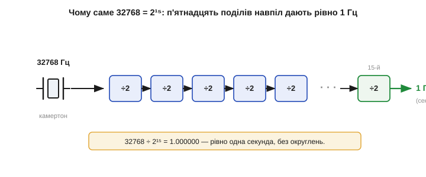
*Рис. 2.10.7.1. Чому 32768 = 2¹⁵. Камертонний кварц дає 32768 Гц. Ланцюжок із п'ятнадцяти тригерів-дільників, кожен ділить частоту навпіл, перетворює її точно на 1 Гц — одну секунду. 32768 ÷ 2¹⁵ = 1.000000, без залишку. Будь-яке інше близьке число дало б дробову секунду.*

Тепер видно, чому не взяли «кругле» 30000 чи 50000 Гц. Поділ на двійки з 30000 ніколи не дасть цілого числа герц (30000/2¹⁴ = 1.83…), і щоб дістати секунду, довелося б ділити на 30000 спеціальним лічильником — дорожче, більше логіки, більше струму. А 2¹⁵ ділиться навпіл чисто п'ятнадцять разів — і весь дільник зводиться до простого ланцюжка тригерів.

Чому ж саме п'ятнадцятий степінь, а не, скажімо, 2¹⁰ (1024 Гц) чи 2²⁰ (понад мільйон)? Тут компроміс. З одного боку, частота має бути **достатньо низькою**, щоб споживання було крихітним: CMOS-логіка споживає тим менше, чим рідше перемикається ([§2.7.9](../ch12-mosfet/ch12-mosfet.md)), а годинник мусить цокати від маленької батарейки **роками** на одиницях мікроампер. З іншого — надто низька частота дала б завелику й крихку пластину та гірше Q. 32768 Гц (≈ 32.8 кГц) — золота середина: камертон такої частоти виходить мікроскопічним і добротним, а 15 поділів — небагато логіки. Тому ця частота й стала світовим стандартом годинникових кварців; її ще називають «watch crystal» чи просто «32k».

Варто оцінити й точність такого ділення. Поділ на 2 — ідеально точна операція: тригер не вносить ні крихти похибки, він лише рахує фронти. Тож **уся** похибка годинника походить винятково від самого кварцу — від того, наскільки 32768 Гц справді дорівнюють 32768 Гц. Дільник нічого не псує і нічого не виправляє. Це й добре (нема зайвих джерел похибки), і вимогливо: точність годинника цілком лягає на резонатор, тому до годинникового кварцу й висувають окремі вимоги щодо допуску й температурної кривої (далі).

### Камертонний кристал у циліндрику

Годинниковий кварц і виглядає інакше, і коливається інакше за мегагерцовий. Щоб дістати таку низьку частоту, пластину довелося б зробити завеликою, тож кристал вирізають у формі крихітного **камертона** *(tuning fork)* — двозубої «виделки», зубці якої коливаються назустріч одне одному, точнісінько як зубці справжнього камертона. Розміри підібрано так, щоб власна частота цих коливань була рівно 32768 Гц. Цю мікроскопічну виделку запаковують у характерний маленький металевий **циліндрик** (корпус близько 2×6 мм), часто у вакуумі.

Чому саме виделка, а не пластина, як у мегагерцового кварцу? Бо частота зсуву по товщині (AT-зріз) обернено пропорційна товщині, і щоб дістати низькі 32 кГц, пластину довелося б зробити абсурдно товстою — кілька сантиметрів, що несумісно з годинником. А камертон коливається **згином зубців**, і його частота задається довжиною й товщиною зубців у зовсім інший спосіб: маленька виделка кількох міліметрів завдовжки якраз дає 32 кГц. Тобто форму обрали під частоту: для високих частот зручний тонкий зсув по товщині, для низьких — згинальний камертон. Це знов нагадування, що **спосіб коливання** — повноцінний параметр конструкції, а не дрібниця.

Камертонна форма дає дуже високе Q при малих розмірах, але має й слабину: такий кристал **боїться перегріву й удару**. Тонкі зубці виделки крихкі — сильний удар може їх зламати, а надмірний нагрів при паянні псує кристал або зсуває частоту назавжди. Саме тому годинниковий кварц паяють обережно, коротким дотиком, а в даташиті на нього є окреме застереження про температуру й тривалість паяння — детальніше у [🔌 годинниковий кварц зблизька](r10-s7-c-watch-crystal.md). Через крихкість камертона в техніці, що зазнає ударів, його часто замінюють на ударостійкий MEMS чи кварцовий генератор у міцнішому виконанні (§2.10.8).

Температурна крива камертонного кварцу теж інша, ніж в AT-зрізу. Вона не кубічна, а **параболічна** з максимумом (точкою повороту) близько 25 °C: частота найвища біля кімнатної температури й спадає **і на холоді, і на спеці**. Коефіцієнт — приблизно −0.035 ppm/°C² від точки повороту; тобто відхилення на 10 °C у будь-який бік дає ≈ −0.035 · 10² = −3.5 ppm. Звідси практичний наслідок: годинник на зап'ясті чи в теплій кишені йде трохи інакше, ніж на морозі. Цей параболічний хід легко скомпенсувати програмно, бо він простий і передбачуваний — багато RTC уміють підкручувати лічильник за виміряною температурою.

**Приклад (наскільки температура збиває годинник).** Годинниковий кварц із параболічним коефіцієнтом −0.035 ppm/°C² лежить на вулиці при 0 °C (відхилення 25 °C від точки повороту 25 °C).

```
Δf = −0.035 · (25)² = −0.035 · 625 ≈ −22 ppm
у секундах: 0.0864 · 22 ≈ 1.9 с/добу повільніше
```

Майже дві секунди на добу лише через холод — помітно для точного годинника, але цілком у межах звичайного побутового.

**Приклад (точність годинникового кварцу).** Типовий годинниковий кварц має допуск ±20 ppm за кімнатної температури. Скільки набіжить годинник за місяць?

```
за добу: 0.0864 · 20 = 1.73 с/добу
за 30 діб:            ≈ 52 с
```

Майже хвилина за місяць — звідси й знайома потреба час від часу підкручувати дешевий настінний годинник. Точніші годинники беруть кварц із меншим допуском, підстроюють CL або компенсують дрейф програмно.

### RTC і окреме живлення годинника

**RTC** — це вузол (окрема мікросхема або блок усередині мікроконтролера), що з 32768 Гц робить календарний час: секунди, хвилини, години, дату. Усередині — той самий генератор П'єрса на годинниковому кварці ([§2.10.5](r10-resonators-references.md)) і ланцюжок дільників із лічильниками.

Зберігати час можна двома способами, і RTC трапляються обох ґатунків. Перший — **календарні регістри**: окремі лічильники секунд, хвилин, годин, днів, місяців, років, що самі перевертаються (60 секунд → +1 хвилина) і враховують високосні роки. Читати зручно — одразу готова дата. Другий — **єдиний лічильник секунд** від умовного «нуля епохи» (як Unix-час, де відлік іде від 1970 року): RTC просто нарощує одне велике число, а переведення в дату робить програма. Цей спосіб простіший у залізі (один лічильник замість семи) і зручний для арифметики з часом (різницю двох моментів знайти — просто відняти числа). Обидва підходи спираються на той самий тік 1 Гц із дільника; різниця лише в тому, як накопичену секунду подавати назовні.

Головна особливість RTC — **окреме живлення**. Годинник має йти безперервно, навіть коли пристрій вимкнено, знеструмлено чи лежить на полиці місяцями. Якби RTC живився від загального живлення плати, він би скидався при кожному вимкненні, і час доводилося б виставляти щоразу. Тому RTC-домен живлять від маленької **резервної батарейки** (класична монета CR2032 на 3 В) через схему перемикання живлення, що автоматично бере те джерело, де напруга вища. Поки плата ввімкнена, її живлення (зазвичай вище за батарейку) живить і RTC, а батарейку не чіпає взагалі — вона лежить незаймана; щойно основне живлення зникає, напруга на вузлі падає до батарейкової, і годинник безшумно, без перерви, переходить на батарейку. Зворотно — так само плавно. Цей вузол так і зветься: VBAT-домен, або back-up domain.

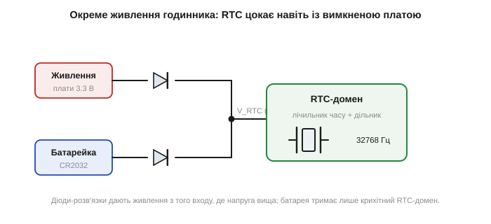
*Рис. 2.10.7.2. Живлення RTC-домену. Основне живлення плати й резервна батарейка через розв'язку живлять вузол V_RTC — активним стає те джерело, що має вищу напругу. Поки плата ввімкнена, годинник живиться від неї; коли вимкнено — від батарейки. Крихітний RTC-домен (генератор 32768 Гц + лічильник) споживає так мало, що однієї батарейки вистачає на роки.*

Щоб цієї батарейки вистачало на роки, RTC-домен проєктують на **мікроскопічне споживання** — одиниці мікроампер. Цьому й допомагає низька частота 32768 Гц: рідкі перемикання CMOS-логіки означають крихітний струм. Прикинемо: батарейка CR2032 має ємність близько 220 мА·год; при споживанні RTC у 1 мкА її вистачить приблизно на 220 000 годин — понад 25 років (на практиці менше через саморозряд самої батарейки, але все одно роки). Звідси й уся логіка вибору, що зійшлася в одній деталі: низька частота → мала потужність → довге життя від батарейки; степінь двійки → проста й точна секунда; камертон → мізерні розміри. Кожне рішення в годинниковому кварці служить головній меті — цокати точно й майже задарма.

### Що дає RTC, крім секунд

Сучасний RTC — це не лише лічильник секунд. Над ланцюжком дільників надбудовано **календарну логіку**, що автоматично переводить накопичені секунди в хвилини, години, дні, місяці й роки, ураховуючи різну довжину місяців і **високосні роки**. Тому програмі не треба самій рахувати дати — вона просто читає з RTC готові «рік-місяць-день-година-хвилина-секунда». Крім того, RTC зазвичай уміє **будильники** (alarm): спрацювати в задану мить, розбудивши процесор зі сну, — це основа пристроїв, що сплять і прокидаються за розкладом. А ще в RTC-домені часто є кілька байтів **резервної пам'яті**, що теж живиться від батарейки й переживає вимкнення, — туди кладуть дрібні налаштування, які мають зберегтися.

Уся ця логіка теж живиться від крихітного струму VBAT-домену й працює на тих самих 32768 Гц. Тому годинниковий кварц — не просто «ще один резонатор», а серце цілого автономного вузла, що живе власним життям, поки решта чипа спить або знеструмлена. Як виглядає годинниковий кварц зблизька і чому з ним обережні при паянні — у [🔌 годинниковий кварц зблизька](r10-s7-c-watch-crystal.md).

### Вбудований RTC чи окрема мікросхема

RTC буває у двох виконаннях, і вибір між ними — типова інженерна розвилка. Перший варіант — **вбудований** у мікроконтролер: окремий блок із власним живленням VBAT, до якого зовні чіпляють лише годинниковий кварц і резервну батарейку. Це дешево (нема окремого чипа) і компактно, тож так роблять найчастіше. Слабина — точність: вбудований RTC ділить турботи з рештою кристала, його кварцовий вузол не завжди ідеально розведений, та й температурної компенсації зазвичай нема.

Другий варіант — **окрема мікросхема RTC** на шині (типово I²C). У ній годинниковий кварц і вся логіка інтегровані разом, часто з кращим розведенням, а дорожчі моделі мають **вбудовану термокомпенсацію** (по суті мініатюрний TCXO для 32768 Гц) і дають одиниці ppm замість десятків — це вже годинник, що набігає секунди не за добу, а за місяці. Такі чипи беруть, коли точність часу справді важлива (логери, прилади обліку), або коли хочуть зняти турботу про кварц із головного процесора. Платіж — окремий компонент, місце на платі й лінії шини.

Розвилка та сама, що й усюди в розділі: дешевше й простіше (вбудований) проти точніше й надійніше (окремий чип). А спільне в обох — те саме серце на 32768 Гц і той самий принцип резервного живлення.

Те, як саме годинниковий кварц обвалив колись цілу швейцарську годинникову індустрію — окрема драматична історія ([📜 кварцова криза](r10-s7-history-quartz-crisis.md)).

## 2.10.8 Керамічні резонатори й MEMS-осцилятори

Кварц — золотий стандарт стабільної частоти, але не завжди найкращий вибір. Іноді його точність зайва, а на перший план виходять **ціна**, **міцність** чи **зручність**. Для таких випадків є дві альтернативи: дешевий **керамічний резонатор** і сучасний **MEMS-осцилятор**. Розуміти, де доречний кожен, — частина інженерної економії: не платити за точність, якої не потребуєш, і не економити там, де точність критична.

Перш ніж порівнювати, варто чітко розрізнити **резонатор** і **осцилятор** — слова, які часто плутають. Резонатор (кварц, керамічний) — це **пасивний** двовивідний компонент, сам по собі він не коливається; йому потрібен зовнішній підсилювач (інвертор у чипі) і конденсатори, щоб стати генератором (§2.10.5). Осцилятор — це **готовий генератор** у власному корпусі: усередині вже є і резонатор, і вся схема, на виході — чистий тактовий сигнал, ззовні треба лише живлення. MEMS майже завжди продають саме як осцилятор; кварц буває і так, і так (кварцовий резонатор окремо — дешевше; кварцовий осцилятор у корпусі — дорожче, зате нічого не треба розводити). Ця відмінність важить і для схеми (резонатор вимагає обв'язки, осцилятор — ні), і для ціни.

### Керамічний резонатор: дешево й зручно

**Керамічний резонатор** *(ceramic resonator)* працює на тому самому п'єзоефекті ([§2.10.2](r10-resonators-references.md)), але замість монокристала кварцу в ньому — спечена **п'єзокераміка** (зазвичай на основі титанату свинцю-цирконату). Кераміка теж має механічний резонанс, тільки куди менш досконалий. Причина пряма й нам уже знайома: полікристал зітканий з безлічі дрібних зерен, а на їхніх межах пружні коливання гаснуть — звідси більші втрати й нижча добротність. Q керамічного резонатора — лише кілька сотень (до тисячі-двох) проти десятків тисяч у кварцу. А нижча Q означає ширший резонансний пік і, за всім ланцюжком §2.10.3, гіршу стабільність частоти: типово **±0.1…±0.5 %** (тобто 1000…5000 ppm) проти десятків ppm у кварцу — у сотні разів грубіше.

Чому ж їх узагалі застосовують? Бо в кераміки є три практичні козирі. По-перше, вона **дешевша** за кварц. По-друге — і це головна зручність — керамічний резонатор часто роблять **триногим**, з уже **вбудованими навантажувальними конденсаторами**: середній вивід іде на землю, обидві потрібні ємності вже всередині, тож зовнішні C₁/C₂ не потрібні зовсім, і плата спрощується на дві деталі. По-третє, через нижчу Q він **швидше стартує** за кварц (низькодобротний резонанс легше розгойдати, §2.10.5) і взагалі менш вразливий до помилок розведення й розкиду номіналів. Тому керамічні резонатори ставлять туди, де частота потрібна «приблизно»: тактувати простий мікроконтролер, що не веде точного часу й не вимагає вузьких допусків. Для UART на помірній швидкості 0.5 % якраз вкладається в бюджет (§2.10.1), а для USB чи точного годинника — категорично ні, там лише кварц.

### MEMS-осцилятор: кремнієвий резонатор у чипі

**MEMS-осцилятор** *(Micro-Electro-Mechanical System)* — наймолодша технологія, що тіснить кварц у багатьох нішах. Тут резонатор — мікроскопічна **кремнієва балка** (чи мембрана) розміром у десятки мікрон, витравлена прямо в кремнієвому кристалі тими ж фотолітографічними методами, що й мікросхеми. Вона теж коливається механічно й теж має пружний резонанс, але збуджується й зчитується не п'єзоефектом (кремній не п'єзоелектричний), а **електростатично**: поряд із балкою — електроди, змінна напруга на них притягує-відпускає балку й розгойдує її, а її рух міняє ємність проміжку, що схема й зчитує. Готову балку герметично накривають кришкою у вакуумі прямо на кристалі, а поряд, в одному корпусі, ставлять електронну схему, що підтримує коливання, ділить/множить частоту й формує чистий вихідний такт.

Сам кремнієвий резонатор має сильний температурний дрейф — куди гірший за кварц. Але MEMS бере інше: оскільки поряд завжди є власна електроніка, у неї вбудовують термокомпенсацію (по суті мініатюрний TCXO, §2.10.9), і вже скомпенсований MEMS виходить на рівень кварцу й кращий. Тобто MEMS перемагає не «голим» резонатором, а резонатором разом із розумною схемою в одному корпусі.

Чи означає це, що MEMS у всьому кращий і кварц приречений? Ні — у нього є й слабини, які варто знати для чесного вибору. По-перше, **складніше нутро**: усередині MEMS-осцилятора живе аналого-цифрова схема з PLL, температурним давачем і регулятором, і вона споживає струм навіть тоді, коли «голий» кварц обійшовся б майже нічим, — для надекономних задач (як RTC від крихітної батарейки) це може важити. По-друге, той самий PLL історично давав **гірший фазовий шум**, ніж прямий кварцовий резонанс (хоча сучасні моделі це здебільшого виправили). По-третє, MEMS — **активний** компонент, якому потрібне живлення й розв'язувальний конденсатор, тоді як кварцовий резонатор сам нічого не споживає. І по-четверте, для багатьох звичних частот кварц досі **дешевший** просто завдяки величезному обсягу виробництва. Тож кварц нікуди не зникає: він лишається стандартним і найдешевшим там, де його крихкість і повільний старт не заважають, а MEMS бере ті ніші, де важать удароміцність, швидкий старт чи незвична частота. Це не «заміна», а **розширення вибору** — ще один щабель у тому самому переліку компромісів.

MEMS-осцилятор зазвичай продають як **готовий генератор** (а не просто резонатор): подаєш живлення — на виході вже чистий тактовий сигнал, нічого довкола не треба. Його сильні сторони:

- **удароміцність** — кремнієва балка мікроскопічна й міцно тримається, тож не боїться ударів і вібрації, на відміну від крихкого кварцу (особливо камертонного);
- **точність** — сучасні MEMS дають від ±10…±50 ppm до ±0.5 ppm із вбудованою термокомпенсацією, тобто вже на рівні кварцу й кращих;
- **програмована частота** — одна модель видає будь-яку частоту з широкого діапазону (її задають при виробництві чи навіть налаштовують), тоді як кварц жорстко прив'язаний до розміру пластини;
- **малі розміри й стійкість до температури**.

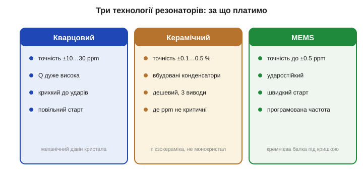
*Рис. 2.10.8.1. Кварц, кераміка й MEMS у порівнянні. Кварцовий: точність десятки ppm, дуже високе Q, але крихкий і повільно стартує. Керамічний: точність частки відсотка, зате дешевий, з вбудованими конденсаторами — де ppm не критичні. MEMS: точність аж до часток ppm, ударостійкий, швидкий старт, програмована частота. Кожна технологія — свій компроміс ціни, точності й міцності.*

Як MEMS видає довільну частоту, якщо механічна балка має одну власну? Через той самий синтез, що й у §2.10.1: усередині сидить PLL, який множить частоту балки на програмований дробовий коефіцієнт. Тому одна фізична деталь (балка на якійсь зручній частоті) дає на виході хоч 12 МГц, хоч 24, хоч 48 — досить змінити коефіцієнт. Кварц так не вміє: щоб дістати іншу частоту, треба інший розмір пластини, тобто інший кварц. Ця гнучкість — велика перевага MEMS у виробництві: один компонент під багато застосувань, замість складу різних кварців.

**Приклад (точність керамічного резонатора для UART).** Простий мікроконтролер тактується керамічним резонатором із ±0.4 % і веде UART. Чи вкладається він у бюджет зв'язку (≲2 % на сторону, §2.10.1)?

```
±0.4 % = ±4000 ppm = ±0.004
бюджет на сторону:  0.02 (2 %)
запас: 0.02 / 0.004 = 5×  →  вкладається з запасом
```

Кераміка проходить — для UART її точності досить. А от USB з його ±0.25 % вимогою кераміка вже не тягне (0.4 % > 0.25 %), там потрібен кварц.

### Джиттер і фазовий шум — інша грань якості

Досі ми говорили про **довгострокову** точність — наскільки частота вірна в середньому за секунди й роки (ppm). Але є й **короткострокова** чистота: наскільки рівно лягають окремі фронти такту. Дрібні випадкові зсуви фронтів у часі звуть **джиттером** *(jitter)*, а в частотних термінах те саме явище — **фазовий шум** *(phase noise)*: «розмазування» спектра довкола ідеальної лінії частоти.

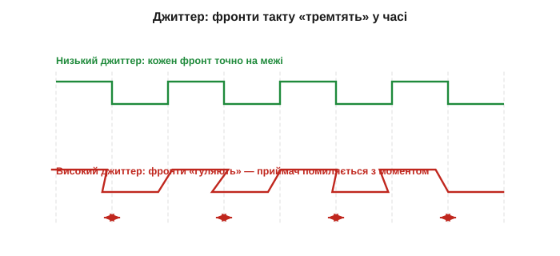
*Рис. 2.10.8.2. Джиттер у часовій області. Угорі — низький джиттер: кожен фронт такту лягає точно на свою межу. Унизу — високий джиттер: фронти випадково «гуляють» туди-сюди, і приймач помиляється з моментом події. Джиттер псує саме точність кожного окремого фронту, навіть якщо середня частота правильна.*

Чому це важливо окремо від ppm? Бо середня частота може бути ідеальною, а кожен конкретний фронт — «плисти» довкола свого ідеального моменту. Уявіть метроном, що в середньому відстукує рівно 120 ударів за хвилину, але кожен окремий удар трохи раніше чи пізніше: темп правильний, а ритм «хитається». Для відліку часу таке хитання майже байдуже — за секунду тисячі періодів усереднюються, і годинник іде вірно. Але для швидкісних задач воно згубне з трьох причин одразу.

По-перше, **семплування АЦП**: перетворювач бере відлік сигналу на фронті такту, і якщо фронт «плаває», відлік береться не в той момент — а на швидкому сигналі це прямо додає шум у виміряне значення (що швидший сигнал, то гірше). По-друге, **швидкі лінії зв'язку**: на високих швидкостях вікно правильного семплування біта вузьке, і джиттер його «з'їдає», збільшуючи частоту помилок. По-третє, **радіо**: джиттер у часовій області — це фазовий шум у частотній, тобто «спідниця» довкола несучої, що забруднює сусідні канали й погіршує чутливість приймача.

Звідси й практичний поділ: кварц і хороші MEMS дають дуже низький джиттер; керамічний резонатор — гірший (нижча Q); дешевий RC — поганий. Цікаво, що тут грає та сама Q: високодобротний резонатор фільтрує шум круто, тож кварц природно «чистий». Є й історичний нюанс: ранні MEMS помітно програвали кварцу за джиттером саме через PLL усередині (а PLL додає свій фазовий шум), але сучасні вже наздогнали кварц і для більшості задач рівноцінні. Для найвимогливішого радіо все ж досі часто беруть кварц чи спеціальні малошумні генератори.

Окремо варто згадати **час старту** — поки що якісно (точних формул не виводимо). Високе Q кварцу має зворотний бік: розгойдати такий «дзвін» від шуму повільно — енергія в петлі наростає тим повільніше, чим вища Q, бо за кожен період додається лише мала дрібка. Тому кварцовий генератор стартує помітний час — типово одиниці мілісекунд для мегагерцового, а годинниковий камертон зі своєю астрономічною Q — і сотні мілісекунд, інколи до секунди. Керамічний резонатор з нижчою Q стартує швидше (частки мілісекунди); MEMS-осцилятор зі своєю схемою — теж швидко й передбачувано. Для пристрою, що раз у раз прокидається зі сну на мить і має миттю працювати (а між пробудженнями глушить генератор заради економії), повільний старт кварцу з'їдає енергію й час — і тут MEMS чи кераміка виграють. Тому час старту — повноцінний параметр вибору, а не дрібниця.

### Як обрати: чотири питання

Звівши все докупи, вибір резонатора зводиться до чотирьох питань, які варто поставити по черзі. Перше й головне: **яка потрібна точність**? Якщо частки відсотка досить (простий такт, повільний UART) — підійде керамічний резонатор, найдешевший. Якщо треба десятки ppm (USB, точніший зв'язок, побутовий годинник) — кварц. Якщо одиниці ppm і менше (GPS, радіо) — уже не цей розділ, а TCXO/OCXO (§2.10.9).

Друге питання: **які умови — удари, вібрація, перепади**? Якщо пристрій трясе чи б'є (інструмент, що падає; техніка на двигуні) — крихкий кварц ризикований, і MEMS зі своєю міцною кремнієвою балкою надійніший. Третє: **як швидко треба стартувати й скільки на це є енергії**? Пристрій, що часто прокидається зі сну на мить, втрачає на повільному старті кварцу і час, і заряд — там виграють кераміка чи MEMS. Четверте: **чи потрібна незвична або кількох-частотна конфігурація**? Тоді програмована частота MEMS позбавляє від пошуку рідкісного кварцу й дозволяє одним компонентом покрити кілька плат.

**Приклад (вибір під сценарій).** Носимий давач: рідко прокидається, передає по радіо короткий пакет і знову засинає; зазнає поштовхів; живиться від маленької батареї.

```
точність:  радіо → потрібні одиниці ppm  → кварц або краще
удари:     є       → крихкий камертон ризикований → нахил до MEMS
старт:     частий з глибокого сну → повільний кварц шкодить
живлення:  батарея → економія критична
```

Вердикт: тут логічно взяти **MEMS-осцилятор** — він і досить точний (зокрема для радіо), і ударостійкий, і швидко стартує, заощаджуючи заряд при частих пробудженнях. Якби пристрій стояв нерухомо й живився від мережі, переміг би дешевший кварц.

> 🔧 **Навіщо це.** Вибір резонатора — це чесна відповідь на питання «скільки точності мені справді треба» плюс три уточнення про умови, старт і частоту. Простий пристрій без точного часу й швидкого зв'язку → керамічний резонатор (дешево, просто, з вбудованими конденсаторами). Звичайний пристрій із UART, USB, годинником → кварц (десятки ppm задарма). Пристрій, що зазнає ударів і вібрації, або якому треба незвична частота чи швидкий старт → MEMS. А коли й десятків ppm замало — переходимо на верхні щаблі піраміди, до TCXO й OCXO. Не платити за зайве й не економити на потрібному — оце і є інженерний вибір джерела частоти.

## 2.10.9 TCXO та OCXO: коли потрібна компенсація температури

Звичайний кварц дає десятки ppm, і найбільший внесок у цю похибку — **температурний дрейф** ([§2.10.6](r10-resonators-references.md)). Якщо цю одну причину прибрати, точність стрибне на порядок-два. Саме це й роблять **TCXO** та **OCXO** — кварцові генератори з **компенсацією температури**. Вони стоять там, де частота має бути не просто доброю, а взірцевою: у навігації, радіо, метрології. Завершимо розділ цією верхівкою — і впорядкуємо всі джерела частоти в єдину **піраміду точності**.

### TCXO: компенсувати, а не усувати дрейф

**TCXO** *(Temperature-Compensated Crystal Oscillator)* — генератор, що **вимірює власну температуру й підправляє частоту**, гасячи температурний дрейф кварцу. Ідея проста: дрейф звичайного кварцу хоч і є, але **передбачуваний** — це відома крива (§2.10.6). Якщо знати температуру, можна обчислити, на скільки частота «попливе», і скомпенсувати це наперед.

Усередині TCXO, в одному корпусі з кварцом, сидить давач температури. Його показ подається на коригувальну ланку — поліном чи таблицю, що відтворює криву, **дзеркальну** до температурного дрейфу кварцу (§2.10.6). Логіка така: якщо при 60 °C кварц сам по собі поспішає на +15 ppm, ланка має на тих самих 60 °C підкрутити частоту на −15 ppm — і сума дасть нуль. Цю корекцію ланка прикладає через **підстроювальну ємність** (варікап — діод, чия ємність залежить від напруги) у генераторі. Згадаймо ключове: частота генератора залежить від навантажувальної ємності CL (§2.10.5). Отже, змінюючи напругу на варікапі, а з нею CL, точно в такт виміряній температурі, схема безперервно тягне частоту назад до номіналу — куди б її не зносив дрейф кристала. Кварц «пливе» — а керована ємність його щоразу повертає.

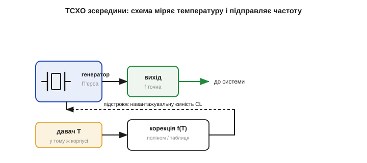
*Рис. 2.10.9.2. Будова TCXO. Давач температури (у тому ж корпусі, що й кварц) подає показ на коригувальну ланку f(T) — поліном чи таблицю. Та керує підстроювальною ємністю в генераторі, зсуваючи навантажувальну CL так, щоб скомпенсувати температурний дрейф кристала. На виході — частота, стабільна попри зміну температури.*

Результат — точність **±0.1…±2 ppm** у всьому робочому діапазоні температур, у десятки разів краще за неприборканий кварц, і все це за помірних розмірів і споживання (трохи більших за звичайний кварцовий генератор). Чому саме TCXO потрібен у радіо й навігації? Бо там частота — це безпосередньо точність. У GPS-приймачі похибка опорної частоти прямо переходить у похибку визначення координат і подовжує час «холодного старту»; у рації чи модемі завелике відхилення зсуває сигнал повз вузьку приймальну смугу, і зв'язку просто нема.

Чому радіоприймач такий вимогливий, варто відчути на числі. Радіоканали стоять вузькими «доріжками» по частоті, і приймач має влучити саме в свою. Скажімо, несуча 1 ГГц, а канал — лічені кілогерци завширшки. Подивимось, що дає звичайний кварц проти TCXO:

```
кварц ±20 ppm на 1 ГГц:  20·10⁻⁶ · 10⁹ = 20 000 Гц = ±20 кГц зсуву
TCXO ±0.5 ppm на 1 ГГц:  0.5·10⁻⁶ · 10⁹ = 500 Гц    = ±0.5 кГц
```

Двадцять кілогерц зсуву — це повз вузький канал, приймач сигналу не знайде; пів кілогерца TCXO — у межах каналу, зв'язок є. Ось чому на одній і тій самій частоті радіо потребує TCXO, а простий цифровий такт — ні: вимога народжується з вузькості каналу, а не з самої частоти. Тому TCXO — типовий супутник будь-чого, що ловить слабкий сигнал у вузькій смузі: GPS-модулі, рації, стільникові модеми, точні годинники. Як саме влаштована термокомпенсація й де такий модуль стоїть на платі — детальніше у [🔌 TCXO зсередини](r10-s9-c-tcxo.md).

### OCXO: тримати кварц у термостаті

**OCXO** *(Oven-Controlled Crystal Oscillator)* розв'язує ту саму задачу інакше й радикальніше. Замість **компенсувати** наслідки дрейфу він **усуває причину** — не дає температурі кварцу мінятися взагалі. Кристал і його генератор поміщають у крихітний **термостат** *(oven)*: мініатюрний нагрівач із терморегулятором тримає кварц за сталої, наперед заданої температури — зазвичай близько +75…+85 °C, навмисне **вище** за будь-яку очікувану зовнішню, щоб термостат завжди тільки догрівав, а не мусив охолоджувати (нагріти легко, охолодити — важко). Хай як міняється довкілля, кристал «думає», що навколо завжди +80 °C. А якщо температура кристала стала, то й температурний дрейф, який від неї залежав, просто зникає — лишаються тільки дрібні внески (старіння, шум регулятора).

Точку термостата вибирають не абияк, а на «плоскій» ділянці температурної кривої кварцу (на перегині для AT-зрізу), де частота найслабше реагує на неминучі дрібні коливання температури всередині самого термостата, — так залишковий дрейф ще менший. Результат — найвища серед кварцових технологій стабільність: **±1…±20 ppb** *(parts per billion — мільярдних часток!)*, тобто ще в десятки-сотні разів краще за TCXO. Ціна теж велика: помітно більші розміри, відчутне споживання (нагрівач гріє постійно, особливо на холоді — це можуть бути ват чи більше) і час **прогріву** при ввімкненні — поки термостат вийде на режим, минають хвилини, і весь цей час частота ще «пливе». Тому OCXO ставлять у стаціонарну апаратуру, де є і розетка, і місце, і не шкода енергії: базові станції зв'язку, вимірювальні прилади, серверні джерела часу, лабораторні еталони частоти.

### TCXO чи OCXO: дві філософії боротьби з температурою

Корисно поставити ці два підходи поруч, бо вони — наочний приклад двох інженерних стратегій узагалі: **компенсувати наслідок** проти **усунути причину**. TCXO лишає кварцу його дрейф, але безперервно його **виправляє** обчисленою поправкою — це дешево, мало, економно, але точність обмежена тим, наскільки добре поправка збігається зі справжньою кривою (а крива ще й трохи різна для кожного екземпляра). OCXO взагалі **не дає** причині виникнути, тримаючи температуру сталою, — це точніше на порядки, але дорого, гаряче й повільно стартує.

Звідси й розподіл застосувань. TCXO беруть, коли треба добра точність у компактному, економному пристрої, що живиться від батареї і не може дозволити собі нагрівач: GPS у кишеньковому приймачі, рація, мобільний модем. OCXO беруть, коли потрібна гранична стабільність, а живлення й місце є: стільникова базова станція, еталон у лабораторії, сервер точного часу. Між ними є й проміжні рішення — мікро-OCXO малого споживання, цифрові TCXO з тонким калібруванням. Але сама розвилка «виправляти чи не допускати» — універсальна, і ви ще не раз зустрінете її в інженерії далеко за межами кварцу.

**Приклад (енергетична ціна термостата).** OCXO з нагрівачем, що в усталеному режимі споживає 0.5 Вт при 3.3 В. Який це струм і чи можна таке живити від батареї?

```
I = P / U = 0.5 / 3.3 ≈ 0.15 А = 150 мА  (постійно!)
від CR2032 (220 мА·год): 220 / 150 ≈ 1.5 години — і батарея сіла
```

Сто п'ятдесят міліампер безперервно — це у сто тисяч разів більше за струм RTC-домену (§2.10.7). Звідси очевидно, чому OCXO живлять лише від мережі, а в кишеньковій техніці він немислимий — там панує TCXO.

### Над кварцом: атомні еталони й «дисципліновані» генератори

Найвищий щабель — **атомні** еталони, де частоту задає не пружне тіло, а квантовий перехід в атомі: рубідії, цезії, водневі мазери. Атом — ідеальний резонатор: усі атоми цезію однакові, тож їхня частота переходу не залежить ні від виготовлення, ні від старіння, ні (майже) від температури. Стабільність — краще за мільярдні частки; саме за частотою переходу цезію-133 з 1967 року офіційно **означено секунду** в системі SI. Рубідієвий стандарт уже буває розміром із сірникову коробку й стоїть у базових станціях; цезієвий — лабораторний прилад.

Та для більшості пристроїв атомний еталон зайвий і недоступний — і тут є елегантний обхідний шлях, **дисциплінований генератор** *(disciplined oscillator)*. Ідея: узяти звичайний хороший кварц чи TCXO (він дає чудову **короткочасну** стабільність — рівні сусідні періоди) і повільно підправляти його за точним, але «далеким» зовнішнім джерелом — найчастіше за сигналом GPS, у якому зашито атомну точність супутникових годинників. Виходить **GPS-дисциплінований генератор** (GPSDO): кварц тримає рівний хід щомиті, а GPS раз у раз «підрівнює» його довгочасну точність до атомної. Так дешевий кварц позичає точність атомного годинника, не маючи його всередині, — і це ще одне нагадування, що точність часу можна не лише купити в одному компоненті, а й зібрати з кількох джерел, кожне сильне у своєму.

### Піраміда точності джерел частоти

Тепер можна вибудувати всі джерела опорної частоти, що ми зустріли, в один ряд — від найгрубіших до взірцевих. Це і є інженерна **піраміда точності**: кожен щабель приблизно на порядок точніший і помітно дорожчий за попередній.

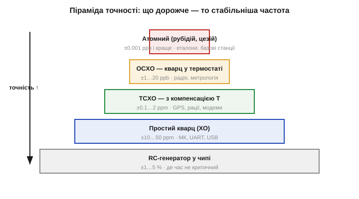
*Рис. 2.10.9.1. Піраміда точності. Знизу вгору: RC-генератор у чипі (±1…5 %) → простий кварц XO (±10…50 ppm) → TCXO з компенсацією (±0.1…2 ppm) → OCXO в термостаті (±1…20 ppb) → атомний еталон, рубідій чи цезій (краще за ±0.001 ppb). Кожен щабель — приблизно вдесятеро-стократно точніший і дорожчий. Інженер обирає найнижчий, що вкладається у вимогу.*

На вершині піраміди — ті самі **атомні** еталони, про які щойно йшлося: вони не компонент на платі, а лабораторний чи станційний прилад, але концептуально це просто найвищий щабель тієї самої драбини точності. А найнижчий — знайомий внутрішній RC, з якого ми починали розділ. Уся піраміда вкладається приблизно в сім порядків: від кількох відсотків RC до мільярдних часток атома.

Чому це саме піраміда, а не рівний ряд? Бо за кожен щабель угору платиш **непропорційно більше** — і грошима, і споживанням, і місцем, і часом старту, — а виграєш приблизно порядок точності. Перейти з RC на кварц майже задарма (копійки за деталь) і дає стрибок у тисячу разів. Наступний крок, на TCXO, коштує вже відчутно дорожче за просту точність. OCXO — це окремий прилад із нагрівачем і прогрівом. Атомний — узагалі інша вагова категорія. Тому й малюнок звужується догори: що вища точність, то менше пристроїв її справді потребують і то дорожче вона дається. Більшість масової техніки живе на двох нижніх щаблях — RC і кварц, — а верхні три потрібні вузькому колу задач.

Звідси й золоте правило вибору, яким завершується весь розділ: **спускайся пірамідою згори донизу, поки точності ще досить, і зупиняйся на найнижчому щаблі, що вкладається у вимогу**. Спершу переклади вимогу задачі (секунди на добу, ширина смуги, бюджет зв'язку) у ppm — спільну мову §2.10.6, — а тоді знайди найдешевший щабель, який цей ppm покриває. Будь-який крок вище за потрібне — це викинуті гроші, споживання й місце; будь-який нижче — гарантована відмова.

**Приклад (як обрати щабель).** Пристрою треба, щоб годинник не набіг більш ніж на 1 секунду за добу.

```
допустимо: 1 с/добу  →  X = 1 / 0.0864 ≈ 11.6 ppm
```

Отже, простий кварц на ±10 ppm якраз проходить, а на ±20 ppm — уже ні; брати TCXO немає сенсу — це переплата за непотрібну точність. А от якби вимога була «1 секунда за рік» (≈0.032 ppm), то ні кварц, ні навіть звичайний TCXO не годяться — потрібен щонайменше точний TCXO чи OCXO, або періодична синхронізація по мережі.

Оглянемося на пройдений шлях, бо весь розділ вибудувано саме як сходження цією пірамідою. Ми почали з питання, навіщо взагалі потрібна стабільна частота і чому RC замало (§2.10.1) — це найнижчий щабель. Далі — фізика, що дає точність: п'єзоефект (§2.10.2), високодобротний кварцовий резонанс (§2.10.3) та його електрична модель (§2.10.4). Потім — як перетворити резонатор на робочий генератор (§2.10.5) і якою мовою міряти його точність (§2.10.6). Окремо — найпоширеніший спецвипадок, годинниковий кварц (§2.10.7), і альтернативи кварцу для нижчих та особливих вимог (§2.10.8). І нарешті — верхні щаблі, TCXO й OCXO, для найвимогливіших задач. Тепер у вас є повна карта джерел частоти: від того, чим вони відрізняються фізично, — до того, як обрати потрібне під конкретну вимогу. Це і є мета розділу: не завчити окремі компоненти, а вміти поставити правильне питання «скільки точності треба» і знайти найдешевшу відповідь.

> 🔧 **Навіщо це.** Уся піраміда — це інструмент для одного інженерного рішення: вибрати найдешевше джерело, що задовольняє вимогу. Спершу перекладіть вимогу задачі (секунди на добу, ширина радіосмуги, бюджет UART) у ppm — а тоді знайдіть найнижчий щабель піраміди, який у цей ppm вкладається. Платити за OCXO там, де досить кварцу, — марнотратство; ставити кварц там, де треба TCXO, — гарантована відмова. Точність частоти, як і все в інженерії, — це питання достатності, а не максимуму.

> ▶️ Далі: [Розділ 2.11 — Силова комутація змінного струму](../r11-ac-power-switching/r11-ac-power-switching.md)
