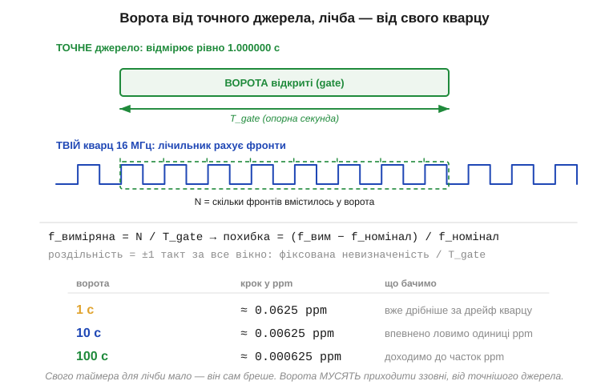
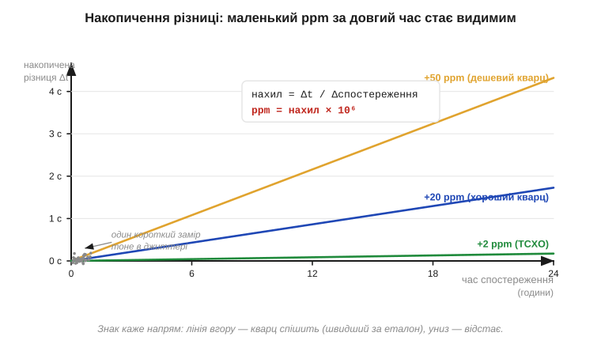

# ⚙️ Виміряти власний дрейф: порівняти з точнішим джерелом і накопичити різницю

> Алгоритмічна вставка до теми [§2.10.6 «Точність у ppm»](r10-resonators-references.md). §2.10.6 каже, що кожен кварц має паспортний допуск у ppm і повзе від температури та старіння. Але паспорт — це обіцянка на всю партію; **ваш** конкретний екземпляр на цій платі за цієї температури має своє, окреме число. Тут — як його дістати власноруч, без лабораторного частотоміра: порівняти свій такт із точнішим джерелом і дати різниці **накопичитися**, доки вона не вилізе з шуму. Сусідня математична вставка [«ppm-арифметика»](r10-s6-m-ppm-math.md) перекладає ppm у секунди; ця — про **процедуру вимірювання** самого ppm.

### Задача

Мікроконтролер тактується кварцом (скажімо, 16 МГц). Скільки це **насправді**? Не 16 000 000.0 Гц, а 16 000 000 ± щось. Те «щось», виражене в частках на мільйон, — і є власна похибка цього вузла. Знати її треба, щоб скоригувати лічбу часу (RTC «біжить» на стільки-то секунд за добу — §2.10.6), вивірити швидкість послідовного зв'язку чи просто відбракувати кварц, що вийшов за допуск. Складність у тому, що похибка крихітна: 20 ppm — це 0.002 %. Поміряти таке «в лоб» одним коротким відліком неможливо — завадить власне тремтіння старту й зупинки, джиттер (*jitter*).

### Ідея: чужі ворота, свій лічильник

Частоту вимірюють **лічбою фронтів за відомий час**. Але тут пастка: якщо і фронти, і «відомий час» відраховує той самий кварц, він порівнює себе із собою й завжди показує рівно номінал — брехня. Тому потрібні **двоє годинників**: один — ваш, другий — **точніший за нього на кілька порядків** (його ppm настільки малий, що його приймаємо за істину). Точне джерело відкриває **ворота** (*gate*) на рівно одну секунду, а ваш лічильник за цей час рахує свої такти. Скільки нарахував — стільки в нього герц.


*Рис. 2.10.6a.1. Точне джерело відмірює опорну секунду (зелені ворота); усередині цього вікна лічильник набирає N фронтів власного кварцу. Частота = N / T_gate, похибка = (N − номінал) / номінал. Невизначеність — ±1 «недолічений» такт за все вікно: при 16 МГц це 62.5 нс. Розмазана по 1 с, вона дає крок 0.0625 ppm; по 10 с — удесятеро дрібніший. Що довші ворота, то тоншу похибку видно.*

Звідки взяти «точніше джерело»? Найдоступніший побутовий еталон — **секундний імпульс GPS-приймача** (*1 PPS*): його фронти прив'язані до атомного часу супутників, тож як опора частоти він на багато порядків кращий за будь-який кварц на платі. Годяться й мережа 50 Гц (стабільна на дистанції доби, бо енергетики тримають середню частоту), і просто інша плата з явно кращим кварцом, і навіть NTP-час, якщо вікно довге.

### Накопичення: маленький ppm за довгий час

Один секундний замір ловить десяті частки ppm — формально досить. Та на практиці кожен старт і стоп воріт «тремтить» на десятки наносекунд (затримка переривання, фаза такту), і в короткому вікні цей джиттер можна сплутати з дрейфом. Рятує **накопичення**: не міряти частоту щомиті, а дати різниці **рости**. Якщо ваш кварц спішить на 20 ppm, то за кожну справжню секунду він набирає на 20 зайвих тактів із мільйона — і його «власний» час обганяє опорний рівномірно. За годину набіжить 0.072 с, за добу — 1.7 с. Ця накопичена різниця Δt росте **прямою лінією**, а її нахил і є шукана похибка: ppm = (нахил) × 10⁶. Довге спостереження усереднює джиттер окремих відліків у нуль, лишаючи чистий нахил.


*Рис. 2.10.6a.2. Накопичена різниця Δt проти часу спостереження. Кожен кварц дає свою пряму: +50 ppm (дешевий) круто йде вгору, +20 ppm (хороший) — полого, +2 ppm (TCXO) майже лежить на осі. Один короткий замір (сіра хмарка) тоне у власному джиттері; нахил довгої лінії — чистий. Знак нахилу каже напрям: вгору — кварц швидший за еталон, униз — відстає.*

### Псевдокод

Обидва підходи — і миттєвий замір через ворота, і повільне накопичення — вкладаються в кілька рядків. Метод A рахує частоту за одне опорне вікно; метод B накопичує розбіжність годинників і дістає похибку з нахилу прямої.

```
# Метод A — ворота від точного джерела (1 PPS від GPS на вхід capture/IRQ)
старт:
    N0 = read_counter()          # вільний лічильник на тактах власного кварцу
    t0 = індекс_імпульсу         # рахуємо опорні секунди

на кожен імпульс 1 PPS (точна секунда):     # обробник переривання
    N  = read_counter()
    t  = поточний індекс імпульсу
    dN = N - N0                  # тактів за (t - t0) опорних секунд
    f_виміряна = dN / (t - t0)   # Гц, усереднено за все вікно
    ppm = (f_виміряна - f_номінал) / f_номінал * 1e6

# Метод B — накопичення розбіжності годинників (без частотоміра)
# Звіряємо ВЛАСНИЙ час із міткою точного джерела через довгі проміжки.
періодично (раз на годину/добу):
    dt = власний_годинник - опорний_час     # накопичена різниця, секунди
    записати точку (час_спостереження, dt)
наприкінці:
    нахил = лінійна_регресія(точки)          # с на секунду
    ppm   = нахил * 1e6                       # +вгору: кварц спішить
```

Складність — крихітна: O(1) на кожен імпульс (відняти, поділити), пам'яті — кілька змінних або короткий буфер точок під регресію. Уся «робота» — у терплячому чеканні, а не в обчисленнях.

### Пастки на МК

Обчислень тут і справді небагато — зате весь успіх вирішує, як саме рахувати такти на конкретному залізі. Кілька місць ламають результат тихо, без жодної помилки в коді.

**Лічильник мусить бути апаратним і не зупинятися.** Рахувати такти кварцу в програмному циклі марно — переривання й конвеєр зіб'ють підрахунок. Беріть вільний 32-розрядний таймер на системному такті й читайте його по фронту опорного імпульсу через **захоплення** (*input capture*), а не в обробнику з невідомою затримкою: capture фіксує значення лічильника апаратно, гасячи джиттер входу в переривання.

**Стережіться переповнення.** 16 МГц переповнюють 32-розрядний лічильник за ≈ 268 с. Для довгих вікон лічіть переповнення окремим лічильником або міряйте короткими секундними вікнами й **підсумовуйте** — це і є накопичення.

**Не порівнюйте дві однакові деталі.** Якщо «еталон» — такий самий кварц, ви міряєте різницю двох похибок, а не абсолют. Еталон має бути на порядки точніший (1 PPS, TCXO, мережа на дистанції доби), інакше число беззмістовне.

**Фіксуйте температуру.** Похибка кварцу повзе від нагріву (§2.10.6). Зміряний дрейф дійсний лише за тієї температури, за якої міряли; біля плати, що сама гріється, результат «попливе». Хочете криву компенсації — міряйте на кількох температурах.

**Розрізняйте дрейф і джиттер.** Цей метод дає **середній** дрейф за вікно (повільний відхід частоти), а не короткочасний фазовий шум чи тремтіння окремого періоду — то інша задача й інші прилади.

> 🔧 **Навіщо це.** Один секундний імпульс GPS і вільний таймер перетворюють будь-яку плату на частотомір із роздільністю в частки ppm — без лабораторного обладнання. Так калібрують хід RTC, вивіряють baud-rate далекого зв'язку й відбраковують кварц, що виліз за допуск. А головне правило заберіть навіть без заліза: **годинник не можна перевірити сам собою — потрібен другий, точніший, і трохи терпіння, щоб різниця між ними накопичилася до видимої.**
