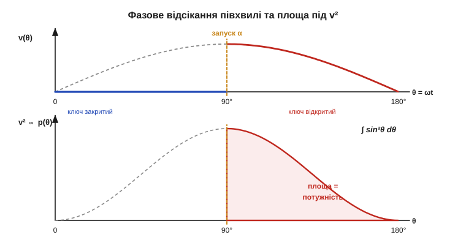
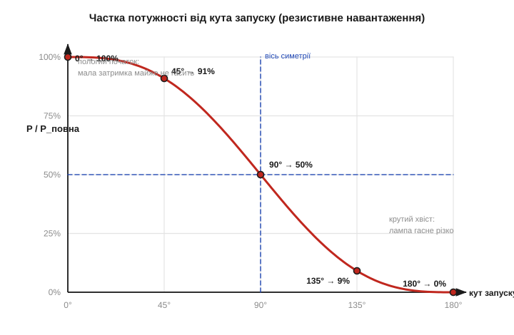

# 🧮 Потужність від кута відсікання: інтеграл півхвилі

> Це математична вставка до теми [2.11.4 «Фазове керування потужністю»](r11-ac-power-switching.md). Тема пояснила якісно: симістор підпалюють із затримкою після переходу через нуль, він відрізає початок кожної півхвилі — і лампа світить тьмяніше. Лишилося головне питання інженера-практика: **скільки саме** потужності залишається при заданому куті? Чи правда, що «півкута» — це «півпотужності»? Тут це питання перетворюється на один інтеграл, із якого випливе красива й корисна відповідь: при відсіканні рівно посередині півхвилі (90°) до навантаження доходить рівно **половина** потужності, а не чверть і не три чверті — і чому крива виходить геть не лінійною.

### Означення: кут запуску і що ним відрізають

Мережа дає синусоїду напруги. Зручно міряти не час, а **фазу** (*phase angle*, θ) — кут, що пробігає від 0 до 180° за одну півхвилю:

```
v(θ) = V_m · sin θ ,   θ = ω·t ,   θ: 0 → π за півперіод
```

**Кут запуску** (*firing angle*, α) — це фаза, на якій ми подаємо імпульс на затвор симістора. До α ключ закритий, напруга на навантаженні нуль; від α і до кінця півхвилі (θ = π) симістор відкритий і пропускає синусоїду, як є. На наступному переході через нуль струм падає нижче струму утримання, ключ сам замикається ([§2.11.2](r11-ac-power-switching.md)) — і все повторюється дзеркально на від'ємній півхвилі. Тож α = 0 означає «не відрізаємо нічого» (повна потужність), а α → 180° — «відрізаємо майже все» (темрява).


*Рис. 2.11.4m.1. Зверху: ключ закритий до кута α (синя ділянка на нулі), далі пропускає синусоїду (червона). Знизу: миттєва потужність повторює форму v² ∝ sin²θ; до навантаження дістається лише залита площа праворуч від α. Уся задача — порахувати цю площу й поділити на повну.*

### Інтуїція: чому не напруга, а її квадрат

Перша спокуса — сказати «відрізали півхвилі, лишилось півнапруги, отже й півпотужності». Це хибно одразу з двох причин, і обидві варто проговорити.

По-перше, потужність на резисторі (а саме резистивні навантаження — лампа розжарення, нагрівач — фазове керування й любить найбільше) залежить від **квадрата** напруги: p = v²/R ([§1.3.6](../../block-1-circuits-physics/ch03-resistance-power-heat/ch03-resistance-power-heat.md)). Тому рахувати треба площу не під самою синусоїдою, а під її квадратом — під кривою sin²θ на нижній панелі рисунка. Квадрат міняє все: він приглушує малі значення (початок і кінець півхвилі, де sin θ близький до нуля, дають майже нуль потужності) і ще дужче підносить великі — ті, що на верхівці.

По-друге, «середнє» тут — не середнє напруги, а **середнє квадрата**: саме воно стоїть за поняттям ефективного значення (*RMS*, root-mean-square). Повна потужність синусоїди задається її RMS-значенням, і коли ми відрізаємо шматок, треба перерахувати RMS урізаної форми. Це й робить інтеграл.

### Апарат: один інтеграл sin²θ

Середня потужність за півперіод — це інтеграл миттєвої потужності, поділений на довжину інтервалу. Винесемо сталі V_m²/R за дужку — вони скоротяться при діленні на повну потужність, тож стежимо лише за інтегралом від sin²θ. Беремо його від α до π (там, де ключ відкритий):

```
∫ sin²θ dθ = θ/2 − sin(2θ)/4 + C      (стандартний первісний)
```

Здобути цей первісний легко через тотожність половинного кута sin²θ = (1 − cos 2θ)/2: під інтегралом лишається косинус, який інтегрується відразу. Тепер підставляємо межі **від α до π**:

```
∫[α→π] sin²θ dθ = [θ/2 − sin(2θ)/4]   від α до π
               = (π/2 − 0) − (α/2 − sin(2α)/4)
               = (π − α)/2 + sin(2α)/4
```

Повна півхвиля (α = 0) дає опорне число — площу під усім sin²θ:

```
∫[0→π] sin²θ dθ = π/2
```

Ділимо одне на одне — і стала V_m²/R зникає. Лишається чиста **частка потужності** як функція тільки кута:

```
P(α)        (π − α)/2 + sin(2α)/4         α     sin(2α)
──────  =  ──────────────────────  =  1 − ─  +  ───────
P_повна            π/2                     π       2π
```

Це і є робоча формула вставки. У ній α — у радіанах; ліворуч — безрозмірна частка від 0 до 1.

### Перевірка: магічні 50% при 90°

Підставимо ключове значення α = 90° = π/2. Тоді sin(2α) = sin π = 0, і середній доданок α/π = (π/2)/π = ½:

```
P(90°)/P_повна = 1 − ½ + 0 = 0.5  →  рівно 50%
```

Ось обіцяна відповідь: відсікання точно посередині півхвилі лишає **половину** потужності. Член із синусом обнулився не випадково — на 90° крива sin²θ симетрична відносно своєї верхівки, тож відрізана й залишена частини площі рівні. Порахуймо ще кілька точок поряд із відомими краями, щоб відчути форму:

```
α = 0    →  1 − 0    + 0           = 1.00   (100%, нічого не відрізали)
α = 45°  →  1 − 0.25 + sin90°/2π   = 0.909  (≈ 91%)
α = 135° →  1 − 0.75 + sin270°/2π  = 0.091  (≈ 9%)
α = 180° →  1 − 1    + 0           = 0.00   (0%, темрява)
```

Зверніть увагу на **симетрію**: 45° дає 91%, а 135° — рівно стільки, скільки 45° «недодав» до сотні, тобто 9%; разом 100%. Те саме з будь-якою парою кутів, рівновіддалених від 90°. Формула симетрична відносно точки (90°, 50%) — у цьому переконує і та сама обнулена sin(2α) на 90°, і дзеркальність кривої на рисунку.


*Рис. 2.11.4m.2. Крива P/P_повна від кута запуску. Вона S-подібна й симетрична відносно центру (90°, 50%): пологий початок (мала затримка майже не гасить) і крутий хвіст (під кінець лампа гасне різко). Жодної лінійності — рівні кроки кута дають дуже нерівні кроки яскравості.*

> 🔧 **Навіщо це.** Формула прямо лягає в код димера ([§2.11.4](r11-ac-power-switching.md), [алгоритм — §2.11.4a](r11-ac-power-switching.md)). Якщо мікроконтролер виставляє затримку запуску лінійно за положенням ручки, користувач відчує, що «усе регулювання» зосереджене в середині ходу, а на краях — мертві зони. Знаючи P(α), затримку рахують **навпаки** — від бажаної частки потужності до кута, — і ручка стає рівномірною.

### Чому лампа пригасає плавно, а імпульсний блок — ні

Уся ця арифметика трималася на одному припущенні: навантаження **резистивне**, тобто струм повторює форму напруги, і потужність — це чесно v²/R. Лампа розжарення, ТЕН, паяльник саме такі, тож формула працює, і яскравість слухняно йде за P(α).

Імпульсний блок живлення (*SMPS*) поводиться інакше. На його вході — діодний міст і конденсатор, який заряджається короткими гострими кидками струму лише на верхівках ([§2.5.6m](../ch10-diode-pn-junction/ch10-s6-m-ripple-calc.md)). Такому навантаженню байдуже до «середнього квадрата» урізаної синусоїди — воно бере свою енергію імпульсами і просто перенесе їх на пізнішу мить півхвилі. Димер не пригасить його плавно: блок або працює (доки на конденсаторі вистачає напруги), або зривається, а різкий фронт у момент запуску симістора б'є по його вхідному мосту. Тому фазове керування — інструмент для омічних навантажень; для решти потрібні зовсім інші підходи, як-от перемикання цілими півперіодами ([§2.11.5](r11-ac-power-switching.md)).

### RMS і знайомий корінь із половини

Лишився місток до того, що вже траплялося раніше. Частка потужності 0.5 при 90° означає, що **ефективна (RMS) напруга** на навантаженні впала не до половини, а до √0.5 = 0.707 від повної:

```
V_rms(α) / V_rms_повна = √( P(α)/P_повна )
α = 90°  →  √0.5 = 0.707
```

Той самий множник 1/√2, що й у точці −3 дБ фільтра ([§2.4.6m](../r04-frequency-response/r04-s6-m-half-power.md)), і з тієї ж глибинної причини: потужність живе у квадраті напруги, тож «половина потужності» завжди означає «0.707 напруги». Побачивши √2 поряд із синусоїдою — шукайте квадрат і потужність; тут вони знову разом.

### Де це працює в курсі

Інтеграл sin²θ — той самий інструмент, яким означають RMS будь-якого періодичного сигналу, тож формула P(α) — це частковий, але дуже наочний випадок ефективного значення урізаної хвилі. Вона безпосередньо живить алгоритм димера ([§2.11.4a](r11-ac-power-switching.md)) і пояснює, чому регулювання нагрівача інколи роблять не зрізом фази, а цілими півперіодами ([§2.11.5](r11-ac-power-switching.md)): там керують не формою хвилі, а **кількістю** цілих хвиль, і середня потужність виходить лінійною за кількістю пропущених періодів — без різких фронтів і породжених ними завад.
