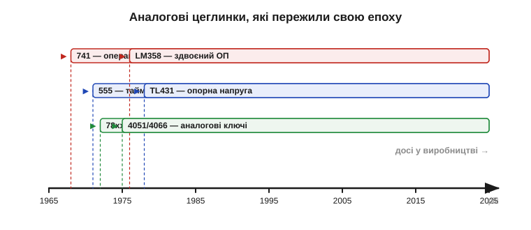
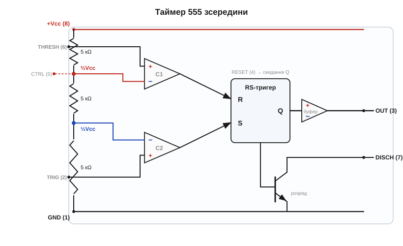
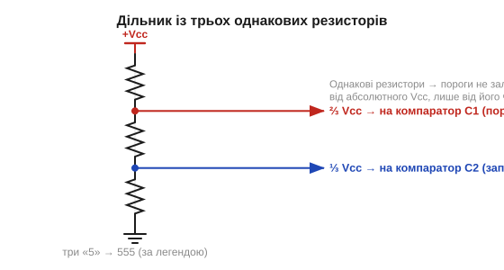
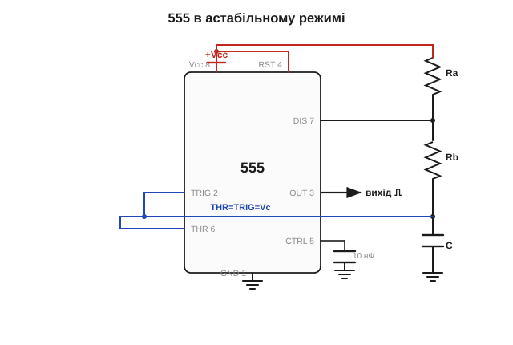
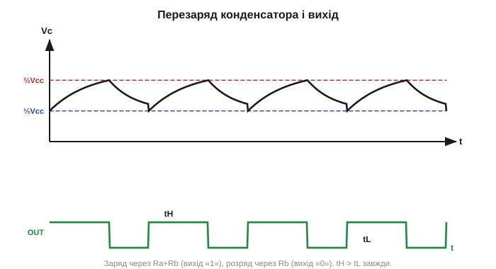
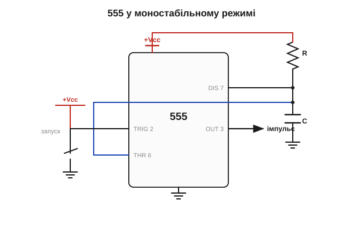
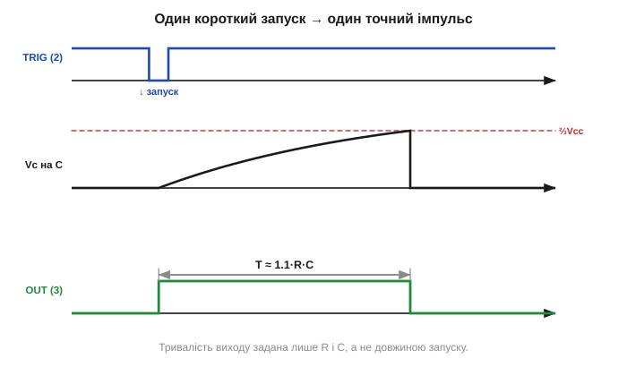
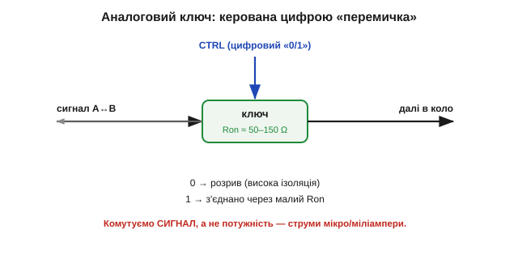
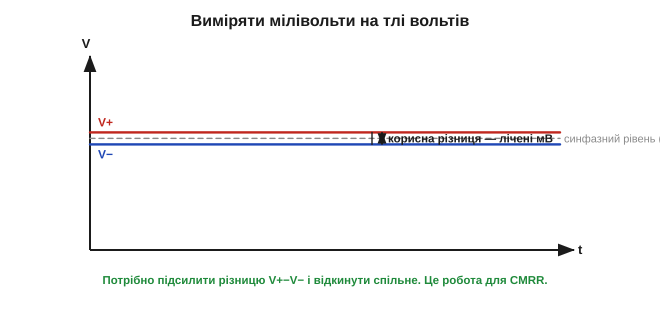
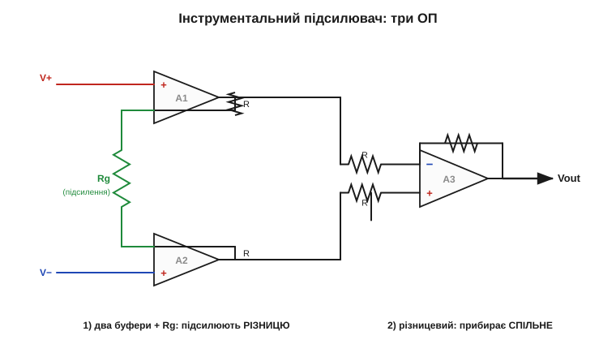

# Розділ 2.12 — Легендарні аналогові ІМС

[Розділ 2.11](../r11-ac-power-switching/r11-ac-power-switching.md) показав силові ключі, які володіють мережею. Тепер ми повертаємося від енергії до **сигналу** — і знайомимося з кількома мікросхемами, що стали справжніми **цеглинками** аналогової електроніки. Це не просто старі компоненти: це деталі, які інженери складають у схеми так само звично, як муляр кладе цеглу, — таймер, опорна напруга, аналоговий ключ, інструментальний підсилювач. Кожна з них — готовий **функціональний блок**, усередині якого вже зібрано те, що ми по частинах вивчали в попередніх розділах: транзистори ([§2.6](../ch11-bjt/ch11-bjt.md), [§2.7](../ch12-mosfet/ch12-mosfet.md)), операційні підсилювачі й компаратори ([§2.8](../ch13-opamp-comparator/ch13-opamp-comparator.md)), діоди й переходи ([§2.5](../ch10-diode-pn-junction/ch10-diode-pn-junction.md)).

Особливість цих ІМС у тому, що багато з них випускають **по півстоліття поспіль**. Таймер, спроєктований 1971 року, досі лежить у кожному радіомагазині; опорна напруга, придумана наприкінці 1970-х, сидить майже в кожному зарядному пристрої. Чому так? І як вони влаштовані всередині? Розділ почнемо з відповіді на перше питання — чому хороша аналогова цеглинка не старіє ([📜 історія Ганса Камензінда й таймера 555](r12-history-camenzind-555.md) розповідає, як одна з них народилася на домашньому столі), — а далі розберемо найвідоміші з них по черзі, від таймера 555 до інструментального підсилювача.

## 2.12.1 Чому деякі мікросхеми живуть 50 років

Електроніка — галузь, де все старіє блискавично. Процесор п'ятирічної давнини вважають музейним експонатом, а телефон трирічної — приводом для співчуття. На цьому тлі дивовижно, що в каталозі будь-якого постачальника досі лежать мікросхеми, розроблені тоді, коли ще не було ні персонального комп'ютера, ні мобільного зв'язку. Той самий таймер, той самий здвоєний операційний підсилювач, той самий лінійний стабілізатор. Їх не просто **тримають** для ремонту старого — їх **проєктують у нові** вироби, щойно сьогодні намальовані. Чому одні кремнієві кристали живуть кілька місяців, а інші — кілька десятиліть?

Відповідь не в тому, що «старе зроблено міцніше». Відповідь у тому, що ці мікросхеми — **стандартні цеглинки**, а не вироби. І в цьому є глибока інженерна логіка, варта окремої розмови.

### Цеглинка проти продукту

Розгляньмо різницю між двома типами мікросхем. Є **продукт** — наприклад, чип конкретного бездротового модуля чи відеокодека. Він прив'язаний до стандарту, до ринку, до моди; зміниться стандарт зв'язку — і чип стане непотрібним. А є **цеглинка** — компонент, який виконує елементарну, **вічну** функцію: затримати сигнал на задану мить, утримати стабільну напругу, підсилити різницю двох входів, перемкнути аналоговий сигнал. Ці функції не залежать від моди, бо вони — частина самої **фізики розробки**. Поки інженери будують схеми, їм будуть потрібні затримки, опорні напруги й підсилювачі.


*Рис. 2.12.1.1. Кілька аналогових цеглинок, що пережили свою епоху. Операційний підсилювач, таймер, лінійний стабілізатор, опорна напруга, аналогові ключі — усі народилися в 1968–1978 роках і досі у виробництві. Спільна риса: кожна виконує елементарну, незмінну функцію розробки, а не прив'язана до минущого стандарту.*

Цеглинка має ще одну рису: вона **проста й самодостатня**. Її поведінку можна описати кількома числами в даташиті, її легко зрозуміти, легко перевірити, легко вставити в будь-яку схему. Складний продукт мусить старіти разом зі своєю екосистемою; проста цеглинка — ні, бо їй нема з чим старіти. Саме тому довговічними стають насамперед **аналогові** ІМС: аналоговий світ — це напруги, струми, час і температура, а вони не змінюються від покоління до покоління.

Варто додумати цю думку до кінця, бо вона пояснює, **чому** цифрові вироби старіють, а аналогові цеглинки — ні. Складна цифрова мікросхема живе не сама по собі, а в **павутині залежностей**: вона спирається на конкретний стандарт зв'язку, на конкретний формат даних, на драйвери в конкретній операційній системі, на швидкість сусідньої пам'яті, на тонкий технологічний процес, який сам застаріває. Достатньо одній ниточці цієї павутини обірватися — змінився стандарт, припинили підтримку драйвера, — і чип стає непотрібним, навіть якщо фізично справний. Він прив'язаний до **контексту**, а контекст рухається. Аналогова ж цеглинка контексту майже не має: вона робить одну фізичну операцію над напругою чи струмом, і ця операція ні від чого зовнішнього не залежить. Закон Ома, експонента заряду конденсатора, поріг компаратора — усе це таке саме, як було, і таке саме, як буде. Старіти просто нема чому.

Звідси й парадокс, який спершу дивує новачка: чим **простіша** функція компонента, тим **довше** він живе. Складність — це коротке життя; елементарність — це вічність. Аналогові цеглинки виживають саме тому, що нічого зайвого в них немає: лише та функція, яка завжди потрібна. І коли інженер бачить у каталозі мікросхему з датою розробки «1971», це не ознака відсталості — це знак, що функцію вгадали настільки правильно, що за півстоліття її не довелося переробляти.

Які ж функції виявилися «вічними»? Перелік на диво короткий і повторюється з підручника в підручник. **Підсилити** слабкий сигнал — звідси операційний підсилювач ([§2.8](../ch13-opamp-comparator/ch13-opamp-comparator.md)), що живе з кінця 1960-х. **Порівняти** дві напруги — компаратор. **Відмірити час** — таймер, якому присвячено половину цього розділу. **Утримати стабільну напругу** — лінійний стабілізатор і опорне джерело. **Перемкнути сигнал** — аналоговий ключ. **Підсилити різницю на тлі завади** — інструментальний підсилювач. Кожна з цих операцій — не примха епохи, а **базова дія** над електричним сигналом, без якої не обходиться жодна схема, байдуже, якого вона року. Тому й цеглинки, що ці дії втілюють, не старіють. Цей розділ, по суті, — екскурсія саме такими «вічними» функціями: ми беремо одну за одною й дивимося, як вона зроблена в кремнії.

> 🔧 **Навіщо це.** Розрізняти цеглинку й продукт — практична навичка проєктувальника. Коли ви будуєте пристрій, який має жити роками й випускатися тисячами, ви свідомо тяжієте до **стандартних цеглинок**: їх не знімуть із виробництва завтра, їх легко замінити, їх знають усі. А коли ви женетеся за найкращими характеристиками сьогодні — берете свіжий «продуктовий» чип, погоджуючись, що за три роки доведеться його перепроєктовувати. Це усвідомлений компроміс, і починається він із питання: ця функція — вічна чи минуща?

### Друге джерело: чому це питання життя і смерті

Тепер — головна причина, чому інженери **люблять** старі стандартні цеглинки, і вона суто практична. Уявіть, що ваш виріб залежить від мікросхеми, яку випускає **один-єдиний** виробник. Він підняв ціну вдвічі — ви платите. Він припинив випуск — ваш виріб зупинився, і ви терміново перепроєктовуєте плату під щось інше. Він затримав постачання на півроку — ваш конвеєр стоїть. Залежати від одного постачальника — це тримати ніж біля власного горла.

Тому в серйозній розробці діє правило: **друге джерело постачання** (*second source*). Компонент мусить випускатися **кількома незалежними** виробниками, причому в **однаковому корпусі з однаковою цоколівкою** (*pinout*) і сумісною поведінкою. Зник один — паяєш чужий, тієї самої цоколівки, і плата навіть не помічає різниці.


*Рис. 2.12.1.2. Друге джерело постачання. Стандартна цеглинка (тут — таймер «555») випускається багатьма незалежними виробниками з тією самою цоколівкою й логікою. Зник один постачальник — паяєш чужий тієї самої цоколівки. Монополіст не може диктувати ціну, бо поруч завжди є альтернатива.*

Саме легендарні ІМС — чемпіони другого джерела. Таймер 555 випускають десятки фабрик у світі; лінійний стабілізатор класу 78xx — теж; здвоєний операційний підсилювач — теж. Ви можете замовити їх у п'яти різних виробників, і всі п'ять стануть на одне місце на платі. Ця **взаємозамінність** робить такі компоненти безпечними для масового виробництва — і саме вона тримає їх у каталогах десятиліттями. Чим більше виробників випускає цеглинку, тим довше вона живе, бо жоден із них не може її «вбити» поодинці.

> 🔧 **Навіщо це.** Обираючи компонент для виробу, який житиме довго, перевіряйте: чи є **друге джерело**? Один рядок у даташиті — «pin-compatible with…» — або наявність того самого позначення в кількох виробників означає, що вас не тримають за горло. Для прототипу це байдуже; для серії — критично. Багато досвідчених інженерів свідомо тримаються старих стандартних цеглинок саме тому, що їх не зніме з виробництва раптове рішення єдиного постачальника.

### Ціна перевіреності

Є й третя причина довговічності, м'якша, але важлива: **перевіреність**. Мікросхема, яку випускають п'ятдесят років і застосували в мільярдах виробів, **відома до останньої дрібниці**. Усі її граблі задокументовано, усі її дивацтва описано в сотнях статей, усі типові схеми ввімкнення перевірено практикою. Коли ви берете таку цеглинку, ви не наражаєтеся на сюрпризи — усе, що могло піти не так, уже пішло не так у когось іншого, і про це написано.

Нова мікросхема, навпаки, — це завжди ризик: errata (список помилок) ще неповний, типові схеми ще не вилизані, рідкісні режими відмови ще не виявлені. За свіжі характеристики платять часом на «вилов» проблем. А перевірена цеглинка цей податок уже сплатила — і тому вона **дешева не лише в грошах, а й у нервах**. Інженер, що бере 555 чи 78xx, точно знає, що отримає; це знання — теж цінність.

Є й зворотний бік перевіреності — **навчальний**. Навколо легендарних цеглинок наросла величезна культура: підручники, типові схеми, тисячі прикладів, готові розрахунки. Новачок, що береться за 555 чи операційний підсилювач, не блукає наосліп — він спирається на півстоліття чужого досвіду. Це робить старі цеглинки ще й найкращим **матеріалом для навчання**: на них видно загальні принципи в чистому вигляді, без випадкових ускладнень. Саме тому ми вивчаємо їх не як музейні експонати, а як живий інструмент, яким користуються й сьогодні.

Розшифрувати самі **назви** цих компонентів — окрема корисна навичка: префікси на кшталт NE, LM, TL, CD чи 74 несуть інформацію про походження й тип, а суфікси кажуть про корпус ([🔌 розшифровка назв ІМС](r12-s1-c-ic-naming.md)). Опанувавши цю «граматику», ви читатимете маркування мікросхем майже як осмислений текст — і впізнаватимете в чужій схемі знайому цеглинку з першого погляду.

> 🔧 **Навіщо це.** Перевіреність — це прихована, але реальна стаття вартості розробки. Час інженера коштує дорого; кожен тиждень, витрачений на «вилов» дивацтв свіжого чипа, — це гроші. Беручи перевірену цеглинку, ви наперед знаєте її поведінку й типові граблі, тож проєктування йде швидше й передбачуваніше. Для одиничного хобі-проєкту це неважливо, а для виробу, який треба випустити вчасно й без сюрпризів, перевіреність часто переважує кращі «паперові» характеристики новинки.

**Приклад (вартість компонента впродовж життя виробу).** Уявімо виріб, який планують випускати 10 років тиражем 20 000 штук на рік. Порівняймо два сценарії вибору таймера: перевірена цеглинка з кількома джерелами проти свіжого «модного» чипа від одного виробника.

```
Перевірена цеглинка (≥3 виробники):
  ціна за штуку       ≈ 0.20 у.о. (конкуренція тримає низько)
  ризик зняття з виробництва за 10 років — низький
  перепроєктування плати       — не очікується

Свіжий чип (1 виробник):
  ціна за штуку       ≈ 0.35 у.о. (монополіст, дорожче)
  ризик зняття з виробництва за 10 років — помітний
  якщо знімуть на 5-му році → перепроєктування + перевипробування:
     разові витрати       ≈ 40 000 у.о. (праця інженерів, сертифікація)
     розкид на решту 5 років · 20 000 шт = 100 000 шт:
        +40 000 / 100 000 = +0.40 у.о. на штуку

Підсумкова ціна штуки (грубо):
  перевірена:   0.20 у.о.
  свіжа з ризиком: 0.35 + (ймовірний) 0.40 ≈ 0.75 у.о.
```

Навіть якщо свіжий чип сам по собі дешевший за функцією, ризик зняття з виробництва й вимушеного перепроєктування може зробити його **в рази дорожчим** на дистанції життя виробу. Ось чому в серійній розробці так цінують довговічні цеглинки з другим джерелом: вони купують не лише функцію, а й **спокій** на роки вперед. Зауважте: ці числа орієнтовні й залежать від ринку, але сам механізм незмінний — рідкісний разовий ризик, помножений на великі наслідки, легко переважує невелику щоденну економію. Саме так мислять інженери, що відповідають за виріб не на тиждень, а на десятиліття.

Підсумуймо. Аналогова цеглинка живе півстоліття не тому, що зроблена з кращого кремнію, а тому, що (1) виконує вічну функцію розробки, (2) має багато незалежних джерел постачання й (3) перевірена до дрібниць. Ці три властивості й роблять компонент «легендарним». Далі ми розберемо найвідоміші з таких цеглинок по черзі — і почнемо з абсолютного чемпіона за тиражем, таймера 555.

## 2.12.2 Таймер 555 зсередини: два компаратори, тригер і дільник із трьох резисторів

Якщо в аналоговій електроніці є один безперечний символ «легендарної цеглинки», то це **таймер 555** (*555 timer*). Його випускають із 1971 року, сумарний тираж — мільярди штук, і він досі лежить у кожному магазині радіодеталей. Він уміє одну річ — **відмірювати час** — але робить це так гнучко, що з нього будують генератори, затримки, формувачі імпульсів, широтно-імпульсні модулятори й безліч іншого. А найкраще те, що всередині 555 нема нічого, чого ми вже не вивчили: це просто **два компаратори, RS-тригер і дільник напруги з трьох резисторів**, складені докупи розумним способом. Розберімо його зсередини — і він перестане бути магією.

Народження 555 — окрема яскрава історія: його спроєктував Ганс Камензінд (*Hans Camenzind*) фактично наодинці, значною мірою вдома, на замовлення компанії Signetics ([📜 історія до розділу](r12-history-camenzind-555.md)). А ось гучна **назва** «555», усупереч поширеному переказу, не зашифровує ні «три резистори по 5 кОм», ні якусь формулу: за всіма свідченнями, її просто обрав маркетинговий відділ Signetics у руслі тодішніх числових позначень. Збіг із трьома резисторами — приємна випадковість, з якої народилася гарна, але хибна легенда. Це добра нагода затямити: не кожна красива історія про походження назви правдива.

### Що на ніжках

У класичного 555 вісім виводів, і варто знати, за що відповідає кожен, бо далі ми будуватимемо з них схеми:

- **GND (1)** — спільний, «земля».
- **TRIG (2)** — вхід запуску (*trigger*); реагує на падіння напруги нижче ⅓ живлення.
- **OUT (3)** — вихід; видає або «низько» (близько до землі), або «високо» (близько до живлення).
- **RESET (4)** — примусове скидання виходу в «низько» незалежно від решти; зазвичай підтягують до живлення, щоб не заважав.
- **CTRL (5)** — вхід керування порогом (*control voltage*); напряму під'єднаний до вузла ⅔ живлення.
- **THRESH (6)** — вхід порога (*threshold*); реагує на перевищення ⅔ живлення.
- **DISCH (7)** — вивід розряду (*discharge*); усередині це колектор транзистора, що замикає цей вивід на землю.
- **+Vcc (8)** — живлення; класичний біполярний 555 працює в широкому діапазоні, приблизно від 4.5 до 15 В.


*Рис. 2.12.2.1. Таймер 555 зсередини. Дільник із трьох однакових резисторів задає два пороги — ⅔ і ⅓ живлення. Верхній компаратор C1 порівнює вхід THRESH(6) з ⅔Vcc і скидає RS-тригер; нижній C2 порівнює TRIG(2) з ⅓Vcc і встановлює тригер. Вихід тригера керує вихідним буфером OUT(3) і розрядним транзистором на виводі DISCH(7).*

### Серце схеми: дільник із трьох резисторів

Почнімо з найпростішого — з **дільника напруги**, який ми знаємо ще з [§1.3](../../block-1-circuits-physics/ch03-resistance-power-heat/ch03-resistance-power-heat.md). Усередині 555 три однакові резистори ввімкнено послідовно між живленням і землею. Однакові — тож вони ділять напругу живлення на три рівні частини, і на двох внутрішніх вузлах виникають дві опорні напруги: **⅔ Vcc** (між верхнім і середнім резистором) та **⅓ Vcc** (між середнім і нижнім). Ось ці дві третини й задають усю роботу таймера.


*Рис. 2.12.2.2. Дільник із трьох однакових резисторів. Три рівні опори ділять Vcc на три рівні частини, тож на вузлах виникають пороги ⅔Vcc (для верхнього компаратора) і ⅓Vcc (для нижнього). Оскільки резистори однакові, пороги — це **частки** живлення, а не абсолютні вольти: піднявся Vcc — піднялися й пороги пропорційно.*

Тут варто спинитися на тонкощі, бо в ній — справжня краса схеми. Пороги задано не в абсолютних вольтах, а у **частках живлення**. Це означає, що коли живлення зміниться — скажімо, з 5 до 9 В, — обидва пороги зміняться **пропорційно** (стануть ⅔·9 і ⅓·9). А оскільки, як ми побачимо, час у 555 визначається тим, за скільки конденсатор заряджається між цими порогами через резистор, то **зміна живлення на час не впливає**: і пороги, і швидкість заряду масштабуються однаково й скорочуються у формулі. Ось чому 555 — напрочуд стабільний таймер: його затримка не «пливе» від напруги живлення. Ця незалежність — пряма винагорода за те, що всі три резистори однакові.

(Саме збіг «три резистори, кожен можна назвати п'ятіркою» й породив легенду про назву; ми вже з'ясували, що насправді назву обрали інакше. Утім, для запам'ятовування внутрішньої будови образ «три однакові резистори» працює чудово.)

### Два компаратори: сторож верху й сторож низу

До цих двох порогів під'єднано **два компаратори** — точно такі, як ми вивчали в [§2.8.7](../ch13-opamp-comparator/ch13-opamp-comparator.md): прилади, що порівнюють дві напруги й видають на виході «вище» або «нижче».

**Верхній компаратор C1** стежить за входом **THRESH (6)** і порівнює його з порогом **⅔ Vcc**. Щойно напруга на THRESH **перевищить** ⅔ живлення, C1 спрацьовує — і дає команду «**скинути**» (*reset*). Це сторож верхньої межі: «зарядилося до двох третин — досить».

**Нижній компаратор C2** стежить за входом **TRIG (2)** і порівнює його з порогом **⅓ Vcc**. Щойно напруга на TRIG **впаде нижче** ⅓ живлення, C2 спрацьовує — і дає команду «**встановити**» (*set*). Це сторож нижньої межі: «впало нижче третини — починаємо спочатку».

Зверніть увагу на симетрію й на те, як вона спирається на вже відоме: обидва компаратори — звичайні диференційні підсилювачі з величезним підсиленням, які перекидаються з межі в межу за мікроскопічної різниці входів ([§2.8.1](../ch13-opamp-comparator/ch13-opamp-comparator.md)). Один пильнує верх, другий — низ; разом вони задають «коридор» від ⅓ до ⅔ живлення, у якому живе сигнал.

### RS-тригер: пам'ять на один біт

Команди двох компараторів — «встанови» і «скинь» — сходяться на **RS-тригері** (*RS flip-flop*). Це найпростіша комірка пам'яті на один біт; ми детально вивчатимемо тригери далі в курсі, а тут досить інтуїції: тригер **запам'ятовує** свій стан і тримає його, доки не прийде нова команда.

- Прийшла команда **S** (set) від нижнього компаратора — тригер стає в «1» і **тримає** її.
- Прийшла команда **R** (reset) від верхнього компаратора — тригер стає в «0» і **тримає** його.

Саме тут і виникає **пам'ять часу**. Конденсатор зовні заряджається; доки він не дійшов до ⅔, верхній компаратор мовчить, тригер тримає свій стан, вихід стабільний. Дійшов до ⅔ — верхній компаратор скидає тригер, вихід перемикається. Тригер не реагує на проміжні значення — він чекає чіткої команди від одного зі сторожів. Ця здатність «триматися між подіями» й перетворює два пороги на справжній таймер.

Вихід тригера керує двома речами одночасно: **вихідним буфером OUT (3)** (через нього сигнал виходить назовні з доброю навантажувальною здатністю) і **розрядним транзистором** на виводі **DISCH (7)**.

### Розрядний транзистор: «кран», що зливає конденсатор

Останній шматок мозаїки — **розрядний транзистор**. Усередині це звичайний транзистор ([§2.6.6](../ch11-bjt/ch11-bjt.md)), увімкнений як ключ: його колектор виведено на ніжку DISCH (7), емітер — на землю, а базою керує тригер. Коли тригер у стані «вихід низько», цей ключ **замкнено**: вивід DISCH притиснуто до землі. Коли тригер у стані «вихід високо», ключ **розімкнено**: DISCH «висить» у повітрі.

Навіщо він? У робочих схемах саме до DISCH під'єднують зовнішній конденсатор (часто через резистор). Доки тригер тримає вихід «високо» — ключ розімкнено, і конденсатор спокійно **заряджається** через зовнішній резистор. Щойно тригер скинувся — ключ замкнувся, і конденсатор **швидко розряджається** через цей вивід на землю. Тобто розрядний транзистор — це «кран», який зливає конденсатор за командою тригера. Як саме це народжує коливання чи поодинокий імпульс — побачимо у двох наступних темах.

### Вихідний буфер і скидання

Лишилося два штрихи, що роблять 555 зручним у роботі. Перший — **вихідний буфер**. Вихід тригера сам по собі слабенький, тож його пропускають через підсилювач-формувач, і вже він керує ніжкою OUT (3). Завдяки цьому вихід 555 «сильний»: він уміє і **витікати**, і **втікати** струм у пристойних межах (десятки міліампер), тобто може напряму засвітити світлодіод чи розкачати затвор польового ключа без додаткових деталей. Це теж частина легенди 555 — його вихід не примхливий, з ним легко працювати.

Другий штрих — вхід **RESET (4)**. Це аварійний важіль: притисни його до землі — і вихід **примусово** стане «низько» незалежно від того, що роблять компаратори й тригер. Це дозволяє зупинити таймер чи синхронно перезапустити його ззовні. У звичайних схемах, де така зупинка не потрібна, RESET просто **підтягують до живлення**, щоб він не заважав. Знати про нього варто хоча б тому, що забутий, «висячий» RESET — часта причина, чому 555 поводиться незрозуміло: на вільній ніжці наводиться шум, і таймер раз у раз скидається сам.

Складімо все докупи. Дільник дає два пороги; два компаратори пильнують верх і низ; тригер запам'ятовує стан між подіями; розрядний ключ зливає конденсатор; буфер видає сильний сигнал; RESET дає аварійну зупинку. Шість простих, уже знайомих цеглинок — і з них зібрано прилад, що півстоліття залишається найтиражнішою мікросхемою світу. У наступних двох темах ми побачимо, як та сама начинка, по-різному обв'язана зовні, перетворюється на генератор і на формувач імпульсів.

> 🔧 **Навіщо це.** Розуміти 555 зсередини варто навіть тоді, коли ви не плануєте з нього нічого будувати. По-перше, це **взірець композиції**: подивіться, як із трьох простих, уже знайомих блоків (дільник, компаратори, тригер, ключ) складається корисний прилад — це і є інженерне мислення. По-друге, та сама архітектура «два пороги + тригер» — це **гістерезис** ([§2.8.8](../ch13-opamp-comparator/ch13-opamp-comparator.md)): коридор від ⅓ до ⅔ робить таймер несприйнятливим до дрібного тремтіння на входах. Хто зрозумів 555, той легко читає десятки інших мікросхем, бо впізнає в них ті самі цеглинки.

**Приклад (звідки беруться «⅓» і «⅔»).** Перевірмо, що три однакові резистори справді дають саме ці частки. Хай кожен резистор має опір R, а живлення — Vcc. Струм крізь послідовне коло однаковий, тож напруга ділиться пропорційно опорам:

```
Загальний опір:        R_заг = R + R + R = 3·R
Струм у колі:          I = Vcc / (3·R)
Спад на одному R:      V_R = I·R = Vcc / 3

Вузол між середнім і нижнім R (рахуємо від землі):
  V(⅓) = V_R = Vcc/3

Вузол між верхнім і середнім R:
  V(⅔) = V_R + V_R = 2·Vcc/3
```

Отже, пороги — рівно ⅓ і ⅔ живлення, і вони не залежать від самого R (опори скоротилися). Тому абсолютне значення внутрішніх резисторів неважливе — важлива лише їхня **рівність**. Це й робить пороги чистими частками Vcc, незалежними і від напруги живлення, і від точного значення опору.

Існують і різні **варіанти виконання** 555 — класичний біполярний і сучасний КМОН (CMOS), і вони помітно різняться споживанням та поведінкою при перемиканні ([🔌 NE555 і TLC555](r12-s2-c-555-versions.md)). А зараз подивимося, як той самий кристал, по-різному обв'язаний зовнішніми деталями, перетворюється спершу на генератор, а потім на формувач одиночних імпульсів.

## 2.12.3 555 в астабільному режимі: генератор прямокутника

Перший і найпопулярніший спосіб увімкнути 555 — **астабільний режим** (*astable*), тобто режим без жодного стійкого стану. У ньому таймер сам себе перемикає туди-сюди без зупину й видає на виході безперервний **прямокутний сигнал** — меандр (точніше, прямокутник із певною шпаруватістю). Це генератор: блимання світлодіода, звуковий тон, тактовий сигнал, носійна частота для модуляції — усе це астабільний 555. Розберімо, як кілька простих деталей навколо вже відомого нам кристала ([§2.12.2](r12-legendary-analog-ics.md)) змушують його коливатися сам по собі.

Саме слово «астабільний» означає **нестійкий** — у цьому режимі схема не має жодного стану, у якому могла б завмерти. Ледь опинившись «угорі», вона вже котиться «вниз», а опинившись «унизу» — назад «угору». Це нагадує кульку, яку поклали на вершину гірки: жодної рівноваги, вічний рух. Така постійна нестабільність — не вада, а саме те, що нам потрібно від генератора: безперервні коливання без жодного зовнішнього поштовху. Усе, що для цього потрібно, — замкнути живлення, і три зовнішні деталі змусять кристал гойдатися самостійно.

### Обв'язка: два резистори й конденсатор

Щоб 555 «завівся», навколо нього ставлять **два резистори (Ra і Rb) і один конденсатор (C)**, з'єднані хитро, але зрозуміло. Простежмо коло по схемі.


*Рис. 2.12.3.1. Астабільний 555. Конденсатор C заряджається від живлення через Ra+Rb, а розряджається через Rb на вивід DISCH(7). Входи THRESH(6) і TRIG(2) з'єднано разом і підключено до конденсатора, тож компаратори бачать саме напругу на C. RESET(4) підтягнуто до живлення, CTRL(5) розв'язано конденсатором на землю.*

Ключовий хід — **THRESH (6) і TRIG (2) з'єднано разом** і підключено до конденсатора C. Це означає, що **обидва** компаратори стежать за тією самою напругою — напругою на конденсаторі. А далі працює та сама механіка, що ми розібрали в [§2.12.2](r12-legendary-analog-ics.md):

1. **Заряд.** Спочатку конденсатор розряджений, напруга на ньому мала (нижче ⅓). Нижній компаратор бачить TRIG < ⅓, встановлює тригер — вихід «високо», розрядний ключ розімкнено. Конденсатор починає **заряджатися** від живлення через **Ra + Rb** (струм іде через обидва резистори).
2. **Перемикання вгорі.** Конденсатор заряджається за експонентою ([§2.1.4](../ch07-capacitor/ch07-capacitor.md)) і доходить до **⅔ Vcc**. Верхній компаратор спрацьовує: THRESH > ⅔ — скидає тригер. Вихід стрибає в «низько», розрядний ключ **замикається**.
3. **Розряд.** Тепер конденсатор розряджається — але вже **тільки через Rb** на вивід DISCH (бо саме туди веде ключ; Ra при цьому відрізаний від розрядного шляху). Напруга падає, знову за експонентою.
4. **Перемикання внизу.** Конденсатор розряджається до **⅓ Vcc**. Нижній компаратор спрацьовує: TRIG < ⅓ — встановлює тригер. Вихід знову «високо», ключ розмикається — і все повторюється з кроку 1.

Так таймер вічно ганяє конденсатор між ⅓ і ⅔ живлення, а вихід щоразу перекидається. Народжується безперервний прямокутний сигнал.


*Рис. 2.12.3.2. Робота астабільного 555. Угорі — напруга на конденсаторі: експоненційний заряд від ⅓ до ⅔ (через Ra+Rb), потім розряд від ⅔ до ⅓ (через Rb). Унизу — вихід: «високо» під час заряду (тривалість tH), «низько» під час розряду (tL). Оскільки заряд іде через більший опір Ra+Rb, а розряд — лише через Rb, верхня частина завжди довша: tH > tL.*

Зверніть увагу на головну рису цього кола — воно **само себе підтримує**. Тут немає зовнішнього джерела коливань; схема гойдається сама, бо стан виходу керує тим, заряджається чи розряджається конденсатор, а напруга на конденсаторі, дійшовши до порога, перекидає вихід. Це **петля**: вихід → струм у конденсатор → напруга на ньому → компаратор → вихід. Замкнули живлення — петля сама розгойдалася й крутиться, доки є живлення. Саме тому це **генератор**: для коливань йому потрібен лише власний зворотний зв'язок через конденсатор, а не якесь зовнішнє «гойдало».

### Чому крива на конденсаторі — саме така

Придивімося до форми напруги на конденсаторі, бо в ній — уся механіка часу. Це не пряма, а **експонента** ([§2.1.4](../ch07-capacitor/ch07-capacitor.md)): конденсатор, що заряджається через резистор від сталого джерела, прямує до напруги джерела не рівномірно, а сповільнюючись — спершу швидко, потім дедалі повільніше. Чому це важливо для 555? Бо конденсатор тут заряджається не до повного Vcc, а лише до **⅔ Vcc** — тобто ми використовуємо лише початкову, **крутішу** ділянку експоненти, де заряд іде відносно швидко. Якби поріг стояв близько до повного живлення, заряд у тій зоні майже зупинявся б, і час сильно залежав би від дрібних завад. Пороги ⅓ і ⅔ вибрано так, що схема працює на «здоровій» частині кривої, де нахил ще помітний, — і тому час виходить чітким і повторюваним.

І ось ключове, заради чого все будувалося: **час між двома фіксованими частками напруги не залежить від самої напруги живлення**. Підняли Vcc удвічі — і кінцева точка (⅔ Vcc), і джерело заряду піднялися удвічі, тож конденсатор іде «тією самою» відносною кривою за той самий час. Ми вже бачили цю незалежність на рівні порогів ([§2.12.2](r12-legendary-analog-ics.md)); тепер видно, як вона перетворюється на **незалежність частоти від живлення**. Це рідкісна й цінна властивість: генератор, чия частота не «пливе», коли просідає батарея.

### Звідки беруться частота й шпаруватість

Тепер найцікавіше — порахувати, **як швидко** все це відбувається. Тут працює стала часу RC, яку ми вивели в [§2.1.4](../ch07-capacitor/ch07-capacitor.md): конденсатор заряджається й розряджається за експонентою з характерним часом τ = R·C. Час переходу між двома фіксованими частками напруги (від ⅓ до ⅔ і назад) виходить пропорційним до R·C, а коефіцієнт пропорційності задає натуральний логарифм відношення «решток» напруги.

Ключове спостереження — у тому, що **шляхи заряду й розряду різні**:

- **Заряд** (вихід «високо», тривалість tH) іде через **Ra + Rb**;
- **Розряд** (вихід «низько», тривалість tL) іде тільки через **Rb**.

Через те, що заряд долає більший опір, верхня частина імпульсу завжди довша за нижню. Звідси й виходить, що **шпаруватість** (*duty cycle* — частка часу, коли вихід «високо») у класичній схемі завжди **більша за 50 %**: ідеального симетричного меандру з двох резисторів не отримати. Інтуїція проста: розряд іде тільки через Rb, а заряд — через довший шлях Ra+Rb, тож «вниз» конденсатор спадає швидше, ніж піднімається «вгору». Що меншим робимо Ra (наближаючи його до нуля), то ближче шпаруватість до 50 %, але повністю Ra прибрати не можна — інакше в момент розряду вивід DISCH замкнув би живлення майже накоротко. Точні формули для tH, tL, періоду й частоти, а також хитрий прийом із діодом, що дозволяє все-таки досягти 50 %, розібрано в окремій математичній вставці ([🧮 формули астабільного 555](r12-s3-m-astable-formulas.md)). Тут важлива інтуїція: частоту задає добуток R·C, а несиметрію — різниця шляхів заряду й розряду.

Що визначає форму самого виходу? Вихід 555 — прямокутний, з крутими фронтами, і це не випадковість, а наслідок того, що ним керує **тригер** із його двома різкими станами ([§2.12.2](r12-legendary-analog-ics.md)): вихід або притиснутий до живлення, або до землі, без проміжних рівнів. Через сильний вихідний буфер цей прямокутник можна подавати напряму на світлодіод, на маленький динамік чи на затвор польового ключа — він витримає десятки міліампер навантаження. Та варто пам'ятати: якщо навантажити вихід **надто** сильно (наприклад, увімкнути зумер, що тягне багато струму, без обмежувального резистора), просяде сама напруга живлення на кристалі, а з нею «попливуть» і пороги, і частота. Тому потужне навантаження або обмежують резистором, або вішають через окремий ключ, а сам 555 лишають керувати лише цим ключем. Це знов те саме розмежування «сигнал проти потужності», що супроводжує нас увесь розділ.

Корисно одразу відчути **діапазон**, у якому живуть R і C. Резистори не можна брати ні надто малими (десятки ом — і струм заряду стане завеликим, схема грітиметься й може не перемкнутися), ні надто великими (десятки мегаом — і власні **витоки** конденсатора та вхідні струми ніжок почнуть змагатися зі струмом заряду, тож час «попливе»). Практичний коридор резисторів — приблизно від одиниць кілоом до одиниць мегаом. Конденсатор задає «масштаб часу»: пікофаради дають високі частоти (кілогерци й мегагерци), мікрофаради — повільне блимання раз на секунди. Тому частоту зазвичай **грубо** виставляють вибором конденсатора, а **точно** підстроюють резистором — це найзручніший поділ ролей. І ще одне практичне зауваження: для повільних схем беруть великі електролітичні конденсатори, а їхній помітний розкид ємності й витоки означають, що частота 555 — величина **орієнтовна**, з точністю радше ±10 %, ніж до часток відсотка. Де потрібен точний час — беруть кварцовий резонатор ([§2.10](../r10-resonators-references/r10-resonators-references.md)), а 555 лишають там, де згодиться «приблизно».

> 🔧 **Навіщо це.** Астабільний 555 — це «генератор за п'ятдесят копійок», і він безцінний там, де потрібен простий тактовий чи звуковий сигнал без жодного програмування. Блимання індикатора, найпростіший зумер, тестовий прямокутник для перевірки підсилювача чи фільтра ([§2.4](../r04-frequency-response/r04-frequency-response.md)), грубий генератор для широтно-імпульсного керування — усе це робиться трьома деталями за хвилину. Розуміючи, що частоту задає R·C, ви налаштовуєте її просто підбором резистора чи конденсатора, не торкаючись решти схеми. А знаючи межі діапазону R і C, ви наперед уникаєте двох класичних бід — перегріву від замалих опорів і «пливучої» частоти від зависоких.

**Приклад (оцінка частоти блимання).** Хай Ra = 10 кОм, Rb = 47 кОм, C = 10 мкФ. Скористаймося класичними формулами астабільного режиму (їх виведення — у [🧮 вставці](r12-s3-m-astable-formulas.md)):

```
Час «високо»:   tH = 0.693·(Ra + Rb)·C
                tH = 0.693·(10 000 + 47 000)·10·10⁻⁶
                tH = 0.693·57 000·10⁻⁵ ≈ 0.395 с

Час «низько»:   tL = 0.693·Rb·C
                tL = 0.693·47 000·10·10⁻⁶
                tL = 0.693·47 000·10⁻⁵ ≈ 0.326 с

Період:         T = tH + tL ≈ 0.395 + 0.326 ≈ 0.721 с
Частота:        f = 1 / T ≈ 1 / 0.721 ≈ 1.39 Гц

Шпаруватість:   D = tH / T ≈ 0.395 / 0.721 ≈ 0.548 = 54.8 %
```

Отже, світлодіод блиматиме приблизно раз на 0.7 секунди, трохи довше світячи, ніж гаснучи (54.8 % проти 45.2 %). Хочемо швидше — зменшуємо C або резистори; хочемо ближче до симетрії — застосовуємо діодний прийом. Так із трьох чисел народжується потрібна поведінка.

**Приклад (підібрати деталі під звуковий тон ≈1 кГц).** Тепер зворотна задача: задано частоту, треба знайти номінали. Хочемо тон близько 1 кГц для маленького зумера. Період T = 1/f = 1/1000 = 1 мс = 0.001 с. Візьмемо C = 10 нФ (зручний керамічний) і скористаємося наближенням T ≈ 0.693·(Ra + 2·Rb)·C:

```
Період:         T = 0.693·(Ra + 2·Rb)·C
Підставляємо:   0.001 = 0.693·(Ra + 2·Rb)·10·10⁻⁹
Сума опорів:    Ra + 2·Rb = 0.001 / (0.693·10⁻⁸)
                Ra + 2·Rb ≈ 144 300 Ом ≈ 144 кОм

Беремо для симетрії невеликий Ra = 4.7 кОм, тоді:
                2·Rb = 144 300 − 4 700 = 139 600
                Rb ≈ 69 800 Ом → стандартний 68 кОм

Перевірка з Ra = 4.7 кОм, Rb = 68 кОм:
                Ra + 2·Rb = 4 700 + 136 000 = 140 700
                T = 0.693·140 700·10⁻⁸ ≈ 0.000975 с
                f = 1 / T ≈ 1026 Гц
```

Виходить близько 1026 Гц — практично потрібний кілогерц. Малий Ra тут навмисний: він наближає шпаруватість до 50 %, щоб тон звучав «чистіше». Якщо потрібна інша висота — досить поміняти конденсатор: 1 нФ підніме частоту до ≈10 кГц, 100 нФ опустить до ≈100 Гц, а номінали резисторів лишаться ті самі. Так одна схема покриває весь звуковий діапазон зміною єдиної деталі.

## 2.12.4 555 у моностабільному режимі: одновібратор

Другий класичний режим 555 — **моностабільний** (*monostable*), або **одновібратор** (*one-shot*). Якщо астабільний 555 коливається без упину, то моностабільний — навпаки: він має **один стійкий стан** (вихід «низько») і спокійно сидить у ньому, доки його не штовхнуть. Штовхнули коротким запуском — він видає **один-єдиний імпульс** заданої тривалості, після чого знову засинає до наступного поштовху. Це формувач: він перетворює будь-яку коротку подію на акуратний імпульс точно відміряної довжини.

### Обв'язка: один резистор і один конденсатор

Схема одновібратора ще простіша за астабільну: **один резистор R до живлення й один конденсатор C на землю**, а запуск подають на вхід TRIG (2).


*Рис. 2.12.4.1. Моностабільний 555. У спокої розрядний ключ тримає конденсатор C розрядженим. Короткий імпульс на TRIG(2) (падіння нижче ⅓Vcc) встановлює тригер: вихід стрибає «високо», ключ розмикається, і C починає заряджатися через R. Дійшовши до ⅔Vcc, конденсатор спрацьовує верхній компаратор — тригер скидається, вихід повертається в «низько», ключ знову зливає C.*

Простежмо роботу:

1. **Спокій.** Тригер у стані «вихід низько», розрядний ключ замкнено — конденсатор притиснуто до землі (розряджений). Вихід «низько». Так може тривати скільки завгодно: це стійкий стан.
2. **Запуск.** На вхід TRIG приходить короткий **спад** напруги нижче ⅓ Vcc. Нижній компаратор спрацьовує, встановлює тригер: вихід стрибає в «**високо**», розрядний ключ **розмикається**.
3. **Відлік.** Конденсатор, звільнений від ключа, починає **заряджатися** через резистор R — за тією самою експонентою ([§2.1.4](../ch07-capacitor/ch07-capacitor.md)). Вихід тримається «високо».
4. **Кінець імпульсу.** Конденсатор доходить до **⅔ Vcc**. Верхній компаратор спрацьовує, скидає тригер: вихід повертається в «низько», ключ замикається й миттю зливає конденсатор. Усе — повернулися до спокою (крок 1).


*Рис. 2.12.4.2. Робота одновібратора. Вгорі — короткий запуск на TRIG. Посередині — напруга на конденсаторі: заряд від нуля до ⅔Vcc, потім миттєвий злив. Унизу — вихід: один імпульс, що триває від запуску до моменту, коли конденсатор дійшов до ⅔. Тривалість T ≈ 1.1·R·C задана лише R і C — і не залежить від того, наскільки коротким чи довгим був сам запуск.*

Зверніть увагу на відмінність від астабільного режиму, бо вона концептуальна. В астабільному вхід запуску TRIG був з'єднаний із конденсатором, тож схема сама себе перезапускала без упину. Тут TRIG **відв'язаний** від конденсатора й виведений назовні як окремий вхід — і саме тому коло не гойдається само, а чекає **зовнішньої** події. Один компаратор (нижній) тепер слухає світ ззовні через TRIG, а другий (верхній) стежить за конденсатором і завершує імпульс. Та сама архітектура «два пороги + тригер», що ми розібрали в [§2.12.2](r12-legendary-analog-ics.md), але з іншою розводкою входів дає зовсім іншу поведінку. Це гарний урок: характер приладу задає не лише його начинка, а й те, **як її обв'язано** ззовні.

### Тривалість задають лише R і C

Найважливіша риса одновібратора — **тривалість вихідного імпульсу не залежить від тривалості запуску**. Запуск може бути коротким спалахом чи довгим натисканням — вихід усе одно видасть імпульс **своєї**, наперед заданої довжини. Чому так? Бо роль запуску — лише **встановити тригер** (штовхнути схему зі стану спокою), а завершує імпульс зовсім інша подія: конденсатор дійшов до ⅔ Vcc. Ці дві події незалежні. Тригер, раз встановившись, **тримає** свій стан ([§2.12.2](r12-legendary-analog-ics.md)) і не зважає на те, що там далі коїться на вході запуску, — він чекає тільки команди «скинути» від верхнього компаратора. Запуск ніби «зводить курок», а постріл відбувається сам, коли конденсатор добіжить. Тому довжину імпульсу диктує лише час заряду, тобто R і C. Класична формула:

```
T = 1.1 · R · C
```

Коефіцієнт 1.1 — це натуральний логарифм, що випливає з експоненційного заряду до рівня ⅔ ([§2.1.4](../ch07-capacitor/ch07-capacitor.md)): заряд від 0 до ⅔ Vcc займає τ·ln(3) ≈ 1.0986·R·C. Звідси й «1.1». І знову, як в астабільному режимі, **живлення скорочується**: і поріг ⅔, і швидкість заряду масштабуються однаково, тож затримка від Vcc не залежить — лише від R і C.

Ця розв'язаність виходу від запуску — не дрібниця, а **суть** одновібратора. Вона означає, що прилад **очищує** час: яким би брудним, тремтливим чи невизначеним за довжиною не був вхідний поштовх, на виході народжується один чистий імпульс точно відомої тривалості. Одновібратор перетворює «щось сталося» на «імпульс рівно стільки-то мілісекунд» — і саме за це його цінують там, де треба надати події **визначену в часі форму**.

### Два режими поруч: коли який

Тепер, маючи перед очима обидва режими 555, корисно поставити їх поруч — це закріплює розуміння. Різниця між ними не в начинці (кристал той самий), а в **обв'язці та призначенні**:

- **Астабільний** ([§2.12.3](r12-legendary-analog-ics.md)) — **немає** стійкого стану, схема коливається сама без упину. Вхід запуску з'єднано з конденсатором, тож таймер сам себе перезапускає. На виході — **безперервний** прямокутний сигнал. Це **генератор**: дай йому живлення, і він видає тон чи такт, доки живлення є.
- **Моностабільний** — **є** один стійкий стан (спокій), у якому схема сидить як завгодно довго. Вхід запуску виведено назовні, і таймер чекає **зовнішньої** події. На виході — **один** імпульс на кожен запуск. Це **формувач**: він мовчить, поки нічого не сталося, і відгукується точно відміряним імпульсом на кожен поштовх.

Інакше кажучи: астабільний сам себе питає «час перемикатися?» і відповідає «так» без упину; моностабільний питає світ «мене штовхнули?» і, отримавши поштовх, видає рівно один відповідний імпульс. Один тримає **ритм**, другий надає **форму** окремій події. Те, що одна й та сама мікросхема робить обидві такі різні роботи лише завдяки іншому з'єднанню кількох зовнішніх деталей, — і є причина, чому 555 настільки універсальний і живучий.

### Затримки, розтяг і пастка повторного запуску

Навіщо потрібен один точний імпульс? Застосувань багато, і всі вони — про **формування часу**:

- **Затримка**: подія сталася — а реакцію треба видати через задану мить (наприклад, увімкнути щось не одразу, а за секунду).
- **Розтяг короткої події**: давач видав надто короткий сплеск, який наступна схема (чи вхід мікроконтролера) не встигає помітити. Одновібратор «розтягує» його до зручної, гарантовано помітної тривалості.
- **Формування чистого імпульсу**: вхідний сигнал брудний, із дробом, а на виході треба один акуратний прямокутник відомої довжини.
- **Антидребезг** механічної кнопки: один імпульс на натискання, нечутливий до тремтіння контактів.

Помітьте спільну нитку всіх цих застосувань: одновібратор ніколи не **створює** інформацію й не несе енергії — він лише **перекладає час** події у зручну форму. Подія була миттєвою — він робить її помітно довгою; подія була неохайною — він робить її чистою; подія сталася зараз — він відсуває реакцію на потім. У всіх випадках на вхід приходить «коли», а на виході отримуємо «коли й на скільки» у точно заданому вигляді. Саме тому одновібратор так часто стоїть **між** двома вузлами схеми як перекладач: один вузол говорить подіями невизначеної довжини, другий розуміє лише імпульси певної тривалості — і одновібратор їх примирює. У цьому й полягає його скромна, але незамінна роль.

Тут чигає важлива **пастка** — поведінка при **повторному запуску** під час уже відлічуваного імпульсу. У базовій схемі 555, якщо новий запуск прийде, поки конденсатор ще заряджається, він на нього не зважає й добігає до кінця як є; але є нюанси з утриманням входу TRIG у низькому стані. Деталі цих режимів — і як зробити «перезапускний» одновібратор, що подовжує імпульс із кожним новим поштовхом, — розібрано в окремій алгоритмічній вставці разом з антидребезгом ([⚙️ одновібратор у ділі](r12-s4-a-monostable.md)).

Є й кілька суто практичних вимог, про які варто знати наперед. По-перше, запуск — це **спад нижче ⅓ Vcc**, тож вхід TRIG у спокої має бути підтягнутий **високо** (до живлення), інакше схема «самозапуститься». По-друге, сам запускний імпульс мусить бути **коротшим** за бажану тривалість виходу: якщо TRIG триматимуть унизу довше, ніж потрібен імпульс, базова схема не зможе нормально завершити цикл, бо нижній компаратор знову встановлюватиме тригер. На практиці на вхід запуску часто ставлять невелику диференціювальну RC-ланку ([§2.4.3](../r04-frequency-response/r04-frequency-response.md)), яка з будь-якого, навіть довгого, перепаду робить **короткий голчастий** спад — рівно те, що потрібно для чистого запуску. По-третє, як і в астабільному режимі, точність задає конденсатор: великі електролітичні ємності з їхнім розкидом і витоками дають затримку радше «приблизно стільки», ніж до часток відсотка.

**Приклад (розтяг короткого сплеску давача).** Давач руху видає сплеск тривалістю лише 2 мс — надто короткий, щоб його напевно «впіймав» повільний вхід наступної схеми, якому потрібен імпульс щонайменше 200 мс. Розтягнемо подію одновібратором. Виберемо C = 2.2 мкФ і знайдемо R під T = 0.2 с:

```
Формула:        T = 1.1·R·C
Виражаємо R:    R = T / (1.1·C)
                R = 0.2 / (1.1 · 2.2·10⁻⁶)
                R = 0.2 / (2.42·10⁻⁶)
                R ≈ 82 600 Ом → стандартний 82 кОм

Перевірка:      T = 1.1 · 82 000 · 2.2·10⁻⁶ ≈ 0.198 с ≈ 198 мс

Запас за тривалістю запуску:
  імпульс давача 2 мс ≪ вихідні 198 мс  → запуск напевно коротший за вихід ✓
```

Вхідні 2 мс перетворюються на гарантовані ~198 мс на виході — наступна схема тепер напевно помітить подію. Це класична робота одновібратора: він **не підсилює** сигнал і не несе енергії, він лише надає події зручну в часі форму. І робить це двома деталями, без жодного рядка коду. Тим часом ми двічі — для генератора й для формувача — переконалися, що вся гнучкість 555 виростає з однієї простої начинки ([§2.12.2](r12-legendary-analog-ics.md)) плюс правильної обв'язки. Далі в розділі ми лишаємо таймер і переходимо до інших вічних цеглинок — починаючи з джерел опорної напруги.

> 🔧 **Навіщо це.** Одновібратор — це «таймер одного пострілу», і він незамінний скрізь, де треба перетворити подію на імпульс заданої довжини без участі процесора. Розтягнути надкороткий сигнал давача, щоб його напевно «побачив» вхід; видати фіксовану затримку реле; сформувати імпульс підсвічування на кілька секунд після натискання — усе це робить один 555 із резистором і конденсатором. Розуміючи формулу T ≈ 1.1·R·C, ви задаєте потрібну тривалість одним підбором номіналів.

**Приклад (імпульс підсвічування на 5 секунд).** Хочемо, щоб після короткого натискання кнопки вихід тримався «високо» рівно 5 секунд. Виберемо зручний конденсатор C = 47 мкФ і знайдемо R:

```
Формула:        T = 1.1·R·C
Виражаємо R:    R = T / (1.1·C)
                R = 5 / (1.1 · 47·10⁻⁶)
                R = 5 / (5.17·10⁻⁵)
                R ≈ 96 700 Ом ≈ 97 кОм

Беремо найближчий стандартний номінал R = 100 кОм:
                T = 1.1 · 100 000 · 47·10⁻⁶
                T = 1.1 · 4.7 ≈ 5.17 с
```

З резистором 100 кОм імпульс триватиме приблизно 5.2 секунди — досить близько до бажаних 5. Хочемо точніше — додаємо послідовно підстроювальний резистор і виставляємо тривалість «у живу». Бачимо знайому логіку: дві деталі задають час, незалежний від живлення.

## 2.12.5 Джерела опорної напруги: від стабілітрона до bandgap

Дотепер ми мовчки припускали, що десь у схемі є **тверда, незмінна напруга**, з якою можна порівнювати все інше. Компаратор порівнює сигнал «з чимось» ([§2.8.7](../ch13-opamp-comparator/ch13-opamp-comparator.md)); аналого-цифровий перетворювач міряє напругу «відносно чогось»; стабілізатор тримає вихід «рівним чомусь» ([§2.8.11](../ch13-opamp-comparator/ch13-opamp-comparator.md)). Це «щось» — **джерело опорної напруги** (*voltage reference*, Vref), і воно заслуговує окремої уваги, бо від його якості залежить точність усього вимірювання. Опорна напруга — це **еталон** усередині схеми, і питання в тому, як зробити еталон, який не «пливе» від температури й часу.

Варто одразу усвідомити, наскільки це фундаментально. Будь-яке вимірювання напруги — це насправді **порівняння з еталоном**: прилад не «бачить вольти» абстрактно, він каже «вимірюване у стільки-то разів більше (чи менше) за опорне». Тому точність опорної напруги — це **стеля** точності всього приладу: якщо еталон збився на відсоток, усі покази збилися на відсоток, хоч би яким бездоганним був решта тракту. Це як міряти довжину гумовою лінійкою: байдуже, наскільки уважно ви прикладаєте її до предмета, якщо сама лінійка розтягується від тепла. Тому за хорошу опорну напругу варто поборотися — і інженери боролися за неї десятиліттями, від грубого стабілітрона до точного bandgap.

### Найпростіший еталон: стабілітрон

Найдавніший спосіб отримати опорну напругу — **стабілітрон** (*Zener diode*), з яким ми познайомилися в [§2.5.8](../ch10-diode-pn-junction/ch10-diode-pn-junction.md). Нагадаємо ідею: при зворотному зміщенні звичайний діод не пропускає струму, доки напруга не сягне напруги пробою; за нею діод різко «відмикається» у зворотному напрямі й тримає на собі майже сталу напругу в широкому діапазоні струмів. Подаємо на стабілітрон струм через резистор — і на ньому виникає стабільна напруга, скажімо 3.3, 5.1 чи 6.2 В. Просто, дешево, працює.

Уся схема — це резистор від живлення й стабілітрон на землю; точка між ними і є опорною напругою. Резистор тут грає роль «обмежувача»: він задає струм через стабілітрон, не даючи йому згоріти й водночас тримаючи його в робочій зоні пробою. Те, що напруга стабілітрона майже не залежить від струму, і робить його еталоном: гуляє живлення, трохи змінюється струм — а напруга на стабілітроні майже стоїть. Це найдешевший і найшвидший спосіб поставити в схему «тверду» напругу, і для багатьох грубих завдань — підтягнути поріг, обмежити рівень, дати орієнтир — його цілком досить. Проблеми починаються там, де від еталона хочуть **точності**.

Проблема в одному слові: **температура**. Напруга стабілітрона помітно залежить від температури кристала, причому характер залежності змінюється з напругою пробою. У низьковольтних стабілітронів (приблизно до 5 В) переважає один фізичний механізм пробою з **від'ємним** температурним коефіцієнтом — напруга з нагрівом **падає**. У високовольтних (понад ~6 В) переважає інший механізм із **додатним** коефіцієнтом — напруга з нагрівом **росте**. Тобто еталон «пливе», і то на одиниці мілівольтів на кожен градус. Для грубого порога це байдуже, а для точного вимірювання — катастрофа.


*Рис. 2.12.5.1. Температурний дрейф трьох опорних напруг (відхилення від номіналу, %). Низьковольтний стабілітрон ~3.3 В має від'ємний нахил (напруга падає з нагрівом, близько −2 мВ/°C). Bandgap-джерело тримає майже плоску лінію в усьому діапазоні. Саме плоскість — а не абсолютне значення — відрізняє хороший еталон від грубого.*

Є й друга біда стабілітрона, тонша за дрейф, — **шум**. Сам механізм лавинного пробою (саме він панує в стабілітронах від ~6 В) — процес статистичний, «зернистий»: носії проскакують крізь перехід лавинами, і напруга злегка тремтить. Для грубого порога це непомітно, а для прецизійного еталона цей шум підмішується прямо в опорну напругу й обмежує найдрібніший розряд, який ще має сенс вимірювати. Виходить, що навіть «магічний» стабілітрон без температурного дрейфу все одно шумить більше, ніж хотілося б.

І все ж є гарний фокус: близько **6.2 В** два протилежні механізми пробою майже **компенсують** один одного за температурою, і стабілітрон у цій вузькій зоні має мінімальний дрейф (саме на цю особливість натрапив Кларенс Зенер і його наступники, [📜 §2.5.8 історія Зенера](../ch10-diode-pn-junction/ch10-s8-history-zener.md)). На таких «опорних» стабілітронах будували прецизійні джерела в епоху, коли нічого кращого не існувало. Та в сучасній низьковольтній електроніці 6.2 В часто завелика напруга — від 3.3 В живлення її просто не «витягнути», — та й шум нікуди не дівся. Потрібен був інший принцип, який давав би низьку, стабільну й тиху опорну напругу. І його знайшли.

### Bandgap: еталон із самої фізики кремнію

Розв'язок виявився геніальним і отримав назву **bandgap-джерело** (*bandgap reference*, від «ширина забороненої зони»). Замість того щоб боротися з температурним дрейфом, його **скомпенсували**, склавши докупи дві протилежні залежності.

Згадаймо два факти, які ми вже знаємо. По-перше, пряме падіння на PN-переході (база–емітер транзистора, Vbe) **зменшується** з температурою — приблизно на 2 мВ/°C ([§2.5.5](../ch10-diode-pn-junction/ch10-diode-pn-junction.md), [📜 рівняння Шоклі](../ch10-diode-pn-junction/ch10-s5-m-shockley-equation.md)). Це залежність із **від'ємним** нахилом. По-друге — і це менш очевидно — **різниця** падінь двох переходів, що працюють за різної густини струму (ΔVbe), навпаки **зростає** з температурою пропорційно до абсолютної температури. Це залежність із **додатним** нахилом (її звуть PTAT — *proportional to absolute temperature*).

Звідки взагалі береться цей дивний набір залежностей — варто відчути інтуїтивно, бо без нього bandgap здається фокусом без пояснення. Падіння на переході при сталому струмі спадає з нагрівом тому, що з підвищенням температури в напівпровіднику дедалі легше народжуються вільні носії заряду ([§2.5.1](../ch10-diode-pn-junction/ch10-diode-pn-junction.md)): перехід стає «провіднішим», і щоб пропустити той самий струм, йому досить меншої напруги. Звідси від'ємний нахил Vbe. А різниця падінь двох переходів, що працюють за **різної густини струму**, навпаки несе в собі чисту температуру: за рівнянням переходу ця різниця прямо пропорційна абсолютній температурі (тому її й звуть PTAT). Два механізми — народження носіїв і теплова «ширина» розподілу — тягнуть напругу в протилежні боки. Залишається їх зважити так, щоб вони компенсувались.

Ідея bandgap: узяти падіння одного переходу (спадає з T) і додати до нього **помножену** різницю двох переходів (росте з T), підібравши множник так, щоб два нахили точно **погасили** один одного. Сума виходить майже **плоскою** — не залежить від температури.


*Рис. 2.12.5.2. Принцип bandgap. Падіння переходу Vbe спадає з температурою (синя лінія, −2 мВ/°C). Помножена різниця двох переходів K·ΔVbe росте з температурою (червона, PTAT). Підібравши множник K, дві залежності складають так, що сума (зелена) стає майже горизонтальною. Чудо в тому, що ця стала сума завжди виходить близькою до ширини забороненої зони кремнію — приблизно 1.25 В.*

Найдивовижніше: ця скомпенсована сума завжди виходить близькою до **1.25 В** — а це і є **ширина забороненої зони кремнію**, виражена у вольтах (звідси й назва). Тобто еталон народжується не з якогось зовнішнього зразка, а з **фундаментальної властивості самого кремнію** — і тому він стабільний і відтворюваний від кристала до кристала. Математику цієї компенсації — як саме −2 мВ/°C гаситься різницею ΔVbe — розібрано в окремій вставці ([🧮 bandgap у числах](r12-s5-m-bandgap-math.md)). А історія винаходу — Боб Відлар, Пол Брокау й інші — у [📜 вставці про bandgap](r12-s5-history-bandgap.md): саме вони перетворили фізику переходу на практичний еталон.

### TL431: «програмований стабілітрон»

Найпопулярніша готова цеглинка опорної напруги — **TL431-клас**, який часто звуть «**програмованим стабілітроном**». Усередині це bandgap-джерело з підсилювачем, а зовні — трьохвивідний прилад, що поводиться як стабілітрон, чию напругу «пробою» можна **задати** двома зовнішніми резисторами в широкому діапазоні (від ~2.5 В і вище). Він стабільний, дешевий, випускається безліччю виробників — справжня легендарна цеглинка. Його застосовують настільки повсюдно (зокрема в петлі зворотного зв'язку майже кожного зарядного пристрою й блока живлення), що з ним варто познайомитися окремо ([🔌 TL431-клас](r12-s5-c-tl431.md)).

### Чим міряють якість опорної напруги

Якщо bandgap прибрав головну біду — температурний дрейф, — то за чим тоді обирати конкретне джерело? Даташит опорної напруги описує її кількома числами, і варто розуміти кожне, бо вони задають реальну точність:

- **Початкова точність** (*initial accuracy*) — наскільки напруга при кімнатній температурі може відрізнятися від номіналу одразу «з коробки», від екземпляра до екземпляра (скажімо, ±0.5 %). Це розкид партії, який ми вже бачили в [§2.9.3](../r09-reading-datasheets/r09-reading-datasheets.md): «typ» ніхто не гарантує, гарантують межі.
- **Температурний коефіцієнт** (*tempco*, ppm/°C) — той самий дрейф, але вже малий; саме за ним bandgap б'є стабілітрон на порядок.
- **Дрейф із часом** (*long-term drift*, старіння) — повільна зміна напруги за місяці й роки, незворотна. Її вказують у ppm за тисячу годин; для побутового приладу неважливо, для еталонного — критично.
- **Шум** — те саме тремтіння, що ми бачили в стабілітроні; у хорошого bandgap воно мале, але не нульове.
- **Стабільність під навантаженням і живленням** (*load/line regulation*) — наскільки напруга «просідає», коли від неї відбирають струм або коли «гуляє» вхідне живлення.

Ось чому опорних напруг існує цілий спектр: від копійчаного стабілітрона «на поріг» до прецизійних bandgap із дрейфом одиниці ppm/°C для вимірювальних приладів. Обираючи джерело, дивляться не на одне число, а на той його параметр, що для конкретного завдання вузький: десь головне — дешевизна, десь — мізерний дрейф, десь — низький шум.

> 🔧 **Навіщо це.** Опорна напруга — це фундамент точності будь-якого вимірювання. Коли мікроконтролер міряє напругу свого АЦП, він міряє її **відносно опорної**; якщо та «пливе» на 1 % від нагріву, усі покази «пливуть» на 1 %. Тому для точних вимірювань беруть bandgap-еталон (часто вже вбудований у чип), а не дешевий стабілітрон. А коли треба задати точний поріг чи стабілізувати вихід блока живлення — ставлять TL431. Знати різницю між «пливучим» стабілітроном і «плоским» bandgap — означає розуміти, звідки береться (чи не береться) точність вашого приладу.

**Приклад (на скільки «пливе» стабілітрон проти bandgap).** Порівняймо два еталони ~3.3 В у діапазоні від 0 до +50 °C (тобто ΔT = 50 °C відносно кімнатних 25). Низьковольтний стабілітрон має температурний коефіцієнт близько −2 мВ/°C; пристойне bandgap-джерело — близько 50 ppm/°C (мільйонних часток на градус):

```
Стабілітрон ~3.3 В:
  ΔV = коеф · ΔT = (−2 мВ/°C) · (50 − 25)°C = −2 · 25 = −50 мВ
  Відносний дрейф = 50 мВ / 3300 мВ ≈ 0.0152 = 1.52 %

Bandgap, 50 ppm/°C, Vref = 3.3 В:
  коеф = 50·10⁻⁶ · 3.3 В = 165·10⁻⁶ В/°C = 0.165 мВ/°C
  ΔV = 0.165 мВ/°C · 25 °C ≈ 4.1 мВ
  Відносний дрейф = 4.1 мВ / 3300 мВ ≈ 0.00125 = 0.125 %
```

Різниця більш ніж на порядок: 1.5 % проти 0.12 %. Якщо ваш АЦП має 10–12 розрядів, дрейф стабілітрона з'їсть кілька молодших розрядів точності, а bandgap — майже ні. Ось чому прецизійні вимірювання будують навколо bandgap-еталона.

## 2.12.6 Аналогові ключі й мультиплексори

Опорна напруга дала нам твердий еталон, з яким сигнал порівнюють. Наступна вічна функція — інша: не порівняти сигнал, а **спрямувати** його, перемкнути з одного шляху на інший. Дотепер усі наші ключі — і біполярний ([§2.6.6](../ch11-bjt/ch11-bjt.md)), і польовий ([§2.7.6](../ch12-mosfet/ch12-mosfet.md)), і силові з [§2.11](../r11-ac-power-switching/r11-ac-power-switching.md) — комутували **потужність**: вмикали лампу, мотор, нагрівач. Та існує цілий клас ключів із зовсім іншим призначенням — **аналогові ключі** (*analog switch*) і побудовані з них **мультиплексори** (*multiplexer*, MUX). Вони комутують не потужність, а **сигнал**: спрямовують крихітні напруги й струми з одного входу на інший, керовані цифровою командою. Це теж легендарні цеглинки (класи 4066 і 4051), і вони — місток між аналоговим і цифровим світом.

### Що таке аналоговий ключ

Аналоговий ключ — це **керована цифрою електронна перемичка**. У нього є два сигнальні виводи (назвімо їх A і B) і вхід керування. Подали на керування логічну «1» — виводи **з'єднані**, сигнал проходить з A на B (і навпаки — ключ **двонапрямлений**). Подали «0» — виводи **роз'єднані**, між ними висока ізоляція. По суті, це електронний аналог механічного контакту, тільки перемикається він мільйони разів на секунду й не зношується.


*Рис. 2.12.6.1. Аналоговий ключ як керована цифрою перемичка. Цифровий сигнал на вході CTRL вмикає або вимикає провідність між сигнальними виводами. У замкненому стані ключ має невеликий, але ненульовий опір Ron (десятки–сотні ом); у розімкненому — дуже високу ізоляцію. Комутується саме сигнал (мікро- й міліампери), а не потужність.*

Усередині такий ключ — це **польові транзистори** ([§2.7](../ch12-mosfet/ch12-mosfet.md)), найчастіше пара з n- і p-канального, увімкнених паралельно (так звана передавальна логіка). Чому саме пара, а не один транзистор? Тут варто згадати [§2.7.3](../ch12-mosfet/ch12-mosfet.md): провідність каналу залежить від напруги між затвором і каналом, а отже — від рівня самого сигналу, що проходить крізь ключ. Одинокий n-канальний транзистор добре проводить сигнали, близькі до землі (там напруга затвор–канал велика), але «затискається», коли сигнал підходить до живлення. P-канальний — навпаки: чудово проводить біля живлення й гірше біля землі. Увімкнені паралельно, вони **доповнюють** один одного: де слабне один, тягне другий, тож сумарний опір лишається відносно низьким **в усьому** діапазоні сигналу. Саме ця пара (її звуть передавальним вентилем) і дозволяє аналоговому ключу пропускати **двополярний у межах живлення** сигнал з малими спотвореннями — те, чого простий ключ на одному транзисторі не вміє. Звідси, до речі, і важливе обмеження: сигнал має лишатися **в межах живлення** ключа; вийти за рейки він не може, бо транзистори просто не відкриються там.

### Опір відкритого ключа Ron

Головна неідеальність аналогового ключа — **опір у відкритому стані** (*on-resistance*, Ron). Замкнений ключ — це не ідеальна перемичка з нульовим опором, а маленький резистор: типово десятки–сотні ом. Це прямий родич Rds(on) силового MOSFET ([§2.7.5](../ch12-mosfet/ch12-mosfet.md)), тільки тут він навмисно невеликий і стабільний, бо завдання інше.

Чому Ron важливий? Бо він утворює **дільник напруги** ([§1.3](../../block-1-circuits-physics/ch03-resistance-power-heat/ch03-resistance-power-heat.md)) з тим, що під'єднано далі по колу. Якщо ключ передає сигнал на високоомний вхід (наприклад, на вхід АЦП чи операційного підсилювача з [§2.8.1](../ch13-opamp-comparator/ch13-opamp-comparator.md), де струм майже не тече), то спад на Ron мізерний і сигнал проходить майже без втрат. А якщо навантаження низькоомне — Ron з'їдає частину сигналу, і це треба враховувати. Ось чому ключ годиться для комутації **сигналів** (де струми крихітні), але не для комутації **потужності** (де великий струм на Ron дав би і втрати, і нагрів).

Ron має ще одну підступну рису, варту згадки: він **не зовсім сталий**, а трохи змінюється залежно від рівня сигналу (бо, як ми щойно бачили, провідність каналу залежить від напруги). Цю зміну Ron у межах розмаху сигналу звуть її «плоскістю» (*Ron flatness*); якщо навантаження не дуже високоомне, нерівність Ron вносить невелике **нелінійне спотворення**. Для якісної комутації аудіо чи прецизійного вимірювання це важливо, тому хороші ключі мають і малий, і **рівний** Ron.

Окрім Ron, у даташиті аналогового ключа варто помічати ще кілька параметрів — вони описують, наскільки ключ близький до ідеальної перемички:

- **Струм витоку в розімкненому стані** (*off-leakage*) — крізь «вимкнений» ключ усе одно тече мікроскопічний струм; на високоомному вузлі він може створити помітну похибку напруги.
- **Ізоляція й прохід на високих частотах** — на високій частоті розімкнений ключ перестає бути ідеальним розривом: крізь паразитну ємність сигнал трохи «протікає» (*off-isolation*), а сусідні канали злегка «чують» один одного (*crosstalk*).
- **Інжекція заряду** (*charge injection*) — у мить перемикання керувальний сигнал через паразитні ємності «впорскує» крихітний заряд у сигнальний вузол, смикаючи його напругу. На високоомному конденсаторі це дає невеликий стрибок, який інколи доводиться враховувати.

Усі ці неідеальності — дрібні, але вони і є та межа, що відрізняє реальний ключ від ідеальної перемички. Для більшості завдань ними нехтують; для прецизійних — обирають ключ саме за цими числами.

### Чим аналоговий ключ не є

Щоб остаточно вкласти цю цеглинку в голову, корисно відмежувати її від двох сусідів, з якими її легко сплутати. По-перше, аналоговий ключ — це **не реле** ([§2.6.9](../ch11-bjt/ch11-bjt.md)). Реле теж комутує, і теж керується слабким сигналом, але воно має механічні контакти, перемикається повільно (мілісекунди), клацає, зношується й, головне, призначене саме для **потужності** — його контакти витримують ампери й сотні вольтів. Аналоговий ключ — навпаки: жодної механіки, перемикання за наносекунди, мільярди циклів без зносу, але тільки для **слабких сигналів** у межах живлення. Реле і ключ — антиподи за призначенням: одне для силового кола, друге для сигнального.

По-друге, аналоговий ключ — це **не логічний вентиль**. Логічний елемент на виході видає **свої** рівні «0» чи «1» (він джерело сигналу); аналоговий ключ нічого свого не видає — він лише **з'єднує або роз'єднує** чужі вузли, прозоро пропускаючи будь-яку напругу в межах живлення в обидва боки. Логіка вирішує й формує; ключ просто пропускає. Ця прозорість і двонапрямленість — саме те, чого від нього хочуть: він має бути якомога ближчим до шматка дроту, який можна то приєднати, то від'єднати командою.

Тримаючи в голові ці дві межі — «не реле» і «не вентиль», — ви не помилитеся з вибором: для сили беруть силовий ключ чи реле, для логіки — вентиль, а для **комутації слабкого аналогового сигналу** — саме аналоговий ключ.

> 🔧 **Навіщо це.** Аналоговий ключ — це спосіб дати цифровій системі (мікроконтролеру) керувати аналоговими сигналами. Перемкнути джерело сигналу, обрати один із кількох входів підсилювача, відключити давач від кола, побудувати керований атенюатор чи фільтр зі змінними параметрами — усе це робить аналоговий ключ. Головне правило, яке варто закарбувати: ним комутують **сигнал, а не потужність**. Спроба пропустити крізь ключ 4066-класу струм мотора закінчиться димом — для потужності є силові ключі з [§2.7](../ch12-mosfet/ch12-mosfet.md) і [§2.11](../r11-ac-power-switching/r11-ac-power-switching.md).

### Мультиплексор: один із багатьох

Якщо взяти кілька аналогових ключів і об'єднати один їхній бік у спільну точку, а керування влаштувати так, щоб у кожен момент був замкнений **рівно один** ключ, — вийде **аналоговий мультиплексор**. Це електронний перемикач «один із N»: він з'єднує спільний вивід по черзі з одним із кількох каналів, обираючи канал за **адресою** в двійковому коді.


*Рис. 2.12.6.2. Аналоговий мультиплексор 8→1. Усередині — вісім аналогових ключів зі спільним виводом COM. Три адресні біти (A2 A1 A0) обирають рівно один із восьми каналів і з'єднують його з виходом. Так один вимірювальний вхід (наприклад, єдиний канал АЦП) по черзі «бачить» вісім різних давачів.*

Адресні біти задають, який канал увімкнено: для восьми каналів треба три біти (2³ = 8), бо кожна комбінація трьох нулів і одиниць вказує на свій канал. Загалом N адресних ліній обирають один із 2ᴺ каналів — це та сама двійкова логіка, що пронизує всю цифрову техніку, і ми ще не раз її зустрінемо. Класична цеглинка такого роду — 4051-клас (один мультиплексор на 8 каналів) і споріднені; вони дешеві, повсюдні й випускаються багатьма виробниками.

Навіщо це потрібно на практиці? Найчастіша причина — **економія дорогого ресурсу**. Аналого-цифровий перетворювач (а часто й хороший підсилювач) — вузол недешевий і не безмежний: у мікроконтролера каналів АЦП обмаль, а зовнішній прецизійний АЦП коштує помітно більше за жменю давачів. Мультиплексор дозволяє **одному** такому каналу по черзі «дивитися» на багато джерел: опитав перший давач, перемкнув адресу, опитав другий, і так по колу. Один дорогий перетворювач плюс копійчаний мультиплексор обслуговують вісім, шістнадцять, тридцять два входи — замість того щоб ставити вісім окремих перетворювачів. Це класичний інженерний компроміс: ми **жертвуємо одночасністю** (канали читаються не разом, а по черзі) заради **дешевизни** (один тракт замість багатьох).

Розплата за таке поділяння — **час**. Перемкнувши канал, не можна міряти миттєво: сигнал має «встояти» (*settling time*) — нова напруга мусить дозарядити через Ron усі паразитні ємності тракту до сталого значення, перш ніж його можна оцифрувати. Поспішиш — і прочитаєш суміш нового каналу з «хвостом» попереднього (це й є та сама перехресна завада). Тому правильне опитування — це завжди «перемкнув адресу → зачекав час встановлення → виміряв», і порядок та паузи тут важать. Як з допомогою мультиплексора «розширити» один вимірювальний вхід на багато давачів — розібрано окремо ([🔌 CD4051/74HC4066](r12-s6-c-analog-mux.md)), а методику опитування каналів по черзі з правильними паузами — у [⚙️ вставці про сканування входів](r12-s6-a-mux-scanning.md).

**Приклад (втрата сигналу на Ron мультиплексора).** Хай аналоговий мультиплексор має Ron = 120 Ом, а його вихід під'єднано до входу АЦП, який під час вимірювання споживає невеликий струм заряду й має еквівалентний вхідний опір R_вх = 1 МОм. Оцінимо, яку частку сигналу «з'їсть» Ron:

```
Дільник напруги:   Vвих / Vсигн = R_вх / (Ron + R_вх)
                   = 1 000 000 / (120 + 1 000 000)
                   = 1 000 000 / 1 000 120
                   ≈ 0.99988

Втрата = 1 − 0.99988 = 0.00012 = 0.012 %
```

Утрата — лише 0.012 %, тобто на високоомному вході АЦП опір ключа практично невидимий. А тепер уявімо протилежне: те саме навантаження зменшили до R_вх = 1 кОм:

```
Vвих / Vсигн = 1000 / (120 + 1000) = 1000 / 1120 ≈ 0.893
Втрата ≈ 10.7 %
```

Тепер Ron з'їдає понад 10 % сигналу — неприпустимо. Висновок практичний: аналоговий ключ і мультиплексор працюють чудово на **високоомне** навантаження (вхід АЦП, вхід ОП) і кепсько — на низькоомне. Це і є суть правила «комутуємо сигнал, а не потужність».

Цікаво, що на дуже високоомному вузлі прокидається протилежна біда — не Ron, а **витік розімкнених** каналів. У мультиплексорі до спільної точки приєднано всі вісім ключів; обраний замкнений, а сім інших розімкнені — але крізь кожен тече крихітний струм витоку, і всі вони збираються на спільному вузлі. Подивимось, що це дає на високоомному вході:

```
Сумарний витік (7 розімкнених ключів):
  хай витік одного ключа I_leak ≈ 1 нА
  I_сум ≈ 7 · 1 нА = 7 нА

Похибка напруги на вході з опором R_вх = 1 МОм:
  ΔV = I_сум · R_вх = 7·10⁻⁹ · 1·10⁶ = 7·10⁻³ В = 7 мВ

А на ще вищому R_вх = 10 МОм:
  ΔV = 7·10⁻⁹ · 10·10⁶ = 70·10⁻³ В = 70 мВ  (!)
```

На вузлі 1 МОм витік дає вже помітні 7 мВ похибки, а на 10 МОм — аж 70 мВ. Виходить парадокс: занадто **низькоомне** навантаження псує сигнал через Ron, а занадто **високоомне** — через витоки. Є «золота середина» опору навантаження, де обидві біди малі; саме в неї й цілять, проєктуючи вимірювальний тракт із мультиплексором.

## 2.12.7 Інструментальний підсилювач: три ОП проти синфазної завади

Завершуємо розділ найвитонченішою аналоговою цеглинкою — **інструментальним підсилювачем** (*instrumentation amplifier*, часто INA або «in-amp»). Це підсилювач, спеціально створений для **точного вимірювання слабких сигналів** на тлі сильних завад. Він розв'язує задачу, яку ми вже згадували в [§2.8.1](../ch13-opamp-comparator/ch13-opamp-comparator.md): підсилити крихітну **різницю** двох напруг, повністю відкинувши те велике, що на них **спільне**. Це місток до всього світу давачів — тензодавачів, термопар, шунтів струму, — і саме тому розуміти його так важливо.

### Задача: мілівольти на тлі вольтів

Уявімо типову вимірювальну ситуацію. Давач (скажімо, тензоміст у вагах) видає сигнал — різницю напруг на двох своїх виводах, і ця різниця крихітна, лічені мілівольти. Біда в тому, що **обидва** виводи «сидять» на великій спільній напрузі — наприклад, на половині живлення моста, кілька вольтів, — і до них по дротах наводиться однакова **синфазна** (*common-mode*) завада від мережі й сусідніх кіл. Тобто корисний сигнал — це крихітна різниця на тлі великого спільного рівня.


*Рис. 2.12.7.1. Задача інструментального підсилювача. Обидва входи V+ і V− сидять на великому спільному (синфазному) рівні в кілька вольтів, а корисний сигнал — лише крихітна різниця між ними (мілівольти). Завдання: підсилити різницю й повністю відкинути спільне. Якість такого відкидання вимірюють параметром CMRR.*

Звичайним підсилювачем тут не обійтися — він підсилив би й спільну напругу, і вона б зашкалила вихід. Уявімо на хвилину, що ми спробували: узяли простий неінвертуючий підсилювач ([§2.8.4](../ch13-opamp-comparator/ch13-opamp-comparator.md)) і подали на нього один вивід давача. Він сумлінно підсилив би **усе**, що бачить, — і корисні 10 мВ, і непотрібні 2.5 В п'єдесталу, і всю наведену заваду. При підсиленні в кілька сотень разів ті 2.5 В дали б на виході сотні вольтів — тобто вихід давно вперся б у рейку живлення, і нічого корисного ми б не побачили. Звичайний підсилювач не вміє відрізнити «цікаве» від «спільного»; для нього все — просто напруга на вході.

Потрібен **диференційний** прилад, що дивиться лише на різницю. Здатність відкидати спільне кількісно описують параметром **CMRR** (*common-mode rejection ratio* — коефіцієнт послаблення синфазного сигналу): чим він вищий (а в добрих in-amp він величезний, 100–120 дБ і більше), тим чистіше відкидається завада. Ми вже зустрічали базову ідею в різницевому підсилювачі ([§2.8.6](../ch13-opamp-comparator/ch13-opamp-comparator.md)) — але простий різницевий каскад на одному ОП має ваду: його вхідний опір невисокий і залежить від резисторів, та й CMRR псується через їхній розкид. Інструментальний підсилювач цю ваду виправляє.

### Чому саме три операційні підсилювачі

Класична схема інструментального підсилювача складається з **трьох операційних підсилювачів** ([§2.8](../ch13-opamp-comparator/ch13-opamp-comparator.md)), і кожен має чітку роль.


*Рис. 2.12.7.2. Інструментальний підсилювач на трьох ОП. Перший каскад — два вхідні підсилювачі (A1, A2), зв'язані одним резистором Rg: вони мають дуже високий вхідний опір і підсилюють лише різницю входів, передаючи спільний рівень далі без змін. Другий каскад (A3) — різницевий підсилювач, що віднімає й остаточно прибирає спільну напругу. Підсилення всієї схеми задає один резистор Rg.*

**Перший каскад — два вхідні буфери (A1 і A2)**, з'єднані між інвертуючими входами одним-єдиним резистором **Rg**. Кожен ОП під'єднано неінвертуючим входом прямо до сигналу, тож вхідний опір — **величезний** (нагадаємо, у входи ідеального ОП струм не тече, [§2.8.1](../ch13-opamp-comparator/ch13-opamp-comparator.md)). Це знімає проблему навантаження давача. Хитрість у тому, чому спільна напруга проходить крізь цей каскад **без підсилення**. Згадаймо «віртуальне коротке» з [§2.8.3](../ch13-opamp-comparator/ch13-opamp-comparator.md): завдяки зворотному зв'язку кожен ОП підтримує на своєму інвертуючому вході ту саму напругу, що й на неінвертуючому. Отже, на двох кінцях резистора Rg опиняються напруги, рівні **вхідним** сигналам. Якщо на входах однакова (синфазна) напруга — на обох кінцях Rg вона теж однакова, **різниці нема, струму крізь Rg нема**, і виходи буферів просто повторюють спільний рівень. А якщо між входами є різниця — на кінцях Rg виникає та сама різниця, крізь нього тече струм, і цей струм, проходячи далі по резисторах зворотного зв'язку, **розсуває** виходи буферів пропорційно різниці. Так перший каскад підсилює **тільки різницю**, а спільне залишає недоторканим. І підсилення цього каскаду задає **один** резистор Rg — змінив його, змінив підсилення всього приладу.

**Другий каскад — різницевий підсилювач (A3)** на одному ОП із чотирма однаковими резисторами ([§2.8.6](../ch13-opamp-comparator/ch13-opamp-comparator.md)). Він бере два виходи першого каскаду й **віднімає** один від одного, остаточно прибираючи спільну складову й даючи однополюсний вихід відносно землі.

Чому ця конструкція краща за один різницевий ОП? По-перше, **дуже високий вхідний опір** завдяки вхідним буферам — давач не навантажується. По-друге, **легке регулювання підсилення** одним резистором Rg, без потреби міняти кілька узгоджених резисторів одночасно. По-третє, **відмінний CMRR**: основне підсилення різниці відбувається в першому каскаді, тому розкид резисторів у другому каскаді менше псує відкидання синфазної завади. Виведення формули підсилення й того, звідки береться високий CMRR, — в окремій математичній вставці ([🧮 чому саме три ОП](r12-s7-m-inamp-cmrr.md)); там же видно, як саме Rg керує підсиленням. Чому ця архітектура стала стандартом саме для давачів — у [🔌 вставці про in-amp](r12-s7-c-inamp-bridge.md).

### CMRR у числах: наскільки добре «викидається» спільне

Варто відчути, що ховається за абревіатурою CMRR, бо це і є мірило якості такого підсилювача. Будь-який реальний диференційний підсилювач підсилює різницю з великим коефіцієнтом A_диф, а спільну напругу — з крихітним, але **ненульовим** A_синф. Відношення цих двох коефіцієнтів і є **CMRR**: наскільки сильніше прилад реагує на корисну різницю, ніж на спільну заваду. Його зазвичай подають у децибелах (нагадаємо логарифмічну шкалу з [§2.4.4](../r04-frequency-response/r04-frequency-response.md)):

```
CMRR = A_диф / A_синф
CMRR(дБ) = 20·log₁₀(A_диф / A_синф)

Орієнтири:
   60 дБ  →  у 1 000 разів
   80 дБ  →  у 10 000 разів
  100 дБ  →  у 100 000 разів
  120 дБ  →  у 1 000 000 разів
```

Що це означає на практиці? Хай CMRR = 100 дБ (тобто у 100 000 разів), а на входи наводиться синфазна завада 1 В. На виході (зведена до входу) ця завада проявиться як 1 В / 100 000 = 10 мкВ — фактично невидима на тлі корисних мілівольтів. А якби CMRR був жалюгідні 40 дБ (у 100 разів), та сама завада дала б 1 В / 100 = 10 мВ — і вона б **затопила** корисний сигнал такого ж порядку. Ось чому за CMRR борються: кожні зайві 20 дБ — це ще десятикратне послаблення завади. Інструментальний підсилювач на трьох ОП тим і добрий, що його архітектура природно дає високий CMRR без потреби в надточному доборі резисторів.

### Місток до світу давачів

Чому ця цеглинка так важлива саме на стику з вимірюваннями? Бо величезна частина **давачів** фізичних величин видає сигнал саме в незручній формі «крихітна різниця на великому спільному тлі» — рівно тій, під яку створено інструментальний підсилювач. Варто побачити цей зразок у кількох прикладах, щоб упізнавати його надалі.

Найтиповіший — **резистивний міст**. Чотири резистори, з'єднані ромбом, живляться напругою з двох кутів, а сигнал знімають із двох інших. Поки всі чотири опори рівні, міст «збалансований» і різниця нульова; щойно один із резисторів змінює опір під впливом фізичної величини (тиск гне тензорезистор, температура змінює його опір), баланс порушується й виникає крихітна диференційна напруга — лічені мілівольти, що «сидять» на половині напруги живлення моста. Це і є той самий сигнал із [рис. 2.12.7.1](img/fig-2-12-7-1-problem.svg). На такому принципі працюють тензодавачі ваг і сил, давачі тиску, частина давачів температури.

Інший приклад — **термопара**: спай двох різних металів, що видає напругу, пропорційну різниці температур, — теж лічені мілівольти, теж диференційно. Або **вимірювання струму через шунт**: щоб дізнатися струм у силовому проводі, ставлять у розрив маленький резистор і міряють спад на ньому — крихітну різницю, що «висить» на повній напрузі живлення (десятки вольтів), тобто з величезним синфазним рівнем. Або **електроди** для зняття слабких біопотенціалів, де корисний сигнал тоне в наведеній мережевій заваді, однаковій на обох електродах. Спільне в усіх цих випадках одне: інформація — у **різниці**, а заваду й непотрібний п'єдестал треба викинути. Саме це й робить інструментальний підсилювач, і тому він стоїть на вході майже кожного приладу, що вимірює фізичну величину диференційним давачем. Конкретні давачі та їхні мости ми розбиратимемо далі в курсі; тут важливо побачити, що ця аналогова цеглинка — природний **перший каскад** на шляху від давача до числа.

> 🔧 **Навіщо це.** Інструментальний підсилювач — це стандартний «передпідсилювач» для будь-якого слабкого диференційного давача. Тензоваги, медичні електроди, термопари, вимірювання струму через шунт на високій спільній напрузі — скрізь, де корисний сигнал крихітний і «плаває» на великому спільному рівні з завадою, ставлять in-amp. Він витягує мілівольти з-під вольтів завдяки високому CMRR і не навантажує давач завдяки високому вхідному опору. А підсилення задається одним резистором — тож налаштувати прилад під конкретний давач справа однієї деталі. Це і є місток від «голих» операційних підсилювачів до реальних вимірювань фізичних величин.

**Приклад (підсилення сигналу тензомоста).** Тензоміст у вагах живиться напругою 5 В і при повному навантаженні дає диференційний сигнал 2 мВ/В — тобто 2 мВ на кожен вольт живлення. Хочемо підсилити сигнал так, щоб повне навантаження давало на виході 4 В (зручно для входу АЦП 0…5 В). Знайдемо потрібне підсилення:

```
Сигнал моста при повному навантаженні:
  Vдиф = 2 мВ/В · 5 В = 10 мВ = 0.010 В

Потрібне підсилення:
  G = Vвих / Vдиф = 4 В / 0.010 В = 400

Перевірка синфазного рівня:
  Обидва входи сидять на ≈ Vживл/2 = 2.5 В (спільний рівень),
  а корисна різниця — лише 10 мВ.
  Відношення спільне/корисне = 2500 мВ / 10 мВ = 250 разів.
```

Отже, in-amp має підсилити різницю в 400 разів, водночас відкинувши спільні 2.5 В, які у 250 разів більші за корисний сигнал. Саме тут і потрібен величезний CMRR: якби підсилювач хоч трохи підсилював спільне, ті 2.5 В забили б корисні 10 мВ. Підсилення G = 400 задаємо одним резистором Rg (його значення випливає з формули у [🧮 вставці](r12-s7-m-inamp-cmrr.md)), а високий вхідний опір гарантує, що ми не «просадимо» сам тензоміст.

На цьому замкнімо коло всього розділу. Ми почали з питання, чому аналогові цеглинки живуть півстоліття, і пройшли крізь шість «вічних функцій»: відмірити час (таймер у трьох темах), утримати еталонну напругу (опорні джерела), перемкнути сигнал (аналогові ключі), підсилити різницю на тлі завади (інструментальний підсилювач). Кожна з них зроблена з того, що ми вивчали раніше, — транзисторів, діодів, операційних підсилювачів, компараторів, конденсаторів, — і кожна виявилася настільки потрібною, що не застаріла. Крихітний сигнал тензодавача, перетворений in-amp на повноцінну напругу, — гарний символ усієї цієї подорожі: аналогові цеглинки і є той місток, яким фізичний світ заходить у схему, щоб далі стати **числом**. А як саме напруга стає числом — починається вже з цифри, до якої ми переходимо в наступному модулі.

> ▶️ Далі: [Розділ 3.1 — Логічні рівні: від аналога до цифри](../../block-3-digital-processor/ch14-logic-levels/ch14-logic-levels.md)
