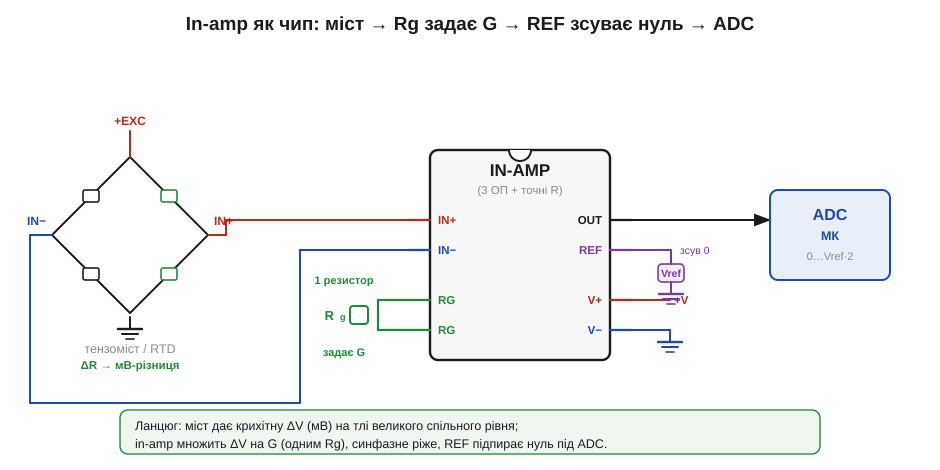
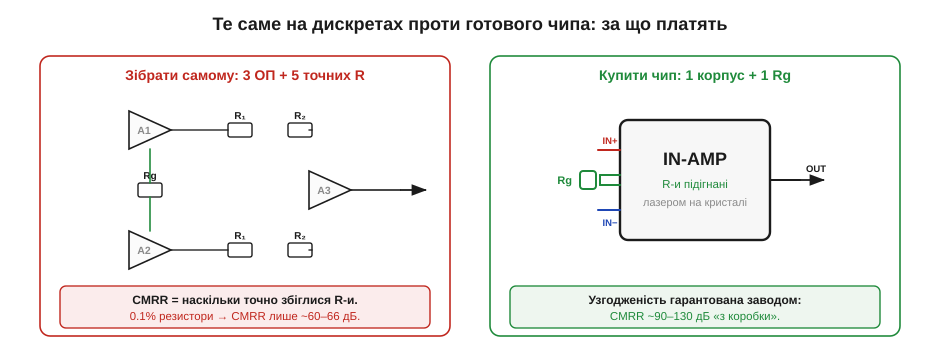

# 🔌 Інструментальний підсилювач: чому три ОП

> Компонентна вставка до теми [§2.12.7 «Інструментальний підсилювач: три ОП проти синфазної завади»](r12-legendary-analog-ics.md). §2.12.7 пояснив, **навіщо** саме така схема ріже синфазну заваду, а сусідня 🧮-вставка [«Чому саме три ОП»](r12-s7-m-inamp-cmrr.md) вивела підсилення і CMRR у числах. Тут — погляд **з боку плати**: in-amp як готовий чип, його ноги, як до нього під'єднати мостовий давач і за що, власне, платять, коли беруть мікросхему замість трьох окремих ОП.

### Що це за пристрій

**Інструментальний підсилювач** (*instrumentation amplifier*, in-amp) — це не один операційний підсилювач, а готовий **диференційний** вузол: підсилює лише **різницю** двох входів і майже не реагує на спільний для них рівень. Усередині — три ОП і п'ять точних резисторів, підігнаних ще на заводі. Зовні ж це звичайна 8-вивідна мікросхема, у якій підсилення задається **одним** зовнішнім резистором Rg.

### Розпіновка й підключення

Тепер, коли ми знаємо, що всередині, подивімося, які ноги цей чип виставляє назовні й що до кожної підключають.

*Рис. 2.12.7c.1. Типове ввімкнення in-amp. Мостовий давач (тензоміст або RTD) дає крихітну різницю в мілівольтах на тлі великого спільного рівня; вона заходить на IN+/IN−. Один зовнішній Rg між двома виводами RG задає підсилення G. Живлення +V/−V, вивід REF підпирає «нуль» виходу під вхід ADC, а OUT іде на АЦП мікроконтролера.*

Вісім ніг типового in-amp розподілені просто:

- **IN+ / IN−** (*inputs*) — два диференційні входи; різницю між ними й підсилюємо.
- **RG · RG** (*gain set*) — два виводи під **зовнішній** резистор Rg; його опір задає підсилення (звідси й одна «ручка» G).
- **OUT** (*output*) — вихід.
- **REF** (*reference*) — опорна нога: вихід відлічується **від неї**, а не від землі.
- **V+ / V−** (*supply*) — живлення (двополярне ±, або однополярне з «віртуальною землею» на REF).

### Перший байт: як зняти показ

Послідовність «оживлення» завжди однакова. Подаємо живлення на V+/V− і коротко — на сам міст. Ставимо Rg під потрібне підсилення (його значення бере з даташита-формули — це робота 🧮-вставки §2.12.7m, не повторюємо тут). Вхід REF саджаємо туди, де має бути **нуль** виходу: на землю при двополярному живленні або на половину опорної напруги АЦП при однополярному — тоді сигнал обох знаків влізе в діапазон АЦП. Виходить **аналоговий** ланцюг: ніякого «байта» по шині немає — «перший показ» знімає АЦП мікроконтролера, читаючи напругу на OUT. Здоровий стан перевіряють так: замкнули обидва входи разом — OUT має сісти рівно на рівень REF; розбалансували міст на дрібну величину — OUT має зрушити на цю величину, помножену на G.

> 🔧 **Навіщо це.** In-amp — стандартний «передпідсилювач» між давачем і АЦП там, де корисний сигнал мікроскопічний, а навколо — шум: тензоваги, RTD-термометри, шунтові давачі струму, ЕКГ-електроди. Без нього мілівольти моста просто потонули б у синфазній заваді (§2.12.7).

### Окремі ОП проти готового чипа

Усі три ОП можна спаяти й самому — постає закономірне питання, навіщо тоді платити за окрему мікросхему. Відповідь видно, щойно порівняти обидва варіанти поруч.

*Рис. 2.12.7c.2. Чому платять за чип. Зібраний уручну in-amp вимагає трьох ОП і п'яти **підігнаних** резисторів; точність придушення синфазної завади (CMRR) дорівнює тому, наскільки точно ці резистори збіглися. На звичайних 0.1%-резисторах CMRR виходить лише ~60–66 дБ. У мікросхемі резистори підрізані лазером прямо на кристалі, тож CMRR ~90–130 дБ дається «з коробки» — лишається поставити один Rg.*

Головна причина брати готовий in-amp, а не три ОП — це **узгодженість резисторів**. Придушення синфазної завади тримається на тому, що пари резисторів у різницевому каскаді ідеально рівні; будь-який розбаланс «протікає» синфазним сигналом на вихід. Зібрати таку рівність із дискретних 0.1%-резисторів важко, а температурний дрейф ще її псує. На кристалі ж резистори лежать поруч, дрейфують **разом** і підрізані лазером — звідси CMRR на десятки децибел кращий, ніж у саморобки, при одній зовнішній деталі.

### Типові граблі

- **Забули REF — поплив нуль.** Нога REF мусить бути на твердому низькоомному потенціалі. Підвісили її чи завели через дільник із великим опором — нуль виходу «гуляє», і весь CMRR псується.
- **Немає шляху для вхідних струмів зміщення.** Якщо обидва входи бачать давач лише через високий опір, крихітний струм зміщення нікуди стікати — вихід тихо впирається в шину. Завжди потрібен шлях постійного струму на «землю» входів.
- **Rg занадто малий.** Дуже велике підсилення множить і власний дрейф нуля in-amp, тож вихід може зашкалити ще до сигналу. Часто частину підсилення лишають уже після АЦП.
- **Вийшли за діапазон живлення.** Спільний рівень входів і розмах виходу мусять лишатися всередині V+/V− (у «rail-to-rail» — близько до них, але не за ними).

### Варіації класу

Усе сказане вище описувало класичну схему на трьох ОП, але під одну назву «in-amp» збирають кілька різновидів. Бувають **триоповий** in-amp (класика з рис. 2.12.7c.1) і компактніший **двооповий** — дешевший, але з гіршим CMRR на високих частотах. Окремий підклас — **цифрові** (programmable-gain) in-amp, де G перемикають не резистором, а командою по шині. А коли треба ще й гальванічна розв'язка (медицина, висока напруга), беруть **ізольований** in-amp, де вхід і вихід живляться окремо й сигнал переходить бар'єр без спільної землі.
