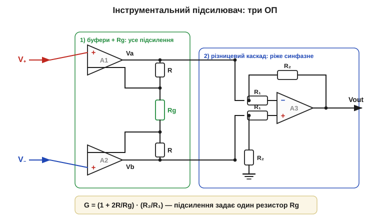
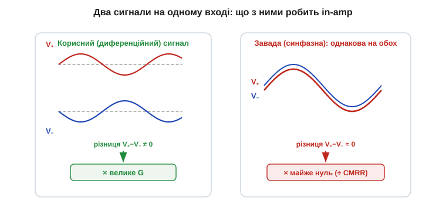

# 🧮 Чому саме три ОП: підсилення інструментального підсилювача й CMRR

> Це математична вставка до теми [2.12.7 «Інструментальний підсилювач»](r12-legendary-analog-ics.md). Тема пояснила задачу словами: треба піймати кілька мілівольтів корисного сигналу, що сидять на кількох вольтах однакової для обох дротів завади. Тут — **числа**: звідки береться формула підсилення з одним резистором Rg, що таке CMRR кількісно, і чому одного різницевого підсилювача мало, а три ОП — у самий раз.

### Означення: дві напруги, два підсилення

У будь-якого підсилювача з двома входами сигнал розкладається на дві частини. **Диференційна** (*differential*) — це **різниця** входів, корисне: V_d = V₊ − V₋. **Синфазна** (*common-mode*) — це їхнє **спільне** значення, найчастіше завада: V_cm = (V₊ + V₋)/2. Реальний підсилювач підсилює обидві, кожну зі своїм коефіцієнтом: вихід = A_d·V_d + A_cm·V_cm. Мрія — підсилити лише різницю (A_d велике) і викинути спільне (A_cm → 0).

**Коефіцієнт ослаблення синфазного сигналу** (*Common-Mode Rejection Ratio*, **CMRR**) — це відношення двох підсилень, тобто наскільки сильніше схема реагує на різницю, ніж на спільне:

```
CMRR = A_d / A_cm        (у разах)
CMRR(дБ) = 20·log₁₀(A_d / A_cm)   (з §2.4.4)
```

Що більший CMRR, то чистіше різниця відділена від завади. 60 дБ — це тисяча разів, 100 дБ — сто тисяч.

### Інтуїція: чому простий різницевий підсилювач не тягне

Найпростіший «віднімач» — один ОП із чотирма резисторами ([§2.8.6](../ch13-opamp-comparator/ch13-opamp-comparator.md)) — у теорії має A_cm = 0. Але рівно нуль виходить, **лише якщо чотири резистори ідеально узгоджені**. У житті вони з допуском, і саме розбіжність народжує паразитне A_cm. Для віднімача з підсиленням A_d = R₂/R₁ і резисторами з відносним допуском t (кожен у межах ±t) гранична оцінка така:

```
CMRR ≈ (1 + R₂/R₁) / (4·t)
```

Підставимо реальність: одиничне підсилення (R₂/R₁ = 1) на резисторах 0.1 % (t = 0.001):

```
CMRR ≈ (1 + 1) / (4·0.001) = 500  →  20·log₁₀(500) ≈ 54 дБ
```

Лише **54 дБ** — і це за дорогих 0.1-відсоткових резисторів. До того ж вхід такого віднімача низькоомний (через R₁ навантажує джерело), а давач часто високоомний. Виходить дві біди заразом — поганий CMRR і низький вхідний опір, — і саме тому простий віднімач не тягне.

### Апарат: що додають перші два ОП

Обидві біди лікують **перші два** ОП, додані перед віднімачем. Сигнал спершу заходить на **два буфери** A1 і A2 прямо в неінвертуючі входи — вхідний опір одразу величезний, джерело не просідає. А між їхніми інвертуючими входами стоїть один-єдиний резистор **Rg**, обабіч якого — два однакові R зворотного зв'язку.


*Рис. 2.12.7m.1. Перший каскад (зелене) — два буфери, з'єднані ланцюгом R–Rg–R; він задає диференційне підсилення одним резистором Rg. Другий каскад (синє) — різницевий підсилювач на A3, що віднімає Va−Vb і ріже синфазну заваду. Загальне підсилення — добуток двох.*

Уся хитрість у тому, як ланцюг R–Rg–R бачить два типи сигналу. Завдяки «віртуальному короткому» ([§2.8.3](../ch13-opamp-comparator/ch13-opamp-comparator.md)) напруги на кінцях Rg повторюють входи V₊ і V₋, тож на Rg падає **різниця** V_d, і крізь нього (а отже й крізь обидва R) тече струм i = V_d/Rg. Цей струм піднімає виходи буферів на i·R кожен, тому диференційне підсилення першого каскаду:

```
A_d1 = (R + Rg + R) / Rg = 1 + 2R/Rg
```

А тепер ключове. Для **синфазного** сигналу обидва входи однакові, різниці на Rg немає, струм нульовий — буфери просто повторюють спільну напругу. Тобто **A_cm1 = 1**: перший каскад підсилює різницю в (1 + 2R/Rg) разів, а заваду — в один раз. Перемноживши на CMRR другого каскаду, дістаємо виграш: CMRR_перший ≈ A_d1, і він **множить** ослаблення віднімача.

Повне підсилення — добуток каскадів (другий дає R₂/R₁):

```
G = (1 + 2R/Rg) · (R₂/R₁)
```

Підсилення задає **один резистор Rg** — змінив його, і змінилося все підсилення, причому симетрія двох R збереглася. У промислових мікросхемах (AD620-клас) це зашито формулою на кшталт G = 1 + 49.4 кОм/Rg.

### Чому це працює: число для CMRR

Складемо разом. Хай перший каскад дає A_d1 = 100, а віднімач — ті самі 54 дБ:

```
CMRR_сист ≈ A_d1 · CMRR_віднімача = 100 · 500 = 50 000
20·log₁₀(50 000) ≈ 94 дБ
```

Два вхідні ОП додали +20·log₁₀(100) = 40 дБ «згори» — і замість жалюгідних 54 дБ маємо **94 дБ**. Ось чому ОП саме три: два піднімають вхідний опір і додають CMRR-виграш, третій — віднімає й узгоджує. Жоден поодинці цього не дає.


*Рис. 2.12.7m.2. Ліворуч — корисний диференційний сигнал: дроти гойдаються протифазно, різниця V₊−V₋ ≠ 0, її підсилюють у G разів. Праворуч — синфазна завада: обидва дроти ходять разом, різниця ≈ 0, і її душить CMRR. In-amp розрізняє ці два сценарії апаратно.*

### Де в курсі це працює

Уся механіка тут — це [§2.8](../ch13-opamp-comparator/ch13-opamp-comparator.md) у дії: «віртуальне коротке» ([§2.8.3](../ch13-opamp-comparator/ch13-opamp-comparator.md)) дало струм через Rg, від'ємний зворотний зв'язок ([§2.8.2](../ch13-opamp-comparator/ch13-opamp-comparator.md)) тримає підсилення на резисторах, а різницевий каскад — це суматор-віднімач із [§2.8.6](../ch13-opamp-comparator/ch13-opamp-comparator.md). Логарифм у децибелах CMRR — з [§2.4.4](../r04-frequency-response/r04-frequency-response.md). А практичний бік — давачі, що дають мілівольти на тлі вольтів (тензоміст, термопара), — чекає у вимірювальних розділах далі.

> 🔧 **Навіщо це.** Тримайте в голові два рядки: **G = (1 + 2R/Rg)·(R₂/R₁)** і **CMRR_сист ≈ (підсилення front-end)·(CMRR віднімача)**. Перший каже, що все підсилення крутиться одним резистором Rg. Другий — чому in-amp б'є простий віднімач: front-end не лише підсилює різницю, а ще й множить ослаблення завади. Тому для слабкого сигналу на тлі великої синфазної напруги беруть саме інструментальний підсилювач, а не один ОП.
