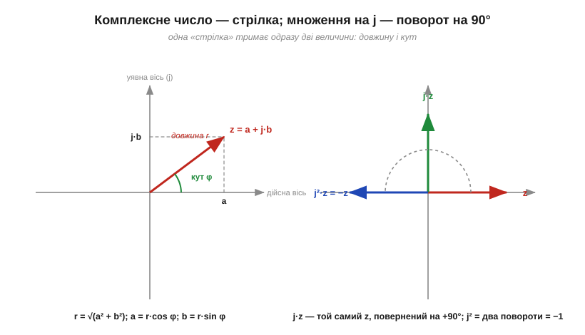
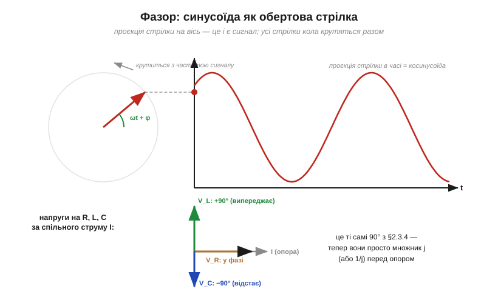

# 🧮 Комплексні числа й фазори: вся змінна напруга — однією стрілкою

> Це математична вставка до теми [2.3.1 «Чому "опір" C і L залежить від частоти»](reactance-resonance.md). Розділ навчив тримати в голові одразу дві речі про кожен сигнал: **скільки** ом протидії та **на скільки** зсунута фаза. Математика має інструмент, що пакує обидві в один об'єкт, — комплексні числа. Саме їхньою мовою інженери рахують кола змінного струму, і саме вона ховається за словом «імпеданс» у даташитах. Тут — рівно той мінімум, що потрібен для електроніки.

### Число-стрілка

Уведемо число **j** з єдиною властивістю: j² = −1. (Математики пишуть i, але в електроніці i зайняте струмом — тому j.) **Комплексне число** (*complex number*) z = a + j·b — це не містика, а просто **пара** чисел, зображена стрілкою на площині: a кроків по «дійсній» осі, b — по «уявній». У стрілки є дві рівноцінні мови опису: прямокутна (координати a і b) та полярна — **довжина r** і **кут φ**:

```
r = √(a² + b²)          a = r·cos φ
φ = arctg(b/a)          b = r·sin φ
```


*Рис. 2.3.1m.1. Ліворуч: z = a + j·b — стрілка з довжиною r і кутом φ. Праворуч — головний фокус: множення на j повертає стрілку на 90°, не змінюючи довжини. Два повороти по 90° — це розворот на 180°, тобто мінус: ось звідки j² = −1. Це не аксіома з неба, а геометрія.*

Головна операція для нас — **множення**: довжини перемножуються, **кути додаються**. Зокрема, множення на j — це чистий **поворот на +90°**. Запам'ятайте цей факт: він зараз перетворить усі «зсуви на чверть періоду» з [§2.3.4](reactance-resonance.md) на просту алгебру.

### Фазор: заморозити обертання

Тепер місток до сигналів. Синусоїду з амплітудою A і початковою фазою φ можна уявити як **обертову стрілку**: довжина A, кут зростає як ωt + φ, а сам сигнал — це **проєкція** стрілки на горизонтальну вісь.


*Рис. 2.3.1m.2. Стрілка крутиться з частотою сигналу; її тінь на осі малює косинусоїду. У лінійному колі всі сигнали мають одну частоту — всі стрілки крутяться разом, тож обертання можна «заморозити» й порівнювати лише довжини та кути. Унизу — знайомі 90° з §2.3.4 мовою стрілок: V_R уздовж струму, V_L повернена на +90°, V_C на −90°.*

У лінійному колі на синусоїді **все коливається з однією частотою** ([§2.3.1](reactance-resonance.md)) — отже, всі стрілки обертаються синхронно, і обертання можна подумки зупинити. Застиглу стрілку звуть **фазором** (*phasor*): вона зберігає лише те, що відрізняє сигнали один від одного, — **амплітуду** (довжина) і **фазу** (кут). Додати два сигнали = додати стрілки «голова до хвоста»; зсунути фазу = повернути стрілку. Уся тригонометрія з нескінченними формулами синусів суми перетворюється на геометрію стрілок.

### Реактивності стають «опорами»: імпеданс

А тепер — нагорода. Похідна синусоїди — та сама синусоїда, лише зсунута на чверть періоду вперед і помножена на ω ([§2.3.4](reactance-resonance.md) це показав на графіках). Мовою фазорів «зсунути на 90° і помножити на ω» — це просто **помножити на j·ω**. Тоді компонентні закони з [§2.1](../capacitor/capacitor.md) і [§2.2](../inductor/inductor.md) перетворюються на звичайні «закони Ома» з комплексними опорами:

```
i = C·dv/dt   →   I = jωC·V   →   Z_C = V/I = 1/(jωC)
v = L·di/dt   →   V = jωL·I   →   Z_L = jωL
резистор:                          Z_R = R
```

Цю комплексну величину Z звуть **імпедансом** (*impedance*) — повним опором змінному струмові. Придивіться: її **модуль** — це знайомі реактивності |Z_C| = 1/(ωC) = Xc та |Z_L| = ωL = XL з [§2.3.2](reactance-resonance.md)–[§2.3.3](reactance-resonance.md), а **множник j** — це і є зсув на 90° з [§2.3.4](reactance-resonance.md) (j у чисельнику — напруга випереджає, j у знаменнику — відстає). Одна буква тримає обидві половини знання.

### Закон Ома повертається — з усім Модулем 1

Найцінніший наслідок: з імпедансами **всі** інструменти аналізу кіл працюють на змінному струмі без змін. Послідовні Z додаються, паралельні складаються оберненими, дільник напруги — та сама формула ([§1.4–§1.5](../../block-1-circuits-physics/kirchhoff-circuit-analysis/kirchhoff-circuit-analysis.md)). Просто арифметика тепер комплексна.

**Приклад (послідовні R і C).** R = 1 кОм і C = 159 нФ на частоті 1 кГц (Xc ≈ 1000 Ом, [§2.3.2](reactance-resonance.md)):

```
Z = R + 1/(jωC) = 1000 − j·1000  Ом
|Z| = √(1000² + 1000²) ≈ 1414 Ом        (не 2000!)
φ  = arctg(−1000/1000) = −45°
```

Опори «під кутом 90° один до одного» додаються як катети, а не як числа, — ось чому в реактивних колах омметрова арифметика бреше, а фазорна каже правду: струм у цьому колі на 45° випереджає напругу джерела.

**Приклад (резонанс одним рядком).** Послідовні L і C:

```
Z = jωL + 1/(jωC) = j·(ωL − 1/(ωC))
```

Дві уявні частини мають **протилежні знаки** — і на частоті, де ωL = 1/(ωC), скорочуються вщент: Z = 0. Це і є резонанс [§2.3.5](reactance-resonance.md), здобутий без жодного графіка — самою алгеброю знаків.

### Де це працює в курсі

Фазорна мова — не альтернативний спосіб запису, а **робоча мова** всієї аналогової інженерії. Реактивності й зсуви фаз цього розділу — це модулі й кути імпедансів; резонанс і вибірковість ([§2.3.5](reactance-resonance.md)–[§2.3.7](reactance-resonance.md)) — алгебра скорочення уявних частин; у наступному розділі про АЧХ і фільтри саме відношення комплексних імпедансів дасть передавальні функції, а «відбитий опір» трансформатора ([вставка про n²](../inductor/math-turns-ratio.md)) узагальниться до узгодження імпедансів. Інвестиція в одну картинку — «стрілка, що повертається при множенні на j», — окупається до кінця курсу.
