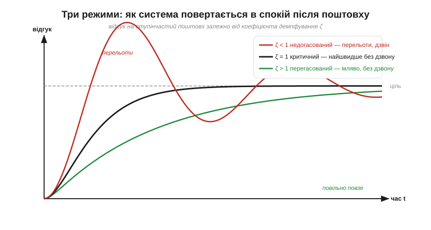
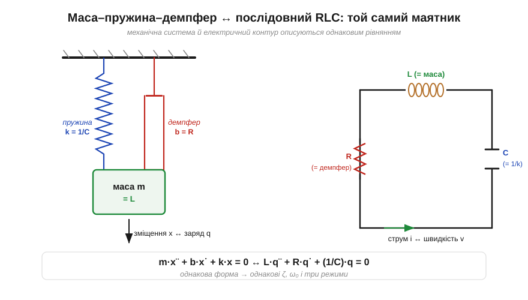
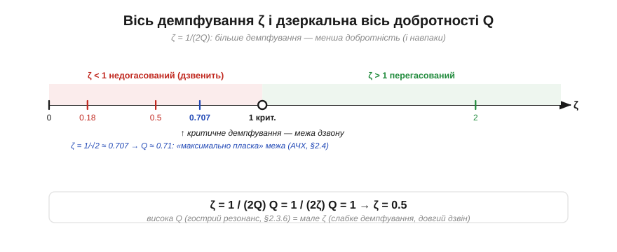

# 🧮 Коливання з демпфуванням: ζ, три режими і зв'язок із Q

> Це математична вставка до теми [2.3.6 «Добротність Q і смуга»](reactance-resonance.md). Тема описала «дзвінкість» контуру через Q — гостроту піка й тривалість дзвону. Але є **другий, дзеркальний погляд** на ту саму річ: не «наскільки добре коло тримає коливання», а «наскільки сильно його гасять». Цю міру звуть **коефіцієнтом демпфування** (*damping ratio*, ζ — дзета), і саме він ділить усі коливальні системи на три виразні режими. Розібравшись із ζ один раз тут, ви впізнаєте його далеко за межами електроніки — від форми перехідного процесу у фільтрі до того, як IMU гойдається на вібрації мотора ([§5.7.8](../../block-5-sensors-control/imu-mems/imu-mems.md)).

### Означення: ζ — наскільки гасять коливання

Почнімо з того, звідки взагалі береться гасіння. Контур з [§2.3.6](reactance-resonance.md) лишався б у незгасальному гойданні (енергія перетікає між C і L), якби не **втрати** — опір R. Опір з'їдає енергію щоциклу, як тертя зупиняє маятник. Коефіцієнт демпфування ζ — це безрозмірна міра того, **наскільки сильно** ці втрати гасять коливання; відлічують її від тієї кількості гасіння, якої рівно вистачає, щоб коливання зникли за один підхід:

```
ζ = 0      зовсім без втрат — вічне коливання
ζ < 1      слабкі втрати — система ще коливається, але дзвін згасає
ζ = 1      «критичне» демпфування — межа: коливань уже нема
ζ > 1      сильні втрати — система навіть не коливається, мляво повзе
```

Ключове число — **ζ = 1**: рівно стільки демпфування, щоб коливання щойно зникли. Менше — система ще «дзвенить»; більше — вона вже «загрузла».

### Три режими: форма повернення в спокій

Найнаочніше ζ видно, коли систему «смикнути» (різко змінити вхід) і дивитися, як вона повертається в рівновагу. Виходять **три якісно різні** картини.


*Рис. 2.3.6m.1. Відгук на ступінчастий поштовх. **Недогасований** (ζ < 1, червоний) — перелітає ціль і дзвенить навколо неї, поступово згасаючи. **Критичний** (ζ = 1, чорний) — найшвидше дістається цілі без жодного перельоту. **Перегасований** (ζ > 1, зелений) — підповзає мляво, теж без перельоту, але повільніше за критичний.*

- **Недогасований** (*underdamped*, ζ < 1): система перестрибує ціль, відкочується, знову перестрибує — **дзвенить**, аж поки коливання згасне. Це режим радіоконтуру з [§2.3.6](reactance-resonance.md): малі втрати, довгий дзвін.
- **Критичний** (*critically damped*, ζ = 1): рівно та межа, де коливання щойно зникають. Система дістається цілі **найшвидше з можливих** і не перелітає. Це ідеал для багатьох систем керування.
- **Перегасований** (*overdamped*, ζ > 1): втрати такі великі, що система **ліниво підповзає** до цілі, навіть не намагаючись коливнутися — повільніше за критичний.

Тут ховається пастка для інтуїції: «найбільше демпфування» — не означає «найшвидше». Перегасована система (ζ = 2) дістається цілі **повільніше** за критичну (ζ = 1), бо надлишок «тертя» гальмує сам рух. Найшвидше без перельоту — рівно на межі, ζ = 1.

### Апарат: рівняння, спільне для контуру й маятника

Звідки беруться саме ці три режими? З рівняння, яке пише сам послідовний RLC-контур. Підставивши закони C і L (як у [вставці про формулу Томсона](math-thomson-formula.md), лише з опором), дістаємо рівняння для заряду q:

```
L·q¨ + R·q˙ + (1/C)·q = 0
```

(крапки — похідні за часом). Це **точно та сама форма**, що в маси m на пружині k з тертям b — рівняння, яке вивчають у механіці коливань:

```
m·x¨ + b·x˙ + k·x = 0
```


*Рис. 2.3.6m.2. Той самий маятник у двох костюмах. Маса m ↔ індуктивність L (інерція струму, [§2.2.2](../inductor/inductor.md)); жорсткість пружини k ↔ 1/C; тертя демпфера b ↔ опір R. Зміщення x ↔ заряд q, швидкість v ↔ струм i. Однакова форма рівняння → однакові ζ, ω₀ і ті самі три режими.*

Звідси два числа повністю задають поведінку: **власна частота** ω₀ = 1/√(LC) (незгасальна, [§2.3.5](reactance-resonance.md)) і коефіцієнт демпфування ζ. Для послідовного контуру:

```
ζ = (R/2)·√(C/L)
```

Прочитаймо: більший опір R — більше демпфування (логічно, більше тертя); більша L або менша C — менше демпфування (важча «маса», тугіша «пружина» тримають коливання краще). Опір — це той самий демпфер b, що душить механічний маятник.

### Зв'язок із Q: одне число навиворіт

А тепер найголовніше, заради чого ми й завели ζ: ζ і добротність Q з [§2.3.6](reactance-resonance.md) — це **те саме число, побачене з двох боків**. Підставивши Q = ω₀L/R ([§2.3.6](reactance-resonance.md)) у вираз для ζ, дістаємо просте дзеркало:

```
ζ = 1 / (2Q)        Q = 1 / (2ζ)
```


*Рис. 2.3.6m.3. ζ = 1/(2Q): висока добротність (гострий резонанс, довгий дзвін) — це мале демпфування, і навпаки. Межа ζ = 1 (критичне) відповідає Q = 0.5: нижче неї коло вже не коливається. Особлива точка ζ = 1/√2 ≈ 0.707 (Q ≈ 0.71) — «максимально пласка» межа, до якої повернемося в АЧХ ([§2.4](../frequency-response/frequency-response.md)).*

Тож гострий радіоконтур із Q = 100 має мізерне ζ = 0.005 (ледь демпфований — дзвенить сотні циклів), а м'який згладжувальний фільтр із Q = 0.5 сидить рівно на критичній межі ζ = 1 (не дзвенить узагалі). «Висока Q» і «мале ζ» — синоніми; інженери з радіотехніки звичніше говорять Q, а з систем керування й механіки — ζ, але описують вони одне явище. Межі теж сходяться: Q = 0.5 ↔ ζ = 1 — кордон, нижче якого коливань уже нема.

### Де це працює в курсі

ζ і три режими — це місток від резонансу до **перехідних процесів** скрізь далі в курсі. Найближче він знадобиться в наступному розділі про АЧХ ([§2.4](../frequency-response/frequency-response.md)): там демпфування задасть форму «коліна» фільтра — мале ζ дає гострий пік (і дзвін на фронтах), а ζ ≈ 0.707 — найрівнішу смугу без піка. У системах керування ζ — головна ручка: критичне демпфування дає найшвидший відгук без перельоту, перегасоване — повільний, але «спокійний». А найпряміший слід — у механічних коливаннях давачів: вібрації мотора розгойдують чутливий елемент IMU, і щоб він не «дзвенів» на резонансі, його навмисне демпфують і механічно розв'язують ([§5.7.8](../../block-5-sensors-control/imu-mems/imu-mems.md)). Той самий ζ, що тут описує дзвін RLC, там вирішує, чи переживе акселерометр тряску. Один коефіцієнт — для електричних контурів, амортизаторів авто й кріплення давача: скрізь, де щось коливається й гасне.
