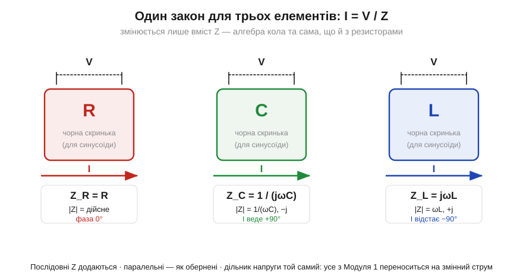
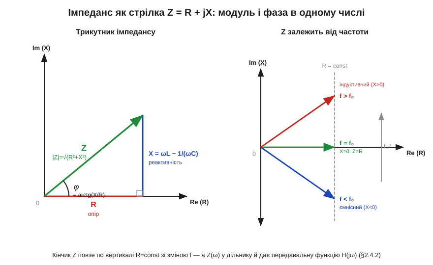

# 🧮 Імпеданс Z: узагальнений закон Ома для змінного струму

> Це математична вставка до теми [2.3.4 «Зсув фаз»](reactance-resonance.md). Тема показала дві риси реактивного елемента нарізно: **скільки** ом протидії (модуль X) і **на скільки** зсунута фаза (кут 90°). [Фазорна вставка](math-complex-phasors.md) спакувала обидві в одне число-стрілку. Тут — наслідок, заради якого все й затівалося: одне-єдине правило **I = V / Z**, що повертає весь арсенал Модуля 1 на змінний струм без жодних змін. Імпеданс — це місток від фазора ([§2.3.1](reactance-resonance.md)) до передавальної функції, з якої починається наступний розділ.

### Означення: відношення двох фазорів

**Імпеданс** (*impedance*, Z) елемента — це відношення фазора напруги на ньому до фазора струму крізь нього:

```
Z = V / I        [Ом]
```

Придивіться: формою це дослівно **закон Ома** R = V/I із [§1.3.2](../../block-1-circuits-physics/resistance-power-heat/resistance-power-heat.md). Різниця одна — V та I тепер не числа, а **стрілки** (комплексні амплітуди), тож і їхнє відношення — комплексне. Ділити стрілки означає робити дві дії заразом: модулі **поділити**, а кути **відняти**. Тому в одному Z уже сидять обидві риси з [§2.3.4](reactance-resonance.md): його **модуль** |Z| каже, у скільки разів напруга більша за струм (повний опір), а його **кут** φ — на скільки струм зсунутий за напругою. Слово «імпеданс» — це не «опір плюс щось ще», а саме **узагальнення** опору на світ, де в гри вступила фаза.

### Інтуїція: один закон, різний вміст

Найкорисніший спосіб тримати імпеданс у голові — уявити кожен елемент **чорною скринькою**, до якої прикладено синусоїдну напругу V і крізь яку тече струм I. Скринька підкоряється закону I = V/Z; усе, що відрізняє резистор від конденсатора й котушки, — це **вміст** її Z.


*Рис. 2.3.4m.1. Резистор, конденсатор і котушка як чорні скриньки під спільним законом I = V/Z. Z_R = R дійсне (струм у фазі); Z_C = 1/(jωC) — модуль 1/(ωC) і множник −j (струм веде на +90°, «ICE»); Z_L = jωL — модуль ωL і множник +j (струм відстає на 90°, «ELI»). Множник j — це і є прямий кут із фазорної діаграми §2.3.4; алгебра кола не помічає, котра скринька всередині.*

Три імпеданси збираються з уже відомого. Резистор зсуву не дає — його Z **дійсний**: Z_R = R. Реактивності дають по 90°, тобто множник j (поворот на чверть оберту, [фазорна вставка](math-complex-phasors.md)): у котушки напруга веде, тож Z_L = jωL; у конденсатора веде струм, тож множник j опиняється в знаменнику — Z_C = 1/(jωC). Модулі цих виразів — точно реактивності XL = ωL та Xc = 1/(ωC) з [§2.3.2](reactance-resonance.md)–[§2.3.3](reactance-resonance.md). Нічого нового не введено: імпеданс лише **зшив** модуль і фазу в один символ.

> 🔧 **Навіщо це.** У даташитах і симуляторах «опір» реактивних вузлів завжди подають як комплексний імпеданс: вхідний імпеданс підсилювача, вихідний імпеданс джерела, хвильовий імпеданс лінії 50 Ом. Хто читає Z як «модуль під кутом», той одразу бачить, гріється вузол чи лише гойдає енергію, і чи узгоджені каскади.

### Апарат: чому повертається весь Модуль 1

Головна вигода не в самому Z, а в тому, що з ним **усі** правила аналізу кіл працюють на синусоїді дослівно, як із резисторами, — бо виведені вони були з законів Кірхгофа, а ті не залежать від того, число опір чи стрілка. Послідовні імпеданси **додаються**, паралельні складаються через обернені, дільник напруги — та сама формула ([§1.4](../../block-1-circuits-physics/kirchhoff-circuit-analysis/kirchhoff-circuit-analysis.md)–[§1.5](../../block-1-circuits-physics/equivalent-circuits/equivalent-circuits.md)):

```
послідовно:   Z = Z₁ + Z₂ + …
паралельно:   1/Z = 1/Z₁ + 1/Z₂ + …
дільник:      V_вих = V_вх · Z₂ / (Z₁ + Z₂)
```

Уся різниця — арифметика стала комплексною. Складемо послідовно R, L і C:

```
Z = R + jωL + 1/(jωC) = R + j·(ωL − 1/(ωC)) = R + jX
```

Дійсна частина — опір R, уявна — сумарна **реактивність** X = ωL − 1/(ωC) (різниця, бо фазори C і L дивляться в протилежні боки, [§2.3.4](reactance-resonance.md)). Це число-стрілка на комплексній площині: горизонтальний катет R, вертикальний X, гіпотенуза — сам Z.


*Рис. 2.3.4m.2. Ліворуч — трикутник імпедансу: |Z| = √(R² + X²) і φ = arctg(X/R). Ось чому опір і реактивність складаються «за Піфагором», а не арифметично ([§2.3.4](reactance-resonance.md)): вони перпендикулярні. Праворуч — головне: при сталому R кінчик Z повзе по вертикалі вгору-вниз зі зміною частоти — ємнісний (X<0) внизу, X=0 у резонансі (Z=R, [§2.3.5](reactance-resonance.md)), індуктивний (X>0) угорі. Z — це функція частоти.*

Так трикутник Піфагора з §2.3.4 виявляється просто **геометрією комплексного Z**: |Z| = √(R² + X²), а кут φ = arctg(X/R) — це і є той проміжний зсув фаз «між 0 і 90°», який тема обіцяла, але не розгортала.

### Де це працює в курсі — і що далі

Найважливіша риса видно в правій панелі рисунка: Z залежить від частоти, **Z = Z(ω)**. Це не статичний опір, а функція: на низькій частоті переважає Z_C і коло ємнісне, на високій — Z_L і коло індуктивне, а в точці, де реактивності зрівнялися, X = 0 і лишається чистий R — це резонанс [§2.3.5](reactance-resonance.md), здобутий тут одним рядком алгебри знаків. Добротність і смуга ([§2.3.6](reactance-resonance.md)) теж читаються з того, як швидко Z(ω) проходить свою найвужчу точку.

А далі ця функція робить наступний крок. Якщо підставити частотозалежні Z у формулу дільника напруги, відношення V_вих/V_вх саме стане функцією частоти — її звуть **передавальною функцією** H(jω), і з неї виростають АЧХ, фаза й діаграма Боде ([§2.4.2](../frequency-response/frequency-response.md)). Іншими словами: фазор ([§2.3.1](reactance-resonance.md)) дав стрілку, імпеданс перетворив компонентні закони на «омівські», а дільник із цих імпедансів — це вже портрет цілого кола. Один закон I = V/Z тримає всю цю ланку.

> ▶️ Далі: [Розділ 2.4 — АЧХ, децибели й фільтри](../frequency-response/frequency-response.md).
