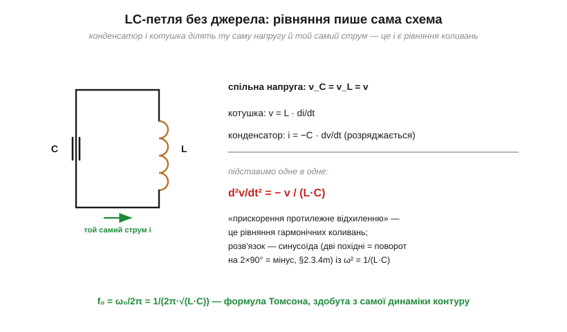
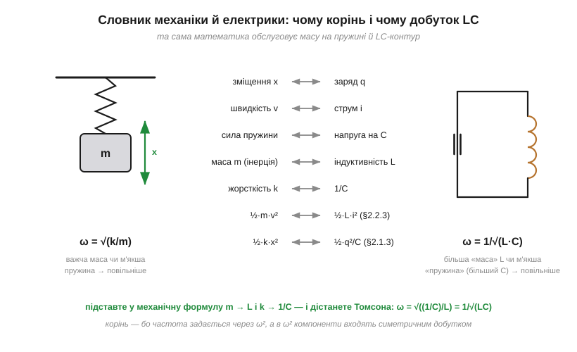

# 🧮 Формула Томсона f₀ = 1/(2π√(LC)): виведення й аналогія з маятником

> Це математична вставка до теми [2.3.5 «LC-резонанс»](reactance-resonance.md). Тема здобула формулу Томсона з умови «реактивності зрівнялися». Це чесний шлях, але він не пояснює головного дива: чому контур, у якому реактивності зрівнялися, коливається **сам**, без жодного джерела. Тут — два виведення (швидке й глибоке), механічний словник, що робить формулу очевидною, і відчуття масштабів у числах.

### Шлях перший: рівність реактивностей — один рядок

Резонанс — це коли реактивність котушки зрівнялася з реактивністю конденсатора ([§2.3.5](reactance-resonance.md)). Прирівнюємо й розв'язуємо відносно ω:

```
ωL = 1/(ωC)   →   ω² = 1/(L·C)   →   ω₀ = 1/√(L·C)   →   f₀ = 1/(2π·√(L·C))
```

Звідси одразу видно й **чому корінь**: частота визначається через ω², а в ω² компоненти входять симетричним **добутком** L·C. Подвоїли L — частота впала лише в √2 разів; щоб удвічі знизити частоту, добуток LC треба збільшити **вчетверо**.

### Шлях другий: рівняння, яке пише сама схема

Глибше виведення не потребує навіть поняття реактивності. Візьмімо чисту LC-петлю без джерела: заряджений конденсатор, замкнений на котушку. Обидва компоненти ділять ту саму напругу v і той самий струм i, а їхні закони ми знаємо з [§2.1](../capacitor/capacitor.md) і [§2.2](../inductor/inductor.md):

```
котушка:      v = L · di/dt
конденсатор:  i = −C · dv/dt        (мінус: струм РОЗРЯДЖАЄ конденсатор)
```

Підставимо друге рівняння в перше:

```
v = L · d/dt( −C·dv/dt )   →   d²v/dt² = − v/(L·C)
```


*Рис. 2.3.5m.1. Конденсатор і котушка в петлі ділять напругу й струм — підстановка одного компонентного закону в інший дає рівняння d²v/dt² = −v/(LC): «прискорення» напруги протилежне самій напрузі. Це рівняння гармонічних коливань, і його розв'язок — синусоїда з ω² = 1/(LC).*

Прочитаймо це рівняння словами: **друга похідна напруги пропорційна самій напрузі з мінусом**. А ми вже знаємо з [вставки про похідні синуса](math-sine-derivative.md), яка функція так уміє: дві похідні синусоїди — це два повороти по 90°, тобто рівно **мінус вона сама**. Перевіримо підстановкою v = V₀·cos(ω₀t):

```
d²v/dt² = −ω₀²·v        порівнюємо з        d²v/dt² = −v/(L·C)
                →   ω₀² = 1/(L·C)   ✓
```

Та сама формула Томсона — але тепер вона каже більше. Рівняння має синусоїдний розв'язок **без жодного джерела в колі**: контур коливається сам, бо така його динаміка. Ось строгий зміст «електричного маятника» з [§2.3.5](reactance-resonance.md) — і саме цей дзвін ми ловили осцилографом, [вимірюючи індуктивність](../inductor/proj-inductance-meter.md).

### Словник: маса на пружині

Найшвидший спосіб запам'ятати формулу назавжди — механічна аналогія. Рівняння маси m на пружині жорсткості k виглядає точно так само: m·d²x/dt² = −k·x, звідки ω = √(k/m). Зіставимо ролі:


*Рис. 2.3.5m.2. Зміщення ↔ заряд, швидкість ↔ струм, маса ↔ індуктивність (інерція струму, §2.2.2), жорсткість пружини ↔ 1/C. Підстановка m → L і k → 1/C перетворює механічну формулу ω = √(k/m) на Томсонову ω = 1/√(LC). Навіть енергії відповідають одна одній: ½mv² ↔ ½Li², ½kx² ↔ ½q²/C.*

Словник не формальний — він фізичний. **Індуктивність — це маса**: котушка опирається зміні струму, як маса — зміні швидкості ([§2.2.2](../inductor/inductor.md)), і її енергія ½Li² — точний аналог кінетичної. **1/C — це жорсткість**: що менший конденсатор, то «тугіша пружина» — більша напруга за той самий заряд (V = Q/C, [§2.1.2](../capacitor/capacitor.md)), і ½q²/C — аналог пружної енергії. Тоді інтуїція механіки переноситься дослівно: важча маса (більша L) і м'якша пружина (більший C) — **повільніші** коливання. Гойдання енергії «поле C ↔ поле L» з теми — це гойдання «пружна ↔ кінетична» в маятнику.

### Масштаби в числах

**Приклад (радіо).** L = 100 мкГн, C = 100 пФ:

```
f₀ = 1/(2π·√(10⁻⁴ · 10⁻¹⁰)) = 1/(2π·10⁻⁷) ≈ 1.59 МГц
```

Середина АМ-діапазону — типовий контур приймача з [історії розділу](hist-tuned-circuit.md).

**Приклад (звук).** L = 10 мГн, C = 10 мкФ:

```
f₀ = 1/(2π·√(10⁻² · 10⁻⁵)) ≈ 503 Гц
```

Ті самі дві деталі, інші номінали — і контур «співає» в середині звукового діапазону.

І практичний наслідок кореня для налаштування: f₀ ∝ 1/√C, тож змінний конденсатор із перекриттям ємності 4:1 дає перестроювання частоти лише 2:1. Саме тому ручка старого приймача з [§2.3.5](reactance-resonance.md) перекривала один діапазон, а для інших діапазонів перемикали котушки.

### Де це працює в курсі

Формула Томсона — робочий інструмент усього, що резонує: розрахунок контуру під частоту ([§2.3.5](reactance-resonance.md)), розуміння смуги й добротності ([§2.3.6](reactance-resonance.md) — Q жонглює тією самою енергією, що гойдається тут), пошук паразитних резонансів (SRF котушки з [§2.2.7](../inductor/inductor.md), дзвін бусини з конденсаторами з [§2.2.9](../inductor/inductor.md)) і вимірювання індуктивності дзвоном. А механічний словник цієї вставки — двері до всіх коливальних систем курсу: від кварцового резонатора до антени той самий маятник лише міняє костюми.
