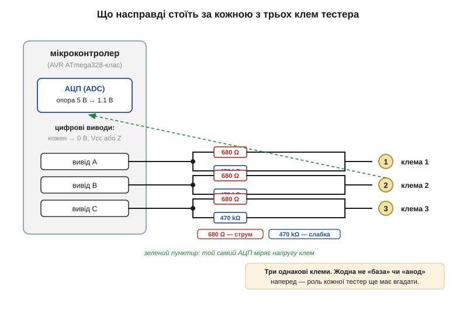

# 🔌 Кишеньковий тестер компонентів: як він вгадує тип і розпіновку

> Це компонентна вставка до теми [§2.9.7 «Практикум: даташити діода, MOSFET і ОП»](reading-datasheets.md). У практикумі ми звіряли реальний прилад із його даташитом — але часто на столі лежить безіменна деталь без жодного паперу: висмикнута з плати, з затертим маркуванням, із корпуса без напису. Є дешевий прилад, який за дві секунди скаже, що це й де в нього яка ніжка. Розберімо, **як саме** він це робить — бо за простим «встав і натисни» ховається гарна ідея, прямо з матеріалу цього модуля.

### Клас пристрою: універсальний тестер компонентів (*component tester*)

Це окремий маленький прилад (не вузол вашої плати) з трьома універсальними клемами, кнопкою й екранчиком. Кидаєте в нього **будь-що двовивідне чи трививідне** — резистор, конденсатор, котушку, діод, біполярний чи польовий транзистор, тиристор — натискаєте кнопку, і на екрані з'являються тип приладу, його розпіновка й головні параметри: опір, ємність з ESR, β транзистора, пряме падіння діода. Найвідоміше сімейство таких приладів виросло з відкритого проєкту **AVR-Transistortester**: його почав Маркус Фрейєк (*Markus Frejek*) у 2009 році, а далі багато років розвивав Карл-Гайнц Кюбблер (*Karl-Heinz Kübbeler*). Звідти пішли масові клони з назвами **TC1, T7, LCR-T4** — усі однакові за суттю. Серце приладу скромне: мікроконтролер AVR (ATmega328-клас), екран, кнопка й жменька точних резисторів.

### Блок-схема: три однакові клеми, за кожною — той самий вузол

Уся хитрість у симетрії. До кожної з трьох клем підключено **однакову** обв'язку: дві відомі опори й вхід АЦП мікроконтролера. Перша опора — близько **680 Ω** (*силова гілка*): крізь неї можна пустити відчутний струм, щоб міряти малі опори й живити переходи. Друга — близько **470 kΩ** (*слабка гілка*): нею подають крихітний струм у базу транзистора чи мацають високоомні кола. Кожну клему мікроконтролер вміє через ці опори **підтягнути до Vcc, посадити на 0 В або «відпустити»** у високоімпедансний стан, а потім тим самим АЦП **виміряти напругу** на ній. Щоб точно читати й малі напруги, АЦП перемикає опорну напругу з 5 В на внутрішні **1.1 В**.

*Рис. 2.9.7c.1. Три клеми абсолютно рівноправні: за кожною — пара відомих опорів (680 Ω для струму, 470 kΩ для слабкого керування) і той самий вхід АЦП. Мікроконтролер може будь-яку клему зробити «плюсом», «мінусом» чи відпустити — і виміряти на ній напругу. Жодна клема наперед не «база» й не «анод»: яка з них чим є, прилад має ще вгадати.*

### Як він вгадує тип і розпіновку: спробуй усе — лиши те, що спрацювало

Тут і ховається головна ідея, і вона напрочуд проста. Прилад **не знає** заздалегідь, куди ви встромили яку ніжку, тому він просто **перебирає всі варіанти**. Трьох клем — це лише шість можливих перестановок ролей (1-2-3, 1-3-2, 2-1-3, 2-3-1, 3-1-2, 3-2-1). Для кожної прилад подає напруги й дивиться, **як деталь поводиться** — і звіряє це з фізикою компонентів, яку ми вже знаємо з цього модуля:

- струм тече між парою клем **в обидва боки** і пропорційно напрузі → це **резистор**, опір рахуємо як дільник із відомою опорою ([§2.9.3](reading-datasheets.md));
- тече лише **в один бік** із порогом близько 0.6–0.7 В → це **діод** ([§2.5.5](../diode-pn-junction/diode-pn-junction.md)), міряємо пряме падіння;
- малий струм у слабкій гілці (470 kΩ) на одній клемі **відмикає великий** струм між двома іншими → це **транзистор** ([§2.6](../bjt/bjt.md), [§2.7](../mosfet/mosfet.md)); та клема, що керує, — **база/затвор**;
- заряд **накопичується й тримається** після зняття напруги → це **конденсатор** ([§2.1.4](../capacitor/capacitor.md)), ємність — за часом заряду до порога.

Перемагає та перестановка, що дала найкращий, найфізичніший результат — для транзистора це проба з **найбільшим коефіцієнтом підсилення β** ([§2.6.4](../bjt/bjt.md)). Саме вона одночасно фіксує **і тип, і розпіновку**: знаючи, на якій клемі база і в який бік відкривається перехід, прилад відрізняє NPN від PNP, N-канал від P-каналу, знаходить колектор та емітер — і виводить це на екран.

*Рис. 2.9.7c.2. Алгоритм цілком переборний: прокрутити всі 6 ролей трьох клем, для кожної спитати фізику («тече в обидва боки? лише в один? слабкий струм керує сильним?») і лишити пробу з найкращим результатом. Вона й дає відповідь — тип приладу та хто є хто серед ніжок.*

### Перший вимір: що показує екран і як це читати

Заговорити з приладом — це просто вставити деталь і натиснути кнопку; «перший байт» тут — рядок на екрані. Для транзистора він виглядає десь так: `NPN  B=180`, а нижче — `C=1 B=2 E=3` із намальованим символом і правильною полярністю вбудованого діода. Читати треба так: **тип** (NPN), **підсилення** (β ≈ 180), і **прив'язка ніжок до клем** — колектор у клемі 1, база в 2, емітер у 3. Для діода буде пряме падіння й куди дивиться анод; для конденсатора — ємність і ESR. Ніяких налаштувань — прилад калібрується сам перед вимірюванням.

> 🔧 **Навіщо це.** Тестер компонентів — це даташит навпаки: не «маю назву, шукаю параметри», а «маю безіменну деталь, шукаю, що це». Він безцінний, коли треба перевірити, чи живий транзистор, висмикнутий із плати; з'ясувати розпіновку незнайомого корпуса, перш ніж лізти в довідник кодів ([§2.9.5](reading-datasheets.md)); чи зловити підробку — коли «MOSFET» виявляється голим діодом усередині. Але головна користь — навчальна: усе, що прилад робить усередині, ми вже проходили. Він не чаклує — він просто методично ставить компоненту ті самі питання, на які ви вже вмієте відповідати з даташита.

### Чого тестер НЕ вміє: типові граблі

Прилад розрахований на **поодинокі деталі поза схемою**. Вимірювати компонент **прямо в платі** він майже не вміє: паралельні доріжки, інші переходи й конденсатори спотворять усе. Він не визначить **робочу напругу** конденсатора чи **максимальний струм** транзистора — лише те, що видно з малосигнального вимірювання; межі однаково доведеться брати з даташита ([§2.9.2](reading-datasheets.md)). β він міряє при власному крихітному струмі, тож цифра — орієнтовна, не та, що в робочій точці. Високовольтні польові ключі з високим порогом ([§2.7.3](../mosfet/mosfet.md)) він може й не відкрити своїми кількома вольтами й позначити як «невідомо». І, звісно, **жодних деталей під напругою** — тестер працює лише зі знеструмленими компонентами.

### Варіації класу

Прості версії (LCR-T4) мають ч/б екранчик і живляться від «крони»; новіші (TC1, T7) — кольоровий екран, акумулятор, ширший діапазон і навіть генератор сигналів та частотомір на додачу. Суть від цього не міняється: три рівноправні клеми, перебір ролей і та сама фізика компонентів усередині. Оскільки прошивка відкрита, ентузіасти роками додають нові типи деталей — від тиристорів до здвоєних діодів, — але ядро ідеї лишається тим, із чого почав Фрейєк.
