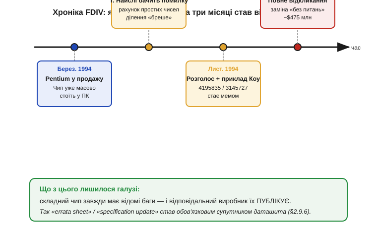
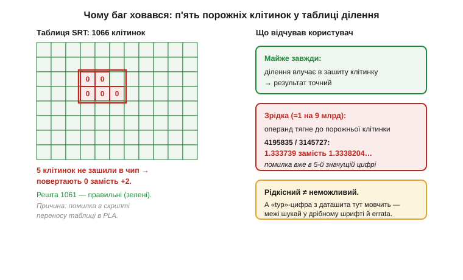

# 📜 Pentium FDIV: баг на пів мільярда доларів, що навчив індустрію публікувати errata

> Це історична вставка до теми [2.9.6 «Дрібний шрифт: примітки, умови тестів, errata»](reading-datasheets.md). У §2.9.6 ми кажемо холодну, майже неприємну річ: **кожен складний компонент має відомі баги, і виробник їх перелічує** — окремим документом-помилками (*errata*, *specification update*). Звідки взялася ця звичка? Чому компанія добровільно друкує список того, що в її чипі працює не так? Відповідь — одна історія з кінця 1994 року, коли наймогутніша на той час напівпровідникова фірма світу спершу спробувала промовчати про дефект у своєму процесорі — і це коштувало їй чвертьмільярда доларів, репутації та одного дуже публічного уроку.


*Рис. 2.9.6i.1. За три місяці «надзвичайно рідкісний» дефект пройшов шлях від наукової нотатки одного математика до першого в історії повного відкликання процесора й списання $475 млн. Підсумок, який лишився галузі, — у нижній смузі: складний чип завжди має відомі баги, і відповідальний виробник їх **публікує**.*

## Процесор, що не вмів ділити

У 1993 році **Intel** випустила **Pentium** — флагманський процесор, спадкоємець лінійки 80486. Одне з його гучних поліпшень стосувалося саме арифметики: блок із плаваючою комою (*floating-point unit*, FPU) ділив числа помітно швидше за попередника. Щоб виграти ці такти, інженери замінили старий «зсув-і-віднімання» (один біт результату за такт) на алгоритм родини **SRT** — назва складена з прізвищ трьох людей, що незалежно прийшли до нього наприкінці 1950-х: **Свіні** (*Sweeney*, IBM), **Робертсон** (*Robertson*, Університет Іллінойсу) і **Точер** (*Tocher*, Велика Британія). Це класичний приклад «колективної» назви в техніці: за трьома літерами стоять троє людей і дві країни, а не один «винахідник ділення».

SRT прискорює ділення хитрістю. На кожному кроці процесор має **вгадати** наступну цифру частки, а потім виправити похибку здогаду на наступних кроках. Здогад береться не обчисленням, а **готовою таблицею пошуку** (*lookup table*): за кількома старшими бітами поточного залишку й дільника таблиця одразу видає, яку цифру брати. У Pentium ця таблиця була зашита в програмовану логічну матрицю (*programmable logic array*, PLA) і містила **1066** значущих клітинок.

Хитрість працює рівно доти, доки таблиця правильна. У Pentium вона була правильною майже скрізь — окрім **п'яти** клітинок. Через помилку в скрипті, що переносив згенеровану таблицю в опис матриці, ці п'ять клітинок не «зашилися» у чип. Коли алгоритм звертався до однієї з них, він отримував не очікуване там значення (за описом Intel — +2), а **нуль**. Здогад цифри ламався, а механізм самовиправлення SRT уже не міг витягнути результат назад. Частка виходила трохи, але **неправильною**.


*Рис. 2.9.6i.2. Ліворуч — сітка таблиці SRT: 1061 клітинка зашита правильно (зелені), п'ять — порожні (червоні) і повертають 0 замість потрібного значення. Праворуч — що це означало для користувача: майже завжди ділення влучало в правильну клітинку, та зрідка операнди тягнули обчислення до «дірки», і помилка з'являлася вже в п'ятій значущій цифрі. **Рідкісний — не означає неможливий.** (Розташування клітинок на схемі умовне — воно ілюструє ідею «кількох порожніх комірок серед тисячі», а не точну топологію матриці.)*

Найпідступніше тут — слово «трохи». Це не була катастрофа, що падає на першому ж діленні: переважна більшість пар чисел у дірку не потрапляла, і чип рахував бездоганно. За пізнішою оцінкою журналу *Byte*, на випадкових операндах хибний результат траплявся приблизно **раз на 9 мільярдів** ділень. Саме ця рідкість і зробила баг таким небезпечним для репутації: його легко було не помітити місяцями — і так само легко зустріти в найгірший момент.

## Математик, який рахував прості числа

Дефект знайшов не Intel і не велика лабораторія, а одна людина за власним комп'ютером. **Томас Найслі** (*Thomas R. Nicely*), професор математики з Лінчбурзького коледжу (*Lynchburg College*, Вірджинія), у вільний час рахував суми, пов'язані з **простими-близнюками** — парами простих чисел, що різняться на 2. Така задача вимагає мільярдів точних ділень, і Найслі звіряв проміжні результати між різними машинами.

Влітку й восени 1994 року він помітив розбіжність, яку спершу списав на власний код, потім на бібліотеки, потім на компілятор. Лише вичерпавши «свої» причини, він припустив немислиме: помиляється **сам процесор**. Найслі звузив проблему до конкретних ділень, що давали хибу, і наприкінці жовтня 1994 року надіслав листа в Intel. Не отримавши задовільної реакції, **30 жовтня 1994 року** він описав ваду в електронному листі до колег-науковців — і той почав розходитися мережею (тоді ще ранньою, до масового вебу), від адресата до адресата, обростаючи незалежними перевірками на чужих машинах.

Тут історія робить повчальний поворот, важливий саме для нашого курсу: **баг став публічним не через виробника, а попри нього**. Поки Intel мовчала, спільнота сама задокументувала дефект, відтворила його й дала йому ім'я — **FDIV**, за асемблерною інструкцією ділення з плаваючою комою (*floating-point divide*).

## Одне ділення, що стало мемом

Абстрактний «дефект FPU» важко відчути. Його зробив наочним **Тім Коу** (*Tim Coe*), інженер-розробник арифметики з компанії Vitesse Semiconductor: у листопаді 1994 року він підібрав пару чисел, на якій помилка **максимальна** й видна навіть на калькуляторі.

```
       4195835 / 3145727
Pentium (хибно)  :  1.333739
правильно        :  1.3338204...
```

Різниця вилазить уже в **п'ятій значущій цифрі** — це не округлення в двадцятому знаці, а помилка, помітна неозброєним оком. Цей приклад поширювався швидше за будь-яке прес-релізне формулювання: кожен власник Pentium міг сам набрати ці числа й побачити «брехню» свого процесора. Доступність прикладу зробила те, чого не зробив би жоден технічний звіт, — перетворила вузьку інженерну ваду на **новину для всіх**. Дійшло до того, що нічне шоу Девіда Леттермана включило ділення «4195835 на 3145727 олівцем на папері» у список жартівливих «справ, цікавіших за роботу на Pentium». Коли твій баг жартують у телеефірі — мовчати вже неможливо.

## Найгірша деталь: Intel уже знала

Поки історія розгорталася публічно, на тлі лишався факт, через який вона з «прикрого виробничого дефекту» перетворюється на хрестоматійний урок етики розкриття. **Intel дізналася про ваду раніше за Найслі — самостійно, ще влітку 1994 року**, приблизно у травні–червні, під час тестування блока з плаваючою комою для майбутнього ядра наступного покоління. Компанія вже **почала виправляти** таблицю в нових партіях — але **не оголосила** про дефект публічно й не відкликала чипи, що вже були на полицях і в комп'ютерах користувачів.

Хто саме виявив помилку всередині Intel — деталь, у якій джерела розходяться, тож подаю її обережно: за словами самого Найслі, його контактна особа в Intel пізніше визнала, що ваду знайшов студент-практикант **Том Кральєвич** (*Tom Kraljevic*) під час тестів FPU нового ядра; книга *Inside Intel* приписує знахідку «батькові Pentium» **Віну Даму** (*Vin Dham*), а *The Pentium Chronicles* — архітекторові арифметики **Патрісу Русселю** (*Patrice Roussel*) (точну особу й дату — **перевірити**). Розбіжність у деталях не міняє головного й документально стійкого факту: на момент, коли проблему «відкрив» сторонній математик, вона **вже була відома виробникові** — і той обрав мовчання.

Саме цей вибір, а не п'ять клітинок у таблиці, і коштував Intel найдорожче. Технічну ваду пробачають — її має кожен складний чип. Не пробачають враження, що **виробник знав і змовчав**.

## Як «надзвичайно рідкісний» перетворився на $475 мільйонів

Перша офіційна реакція Intel і стала головним уроком — уроком про те, **як не треба**. Компанія наполягала, що дефект **надзвичайно рідкісний** і для типового користувача несуттєвий. За оцінкою Intel, пересічна людина зустріла б помилку раз на **27 000 років** звичайних обчислень. Тому спочатку Intel пропонувала заміну процесора **лише тим**, хто зможе довести, що його задачі справді чутливі до такого ділення.

Логіка «ми порахували ризик за вас, тож вам нема про що хвилюватися» звучала розумно для інженера — і виявилася катастрофою для довіри. Користувачі чули інше: «ваш процесор іноді помиляється в арифметиці, а замінювати ми його не зобов'язані». Один із публічних коментарів тодішнього президента й CEO **Ендрю Ґроува** (*Andrew S. Grove*) — мовляв, аналіз реальних застосувань і досвід мільйонів користувачів не виявили підвищеної ймовірності зіткнутися з вадою — сприйняли не як заспокоєння, а як спробу применшити проблему.

Розв'язку прискорив не окремий користувач, а **корпоративний** клієнт. У грудні 1994 року **IBM**, що сама продавала ПК на Pentium, оголосила, що **припиняє відвантаження** таких машин, пославшись на власні розрахунки, за якими помилка можлива куди частіше за оцінку Intel. Удар був подвійний: похитнулася і впевненість покупців, і ціна акцій Intel. Корпоративні замовники почали вимагати заміни масово, а виробники ПК — пропонувати її «без зайвих питань».

**20 грудня 1994 року** Intel здалася й оголосила те, з чого варто було починати: програму **повної заміни без жодних доказів** (*no questions asked*) — будь-який власник дефектного Pentium міг безкоштовно отримати справний. Це стало **першим в історії повним відкликанням процесора**. У річному звіті за 1994 рік Intel зафіксувала на це **доподатковий (pretax) витратний резерв у $475 млн** — на заміну й списання дефектних мікросхем. Звідси й «баг на пів мільярда доларів».

> 🔧 **Навіщо це.** Технічна частина FDIV — про п'ять клітинок у таблиці. Але дорожчою виявилася **нетехнічна** помилка: спроба самотужки вирішити за користувача, що той «не помітить» дефекту. Коли читаєте даташит, тримайте в голові обидва боки: цифру в таблиці параметрів дає виробник — і список того, що в чипі **не так**, теж має давати він. Якщо такого списку (*errata*) немає або його ховають — це сигнал, а не дрібниця.

## Що з цього винесла галузь: errata як норма

Найважливіше для теми §2.9.6 — не сума збитків, а **зміна звички**. До FDIV «список відомих помилок чипа» сприймався як щось соромливе: визнати баг публічно означало зізнатися в недосконалості. Pentium показав протилежне: **намагання приховати дефект коштує незмірно дорожче за чесний його перелік**. Тиха вада, знайдена стороннім математиком, обходиться в чвертьмільярда й національний скандал; та сама вада, **завчасно описана** виробником у документі помилок, — це звичайний робочий момент, з яким інженер просто рахується.

Саме після цієї історії практика **публікувати errata** остаточно стала **галузевою нормою**, а не винятком (масштабнішою її зробив і пізніший досвід, але FDIV — канонічний переломний епізод). Сьогодні до даташита кожного складного чипа — процесора, мікроконтролера, інтерфейсної мікросхеми — додається окремий живий документ: його називають **errata sheet**, **specification update** або **silicon errata**. У ньому виробник чесно перелічує: які блоки поводяться не за основним описом, за яких умов це проявляється, у якій ревізії кремнію (*silicon revision*) баг присутній і чи є обхід (*workaround*). Це прямий спадок грудня 1994-го.

Для розробника звідси випливають три робочі звички, які ми й закладаємо в §2.9.6:

- **Шукати errata окремо.** Список помилок майже ніколи не «вшитий» у тіло даташита — це окремий файл на сайті виробника. Не знайшли посилання — це привід запитати, а не привід вважати, що багів немає.
- **Звіряти ревізію.** Errata прив'язана до конкретної ревізії кремнію; баг, виправлений у новій партії, лишається в старій. Тому ревізія чипа в руках має збігатися з тією, для якої ви читаєте документ помилок.
- **Не плутати «рідкісний» із «неможливим».** FDIV — вічне нагадування: «один на 9 мільярдів» — це не нуль. Якщо ваша система робить мільярди операцій або працює роками, рідкісна подія стає очікуваною. Інженерна обережність — це не песимізм, а арифметика.

І останнє, що варто забрати з цієї історії. Дефект FDIV був дрібним — п'ять клітинок із 1066, помилка в п'ятій цифрі, одне ділення на мільярди. Дорогим його зробив не розмір вади, а **спроба про неї промовчати**. Тому наступного разу, гортаючи даташит до останньої виноски й окремо відкриваючи документ помилок, згадайте Pentium: список того, що в чипі працює не так, — це не ознака поганого виробника, а ознака чесного. Поганий — той, у кого такого списку нема.

> Повертайтеся до теми: [2.9.6 «Дрібний шрифт: примітки, умови тестів, errata»](reading-datasheets.md).
