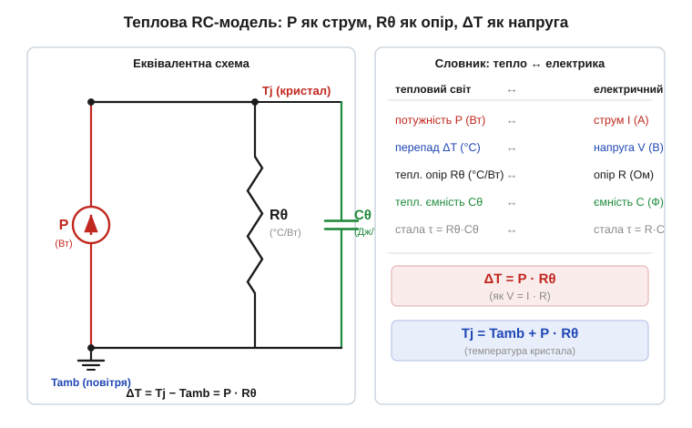
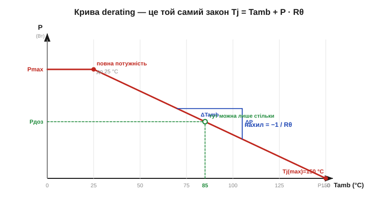

# 🧮 Теплова модель: Rθ як «опір», ΔT як «напруга» — тепловий закон Ома

> Це математична вставка до теми [2.9.4 «Графіки: derating, ВАХ, температурні залежності»](reading-datasheets.md). Тема показала, що даташит малює, як параметр пливе з температурою, і дає **криву derating** — скільки потужності прилад витримує за різної температури довкілля. Тут — крихітна модель, з якої ця крива випливає: тепло поводиться рівно як струм, а сам derating виявляється звичайним **законом Ома**, лише переписаним для тепла.

### Означення: тепловий опір

**Тепловий опір** (*thermal resistance*, Rθ або θ, одиниця **°C/Вт**) — це число, що каже, **на скільки градусів** нагріється тіло на кожен ват потужності, яку воно мусить скинути назовні. Прилад із θ = 50 °C/Вт, розсіюючи 1 Вт, стане на 50 °C гарячим за довкілля; розсіюючи 2 Вт — на 100 °C. У даташитах це здебільшого **θJA** (*junction-to-ambient*, кристал→повітря) — від кристала аж до навколишнього повітря, та **θJC** (*junction-to-case*, кристал→корпус) — лише до поверхні корпуса.

### Інтуїція: чому це «опір»

Чому саме «опір»? Бо тепло тече так само, як струм тече крізь резистор. Уявіть гарячий кристал усередині й холодне повітря зовні. Між ними є **перепад температури** ΔT, і саме він «проштовхує» тепловий потік назовні — точнісінько як напруга проштовхує струм крізь опір. Що більший опір на шляху тепла, то більший перепад потрібен, щоб продавити крізь нього ту саму потужність, — то гарячіший кристал. Звідси й пряма аналогія: **потужність — це струм, перепад температури — це напруга, а Rθ — це опір** (Рис. 2.9.4m.1).


*Рис. 2.9.4m.1. Зліва — еквівалентна схема: джерело струму P (виділене тепло) живить вузол кристала Tj, а звідти тепло стікає в «землю» — повітря Tamb — крізь тепловий опір Rθ. Справа — словник: P↔струм, ΔT↔напруга, Rθ↔опір (а теплова ємність Cθ↔ємність). Перепад на опорі ΔT = P·Rθ — це буквально закон Ома для тепла.*

### Апарат: закон Ома для тепла

Уся арифметика тримається на одному рядку — переписаному V = I·R:

```
ΔT = P · Rθ            (перепад температур = потужність × тепловий опір)
```

А оскільки ΔT — це різниця між кристалом і довкіллям (ΔT = Tj − Tamb), температура самого кристала виходить простим додаванням:

```
Tj = Tamb + P · Rθ     (температура кристала)
```

Це і є вся теплова модель у статиці. Три величини, один множник. Якщо опорів на шляху тепла кілька (кристал→корпус, корпус→радіатор, радіатор→повітря), вони стоять **послідовно** й додаються — теж як у законі Ома: Rθ(заг) = θJC + θCS + θSA. Тепло проходить крізь усі по черзі, на кожному падає свій шматок ΔT, а сума падінь дорівнює повному перепаду кристал→повітря.

Розв'язавши той самий рядок навпаки, дістаємо найкорисніше для розробника — **скільки потужності можна випустити**, поки кристал не сягнув своєї стелі Tj(max):

```
P(дозволена) = (Tj(max) − Tamb) / Rθ
```

Подивіться, що тут діється з температурою довкілля. Чим гарячіше повітря Tamb, тим менший чисельник (Tj(max) − Tamb) — тим менше потужності лишається випустити. Це лінійна спадна залежність P від Tamb із нахилом **−1/Rθ**. А **крива derating** з теми [2.9.4](reading-datasheets.md) — це рівно її графік (Рис. 2.9.4m.2): поличка повної потужності до якоїсь температури, далі пряме сповзання донизу, що впирається в нуль точно при Tj(max).


*Рис. 2.9.4m.2. Та сама крива derating, що в даташиті. До 25 °C прилад тягне повну потужність (поличка), далі P спадає прямою з нахилом −1/Rθ і сягає нуля при Tj(max) = 150 °C. Похила лінія — це не окремий «графік», а геометричний образ формули P = (Tj(max) − Tamb)/Rθ: круткість нахилу задає саме тепловий опір. Зеленим — як зчитати дозволену потужність для свого Tamb = 85 °C.*

Так замикається коло з темою про графіки: derating — не таємнича крива, яку треба запам'ятати, а **намальований закон Ома для тепла**. Знаючи Rθ і Tj(max) (обидва — з даташита), ви накреслите цю пряму самі; а готова крива в даташиті просто звільняє від арифметики, відразу даючи дозволену потужність для будь-якої температури.

### Де ще в курсі це працює

Та сама модель ΔT = P·Rθ — наскрізна для всієї силової частини. Вона стоїть за **тепловим розрахунком MOSFET-ключа** (Tj = Tamb + P·θ, [тепловий розрахунок](../mosfet/proj-thermal-calc.md)) і за межею доцільності **лінійного стабілізатора**, де все зайве тепло (Vin−Vout)·I мусить пролізти крізь θJA корпуса ([§2.8.11 LDO](../opamp-comparator/math-ldo-dissipation.md)). Вона ж пояснює, навіщо під гарячим компонентом ллють **більший мідний поліґон**: ширша мідь — це менший Rθ, тобто менший перепад на тому самому ваті, тобто холодніший кристал задарма.

Та повернімося до самих графіків — там на нас чигають дві пастки, специфічні саме для **читання derating** (тема 2.9.4). Перша: derating у даташиті майже завжди намальовано для **θJA на ідеальній випробувальній платі** — велика мідна площадка, спокійне повітря. Ваш тісний п'ятачок без обдуву має θ більший, тож реальна крива сповзе крутіше — закладайте запас. Друга: для **імпульсних** навантажень (короткі сплески потужності) статичний Rθ завищує нагрів — кристал не встигає прогрітися. Тут даташит дає окремий графік **перехідного теплового опору** Zθ(t) (*transient thermal impedance*): по суті це той самий ланцюг, але з доданою тепловою ємністю Cθ (теплоємність маси, Дж/°C), що згладжує короткі піки зі сталою часу τ = Rθ·Cθ. Принцип той самий — лише замість одного опору тепер RC-коло.

> 🔧 **Навіщо це.** Уся теплова арифметика приладу зводиться до одного рядка — **Tj = Tamb + P·Rθ** (закон Ома, де P↔струм, ΔT↔напруга, Rθ↔опір). З нього прямо випливає крива derating з даташита: P(дозволена) = (Tj(max) − Tamb)/Rθ — спадна пряма з нахилом −1/Rθ. Тож, побачивши криву derating, не зубріть її: упізнайте в ній закон Ома для тепла, прикиньте дозволену потужність для **свого** Tamb — і пам'ятайте, що даташитний Rθ оптимістичний, а для коротких сплесків діє лагідніший Zθ(t).
