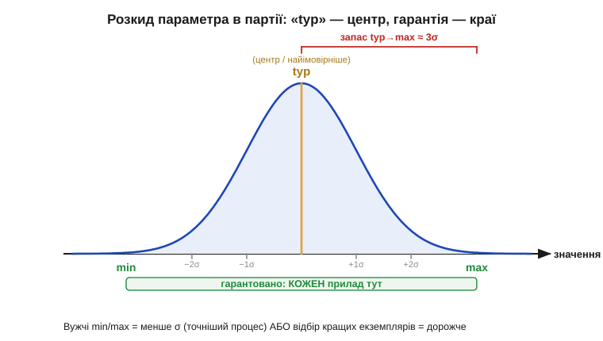
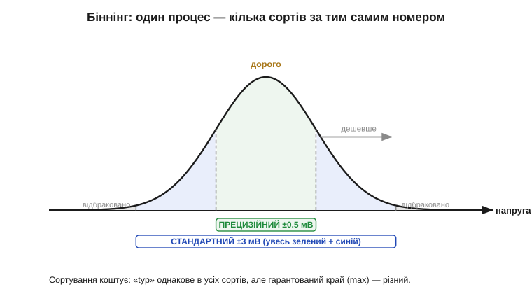

# 🧮 Min/typ/max як статистика: розкид партії і чому «typ» ніхто не гарантує

> Це математична вставка до теми [2.9.3 «Min/typ/max і умови вимірювання»](reading-datasheets.md). Тема пояснила правило: рахуй на гарантований край, а «typ» лиши для прикидки. Тут — *чому* так влаштовано: звідки беруться три числа, що насправді означає «typ», як ширина min…max пов'язана з якістю процесу і чому за вужчі межі доводиться доплачувати.

### Партія — це розподіл, а не одне число

Виробник випускає не один прилад, а **партію** (*production lot*) — мільйони екземплярів того самого номера. Виміряймо в кожному якийсь параметр (скажімо, напругу зсуву *Vos* операційного підсилювача) і побудуймо гістограму: скільки приладів потрапило в кожен вузький інтервал значень. Майже завжди вийде **дзвоноподібна крива** — нормальний розподіл (*normal / Gaussian distribution*). Його задають два числа:

```
μ (мю)    — середнє: де центр дзвона
σ (сигма) — стандартне відхилення: наскільки широкий дзвін
```

σ — це міра розкиду (*spread*): мала σ — вузький гострий пік (екземпляри схожі), велика σ — розпливчастий горб (екземпляри різні). Розкид не випадковість і не недбалість, а фізика: кожен чип — це мільйони мікроструктур на кремнії, і найдрібніші коливання процесу (товщини шарів, концентрації домішок) роблять кожен екземпляр трохи інакшим.


*Рис. 2.9.3m.1. Параметри партії розкидані дзвоном довкола середнього μ. «typ» — це і є μ, вершина дзвона (найімовірніше значення). Гарантовані min/max виробник ставить на хвостах — звичайно десь за ±3σ від центру, — щоб під межами опинився **кожен** випущений прилад. Запас від «typ» до краю — це і є ті кілька сигм.*

### Що таке «typ», min і max мовою статистики

Тепер три колонки даташита читаються однозначно:

```
typ  = μ            центр розподілу (найімовірніше значення)
min  ≈ μ − k·σ      нижній гарантований край
max  ≈ μ + k·σ      верхній гарантований край
```

Множник **k** — це «скільки сигм» відкладено від центру до межі. Чому «typ» нічого не гарантує, видно одразу: μ — це лише вершина дзвона, **половина** приладів лежить вище за неї, половина нижче. Закластися на «typ» означає спроектувати схему, що працює рівно на тих, кому пощастило опинитися з потрібного боку, — приблизно на 50 %. Натомість краї виробник ставить так далеко (велике k), щоб «погані» хвости відсікалися майже повністю.

Скільки саме «майже»? Для нормального розподілу частка приладів, що випадають за край, різко падає з ростом k:

```
за межею ±1σ   лишається ~32%   (геть ненадійно)
за межею ±2σ   лишається ~4.6%
за межею ±3σ   лишається ~0.27%  (≈ 2700 на мільйон)
за межею ±4σ   лишається ~0.006% (≈ 63 на мільйон)
```

Тому типовий гарантований край — десь біля 3σ і далі: за ним лежать одиниці чи тисячні частки відсотка партії, та й тих відсіює заводський тест. Це і є кількісна відповідь на питання теми «чому край, а не центр»: під центром — половина браку для вашої схеми, під краєм у 3σ — майже нічого. Дефекти, що лишилися, часто рахують у **ppm** (*parts per million*, частин на мільйон): 2700 ppm для 3σ, 63 ppm для 4σ.

### Звідки беруться «сорти» і чому вони коштують різного

Звідси ж видно, як народжуються «прецизійні» версії того самого чипа, про які згадала тема. Процес дає одну криву з певними μ і σ. А далі прилади **сортують** (*binning*) — міряють на тесті й розкладають за «кошиками» якості.


*Рис. 2.9.3m.2. Той самий процес, той самий μ. Екземпляри з центру (малий зсув) ідуть у дорогий прецизійний сорт із вузькими min/max; ширший шмат довкола — у дешевший стандартний; далекі хвости бракуються. «typ» в усіх сортів однакове — різний лише **гарантований край**.*

Звузити min…max можна двома способами — і обидва коштують грошей. **Перший** — поліпшити процес, зменшити саму σ (тонший контроль на фабриці): дзвін стає гострішим, краї сходяться. **Другий** — лишити σ як є, але відібрати в окремий сорт лише центральні екземпляри (малий k навколо μ): решта йде в дешевший сорт або в брак. У підсумку вужча гарантія — завжди дорожча: ви платите або за досконаліший процес, або за те, що частину партії відбракували заради вас. Ось чому «той самий» підсилювач із зсувом 0.5 мВ коштує помітно більше за версію з 3 мВ: фізично це можуть бути сусіди з однієї пластини, розкладені тестом по різних цінниках.

### Де це працює в курсі

Ця статистика стоїть за всіма «трьома колонками» розділу. Правило теми [§2.9.3](reading-datasheets.md) «рахуй на гарантований край» — це просто вимога покрити **весь** дзвін, а не його половину. Порада брати найгірший бік лише для **критичних** параметрів — теж звідси: подія, коли *всі* параметри водночас опиняться на своїх 3σ-хвостах, неймовірно рідкісна (хвости незалежні, а ймовірності перемножуються), тож закладати кожен параметр на край — це проектувати під неіснуючий прилад. А поділ на «100 % tested» і «guaranteed by design» — це різниця між «зміряли в кожного» і «ручаємося з моделі розподілу». Той самий дзвін розкиду повернеться скрізь, де є масове виробництво: від номіналів резисторів (5 % проти 1 %) до розкиду порогів і струмів у будь-якому даташиті.
