# Розділ 2.9 — Як читати даташит

[Розділ 2.8](../opamp-comparator/opamp-comparator.md) завершив наш аналоговий інструментарій: від конденсатора й діода через транзистори до операційного підсилювача. Тепер у руках є **цеглинки** — але щоб скласти з них реальну схему, на кожну цеглинку треба вміти **прочитати інструкцію**. Бо реальний компонент — це не ідеальна модель із підручника, а конкретний прилад зі своїми межами, примхами й тонкощами, які виробник чесно (хоч і дрібним шрифтом) описав у єдиному документі — **даташиті**. Цей розділ — про вміння, що відрізняє інженера від того, хто паяє навмання: **читати паспорт компонента**. Почнімо з найзагальнішого — що це за документ і де в ньому що шукати.

## 2.9.1 Даташит — паспорт компонента: структура документа

Кожен серйозний електронний компонент приходить у світ із **паспортом** — офіційним документом від виробника, що зветься **даташит** *(datasheet, «аркуш даних»)*. Це не реклама й не довідка «для загального розвитку»: це повний і єдиний опис того, **як** прилад поводиться, **у яких межах** його можна використовувати й **чого з ним робити не можна**. Навчитися читати даташит — чи не найкорисніше практичне вміння в усій електроніці: воно перетворює роботу з компонентами з угадування на інженерію.

### Що таке даташит і чому його читають

Уявімо, що ви взяли незнайому мікросхему. Яке в неї живлення? Котра ніжка що робить? Скільки струму вона витримає, перш ніж згоріти? Як її підключити, щоб запрацювала? Угадувати тут — означає рано чи пізно щось спалити або тижнями шукати, чому «не працює». А вся відповідь уже є — у даташиті.

А ціна угадування буває висока. Не глянув на гранично допустиму напругу — спалив чип, щойно ввімкнув. Не звірив розпіновку — розвів плату дзеркально, і перепаюй усе наосліп. Узяв «typ» за гарантоване — і схема, що працювала на столі, відмовляє щоп'ятий екземпляр у партії. Усього цього уникають кілька хвилин, проведених у даташиті **до** того, як паяти.

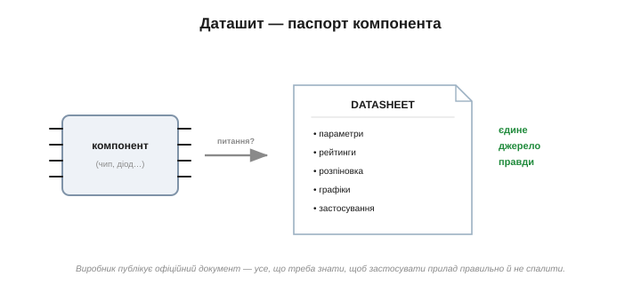
*Рис. 2.9.1.1. На будь-яке питання про прилад — «чи це те, що мені треба?», «як підключити?», «що його не вб'є?» — відповідь дає один документ. Даташит — це **єдине джерело правди** про компонент, написане тим, хто його зробив.*

Ключова думка: даташит — це **первинне джерело**. Не форум, не випадковий допис у блозі, не «здається, так було в схожого чипа», а офіційний документ виробника. Форуми помиляються; даташит — закон. Звісно, і він не безгрішний (бувають помилки, про це згодом), але це найнадійніше, що є, і завжди перша інстанція, до якої звертаються.

Зручна аналогія — паспорт автомобіля впереміш із технічним описом і гарантійним талоном. Там і «що це за машина», і точні характеристики, і «не заливай не той бензин, бо зіпсуєш», і дрібний шрифт гарантії. Даташит — те саме для електронного компонента: усе в одному документі, від реклами до юридичних пересторог.

І ще: даташит пишуть **не** для того, щоб ви прочитали його від першої сторінки до останньої. Це **довідник**, у який заходять із конкретним питанням і виходять із конкретною відповіддю. Тому головне вміння — не «прочитати все», а **знати, де що лежить**.

### Карта документа

Хоча кожен виробник оформлює даташити по-своєму, **структура** в них напрочуд однакова. Зверху донизу йдуть ті самі розділи, в одній і тій же логіці: спершу «що це таке», далі «у яких межах живе», потім «які точні числа», і наприкінці «як виглядає й як замовити».

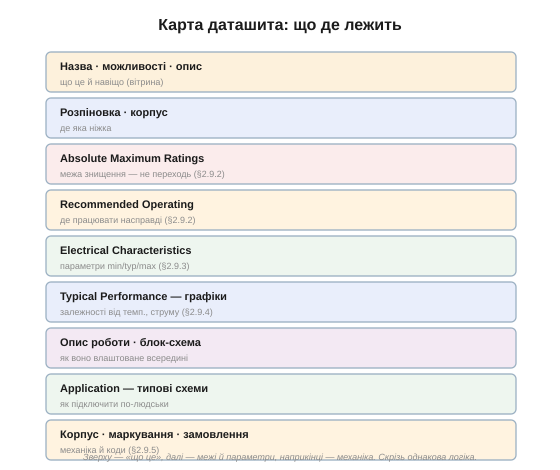
*Рис. 2.9.1.2. Типовий кістяк даташита. Угорі — вітрина (назва, можливості, опис) і розпіновка. Посередині — межі (Absolute Maximum, Recommended Operating) і параметри (Electrical Characteristics, графіки). Унизу — опис роботи, типові схеми застосування й механіка корпусу. Скрізь та сама логіка.*

Пройдімося по карті, щоб знати, що в кожному розділі шукати (а деталі кожного — у наступних темах розділу):

- **Назва, можливості (features), опис** — коротка «вітрина»: що це за прилад і навіщо. Тут вирішують одне: чи взагалі цей компонент підходить.
- **Розпіновка й корпус** — де яка ніжка та в якому корпусі прилад (про корпуси — [§2.9.5](reading-datasheets.md)).
- **Absolute Maximum Ratings** — межі, за якими прилад **руйнується**. Це не робочі значення, а червона риса «далі — смерть» (чому між нею й роботою прірва — [§2.9.2](reading-datasheets.md)).
- **Recommended Operating Conditions** — а ось де прилад справді мусить працювати.
- **Electrical Characteristics** — головна таблиця: усі параметри з колонками **min / typ / max** і умовами вимірювання (чому «typ» — не обіцянка, [§2.9.3](reading-datasheets.md)).
- **Typical Performance — графіки** — як параметри пливуть із температурою, струмом, напругою ([§2.9.4](reading-datasheets.md)).
- **Опис роботи, блок-схема** — як прилад улаштований усередині й що робить.
- **Application Information** — типові схеми підключення «по-людськи»: готові рецепти від виробника.
- **Корпус, маркування, замовлення** — механічні розміри, коди на корпусі, як замовити потрібну версію.

Запам'ятавши цю карту раз, ви орієнтуватиметеся в будь-якому даташиті — хоч на діод, хоч на складний мікроконтролер. І ось що втішно: ця структура **масштабується**. Даташит на простий діод — це дві-три сторінки, на операційний підсилювач — десяток, на мікроконтролер — кількасот; та кістяк у них **однаковий**. Тож, навчившись орієнтуватися в коротенькому, ви без страху відкриєте й товстий: розділи ті самі, лише детальніші. Страшна на вигляд товщина — це не складність, а просто більше подробиць у знайомих місцях.

### Перша сторінка — вітрина

Перша сторінка даташита — це **портрет** приладу в стислому вигляді: велика назва, короткий опис одним рядком, список ключових можливостей (features) і часто маленький ескіз розпіновки.


*Рис. 2.9.1.3. Перша сторінка: назва, опис одним реченням, перелік найкращих цифр і ескіз розпіновки. Її завдання — за десять секунд дати зрозуміти, що це за прилад, щоб ви могли вирішити: «моє чи не моє».*

Важливо розуміти **тон** цієї сторінки. Її пише маркетинг, і пише **оптимістично**: тут зберуть найкращі, найкругліші цифри приладу — «смуга 10 МГц!», «зсув менш ніж 1 мВ!». Це правда, але правда **за найкращих умов**. Тому першу сторінку читають, щоб швидко **відсіяти** явно невідповідні компоненти («ні, цей лише до 3 В, а мені треба 12») — а не щоб приймати остаточні інженерні рішення. Для рішень є таблиці далі.

Користь першої сторінки — у швидкості: переглянувши її, ви за хвилину зрозумієте, чи варто читати решту сорок сторінок, чи шукати інший прилад. Корисно також затримати погляд на короткому **описі**: одне-два речення часто кажуть, для чого прилад **задуманий** — «драйвер світлодіодів», «прецизійний для вимірювань», «загального призначення». Прилад, застосований не за призначенням, може й працюватиме, та зазвичай програє тому, що зроблений саме під вашу задачу.

### Не читати поспіль — стрибати до потрібного

Ось чому даташит **не читають** від кірки до кірки. Сорок, вісімдесят, а то й триста сторінок ніхто не осилює поспіль — та й не треба. У даташит заходять із **питанням** і йдуть одразу в той розділ, що на нього відповідає.

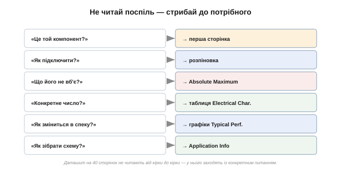
*Рис. 2.9.1.4. Кожне питання має свою адресу. «Це той компонент?» — перша сторінка. «Як підключити?» — розпіновка. «Що його не вб'є?» — Absolute Maximum. «Конкретне число?» — таблиця Electrical Characteristics. «Як зміниться в спеку?» — графіки. «Як зібрати схему?» — Application Info.*

Це перетворює страшний на вигляд товстий документ на зручний довідник. Тримаючи в голові карту (Рис. 2.9.1.2), ви відкриваєте даташит, зразу гортаєте до потрібного розділу — і за хвилину маєте відповідь. Практичний помічник тут — **зміст** на початку документа й пошук по слову (Ctrl+F у PDF): шукаєте «Rds(on)» чи «offset» — і даташит сам приводить вас до потрібного рядка. Інженери так і працюють: не гортають усе підряд, а **шукають** за ключовим словом параметра. З досвідом цей стрибок стає рефлексом: треба максимальний струм — рука сама гортає до Absolute Maximum; треба опір відкритого ключа — до Electrical Characteristics.

Простежмо такий стрибок наживо. Хай треба операційний підсилювач для давача, що живиться від 3.3 В. Відкриваємо даташит кандидата. **Перша сторінка:** живлення «1.8…5.5 В», rail-to-rail — годиться, читаємо далі. **Absolute Maximum:** гранична напруга живлення 6 В — наші 3.3 В далеко в безпеці, добре. **Electrical Characteristics:** знаходимо рядок «вхідний струм зсуву» — саме він критичний для кволого давача. **Графіки:** дивимось, як зсув повзе з температурою, бо прилад працюватиме надворі. **Application:** беремо звідти готову схему ввімкнення. П'ять прицільних поглядів у п'ять розділів — і рішення готове, без читання решти тридцяти сторінок.

### Три голоси даташита

Аби читати даташит правильно, варто чути, що він говорить **трьома різними голосами**, і кожному вірити по-своєму. Бо документ цей служить двом панам водночас: він і **продає** прилад, і **захищає** виробника юридично.

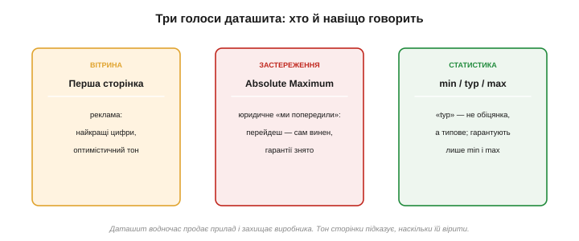
*Рис. 2.9.1.5. Перша сторінка — голос реклами: найкращі цифри, оптимізм. Absolute Maximum — голос юриста: «ми попередили; перейдеш межу — сам винен». Колонки min/typ/max — голос статистики: «typ» це типове, а гарантують лише краї.*

- **Вітрина** (перша сторінка) — голос **реклами**. Найкращі цифри за найкращих умов. Вірити, але пам'ятати про «за найкращих умов».
- **Absolute Maximum** — голос **юриста**. Це межа, поставлена, щоб захистити виробника: «ми вас попередили, що далі прилад руйнується; перейдете — гарантій нема». Її не порушують **ніколи**.
- **min / typ / max** — голос **статистики**. Колонка «typ» (typical) — це **типове** значення, а не обіцянка: конкретний ваш екземпляр може мати інше. Гарантують виробники лише краї — **min** і **max**. Тому серйозну схему рахують по гарантованих межах, а не по «typ».

Наочний приклад: даташит обіцяє «typ» вхідний струм 1 нА, але «max» — аж 10 нА. Зберете схему, розрахувавши на 1 нА, — і вона працюватиме на більшості чипів; та зрідка трапиться екземпляр на 10 нА, і саме він зіпсує вимір. Виробник чесно дав обидва числа — питання лише в тому, на яке ви заклалися. Грамотний інженер закладається на **гарантований** край (max або min, залежно від того, який бік небезпечний), бо лише його обіцяно для кожного приладу.

Уміння чути ці голоси й відрізняти оптимістичну вітрину від гарантованих чисел — половина мистецтва читання даташита. До кожного з них ми ще повернемося детальніше.

### Звідки брати й яку версію

Остання, але важлива дрібниця — **звідки** взяти сам даташит. Здавалося б, знайшов PDF — і читай. Та не всякий PDF однаковий.

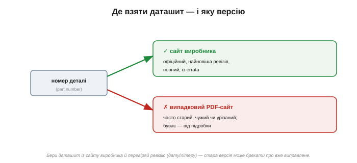
*Рис. 2.9.1.6. Бери даташит із сайту **виробника**, а не з першого-ліпшого PDF-агрегатора: офіційна копія повна, найновіша й супроводжується списком виправлень. Чужі скани бувають старі, урізані чи навіть від підробки.*

Правило просте: **бери даташит із сайту того, хто зробив компонент**. Випадкові PDF-сайти часто викладають **стару** ревізію, чужий (схожий, але інший) прилад або урізану копію — а то й даташит **підробки**, що видає себе за оригінал. Офіційна ж копія завжди повна й найновіша.

А версія таки важить. Даташити **оновлюють**: виробник уточнює цифри, виправляє помилки, додає застереження. Тому в кутку сторінки завжди стоїть **ревізія** — літера чи дата, а наприкінці документа — історія змін. Стара версія може спокійнісінько «брехати» про те, що в новій уже виправлено. Окремо стережіться позначки **«Preliminary»** чи «Advance Information»: так маркують даташити ще не випущених приладів — їхні цифри попередні й можуть змінитися.

І ще: даташит — не завжди **весь** документ. До багатьох приладів виробник окремо випускає **прикладні нотатки** *(application notes)* з детальними схемами, **референсні дизайни** та список помилок *(errata*, [§2.9.6](reading-datasheets.md)). Якщо в самому даташиті чогось бракує — шукайте ці супутні документи там же, на сайті виробника.

### Де що шукати — коротко

Підсумуймо найкорисніше однією карткою. Питання — і куди по відповідь:

```
чи це той компонент?       → перша сторінка (назва, features)
де яка ніжка?              → розпіновка / pinout
що прилад НЕ вб'є?         → Absolute Maximum Ratings
де він має працювати?      → Recommended Operating Conditions
конкретне число параметра? → Electrical Characteristics (min/typ/max)
як зміниться в спеку/струм?→ Typical Performance (графіки)
як підключити по-людськи?  → Application Information
який корпус, що за код?    → Package / Ordering / Marking
```

### 🔧 Навіщо це

> 🔧 **Навіщо це.** Даташит — перший і головний документ у роботі з будь-яким компонентом, і вміння його читати економить і гроші (не спалені чипи), і тижні («чому не працює»). Запам'ятайте три речі. **Перше:** даташит — єдине джерело правди, перша інстанція, важливіша за будь-який форум. **Друге:** його не читають поспіль — у нього заходять із питанням і стрибають у потрібний розділ за картою документа. **Третє:** чуйте тон — вітрина оптимістична, Absolute Maximum священна, «typ» не гарантоване. Хто це засвоїв, той уже наполовину інженер.

### Що далі

Ми побачили карту даташита згори. Тепер спустимося в найважливіші його розділи. Почнемо з пари таблиць, які найчастіше плутають із фатальними наслідками, — **Absolute Maximum** і **Recommended Operating**: чому між «межею знищення» і «робочим діапазоном» зяє навмисна прірва, і чому жити треба в меншому з них.

> ▶️ Далі: [§2.9.2 — Absolute Maximum vs Recommended Operating](reading-datasheets.md)

## 2.9.2 Absolute Maximum vs Recommended Operating: чому між ними прірва

У кожному даташиті є дві таблиці меж, схожі на вигляд і легко плутані — а наслідки плутанини фатальні. Одна зветься **Absolute Maximum Ratings**, друга — **Recommended Operating Conditions**. Перша каже, де прилад **гине**; друга — де він **працює**. Між ними навмисне лишено зазор, і розуміти, що це за зазор і чому жити треба в меншій із двох, — одне з найважливіших умінь читання даташита.

### Дві таблиці — два протилежні сенси

Почнімо з того, що ці таблиці кажуть **різні** речі, і їх ніяк не можна сплутати.

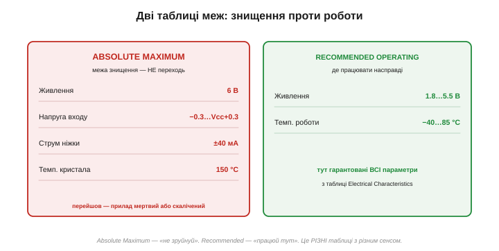
*Рис. 2.9.2.1. Absolute Maximum — «червона риса знищення»: за нею прилад руйнується або непомітно калічиться. Recommended Operating — «робочий діапазон»: лише тут виробник гарантує всі параметри з таблиці Electrical Characteristics. Це дві окремі таблиці з протилежним призначенням.*

**Absolute Maximum Ratings** — це не робочі значення, а **межі виживання**. Вони кажуть: «ось ця напруга, цей струм, ця температура — крайня риса; перейдеш її — прилад може зруйнуватися або непомітно деградувати». Працювати **на** цих межах не можна й не передбачено — це **стрес-рейтинг**, а не режим роботи. Часто прямо під таблицею стоїть холодна примітка: «перевищення абсолютних максимумів може спричинити незворотне пошкодження; це лише межа стресу, а не гарантія працездатності». Слово «стрес-рейтинг» тут не випадкове. Виробник **випробовує** прилад на цих межах як на стрес-тесті — перевіряє, що той їх **переживе**, — але **не** обіцяє, що на них він **працюватиме** як слід. Тож абсолютний максимум — це «витримає, не розсиплеться», а не «функціонуватиме за паспортом». І ще практичне: перейшов абсолютний максимум — і жодних претензій до виробника, гарантію знято, бо ти порушив умову, під якою її давали.

**Recommended Operating Conditions** — навпаки, це **робочий простір** приладу: діапазон живлення, температури, напруг, **усередині** якого він поводиться як належить. І головне: усі точні цифри з головної таблиці параметрів (Electrical Characteristics) виробник гарантує **тільки** в цих межах. Вийшов за Recommended — і навіть якщо прилад «працює», його параметри вже ніхто не обіцяє.

Тримайте різницю чітко: Absolute Maximum — «**не зруйнуй**», Recommended Operating — «**працюй тут**».

Звідси й дві геть різні біди, які теж не можна плутати. Вийти за **Recommended** (але лишитися під Absolute Maximum) — це не смерть, а **втрата гарантій**: прилад живий, та його параметри вже «попливли» — він може стати повільнішим, шумнішим чи менш точним, ніж обіцяно. А перейти **Absolute Maximum** — це вже **пошкодження**: прилад або гине одразу, або тихо калічиться (працює, але з прихованою вадою, що виявиться згодом). Перше — «не за паспортом», друге — «зламано». Тому й таблиці дві: одна відповідає на питання «чого боятися, щоб не спалити?», друга — «де прилад поводиться як у даташиті?». Сплутати їх — однаково що сплутати «швидкість, на якій машина не розвалиться» зі «швидкістю, на яку її розраховано».

### Прірва між ними

А тепер найцікавіше — **зазор** між цими таблицями. Він не випадковий: виробник лишає його навмисне. Скажімо, абсолютний максимум живлення — 6 В, а рекомендований діапазон — 1.8…5.5 В. Що ж між 5.5 і 6 вольтами?

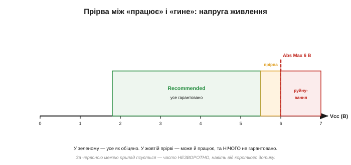
*Рис. 2.9.2.2. Шкала напруги живлення. У зеленій зоні (Recommended) гарантовано все. Жовта смужка між 5.5 і 6 В — «прірва»: прилад там, найпевніше, ще живе, але **жодних гарантій** уже нема. Червона риса 6 В — абсолютний максимум, за нею — руйнування, часто незворотне навіть від короткого дотику.*

Це «нічийна земля». У зеленій зоні прилад працює **й** усе гарантовано. У жовтій прірві він, скоріш за все, ще функціонує — але параметри вже не обіцяні, а надійність потерпає. За червоною рискою — псування. Тому правильне читання таке: **Recommended — це де жити, Absolute Maximum — це чого не торкатися ніколи, а простір між ними — не «бонусний запас для роботи», а буфер, у який залазити не варто**.

Класичний приклад ціни помилки — узяти 3.3-вольтовий чип і подати на нього 5 В. П'ять вольтів далеко за його абсолютним максимумом — і чип гине тієї ж миті, як з'явиться живлення, ще до першого рядка коду. Або тонша пастка: подати сигнал на вхід чипа, поки той **ще не запитаний**, — вхід опиняється «вище» за нульову рейку живлення, порушено абсолютний максимум входу, і прилад вигоряє, хоча начебто «нічого ж не вмикали».

### Навіщо ця прірва

Чому ж не зробити рекомендований діапазон до самої межі? Бо зазор — це **запас на реальність**, і причин для нього кілька.

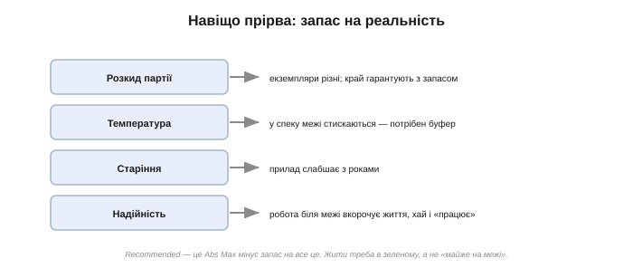
*Рис. 2.9.2.3. Зазор закладають на розкид партії (екземпляри різні), на температуру (у спеку межі стискаються), на старіння (прилад слабшає з роками) і на надійність (робота біля краю вкорочує життя, навіть коли «працює»). Recommended — це Absolute Maximum мінус усі ці запаси.*

По-перше, **розкид партії**: жоден екземпляр не точно такий, як у даташиті, тож межі гарантують із запасом на найгірший. По-друге, **температура**: багато меж стискаються в спеку чи на морозі, і рекомендований діапазон лишає буфер на це. По-третє, **старіння**: прилад поступово деградує, і запас продовжує йому життя. По-четверте, **надійність**: навіть якщо біля самої межі прилад «працює», постійна робота там вкорочує його вік — мов двигун, що весь час реве на червоній зоні тахометра. Recommended Operating — це і є Absolute Maximum, з якого виробник чесно відняв усі ці запаси й сказав: «отут — безпечно».

Особливо це стосується **температури**. Чимало абсолютних максимумів даються при кімнатних 25 °C, а в спеку безпечна межа **знижується** — наприклад, допустима потужність падає з нагрівом корпусу. Цю залежність виробник показує окремими графіками (derating, [§2.9.4](reading-datasheets.md)), і рекомендований діапазон уже враховує запас на неї. Тому межу не читають як одне число на всі умови: вона сама залежить від того, як гаряче приладу.

А тепер зважте, що той буфер не такий і великий: між рекомендованими 5.5 і граничними 6 В лишається пів-вольта. Ці пів-вольта легко «з'їдають» реальні дрібниці — пульсації блока живлення, викид при ввімкненні сусіднього вузла, наводка по дроту. Ось чому жити **на** 5.5 В небезпечно: будь-яке таке брижіння вже штовхне напругу за межу. Проєктувати треба з власним запасом **нижче**, лишивши буфер недоторканим — він на непередбачене, а не на щодень.

### Підступ перехідних процесів

Тепер про найпідступнішу пастку абсолютних максимумів. Їх не можна переходити **навіть на мить** — а порушення часто стається саме на коротку мить, у перехідному процесі, якого на перший погляд і не видно.

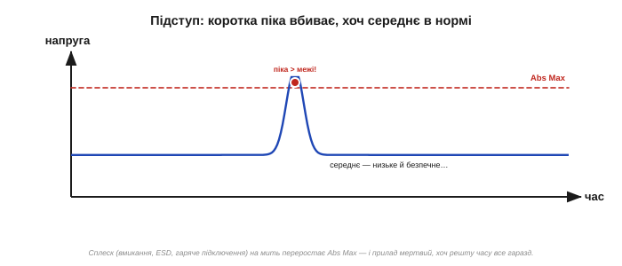
*Рис. 2.9.2.4. Сигнал переважно низький і безпечний, але один короткий сплеск переростає Absolute Maximum — і цього досить, щоб прилад загинув, хоча решту часу все гаразд. Абсолютний максимум стосується **миттєвих** значень, а не середніх.*

Звідки беруться такі піки? З **увімкнення** (кидок струму чи напруги в перші мілісекунди), із **гарячого підключення** (під'єднав роз'єм під напругою — стрибок), з **індуктивних викидів** (вимкнув котушку — сплеск, §2.5.9), з **електростатичного розряду** (торкнувся пальцем — тисячі вольтів на мить). Усе це може на коротку мить вискочити за абсолютний максимум — і вбити прилад, хоча вимірюване середнє лишається в нормі. Саме тому в схемах ставлять обмежувальні діоди, послідовні резистори, плавний пуск і захист від ESD: вони зрізають оці невидимі піки, не даючи їм дістати до руйнівної межі. Кожному типу піків — свій захист: від ESD і перенапруги на вході рятують обмежувальні діоди до рейок чи TVS-діод ([§2.5.8](../diode-pn-junction/diode-pn-junction.md)), від кидка ввімкнення — плавний пуск, від індуктивного викиду — гасний діод. Спільна ідея одна: зрізати пік, **перш ніж** він дістане абсолютного максимуму. (Про такі відмови — латч-ап, перенапругу на вході, гаряче підключення — окрема компонентна вставка до цієї теми.)

### Що зазвичай стоїть у Absolute Maximum

Які саме межі перелічує ця таблиця? Набір типовий і його варто знати в обличчя.

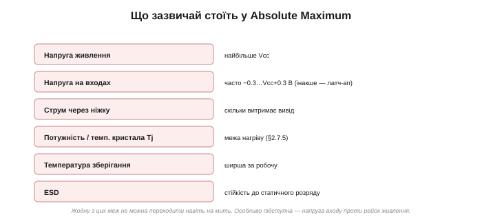
*Рис. 2.9.2.5. Звичні рядки: максимальне живлення; напруга на входах (часто −0.3…Vcc+0.3 В); струм через ніжку; розсіювана потужність і температура кристала; температура зберігання (ширша за робочу); стійкість до ESD.*

Окремо виділимо найпідступніший рядок — **напругу на входах**. Її майже завжди обмежують відносно **рейок живлення**: типово «не нижче −0.3 В і не вище Vcc+0.3 В». Причина в тому, що всередині кожного входу є захисні діоди до рейок; заженеш вхід надто далеко за рейку — і крізь них потече струм, аж до небезпечного явища **латч-апу**, коли мікросхема «замикається» сама на себе й вигоряє. Звідси важливе наслідкове правило: **сигнал на вході не повинен з'являтися раніше за живлення** (інакше вхід «вище» за ще нульову рейку) і не повинен перевищувати її. Це часта причина загадкових смертей: подали сигнал на незапитаний чип — і спалили його, нічого начебто не порушивши.

Ще один рядок вартий уваги — **температура кристала** (Tj). Це не та температура, що ви міряєте пальцем на корпусі, а внутрішня, на самому кремнієвому кристалі, — і саме вона має лишатися під межею (зазвичай 125 або 150 °C). Прилад може здаватися лише теплим зовні, а кристал усередині вже на межі: адже тепло від кристала до корпусу й повітря тече крізь тепловий опір ([§2.7.5](../mosfet/mosfet.md)). Тому для потужних приладів Tj рахують окремо, а не «на дотик».

А рядок **ESD** каже, який статичний розряд прилад витримає, перш ніж пробитися (його міряють за стандартними моделями — розряд від пальця, від машини). Саме тому чутливі чипи возять в антистатичних пакетах і паяють на заземленому килимку: один необачний дотик сухого пальця — і кілька тисяч вольтів на коротку мить, а це теж порушений абсолютний максимум.

### Правило: цілься в серцевину

Зведімо все до одного інженерного правила.

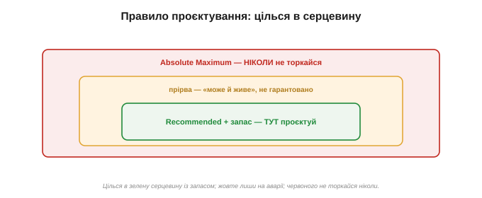
*Рис. 2.9.2.6. Три зони. Зелена серцевина (Recommended із запасом) — ТУТ проєктують. Жовта прірва — лишають хіба на короткі аварійні викиди. Червоного (Absolute Maximum) не торкаються НІКОЛИ.*

Цілься в **зелену серцевину** — рекомендований діапазон, ще й із власним запасом. Жовту прірву лиши на непередбачене (короткий аварійний викид, який схема має пережити). А червоної межі не торкайся **ніколи**, навіть на мить — і подбай, щоб її не торкнулися перехідні піки. Хто проєктує посередині зеленої зони, той робить надійні прилади; хто тулиться до краю заради «ну воно ж працює» — той ремонтує їх потім у полі. Загальне правило надійності просте: тримай робочі величини на рівні десь **70–80 %** від гранично допустимих, а не впритул до них. Цей свідомий недовантаж *(derating)* — те, що відрізняє прилад, який працює роками, від того, що відмовляє за місяць.

На практиці це зводиться до двох перевірок для кожного виводу. Спершу — Absolute Maximum: переконайся, що його не зачепиш **ні** в роботі, **ні** в перехідних піках (а як треба — додай захист). Потім — Recommended Operating: тримай робочу точку **всередині** нього, ще й із запасом. Дві таблиці — два питання: «не вб'ю?» і «гарантовано?». Звичка ставити їх обидва, перш ніж паяти, рятує і прилади, і нерви.

> 🔧 **Навіщо це.** Дві таблиці меж — це перше, куди заглядають, узявши компонент. **Absolute Maximum** — священна межа знищення: не переходь її ніколи, надто пильнуй короткі піки (вмикання, ESD, гаряче підключення), бо вона про **миттєві** значення. **Recommended Operating** — твій робочий простір, і лише там гарантовано всі параметри; проєктуй усередині нього, ще й із запасом. А прірву між ними не сприймай як «дозволений бонус»: це буфер на розкид, спеку й старіння, у який залазити не варто. Найчастіша причина «незрозуміло чому згорів» — порушений абсолютний максимум, якого ніхто не помітив.

### Що далі

Ми навчилися читати **межі**. Та всередині рекомендованого діапазону параметри теж не одне тверде число, а трійця **min / typ / max** з умовами вимірювання. Чому «typ» нікому не обіцяють, що насправді гарантують і як читати ці колонки — далі.

> ▶️ Далі: [§2.9.3 — Min/typ/max і умови вимірювання](reading-datasheets.md)

## 2.9.3 Min/typ/max і умови вимірювання: чому «typ» — не обіцянка

Серце даташита — таблиця **Electrical Characteristics** (електричні характеристики). Саме тут живуть **числа**: підсилення, зсув, струми, опори — усе, на чому ви рахуватимете схему. І влаштована ця таблиця так, що недосвідчений читач бере звідти геть не ті значення й потім дивується, чому розрахунок не збігається з реальністю. Розберімо, як читати її правильно — бо одне число тут ніколи не буває просто «числом».

### Три колонки замість одного числа

Перше, що впадає в око: кожен параметр поданий не одним значенням, а **трьома** — у колонках **Min**, **Typ** (typical) і **Max**. Плюс — критично важливий стовпець **Conditions** (умови).

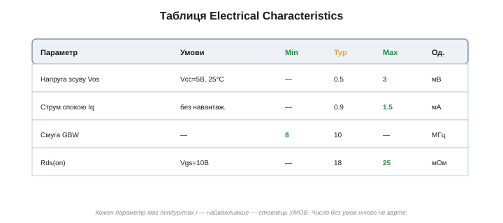
*Рис. 2.9.3.1. Кожен рядок — параметр зі своїми min / typ / max і умовами вимірювання. Зелені краї (min, max) — те, що виробник **гарантує**; жовтий «typ» — лише очікуване. А стовпець умов каже, за яких обставин ці числа взагалі дійсні.*

Чому три числа, а не одне? Бо жоден параметр не однаковий для всіх екземплярів і всіх умов. Виробник міг би дати одне «середнє» — але це обманювало б: ваш конкретний прилад майже напевно не точно такий. Тому замість обіцянки, яку не дотримати, дають **діапазон**: гарантовані краї плюс типове значення всередині. Навчитися знімати з цих трьох колонок **правильне** число — і є вся суть теми.

Зверніть увагу й на стовпець одиниць та на префікси: легко переплутати мВ із мкВ, нА з мкА — і помилитися на порядки. На цьому спотикаються чи не частіше, ніж на самих числах, тож завжди звіряйте, у чому виміряно параметр.

### «typ» — не обіцянка, а очікування

Найпоширеніша й найдорожча помилка новачка — узяти значення з колонки **Typ** і рахувати на нього. Бо «typ» — це **не** те, що вам гарантовано. Це **типове** значення: центр того розкиду, з яким сходять із конвеєра мільйони приладів.

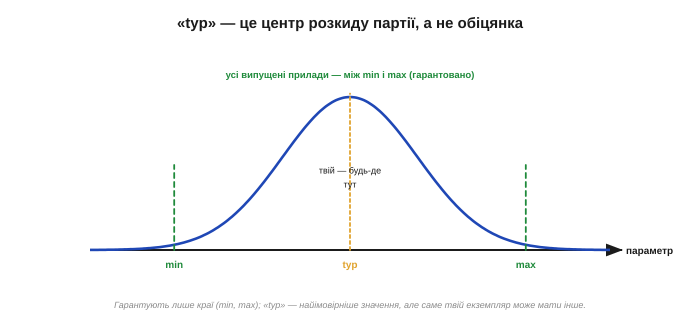
*Рис. 2.9.3.2. Параметри приладів партії розкидані дзвоном довкола середнього. «typ» — вершина цього дзвона, найімовірніше значення. Та гарантують виробники лише **краї** — min і max: усі випущені прилади лежать між ними. Ваш конкретний екземпляр може бути будь-де в цьому проміжку, не обов'язково на «typ».*

Уявіть параметр як зріст людей у великому натовпі: типовий — десь посередині, але трапляються і нижчі, і вищі, аж до крайніх меж. Так само з приладами: «typ» — це «найчастіше буває отак», але саме ваш екземпляр може виявитися ближчим до краю. Виробник чесно про це попереджає, даючи **min** і **max** — і **тільки їх** він зобов'язується витримати для **кожного** проданого приладу. «typ» же ні до чого не зобов'язує: це орієнтир, очікування, а не гарантія. Інколи параметр узагалі дають **лише** як «typ», без гарантованих меж, — таке число суто інформаційне, і покладатися на нього в розрахунку не можна зовсім.

Звідки взагалі береться той розкид? Кожен прилад — це мільйони мікроскопічних структур, надрукованих на кремнії; найдрібніші коливання процесу (товщини шарів, кількості домішок) роблять екземпляри трохи різними. Додайте вплив температури й старіння — і стане ясно, чому виробник не може пообіцяти одне точне число, лише діапазон. Це не недбалість, а чесне визнання фізики: ідеально однакових приладів не буває.

Навіщо ж тоді взагалі дають «typ»? Він корисний для **прикидки**: уявити, як прилад поводитиметься «зазвичай», оцінити споживання чи підсилення в типовому випадку, порівняти прилади між собою. Просто не для гарантійного розрахунку. До речі, вужчі гарантовані межі зазвичай **коштують дорожче**: виробник відбирає (сортує) кращі екземпляри в окремий, точніший сорт — звідси й «прецизійні» версії того самого чипа з мікровольтовим зсувом за більші гроші. Як саме розкид партії перетворюється на сорти — окрема математична вставка до цієї теми.

### Чому розраховують на гарантований край

Звідси й залізне правило: серйозну схему рахують **по гарантованих межах**, а не по «typ». Бо якщо закластися на типове, схема працюватиме на **половині** приладів — а на інших, що випали на «гірший» бік розкиду, відмовить.

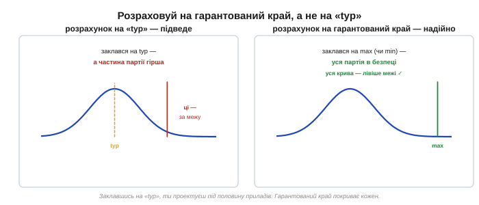
*Рис. 2.9.3.3. Заклавшись на «typ», ви проектуєте під середину розкиду — а помітна частина партії, гірша за typ, випадає за вашу межу й підводить. Заклавшись на гарантований край (max чи min), ви покриваєте **кожен** екземпляр: уся крива лежить із безпечного боку.*

Згадаймо приклад із [§2.9.1](reading-datasheets.md): «typ» вхідний струм 1 нА, «max» — 10 нА. Розрахуєте на 1 нА — і схема працюватиме на більшості чипів, та зрідка трапиться екземпляр на 10 нА, і саме він зіпсує точний вимір. А розрахуєте на гарантовані 10 нА — і будь-який прилад із партії вкладеться. Парадокс лише уявний: ви ніби «перестраховуєтеся», беручи найгірше число, — але саме воно зветься гарантованим, бо тільки його обіцяно для всіх. Інженер проектує так, щоб схема працювала з **будь-яким** приладом, що відповідає даташиту, а не лише зі «щасливим» зразком зі свого столу.

Тонкість: не всі гарантовані числа однаково тверді. Частину параметрів **перевіряють на кожному** приладі на заводському тесті (100 % tested) — це найнадійніша гарантія. Іншу частину «гарантують за конструкцією» *(guaranteed by design)*: не міряють на кожному, а ручаються з розрахунку й вибіркових перевірок. Друге трохи слабше за перше, та все одно куди надійніше за «typ». У ретельних даташитах поряд із числом є позначка, до якого роду воно належить.

Та й перегинати не варто: брати найгірший бік **кожного** параметра водночас — це проектувати під прилад, якого, може, й не існує (усі параметри на межі одночасно — рідкість). Тому досвідчені інженери закладаються на гарантовані краї там, де параметр **критичний** для схеми, а другорядні беруть ближче до «typ» — баланс між надійністю й вартістю.

### Умови — половина числа

Тепер про стовпець, який недосвідчені читачі взагалі пропускають, — **Conditions**. А дарма: число без умов нічого не варте, бо той самий параметр під різними умовами **різний**.

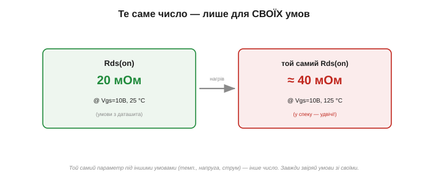
*Рис. 2.9.3.4. Опір відкритого MOSFET «20 мОм» дійсний лише за вказаних умов (Vgs = 10 В, 25 °C). У спеку (125 °C) той самий прилад має вже ≈40 мОм — удвічі більше. Беручи число, завжди звіряйте умови його вимірювання зі **своїми**.*

Кожне число в таблиці виміряне за **конкретних** обставин: за певної температури, напруги живлення, навантаження, частоти. Змініть умови — зміниться й число. Опір відкритого ключа, виміряний при 25 °C, у спеку буде помітно більший; підсилення, виміряне на низькій частоті, на високій впаде; струм спокою при 5 В і при 3 В різний. Тому, виписуючи параметр, інженер дивиться **не лише на число, а й на рядок умов поруч** — і питає себе: «а мої умови такі самі?». Якщо ваша схема працюватиме при 85 °C, а число дане для 25 °C, — воно вам **не** підходить напряму; треба шукати значення для вашої температури (часто його дають окремим рядком чи графіком, [§2.9.4](reading-datasheets.md)). Це найтонша пастка таблиці: число ніби є, ви його берете — а воно не для вашого світу.

Дві практичні дрібниці про умови. По-перше, **виноски**: біля числа часто стоїть значок примітки, а внизу сторінки — рядок із додатковими умовами тесту («виміряно за такого навантаження», «усереднено за стільки-то зразків»). Їх читають, бо вони міняють сенс числа. По-друге, **температурний сорт** приладу: гарантовані min/max дійсні в усьому **робочому** діапазоні температур, а він залежить від сорту — комерційний (0…70 °C), індустріальний (−40…85 °C), автомобільний (−40…125 °C). Прилад «того самого» номера, але іншого сорту, гарантує свої числа у вужчому чи ширшому діапазоні — і коштує відповідно.

Той самий принцип — і з напругою живлення. Струм спокою, виміряний при 5 В, при 3.3 В буде інший; вихідний розмах при різних рейках теж. Тому, переносячи прилад на нижчу шину (а саме так роблять сучасні плати), не лінуйтеся перечитати ключові параметри для **вашої** напруги, а не для тієї, на якій їх зручно було виміряти виробникові. Інакше легко взяти красиве «вітринне» число, зняте за найвигідніших умов, а в реальній схемі дістати геть інше.

### Який край дивитися

Лишилося зрозуміти, **котру** з гарантованих колонок брати — min чи max. Відповідь залежить від того, з якого боку параметра ховається **біда**.

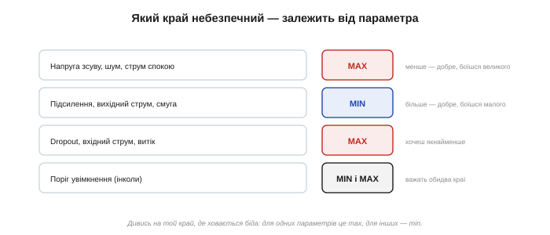
*Рис. 2.9.3.5. Для одних параметрів небезпечний **великий** бік (зсув, шум, струм спокою, dropout — їх боїшся завеликими, тож дивишся max). Для інших — **малий** (підсилення, вихідний струм, смуга — їх боїшся замалими, тож дивишся min). А деякі (пороги) важать обома краями.*

Логіка проста: дивися на той край, де чаїться проблема. Боїтеся, що параметр буде **завеликим** (зсув спотворить вимір, струм спокою висадить батарею, dropout не дасть стабілізаторові втримати вихід) — берете **max**. Боїтеся, що **замалим** (підсилення не дотягне, вихідний струм не прокачає навантаження, смуга не встигне за сигналом) — берете **min**. А для деяких параметрів небезпечні **обидва** краї (наприклад, поріг спрацювання, що має лежати у вузькому вікні) — тоді перевіряють і min, і max. Колонка «typ» при цьому майже завжди лишається осторонь: вона для інтуїції, не для розрахунку.

Корисний прийом — перед тим як виписати число, спитати себе: «а що станеться, якщо цей параметр виявиться **гіршим**, ніж я гадаю?». Відповідь одразу показує небезпечний бік. «Гірше» — це більше (перегрів від струму спокою)? Дивишся max. «Гірше» — це менше (підсилювач не дотягне)? Дивишся min. Параметр, у якого зле з обох боків, перевіряєш обома краями. Звичка ставити це питання рятує від машинального хапання «typ».

### Рецепт читання рядка

Зведімо все до трьох кроків, які стають рефлексом.

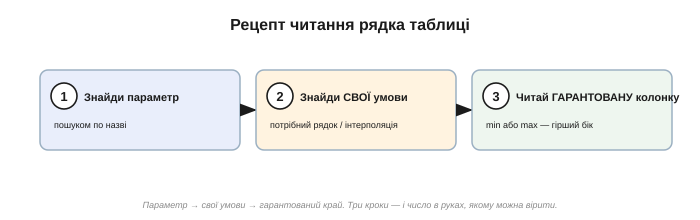
*Рис. 2.9.3.6. Знайди параметр (пошуком по назві) → знайди СВОЇ умови (потрібний рядок або інтерполяцію між ними) → читай ГАРАНТОВАНУ колонку (min або max — той бік, де біда). Три кроки — і в руках число, якому можна вірити.*

Отже: **перше** — знайти потрібний параметр (часто швидше пошуком по назві, ніж гортанням). **Друге** — знайти **свої** умови: якщо параметр дано для кількох температур чи напруг, узяти рядок, що відповідає вашим, а як точного нема — обережно проінтерполювати чи взяти найгірший. **Третє** — прочитати **гарантовану** колонку (min або max — той край, що небезпечний), а «typ» лишити для прикидки. Три кроки — і ви маєте число, з яким можна йти в розрахунок, певні, що воно дійсне для будь-якого приладу у ваших умовах.

Простежмо на рядку з таблиці (Рис. 2.9.3.1). Хай нас цікавить **напруга зсуву** ОП для точного вимірювача при кімнатній температурі. Знаходимо рядок «Vos» — умови «Vcc=5 В, 25 °C» збігаються з нашими, добре. Зсув псує точний вимір, тож небезпечний **великий** бік — беремо **max = 3 мВ** (а не typ 0.5 мВ!). Саме на 3 мВ і закладаємо похибку схеми. Узяли б 0.5 — і кожен інший прилад дав би в рази більший зсув, ніж ми розрахували, а схема брехала б у полі, хоч на столі й працювала.

> 🔧 **Навіщо це.** Головна таблиця даташита подає кожен параметр трійцею min / typ / max плюс умови — і читати її треба з трьома звичками. **Перша:** «typ» — не обіцянка, а очікуване; рахуй на **гарантований край** (min або max), бо тільки його витримає кожен прилад. **Друга:** дивись на той край, де ховається біда (завеликий зсув → max; замале підсилення → min). **Третя:** завжди звіряй **умови** числа зі своїми — те саме значення під іншою температурою чи напругою інше. Хто бере з таблиці «typ» за паспортне, той рано чи пізно складе схему, що працює лише на власному столі.

### Що далі

Коли потрібних умов у таблиці нема, на поміч приходять **графіки**: вони показують, як параметр пливе з температурою, струмом чи напругою неперервно. Як їх читати — і як не помилитися з логарифмічними осями — далі.

> ▶️ Далі: [§2.9.4 — Графіки: derating, ВАХ, температурні залежності](reading-datasheets.md)

## 2.9.4 Графіки: derating, ВАХ, температурні залежності

У попередній темі ми навчилися знімати число з таблиці — але натрапили на її межу: таблиця дає параметр лише для **кількох** заздалегідь обраних умов. А що, як ваша температура — 60 °C, а в таблиці є рядки тільки для 25 і 85? Що, як струм навантаження не той, що в колонці? Саме тут на поміч приходить інший спосіб подати дані — **графік**. Розділ даташита, що зветься **Typical Performance Characteristics** *(типові характеристики)*, складається з десятків кривих, і кожна показує, як параметр **неперервно** пливе зі зміною умов. Навчитися їх читати — означає діставати з даташита числа там, де таблиця мовчить.

### Чому графік, а не таблиця

Почнімо з того, навіщо взагалі малювати криву, коли є числа. Таблиця дає **дискретні** точки: тут і тут, а між ними — порожньо. Графік натомість малює всю залежність суцільною лінією, тож значення можна зняти для **будь-якої** точки в діапазоні.

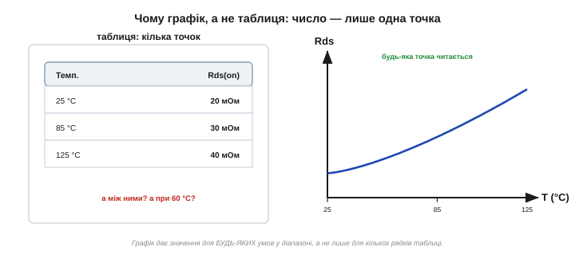
*Рис. 2.9.4.1. Таблиця дає опір лише для трьох температур; а скільки буде при 60 °C — невідомо. Графік малює всю криву, тож значення читається для будь-якої температури в діапазоні. Графік — це таблиця з нескінченною кількістю рядків.*

Є й друга, тонша користь. Сама **форма** кривої миттєво розповідає про характер приладу — те, чого з кількох чисел не видно. Полога лінія каже «параметр майже не залежить від цієї умови»; крута — «залежить сильно, пильнуй»; горб посередині — «є оптимум, і обабіч від нього гірше». Інженер, кинувши оком на форму, відразу розуміє, чого чекати, ще навіть не знявши конкретного числа. Тому графіки не пропускають як «картинки для краси»: вони — повноцінне джерело даних, а часто й найзручніше.

Ще важливо: ці криві — теж **типові** *(typical)*, як і колонка «typ» із [§2.9.3](reading-datasheets.md). Тобто вони показують поведінку **середнього** приладу, а не гарантовану межу. Для прикидки «як воно поводитиметься» цього досить; але якщо параметр критичний, то гарантію все одно беруть із таблиці (min/max), а графік слугує радше для розуміння **тенденції** — куди й як сильно число посунеться.

### Derating: межа, що тане з нагрівом

Найважливіший клас графіків — **derating-криві** *(зниження номіналу)*. Вони відповідають на питання, яке ми лишили відкритим у [§2.9.2](reading-datasheets.md): абсолютний максимум потужності дано при 25 °C, а що в спеку? Відповідь — потужність, яку прилад здатен розсіяти, **падає** з нагрівом.

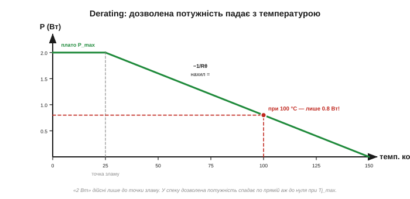
*Рис. 2.9.4.2. Крива дозволеної потужності. До «точки зламу» — плато (повні 2 Вт). Далі лінія спадає до нуля при граничній температурі кристала. При 100 °C корпуса прилад тягне вже не 2 Вт, а лише 0.8. «Паспортна» потужність дійсна тільки на холоді.*

Логіка кривої проста й випливає з теплового опору ([§2.7.5](../mosfet/mosfet.md)). Прилад гине, коли температура його кристала (Tj) сягає межі — скажімо, 150 °C. Тепло від кристала тече назовні крізь тепловий опір, і чим гарячіше довкілля, тим менше «місця» лишається для власного розігріву. Звідси й форма: до **точки зламу** прилад може розсіювати повну паспортну потужність (плато), а далі дозволена потужність спадає **по прямій** до нуля — рівно там, де температура корпусу дорівнює граничній Tj. Нахил цієї прямої — це й є обернений тепловий опір (−1/Rθ).

Практичний висновок різкий: гучна цифра «2 Вт» на першій сторінці — це потужність **на холоді**, біля 25 °C. У реальному теплому корпусі, де довкола ще й інші гарячі компоненти, дозволена потужність може впасти вдвічі-втричі. Тому, проєктуючи щось, що гріється, не вірять числу з вітрини, а йдуть на derating-криву, знаходять **свою** робочу температуру й знімають дозволену потужність саме для неї.

> 🔧 **Навіщо це.** Derating-крива — це чесне продовження абсолютного максимуму потужності: вона каже, **наскільки менше** прилад можна навантажувати в реальній спеці. Без неї легко взяти «2 Вт» за вічну істину, навантажити прилад на 1.5 Вт у гарячому корпусі — і дивуватися, чому він деградує, хоча «до межі ще далеко». Для всього, що гріється (стабілізатори, силові ключі, резистори потужності), derating дивляться **завжди**.

**Приклад (потужність у спеку).** Резистор має паспортну потужність 2 Вт (при 25 °C) і точку зламу теж 25 °C, далі спад до нуля при 150 °C. Скільки він витримає при температурі довкілля 100 °C?

```
лінійний спад від 2 Вт (при 25 °C) до 0 Вт (при 150 °C)
діапазон спаду   = 150 − 25      = 125 °C
наша точка вище зламу на         = 100 − 25 = 75 °C
частка діапазону, що «з'їдена»    = 75 / 125 = 0.60
дозволена потужність = 2 Вт · (1 − 0.60) = 0.80 Вт
```
При 100 °C цей «двоватний» резистор можна навантажувати лише на 0.8 Вт. Поставите на нього 1.5 Вт — і він перегріється, хоча на холодному столі чесно тримав свої 2 Вт.

### ВАХ: коліно діода й логарифмічна вісь

Другий важливий графік — **вольт-амперна характеристика** *(I–V curve, ВАХ)*: як струм залежить від напруги. Для діода вона особлива, бо різко **нелінійна** — і саме на ній уперше зустрічається підступ логарифмічних осей.

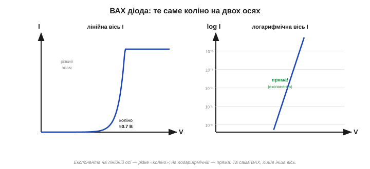
*Рис. 2.9.4.3. Та сама ВАХ діода. Ліворуч (лінійна вісь струму) — різке «коліно» біля 0.7 В: до нього струму майже нема, за ним він злітає. Праворуч (логарифмічна вісь) той самий струм лягає в пряму лінію — так видно експоненційну природу й крихітні струми, яких на лінійній осі не розгледіти.*

На лінійній осі ВАХ діода виглядає як знайоме «коліно» з [§2.5.5](../diode-pn-junction/diode-pn-junction.md): доки напруга мала, струму практично нема, а після ~0.7 В він стрімко злітає. Та лінійна вісь ховає важливе: до коліна струм не нульовий, він просто **дуже малий** (нано- й мікроампери), і на лінійній шкалі його не видно. Тому виробники часто малюють струм у **логарифмічному** масштабі — і тоді експонента діода стає **прямою лінією**, а крихітні струми витоку проступають так само чітко, як великі робочі.

Це підводить до загальної навички: даташити рясніють логарифмічними осями (струми, опори, частоти охоплюють діапазони в тисячі й мільйони разів, і лінійна вісь їх просто не вмістила б). А логарифмічну вісь украй легко **прочитати хибно**.

### Як не обманутися логарифмічною віссю

Головна пастка логарифмічної осі — її **нерівномірна** сітка. На звичайній (лінійній) осі однакова відстань означає однакову **різницю**; на логарифмічній — однакове **множення**.

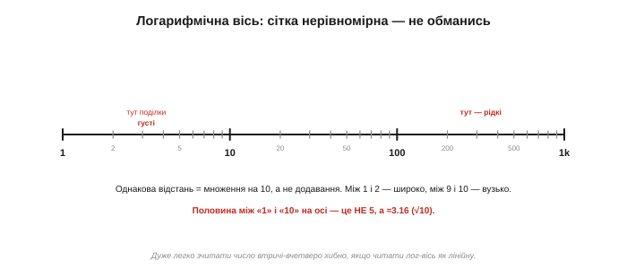
*Рис. 2.9.4.4. На лог-осі рівні кроки — це ×10 (декади): 1 → 10 → 100. Поділки між ними згущуються: між 1 і 2 широко, між 9 і 10 вузько. Середина відрізка між «1» і «10» — це не 5, а ≈3.16 (√10). Читати таку вісь, як лінійну, — помилитися в рази.*

Звідси правило читання. По-перше, **великі поділки** на лог-осі — це степені десятки (декади): 1, 10, 100, 1000. По-друге, **дрібні поділки** всередині декади нерівномірні: вони густі на початку (між 1 і 2 широко) і тісні в кінці (між 9 і 10 вузько). По-третє, і це найважливіше: **середина** між двома сусідніми декадами — **не** середнє арифметичне. Посередині між «1» і «10» лежить не 5, а √10 ≈ 3.16. Хто цього не знає й читає лог-вісь на око, як лінійну, той легко промахується в два-три рази — а в розробці це часто фатально.

Практична порада: на лог-осі краще не «прикидати на око», а спиратися на підписані поділки й рахувати декади. Якщо точка лежить трохи вище за лінію «10», це може бути і 12, і 15 — придивіться до дрібної сітки, а не вгадуйте.

### Як зняти число з кривої

Зведемо механіку читання будь-якого графіка до простого ритуалу з трьох рухів.

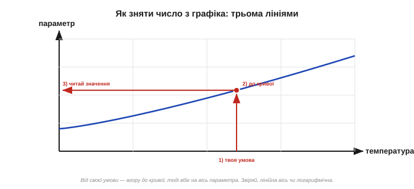
*Рис. 2.9.4.5. Від своєї умови на горизонтальній осі ведемо вертикаль угору до перетину з кривою, тоді від цієї точки — горизонталь убік до вертикальної осі й читаємо значення. Три рухи: вгору до кривої, вбік на вісь.*

Отже: **перше** — знайти на горизонтальній осі **свою** умову (температуру, струм, напругу). **Друге** — провести від неї вертикаль угору до перетину з потрібною кривою (а на графіку їх часто кілька — для різних напруг чи температур; беріть ту, що підписана під ваш випадок). **Третє** — від точки перетину провести горизонталь убік, до вертикальної осі, і там прочитати значення. І щоразу перед зчитуванням кидайте погляд на **тип осі**: лінійна вона чи логарифмічна, бо від цього залежить, як трактувати поділки.

Дрібна, але корисна звичка — звертати увагу на **умови всього графіка**, написані дрібним шрифтом біля заголовка кривої («при Vcc = 5 В», «крива для типового приладу»). Графік, як і число в таблиці, дійсний лише за тих умов, за яких його зняли.

### Звіринець типових кривих

Аби не губитися, варто впізнавати кілька характерних форм, що повторюються з даташита в даташит. Тоді, відкривши незнайому криву, ви відразу вловлюєте, про що вона.

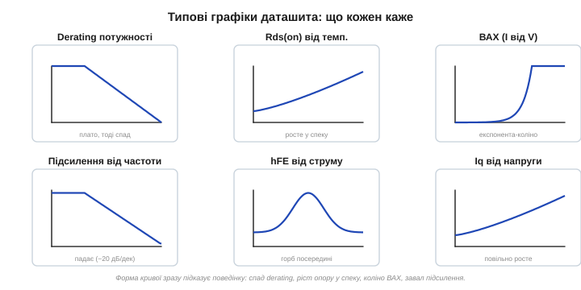
*Рис. 2.9.4.6. Шість типових кривих: derating потужності (плато, тоді спад); опір Rds(on), що росте у спеку; експоненційна ВАХ із коліном; підсилення, що завалюється з частотою; коефіцієнт β з горбом посередині діапазону струмів; струм спокою, що повільно росте з напругою. Форма кривої — це вже половина відповіді.*

Кілька найчастіших мешканців цього звіринця: **derating** (плато й спадна пряма — скільки потужності дозволено); **Rds(on) від температури** (зростає у спеку — той самий ефект, що ми бачили в [§2.9.3](reading-datasheets.md): гарячий ключ «твердіший»); **ВАХ** (коліно діода чи вихідні криві транзистора); **підсилення від частоти** (падає з нахилом, що ми знаємо з модуля про фільтри — [§2.4.5](../frequency-response/frequency-response.md)); **коефіцієнт підсилення від струму** (часто з горбом: є оптимальний струм, а обабіч гірше); **струм спокою від напруги чи температури**. Упізнавши форму, ви наполовину вже зрозуміли криву — лишається зняти конкретне число.

### Температурні залежності: чому майже все «пливе»

Окремої уваги вартий цілий клас кривих — **температурні залежності**, бо температура зачіпає чи не кожен параметр приладу. Чому так? Бо в основі електроніки лежить фізика напівпровідника, а вона сильно залежна від тепла: рухливість носіїв падає з нагрівом, пряме падіння переходу зменшується (−2 мВ/°C, [§2.5.5](../diode-pn-junction/diode-pn-junction.md)), струми витоку зростають. Звідси й безліч кривих «параметр від температури» в кожному серйозному даташиті.

Кілька типових прикладів і їхній напрям. Опір відкритого ключа Rds(on) **росте** у спеку (приблизно вдвічі від 25 до 125 °C) — гарячий MOSFET провідний гірше. Пряме падіння діода VF **спадає** з температурою. Струм витоку й вхідний струм підсилювача **зростають** із нагрівом (часто подвоюються кожні ~10 °C). Зсув і дрейф підсилювача мають власну криву температурного дрейфу. Тому правило: якщо ваш прилад працюватиме не за кімнатних 25 °C — а надворі, у корпусі, поряд із гарячими сусідами це майже завжди так, — то параметр беруть **не** за кімнатне число з таблиці, а з температурної кривої для **своєї** температури.

Тут і ховається підступ із [§2.9.3](reading-datasheets.md), тепер уже наочно: таблиця часто дає число для 25 °C, а температурна крива показує, як далеко воно «попливе» у вашій реальній спеці. Дивитися лише на кімнатне число — означає проєктувати для столу, а не для поля. І, як завжди з кривими, ці залежності — **типові**: для критичного параметра гарантований найгірший випадок дивляться окремо, а крива дає розуміння **тенденції** й величини зсуву.

> 🔧 **Навіщо це.** Графіки даташита — це дані для умов, яких нема в таблиці, і вони незамінні там, де параметр сильно «пливе». Три речі тримайте в голові. **Перше:** derating-крива каже, наскільки слабше навантажувати прилад у спеку — для всього, що гріється, це обов'язкова перевірка. **Друге:** логарифмічну вісь читають обережно — рівний крок це ×10, а середина між декадами це √10, не половина. **Третє:** число знімають ритуалом «вгору до кривої — вбік на вісь», щоразу звіривши, лінійна вісь чи логарифмічна. Хто вміє читати криві, той дістає з даташита відповіді, які іншим недоступні.

### Що далі

Числа й криві ми вже читаємо. Та перш ніж рахувати схему, треба знати **фізичну** сторону приладу: у якому він корпусі, де яка ніжка й що означають загадкові коди на його спинці. Без цього навіть ідеально підібраний компонент не стане на плату правильно. Далі — про корпуси, маркування й розпіновку.

> ▶️ Далі: [§2.9.5 — Корпуси, маркування, розпіновка](reading-datasheets.md)

## 2.9.5 Корпуси, маркування, розпіновка

Дотепер ми читали даташит як набір **чисел**: межі, параметри, криві. Та компонент — це ще й **фізичне тіло**: шматочок пластику чи металу з виводами, який має стати на конкретне місце плати. І тут на інженера чигає окремий клас помилок, не пов'язаних із електрикою зовсім: замовив корпус, що не влазить; розвів плату дзеркально, бо переплутав першу ніжку; не зміг розшифрувати трисимвольний код на крихітній спинці транзистора. Цей бік даташита — **корпус** *(package)*, **розпіновка** *(pinout)* і **маркування** *(marking)* — розберемо тут. Почнімо з найголовнішого поділу всіх корпусів на два світи.

### Два світи монтажу: THT і SMD

Усі корпуси діляться на дві великі сім'ї за **способом монтажу** на плату. Це перше, що визначає вигляд і розмір компонента.

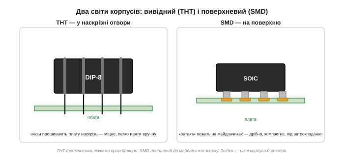
*Рис. 2.9.5.1. Ліворуч — вивідний монтаж (THT): ніжки прошивають плату наскрізь і паяються з іншого боку. Праворуч — поверхневий (SMD): контакти лежать на майданчиках і паяються зверху. Перший міцний і зручний для руки; другий дрібний, компактний і розрахований на автоскладання.*

**Вивідний монтаж** *(through-hole, THT)* — старіший: компонент має довгі ніжки, що просовуються в наскрізні отвори плати й паяються з протилежного боку. Такі корпуси (як-от **DIP** для мікросхем) великі, міцно сидять механічно й чудово паяються вручну — тому їх люблять для макетів і навчання. **Поверхневий монтаж** *(surface-mount, SMD/SMT)* — сучасний: контакти не мають довгих ніжок, а лежать просто на **майданчиках** *(pads)* з того ж боку, де й корпус. Це дозволяє робити компоненти крихітними й розміщувати їх щільно з обох боків плати, а паяти автоматично. Платою за це — складніший ручний монтаж: чим дрібніший SMD, тим важче його припаяти без спеціального інструменту.

Даташит завжди вказує, у яких корпусах випускають прилад, — і той самий чип нерідко існує **і** в THT, **і** в кількох SMD-варіантах. Вибір між ними — це не лише електрика (вона однакова), а й те, як ви збиратимете плату: руками на макеті чи автоматом на виробництві.

### Галерея корпусів

Конкретних корпусів — десятки, але кілька родин трапляються найчастіше, і їх варто впізнавати в обличчя разом із їхнім масштабом.

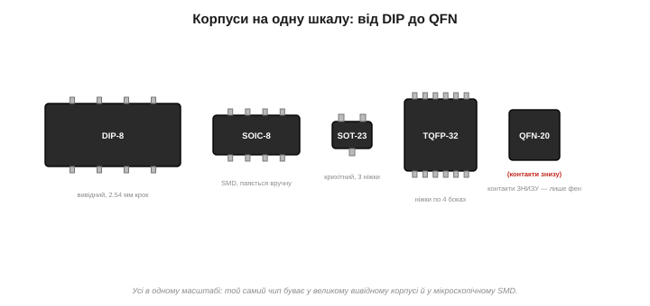
*Рис. 2.9.5.2. Кілька поширених корпусів в одному масштабі. DIP — великий вивідний; SOIC — середній SMD, ще паяється вручну; SOT-23 — крихітний трививідний; TQFP — квадрат із ніжками по чотирьох боках; QFN — контакти сховані ЗНИЗУ (без виступів), тож вручну майже не паяється. Той самий чип буває і великим, і мікроскопічним.*

Коротка екскурсія: **DIP** *(dual in-line package)* — класичний вивідний корпус-«сороконіжка» з двома рядами ніжок і кроком 2.54 мм; **SOIC/SO** — його SMD-родич, менший, але ще паяний рукою; **SOT-23** — крихітний корпус на три-п'ять виводів для одиночних транзисторів і дрібних мікросхем; **TQFP/LQFP** — плаский квадрат із ніжками по всіх чотирьох боках (десятки виводів, для мікроконтролерів); **QFN** — той самий квадрат, але контакти сховані **під** корпусом (виступів немає зовсім). Останній особливо підступний для ручної роботи: припаяти його без нижнього підігріву чи фена практично неможливо, бо до контактів не дістати паяльником. Тому, обираючи компонент, дивляться не лише на параметри, а й на корпус: «чи зможу я це взагалі припаяти?».

Дві важливі величини супроводжують кожен корпус. Перша — **крок виводів** *(pitch)*: відстань між сусідніми ніжками. У DIP це широкі 2.54 мм, у SOIC — 1.27 мм, а в дрібних QFN — 0.5 мм і менше. Чим менший крок, тим важче паяти й тим легше поставити перемичку припою між ніжками. Друга — **посадкове місце** *(footprint, land pattern)*: малюнок майданчиків на платі, на який стане корпус. Виробник дає його розміри (а часто й готовий рекомендований footprint) у розділі механіки, і розводити плату треба **точно** за ним — інакше корпус фізично не сяде на майданчики. Звідси й чесне попередження собі ще на етапі вибору: екзотичний корпус з кроком 0.4 мм може коштувати не лише складного паяння, а й переробки плати, якщо footprint розведено неточно.

Окремо варто знати про **тепловий майданчик** на споді потужних корпусів. У багатьох SMD-приладах, що гріються (стабілізатори, силові ключі), знизу є великий металевий контакт — через нього тепло йде в мідь плати. Даташит вимагає припаяти його до полігона й часто — пронизати **тепловими перехідними отворами** *(thermal vias)* до іншого боку плати. Не припаяв тепловий майданчик — і прилад перегрівається навіть на дозволеній потужності, бо тепловідведення, на яке розраховано derating ([§2.9.4](reading-datasheets.md)), просто не працює.

> 🔧 **Навіщо це.** Корпус вирішує, чи стане компонент на вашу плату й чи зможете ви його змонтувати. Розкішний за параметрами чип у корпусі QFN марний, якщо ви паяєте руками й не маєте фена. І навпаки: для компактного серійного виробу великий DIP — недозволена розкіш місця. Тому корпус — повноцінний критерій вибору нарівні з електричними числами, а не «дрібниця наприкінці даташита».

### Перша ніжка: ключ, без якого все дзеркально

Тепер найкритичніша деталь монтажу — як знайти **перший вивід**. Помилка тут не псує прилад, але робить дещо підступніше: уся плата виходить **дзеркальною**, і компонент стоїть «задом наперед».

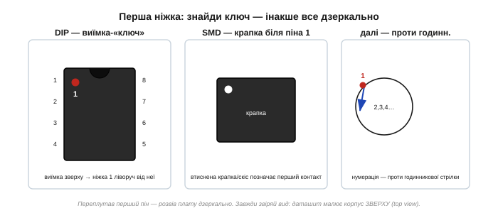
*Рис. 2.9.5.3. Виробник завжди позначає перший вивід: у DIP — півкруглою виїмкою-«ключем» на торці (ніжка 1 ліворуч від неї), у SMD — втиснутою крапкою чи скошеним кутом. Далі нумерація йде проти годинникової стрілки. І головне: корпус малюють ВИДОМ ЗВЕРХУ (top view).*

Щоб такого не сталося, виробник **завжди** позначає перший вивід якоюсь міткою на корпусі: у DIP це півкругла **виїмка** *(notch)* на одному торці — ніжка 1 ліворуч від неї; у SMD — втиснута **крапка** *(dot)* в кутку або скошений край. Від першого виводу нумерація йде **проти годинникової стрілки**, якщо дивитися зверху. Цю мітку звіряють тричі: на корпусі компонента, на малюнку розпіновки в даташиті й на шовкографії плати — усі три мають збігтися.

І окрема, дуже часта пастка: розпіновку в даташиті майже завжди малюють **видом зверху** *(top view)* — тобто як ви бачите компонент, що лежить виводами донизу. Якщо ж вам треба розташування контактів **знизу** (наприклад, паяючи дроти до споду роз'єму), малюнок треба подумки **віддзеркалити**. Плутанина top/bottom view — класична причина дзеркальних плат навіть у тих, хто пильнує першу ніжку.

### Карта розпіновки

Розпіновка — це карта «який вивід що робить». Читати її треба уважно, бо тут теж є свої тонкощі.

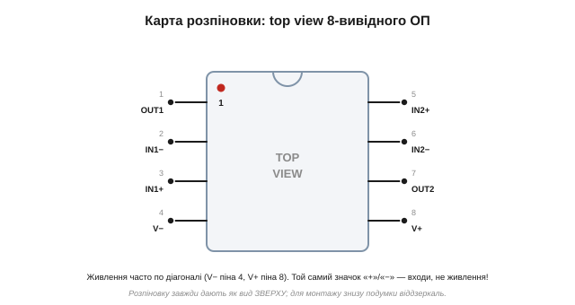
*Рис. 2.9.5.4. Розпіновка здвоєного операційного підсилювача, вид зверху. Перший вивід — біля виїмки. Зверніть увагу: значки «+» і «−» тут позначають неінвертуючий і інвертуючий ВХОДИ, а не живлення; саме живлення (V+, V−) часто стоїть по діагоналі кутів. Не сплутати одне з одним.*

Кілька правил читання. По-перше, орієнтуйтеся від **першого виводу** й рахуйте проти годинникової стрілки. По-друге, шукайте **живлення**: виводи V+ і V− (або Vcc і GND) — найперше, що треба знайти, і вони часто стоять не поряд, а по **діагоналі** корпусу. По-третє, стережіться **однакових значків** із різним сенсом: на розпіновці операційного підсилювача «+» і «−» позначають **входи** (неінвертуючий та інвертуючий), а зовсім не плюс і мінус живлення — сплутати їх легко, а наслідок фатальний. По-четверте, у багатоканальних чипах (два-чотири підсилювачі в корпусі) виводи групують по каналах: IN1, OUT1, далі IN2, OUT2 — звіряйте номер каналу.

Корисно ще знати про виводи з особливими позначками: **NC** *(not connected)* — нікуди не під'єднаний усередині, його можна лишити вільним (хоча інколи виробник просить таки нічого до нього не чіпати); **EP** *(exposed pad)* — металевий майданчик на споді корпусу (типово в QFN), який часто є водночас земляним контактом **і** тепловідводом, тож його не можна лишати непаяним.

### Маркування: що написано на спинці

Тепер у зворотний бік: ви тримаєте незнайому деталь і хочете дізнатися, що це. Відповідь — у **маркуванні** на корпусі, але читається воно по-різному залежно від розміру.

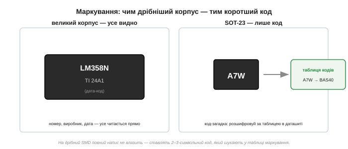
*Рис. 2.9.5.5. На великому корпусі (DIP) уміщається повна назва, логотип виробника й дата-код — усе читається прямо. На крихітному SOT-23 повний номер не влазить, тож ставлять 2–3-символьний код-загадку («A7W»), який доводиться розшифровувати за таблицею маркування в даташиті чи довіднику.*

На **великому** корпусі (DIP, SOIC) місця досить, тож друкують повну назву компонента, логотип виробника й **дата-код** *(date code)* — кілька цифр, що кодують тиждень і рік випуску. Тут усе читається прямо: бачите «LM358N» — це він і є.

А на **дрібному** SMD повна назва просто не вміщається. Тому на нього ставлять короткий **код маркування** *(marking code)* — два-три символи на кшталт «A7W». Сам по собі він нічого не каже; його треба **розшифрувати**: знайти таблицю кодів маркування в даташиті (розділ Marking Information) або в спеціальному довіднику кодів SMD. Той самий код різні виробники можуть навіть присвоювати різним деталям — тож розшифровку звіряють із даташитом конкретного виробника. (Як саме за кодом «A7W» на SOT-23 знайти прилад — окрема компонентна вставка до цієї теми.)

### Код замовлення: один номер, багато сенсів

Остання частина — **код замовлення** *(ordering information)*. Це повний номер, який ви вказуєте, купуючи компонент, і в ньому зашифровано більше, ніж здається: не лише сам чип, а й корпус, температурний сорт і навіть спосіб фасування.

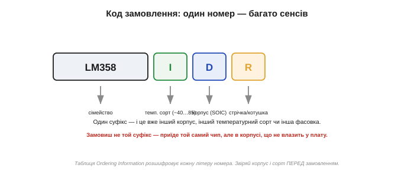
*Рис. 2.9.5.6. Номер замовлення розкладається на частини: базове сімейство (LM358), літера температурного сорту (I — індустріальний), літера корпусу (D — SOIC), літера фасування (R — стрічка на котушці). Один зайвий суфікс — і приїде той самий чип, але в корпусі, що не влазить, або іншого сорту.*

Таблиця Ordering Information розкладає номер на змістовні частини. Типово це: **базове сімейство** (власне, що за чип), **суфікс корпусу** (одна-дві літери: D — SOIC, N — DIP, тощо), **суфікс температурного сорту** (комерційний / індустріальний / автомобільний — згадуємо [§2.9.3](reading-datasheets.md)) і **суфікс фасування** (поштучно, у трубці чи на стрічці-котушці для автомата). Звідси практичне застереження: замовляючи, звіряйте **весь** номер до останньої літери. Помилитеся в суфіксі корпусу — і приїде електрично той самий прилад, але, скажімо, у крихітному SOT-23 замість зручного DIP, і він просто не стане у ваші отвори. А зайва літера фасування може означати, що вам надішлють котушку на тисячі штук замість потрібних трьох.

**Приклад (розшифрувати код замовлення).** У схемі стоїть «LM358IDR», а ви хочете замовити такий самий для макета, де паяєте руками. Що означає кожна частина — і чи годиться він?

```
LM358  → сімейство: здвоєний операційний підсилювач (той самий чип)
I      → темп. сорт: індустріальний, −40…85 °C
D      → корпус: SOIC (SMD) — дрібний, паяти руками складно
R      → фасування: стрічка на котушці (Reel), тисячі штук
```
Електрично це потрібний прилад, але корпус **SMD** і фасування — повна котушка. Для макета зручніше замовити «LM358**N**» (корпус DIP, вивідний, легко паяти) поштучно, без суфікса котушки. Сам чип — той самий «LM358»; змінилися лише дві літери, а з ними — і чи влізе він у макетку, і чи не приїде вам тисяча штук замість трьох.

> 🔧 **Навіщо це.** Фізичний бік даташита рятує від помилок, що не мають стосунку до електрики, але так само болючі. **Перше:** корпус (THT чи SMD, і який саме) вирішує, чи влізе компонент і чи зможете ви його припаяти — це критерій вибору нарівні з параметрами. **Друге:** перший вивід шукають за міткою (виїмка, крапка), а розпіновку читають як вид зверху — інакше плата вийде дзеркальною. **Третє:** на дрібних корпусах номер закодовано, а повний код замовлення містить корпус і сорт, тож звіряйте його повністю. Помилка тут коштує перерозведеної плати чи непридатної партії.

### Що далі

Ми навчилися читати числа, криві й фізичний бік компонента. Лишилося опанувати найхитріше — **дрібний шрифт**: виноски під таблицями, точні умови тестів і окремий документ помилок (errata), де виробник чесно зізнається, що й де працює не так, як обіцяє решта даташита. Саме там ховаються відповіді на найзагадковіші «чому не працює». Далі — про нього.

> ▶️ Далі: [§2.9.6 — Дрібний шрифт: примітки, умови тестів, errata](reading-datasheets.md)

## 2.9.6 Дрібний шрифт: примітки, умови тестів, errata

Є частина даташита, яку новачок проскакує очима, а досвідчений інженер читає чи не уважніше за самі числа, — **дрібний шрифт**. Це виноски під таблицями, рядки умов тесту, застереження петитом і — окремо — цілий документ під назвою **errata**, де виробник зізнається, що прилад подекуди працює не так, як обіцяє решта даташита. Саме тут ховаються відповіді на найбільш виснажливі питання розробки: «я все зробив правильно, чому ж воно не працює?». Навчитися читати цей шрифт — означає переставати втрачати дні на пошук помилок, яких у вашій схемі насправді нема.

### Виноска міняє сенс числа

Почнімо з найчастішого: маленького значка біля числа в таблиці — зірочки чи цифри в дужках. Це **виноска** *(footnote)*, і вона веде до рядка внизу сторінки, який нерідко **повністю** змінює, як це число читати.

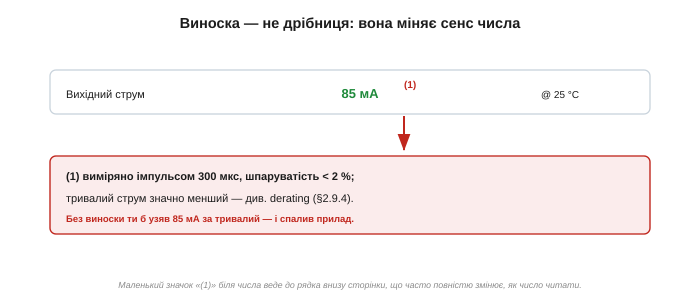
*Рис. 2.9.6.1. Параметр «вихідний струм 85 мА» зі значком «(1)». А виноска внизу каже: це **імпульсне** значення (300 мкс, рідкі імпульси), а тривалий струм значно менший. Без виноски ви б узяли 85 мА за постійний робочий струм — і спалили прилад.*

Класичний приклад — імпульсні значення. Даташит гордо подає «піковий струм 85 мА», а крихітна виноска уточнює: виміряно коротким імпульсом зі скважністю менш як кілька відсотків, а **тривалий** струм у рази менший. Хто проскочив виноску, той закладеться на 85 мА як на постійний робочий струм — і прилад перегріється. Виноски додають критичні застереження: «це значення гарантоване лише для такого-то сорту», «усереднено за стільки-то зразків», «дійсно тільки при такій-то напрузі», «гарантується конструкцією, не вимірюється на кожному». Правило просте: **побачив значок біля числа — знайди й прочитай виноску**, перш ніж брати число в розрахунок. Це кілька секунд, що рятують від хибних висновків.

Корисно знати й типові «адреси» приміток. Найчастіше виноски ховають: умову вимірювання, що не влізла в стовпець Conditions (повний опис тестового імпульсу, навантаження, схеми); прив'язку числа до температурного сорту чи ревізії; уточнення, що параметр **не** вимірюється на кожному приладі, а гарантується конструкцією (згадуємо [§2.9.3](reading-datasheets.md)); і застереження про корпус — мовляв, межа потужності залежить від того, в якому корпусі прилад. Жодне з цих уточнень не дрібне за наслідками, хоч і набране дрібним шрифтом. Тому досвідчений читач, виписуючи число зі значком, веде очима **вниз сторінки** так само механічно, як зчитує саму цифру.

Окремо підступні значки, що ховаються не в окремій колонці, а **просто в тексті** параметра: «(typ)», «(note 3)», «(pulsed)», «(per channel)» — кинуті в дужках одразу біля числа. Їх легко проскочити, бо вони не виділені, а тим часом «(pulsed)» означає те саме, що й виноска про імпульс, а «(per channel)» — що в багатоканальному чипі цифру треба **помножити** на кількість каналів. Звичка читати число **разом** із усіма дужками поряд — частина тієї ж навички, що й читання виносок.

### Умови тесту: лабораторія проти вашої плати

Найважливіший різновид дрібного шрифту — **умови тесту** *(test conditions)*. Ми вже знаємо з [§2.9.3](reading-datasheets.md), що число дійсне лише за своїх умов. Але є особливо підступний випадок, де умови ховають у дрібному шрифті й де вони **завжди** оптимістичніші за реальність, — теплові параметри.

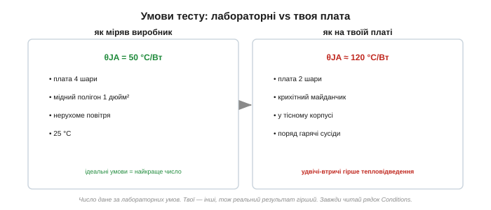
*Рис. 2.9.6.2. Тепловий опір θJA дають для ідеальної лабораторної умови: багатошарова плата, великий мідний полігон, нерухоме повітря. На вашій реальній платі — двошаровій, із крихітним майданчиком, у тісному корпусі поряд із гарячими сусідами — тепловідведення вдвічі-втричі гірше, тож і реальна температура вища.*

Візьмімо тепловий опір «кристал–повітря» θJA. Даташит дає, скажімо, «50 °C/Вт» — а дрібним шрифтом поряд: «виміряно на чотиришаровій платі JEDEC із мідним полігоном площею один квадратний дюйм, у нерухомому повітрі». Це **ідеальні** лабораторні умови, спеціально підібрані, щоб число вийшло гарним. На вашій реальній двошаровій платі з маленьким майданчиком під компонентом і гарячими сусідами поряд тепловий опір може бути вдвічі-втричі більшим — і прилад нагріється куди сильніше за розрахунок «за паспортом». Тому теплові числа завжди читають **разом** з умовами й беруть із чималим запасом, бо реальна плата майже ніколи не дотягує до лабораторного еталона. Цей принцип ширший за тепло: будь-яке «красиве» число варто перевірити — а чи не зняте воно за умов, яких у вашій схемі не буде.

Тепловий опір тут працює як «опір» для тепла: перегрів кристала над довкіллям дорівнює θ, помноженому на розсіювану потужність (ця теплова аналогія закону Ома — окрема математична вставка до теми; тут досить самої арифметики). Подивімося, як вибір умови змінює вирок.

**Приклад (перегрів за паспортом і за реальністю).** Прилад розсіює 1 Вт у середовищі 60 °C. Гранична температура кристала Tj(max) = 125 °C. Чи безпечно — за лабораторним θJA і за реальним?

```
запас на нагрів = Tj(max) − T_довкілля = 125 − 60 = 65 °C
лабораторний θJA = 50 °C/Вт:  нагрів = 50 · 1 = 50 °C → Tj = 110 °C  ✓ (є запас 15 °C)
реальний θJA ≈ 120 °C/Вт:     нагрів = 120 · 1 = 120 °C → Tj = 180 °C  ✗ далеко за межею!
```
За паспортним числом схема «проходить» із запасом; за реальним тепловим опором тієї самої плати кристал перегрівається на 55 °C понад межу. Той самий прилад, та сама потужність — різниця лише в тому, **чию** умову вимірювання взяти. Ось чому теплове число без свого дрібного шрифту небезпечне: воно описує не вашу плату, а ідеальний еталон.

### Пастка «лише typ»

Ще одна засідка дрібного шрифту — параметр, який дають **тільки** як «typ», без гарантованих меж. Ми згадували це в [§2.9.3](reading-datasheets.md); тут підкреслимо, бо помітити це — теж навичка читання петиту.

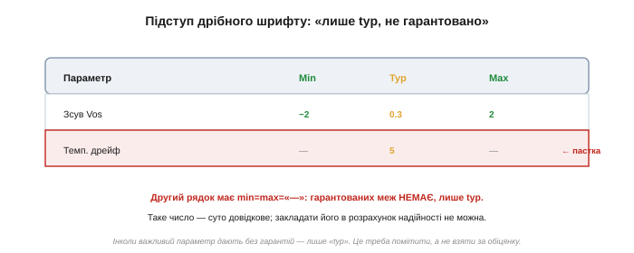
*Рис. 2.9.6.3. Перший рядок має повні min/typ/max — нормальний параметр. А в другому рядку колонки min і max порожні («—»), є лише typ. Це означає: гарантованих меж НЕМАЄ, число суто довідкове. Закладати його в розрахунок надійності не можна.*

Придивіться до колонок: якщо у параметра min і max стоять прочерки, а заповнено тільки «typ», — виробник його **не гарантує** взагалі. Він каже лише: «зазвичай буває отак». Для прикидки це згодиться, але класти таке число в основу надійного розрахунку не можна — конкретний екземпляр може відхилитися як завгодно, і претензій не висунеш. Це не недогляд, а свідоме рішення виробника не зв'язувати себе зобов'язанням щодо некритичного (на його погляд) параметра. Ваша справа — **помітити** прочерки й поставитися до числа відповідно: як до орієнтира, а не до закону.

Підступ у тому, що «лише typ» трапляється саме на тих параметрах, які важко гарантувати, — а вони нерідко критичні. Температурний дрейф, шум, час відновлення, паразитні ємності часто дають без меж, бо їх дорого вимірювати на кожному приладі. І якщо такий параметр виявиться для вас вирішальним, доводиться або закладати більший власний запас, або шукати інший прилад, де його **таки** гарантують. Зверніть увагу й на формулювання поряд: фраза «guaranteed by design» означає, що число хоч і не міряють на кожному, але **ручаються** за нього (це сильніше за голий «typ»); а от просто «typical, not tested» — лише орієнтир. Ці дрібні позначки якраз і відрізняють обіцянку від побажання.

### Ревізія: стара версія бреше

Тепер про дрібний шрифт у кутку кожної сторінки — **ревізію** документа. Ми торкалися цього в [§2.9.1](reading-datasheets.md); тут — чому це частина «дрібного шрифту», яку звіряють завжди.

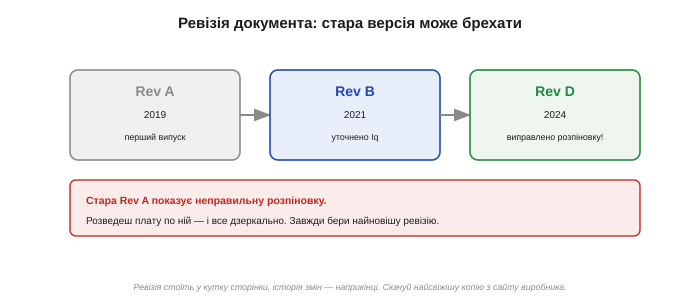
*Рис. 2.9.6.4. Даташит живе версіями: Rev A (перший випуск), Rev B (уточнили струм спокою), Rev D (виправили помилку в розпіновці!). Якщо взяти стару Rev A, можна розвести плату за неправильною розпіновкою. Завжди бери найновішу ревізію з сайту виробника.*

Даташит — живий документ: його **переглядають**. Виробник уточнює числа, виправляє друкарські помилки, інколи — навіть помилки в розпіновці чи в граничних значеннях. Кожна версія має позначку ревізії (літеру чи дату) у кутку сторінки, а наприкінці документа — **історію змін** *(revision history)*, де перелічено, що саме змінилося. Звідси небезпека: стара ревізія може спокійно «брехати» про те, що в новій уже виправлено. Уявіть, що в Rev A була помилка в розпіновці, а ви розвели плату саме за нею, — отримаєте дзеркальний чи неробочий вузол, хоча «зробили все за даташитом». Тому: скачуйте найсвіжішу копію з сайту виробника, гляньте на ревізію й — особливо для відповідального проєкту — прогляньте історію змін, чи не виправляли там нічого критичного для вас. Окремо стережіться позначки «Preliminary»/«Advance Information»: так маркують даташити приладів, що ще не пішли в серію, і їхні цифри попередні.

### Errata: офіційний список «а отут воно бреше»

І найважливіше відкриття цієї теми — **errata** *(перелік помилок)*. Це окремий документ (часто не вшитий у сам даташит), де виробник чесно перелічує, **де прилад працює не так, як описано** в основній документації. Ідеться не про друкарські помилки в тексті, а про справжні **вади самого кремнію**: вузол, що поводиться інакше, ніж задумано.

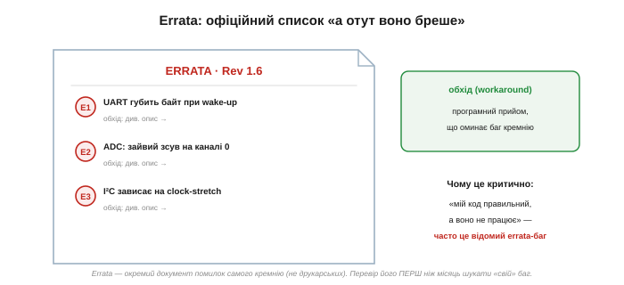
*Рис. 2.9.6.5. Errata перелічує реальні вади приладу: «UART губить байт при виході зі сну», «зайвий зсув на нульовому каналі АЦП», «I²C зависає при розтягуванні такту». До кожної — **обхід** *(workaround)*: програмний прийом, що оминає ваду. Часто загадкове «мій код правильний, а не працює» — це відомий errata-баг.*

Чому errata критична? Бо вона рятує дні, а то й тижні марних пошуків. Уявіть: ваш код правильний, схема правильна, а інтерфейс раз у раз губить дані. Ви перечитуєте власну програму вдесяте, переробляєте плату — а причина в тому, що в цій ревізії кремнію є **відомий** баг, перелічений в errata, і виробник навіть дає до нього **обхід** *(workaround)* — програмний прийом, що оминає ваду (наприклад, «після виходу зі сну скиньте такий регістр перед першим прийомом»). Хто звірив errata на початку, той просто застосував обхід; хто не знав про неї — змарнував тиждень, шукаючи неіснуючу помилку в себе. Тому errata перевіряють **до** того, як винуватити власний код у незрозумілій поведінці, а не після. Errata прив'язана до конкретної ревізії кремнію (її друкують на корпусі дата-кодом), тож звіряють саме для свого примірника. (Як одна errata-помилка обчислень навчила цілу індустрію публікувати такі списки — окрема історична вставка до цієї теми.)

Варто розрізняти errata й **історію змін документа**. Історія змін ([§2.9.1](reading-datasheets.md)) каже, що виправили в самому **папері** — уточнили число, перемалювали розпіновку. Errata ж каже, що не так у самому **кремнії** — і це не виправлять перевиданням даташита, лише новою ревізією чипа або вашим програмним обходом. Тому товстий мікроконтролер вимагає перевірити **обидва** документи: свіжу ревізію даташита (щоб числа були правильні) і errata (щоб знати про вади кремнію). Для простих аналогових приладів — діода, резистора — errata зазвичай немає зовсім: там нема складної логіки, якій є де помилитися.

### Де шукати дрібний шрифт — коротко

Зведімо, де в даташиті живе кожен різновид петиту:

```
значок біля числа          → виноска внизу ТІЄЇ Ж сторінки
повні умови вимірювання    → стовпець Conditions + виноска
«typ» без min/max          → прочерки в колонках — параметр не гарантовано
версія документа           → ревізія в кутку сторінки; історія змін у кінці
вади самого кремнію        → окремий документ errata (з обходами)
```

Жоден із цих рядків не довгий, та кожен здатен перевернути висновок, зроблений за «великими» числами. Звичка дочитувати до кінця — те, що відрізняє надійний проєкт від такого, що «на столі працював».

> 🔧 **Навіщо це.** Дрібний шрифт даташита — там, де ховаються найдорожчі сюрпризи. **Перше:** виноска біля числа часто змінює його сенс (імпульсне замість тривалого, гарантоване лише для сорту) — читай її. **Друге:** теплові й «красиві» числа зняті за ідеальних лабораторних умов, гірших за твою плату, тож бери запас і звіряй умови. **Третє:** перевіряй ревізію (стара бреше про вже виправлене) і — головне — **errata**: перш ніж тижнями винуватити свій код, глянь, чи це не відомий баг кремнію з готовим обходом. Хто читає петит, той не наступає на граблі, про які виробник чесно попередив дрібним шрифтом.

### Що далі

Ми пройшли всі частини даташита поодинці: карту й тон ([§2.9.1](reading-datasheets.md)), межі ([§2.9.2](reading-datasheets.md)), числа з умовами ([§2.9.3](reading-datasheets.md)), графіки ([§2.9.4](reading-datasheets.md)), корпус ([§2.9.5](reading-datasheets.md)) і дрібний шрифт. Час зібрати все докупи й пройти **наживо** трьома реальними даташитами — діода, MOSFET і операційного підсилювача, — щоб навичка стала цілісною. Це й буде практикум.

> ▶️ Далі: [§2.9.7 — Практикум: даташити діода, MOSFET і ОП](reading-datasheets.md)

## 2.9.7 Практикум: даташити діода, MOSFET і ОП

Усі окремі навички читання даташита ми вже маємо: карту документа й три його голоси ([§2.9.1](reading-datasheets.md)), дві таблиці меж ([§2.9.2](reading-datasheets.md)), трійцю min/typ/max з умовами ([§2.9.3](reading-datasheets.md)), графіки ([§2.9.4](reading-datasheets.md)), корпус і розпіновку ([§2.9.5](reading-datasheets.md)) та дрібний шрифт ([§2.9.6](reading-datasheets.md)). Час зробити те, заради чого все це збиралося, — **пройти наживо** трьома реальними компонентами, кожен із яких ми вивчали в цьому модулі: діодом, польовим транзистором і операційним підсилювачем. Для кожного покажемо, **які рядки** даташита критичні й **на що** вони впливають. Ця тема — не нові поняття, а зведення навички в єдиний робочий рефлекс.

### Спершу — питання до схеми, а не до даташита

Перш ніж відкривати будь-який даташит, варто зробити крок, який новачки пропускають: **сформулювати, що саме треба схемі**. Даташит відповідає на питання — але питання маєте поставити ви.

Бо параметрів у документі десятки, і всі здаються важливими. Та для **вашої** конкретної задачі критичні зазвичай два-три, а решта другорядні. Діод у ланцюзі живлення й діод у швидкому перемикачі вибирають за **різними** рядками того самого даташита. Тому спершу — вимоги: яка напруга, який струм, яка частота, яка температура, скільки точності треба. А вже тоді з цими вимогами в руках заходять у даташит — і дивляться насамперед на ті параметри, що під ці вимоги критичні. Цей порядок («від схеми до даташита, а не навпаки») економить найбільше часу.

Зворотний порядок — коли беруть перший-ліпший прилад і намагаються «вичитати», чи годиться, — затягує й заплутує. Без чітких вимог око чіпляється за гучні вітринні числа (бо саме їх виставили напоказ), а критичний для **цієї** схеми рядок лишається непоміченим у глибині таблиці. Сформульовані наперед вимоги працюють як фільтр: ви точно знаєте, який рядок шукати й яке число має бути, тож одразу бачите, прилад підходить чи ні. Тому практик, перш ніж відкрити PDF, на мить зупиняється й проговорює: «мені треба ось це, ось це і ось це» — і лише тоді гортає даташит.

### Даташит діода: на що дивитися

Почнімо з найпростішого — діода ([§2.5.5](../diode-pn-junction/diode-pn-junction.md)). Його даташит короткий, кілька сторінок, і ключових рядків небагато.

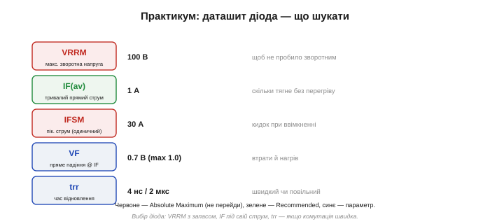
*Рис. 2.9.7.1. Ключові рядки даташита діода. Червоне — Absolute Maximum: VRRM (максимальна зворотна напруга) і IFSM (піковий струм). Зелене — Recommended: IF(av) (тривалий прямий струм). Синє — параметри: VF (пряме падіння й нагрів) і trr (швидкість). Кожен рядок прив'язаний до питання схеми.*

Розберімо рядки. **VRRM** *(max repetitive reverse voltage)* — абсолютний максимум: найбільша зворотна напруга, яку діод витримає, перш ніж пробитися. Беруть із запасом до напруги, що прикладається зворотно. **IF(av)** *(average forward current)* — рекомендований тривалий прямий струм: скільки діод проведе, не перегрівшись; має перекривати ваш робочий струм. **IFSM** *(surge current)* — піковий одиничний струм (абсолютний максимум) на короткий сплеск, важливий при ввімкненні, коли заряджаються конденсатори. **VF** *(forward voltage)* — пряме падіння при заданому струмі: воно визначає **втрати** й нагрів (потужність ≈ VF·IF), і його беруть із колонки max для теплового розрахунку. Нарешті **trr** *(reverse recovery time)* — час відновлення: чи встигає діод «зачинитися», коли струм міняє напрям; критичний у швидких перемикачах, байдужий у повільному випрямлячі мережі (50 Гц).

**Приклад (вибір діода).** Треба гасний (flyback) діод через котушку реле: робочий струм 0.2 А, напруга живлення 24 В, комутація рідка (вмикання-вимикання раз на секунди). Які рядки?

```
зворотна напруга:  на діод прикладається ~24 В → VRRM з запасом ≥ 2× → 100 В годиться
тривалий струм:    0.2 А → IF(av) = 1 А з величезним запасом, добре
швидкість trr:     комутація повільна → байдуже; підійде звичайний 1N400x
пряме падіння VF:  струм малий → нагрів VF·IF ≈ 1 В · 0.2 А = 0.2 Вт — дрібниця
```
Висновок: звичайний випрямний діод на 100 В / 1 А (класу 1N4007) тут із запасом. А якби це був швидкий перемикач на десятки кілогерц — рядок trr став би вирішальним, і знадобився б **швидкий** діод.

Зверніть увагу, як спрацював увесь набір навичок навіть на цьому найпростішому приладі. Ми відрізнили **абсолютний максимум** (VRRM, IFSM — священна межа з [§2.9.2](reading-datasheets.md)) від **робочого** параметра (IF(av)); узяли VF із гарантованої колонки для теплового розрахунку ([§2.9.3](reading-datasheets.md)); вирішили, що **умови** робочої частоти роблять trr неважливим саме тут. Той самий діод у швидкому імпульсному перетворювачі читався б зовсім інакше — там на чільне місце вийшли б і trr, і втрати на перемикання. Один документ, дві задачі — два різні прочитання: рівно те, чого ми навчилися в усьому розділі.

### Даташит MOSFET: на що дивитися

Польовий транзистор ([§2.7.5](../mosfet/mosfet.md), [§2.7.6](../mosfet/mosfet.md)) — складніший: тут є і силові межі, і параметри керування затвором, і теплова сторона.

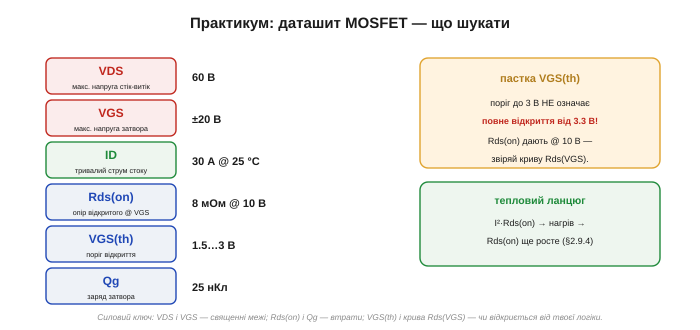
*Рис. 2.9.7.2. Ключові рядки даташита MOSFET. Абсолютні максимуми VDS і VGS (червоне). Тривалий струм ID (зелене). Параметри Rds(on), VGS(th), Qg (синє). Дві пастки: поріг VGS(th) не означає повного відкриття від тієї ж напруги, а Rds(on) дають для великого VGS — звіряй криву Rds(VGS) і тепловий ланцюг.*

Ключові рядки. **VDS** — абсолютний максимум напруги стік–витік: найбільша напруга, яку ключ блокує в закритому стані; беруть із запасом до напруги шини. **VGS** — абсолютний максимум напруги затвора (часто ±20 В): перевищиш — проб'ється тонкий ізолятор затвора. **ID** — тривалий струм стоку (з прив'язкою до температури — згадуємо derating з [§2.9.4](reading-datasheets.md)). **Rds(on)** — опір відкритого каналу: визначає втрати провідності (потужність I²·Rds(on)) і нагрів; дають його **за конкретного** VGS. **VGS(th)** — поріг відкриття. **Qg** — заряд затвора: скільки треба «влити» в затвор, щоб відкрити, — це визначає втрати на перемикання й потрібний драйвер ([§2.7.7](../mosfet/mosfet.md)).

Тут дві класичні пастки. Перша: **поріг VGS(th)** — це напруга, за якої канал **щойно починає** відкриватися (тече мізерний струм), а **не** напруга повного відкриття. Транзистор із порогом 3 В від 3.3 В логіки відкриється ледь-ледь, матиме величезний Rds(on) і згорить. Тому для керування логікою шукають **logic-level** транзистор і дивляться криву Rds(VGS) — чи відкривається він повністю від **вашої** напруги. Друга: **Rds(on)** майже завжди дають за великого VGS (10 В) і при 25 °C — а у вашій схемі і напруга затвора менша, і ключ гарячий, тож реальний опір помітно більший. Звідси й тепловий ланцюг: струм гріє ключ → гарячий Rds(on) росте → нагрів ще більший. Тому Rds(on) для розрахунку беруть для **своєї** напруги затвора й **гарячого** кристала, а не вітринне число.

Цей приклад зводить докупи майже всі навички розділу — гарантований край ([§2.9.3](reading-datasheets.md)), температурну криву ([§2.9.4](reading-datasheets.md)) і derating.

**Приклад (втрати на ключі, вітринне число проти чесного).** Ключ комутує струм 5 А. Даташит: Rds(on) = 8 мОм (typ, при VGS=10 В, 25 °C), а крива каже, що при 100 °C опір удвічі більший.

```
вітринне число (8 мОм, холодний):  P = I²·R = 5² · 0.008 = 0.20 Вт
чесне число (гарячий, ≈16 мОм):    P = 5² · 0.016 = 0.40 Вт  — удвічі більше!
```
Розрахувавши тепловиділення за «красивими» 8 мОм, ви вдвічі занизите нагрів — і недооціните, чи потрібен радіатор. А далі цю чесну потужність 0.4 Вт ще звіряють із derating-кривою ([§2.9.4](reading-datasheets.md)) для робочої температури: чи лишається запас. Видно, як одна тема живить іншу: гарантований край, температурна крива й derating працюють разом, а не поодинці.

### Даташит ОП: на що дивитися

Операційний підсилювач ([§2.8.9](../opamp-comparator/opamp-comparator.md)) — приклад, де критичний параметр найсильніше залежить від **застосування**: для тихого вимірювача важливе одне, для звукового тракту — геть інше.

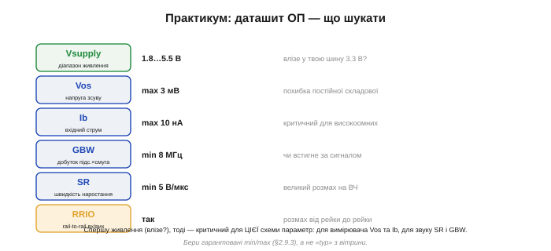
*Рис. 2.9.7.3. Ключові рядки даташита ОП. Спершу — діапазон живлення (чи влізе у твою шину). Тоді — критичний для ЦІЄЇ схеми параметр: для точного вимірювача Vos (зсув) та Ib (вхідний струм), для швидкого сигналу GBW (смуга) і SR (швидкість наростання). RRIO — чи дає розмах від рейки до рейки.*

Рядки. **Vsupply** — діапазон живлення: перше, що звіряють, — чи працює ОП від вашої шини (скажімо, 3.3 В). **Vos** *(offset voltage)* — напруга зсуву: паразитна постійна похибка на вході; критична для точних вимірювань, береться з колонки max. **Ib** *(input bias current)* — вхідний струм: важливий, коли джерело сигналу високоомне (кволий давач), бо цей струм створює похибку на великому опорі. **GBW** *(gain-bandwidth product)* — добуток підсилення на смугу: чи вистачить смуги на вашій частоті й підсиленні. **SR** *(slew rate)* — швидкість наростання: чи встигає вихід за швидким сигналом великого розмаху. **RRIO** *(rail-to-rail in/out)* — чи дає вихід розмах аж до самих рейок живлення (критично на низькій напрузі).

І головне в цьому даташиті — **який** рядок критичний, залежить від задачі. Для прецизійного підсилювача давача на перший план виходять **Vos** та **Ib** (бо вони псують точність постійного вимірювання), а смуга й швидкість другорядні. Для звукового чи відеотракту навпаки: вирішують **GBW** і **SR**, а мікровольти зсуву нікого не турбують. Тому однаковий даташит двоє інженерів читають по-різному — кожен дивиться на свій критичний рядок. І, звісно, всі ці числа беруть гарантованими (min/max з [§2.9.3](reading-datasheets.md)), а не з оптимістичної вітрини.

**Приклад (вибір ОП).** Треба підсилити сигнал термопари (десятки мікровольтів, джерело низькоомне, сигнал повільний) на платі з живленням 3.3 В. Які рядки вирішують?

```
живлення:    1.8…5.5 В → наші 3.3 В усередині, годиться
зсув Vos:    сигнал у мкВ → зсув КРИТИЧНИЙ; беремо max, шукаємо малий (десятки мкВ)
струм Ib:    джерело низькоомне → Ib другорядний
смуга GBW:   сигнал повільний → байдуже, вистачить будь-якого
розмах:      вихід близько до рейок? → бажано RRIO для повного діапазону 0…3.3 В
```
Висновок: тут вирішальний рядок — **Vos** (і його дрейф із температурою з графіка), а зовсім не смуга чи швидкість, на яких будувалася б вітрина «швидкісного» ОП. Узяти швидкий, але з великим зсувом — і вимірювач брехатиме на самому вході.

### Єдиний маршрут для будь-якого даташита

Помітьте, що для всіх трьох приладів ми йшли **тим самим** шляхом — мінявся лише критичний параметр на одному з кроків. Цей маршрут і є підсумок усього розділу.

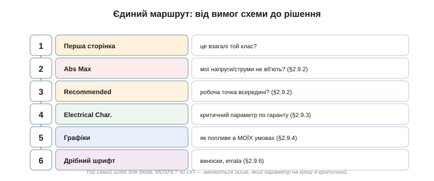
*Рис. 2.9.7.4. Один порядок для діода, MOSFET чи ОП: перша сторінка (це той клас?) → Absolute Maximum (не вб'ю?) → Recommended (робоча точка всередині?) → Electrical Characteristics (критичний параметр по гаранту) → графіки (як попливе в моїх умовах) → дрібний шрифт і errata. Змінюється лише, який параметр критичний на кроці 4.*

Маршрут такий. **Крок 1 — перша сторінка:** чи це взагалі потрібний клас приладу. **Крок 2 — Absolute Maximum ([§2.9.2](reading-datasheets.md)):** чи не вб'ють прилад мої напруги, струми, піки. **Крок 3 — Recommended Operating ([§2.9.2](reading-datasheets.md)):** чи лежить моя робоча точка всередині, ще й із запасом. **Крок 4 — Electrical Characteristics ([§2.9.3](reading-datasheets.md)):** знайти **критичний для моєї схеми** параметр і взяти його гарантований край. **Крок 5 — графіки ([§2.9.4](reading-datasheets.md)):** подивитися, як цей параметр попливе в **моїх** умовах (температура, напруга). **Крок 6 — дрібний шрифт і errata ([§2.9.6](reading-datasheets.md)):** виноски, умови тестів, відомі баги. Шість кроків — і компонент перевірений з усіх боків. (Повний чеклист вибору компонента від вимог схеми до параметричного пошуку — окрема алгоритмічна вставка до цієї теми.)

> 🔧 **Навіщо це.** Практикум зводить усю навичку в один рефлекс. **Перше:** починай не з даташита, а з питання — що критично саме **моїй** схемі (для діода це може бути trr, для MOSFET — VGS(th), для ОП — Vos чи SR). **Друге:** іди єдиним маршрутом — клас, межі, робоча точка, критичний параметр по гаранту, графік під свої умови, дрібний шрифт. **Третє:** той самий документ двоє інженерів читають по-різному, бо дивляться на різні рядки під різні задачі. Хто опанував цей маршрут, той бере правильний компонент із першого разу — і не спалює, не дивується й не ремонтує в полі.

### Підсумок розділу

Ми пройшли весь шлях читання даташита: від карти документа й трьох його голосів — через священні межі, трійцю min/typ/max, графіки, корпус і дрібний шрифт — до цілісного маршруту вибору компонента. Тепер «паспорт» будь-якого приладу — від простого діода до товстого мікроконтролера — не лякає товщиною: ви знаєте, де що лежить, чому вірити й на що дивитися саме під свою задачу. Це вміння — місток між **цеглинками** аналогової електроніки, які ми зібрали в усьому Модулі 2, і реальними схемами, де кожна цеглинка має свій паспорт. Далі курс рушає до нового класу компонентів — тих, що задають системі **час** і **частоту**.

> ▶️ Далі: [Розділ 2.10 — Резонатори й опорні частоти](../resonators-references/resonators-references.md)
