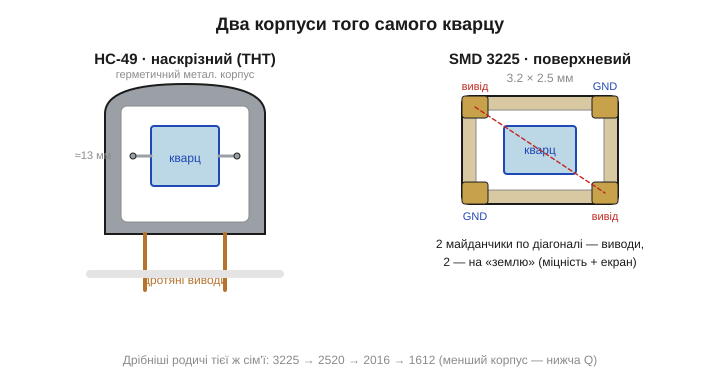
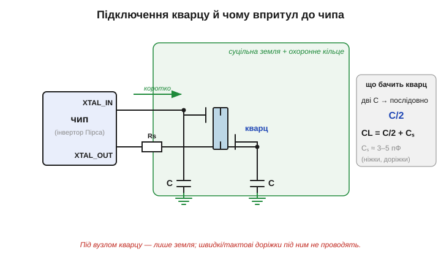

# 🔌 Кварц на платі: корпуси HC-49 і SMD 3225, навантажувальні C, чому впритул до чипа

> Це компонентна вставка до теми [2.10.5 «Схема генератора: кварц + інвертор + два конденсатори»](resonators-references.md). Тема показала схему генератора Пірса і ввела навантажувальну ємність **CL**, якою підстроюють частоту. Тут дивимося на кварц як на **деталь, яку треба покласти на плату**: який у нього корпус, як рахують ці два конденсатори з паразитних ємностей і чому весь вузол тримають **упритул до чипа** короткими доріжками.

### Клас компонента

На платі це двовивідна пасивна деталь поряд із мікроконтролером або радіочипом, біля якої майже завжди стоять **два однакові маленькі конденсатори**. Усередині — пластинка кварцу, що механічно резонує на сталій частоті з добротністю в десятки тисяч ([§2.10.3](resonators-references.md)); сам кварц нічого не генерує, його розгойдує підсилювач у чипі за схемою Пірса ([§2.10.5](resonators-references.md)). Зовні кварц виглядає як один із двох канонічних корпусів (Рис. 2.10.5c.1).

**HC-49** (*HC-49/U*, висока версія, і **HC-49/US**, низькопрофільна) — класичний металевий герметичний «бочонок» овального перерізу з двома дротяними ніжками під отвори (*through-hole*, THT). Усередині — кварцова пластинка на двох пружних тримачах; корпус заповнений інертним газом і запаяний. Це **наскрізний монтаж**: довговічно, ремонтопридатно, видно, що це за деталь.

**SMD 3225** — поверхневий керамічний корпус 3.2×2.5 мм із чотирма контактними майданчиками (*surface-mount*, SMD; цифри в назві — габарити в десятих міліметра). З чотирьох майданчиків працюють лише **два по діагоналі** — це власне виводи кварцу; інші два глухі, припаяні до «землі» лише для механічної міцності та екранування. Поряд із 3225 живуть дрібніші родичі тієї самої сім'ї — **2520** (2.5×2.0 мм), **2016**, **1612** — що дрібніший корпус, то менша кварцова пластинка, нижча добротність і тим точніше доводиться рахувати навантажувальні C.


*Рис. 2.10.5c.1. Зліва — HC-49: герметичний металевий бочонок із двома дротяними ніжками, пластинка кварцу на пружних тримачах усередині. Справа — SMD 3225: керамічна ванночка 3.2×2.5 мм, накрита металевою кришкою; з чотирьох майданчиків два по діагоналі — виводи, два — «земля» для міцності й екрану. Металева кришка обох корпусів зазвичай з'єднується із землею.*

### Розпіновка і підключення

Хоч корпуси різні, схема підключення в них спільна, бо сам кварц улаштований однаково. Він симетричний: у нього **немає полярності**, виводи рівноправні, тож «переплутати» їх неможливо — байдуже, яким боком ставити. Підключення завжди те саме (Рис. 2.10.5c.2): один вивід — на ніжку чипа **XTAL_IN** (інші назви — *XI*, *XTAL1*, вхід інвертора), другий — на **XTAL_OUT** (*XO*, *XTAL2*, вихід інвертора через резистор). Від **кожного** виводу — навантажувальний конденсатор на землю. Якщо корпус має заземлені майданчики чи металеву кришку — їх теж з'єднують із «землею».

Саме ці два конденсатори й заслуговують на окрему увагу — вони не формальність і не «згладжування живлення». Кварц видає рівно свою номінальну частоту лише тоді, коли «бачить» на своїх виводах задану виробником **навантажувальну ємність** (*load capacitance*, **CL**) — типово 8, 12, 18 або 20 пФ. Цю CL і формують двома конденсаторами. Поставив іншу ємність — резонанс трохи з'їде: для блимання світлодіодом байдуже, а для точного відліку часу чи послідовного зв'язку — вже ні (про ціну такого зсуву в ppm — [§2.10.6](resonators-references.md)).


*Рис. 2.10.5c.2. Кварц між XTAL_IN і XTAL_OUT; від кожного виводу — навантажувальний конденсатор C на землю. Дві ємності з'єднані по змінному струму через землю, тож для кварцу вони стоять послідовно: C/2. CL = C/2 + Cₛ, де Cₛ — паразитна ємність ніжок і доріжок (~3–5 пФ). Весь вузол — упритул до чипа, оточений суцільним полігоном землі; чутливі доріжки під ним не проводять.*

### Скільки ставити: рахуємо C з CL

Лишається головне питання: якої ж ємності брати ці два конденсатори, щоб кварц «побачив» свою CL? Тут важливо, як вони увімкнені. Обидва з'єднані одним кінцем із виводами кварцу, а другим — із землею; для сигналу, що йде «крізь» кварц, вони опиняються **послідовно**, тобто разом дають C/2 ([послідовне з'єднання конденсаторів — §2.1.7](../capacitor/capacitor.md)). До цього додається неминуча паразитна ємність — ніжок чипа, контактних майданчиків і доріжок, — яку позначають **Cₛ** (*stray capacitance*, типово 3–5 пФ). Звідси робоча формула:

```
CL = C/2 + Cₛ
```

де C — ємність кожного з двох однакових конденсаторів. Розв'язуємо відносно C:

```
C = 2·(CL − Cₛ)
```

**Приклад (підбираємо конденсатори).** Кварц 16 МГц із даташита: CL = 18 пФ. Паразитну ємність оцінюємо в Cₛ ≈ 4 пФ. Тоді:

```
C = 2·(18 − 4) пФ = 2·14 пФ = 28 пФ
```

Найближчий стандартний ряд — **27 пФ**, його й ставимо в обидва плеча. Якщо Cₛ оцінити надто грубо, частота піде на одиниці ppm; для радіо це доводять ще й експериментально, але для більшості цифрових задач формули достатньо. Конденсатори беруть **термостабільні** (клас C0G/NP0 — [§2.1.5](../capacitor/capacitor.md)): якщо їхня ємність попливе з температурою, попливе й частота.

> 🔧 **Навіщо це.** Той самий кварц «16.000 МГц» на двох платах із різними навантажувальними C дасть дві трохи різні частоти. Тому даташит кварцу завжди вказує CL, під яку він відкалібрований, а розробник плати добирає C саме під цей кварц — а не «27 пФ, бо так у всіх».

### Чому впритул до чипа

Самих правильних номіналів, проте, мало: де саме покласти кварц і конденсатори на платі, важить не менше за їхню ємність. Головне правило компонування кварцового вузла: **кварц і обидва конденсатори — якнайближче до ніжок чипа, найкоротшими доріжками, над суцільною землею**. Причин три, і всі ростуть із самої природи резонатора.

По-перше, **паразитна ємність доріжок входить у CL**. Кожен сантиметр доріжки додає ємність на землю й на сусідні провідники; що довша доріжка, то більша й непевніша Cₛ — і то сильніше «попливе» частота від розрахункової. Короткі доріжки роблять Cₛ малою й передбачуваною.

По-друге, **вузол кварцу і вразливий до завад, і сам їх випромінює**. Вивід XTAL_IN — це вхід підсилювача з величезним коефіцієнтом, і будь-яке наведення на нього (від силового дроселя, тактових ліній, антени) підмішується в опорну частоту як джиттер. А XTAL_OUT, навпаки, активно «дзвонить» і може наводити завади на сусідні кола. Тому під вузлом викладають суцільний полігон землі (*ground plane*), а часто й охоронне кільце (*guard ring*) землі довкола обох доріжок — це і зворотний шлях для струмів, і екран.

По-третє, **під кварцовими доріжками не проводять нічого швидкого**. Тактова лінія, лінія даних чи живлення, що йде під вузлом кварцу, наведеться на нього ємнісно; тому ділянку під кварцом лишають «глухою» — там тільки земля.

### Перший «байт»: як зрозуміти, що кварц завівся

У кварцу немає «першого байта» в прямому сенсі — він пасивний. Але є проста перевірка, що генератор стартував: подивитися щупом осцилографа на вивід **XTAL_OUT** (не XTAL_IN — туди ємність щупа збиває коливання). На вихідному виводі видно синусоїду номінальної частоти амплітудою близько живлення; щуп ×10 ([§2.4.1c](../frequency-response/comp-scope-probe.md)) трохи її притлумить, але сам факт коливань підтвердить. Якщо синусоїди немає або вона нестабільна — генератор не завівся (типові причини нижче). Точнішу частоту все одно міряють не на цьому виводі, а на тактовому виході чипа, щоб не вантажити сам резонатор.

### Типові граблі

- **Навантажувальні C «на око».** Найчастіша причина дрейфу частоти: поставили 22 пФ, бо «звично», коли кварцу треба було 8 пФ. Завжди читаємо CL у даташиті й рахуємо C за формулою.
- **Кварц задалеко від чипа.** Довгі доріжки роздувають Cₛ, додають джиттер і завади. Тримаємо вузол упритул, доріжки — міліметри, не сантиметри.
- **Немає суцільної землі під вузлом.** Розрив полігона землі під кварцом перетворює короткі доріжки на маленьку антену.
- **Швидка лінія під кварцом.** Тактова чи SPI-доріжка під вузлом наводить завади на опорну частоту — а на схемі все «правильно».
- **Звичайні керамічні C замість C0G.** Дешевий клас (X7R, а тим паче Y5V — [§2.1.5](../capacitor/capacitor.md)) втрачає ємність із температурою й напругою, тягнучи за собою частоту.
- **Перегрів при пайці.** Кварц боїться тривалого жару, особливо мініатюрні SMD і камертонні — пластинку може «розстроїти» (детальніше для годинникового кварцу — [§2.10.7c](resonators-references.md)).
- **Перевантажений резонатор.** Завелика потужність розгойдування (*drive level*) старить кварц і збиває частоту; послідовний резистор на XTAL_OUT саме її й обмежує.

### Варіації класу

Уникнувши цих пасток, лишається обрати корпус під свою плату — а вибір тут широкий. Корпуси кварцу — це драбина від великого THT до крихітного SMD: **HC-49/U** (високий) і **HC-49/US** (низький) для наскрізного монтажу; **SMD 3225 → 2520 → 2016 → 1612** для поверхневого. Що дрібніший корпус, то нижча добротність і чутливіша частота до навантажувальних C. Окремо стоять корпуси під камертонний годинниковий кварц 32.768 кГц — крихітний циліндрик або плаский SMD ([§2.10.7](resonators-references.md)). А коли потрібен не пасивний резонатор, а готова частота «з коробки» — ставлять **тактовий генератор** (*oscillator*) у схожому SMD-корпусі, але вже з чотирма робочими виводами (живлення, земля, вихід, дозвіл): усередині той самий кварц плюс схема Пірса, тож навантажувальні C і компонування вже не клопіт розробника плати. Про термокомпенсовані (TCXO) і MEMS-варіанти — [§2.10.8](resonators-references.md) і [§2.10.9](resonators-references.md).

> ▶️ Повернутися до теми: [§2.10.5 — Схема генератора: кварц + інвертор + два конденсатори](resonators-references.md)
