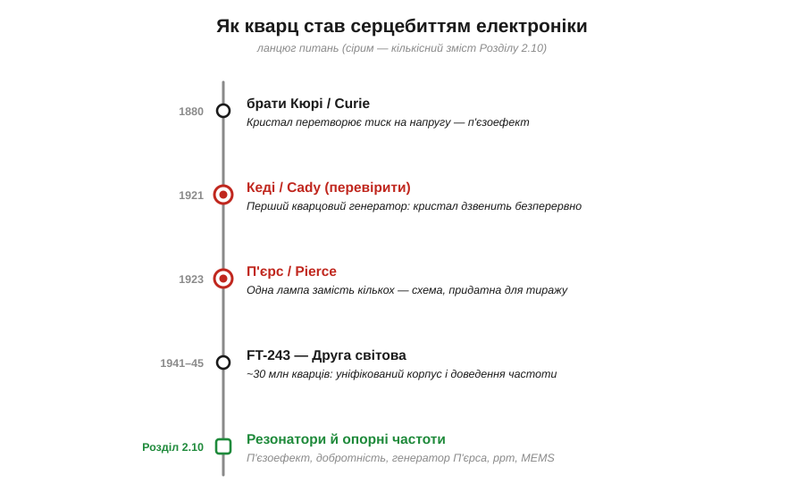
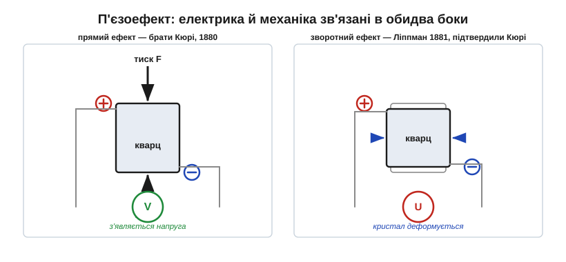
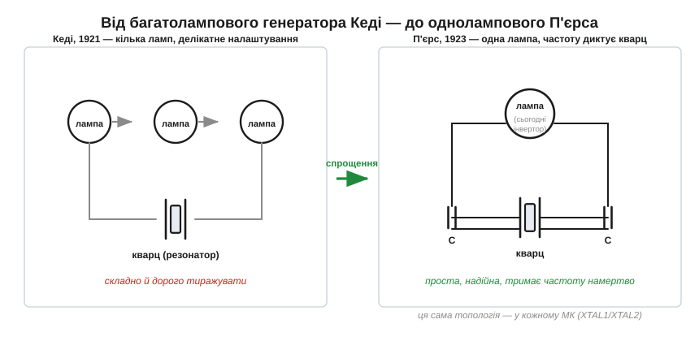
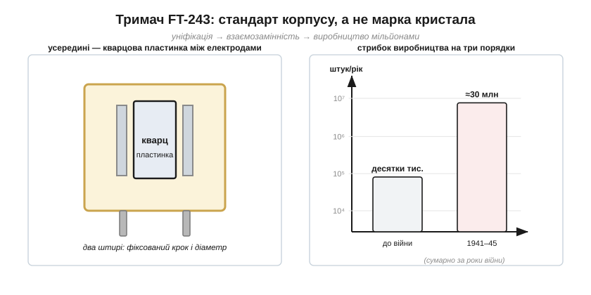

# 📜 Історія до Розділу 2.10 — як кварц став серцебиттям електроніки: від Кюрі до FT-243

> Це історична вставка до [Розділу 2.10 «Резонатори й опорні частоти»](resonators-references.md). Майже в кожному пристрої, який ми вивчаємо, цокає крихітна сріблиста пластинка кварцу: вона тактує процесор, відлічує секунди, тримає швидкість зв'язку рівно настільки точно, щоб два чипи розуміли один одного. Ця вставка веде ланцюгом питань до того, **звідки** взялося це серцебиття: чому кристал узагалі вміє «дзвеніти» напругою, хто перетворив це диво на робочу схему — і чому під час Другої світової війни мільйони однакових кварців у латунних коробочках із загадковою позначкою **FT-243** раптом стали стратегічним ресурсом, не менш важливим за пальне.

У [Розділі 2.3](../reactance-resonance/reactance-resonance.md) ми бачили, як котушка з конденсатором утворюють «електричний маятник» — коливальний контур із власною частотою. Та в нього є вада: його нота **пливе**. Нагрівся — змінилася ємність, частота поповзла; струснули плату — теж. Добротність Q такого контуру ([§2.3.6](../reactance-resonance/reactance-resonance.md)) рідко переростає сотню. А інженерам кінця 1910-х відчайдушно бракувало джерела частоти, яке трималося б **намертво**: радіостанції розповзалися ефіром, а перші спроби рахувати час електрикою плавали гірше за маятниковий годинник. Розв'язок прийшов із несподіваного боку — від шматочка гірського кришталю.

*Рис. 2.10.0.1. Кожен щабель — нове питання. Чому кристал відгукується на напругу деформацією? (брати Кюрі, 1880) → Чи можна змусити його дзвеніти безперервно? (Кеді, 1921) → Як зробити схему простою й надійною? (П'єрс, 1923) → Що сталося, коли знадобилися мільйони таких кварців одразу? (FT-243, 1941–1945). Сірим — те, що стане кількісним змістом Розділу 2.10.*

---

## Кристал, що відчуває напругу: брати Кюрі

Почнімо з найдивовижнішого факту, без якого нема нічого далі: деякі кристали **перетворюють механічний тиск на електрику** — і навпаки. Стисни такий кристал — на його гранях з'являється напруга; прикладеш напругу — він трохи деформується. Це **п'єзоефект** (*piezoelectric effect*, від грецького *piezein* — «тиснути»), і саме на ньому тримається все, про що піде мова.

Відкрили його **1880 року** двоє французів — **брати** **Жак** і **П'єр Кюрі** (*Jacques & Pierre Curie*), тоді зовсім молоді (П'єрові — двадцять один, Жакові — двадцять п'ять). Це варто наголосити, бо П'єра Кюрі світ запам'ятав передусім за пізніші роботи з радіоактивності разом із дружиною Марією, — а п'єзоефект був їхнім спільним **братнім** відкриттям, задовго до того. Експеримент був гранично простий: вони брали спеціально вирізані пластинки турмаліну, кварцу, топазу, тростинного цукру й сегнетової солі, обклеювали їх олов'яною фольгою й дротом — і вимірювали заряд, що з'являвся, коли кристал стискали. Жодних складних приладів: фольга, клей, дріт і ювелірна пилка. А заряд був — і точно пропорційний силі.

Тут одразу впадає в око, що відкриття було **колективним** і обережним за духом. Кюрі знайшли лише **прямий** ефект (тиск → заряд). А ось протилежне — що напруга має деформувати кристал — першим **передбачив теоретично**, з міркувань термодинаміки, **Ґабріель Ліппман** (*Gabriel Lippmann*) **1881 року**; і вже тоді брати Кюрі поставили дослід і **підтвердили** цей **зворотний** п'єзоефект (*converse piezoelectric effect*) того ж року. Тобто навіть тут не один герой, а ланцюжок: експеримент → теоретичне передбачення → експериментальне підтвердження. Для нас обидва ефекти однаково важливі, бо генератор частоти користується ними **обома** заразом, як ми зараз побачимо.

*Рис. 2.10.0.2. Ліворуч — прямий ефект (брати Кюрі, 1880): стиснення породжує напругу на гранях. Праворуч — зворотний (передбачив Ліппман 1881-го, підтвердили Кюрі того ж року): прикладена напруга деформує кристал. Кварцовий резонатор живе на тому, що ці два явища — два боки однієї медалі: коливання напруги розгойдує механічну деформацію, а та повертає напругу назад.*

> 🔧 **Навіщо це.** Запам'ятаймо ключову петлю, бо на ній стоятиме весь Розділ 2.10: у кварцу **електрика й механіка зв'язані в обидва боки**. Подаси змінну напругу — кристал почне механічно вібрувати (зворотний ефект); а вібруючи, він сам наводить на електродах напругу (прямий ефект). Виходить замкнене коло «напруга → деформація → напруга», у якому коливання можуть **самопідтримуватися**. Саме ця двобічність робить кварц не просто датчиком тиску, а серцем генератора частоти.

---

## Чому саме кварц тримає ноту так чисто

Перш ніж рухатися далі, варто відповісти на природне питання: добре, кристал відчуває напругу — але навіщо це для **частоти**? Хіба мало в нас уже коливальних контурів?

Річ у тім, що кварцова пластинка — це насамперед чудовий **механічний резонатор**. Як камертон чи дзвін, вона має власну частоту пружних коливань, на якій охоче «дзвенить». Але є вирішальна різниця проти LC-контуру з [§2.3.5](../reactance-resonance/reactance-resonance.md). Електричні втрати в металі котушки великі: коло швидко «програє» енергію на тепло, і дзвін згасає за десятки коливань. А чистий кварц майже не має внутрішнього тертя — він пружний майже ідеально. Його добротність Q сягає **десятків і сотень тисяч**, тоді як у доброго LC-контуру — від сили кількасот. Це не кількісна, а **якісна** прірва: кварц дзвенить так довго й так гостро, що його нота стає еталоном.

А оскільки частота цих коливань задана здебільшого **розміром і способом вирізки** кристала — а не примхливими ємностями й індуктивностями, що пливуть від тепла, — кварц тримає свою частоту куди стабільніше за будь-яке коло з котушки й конденсатора. Вирізав пластинку потрібної товщини — отримав потрібну частоту, і вона майже не залежить від того, що коїться навколо. Як саме малий розмір дає високу частоту й чому певні кути вирізки роблять кварц байдужим до температури — це вже кількісний зміст самого розділу ([§2.10.3](resonators-references.md) і далі); тут нам досить висновку: **природа дала готовий резонатор фантастичної якості, лишалося навчитися ним користуватися.**

---

## Волтер Кеді змушує кристал дзвеніти безперервно

Сорок років п'єзоефект лишався науковою цікавинкою та інструментом лабораторій (зокрема, на ньому Кюрі робили дуже точні п'єзоелектричні ваги для зарядів). Перший великий практичний поштовх дала **Перша світова війна** і полювання на підводні човни: француз **Поль Ланжевен** (*Paul Langevin*) збудував із кварцу гідроакустичний випромінювач — прадіда сонара (цю гілку історії докладніше розгорнемо в [§5.2](../../block-5-sensors-control/distance-environment/distance-environment.md), там, де йтиметься про ультразвукові давачі). Кварц навчилися змушувати **гучно вібрувати** від електрики. Лишався крок: не просто змусити його гудіти, а зробити з нього **стабільне джерело частоти**.

Цей крок зробив американець **Волтер Ґайтон Кеді** (*Walter Guyton Cady*), фізик із Веслійського університету (*Wesleyan University*). **1921 року** — дату варто **перевіряти** обережно, бо в джерелах фігурують і 1921-й (доповідь і перші досліди), і 1922–1923-й (зрілі схеми та патенти), — Кеді створив **перший кварцовий генератор** і, що не менш важливо, ввів саме поняття **п'єзоелектричного резонатора** як еталона частоти. 26 лютого 1921 року він доповів Американському фізичному товариству, що кварцову пластинку можна використати як **стандарт частоти** й навіть як вибірковий зв'язок між колами; два фундаментальні патенти на резонатори та їхнє застосування в радіо він отримав 1923-го.

Ідея Кеді була смілива: увімкнути кварц у схему з підсилювальними лампами так, щоб петля «напруга → деформація → напруга» (та сама, з рис. 2.10.0.2) **сама себе підживлювала**. Лампа компенсує крихітні втрати кристала — і той дзвенить **безперервно**, а не згасає. Народився **кварцовий генератор** (*crystal oscillator*): джерело коливань, чию частоту тримає не котушка з конденсатором, а механічний резонанс кристала. Уперше в історії люди отримали електричну частоту, прив'язану до незмінного шматочка матерії.

> 🔧 **Навіщо це.** Це і є той самий принцип, на якому стоїть генератор у кожному сучасному чипі: активний елемент (у Кеді — лампа, сьогодні — логічний інвертор) лише **підкидає енергію**, щоб компенсувати втрати, а **частоту диктує кварц**. Інженер не «налаштовує» цю частоту — він її **успадковує** від кристала. Як саме мінімальна сучасна схема (інвертор + два конденсатори + кварц) робить те саме, що ламповий генератор Кеді, ми розберемо у [§2.10.5](resonators-references.md).

---

## Джордж П'єрс: схема, яку можна повторити мільйон разів

Винахід Кеді був проривом, але мав практичну ваду: його генератор потребував **кількох ламп** і делікатного налаштування. Для лабораторії — годиться; для масового приладу — задорого й надто примхливо. Бракувало схеми **простої й невибагливої**, яку можна було б тиражувати.

Її дав інший американець — **Джордж Вашингтон П'єрс** (*George Washington Pierce*), професор фізики **Гарвардського університету**, дослідник коливань і акустики. **1923 року** (патент видано пізніше, протягом 1920-х) він узяв уже відомий ламповий генератор Колпітса й зробив, на перший погляд, дрібну заміну: **викинув котушку контуру й поставив на її місце кварц**. Ефект був разючий. По-перше, схема стиснулася до **однієї лампи** замість кількох — її стало легко й дешево повторювати. По-друге, кварц зі своєю величезною добротністю зробив частоту незрівнянно стабільнішою, ніж будь-яка котушка. Так народилася **схема П'єрса** (*Pierce oscillator*).

*Рис. 2.10.0.3. Суть внеску П'єрса (1923): у звичному ламповому генераторі він замінив котушку коливального контуру на кварцовий резонатор. Кристал відіграє роль індуктивності, але з добротністю в тисячі разів вищою. Схема стиснулася до однієї лампи, а частота стала триматися намертво. Та сама топологія — лише з логічним інвертором замість лампи — живе сьогодні в кожному мікроконтролері.*

Внесок П'єрса варто бачити точно, без міфу про «єдиного винахідника». **Фізику** кварцового генератора відкрив Кеді — і саме його патенти були піонерськими. П'єрс не винайшов кварцовий генератор з нуля; він **спростив і вдосконалив** уже наявну ідею до форми, придатної для масового життя. Між Кеді та П'єрсом, до речі, точилися й патентні суперечки про пріоритет — звична річ на зорі будь-якої технології ([з історією радіо в §2.3 ми вже бачили схожі патентні війни Лоджа, Марконі й Тесли](../reactance-resonance/hist-tuned-circuit.md)). Підсумок справедливий такий: **Кеді зробив кварц можливим, П'єрс зробив його практичним.** І саме схема П'єрса виявилася настільки вдалою, що, по суті, не змінилася за сто років.

> 🔧 **Навіщо це.** Коли в [§2.10.5](resonators-references.md) ви побачите типову обв'язку кварцу біля мікроконтролера — кристал і два маленькі конденсатори по боках — знайте: це і є генератор П'єрса 1923 року, тільки лампу замінили мільйони транзисторів усередині логічного інвертора. Ось чому два виводи чипа звуться XTAL1/XTAL2 (від *crystal*), а схему включення кварцу ви впізнаєте в даташиті будь-якого МК з першого погляду.

---

## Кварц іде у війну: латунна коробочка FT-243

Поки тривали 1920-ті й 1930-ті, кварцові генератори тихо завойовували радіотехніку: вони задавали частоту передавачів, тримали радіостанції на відведених їм каналах. А **1927 року** в Bell Labs канадець **Воррен Маррісон** (*Warren Marrison*) разом із **Джозефом Гортоном** (*J. W. Horton*) збудував із кварцу ще й **перший кварцовий годинник** — джерело вже не радіочастоти, а **точного часу**. Цю гілку — як кварц переміг маятник і став відлічувати секунди — ми докладно розгортаємо далі в курсі, у розділі про таймери ([§4.6](../../block-4-mcu-esp32/timers/timers.md)); тут лиш зазначимо, що до 1940-х кварц уже вмів і тактувати радіо, і рахувати час.

А потім настала **Друга світова війна** — і саме вона перетворила кварц із цінного компонента на **масовий стратегічний ресурс**. Війна вимагала радіозв'язку **скрізь**: у кожному танку, літаку, кораблі, у похідній рації піхоти. А щоб сотні передавачів і приймачів на полі бою не глушили один одного, кожному потрібна була **точно задана, стабільна частота** — тобто кварц. Раптом знадобилися не сотні кристалів, а **мільйони**.

Тут на сцену й виходить позначка, винесена в назву. **FT-243** — це не марка кристала, а стандарт **тримача** (*holder*): маленької коробочки з двома штирьковими виводами, у якій сидить кварцова пластинка. Стандарт задавав розмір корпусу, відстань і діаметр штирів, габарит самого кристала — щоб будь-який кварц у такому тримачі підходив до будь-якого гнізда в апаратурі. Це була та сама ідея взаємозамінності, що й у набоях: уніфікуй корпус — і виробництво можна розкидати по сотні заводів. FT-243 (поряд із спорідненим FT-241) став **робочою конячкою** американського військового радіо.

*Рис. 2.10.0.4. Тримач FT-243 — стандарт корпусу, а не марка кристала. Усередині — тонка кварцова пластинка між двома електродами; назовні — два штирі фіксованого розміру й кроку, щоб кварц був взаємозамінним між апаратами. Уніфікація корпусу дозволила тиражувати кварц мільйонами на десятках заводів — те, чого ніколи не потребувала довоєнна радіотехніка.*

Масштаб вражає. До війни вся річна потреба США в кварцах вимірювалася **десятками тисяч**. За роки війни (приблизно 1941–1945) промисловість випустила, за оцінками, близько **30 мільйонів** кварцових елементів — переважна частина припала на 1943–1944 роки. Це був стрибок на **три порядки**: галузь, що робила тисячі штук уручну, мусила за лічені місяці навчитися робити їх десятками мільйонів.

---

## Дві проблеми мільйонів: бразильський кришталь і точна частота

Здавалося б — постав більше верстатів, та й по всьому. Але масовість оголила дві серйозні проблеми, повз які важко пройти, бо вони чудово показують, **чим** кварц складніший за звичайний радіодеталь.

Перша — **сировина**. Для електроніки годиться лише кварц **бездоганної чистоти й правильної кристалічної будови**; синтетичного тоді ще не робили в потрібних кількостях, тож брали **природний** гірський кришталь. А практично єдиним джерелом такого кварцу електронного класу виявилася **Бразилія**. Постачання бразильського кришталю через Атлантику, де нишпорили підводні човни, стало окремою стратегічною турботою союзників — кристали везли поряд із каучуком і рудами як критичний військовий вантаж.

Друга — **точність частоти**. Частота кварцу задана товщиною пластинки, а потрібно було влучати в номінал **дуже точно**. Заводи давали заготовки з невеликим розкидом, тож виник цілий промисел **доведення кварцу вручну**: пластинку обережно **підшліфовували**, раз за разом перевіряючи її частоту, поки та не сяде на потрібне значення (стерти трохи кварцу — частота підросте). У США під час війни цим займалися навіть невеликі майстерні й приватні умільці — їм розсилали «сирі» кристали, а вони доводили їх до номіналу. Виник навіть кустарний ринок: радіоаматори вміли **переробляти** наявний FT-243 на сусідню частоту, підшліфовуючи кристал самотужки. Так абстрактна фізика п'єзоефекту обернулася на цілком земну роботу напилком під контролем частотоміра.

> 🔧 **Навіщо це.** Дві воєнні проблеми нікуди не зникли — вони лише змінили обличчя, і ми зустрінемо їх у самому розділі. «Точне влучання в номінал» сьогодні розв'язують не напилком, а **навантажувальною ємністю** й параметром у **ppm** ([§2.10.5](resonators-references.md) і [§2.10.6](resonators-references.md)): частоту кварцу трохи «підтягують» зовнішніми конденсаторами. А боротьба за бездоганний кристал виросла у вибір між дешевим кварцом, керамічним резонатором і сучасним MEMS-генератором ([§2.10.8](resonators-references.md)) — кожен зі своїм компромісом точності, ціни й живучості.

---

## Що з цього лишилось у кожному вашому пристрої

Озирнімося на пройдений ланцюг — і побачимо, що майже все, чим оперуватиме Розділ 2.10, виросло саме з цих чотирьох кроків:

- **п'єзоефект** (брати Кюрі, 1880; зворотний — передбачив Ліппман, підтвердили Кюрі) — двобічний зв'язок електрики й механіки, на якому стоїть будь-який кварцовий резонатор ([§2.10.2](resonators-references.md));
- **кварцовий резонатор** із його позахмарною добротністю — причина, чому кварц тримає ноту незрівнянно краще за LC-контур із [§2.3.6](../reactance-resonance/reactance-resonance.md) ([§2.10.3](resonators-references.md));
- **кварцовий генератор** (Кеді, 1921 — *перевірити*; зробив можливим) і **схема П'єрса** (1923 — зробила практичною) — топологія «активний елемент підживлює, кварц диктує частоту», що дожила до кожного мікроконтролера ([§2.10.5](resonators-references.md));
- **масовість і точність** — уроки FT-243: уніфікований корпус, точне влучання в номінал і вибір сировини, що сьогодні звучать як навантажувальна ємність, ppm і вибір типу резонатора ([§2.10.6](resonators-references.md), [§2.10.8](resonators-references.md)).

А головне, що варто винести наперед: кварц переміг не тому, що був складніший чи «розумніший» за коливальний контур, а тому, що **природа дала в ньому готовий механічний резонатор фантастичної якості**, який тримає частоту майже незалежно від схеми навколо. Інженеру лишилося навчитися його будити (генератор), трохи підправляти (навантажувальна ємність) і чесно вказувати, наскільки він пливе (ppm). Саме з цього — навіщо системі взагалі потрібне таке тверде джерело частоти й чому простого RC-генератора для цього замало — і починається Розділ 2.10.

> ▶️ Далі: [§2.10.1 Навіщо системі опорна частота](resonators-references.md)

---

### Пов'язані матеріали
- [Реактивність, фази й резонанс](../reactance-resonance/reactance-resonance.md) *(Розділ 2.3 — LC-контур, добротність Q, власна частота)*
- [Налаштований контур: як навчилися «ловити» одну частоту](../reactance-resonance/hist-tuned-circuit.md) *(історія до §2.3 — патентні війни раннього радіо)*
- Таймери й кварцовий годинник Маррісона *(§4.6 — як кварц став відлічувати час)*
