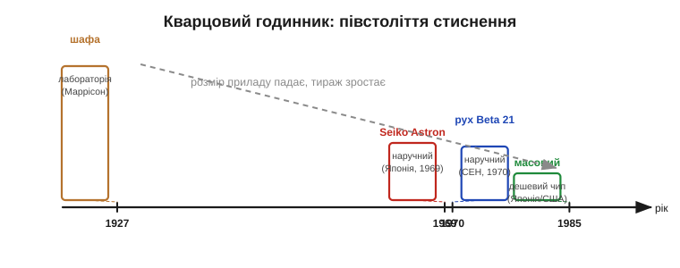
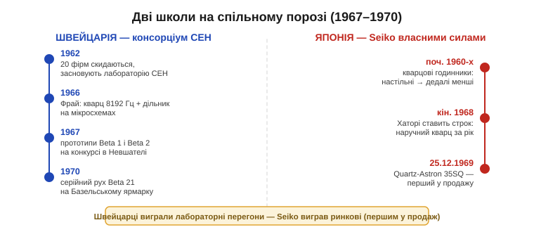
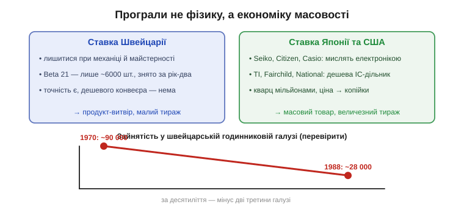

# 📜 Історія до §2.10.7 — Кварцова криза: як годинниковий кристал перевернув цілу галузь

> Це історична вставка до [§2.10.7 «Годинниковий кварц 32768 Гц і RTC»](resonators-references.md). Уся та тема — про крихітний камертонний кристал у циліндрику, що тремтить рівно 32768 разів на секунду й веде відлік часу майже в кожному годиннику й мікроконтролері. Але за цим непримітним кварцем стоїть одна з найдраматичніших історій техніки XX століття: за якихось десять років він знищив дві третини швейцарської годинникової промисловості — індустрії, що панувала у світі понад двісті років. І найповчальніше тут — **чому** так сталося. Швейцарці не проґавили ідею кварцу; вони самі зробили один із перших кварцових наручних годинників. Вони програли в іншому — у **масовості**.

Фізику п'єзоефекту й перший кварцовий годинник ми вже розглянули в [історії до Розділу 4.6](../../block-4-mcu-esp32/timers/hist-quartz.md): як брати Кюрі відкрили, що стиснутий кристал породжує напругу, і як Воррен Маррісон *(Warren Marrison)* у 1927 році зібрав у Bell Labs перший кварцовий годинник — шафу заввишки в людину. Тут історія інша. Тут кварц виходить із лабораторії на зап'ясток — і стає зброєю в економічній війні, яку згодом назвуть **кварцовою кризою** (*Quartz Crisis*; на Заході й у Японії — радше «кварцова революція», *Quartz Revolution*).


*Рис. 2.10.7і.1. Від шафи Маррісона (1927) до годинника на руці — півстоліття стиснення. Лабораторний кварц 1927-го займав кімнату; до 1969-го його втиснули в наручний корпус одночасно в Японії (Seiko Astron) і Швейцарії (консорціум CEH, рух Beta). А далі вирішила не фізика, а ціна: японські й американські фірми навчилися робити кварц мільйонами — і за десятиліття перекроїли всю галузь.*

---

## Чому маятник і пружина мусили відступити

Щоб зрозуміти масштаб перевороту, варто згадати, з чим змагався кварц. Механічний годинник — диво інженерії: коліщата, спіральна пружина, балансир, що хитається туди-сюди десь п'ять-вісім разів на секунду. Найкращі швейцарські хронометри тих часів трималися в межах кількох секунд на добу — і це після століть шліфування майстерності. Та межа була принципова: балансир — це той самий маятник, лише згорнутий у пружину, а отже, він **повільний** і **чутливий** до всього: до температури, до положення руки, до старіння мастила, до поштовхів.

Кварцовий резонатор бив механіку обома параметрами одразу — тими самими, що ми обговорювали в [§2.10.3](resonators-references.md) і [§2.10.6](resonators-references.md). Він тремтить **на порядки частіше** (десятки тисяч разів на секунду проти кількох), а його добротність (*Q*) у десятки тисяч разів вища за будь-який балансир, тож «тік» виходить незрівнянно стабільнішим. Перший Seiko Astron давав похибку близько ±5 секунд **на місяць** — там, де чудовий механічний хронометр мав стільки ж на добу. Різниця була не кількісна, а якісна: точність зросла приблизно в тридцять разів. Проти такого аргументу майстерність шліфування коліщат раптом нічого не важила.

> 🔧 **Навіщо це.** Та сама перевага кварцу — висока частота й висока добротність — і робить його незамінним у вашій техніці. Коли мікроконтролер відлічує час або тримає швидкість послідовного зв'язку, він спирається саме на цей стабільний «тік». Кварцова криза — це історія про те, що сталося, коли інженерна перевага компонента вперше зустрілася з масовим ринком: виграв не той, хто винайшов, а той, хто навчився робити дешево й багато.

---

## Перегони: Японія і Швейцарія йдуть ніздря в ніздрю

Наприкінці 1960-х кілька команд по різні боки планети підійшли до одного й того самого порога майже одночасно — і це важливо підкреслити, бо легенда любить приписувати винахід комусь одному. Кварцовий наручний годинник не «винайшла» одна фірма й одна країна; до нього незалежно дійшли принаймні дві сильні школи — японська й швейцарська, — спираючись на спільний доробок десятиліть.

У **Швейцарії** ще 1962 року два десятки фірм-суперниць зробили несподіване: скинулися й заснували спільну лабораторію — **Центр електронного годинникарства** (*Centre Électronique Horloger*, CEH) у Невшателі. Думка була здорова: електроніка надто складна й дорога, щоб кожна мануфактура гризла її поодинці. У CEH зібрали інженерів-електронників, і вони взялися за те, чого годинникарі доти не вміли, — за напівпровідникові схеми.

У **Японії** над тим самим бився Seiko — не консорціумом, а власними силами, ще від початку 1960-х, ставлячи кварцові годинники спершу настільні, а потім дедалі менші. Наприкінці 1968-го, коли стало ясно, що швейцарці теж близько, президент Сейко Сьодзі Хаторі *(Shoji Hattori)* втратив терпець і поставив команді жорсткий строк: випустити наручний кварцовий годинник **за рік**.


*Рис. 2.10.7і.2. Винахід кварцового наручного годинника — не самотній стрибок генія, а майже одночасний фініш двох команд. Швейцарський CEH показав прототипи Beta 1 і Beta 2 на конкурсі в Невшателі вже 1967-го; Seiko першим вивів кварц у вільний продаж 25 грудня 1969-го. Швейцарці виграли лабораторні перегони — і програли ринкові.*

---

## Beta 1, Beta 2 і чому 32768 Гц

Усередині CEH розгорнулася маленька драма, дуже повчальна для інженера. До 1966 року тамтешній фахівець Армін Фрай *(Armin Frei)* зібрав кварцовий генератор на 8192 Гц із дільником частоти й схемою підстроювання, а напівпровідниковий відділ утілив це в мікросхемах. До кінця року годинникарі склали робочий прототип — і так народився рух, відомий згодом як **Beta 1**: 14-каскадний дільник частоти знижував коливання до пів-герца, а кроковий двигун-«якір» провертав механізм раз на секунду.

Та Beta 1 виявилася надто ненажерливою до батарейки. Тоді інший інженер, Макс Форрер *(Max Forrer)*, зробив альтернативу — **Beta 2**: простіший, лише 5-каскадний дільник розгойдував вібромотор на 256 Гц. Не так елегантно, зате ощадливо — однієї комірки вистачало більш ніж на рік роботи. Обидва прототипи, Beta 1 і Beta 2, надіслали 1967 року на міжнародний хронометричний конкурс у Невшателі. Перемогла практичність: ефективнішу Beta 2 вирішили доводити до серії, а елегантнішу схему Фрая поклали на полицю. Серійний рух назвали **Beta 21** — це слід читати як «два-один» (перший продукт на базі прототипу Beta 2), а не «двадцять один».

Ця історія з вибором дільника прямо підводить до самої теми [§2.10.7](resonators-references.md). Чому годинниковий кварц цокає саме на **32768 Гц**? Бо 32768 = 2¹⁵ — це акуратно п'ятнадцять двійкових розрядів. Якщо взяти таку частоту й п'ятнадцять разів поділити її навпіл — тобто пропустити крізь 15-каскадний дільник-лічильник, той самий «лічильник тактів», що йому присвячено Розділ 4.6, — на виході вийде рівно один імпульс на секунду. Ось ця арифметика й вирішила долю частоти: вона достатньо висока, щоб кристал був стабільний і малий, але достатньо низька, щоб дільник майже не їв струму від крихітної годинникової батарейки. Ранні рухи ще шукали цей баланс (8192 Гц у Фрая, 256 Гц у Форрера), та згодом галузь зійшлася саме на 2¹⁵ — і відтоді в кожному наручному годиннику тихо тремтить кристал на 32768 Гц.

```
32768 Гц = 2¹⁵                    (камертонний кварц)
   ділимо навпіл 15 разів  →  ÷2¹⁵
32768 / 32768 = 1 Гц              (рівно один «тік» на секунду)
```

---

## 25 грудня 1969-го: Seiko встигає першим

Перегони виграв той, хто перший дійшов до **прилавка**. На Різдво, 25 грудня 1969 року, у токійських крамницях з'явився **Seiko Quartz-Astron 35SQ** — перший у світі кварцовий наручний годинник, що його будь-хто міг купити. Корпус — із 18-каратного золота; кристал тремтів камертоном, кроковий двигун відкритого типу перетворював електричні імпульси на рух стрілок. Точність — близько ±5 секунд на місяць.

Ціна, втім, була не для всіх: 450 000 єн — приблизно як середній автомобіль, дорожче за наймасовішу тоді в Японії «Тойоту Королла». Тобто перший кварцовий годинник був предметом розкоші. Та заспокоюватися цією дорожнечею не варто було нікому: ціна електроніки завжди падає — і саме в цьому ховалася пастка, у яку швейцарці й попалися.

Швейцарська відповідь спізнилася на лічені місяці. Консорціумний рух **Beta 21** показали на Базельському ярмарку — за різними джерелами, навесні 1970 року (часто називають 10 квітня 1970-го — *перевірити*). На відміну від японського одинака, тут грав цілий консорціум: рухи Beta 21 ставили у свої корпуси близько двох десятків шанованих марок — Omega (модель Electroquartz), Rolex, Patek Philippe, IWC, Longines, Piaget, Jaeger-LeCoultre. Omega привезла на ярмарок п'ять золотих Electroquartz, виставила їх у ряд, заведені на ту саму секунду, щоб показати точність, — і всі п'ять продала просто там.

І все ж Beta 21 була радше демонстрацією, ніж масовим товаром. Її швидко обігнали технічно й зняли з виробництва за рік-два; усього зробили близько **6000** механізмів (*перевірити*). Швейцарці зробили чудовий кварцовий годинник — і випустили його тиражем, який японці й американці незабаром штампуватимуть за кілька днів.

---

## Чому Швейцарія програла: не ідею, а масовість

Ось серцевина всієї історії — і головний урок для інженера. **Швейцарці не проґавили кварц.** Вони мали власну передову лабораторію (CEH), власний серійний рух (Beta 21) і вивели його на ринок майже одночасно з Seiko. Проґавили вони інше — **спосіб виробництва** і ринок, на якому він виграє.

Кварцовий годинник — це насамперед **мікроелектроніка**: інтегральна схема дільника, кроковий двигун, складання на конвеєрі. Виграє той, хто робить чипи дешево й мільйонами. А це геть інша промисловість, ніж та, що століттями вирізала зубчасті коліщата. Японські фірми — Seiko, Citizen, Casio — на цю гру й поставили: вони мислили електронікою й масовістю. Американські напівпровідникові гіганти — Texas Instruments, Fairchild, National Semiconductor — почали штампувати цифрові кварцові годинники й збили ціну до копійок. Перший цифровий годинник Hamilton Pulsar *(Pulsar)* показали ще 6 травня 1970 року, та по-справжньому ринок зламала саме дешева мікросхема. За кілька років кварцовий годинник із предмета розкоші перетворився на дрібничку з аптеки.

Більшість швейцарських мануфактур зробила протилежну ставку — лишитися при механіці й майстерності. Спершу логічно: навіщо мінятися, коли ти двісті років найкращий? Але ринок масового годинника просто пішов з-під ніг. Цифри краху промовисті: зайнятість у швейцарській годинниковій галузі впала з приблизно **90 000 робітників 1970 року до 28 000 у 1988-му**; кількість фірм за 1970–1983 роки скоротилася приблизно з 1600 до 600 (*цифри з оглядів галузі — перевірити*). За одне десятиліття зникли дві третини індустрії, що недавно панувала у світі.


*Рис. 2.10.7і.3. Швейцарці володіли і фізикою кварцу, і власним серійним рухом — але поставили на майстерність поодиноких виробів. Японські й американські фірми поставили на дешеву інтегральну схему й конвеєр. Виграла масовість: зайнятість у швейцарській галузі за 1970–1988 рр. упала приблизно з 90 до 28 тисяч. Урок інженера: долю компонента часто вирішує не «хто винайшов», а «хто зробив дешево й багато».*

Варто зупинитися на тому, **чому** масовість виявилася зовсім іншою грою, ніж майстерність, — бо саме тут ховається урок. Класична годинникова промисловість Швейцарії будувалася на сотнях дрібних спеціалізованих майстерень: одні точили коліщата, інші робили спіральні пружини, ще інші складали. Це чудово працювало для механіки, де цінувалася рука майстра. Але кварцовий годинник — це насамперед **мікросхема**, а робити мікросхеми дешево вміють лише ті, хто вклався у напівпровідникові фабрики й конвеєр. Японські й американські фірми вже мали той досвід або швидко його здобули; розкидана мережа годинникових майстерень не мала ані фабрик, ані звички мислити обсягами в мільйони штук. Тож коли ринок зажадав не сотень шедеврів, а мільйонів однакових дешевих годинників, перевагою стала не точність руки, а **вартість одного чипа** — параметр, у якому стара структура галузі програвала за визначенням. Це і є суть кризи: технологію швейцарці мали, а от **спосіб виробництва** для неї — ні.

Кінцівка історії, втім, не зовсім похмура. У 1983 році дві найбільші швейцарські групи — ASUAG і SSIH, обидві в боргах, — злилися в один холдинг; реструктуризацію очолив консультант Ніколас Гаєк *(Nicolas G. Hayek)*. Рятунком стала… **дешева кварцова масовість на власних умовах**: пластиковий, яскравий, недорогий годинник **Swatch**, зроблений просто й мільйонами. Гроші Swatch дали змогу відбудувати галузь, а механічний годинник згодом повернувся — але вже як предмет розкоші й мистецтва, а не масовий відлік часу. Тобто швейцарці зрештою виграли — рівно тоді, коли самі прийняли правило масовості, яке доти ігнорували.

---

## Чому це важить

Камертонний кристал на 32768 Гц із [§2.10.7](resonators-references.md) — на вигляд найскромніший компонент у всьому розділі: дрібна металева бочечка за копійки. Та саме він, помножений на дешеву інтегральну схему дільника, за десять років перекроїв цілу промисловість і змінив те, як весь світ носить час на руці. Це нагадування, що **масовість і ціна — теж інженерний параметр**, не менш важливий за точність чи добротність.

Той самий урок повторюється в електроніці знову й знову, і ми вже бачили його близнюків. Силовий MOSFET переміг біполярний транзистор не в мить осяяння, а коли його [навчилися робити дешево й мільйонами](../mosfet/hist-hexfet.md). Кремній побив германій ([§2.5.1](../diode-pn-junction/diode-pn-junction.md)) почасти тому, що його було простіше й дешевше виробляти у великих обсягах. І кварц повторив ту саму закономірність найгучніше: винахід — лише початок; долю компонента вирішує те, чи вдасться зробити його дешевим і масовим. Швейцарці, що мали і фізику, і прототип, програли саме на цьому — і виграли назад лише тоді, коли самі стали робити кварц дешево й багато. Тримайте цей урок у голові, коли наступного разу обиратимете між «елегантним» і «масовим» рішенням: ринок майже завжди голосує за друге.
