# Розділ 3.1 — Логічні рівні: від аналога до цифри

Модулі 1 і 2 збудували **аналоговий** світ. Ми навчилися рахувати заряд і напругу, гнути струм резистором, запасати енергію в конденсаторі й котушці, випрямляти діодом, підсилювати й перемикати транзистором, порівнювати компаратором. Усе це жило в **неперервному** — будь-яка величина могла набути якого завгодно значення в своєму діапазоні, і саме в точному значенні крилася інформація.

Цей розділ робить крок, що спершу здається кроком **назад**: ми свідомо **викидаємо** все це розмаїття й лишаємо тільки **два** стани — «0» і «1». Навіщо так огрублювати? Бо, як ми побачимо, це єдиний відомий спосіб **рахувати надійно** в недосконалому, шумному світі. Розділ 3.1 — фундамент усієї цифрової техніки: що таке логічний рівень, чому станів саме два, що таке запас завадостійкості, які бувають логічні сімейства й напруги (5 В, 3.3 В), і чому навіть «миттєве» перемикання насправді має скінченну тривалість. Це місток від аналогових компонентів Модуля 2 до вентилів, пам'яті й процесора, що чекають далі.

> 📜 **Перед матеріалом — історія:** [Клод Шеннон і теза 1937 року, що зробила цифрову епоху](ch14-history-shannon.md). Вона пояснює, звідки взялася сама ідея звести електричну схему до логіки «0/1», чому два стани перемогли десять і як 1948 року народилося слово **біт** — усе, на що ми спиратимемося в цьому розділі.

---

## 3.1.1 Навіщо цифра: аналог тоне в шумі, цифра виживає

Перш ніж розбирати, **як** влаштована цифрова логіка, треба чесно відповісти на питання **навіщо**. Адже природа неперервна: температура, звук, напруга на давачі — усе це плавні величини без жодних «сходинок». Здавалося б, найприродніше і зберігати їх як є — плавною напругою, що точно повторює величину. Так робили перші обчислювальні машини, і так досі працює багато чудових пристроїв. То чому майже вся сучасна електроніка всередині — **цифрова**, тобто оперує лише двома станами? Відповідь коротка: через **шум**. А докладна відповідь — це і є цей підрозділ.

### Аналоговий світ: значення — це точна висота сигналу

Слово **аналоговий** (*analog*) походить від «аналогія»: сигнал є **аналогом** величини, що його породила. Мікрофон дає напругу, яка в кожну мить **пропорційна** тиску повітря; температурний давач — напругу, пропорційну градусам. Інформація лежить у **точному значенні** напруги: 2.0 В означає одне, 2.001 В — уже трошки інше. У принципі аналоговий сигнал має **нескінченну роздільність** — між будь-якими двома значеннями завжди є проміжне.

**Цифровий** (*digital*, від *digit* — цифра) підхід прямо протилежний. Він каже: не довіряймо точному значенню; домовмося, що сигнал може бути лише в **кількох дозволених станах**, а все, що між ними, — заборонено й має «округлюватися» до найближчого дозволеного. Логіка бере найрадикальніший випадок — **два** стани, які ми називаємо **«0»** і **«1»** (або *low* / *high*, низький / високий).

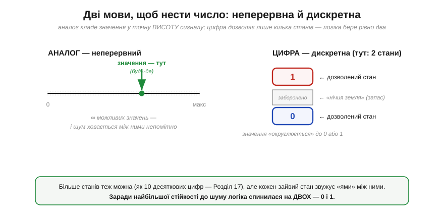
*Рис. 3.1.1.1. Два способи закодувати величину. Зліва — аналог: значення живе у **точній висоті** сигналу, можливих значень нескінченно багато, і шум непомітно сидить між ними. Справа — цифра: дозволено лише кілька **дискретних** станів (тут — два), а між ними лежить «заборонена», нічийна зона. Більше станів теж можливо (десяткові цифри — Розділ 3.4), але кожен зайвий стан звужує проміжки між ними.*

Уже з цього малюнка видно, що цифровий підхід **жертвує** інформаційною щедрістю: замість нескінченної шкали — лише дві позначки. Що ж ми отримуємо натомість? Щоб зрозуміти, треба познайомитися з ворогом.

### Ворог на ім'я шум

У реальному світі немає чистих сигналів. Будь-який провід, будь-який давач, будь-який підсилювач домішує до корисного сигналу **шум** (*noise*) — дрібні випадкові коливання напруги. Джерел багато: теплове ворушіння електронів (той самий хаотичний рух із моделі Друде, Розділ 1.2), наведення від сусідніх дротів і силових ліній, завади від радіо, брижі живлення, неідеальність кожного компонента. Шум **неможливо прибрати повністю** — це фундаментальна риса фізичного світу, а не вада конкретної схеми.

І тут криється фатальна слабкість аналогу. Якщо інформація — це точна висота сигналу, а шум цю висоту трохи зрушує, то **шум невіддільний від значення**. Приймач, що бачить 2.05 В, не має жодного способу дізнатися, чи це «справжні» 2.05, чи 2.0 плюс 0.05 шуму, чи 2.1 мінус 0.05. Інформація вже **зіпсована**, і відновити її нізвідки.

Цифровий приймач ставить питання інакше — і саме в цьому вся магія. Він не питає «яка точна напруга?». Він питає лише: **«вище порога чи нижче?»**. А це грубе, двійкове питання шум здолати **не може** — доки він менший за відстань від сигналу до порога.

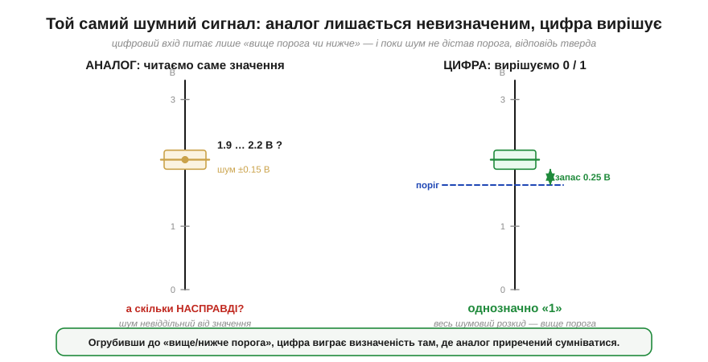
*Рис. 3.1.1.2. Один і той самий зашумлений сигнал (рівень ≈ 2.05 В, шум ±0.15 В). Зліва аналоговий приймач читає **саме значення** — і лишається в невизначеності: «десь між 1.9 і 2.2 В, а скільки насправді — невідомо». Справа цифровий приймач має лише **поріг**: увесь шумовий розкид сигналу — вище порога, тож рішення тверде — **«1»**. Запас (тут 0.25 В) — це та «подушка», у межах якої шум безсилий.*

> 🔧 **Навіщо це.** Це найголовніша інтуїція всього Модуля 3, і вона пояснює сотні майбутніх рішень. Чому довгий сигнальний дріт у цифрі може бути «брудним», а дані все одно дійдуть цілими? Бо приймач дивиться лише «вище/нижче порога». Чому той самий брудний дріт у чутливому аналоговому тракті — катастрофа? Бо там псується саме значення. Коли далі ви вибиратимете між аналоговим і цифровим інтерфейсом давача, між RC-фільтром і програмним згладжуванням — ви щоразу зважуватимете саме цей компроміс: точність значення проти стійкості рішення.

### Чому аналог не можна копіювати безкарно

Один поодинокий шумовий поштовх — це ще пів біди. Справжня катастрофа аналогу — у тому, що шум **накопичується**. Щойно шум підмішався до значення й став від нього невіддільним, кожна наступна ланка (підсилювач, довгий дріт, ще одне копіювання) додає **свою** порцію шуму **поверх** уже зіпсованого. Похибки не гасять одна одну — вони складаються.

Хто застав касетні магнітофони, чув це на власні вуха: перезапис копії з копії шипить дедалі гучніше, аж поки музику не чути за шумом. Те саме — ксерокопія ксерокопії: з кожним поколінням контури пливуть. Інженери звуть це **втратою поколінь** (*generation loss*). Якщо кожне копіювання додає незалежний шум середньою величиною σ, то після N копій накопичена похибка росте як **σ·√N** (це класичне «випадкове блукання»): повільно, та невпинно, і назад дороги немає.

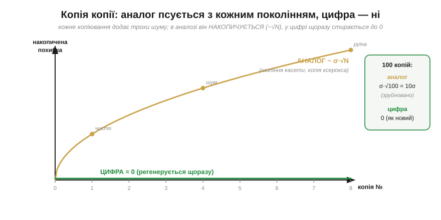
*Рис. 3.1.1.3. Накопичена похибка залежно від числа копій. Аналог (бурштинова крива) росте як σ·√N — спершу непомітно, та після сотні копій сигнал зруйновано. Цифра (зелена лінія) тримається **на нулі**: на кожному кроці значення «округлюється» назад до чистого 0 чи 1, тож кожна копія виходить **як новий оригінал** — поки шум однієї ланки менший за запас.*

Цифровий сигнал розриває це закляття завдяки **регенерації** (*regeneration*). Перш ніж передати сигнал далі, кожна цифрова ланка ставить просте запитання «вище порога чи ні?» і **наново будує** ідеально чисті 0 і 1, викидаючи весь накопичений шум. Це наче на кожному поверсі копіювальної фабрики стоїть людина, що дивиться на блякле «1» і впевнено пише свіже, чорне «1» замість нього. Доки шум не настільки великий, щоб переплутати 0 з 1, **його стирають начисто** — і так хоч мільйон разів поспіль.

**Приклад (втрата поколінь).** Сигнал проходить N = 100 послідовних копіювань. Кожне додає шум середньою величиною σ = 1 % від розмаху. Порівняймо аналог і цифру.

```
аналог:  E = σ · √N = 1 % · √100 = 1 % · 10 = 10 %   → форму зруйновано
цифра:   E = 0   (поки σ менший за запас, кожна копія чиста)   → 0 %
```

Десять відсотків похибки — це для більшості сигналів уже руїна. Цифра ж після ста копій лишається бездоганною. Ось чому фотографію, переслану через десяток серверів, ви отримуєте **піксель-у-піксель** такою, як її зняли: усередині вона давно не «висота напруги», а **числа**, а числа копіюються без втрати поколінь.

### Цифрова ідея: огрубити, щоб урятувати

Тепер ключову думку можна сформулювати чітко, і вона парадоксальна. Щоб зробити сигнал **надійним**, його треба свідомо **огрубити**. Аналог намагається зберегти **все** — і тому зберігає й шум, який накопичується до загибелі сигналу. Цифра погоджується зберегти **мало** (лише «вище/нижче порога») — і саме тому здатна викидати шум на кожному кроці й нести цю «дещицю» інформації крізь скільки завгодно ланок без жодної втрати.

Аналогова машина **бореться** з шумом, шліфуючи деталі до мікронної точності, — і завжди програє на довгій дистанції, бо ворог невичерпний. Цифрова машина шум **ігнорує** — доти, доки він не перевалив за половину «ями» між станами. Це не покращення аналогу, а зміна правил гри.

### Чому саме два стани, а не десять

Якщо дискретність така корисна, чому б не взяти **десять** рівнів — як десять пальців, як десять цифр у звичних числах? У один провід тоді влізе більше інформації за такт. Спокуса природна — і відповідь на неї знову дає шум.

Уявімо фіксований розмах напруги, скажімо 0…3.3 В (типове живлення). Якщо рівнів **два**, між ними зяє «яма» завширшки майже на весь розмах — і будь-яка завада, менша за пів'ями, нешкідлива. Якщо ж напхати в той самий розмах **десять** рівнів, проміжки між ними стиснуться вдесятеро, і той самий шум легко перекине сигнал у сусідній рівень — помилку, яку вже не відрізнити від правди.

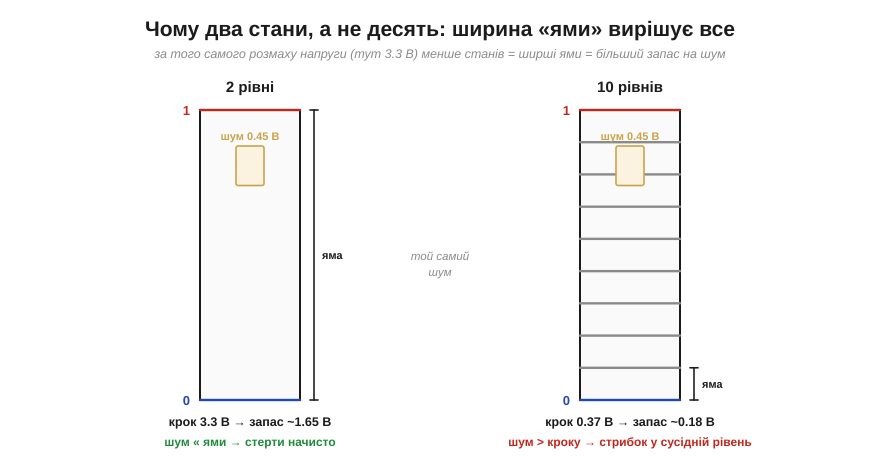
*Рис. 3.1.1.4. За того самого розмаху 3.3 В **той самий** шум 0.45 В поводиться зовсім по-різному. Для двох рівнів (зліва) «яма» завширшки 3.3 В — шум у ній загубиться, його зітруть начисто. Для десяти рівнів (справа) крок лише ≈ 0.37 В — і шум, більший за крок, перекидає сигнал у сусідній стан. Менше станів = ширші ями = більший запас.*

**Приклад (два проти десяти рівнів).** Той самий розмах Vdd = 3.3 В. Який запас на шум дає кожен варіант?

```
2 рівні:    крок = 3.3 В,          запас ≈ крок/2 = 1.65 В
10 рівнів:  крок = 3.3/9 ≈ 0.37 В,  запас ≈ крок/2 ≈ 0.18 В
відношення: 1.65 / 0.18 ≈ 9×
```

Два стани терплять майже вдесятеро більший шум за десять. А ще два стани **найпростіше зробити залізом**: пригадаймо транзистор із Модуля 2 — він особливо «щасливий» саме у двох крайніх режимах, повністю **відкритому** й повністю **закритому** (там він мало гріється й поводиться передбачувано), тоді як проміжний, лінійний режим — гарячий і примхливий. Природа компонента сама підказує два стани. Додаймо до цього, що два стани — це рівно булева алгебра Шеннона (див. історію розділу), і вибір стає очевидним: **двійкова** логіка виграє і за стійкістю, і за простотою, і за математикою.

> 🔧 **Навіщо це.** Звідси — практичне правило, яке ви бачитимете всюди: цифрові лінії мають **широкі** дозволені діапазони для 0 і 1, а не точні значення. Скажімо, на лінії з живленням 3.3 В вхід зрозуміє як «1» усе, що десь вище ~2 В, а як «0» — усе, що нижче ~0.8 В. Ця «щедрість» — не недбалість, а свідомо закладений запас на шум. Коли далі (§3.1.3) ми кількісно розберемо ці пороги, пам'ятайте: вони широкі **навмисне**, бо ширина ями — це і є стійкість.

### Чесна ціна: прірва замість плавності

Було б нечесно змалювати цифру як суцільний виграш. За стійкість вона платить — і платить особливою, **раптовою** манерою відмови. Аналогова система з ростом шуму псується **плавно**: радіо з далекою станцією шипить дедалі гучніше, та голос ще можна розчути; зображення стає зернистим, але впізнаваним. Цифра тримається **ідеально** — рівно до тієї миті, коли шум вичерпає запас. А далі вона зривається в **прірву**: 0 і 1 починають плутатися, і сигнал перетворюється на безлад майже миттєво.

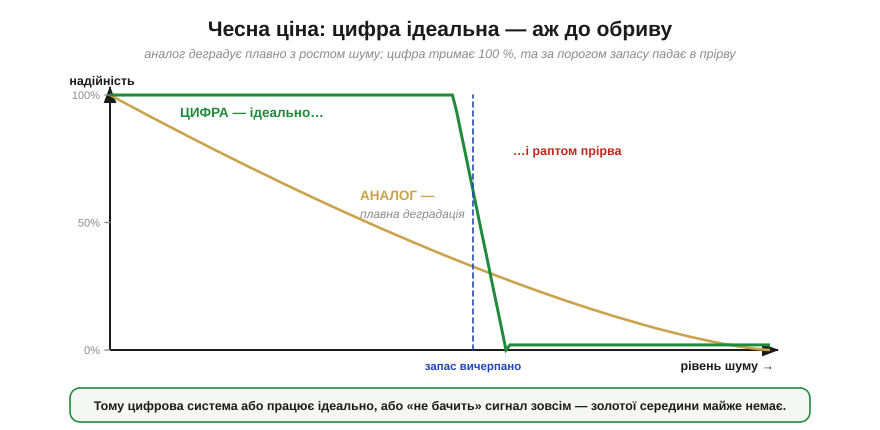
*Рис. 3.1.1.5. Надійність залежно від рівня шуму. Аналог (бурштинова крива) деградує плавно — гірше й гірше, але поступово. Цифра (зелена) тримає всі 100 %, аж поки шум не дістав межі запасу, — і тоді обвалюється «з обриву». Тому цифрова система зазвичай або працює бездоганно, або «не бачить» сигнал зовсім; золотої середини майже немає.*

Кожен стикався з цим ефектом: цифрове ТБ показує бездоганну картинку, а на межі прийому раптом розсипається на квадрати й завмирає — тоді як старий аналоговий канал на тому самому місці просто рябів би «снігом». Те саме почуєте далі в курсі, проєктуючи зв'язок (Модуль 6): цифровий радіоканал треба рахувати з **запасом**, бо поза межею він не слабшає — він зникає.

### Що виграли й що віддали

Зведімо баланс цієї великої угоди, бо саме його — свідомо чи ні — укладає кожен, хто обирає цифрове рішення.

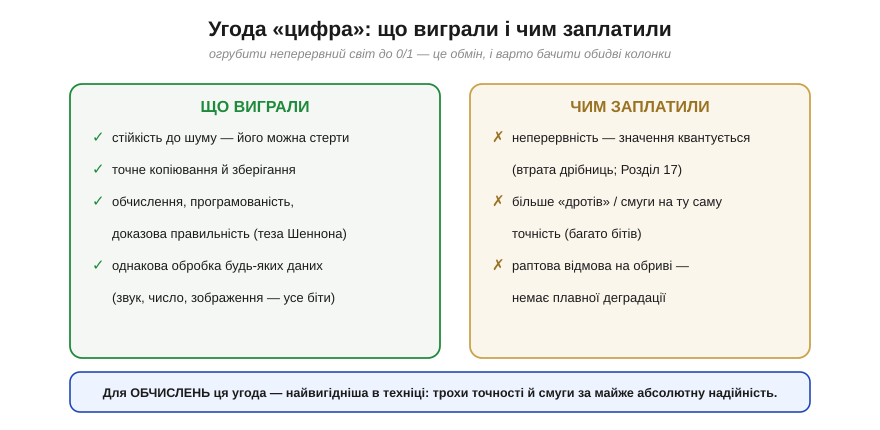
*Рис. 3.1.1.6. Дві колонки однієї угоди. Ліворуч — виграш: стійкість до шуму, точне копіювання й зберігання, можливість обчислювати й програмувати, єдина мова для будь-яких даних. Праворуч — ціна: втрата неперервності (значення квантується), потреба в більшій кількості «дротів» чи смуги на ту саму точність, і раптова відмова на обриві. Для **обчислень** ця угода — найвигідніша в техніці.*

Зверніть увагу на праву колонку — вона теж важлива. Щоб закодувати плавну величину цифрою, доводиться **квантувати** її, тобто округлювати до найближчої дозволеної сходинки, втрачаючи дрібниці (як саме й скільки — Розділ 3.4, а на стику з реальним давачем — Розділ 4.8). А щоб ця сходинкова точність була пристойною, потрібно багато сходинок — отже, багато **бітів**, а отже, більше дротів або вища швидкість перемикання. Цифра не безкоштовна: вона радше **обмінює** дешеву, але крихку аналогову точність на дорожчу, зате майже незнищенну надійність.

> 🔧 **Навіщо це.** Це і є відповідь на питання «чому всередині майже все цифрове». Поки сигнал треба лише виміряти раз — аналог чудовий. Та щойно його треба **обчислювати, зберігати, копіювати й передавати** крізь багато ланок — аналог приречений накопичувати шум, а цифра несе дані без втрат. Тому реальний пристрій робить так: оцифровує сигнал **якомога раніше** (давач → АЦП), а далі тримає його в цифрі аж до останнього кроку. Уся решта Модуля 3 — про те, як у цьому цифровому світі рахувати: вентилями (Розділ 3.2), пам'яттю (Розділ 3.3), числами (Розділ 3.4) і, нарешті, процесором (Розділ 3.5).

---

Підсумок §3.1.1: реальні сигнали неминуче набирають **шуму**, і в аналозі він **невіддільний** від значення та **накопичується** (∼σ·√N), руйнуючи сигнал за багато ланок. Цифра ставить лише грубе запитання «вище порога чи нижче», тож **регенерує** чисті 0/1 на кожному кроці й стирає шум начисто — поки той менший за «яму» між станами. Саме тому станів беруть **два**, а не десять: за фіксованого розмаху напруги менше станів дає ширші ями й більший запас (а ще два стани найлегше зробити транзистором і вони збігаються з булевою логікою). Ціна — втрата неперервності (квантування), більше «дротів» на ту саму точність і **раптова** відмова на обриві замість плавної. Для обчислень ця угода безпрограшна. Лишилося уточнити річ, якою ми весь час користувалися, не означивши її строго: що таке «0» і «1» **у вольтах** — і чому це **діапазони**, а не точні числа.

---

## 3.1.2 «0» і «1» — це діапазони напруг, а не точні числа

У §3.1.1 ми раз по раз повторювали «вище порога» й «нижче порога», але не сказали головного: **скільки це у вольтах**? Настав час зробити «0» і «1» відчутними. І тут на нас чекає невелике, та важливе відкриття: логічна одиниця — це **не** якесь одне магічне число (скажімо, рівно 3.3 В), а **цілий діапазон** напруг; так само й нуль. Цифрова схема, що здається світом точних чисел, насправді стоїть на **широких, щедрих смугах** — і саме ця щедрість, як ми вже знаємо з §3.1.1, і дає їй стійкість до шуму.

### Спершу — відносно чого міряємо: земля

Напруга, як ми твердо засвоїли ще в Розділі 1.1, — це завжди **різниця** потенціалів, «висота» однієї точки **відносно** іншої. Тож, кажучи «на цьому піні логічна 1 — це 3.3 В», ми мовчки маємо на увазі: 3.3 В **відносно спільної опорної точки**, яку звуть **земля** (*ground*, **GND**). Земля — це той самий «нуль висоти» з §1.1, спільний для всієї схеми нуль відліку напруги.

Звідси випливає правило, без якого **однопровідний (single-ended)** цифровий зв'язок просто не працює: два пристрої, що обмінюються логічними рівнями **відносно спільного нуля**, мусять мати **спільну землю**. Якщо їхні «нулі» зміщені один відносно одного, то й усі пороги «попливуть»: те, що для одного є чистим нулем, для іншого може опинитися в забороненій зоні. Тому до звичайних цифрових інтерфейсів (UART, I2C, SPI — усе це попереду, в Модулі 6) завжди тягнуть **спільний дріт GND**, і це не формальність, а умова, щоб «0» і «1» взагалі мали сенс.

Варто, однак, чесно окреслити межі цього правила, бо воно стосується саме **однопровідних** ліній (а такі більшість простих інтерфейсів). Є й винятки, спеціально зроблені інакше. **Диференційні** інтерфейси (RS-485, CAN) читають **різницю** двох сигнальних дротів, а не рівень відносно землі, тож терплять зсув земель — але лише в межах свого *common-mode range* (скажімо, ±7…±12 В у RS-485), а не безмежно, тож опорний зв'язок між пристроями все одно потрібен. А **гальванічно ізольовані** лінії (оптопари, цифрові ізолятори) навмисно **розривають** спільну землю, передаючи сигнал світлом чи полем. Обидва підходи — теми Модуля 6; тут і далі ми працюємо зі звичайним однопровідним зв'язком, де спільна земля **обов'язкова**.

### Рівень — це смуга, обмежена порогами

Тепер сама суть. Щоб двійкова система була стійкою (§3.1.1), і той, хто **видає** сигнал, і той, хто його **читає**, мусять домовитися про напруги. Але домовляються вони **несиметрично**, і в цій несиметрії — уся хитрість.

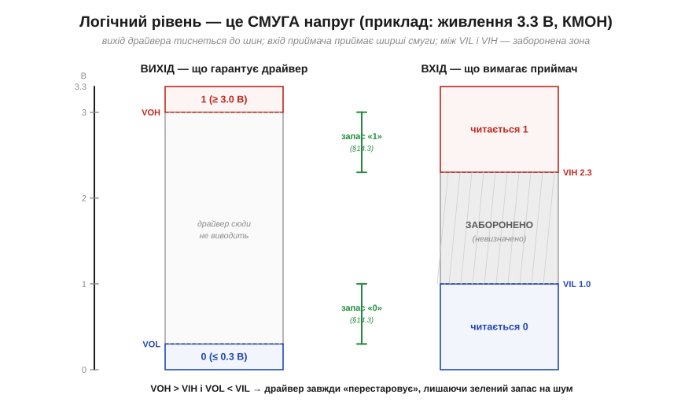
*Рис. 3.1.2.1. Канонічна діаграма рівнів (узагальнений КМОН на 3.3 В). Ліва колонка — що **гарантує драйвер** на виході: «0» не вище VOL, «1» не нижче VOH, тиснучи сигнал майже до шин. Права — що **вимагає приймач** на вході: усе нижче VIL читається як «0», усе вище VIH — як «1», а смуга між ними **заборонена**. Драйвер навмисно «перестаровує» (VOH вище за VIH, VOL нижче за VIL), і завдяки цьому між ними лишається зелений **запас** — про нього кількісно у §3.1.3.*

Читати цю діаграму треба так. Усю шкалу напруг від 0 до живлення поділено **порогами** (*thresholds*) на смуги. Усе, що нижче нижнього порога, — гарантований «0»; усе, що вище верхнього, — гарантована «1»; посередині — нічийна, заборонена зона. А оскільки вимоги до **виходу** й до **входу** різні, таких порогів аж **чотири**.

### Чотири пороги двома буквами

Назви порогів виглядають як закляття — `VIL`, `VIH`, `VOL`, `VOH` — але насправді читаються по літерах елементарно: **V** — напруга (*voltage*), друга літера — **I**nput (вхід) чи **O**utput (вихід), третя — **L**ow (низький, «0») чи **H**igh (високий, «1»). Складімо їх докупи:

```
VOL  (Output Low)  — max напруга, яку драйвер видає за «0»   (тут ≤ 0.3 В)
VOH  (Output High) — min напруга, яку драйвер видає за «1»   (тут ≥ 3.0 В)
VIL  (Input Low)   — max напруга, яку приймач ще читає як «0» (тут ≤ 1.0 В)
VIH  (Input High)  — min напруга, яку приймач уже читає як «1»(тут ≥ 2.3 В)
```

Зверніть увагу на логіку «гарантій». Виробник драйвера обіцяє: «мій нуль не підніметься вище **VOL**, а одиниця не впаде нижче **VOH**». Виробник приймача обіцяє інше: «усе, що ти подаси нижче **VIL**, я зрозумію як нуль, а все вище **VIH** — як одиницю». Це обіцянки **різних** сторін, і вони складаються в єдиний ланцюг, лише якщо вихід однієї **з запасом** перекриває вимогу входу іншої. Саме тому VOH (3.0) роблять помітно **вищим** за VIH (2.3), а VOL (0.3) — помітно **нижчим** за VIL (1.0): між обіцянкою й вимогою лишається «подушка» (зелені дужки на Рис. 3.1.2.1).

> 🔧 **Навіщо це.** Ці чотири літери — те, що ви читатимете в кожному даташиті в розділі *DC Characteristics*. І перше, що там перевіряють, поєднуючи дві мікросхеми: чи VOH драйвера ≥ VIH приймача і чи VOL драйвера ≤ VIL приймача. Якщо так — пристрої «розуміють» один одного **з запасом**; якщо ні (а так буває, коли стикають різні напруги живлення — про це §3.1.4) — потрібен **зсувач рівнів**. Звичка читати ці чотири числа врятує вас від найклятішої категорії багів: коли «начебто все з'єднано правильно», а лінія читається випадково.

### Будь-яка напруга в смузі — той самий рівень

Тепер головний наслідок, заради якого все й затівалося: **точне значення напруги в межах смуги не має значення**. Приймачеві байдуже, чи на вході 3.3, чи 2.8, чи 2.4 В — усе це «вище VIH», отже, для нього однаково **«1»**. Так само 0.0, 0.3 і 0.9 В — однаково **«0»**. Інформація — у тому, **по який бік** порога сигнал, а не в його точній висоті.

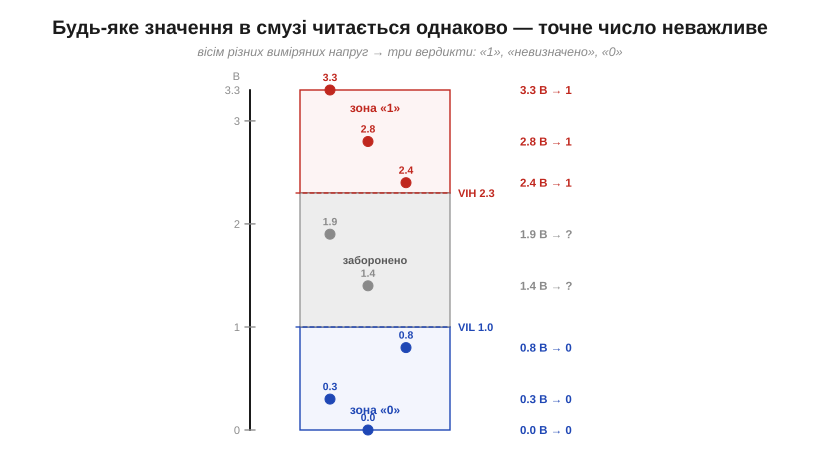
*Рис. 3.1.2.2. Вісім різних виміряних напруг — і лише три можливі вердикти. Три значення вгорі (3.3, 2.8, 2.4 В) усі вище VIH → усі «1». Три внизу (0.8, 0.3, 0.0 В) усі нижче VIL → усі «0». А два посередині (1.9, 1.4 В) застрягли в забороненій зоні → «невизначено». Точне число не несе інформації — несе лише належність до смуги.*

Це прямо те, що в §3.1.1 рятувало нас від шуму: оскільки одиницею вважається ціла широка смуга, шум, що штовхає сигнал у її межах, **нічого не псує**. Лише коли шум настільки великий, що виштовхує сигнал аж за поріг, з'являється помилка.

**Приклад (класифікація напруг).** Лінія має пороги VIL = 1.0 В і VIH = 2.3 В. Мультиметр показав на ній по черзі 2.70 В, 1.80 В і 0.40 В. Як їх прочитає цифровий вхід?

```
2.70 В  >  VIH (2.3)        →  «1»   (упевнено)
1.80 В  між VIL і VIH       →  ?     (заборонена зона — невизначено!)
0.40 В  <  VIL (1.0)        →  «0»   (упевнено)
```

Перше й третє значення — однозначні, хоча жодне з них не дорівнює «ідеальним» 3.3 чи 0 В. А ось 1.80 В — тривожний дзвоник: сигнал завис у нічийній зоні, і покладатися на нього не можна.

### Подорож одиниці дротом

Навіщо взагалі робити вхідні смуги (VIL…VIH) **ширшими**, ніж вихідні, а не однаковими? Бо сигналу між драйвером і приймачем доводиться **подорожувати** — крізь дріт, рознімачі, плату, — і дорогою він трохи **псується**: падає напруга на опорі провідника, домішується наведення від сусідів, гойдається живлення. Одиниця, що вийшла бадьорою, до приймача приходить **ослаблою** — і добре, якщо вхідна смуга достатньо широка, щоб її ще впізнати.

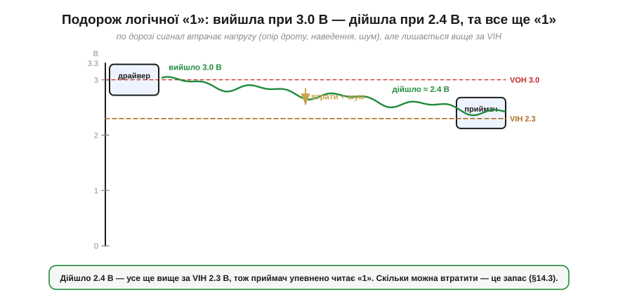
*Рис. 3.1.2.3. Логічна «1» виходить з драйвера на рівні VOH ≈ 3.0 В, та дорогою втрачає напругу й набирає шуму, тож до приймача доходить уже ≈ 2.4 В. Це все ще **вище** за VIH (2.3 В), тому приймач упевнено читає «1». Те, наскільки сигнал може просісти, перш ніж зірватися в заборонену зону, і є **запас завадостійкості** — його ми порахуємо у §3.1.3.*

Ось чому інженери зробили вхід «поблажливим», а вихід — «строгим». Драйвер тисне сигнал майже до шин (близько до 0 або до живлення), створюючи **якнайбільший** початковий відрив від порогів; приймач же погоджується впізнати рівень навіть тоді, коли той помітно зблід. Різниця між «з якою силою вийшло» і «з якою мінімальною ще впізнається» — це і є та подушка, що поглинає всі дорожні втрати й шум.

### Заборонена зона — нічия земля, де не можна затримуватися

Окремо варто наголосити, чим небезпечна **заборонена зона** (*forbidden / undefined region*) між VIL і VIH. Це не просто «сіра» ділянка, яку приймач «якось там» інтерпретує. Це зона, де його вихід **по-справжньому невизначений**: він може видати 0, може видати 1, може **завмерти посередині**, а може почати **дзвеніти** — швидко перемикатися туди-сюди від найменшого шуму.

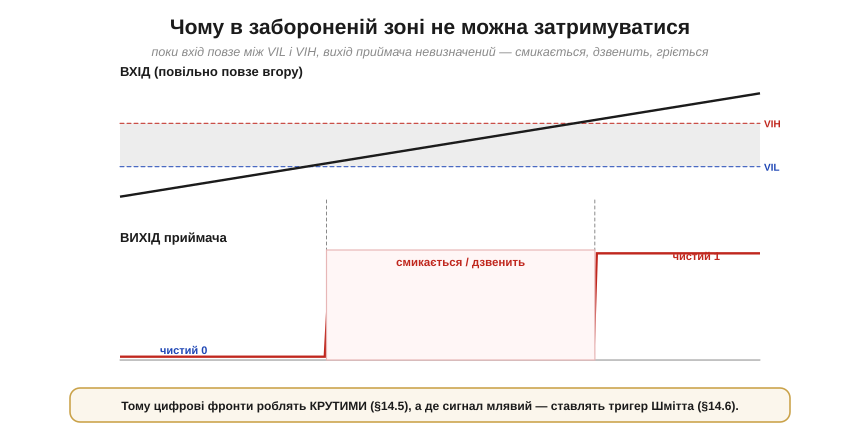
*Рис. 3.1.2.4. Поки вхідний сигнал повільно повзе крізь заборонену зону (VIL…VIH), вихід приймача поводиться огидно: замість чистого переходу 0→1 він смикається й дзвенить. А ще в цей момент усередині входу **обидва** транзистори прочинені водночас (з КМОН-пари Розділу 2.7), тож крізь них тече наскрізний струм — вхід зайве гріється. Висновок практичний: крізь цю зону треба проскакувати **якнайшвидше**.*

Звідси два важливі наслідки, які ми розгорнемо далі в розділі. По-перше, цифрові **фронти** намагаються робити **крутими** — щоб сигнал проскакував заборонену зону за наносекунди, не встигаючи там «задзвеніти» (це §3.1.5). По-друге, коли сигнал за своєю природою **повільний** чи зашумлений (наприклад, з механічної кнопки чи давача), на вході ставлять особливу схему — **тригер Шмітта** (*Schmitt trigger*) з двома порогами, яка силоміць перетворює млявий перехід на різкий (це §3.1.6, а корінням сягає компаратора з гістерезисом із §2.8.8). Поки ж досить запам'ятати: **затримуватися в забороненій зоні не можна**.

### Чому це СМУГИ, а не точки: розкид заліза

Лишилося пояснити, **чому** виробник узагалі задає рівні діапазонами «не вище / не нижче», а не одним точним числом. Причина — у фізичній реальності: **двох однакових мікросхем не буває**. Вихідна напруга «одиниці» трохи різниться від чіпа до чіпа (розкид виробництва), повзе з **температурою**, просідає під більшим **навантаженням** на виході, залежить від точного **живлення**. Назвати одне число було б брехнею.

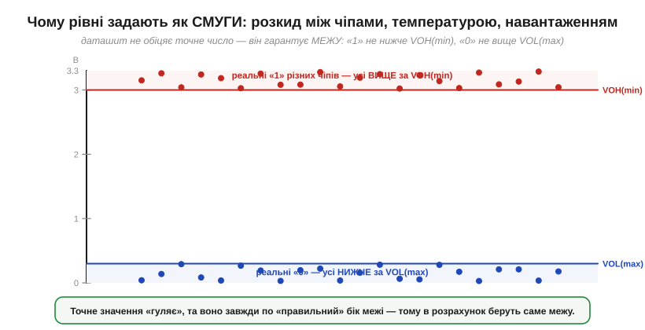
*Рис. 3.1.2.5. Реальні виходи багатьох чіпів за різних умов «гуляють» — та завжди по правильний бік межі: усі «одиниці» лишаються **вище** гарантованого VOH(min), усі «нулі» — **нижче** VOL(max). Тому даташит обіцяє не точне значення, а **межу**, і саме цю межу беруть у розрахунок: проєктуючи, ми завжди припускаємо найгірший дозволений випадок.*

Тому грамотний інженер рахує цифрову лінію **за гарантованими межами**, а не за «typical» значеннями: припускає, що драйвер видасть рівно VOH(min) (не краще), а приймач вимагатиме рівно VIH(min) — саме так VIH і задають у даташиті: як **мінімальну** напругу, яку вхід ще гарантовано читає як «1». Тоді запас рахують у найгіршому збігу: для одиниці **NMH = VOH(min) − VIH(min)**, для нуля **NML = VIL(max) − VOL(max)** — і дивляться, чи він додатний. Якщо так — схема працюватиме на **будь-яких** екземплярах за будь-яких умов, а не лише на тих, що пощастило спаяти.

> 🔧 **Навіщо це.** І ще про конвенцію, щоб не плутатися далі. Ми весь час кажемо «1 — це високий рівень, 0 — низький»; це **додатна логіка** (*positive logic*), і в курсі вона за замовчуванням. Та інколи сигнал навмисно роблять **активним низьким** (*active-low*): «подія сталася» позначають **нулем**, а не одиницею (такі лінії підписують з рискою, скажімо `RESET` з рискою згори, або `/CS`). Рівні напруг ті самі — змінюється лише, який рівень вважати «дією». Побачивши риску над назвою сигналу, читайте: «активний, коли тут 0».

---

Підсумок §3.1.2: логічні «0» і «1» — це **діапазони** напруг (відносно спільної **землі**), а не точні числа. Їх обмежують **чотири пороги**: вихідні **VOL/VOH** (що драйвер гарантує) і вхідні **VIL/VIH** (що приймач вимагає), а між VIL і VIH лежить **заборонена зона**. Будь-яке значення в межах смуги читається однаково — інформація в тому, **по який бік** порога сигнал. Вхідні смуги навмисно **ширші** за вихідні, щоб поглинути дорожні втрати й шум (подорож одиниці дротом), а самі рівні задають смугами через неминучий **розкид** заліза — і рахують за гарантованими межами. У забороненій зоні **не можна** затримуватися. Ми кілька разів згадали «подушку» між виходом і входом, але досі не виміряли її. Час дати цьому запасу число — і побачити, скільки саме шуму витримає лінія.

---

## 3.1.3 Запас завадостійкості (noise margin)

У §3.1.2 ми двічі вперлися в «подушку» між тим, що драйвер видає, і тим, що приймач вимагає, — і щоразу відкладали її вимір. Тепер виміряємо. Ця подушка має точну назву — **запас завадостійкості** (*noise margin*) — і саме вона є числовим утіленням усього, про що йшлося в §3.1.1: вона каже, **скільки рівно вольтів шуму** лінія проковтне, перш ніж «1» прочитається як «0». Якщо §3.1.1 пояснив, **чому** цифра стійка, то цей підрозділ каже, **наскільки** — у вольтах, які можна порахувати й порівняти.

### Означення: різниця між тим, що дають, і тим, що вимагають

Запас рахується окремо для одиниці й для нуля, бо й пороги для них різні. Згадаймо чотири рівні з §3.1.2: драйвер видає «1» не нижче **VOH**, а приймач упізнає «1» уже від **VIH**. Оскільки VOH (3.0 В) **вище** за VIH (2.3 В), між ними лишається зазор — і це **запас для високого рівня**:

```
NMH = VOH − VIH          (noise margin, High)
```

Симетрично для нуля: драйвер видає «0» не вище **VOL**, а приймач читає «0» аж до **VIL**. Оскільки VOL (0.3 В) **нижче** за VIL (1.0 В), знову лишається зазор — **запас для низького рівня**:

```
NML = VIL − VOL          (noise margin, Low)
```

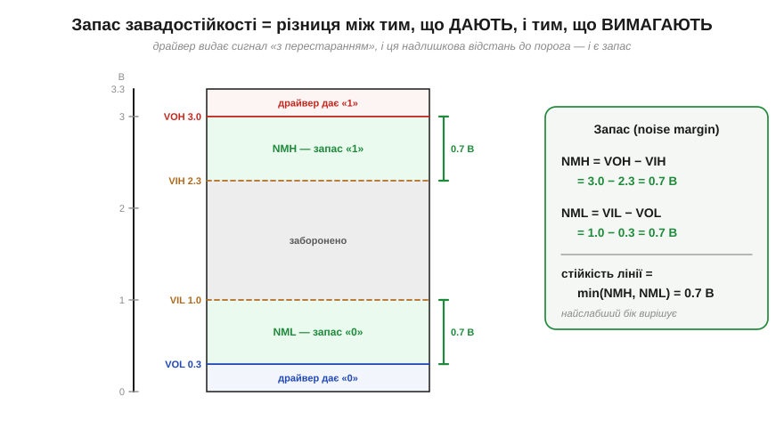
*Рис. 3.1.3.1. На одній шкалі — усі чотири рівні й два запаси. Зелена смуга вгорі (між VOH і VIH) — це NMH: на стільки може просісти «1», перш ніж приймач засумнівається. Зелена смуга внизу (між VIL і VOL) — NML: на стільки може піднятися «0». Посередині — заборонена зона. Праворуч — уся арифметика: для нашого прикладу обидва запаси по 0.7 В.*

Підставмо наші числа (узагальнений КМОН на 3.3 В):

```
NMH = VOH − VIH = 3.0 − 2.3 = 0.7 В
NML = VIL − VOL = 1.0 − 0.3 = 0.7 В
```

Отже, на цій лінії **0.7 вольта** шуму — це та межа, у яку ще можна вкластися. Це і є та «яма» Шеннона з §3.1.1, лише тепер виміряна лінійкою.

### Стійкість лінії — це менший із двох запасів

Запасів два, але лінія настільки стійка, наскільки стійкий її **слабший** бік. Якщо одиниця терпить 0.7 В шуму, а нуль — лише 0.3 В, то вся лінія «зламається» першою саме на нулі, щойно шум перевалить за 0.3 В. Тому загальну **завадостійкість** беруть як мінімум двох:

```
запас лінії = min(NMH, NML)
```

У нашому прикладі обидва запаси рівні (0.7 В), тож і стійкість лінії — 0.7 В. У реальних сімействах вони часто несиметричні (про це — §3.1.4), і тоді саме менший із них визначає, скільки шуму можна стерпіти. Це типова інженерна логіка «найслабшої ланки»: ланцюг рветься там, де тонко.

> 🔧 **Навіщо це.** Коли ви читаєте даташит і бачите окремо NMH і NML (або обчислюєте їх із VOH/VIH/VOL/VIL) — завжди дивіться на **менший**. Саме він каже, який найбільший шумовий стрибок лінія переживе без помилки. І саме тому інженери недолюблюють несиметричні сімейства зі слабким одним боком: «середній» запас звучить пристойно, а ламається все по тонкому боку. Запас лінії — це не середнє, а мінімум.

### Запас — це бюджет на всі негаразди

Тепер найважливіше для практики. Запас — це не абстрактне число, а **бюджет**, який доводиться **ділити** між усіма реальними неприємностями, що псують сигнал по дорозі. Кожна з них відкушує свій шматок; працює лінія доти, доки **сума всіх відкушених шматків** менша за запас.


*Рис. 3.1.3.2. Запас 0.7 В як стовпчик бюджету. Знизу його «з'їдають»: зсув землі (0.20 В), падіння напруги на опорі дроту (0.20 В), перехресна завада від сусіда (0.15 В), дзвін і відбиття (0.10 В). Сума — 0.65 В, тож лінія ще працює, але зеленої «подушки» лишилося всього 0.05 В. Ще одна дрібна завада — і зрив.*

Це пояснює, чому цифрова лінія, що «завжди працювала», раптом починає збоїти, коли поряд увімкнули потужний мотор, або коли подовжили дріт, або коли просіло живлення: усі ці чинники **складаються** в один бюджет, і досить останній краплі переповнити його, як надійні 0 і 1 розсипаються. Запас не зникає поступово — він **витрачається**, як гроші з рахунку.

**Приклад (бюджет шуму).** Лінія має запас 0.7 В. Інженер оцінив завади: зсув землі між платами ≈ 0.2 В, падіння на опорі довгого дроту ≈ 0.2 В, перехресна завада від сусідньої шини ≈ 0.15 В, дзвін на вході ≈ 0.1 В. Чи працюватиме?

```
сума завад = 0.20 + 0.20 + 0.15 + 0.10 = 0.65 В
запас      = 0.70 В
0.65 В < 0.70 В   →   працює, але впритул (лишилось 0.05 В)
```

Лінія працює — та запас майже вичерпано. Якби дріт був ще довшим (падіння 0.3 замість 0.2 В), сума стала б 0.75 В > 0.7 В, і лінія почала б помилятися. Ось чому «начебто працює» — небезпечний стан: між «впритул працює» і «зривається» лежить якихось 50 мілівольтів.

### Хто з'їдає запас: вороги сигналу

Варто знати ворогів в обличчя — бо боротьба за надійну цифру здебільшого зводиться до того, щоб **не дати їм з'їсти запас**.


*Рис. 3.1.3.3. Шлях сигналу від драйвера до приймача — і засідки на ньому. **Зсув землі** (різниця потенціалів між «нулями» двох пристроїв) зрушує всі пороги. **Падіння I·R** на опорі дроту просто віднімає напругу від сигналу. **Перехресна завада** — це наведення від сусіднього дроту, що перемикається, крізь паразитну ємність. **Просадка живлення** опускає VOH драйвера. **Дзвін і відбиття** на вході гойдають сигнал біля порога. Усе це додається вже після драйвера — і з'їдає той самий бюджет.*

Найпідступніший із них — **зсув землі** (*ground offset / ground bounce*), і тут замикається обіцянка з §3.1.2 про спільну землю. Якщо «нуль» приймача насправді на 0.2 В вищий за «нуль» драйвера (бо по спільному дроту GND тече струм і створює на його опорі падіння), то всі рівні, які приймач міряє **відносно свого** нуля, зсунуті — наче хтось підняв йому планку. Тому товстий, короткий, малоопірний спільний GND — це не педантизм, а пряма економія запасу. Решта ворогів — падіння на опорі сигнального дроту, ємнісне наведення від сусідів, відбиття на довгих лініях, просадки живлення — теж б'ють у той самий бюджет, і кожен мілівольт, відвойований у них, повертається в запас.

### Запас — це відстань до обриву

Згадаймо «цифрову прірву» з §3.1.1 (Рис. 3.1.1.5): цифра ідеальна — аж до різкого обриву. Тепер ми можемо сказати, **де саме** той обрив: він рівно на відстані «запасу» від поточного рівня шуму. Запас — це і є **відстань до краю прірви**.


*Рис. 3.1.3.4. Шкала сумарного шуму. Зелена зона (до межі запасу 0.70 В) — лінія працює бездоганно; за нею — обрив. Поточний шум (0.45 В) лишає ще 0.25 В «ходу» до зриву. Проєктувати «на межі» (коли вістря майже впритул до червоного) — означає віддати всю стійкість і молитися, щоб жодна завада не підросла.*

Звідси й мудрість проєктування: добрий запас — це не марнотратство, а **сон спокійним**. Лінія з 0.25 В вільного запасу переживе і трохи довший дріт, і ввімкнений поряд мотор, і слабший екземпляр чипа. Лінія, відлагоджена «щоб ледь працювало», зірветься від першої ж зміни умов — і шукати такий невловимий баг доведеться годинами.

### Запас масштабується з живленням

Наостанок — практичний наслідок, про який часто забувають. У КМОН пороги задані як **частки живлення** — наближено VIL ≈ 0.3·Vdd, VIH ≈ 0.7·Vdd (це зручна **типова модель**; конкретні чипи різняться — наприклад, ESP32 за даташитом задає VIL ≈ 0.25·Vdd, VIH ≈ 0.75·Vdd), а виходи тиснуться майже до шин. Тому й запас виходить порядку **(0.25…0.3)·Vdd з кожного боку** — тобто він **пропорційний напрузі живлення**.

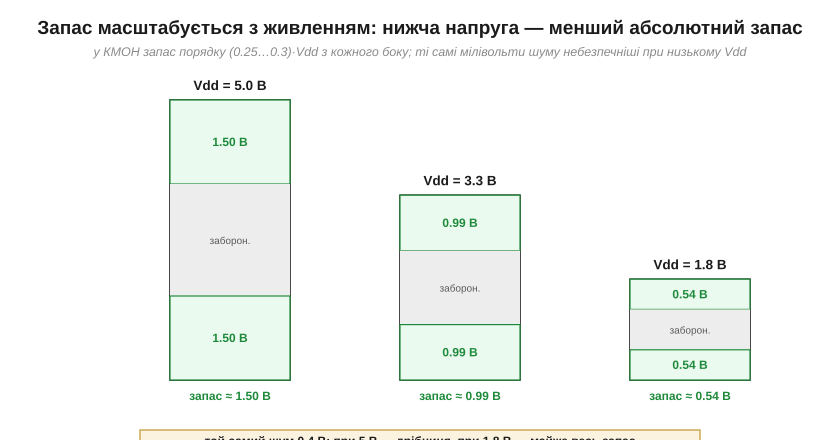
*Рис. 3.1.3.5. Той самий «відсотковий» запас 0.3·Vdd дає зовсім різні **вольти** за різного живлення: ≈ 1.5 В на 5 В, ≈ 1.0 В на 3.3 В, ≈ 0.55 В на 1.8 В. Тому той самий абсолютний шум 0.4 В на 5 В — дрібниця, а на 1.8 В з'їдає майже весь запас. Низьковольтна логіка економніша, але «тендітніша» до тих самих наведень.*

Це одна з прихованих цін гонитви за низьким живленням (а вона є скрізь — заради економії енергії, про що далі в Модулі 4). Опускаючи Vdd з 5 до 1.8 В, ми втричі зменшуємо **абсолютний** запас, тож ті самі завади, що були нешкідливі, раптом стають критичними. Низьковольтні лінії вимагають акуратнішого монтажу — коротших дротів, кращої землі, ретельнішого розведення.

**Приклад (3.3 проти 1.8 В).** Поряд проходить шумна шина, що наводить на сигнал ≈ 0.4 В завади. Чи витримає лінія за різного живлення (запас ≈ 0.3·Vdd)?

```
Vdd = 3.3 В:  запас ≈ 0.3 × 3.3 ≈ 1.0 В   →  0.4 В « 1.0 В   надійно
Vdd = 1.8 В:  запас ≈ 0.3 × 1.8 ≈ 0.55 В  →  0.4 В ≈ 0.55 В  на межі!
```

Та сама схема, та сама завада — і цілком надійна на 3.3 В лінія стає ненадійною на 1.8 В. Не помінялося нічого, крім живлення; помінявся запас.

> 🔧 **Навіщо це.** Звідси — практичний набір звичок, до яких ми ще повернемося конкретно. Хочеш зберегти запас: тримай спільну землю товстою й короткою; не веди сигнальні дроти впритул до шумних силових; став конденсатори-розв'язки біля живлення кожного чипа (з §2.1.6); на довгих лініях думай про узгодження; а де сигнал млявий — підправляй фронт (§3.1.5) чи став тригер Шмітта (§3.1.6). Кожна з цих дій — це повернений у бюджет мілівольт. І завжди лишай **запас на запас**: проєктуй так, щоб у найгіршому збігу завад до обриву ще лишалася відстань.

---

Підсумок §3.1.3: **запас завадостійкості** — це числова міра стійкості цифрової лінії, різниця між тим, що драйвер гарантує, і тим, що приймач вимагає: NMH = VOH − VIH і NML = VIL − VOL, а стійкість лінії = **min(NMH, NML)** (вирішує слабший бік). Запас — це **бюджет**, який спільно з'їдають зсув землі, падіння I·R, перехресні завади, дзвін і просадки живлення; лінія працює, поки їхня сума менша за запас. Запас — це **відстань до «обриву»** з §3.1.1, тож добрий запас означає спокій. І він **масштабується з Vdd** (≈ 0.3·Vdd у КМОН), тож низьковольтна логіка за ту саму економію платить меншою абсолютною стійкістю. Ми весь час казали «у КМОН», «при 3.3 В», «у TTL» — ніби це різні світи з різними числами. Так і є: настав час розібратися, що таке **логічні сімейства** і чому 3.3-вольтова мікросхема не завжди порозуміється з 5-вольтовою.

---

## 3.1.4 Логічні сімейства й рівні (TTL/CMOS; 5 В / 3.3 В)

Усі числа, якими ми оперували в §3.1.2 і §3.1.3 — VIL = 1.0, VIH = 2.3, запас 0.7 В — ми обережно називали «прикладом». Настав час зізнатися чесно: **єдиних, універсальних порогів не існує**. Скільки рівно вольтів вважати одиницею, де поставити пороги, до якої шини тиснути вихід — усе це задає **логічне сімейство** (*logic family*): домовленість, якої дотримуються виробники, щоб їхні чипи **розуміли одне одного**. Підключаючи дві мікросхеми, ви насправді стикаєте два таких «договори» — і якщо вони не збігаються, починаються біди. Цей підрозділ — про найважливіші сімейства, про марш напруг від 5 до 3.3 В і нижче, і про головне практичне питання: **коли різні чипи порозуміються, а коли ні**.

### Що таке логічне сімейство

Сімейство — це повний набір угод: яка напруга живлення, де чотири пороги (VIL/VIH/VOL/VOH), скільки струму може віддати чи прийняти вихід, як швидко перемикається, скільки споживає. Чипи **одного** сімейства гарантовано стикуються між собою — їхні виходи з запасом перекривають входи (бо так задумано). А ось стик **різних** сімейств треба щоразу перевіряти власноруч: ніхто не пообіцяв, що вони збігаються.

Історично сімейств було багато (RTL, DTL, ECL, NMOS…), та для нас сьогодні важать дві великі лінії, що виросли прямо з компонентів Модуля 2: **TTL** і **CMOS**.

### Дві великі лінії: TTL і CMOS

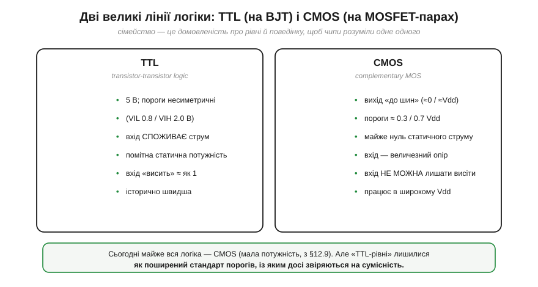
*Рис. 3.1.4.1. Дві родини логіки. **TTL** (*transistor-transistor logic*) збудована на біполярних транзисторах (BJT з §2.6): живлення 5 В, пороги несиметричні (VIL 0.8 / VIH 2.0 В), вхід помітно споживає струм, чип гріється навіть у спокої, а «висячий» вхід поводиться приблизно як «1». **CMOS** (*complementary MOS*) збудована на парах NMOS+PMOS (з §2.7): вихід тиснеться майже до шин, пороги симетричні (≈ 0.3/0.7 Vdd), статичний струм майже нульовий, вхід має величезний опір — і саме тому його не можна лишати «висіти».*

Різниця корениться у фізиці компонентів. **TTL** походить від біполярного ключа (§2.6.6): щоб тримати стан, база мусить **споживати струм**, тому TTL-вхід «тягне» зі схеми мікроампери-міліампери, а сам чип безперервно щось розсіює. Пороги в TTL зсунуті вниз і несиметричні (історична спадщина схемотехніки на BJT). **CMOS** виросла з тієї дивовижної пари транзисторів (§2.7.9), де в усталеному стані **завжди один із двох закритий**, тож наскрізного струму майже немає — звідси легендарна економність. Вихід CMOS у спокої з'єднаний або з живленням, або з землею майже без втрат, тому VOH ≈ Vdd, а VOL ≈ 0. А вхід CMOS — це **затвор-ізолятор** (конденсатор), тож постійного струму він майже не споживає — лише **мізерний струм витоку** (input leakage IIH/IIL та витік ESD-структур, від наноампер до мікроампер за даташитом), — і тому має величезний вхідний опір.

Сьогодні майже вся логіка — **CMOS** (через малу потужність це безальтернативно для всього живленого від батарей, як-от ESP32). Але — і це ключова деталь для практики — **«TTL-рівні» лишилися** як поширений стандарт порогів. Дуже багато сучасних CMOS-чипів навмисно роблять із TTL-сумісними порогами (VIH ≈ 2.0 В), щоб старе й нове досі стикувалося. Тому, читаючи даташит, ви часто бачите CMOS-чип «із TTL-сумісними входами».

> 🔧 **Навіщо це.** Дві поведінки, які зекономлять вам години. Перша: **CMOS-вхід не можна лишати «висіти»** в повітрі. У TTL висячий вхід тяжіє до «1», а ось у CMOS він — як антена: величезний опір ловить будь-яке наведення, і вхід безладно стрибає 0↔1, ще й гріється наскрізним струмом (та сама заборонена зона §3.1.2). Тому **кожен** невикористаний чи нормально-розімкнений CMOS-вхід прив'язують до 0 чи до Vdd резистором (підтяжкою — детально §4.4.4). Друга: TTL-вхід **споживає** струм, тож рахуючи, скільки входів потягне один вихід (*fan-out*), для TTL це питання струму, а для CMOS — майже лише питання швидкості (бо втрати на ємності).

### Драбина напруг: чому логіка «спускається»

Друга вісь, по якій розрізняють сімейства, — **напруга живлення**. Класика працювала на **5 В**. Та з роками логіка вперто «спускалася» драбиною: 3.3 → 2.5 → 1.8 → 1.2 В і нижче.

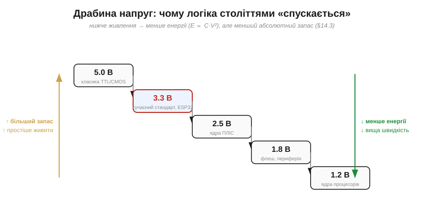
*Рис. 3.1.4.2. Марш напруг униз. Головний виграш кожної сходинки — **менше енергії** на перемикання (вона росте як квадрат напруги, E ∝ C·V²). Швидкодію ж дає не сама низька напруга, а **дрібніші транзистори** новіших техпроцесів, які заодно й живляться нижче; за тієї самої технології нижча Vdd радше трохи **сповільнює** вентиль (слабший струм заряджає ємність). Платою за низьку напругу є **менший абсолютний запас** (§3.1.3) і складніше живлення. 3.3 В (де працює ESP32) — сьогоднішній «золотий компроміс» для периферії та зв'язку.*

Чому вниз? Передусім заради **енергії**: вона пропорційна **квадрату** напруги (це побачимо строго в §4.7 і Модулі 4), тож половинне живлення — учетверо менше тепла й споживання. (Поширене «нижча напруга = швидше» — спрощення: швидкодію дають не низькі вольти самі по собі, а дрібніші транзистори новіших техпроцесів — вони ж і живляться нижче; за фіксованої технології нижча Vdd навпаки трохи **сповільнює** логіку.) Тому процесорні ядра «голодують» на 1.0–1.2 В заради економії. Але є й зворотний бік, який ми вже знаємо з §3.1.3: запас ≈ (0.25…0.3)·Vdd, тож із падінням живлення **абсолютний** запас тане, і низьковольтні лінії стають тендітнішими до наведень. 3.3 В — поширений нинішній компроміс: уже економно, але запас (≈ 1 В) ще пристойний; саме на 3.3 В працює більшість сучасної периферії, давачів і — що для нас головне — ESP32.

### Карти рівнів на спільній шкалі

Тепер найкорисніше — побачити кілька сімейств **на одній шкалі напруг**, щоб сумісність читалася оком.


*Рис. 3.1.4.3. Три сімейства поряд: 5 В TTL, 5 В CMOS і 3.3 В LVCMOS. Червоні смуги — діапазони, де вхід читає «1» (вище VIH); сині трикутники (VOH) і смуги показують, що сімейство **видає**. Правило сумісності читається просто: щоб драйвер A керував приймачем B, трикутник **VOH(A) має дотягтися** до низу червоної смуги «1» B (тобто VOH(A) ≥ VIH(B)). Видно одразу: VOH 5 В CMOS (4.9) дістає скрізь, а ось VOH 3.3 В (3.0) дотягується до TTL-порога (2.0), та **не дотягується** до 5 В CMOS-порога (3.5).*

Ця картинка — головний інструмент розділу. Замість зубрити, що з чим стикується, ви просто дивитеся, чи **синій трикутник** одного сімейства дотягується до **низу червоної смуги** іншого. Якщо так — логічна одиниця пройде; якщо трикутник нижчий — приймач не впізнає «1».

### Сумісність: два окремі питання

Стикуючи два сімейства, треба поставити **два різні** питання, і плутати їх — найчастіша помилка новачка.

**Питання 1 — логічне:** чи **дотягують рівні**? Чи VOH драйвера ≥ VIH приймача (щоб «1» упізналася) і чи VOL драйвера ≤ VIL приймача (щоб «0» упізнався)? Це перевірка по числах із карти рівнів.

**Питання 2 — електричне:** чи **не спалить** вхід завелика напруга? Якщо драйвер 5-вольтовий, а вхід — 3.3-вольтового чипа, то 5 В перевищать абсолютний максимум входу й **відкриють** його верхній **захисний (обмежувальний) діод** до Vdd (та сама ESD-структура): крізь нього в шину живлення поллється струм. Наслідки бувають різні — від «фантомного» живлення чипа крізь цей діод і засувкового пробою (*latch-up*) до повільного чи миттєвого пошкодження входу. Логічно «1» дотягнеться з лишком — а от електрично чип може загинути.


*Рис. 3.1.4.4. Три типові стики. (1) **3.3 В CMOS → 5 В TTL**: VOH 3.0 ≥ VIH 2.0 — працює напряму, улюблений збіг. (2) **3.3 В CMOS → 5 В CMOS**: VOH 3.0 < VIH 3.5 — «1» не дотягує, потрібен зсувач рівня вгору. (3) **5 В → 3.3 В вхід**: логічно дотягує з надлишком, але 5 В перевищують межу 3.3-чипа й б'ють струмом у захисний діод — потрібен захист або «5V-tolerant» вхід.*

**Приклад (чи порозуміються?).** Перевіримо два стики за обома порогами драйвера й приймача.

```
A)  3.3 В CMOS  →  5 В TTL :
    VOH(3.0) ≥ VIH(2.0) ?  так   ✓
    VOL(0.4) ≤ VIL(0.8) ?  так   ✓     →  ПРАЦЮЄ напряму
    запас 1: 3.0 − 2.0 = 1.0 В ;  запас 0: 0.8 − 0.4 = 0.4 В

B)  3.3 В CMOS  →  5 В CMOS :
    VOH(3.0) ≥ VIH(3.5) ?  НІ    ✗     →  «1» не впізнається
                                          потрібен зсувач рівня ВГОРУ
```

Випадок A — це знаменита зручність: 3.3-вольтовий вихід керує 5-вольтовим TTL **напряму**, бо TTL-поріг низький (2.0 В) — за умови, що VOH драйвера **під реальним навантаженням** таки лишається вище 2.0 В (для 3.3 В CMOS це зазвичай так, але за великого струму навантаження варто звіряти за даташитом). Випадок B — пастка: той самий 3.3-вольтовий вихід **не** дотягнеться до 5-вольтового CMOS-порога (3.5 В), хоч обидва «цифрові». Висновок не з назв сімейств, а **з чисел**.

### Як подружити різні напруги

Коли стик не сходиться — логічно чи електрично — сигнал треба **зсунути** з однієї напруги в іншу. Є кілька типових способів, від найпростішого до найнадійнішого.

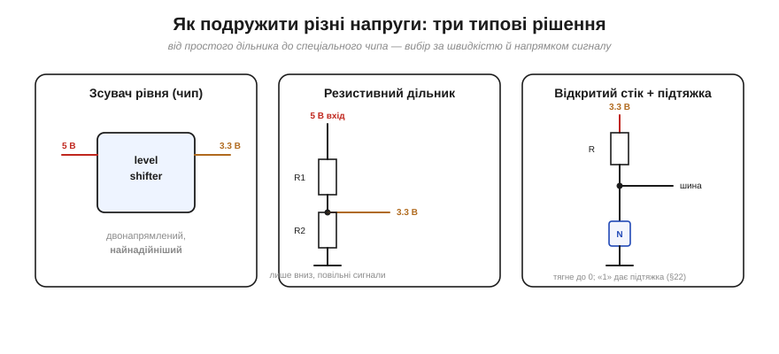
*Рис. 3.1.4.5. Меню рішень. **(а) Зсувач рівня** — спеціальний чип (*level shifter*), що має дві сторони з різними напругами; двонапрямний, найнадійніший, для швидких шин. **(б) Резистивний дільник** — два резистори опускають 5 В до 3.3 В; дешево, але лише «вниз» і лише для **повільних** сигналів (ємність лінії з резисторами сповільнює фронт — а це вже §3.1.5). **(в) Відкритий стік + підтяжка** — вихід лише «тягне до 0», а «1» дає резистор-підтяжка до **потрібної** шини; так стикують пристрої на спільній лінії (саме на цьому стоїть шина I2C — Модуль 6, а механіка відкритого стоку — §4.4). Для **двонапрямного** мосту між двома різними напругами самої підтяжки замало — там беруть **MOSFET-зсувач** із підтяжками з обох боків (класична схема NXP AN10441).*

Вибір залежить від напрямку (вгору чи вниз), швидкості та того, скільки ліній зсувати. Для одного повільного сигналу «вниз» вистачить дільника; для швидкої двонапрямної шини беруть чип-зсувач; а «відкритий стік + підтяжка» добре працює для шини **на одній напрузі** (як I2C) чи для простого зсуву «вниз», коли вхід нижчого боку витримує такий рівень, — але для двонапрямного зсуву **між різними доменами** зазвичай беруть MOSFET-зсувач (підтяжки з обох боків). Деталі цих схем — попереду (§4.4 і Модуль 6); тут важливо засвоїти сам принцип: **різні напруги стикують через зсувач, а не «дротом навпростець»**.

> 🔧 **Навіщо це.** Найдорожча помилка початківця — подати 5 В прямо на 3.3-вольтовий пін (наприклад, ESP32), бо «ну це ж цифровий сигнал, логічно все сходиться». Логічно — так, а електрично ви ллєте струм у захисний діод входу, і чип повільно (або швидко) вмирає. Перш ніж з'єднати два цифрові пристрої, завжди питайте обидва: **(1)** чи дотягують рівні (VOH ≥ VIH)? **(2)** чи витримає вхід цю напругу (чи він 5V-tolerant)? Якщо хоч на одне «ні» — між ними потрібен зсувач. Ці два питання — обов'язковий ритуал перед кожним стиком.

---

Підсумок §3.1.4: пороги «0» і «1» задає **логічне сімейство** — стандарт рівнів і поведінки. Дві головні лінії: **TTL** (на BJT, 5 В, несиметричні пороги, споживає струм) і **CMOS** (на парах MOSFET, вихід до шин, ≈ 0.3/0.7 Vdd, майже без статичного струму, вхід не можна лишати висіти). Логіка історично **спускається** драбиною напруг (5 → 3.3 → 1.8 В…) заради економії й швидкості, платячи меншим абсолютним запасом. Стикуючи сімейства, перевіряють **два окремі** питання: **логічне** (чи VOH ≥ VIH і VOL ≤ VIL) та **електричне** (чи витримає вхід напругу). 3.3 В CMOS керує 5 В TTL напряму, але не 5 В CMOS; а 5 В на 3.3-вольтовий вхід без захисту — шлях до згорілого чипа. Не сходиться — ставлять **зсувач рівня**. Ми кілька разів згадали, що з резисторами «фронт сповільнюється», а млявий перехід небезпечний у забороненій зоні. Час нарешті розібратися з самими **фронтами**: чому перемикання не миттєве й чому його швидкість так важить.

---

## 3.1.5 Фронти й час наростання: чому не миттєво

Малюючи досі цифрові сигнали, ми зображали 0 і 1 як **миттєві стрибки** — вертикальні стінки прямокутного імпульсу. Це зручна брехня. Насправді жоден сигнал не змінюється за нуль часу: перехід із 0 у 1 — це коротка, але цілком вимірна **подорож** напруги вгору, а з 1 у 0 — униз. Ці переходи називають **фронтами** (*edges*): передній (наростання, *rising edge*) і задній (спад, *falling edge*). У цьому підрозділі ми з'ясуємо, **чому** перемикання займає час, **скільки** саме, від чого залежить — і чому надто повільний фронт небезпечний, а надто швидкий теж недобрий.

### Ідеальний стрибок проти реального фронту

Подивімося на одне-єдине перемикання зблизька. Замість вертикальної стінки ми побачимо знайому з Розділу 2.1 криву — **експоненту**.


*Рис. 3.1.5.1. Сіра штрихова лінія — ідеал (миттєвий стрибок), якого не буває. Зелена крива — реальність: напруга наростає плавно, за експонентою. Оскільки «хвости» експоненти тягнуться довго, домовилися міряти швидкість фронту не «від 0 до 100%», а від **10% до 90%** розмаху — цей проміжок і називають **часом наростання** (*rise time*, tr). Спад (*fall time*, tf) міряють дзеркально, від 90% до 10%.*

Чому саме 10–90%, а не 0–100%? Бо математично експонента наближається до кінцевого рівня **нескінченно** довго (останній відсоток «доповзає» вічно), тож «час до 100%» — нескінченність, нею не поміряєш. А ось 10–90% — це чітко окреслена, повторювана величина. Це інженерна конвенція, як і пороги: домовилися — і користуємося.

### Звідки експонента: RC-заряджання вузла

Чому взагалі експонента, а не, скажімо, пряма? Відповідь — пряме повернення до **§2.1.4**. Будь-який вузол схеми має **ємність** (*capacitance*, C): це затвор приймача (пам'ятаєте, у §2.7.7 затвор MOSFET — це конденсатор?), плюс ємність самого дроту/доріжки, плюс входи всіх під'єднаних чипів. А драйвер, що цей вузол перемикає, має скінченний **вихідний опір** (*output resistance*, Rout) — він не може віддати нескінченний струм. Маємо резистор, що заряджає конденсатор, — і це рівно та сама **RC-ланка**, чию експоненту ми вивели в Розділі 2.1.

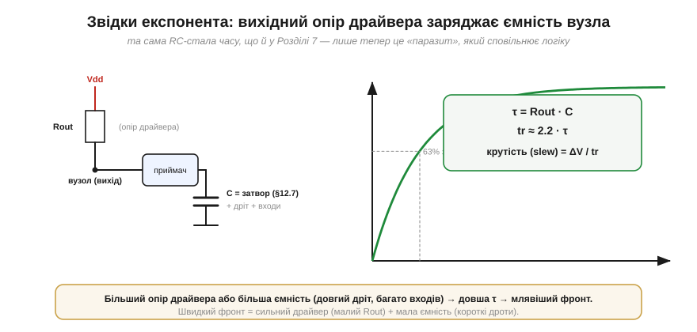
*Рис. 3.1.5.2. Причина фронту — RC. Вихідний опір драйвера Rout заряджає сумарну ємність вузла C (затвор приймача + дріт + входи) — і напруга на ній наростає за тією самою експонентою, що в §2.1.4, досягаючи 63% за час τ = Rout·C. Час наростання виходить tr ≈ 2.2·τ, а крутість фронту (*slew rate*) — це ΔV/tr. Більший опір чи більша ємність → млявіший фронт.*

Звідси й проста арифметика фронту. Стала часу — τ = Rout·C (як у §2.1.4), а час наростання 10–90% дорівнює:

```
tr ≈ 2.2 · τ = 2.2 · Rout · C
```

(множник 2.2 — це просто скільки сталих часу вкладається між 10% і 90% експоненти). Крутість фронту описують ще й **швидкістю наростання** (*slew rate*) — скільки вольтів за наносекунду долає сигнал: slew ≈ ΔV/tr. І найважливіший практичний висновок прямо з формули: фронт **сповільнюють** великий опір драйвера й велика ємність навантаження. Хочете крутий фронт — потрібен **сильний драйвер** (малий Rout) і **мала ємність** (короткі дроти, небагато входів на лінії).

**Приклад (час наростання з RC).** Драйвер має вихідний опір Rout = 100 Ом і керує вузлом з ємністю C = 50 пФ (затвор + коротка доріжка). Який час наростання й крутість при Vdd = 3.3 В?

```
τ  = Rout · C = 100 Ом × 50 пФ = 100 × 50×10⁻¹² = 5 нс
tr ≈ 2.2 · τ = 2.2 × 5 нс ≈ 11 нс
slew ≈ (0.8 × 3.3 В) / 11 нс ≈ 2.64 / 11 ≈ 0.24 В/нс
```

Одинадцять наносекунд — здавалося б, дрібниця. Та коли ми захочемо передавати десятки мільйонів бітів за секунду, ці наносекунди стануть вирішальними. А ще згадаймо §3.1.4: якщо «зсунути рівень» дешевим резистивним дільником, ми **додаємо** опір у це коло — τ зростає, фронт млявіє; ось чому дільник годиться лише для повільних сигналів.

### Чому крутість важить (1): час у забороненій зоні

Перша причина дбати про крутість фронту — прямо з §3.1.2. Поки сигнал **їде** від 0 до 1, він неминуче проходить крізь **заборонену зону** (VIL…VIH), де вихід приймача невизначений. Що повільніший фронт — то **довше** сигнал стирчить у цій небезпечній смузі, ризикуючи бути неправильно прочитаним, спричинити дзвін чи наскрізний струм.

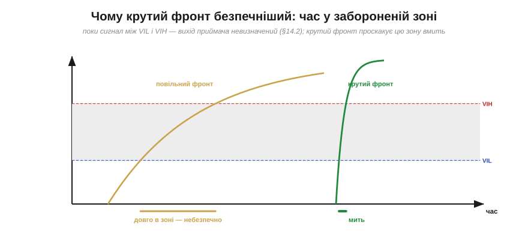
*Рис. 3.1.5.3. Заборонена зона (сіра) — однакова, а час перебування в ній — різний. Повільний фронт (бурштиновий) повзе крізь неї довго: увесь цей час приймач «не знає», 0 це чи 1. Крутий фронт (зелений) проскакує зону майже миттєво. Тому правило: крізь заборонену зону треба проходити **якнайшвидше** — мінімізувати час «непевності».*

Це робить крутий фронт не примхою, а вимогою **надійності**: що менше часу сигнал проводить «ні там ні сям», то менше шансів, що шум саме в цю мить зіб'є приймача з пантелику. Коли ж сигнал за природою повільний (наприклад, з механічної кнопки), його фронт спеціально «загострюють» — але це вже §3.1.6.

### Затримка поширення — не те саме, що крутість фронту

Тут варто розвести два поняття, які початківці постійно плутають. **Час наростання** (tr) — це наскільки **крутий** сам фронт. А **затримка поширення** (*propagation delay*, tpd) — це наскільки **пізніше** вихід зреагував на вхід. Це різні числа про різні речі.

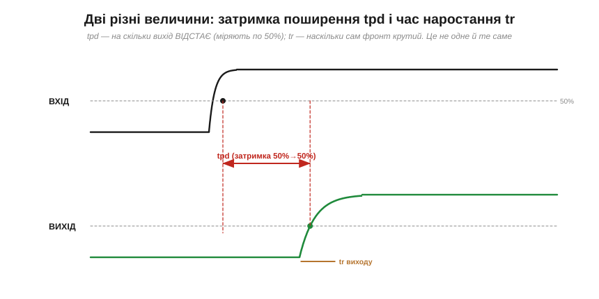
*Рис. 3.1.5.4. Вхід (угорі) змінився — і лише через час tpd на нього відгукнувся вихід (унизу). Затримку поширення міряють між точками **50%** входу й виходу: це «реакція із запізненням». А час наростання tr — це окремо, крутість самого вихідного фронту. Один елемент може мати велику затримку, але крутий фронт — і навпаки.*

Навіщо розрізняти? Бо вони обмежують різні речі. **Крутість** (tr) визначає, як швидко сигнал проскакує заборонену зону й наскільки високу частоту взагалі здатна нести лінія. **Затримка** (tpd) накопичується вздовж ланцюга елементів і визначає, як довго сигнал «продирається» крізь логіку від входу до результату — а це вже впирається в тактування, до якого ми дійдемо в Розділі 3.3 (де затримки складаються в обмеження setup/hold) і Розділі 3.5 (де вони задають максимальну частоту процесора). Поки що досить твердо засвоїти: **tr — про крутість, tpd — про запізнення**.

### Чому крутість важить (2): межа швидкості

Друга причина дбати про фронт — він ставить **стелю швидкості**. Логіка не може перемикатися швидше, ніж формуються її фронти. Якщо ви спробуєте слати біти з періодом, близьким до часу наростання, сигнал просто **не встигатиме** дійти до повного рівня, перш ніж настане час наступного біта.


*Рис. 3.1.5.5. Угорі період набагато більший за tr: кожен біт встигає дійти до повної шини, рівні чисті, «око» (проміжок між 0 і 1) широко відкрите. Унизу період майже дорівнює tr: біти зливаються, сигнал не доходить до рівнів, «око» закривається — приймач уже не може певно відрізнити 0 від 1. Фронт перетворився на стелю швидкості.*

Інженери навіть пов'язали час наростання зі **смугою** (*bandwidth*) лінії простим правилом: BW ≈ 0.35 / tr. Що крутіший фронт, то вищу частоту лінія пропустить. А «око» (*eye*) — це той просвіт між траєкторіями 0 і 1: поки воно відкрите, приймач читає надійно; коли закрилося — починаються помилки. Ми ще зустрінемо цей образ у Розділі 3.5 (тактова частота) і в Модулі 6 (швидкі шини й радіо).

**Приклад (стеля швидкості).** Лінія має час наростання tr = 11 нс (з прикладу вище). Яку приблизно максимальну швидкість вона потягне?

```
смуга:    BW ≈ 0.35 / tr = 0.35 / 11 нс ≈ 32 МГц
для чистих рівнів треба період ≳ 3·tr ≈ 33 нс
макс. швидкість ≈ 1 / 33 нс ≈ 30 Мбіт/с
```

Тобто з такими фронтами більше ніж ~30 мегабіт за секунду цією лінією надійно не передаси. Хочеш швидше — роби фронт крутішим: сильніший драйвер, коротші дроти, менша ємність. Усе впирається в ту саму RC.

### Зворотний бік: надто крутий — теж погано

Здавалося б, висновок простий: роби фронти якнайкрутішими. Але ні — і в цьому тонкість. **Надто** крутий фронт породжує власні біди. Різкий перепад напруги збуджує паразитні **індуктивності** (Розділ 2.2) і ємності дротів, і сигнал починає **дзвеніти** — коливатися з викидами вище Vdd й нижче нуля (*overshoot / ringing*). Ці викиди можуть залазити за абсолютні межі входу (як перенапруга з §3.1.4), різкі фронти **випромінюють** електромагнітну заваду (*EMI*), яка псує сусідні кола, а на довгих лініях круте перемикання дає **відбиття** (про них — у Розділі 6.8, де ми вивчимо лінії передачі й хвильовий опір).

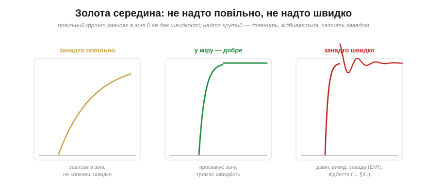
*Рис. 3.1.5.6. Три фронти. Зліва — занадто повільний: зависає в забороненій зоні, не дає швидкості. Посередині — у міру: проскакує зону, тримає швидкість, не дзвенить. Справа — занадто крутий: викид над Vdd, затухаючий дзвін, електромагнітна завада й відбиття. Інженерія цифрового сигналу — це пошук **золотої середини** між «достатньо швидко» і «не аж так».*

Тому грамотні драйвери часто мають **кероване** наростання (*slew-rate control*) — їх навмисно роблять не «якнайшвидшими», а «рівно настільки крутими, скільки треба». Це класичний інженерний компроміс: достатньо круто, щоб проскочити заборонену зону й нести потрібну швидкість, але не настільки, щоб дзвеніти й світити завадою.

> 🔧 **Навіщо це.** Практичні наслідки, до яких ми ще повернемося. Якщо лінія «не тягне» швидкість — підозрюйте ємність: довгий дріт, забагато входів, слабкий драйвер (велика RC). Якщо натомість усе **дзвенить**, гріється й фонить — фронти, можливо, надто круті для цієї довжини дроту, і їх варто пригальмувати (послідовний резистор — поширений прийом). А ще: ніколи не лишайте швидку лінію «висіти» довгим зайвим дротом — кожен зайвий сантиметр додає ємності (сповільнює) та індуктивності (дзвенить). Більшість «незрозумілих» цифрових багів на високій швидкості — це або з'їдений запас (§3.1.3), або зіпсований фронт (цей підрозділ).

---

Підсумок §3.1.5: перемикання **не миттєве**, бо драйвер з опором Rout заряджає ємність вузла C — це RC-ланка з §2.1, тож напруга наростає за **експонентою**. Швидкість фронту міряють **часом наростання** tr (10%→90%), і tr ≈ 2.2·Rout·C; крутість описує slew rate. Крутий фронт важливий двічі: він **скорочує час у забороненій зоні** (§3.1.2 — надійність) і **піднімає стелю швидкості** (BW ≈ 0.35/tr). Затримку поширення tpd (запізнення виходу, по 50%) не можна плутати з tr (крутістю фронту). Але **надто** крутий фронт дзвенить, дає викиди й EMI — тож існує **золота середина**, і драйвери часто роблять із керованою крутістю. Ми двічі згадали, що повільний чи зашумлений сигнал спеціально «загострюють» на вході. Настав час побачити, як саме аналоговий, млявий сигнал перетворюють на чисту цифру — і завершити розділ тим самим компаратором із гістерезисом, що чекав на нас іще з §2.8.

---

## 3.1.6 Перетворення аналог→цифра на порозі (компаратор/Шмітт)

Увесь цей розділ ми працювали з чистими «0» і «1», ніби вони беруться нізвідки. Та світ — аналоговий: давачі, кнопки, антени дають **плавну** напругу. Десь має бути **межа**, на якій аналог стає цифрою. Ця межа — **поріг**, а пристрій, що на ній стоїть, нам уже знайомий: це **компаратор** (§2.8.7), а в кращому варіанті — **тригер Шмітта** (§2.8.8). Цим підрозділом ми замикаємо коло: усе, що Модулі 1–2 збудували в аналозі, **заходить** у цифровий світ Модуля 3 саме тут, крізь поріг. І, як побачимо наприкінці, той самий механізм відкриває двері до пам'яті — теми наступних розділів.

### Найпростіший аналого-цифровий перетворювач — це одне рішення

Коли кажуть «оцифрувати сигнал», зазвичай уявляють складний АЦП, що видає багатобітне число (його ми вивчимо в Розділі 4.8). Та найпростіший перетворювач аналога в цифру дає лише **один біт** — і це просто відповідь на запитання «**сигнал вище опорної напруги чи ні?**». А пристрій, що ставить це запитання, — звичайний **компаратор** із §2.8.7: два входи, і вихід стрибає у «високо» чи «низько» залежно від того, котрий вхід більший.

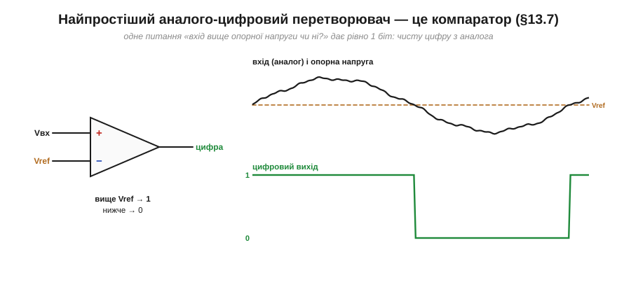
*Рис. 3.1.6.1. Подаємо аналоговий сигнал на один вхід компаратора, опорну напругу Vref — на інший. Вихід стає «1» щоразу, коли сигнал піднімається вище Vref, і «0», коли опускається нижче. Це і є народження цифри: безмежна аналогова шкала стиснулася до одного біта — «вище / нижче». Вхід кожного логічного елемента **поводиться** як такий пороговий вирішувач: його вхідний каскад (КМОН-пара) перемикається біля свого порога — не окремий компаратор, але результат той самий: напруга на лінії стає чітким 0 чи 1.*

Ось чому в §3.1.2 ми могли впевнено казати «приймач питає лише: вище порога чи ні» — бо вхід **поводиться як пороговий вирішувач**: його вхідний каскад (КМОН-інвертор-буфер) перемикається біля свого порога. У звичайній КМОН-логіці це не окремий компаратор, а сама вхідна пара транзисторів зі своїм порогом — але поводиться вона так само: рішення «вище/нижче порога». (А там, де треба завадостійкий поріг із гістерезисом, на вхід ставлять справжній **тригер Шмітта** — про нього далі.)

### Біда одного порога: дребезг

Та з одним порогом є халепа, і ми її вже передчували в §3.1.2 (заборонена зона) та §3.1.5 (млявий фронт). Якщо сигнал повільний і **зашумлений**, то поблизу порога шум кидає його то трохи вище, то трохи нижче межі — і компаратор слухняно перемикається **багато разів** замість одного. Замість чистого переходу 0→1 на виході виникає **дребезг** (*chatter*) — пачка хибних імпульсів.

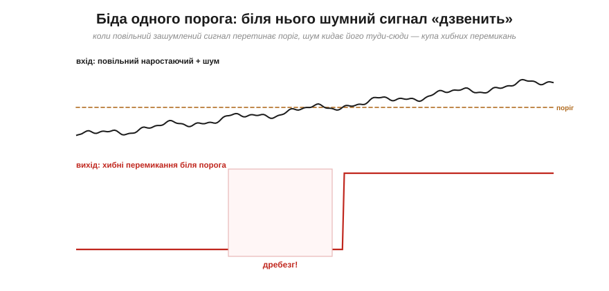
*Рис. 3.1.6.2. Повільний сигнал перетинає єдиний поріг — і саме в цю мить шум багато разів перекидає його через межу. Вихід вибухає чергою хибних перемикань (підсвічена зона «дребезгу»). Для логіки далі це катастрофа: один натиск кнопки обернеться на десяток, один перехід давача — на серію фантомних подій.*

Корінь біди той самий, що й усього розділу: біля єдиної межі **немає запасу**. Сигнал увесь час «впритул» до рішення, тож найменший шум змінює відповідь. Потрібен той самий механізм, що рятував нас від шуму всюди, — **запас**, тільки тепер вбудований у саме рішення.

### Ліки — гістерезис: два пороги замість одного

Розв'язок винайдено давно й він елегантний: замість одного порога зробити **два**. Вихід перемикається в «1» лише коли сигнал піднявся вище **верхнього** порога VT+, а назад у «0» — лише коли опустився нижче **нижнього** порога VT−. Між ними вихід **тримає** свій останній стан, незворушно ігноруючи шум. Цей розрив між порогами зветься **гістерезис** (*hysteresis*), а компаратор із ним — **тригер Шмітта** (*Schmitt trigger*, §2.8.8).

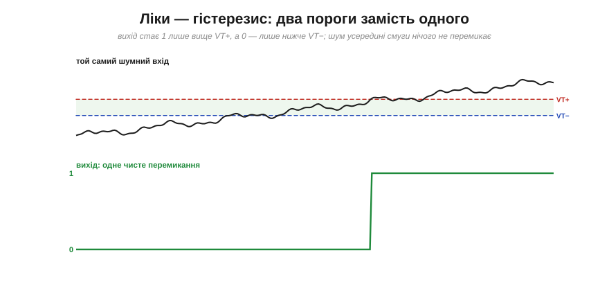
*Рис. 3.1.6.3. Той самий зашумлений сигнал — але тепер пороги два, а між ними «мертва смуга» (зелена). Вихід стає «1», лише коли сигнал упевнено пробив VT+, і лишається «1», доки той не впаде аж нижче VT−. Шум, що гойдається в межах смуги, **не дістає** до протилежного порога — тож жодного хибного перемикання: один сигнал, одне чисте перемикання.*

Ідея проста до геніальності: **щойно ми ухвалили рішення, ми робимо протилежне рішення «дорожчим»**. Перемкнулися в «1»? Тепер, щоб повернутися в «0», сигнал має впасти не просто нижче колишнього порога, а суттєво нижче — аж за VT−. Доки шум менший за ширину смуги, він безсилий. Це той самий запас завадостійкості з §3.1.3, але вбудований прямо в акт перетворення.

### Передавальна характеристика: петля з пам'яттю

Найкрасивіше видно суть гістерезису на **передавальній характеристиці** — графіку «вихід від входу».


*Рис. 3.1.6.4. Вихід залежить не лише від того, який вхід **зараз**, а й від того, **звідки** ми прийшли. Піднімаючи вхід від нуля, вихід тримає «0» аж до VT+, тоді стрибає в «1». Опускаючи назад, вихід тримає «1» аж до VT−, тоді падає в «0». Виходить **петля**: на тому самому вході (всередині смуги) вихід може бути і 0, і 1 — залежно від історії. Праворуч — умовний символ тригера Шмітта: гліф цієї петлі всередині буфера.*

А тепер зверніть увагу на щось глибоке. Усередині смуги один і той самий вхід дає **два можливі** виходи — і який саме, вирішує **минуле**. Це означає, що тригер Шмітта **пам'ятає** свій стан: він зберігає один біт інформації. Запам'ятайте цю думку — бо схема, що «пам'ятає» завдяки тому, що її вихід впливає сам на себе, це вже не просто перетворювач. Це зародок **пам'яті**, і саме з нього в Розділі 3.3 виростуть засувки й тригери, з яких збудовано всю цифрову пам'ять.

**Приклад (гістерезис проти шуму).** Сигнал давача має розмах шуму близько 0.6 В (від піка до піка). Які пороги вибрати, щоб не було хибних перемикань?

```
треба:  смуга VH  >  розмах шуму  ≈ 0.6 В
вибір:  VT+ = 2.0 В,  VT− = 1.2 В
VH = VT+ − VT− = 0.8 В  >  0.6 В   →  шум смугу не «перестрибне»
```

Смуга 0.8 В ширша за 0.6 В шуму, тож, перемкнувшись на одному порозі, сигнал зі своїм шумом просто не дістане до іншого — дребезгу не буде. Що брудніший сигнал, то ширший гістерезис потрібен (платою є те, що поріг перемикання стає менш точним — знову компроміс).

### Як зроблено: додатний зворотний зв'язок

Звідки беруться «два пороги»? З **додатного зворотного зв'язку** (*positive feedback*) — того самого механізму з §2.8.8. Частинку вихідного сигналу повертають назад на вхід компаратора так, щоб вона **зсувала опорну напругу** в бік, що зміцнює поточний стан.

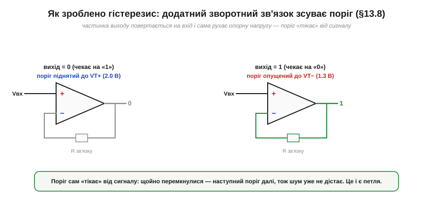
*Рис. 3.1.6.5. Поки вихід «0», зворотний зв'язок тримає поріг **піднятим** до VT+ — щоб перемкнутися в «1», сигнал має постаратися. Щойно вихід став «1», зв'язок **опускає** поріг до VT− — тепер уже важко повернутися в «0». Поріг наче «тікає» від сигналу в бік щойно ухваленого рішення. Ось чому пороги два: їх по черзі рухає сам вихід.*

Це пряма протилежність **від'ємному** зворотному зв'язку, який у §2.8 робив підсилювач сумирним і точним. Тут зв'язок **додатний** — він не заспокоює, а навпаки, «підштовхує» рішення до краю, роблячи перемикання різким і незворотним (доки сигнал не дійде до протилежного порога). Та сама додатна петля, що в підсилювачі була б катастрофою (самозбудження), тут — корисний інструмент, що дарує і чистий фронт, і пам'ять.

### Навіщо: загострити млявий сигнал

Тепер зберімо все докупи — навіщо тригер Шмітта потрібен на практиці. Він робить дві речі, яких компаратор з одним порогом не вміє: **вбиває дребезг** і **загострює млявий фронт**. Згадаймо проблему §3.1.5: повільний фронт довго стирчить у забороненій зоні. Подайте його на тригер Шмітта — і на виході отримаєте **різкий, чистий** перехід, хоч вхід повз як завгодно повільно.

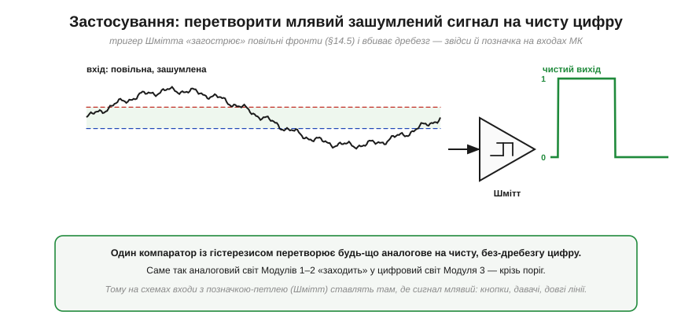
*Рис. 3.1.6.6. Зліва — повільна, зашумлена синусоїда (типовий «брудний» сигнал реального світу). Праворуч — після тригера Шмітта — бездоганний меандр без жодного дребезгу. Один компаратор із гістерезисом «загострює» будь-що аналогове до чистої цифри. Саме тому на схемах входи з позначкою-петлею (Шмітт) ставлять там, де сигнал млявий чи брудний: кнопки, давачі, довгі лінії, генератори.*

> 🔧 **Навіщо це.** Це поняття ви зустрічатимете постійно — і в залізі, і в даташитах. Багато цифрових входів (логічні буфери, чимало входів мікроконтролерів) мають **гістерезис — «Schmitt-trigger inputs»**: виробник навмисно вбудував два пороги, щоб пін надійно читав навіть млявий чи зашумлений сигнал. Чи має гістерезис **конкретний** пін **конкретного** чипа — звіряйте за його даташитом (для ESP32, наприклад, у DC-характеристиках задано пороги VIH ≈ 0.75·VDD і VIL ≈ 0.25·VDD). Коли далі (§4.4.5) ми боротимемося з **дребезгом механічної кнопки**, тригер Шмітта буде одним із апаратних рішень. А коли робитимемо генератор тактового сигналу чи зчитуватимемо давач із плавним виходом — знову він. Правило просте: **сигнал млявий або брудний — постав поріг із гістерезисом**, і цифра далі буде чистою.

---

Підсумок §3.1.6: найпростіший аналого-цифровий перетворювач — це **компаратор** (§2.8.7), що дає 1 біт: «вхід вище опорної напруги чи ні». Саме такий «вирішувач» сидить на кожному цифровому вході. Та один поріг біля повільного зашумленого сигналу дає **дребезг** — пачку хибних перемикань. Ліки — **гістерезис**: два пороги (VT+ і VT−) із «мертвою смугою» між ними, де вихід тримає стан; це **тригер Шмітта** (§2.8.8), зроблений **додатним зворотним зв'язком**. Його передавальна характеристика — **петля**: вихід залежить від історії, тобто схема **пам'ятає** один біт (місток до Розділу 3.3). На практиці тригер Шмітта **загострює** мляві фронти й **вбиває дребезг**, тому ним оснащують входи МК, кнопки й давачі.

---

### Підсумок Розділу 3.1

Ми пройшли весь шлях від питання «навіщо взагалі цифра» до конкретного заліза, що її творить. Цифру обирають тому, що **дискретний сигнал переживає шум**, який знищив би аналог (§3.1.1). «0» і «1» виявилися не числами, а **діапазонами** напруг із забороненою зоною між ними (§3.1.2), а відстань між тим, що драйвер дає, і тим, що приймач вимагає, — це **запас завадостійкості**, який ми навчилися рахувати й берегти (§3.1.3). Конкретні рівні задає **логічне сімейство** (TTL/CMOS, 5/3.3 В), і стик різних сімейств треба перевіряти на сумісність (§3.1.4). Перемикання **не миттєве** — це RC-фронт зі своїм часом наростання, від якого залежать і надійність, і швидкість (§3.1.5). А на самій межі аналога й цифри стоїть **компаратор із гістерезисом**, що перетворює плавний шумний світ на чисті 0 і 1 (§3.1.6). Тепер у нас є надійні, стійкі до шуму логічні рівні — будівельний матеріал, з якого далі ми складемо **логіку**.

> ▶️ Далі: [Розділ 3.2 — Логічні вентилі й комбінаційні схеми](../ch15-logic-gates/ch15-logic-gates.md)
