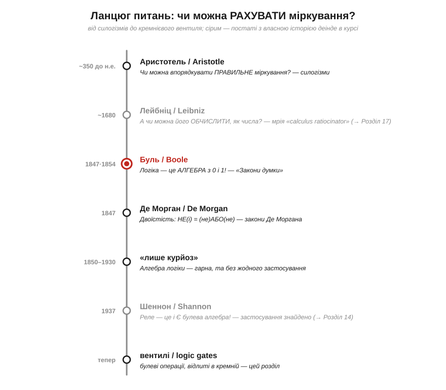
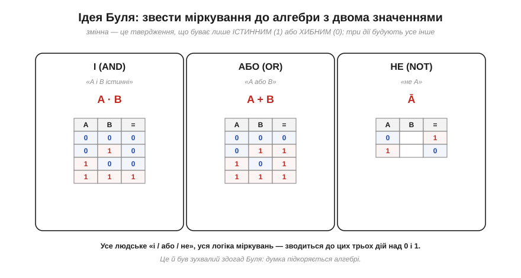
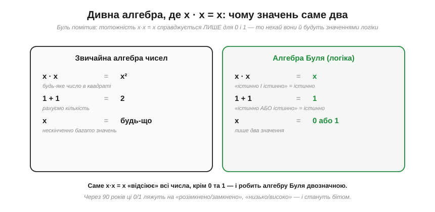
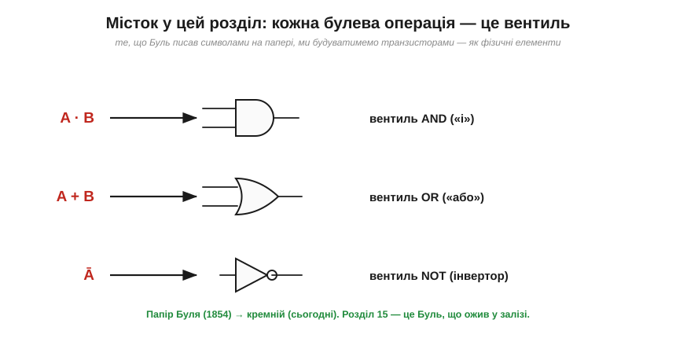

# 📜 Історія до Розділу 15 — Джордж Буль: алгебра, що навчилася думати

> Це історична вставка до [Розділу 15 «Логічні вентилі й комбінаційні схеми»](ch15-logic-gates.md). Вона веде **ланцюгом питань**, що тягнеться від давньої мрії — «а чи можна **обчислити** міркування, як числа?» — до конкретної відповіді: можна, якщо звести логіку до алгебри з двома значеннями. Цю алгебру збудувала одна людина, син бідного шевця, за **дев'яносто років** до першого комп'ютера — і збудувала так досконало, що ми досі нічого кращого не маємо. Кожне `&&` у вашому коді, кожен вентиль у кремнії, саме слово «булів» — це його закам'янілий слід. Ця історія — пряма передісторія тієї, що ви вже читали про [Шеннона (Розділ 14)](../ch14-logic-levels/ch14-history-shannon.md): Буль виготовив інструмент, а Шеннон через дев'ять десятиліть знайшов, до чого його прикласти.

Уявіть, що ви — математик початку XIX століття. Алгебра вже вміє разюче багато: символи, рівняння, операції чудово описують числа, геометрію, рух планет. І виникає зухвале питання: а що, як ці самі символи здатні описати не лише **кількість**, а й саме **міркування** — оте людське «якщо… то…», «і», «або», «не»? Що, як думку можна порахувати? Пройдімо шлях, яким людство дійшло до «так».

*Рис. 15.0.1. Кожен щабель — крок до думки, що логіку можна **обчислювати**. Сірим — постаті з власною історією деінде в курсі (Лейбніц повернеться в Розділі 17, Шеннон — це Розділ 14). Червоний вузол — Буль, на якому абстрактна мрія стала строгою алгеброю.*

---

## Давня мрія: обчислити міркування

Думка, що міркування підкоряється **правилам**, стара як філософія. Ще **Аристотель** (*Aristotle*, ~384–322 до н. е.) звів правильні умовиводи до **силогізмів** — шаблонів на кшталт «усі люди смертні; Сократ — людина; отже, Сократ смертний». Це вже була логіка як **форма**, незалежна від змісту: підставляй що завгодно у правильний шаблон — і висновок гарантовано вірний. Та силогізми лишалися **словесними**: їх треба було розпізнавати й застосовувати на око, а не рахувати.

Через дві тисячі років з'явився мрійник, що захотів більшого. **Ґотфрід Вільгельм Лейбніц** (*Gottfried Wilhelm Leibniz*, 1646–1716) — той самий, що незалежно від Ньютона винайшов числення — марив про **calculus ratiocinator**, «числення міркувань»: універсальну символьну мову, якою будь-яку суперечку можна було б розв'язати, просто **порахувавши**. Його гасло переказують так: «Calculemus!» — «Обчислімо!». Замість сперечатися — сядьмо й порахуймо, хто має рацію. Лейбніц навіть намацав, що для цього згодилася б **двійкова** система, лише з 0 і 1 (її історію ми окремо розгорнемо в [Розділі 17](../ch17-number-representation/ch17-history-leibniz.md)). Та далі за мрію та начерки він не пішов: бракувало самої **алгебри логіки**, яка перетворила б «і / або / не» на дії над символами.

Ось те питання, що повисло у повітрі на ціле століття: **як саме записати логіку алгеброю?** Відповідь дала людина, від якої цього найменше чекали.

---

## Син шевця, що вчив себе сам

**Джордж Буль** (*George Boole*, 1815–1864) народився в англійському Лінкольні в родині бідного **шевця**. Жодних коледжів, жодних впливових учителів — родина не мала грошей на освіту. Та батько, Джон Буль, попри бідність захоплювався наукою, оптикою, майстрував прилади — і прищепив синові спрагу до знань. Решту Джордж зробив сам: **самотужки** вивчив латину й грецьку (щоб читати першоджерела), а потім накинувся на математику — і не на шкільну, а на найважчу, що була: праці Лапласа й Лагранжа французькою.

З шістнадцяти років Буль **учителював**, аби утримувати родину, а в дев'ятнадцять відкрив **власну школу**. Він був класичним самоуком-аутсайдером: без диплома, без академічних зв'язків, він просто почав **публікувати** оригінальні математичні статті — такі добрі, що 1844 року Лондонське королівське товариство дало йому **Королівську медаль** за роботи з операторів і диференціальних рівнянь. Уявіть: провінційний шкільний учитель без вищої освіти отримує одну з найпрестижніших наукових нагород імперії. Це й проклало йому шлях: 1849 року Буля призначили **першим професором математики** в новому Квінз-коледжі в ірландському Корку — попри відсутність будь-якого диплома.

> 🔧 **Навіщо це.** Тримайте цей образ у голові, коли наступного разу почуєте, що для проривів треба «правильна освіта» чи дозвіл авторитетів. Алгебру, на якій стоїть **уся** цифрова цивілізація, вигадав самоук, що вчив грецьку при свічці, бо хотів читати Аристотеля в оригіналі. Найфундаментальніший шар вашого ремесла — логіку «0 і 1» — заклала людина, яка ніколи не сиділа на жодній університетській лекції як студент.

---

## Закони думки: логіка стає алгеброю

Свою головну ідею Буль виклав у двох працях: тоненькій «**Математичний аналіз логіки**» (*The Mathematical Analysis of Logic*, 1847) і ґрунтовній книзі з промовистою назвою «**Дослідження законів думки**» (*An Investigation of the Laws of Thought*, 1854). Назва не випадкова: Буль щиро вважав, що відкриває **математичні закони самого мислення** — як Ньютон відкрив закони руху.

Суть була проста до зухвалості. Нехай кожне **твердження** позначає змінна, що набуває лише **двох** значень: **1**, якщо твердження істинне, і **0**, якщо хибне. Тоді три слова, на яких тримається все міркування, стають трьома **алгебраїчними діями**:

*Рис. 15.0.2. Три дії Буля. **«І»** (*AND*, ·): «A і B істинні» — результат 1, лише коли обидва 1. **«АБО»** (*OR*, +): «A або B» — результат 1, коли істинний хоч один. **«НЕ»** (*NOT*, риска згори): просто перевертає 1↔0. З цих трьох цеглинок Буль будував будь-яке, скільки завгодно складне міркування — як з трьох арифметичних дій будують усю математику чисел.*

Геніальність була в **зведенні**. Усе нескінченне розмаїття людських умовиводів — «якщо йде дощ і я без парасолі, то я змокну, хіба що сховаюся» — Буль показав, **розкладається** на комбінації трьох елементарних операцій над істинністю. Логіка переставала бути мистецтвом красномовства й ставала **обчисленням**: бери твердження-нулі-та-одиниці, застосовуй правила — і висновок виходить **механічно**, без жодного «здається» чи «на мою думку». Мрія Лейбніца про «Calculemus!» нарешті отримала свою алгебру.

---

## Дивна алгебра, де x · x = x

Та алгебра Буля поводилася **дивно** — і саме в цій дивності крилася її сила. У звичайній арифметиці x·x = x² може дати будь-що: 3·3=9, 5·5=25. А в логіці Буля **x·x = x**. Чому? Бо «істинно І істинно» — це знову просто «істинно», а «хибно І хибно» — «хибно». Помножений сам на себе, логічний символ дає сам себе.

*Рис. 15.0.3. Ключова дивина. Тотожність x·x = x у звичайних числах справджується **лише** для 0 і 1 (бо 0·0=0 і 1·1=1, а будь-яке інше число в квадраті змінюється). Буль зробив із цього сміливий висновок: якщо алгебра логіки мусить підкорятися x·x = x, то її змінні можуть набувати **тільки** значень 0 і 1. Так двозначність не нав'язали ззовні — вона **випала** з самої математики.*

Це був момент справжньої елегантності. Буль не постановив «нехай у логіці буде два значення» довільно — він **вивів** двозначність із вимоги, щоб алгебра була несуперечливою. Логіка **мусить** мати рівно два значення, бо лише 0 і 1 переживають закон x·x = x (ця ідемпотентність «множення»-«і» — справді винахід самого Буля).

Тут, однак, варто бути точним, щоб не осучаснити Буля надміру. Звичне нам **1 + 1 = 1** (істинно «або» істинно — все одно істинно) у **самого** Буля ще не працювало так: його «+» було **частковою** операцією — об'єднанням лише **неперетинних** класів (інакше зруйнувалася б його дорогоцінна аналогія зі звичайною алгеброю, де з x + x = x випливало б x = 0). Сучасну, **необмежену** операцію «або» з 1 + 1 = 1 запровадили вже **наступники** Буля — насамперед **Вільям Стенлі Джевонс** (*W. S. Jevons*), а далі Пірс і Шрьодер. Тож коли ми далі пишемо AND/OR/NOT із 1 + 1 = 1, це **сучасна** булева алгебра — відшліфована подальшими поколіннями на фундаменті, що заклав Буль. Йому належить геніальний задум (звести логіку до алгебри двох значень), а чиста сучасна форма — спільна праця його школи.

Запам'ятайте ці 0 і 1. Через дев'яносто років вони ляжуть на «розімкнено / замкнено» реле, «низько / високо» напруги, «нема струму / є струм» — і та сама двійка, що випала з абстрактного x·x = x, стане фізичним **бітом**, з якого збудовано все навколо.

---

## Де Морган і закони двоїстості

Буль був не сам. Його близьким приятелем і запеклим листувальником був **Огастес Де Морган** (*Augustus De Morgan*, 1806–1871) — блискучий лондонський математик, який того ж таки 1847 року теж видав працю з символьної логіки. Між ними точилося жваве, дружнє змагання ідей (Де Морган навіть жартома вирахував, що буде «X років від народження», коли матиме «X² року» — і це справдилося 1849-го).

Де Морган подарував логіці пару тотожностей такої краси й користі, що ми зустрінемося з ними вже зовсім скоро в цьому розділі. **Закони Де Моргана** кажуть: заперечення «і» — це «або» заперечень, а заперечення «або» — це «і» заперечень. Інакше кажучи, **НЕ(A і B) = (НЕ A) або (НЕ B)**. Це не дрібна формальність: саме ці закони пояснять, чому з одного-єдиного типу вентиля (NAND чи NOR) можна побудувати **будь-яку** логіку взагалі — про що піде мова в [§15.3](ch15-logic-gates.md). Двоїстість «і ↔ або», помічена Де Морганом, — одна з найглибших симетрій усієї цифрової техніки.

---

## Дев'яносто років у шухляді

А тепер — найдивовижніше й найповчальніше. Зробивши все це, Буль… не отримав майже жодного **практичного** визнання за життя, і ще довго по смерті. Алгебру логіки сприймали як **філософський курйоз** — гарну, дотепну, та ні до чого не придатну іграшку розуму. Математики бавилися нею, логіки сперечалися про тонкощі, але на питання «а **навіщо** це?» чесної відповіді не було. Світ ще не мав машин, яким здалася б у пригоді алгебра істинності.

Так і пролежала вона **майже сто років** — досконалий інструмент без задачі. Це варто прочути окремо: одне з найважливіших відкриттів в історії техніки майже століття вважали **непотрібним**. Не тому, що воно було погане, — а тому, що світ ще не доріс до проблеми, яку воно розв'язує.

> 🔧 **Навіщо це.** Це чи не найкорисніший урок усієї цієї історії для інженера й дослідника. Фундаментальна, «непрактична» робота може чекати свого застосування **десятиліттями** — а тоді раптом виявитися наріжним каменем цілої індустрії. Булева алгебра, теорія груп, неевклідова геометрія, числа з «уявною» одиницею — усі вони були «нікому не потрібні», поки не стали абсолютно незамінні. Коли наступного разу почуєте «це гарна теорія, але де практика?» — згадайте, що між Булем і першим комп'ютером лягло дев'яносто років.

---

## Аж тут — Шеннон

Розв'язка настала **1937 року**, і ви її вже знаєте. Двадцятиоднорічний студент MIT **Клод Шеннон**, налаштовуючи сотні реле обчислювальної машини, раптом упізнав у їхній поведінці… ту саму алгебру Буля, яку мимохідь зачепив на лекції з філософії. Замкнений контакт — це 1, розімкнений — 0; послідовно — це «і», паралельно — «або». **Курйоз ожив.** Те, що дев'яносто років вважали безплідною грою розуму, виявилося точним описом електричних перемикачів — і стало мовою, якою відтоді проєктують усю цифрову техніку.

Та чесність вимагає додати: Шеннон був **не один**. Ту саму ідею — що булева алгебра описує релейні схеми — незалежно й майже водночас намацали ще двоє. У Японії інженер **Акіра Накасіма** (*Akira Nakashima*, NEC) разом із **Масао Ханзавою** будував алгебричну теорію релейних кіл ще у **1934–1936** роках (двозначної алгебри він дійшов самостійно, не знаючи Буля; його доповідь 1935-го вже включала закони Де Моргана). А в СРСР подібні думки висловив **Віктор Шестаков** — щоправда, його роботу опублікували лише **1941-го**, російською. Чому ж «батьком» цифрової логіки лишився саме Шеннон? Не тому, що був першим, а тому, що його виклад був **найабстрактнішим, найзагальнішим і найвпливовішим** — і вийшов англійською в потрібний час і місці; Накасіма ж тримався ближче до інженерної теорії кіл, а Шестакова стримали мова й пізня публікація. Це знайома вже нам картина (повторимо її з фон Нейманом у Розділі 18): велику ідею часто намацують кілька людей паралельно, а ім'я історія лишає за тим, чий виклад розійшовся найширше. Тож кажучи далі «Шеннон», тримаймо в голові й цих двох.

Повну цю драму — як абстрактна алгебра XIX століття стала інженерією XX-го — розказано окремо, в [історії до Розділу 14 про Шеннона](../ch14-logic-levels/ch14-history-shannon.md). Нам тут важливий сам момент **зустрічі через час**: Буль виготовив ключ, не знаючи, до яких дверей він підійде, а Шеннон через дев'ять десятиліть знайшов замок. Двозначні 0 і 1, що випали в Буля з рівняння x·x = x, у Шеннона стали бітами, а в нас із вами — логічними рівнями Розділу 14.

---

## Трагічний кінець і дивовижна родина

Сам Буль до тріумфу своєї алгебри не дожив навіть близько. Восени **1864 року** він, уже професор у Корку, потрапив під холодний дощ, пройшовши пішки кілька кілометрів до лекції, — і прочитав ту лекцію в **мокрому** одязі. Застуда обернулася важкою гарячкою з запаленням легень. За **поширеною (хоч документально не підтвердженою) версією**, дружина, **Мері Еверест Буль** (*Mary Everest Boole*), вірячи в тодішню химерну ідею «подібне лікують подібним», обкладала хворого **мокрими** простирадлами й лила воду — мовляв, раз застудився від вологи, то волога й вилікує. Чи було так насправді й чи це зашкодило — достеменно невідомо; певне лише, що **8 грудня 1864-го** Джордж Буль помер від запалення легень у **49** років, так і не дізнавшись, що його «непрактична» алгебра колись запустить цифрову епоху.

А родина його — це окрема дивовижна історія, варта згадки. Дружина Мері Еверест Буль стала помітною **викладачкою математики** й була племінницею Джорджа Евереста, на честь якого назвали **найвищу гору світу**. П'ятеро доньок Булів виросли непересічними людьми: **Алісія Буль Стотт** (*Alicia Boole Stott*) стала самобутньою геометркинею, що руками ліпила моделі чотиривимірних тіл і подарувала світу слово «**політоп**»; наймолодша, **Етель Ліліан Войнич** (*Ethel Lilian Voynich*), написала роман «**Овід**» (*The Gadfly*), що став культурним явищем і розійшовся мільйонними накладами (особливо в Російській імперії та згодом у Китаї). Тобто за сухим прикметником «булів» у вашому редакторі коду стоїть не лише геній-самоук, а й ціла родина яскравих доль.

---

## Куди привів цей ланцюг

Озирнімося. Шлях від «чи можна порахувати думку?» до відповіді зайняв тисячоліття — від Аристотелевих силогізмів через Лейбніцеве «Calculemus!» до Булевої алгебри, що нарешті зробила логіку **обчислюваною**. І найголовніше для нас: ці три скромні дії — **«і», «або», «не»** — це і є те, що ми зараз почнемо будувати **залізом**.

*Рис. 15.0.4. Місток у цей розділ. Кожна з трьох операцій Буля втілюється фізичним елементом — **вентилем** (*gate*): A·B стане вентилем **AND**, A+B — вентилем **OR**, Ā — **NOT** (інвертором). Те, що Буль писав символами на папері 1854 року, ми складатимемо з транзисторів. Розділ 15 — це, без перебільшення, Буль, що ожив у кремнії.*

Найвпертіший слід цієї історії — навіть не самі операції, а **двійковість** як така. Буль не обрав два значення з міркувань зручності — вони **випали** з математики (x·x = x), мовляв, інакше не виходить несуперечливої алгебри логіки. А далі фізика підхопила: два стани найлегше й найнадійніше зробити перемикачем (§14.1). Дві окремі історії — математична Булева й фізична Шеннонова — зійшлися на одному: **двійка**. Тримайте це в голові, коли наступний розділ почне будувати з 0 і 1 спершу вентилі, потім суматори, а зрештою — цілий процесор.

А тепер, маючи за плечима і фізичні логічні рівні (Розділ 14), і математичну логіку Буля, перейдімо від історії до самої справи — і запитаймо строго: **що таке булева алгебра як інструмент, і як нею користуватися?**

> ▶️ Далі: [§15.1 Булева алгебра: логіка як математика](ch15-logic-gates.md)
